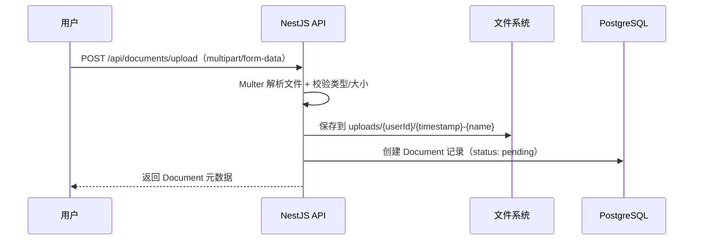
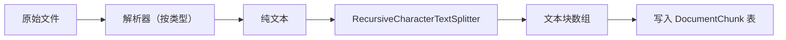
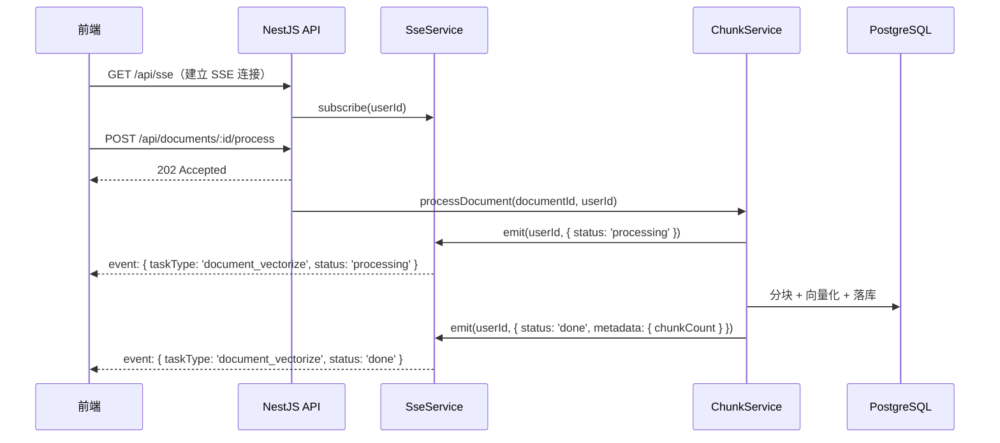
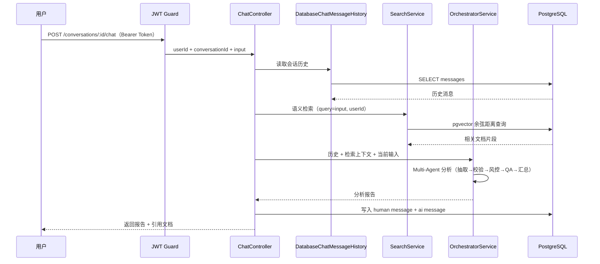

> 本文整理自《2026 前端 AI Agent 工程化实战营》课程资料，作为系列文章第 6 篇。


在第四章，我们已经把 Memory、Tools、Embeddings 和 Multi-Agent 全部跑通了，但这些都只是 **demo 级示例**：所有数据都存在于进程内存或本地文件中。`InMemoryChatMessageHistory` **重启即丢**，`MemoryVectorStore` **进程退出即清空**，`workspace/orders/*.json` 是手写的 mock 数据，更谈不上用户隔离——**无论谁来，都是同一个匿名会话**。

在能力验证阶段或者是学习使用，这完全没问题。**但一旦你打算让这套系统真正服务多个用户、长期运行，并且支持历史回溯**，就必须把数据从内存迁移到数据库，把文件从本地目录迁移到可管理的存储层，把向量从临时容器迁移到可持久检索的引擎中。

**本章将从这里出发，逐步把所有示例以生产形态落地，包括数据库设计与全流程串联等内容。**

同时，本章有一个重要的前提假设：用户系统已经就位。如果你跟着"AI 搞定发布系统"那篇文章搭过 RBAC 权限模块，那么 **JWT 鉴权、用户表、角色权限**这些基础设施已经可以直接复用。本章不会重新搭用户系统，而是在已有用户体系的基础上，为每个用户建立独立的会话、文档和向量空间。

再次声明：请不要直接写代码。所有流程都借助上一篇文章中的 Claude + Superpowers（或其他支持 Spec 模式的 AI IDE）来补齐功能。

我们会把迭代过程控制在可预期的范围内。你需要学习的是系统架构，而不是按部就班地把代码抄写一遍。虽然你仍然需要了解其中的细节、具体的方法，以及 API 的使用方式，但不要再把时间花在具体的编码细节上。给自己招一个 AI 小打杂的，解放生产力。

<aside>

✅ **本章验收点**

*   完成 Prisma Schema 设计：User（复用）、Conversation、Message、Document、DocumentChunk 五张核心表
*   用 pgvector 扩展替换 MemoryVectorStore，向量数据持久化到 PostgreSQL
*   实现文件上传接口，支持 PDF/TXT/MD 格式，元数据入库
*   实现文件解析 → 分块 → 向量化 → 落库的完整 Pipeline
*   会话按用户隔离，历史消息持久化到数据库，重启不丢失
*   统一调用链路：用户登录 → 创建会话 → 上传文档 → 带上下文的智能分析 → 结果持久化
*   **同样地，每个阶段都有对应的 Prompt 可供 AI 生成代码，文中仅展示关键片段。**

</aside>

***

## 5.1 从 Demo 到生产，还差什么

在第四章中，我们已经把所有流程都跑通了，但距离真正上线仍有明显差距：

| **能力** | **第四章实现**                    | **生产级问题**     | **本章方案**                |
| ------ | ---------------------------- | ------------- | ----------------------- |
| 会话记忆   | `InMemoryChatMessageHistory` | 重启丢失，无用户隔离    | PostgreSQL + Prisma 持久化 |
| 向量存储   | `MemoryVectorStore`          | 进程退出即清空，需重新灌库 | pgvector 扩展，持久化检索       |
| 业务数据   | `workspace/*.json` 手写文件      | 无法动态新增，无权限控制  | 文件上传 + 数据库元数据           |
| 用户体系   | 无                            | 所有人共享同一上下文    | 复用 RBAC 用户系统，JWT 鉴权     |
| 工单制品   | `tickets/*.md` 本地文件          | 无法检索，无法关联用户   | 分析结果入库，关联会话与用户          |

**虽然内容看起来很多，但归纳起来，核心差距主要有三点：**

*   **数据不持久**：内存数据随进程消失，无法支撑长期运行
*   **用户不隔离**：没有身份概念，所有请求共享同一上下文
*   **文件不可管理**：本地文件没有元数据、没有权限、没有生命周期管理

本章逐一补齐这些缺口，把每一项能力从"能跑通"推进到"能上线"。

***

## 5.2 系统架构总览

在动手写 Schema 之前，先把整条链路的全貌画清楚：这是本章的“总架构框架”。它的价值不在于画得多漂亮，而在于先把**边界、责任和数据流向**讲清楚，避免后续实现时各节各写各的，最后拼不回一个能上线的系统。
具体来说，总架构框架能帮助你纠正三类常见偏差：

1.  **目标偏差**：每一节都在“加功能”，却不清楚最终要交付的端到端体验是什么。先把“登录 → 会话 → 文档 → 检索 → 分析 → 落库”的闭环定下来，才能保证每一步都有明确的验收点。
2.  **接口偏差**：Schema、Service、Controller、LangChain 链路如果各自定义术语和参数，后续就会出现大量返工。先明确核心对象（userId、conversationId、documentId、chunkId）及其关系，后面实现就能围绕这些接口收敛。
3.  **数据偏差**：容易出现“存了但用不上”“用了但没落库”“检索没做隔离”等问题。先把数据从哪里来、在哪里处理、最终落在哪里讲清楚，才能确保持久化、用户隔离与可追溯性贯穿全章。
    所以你可以把这张总览图当作本章的路线图：后面每一节都只是在把图中的某一个环节从 demo 形态替换成生产形态，并把它重新接回这条主链路。


整条链路可以拆成四个关键环节：

1.  **用户鉴权**：复用已有的 RBAC 用户系统，通过 JWT 识别当前用户
2.  **文档管理**：上传 → 解析 → 分块 → 向量化 → 落库，建立用户私有的知识库
3.  **会话对话**：创建会话 → 发送消息 → 加载历史 → 语义检索 → Multi-Agent 分析 → 结果持久化
4.  **统一存储**：所有数据（用户、会话、消息、文档、向量）都落在同一个 PostgreSQL 实例中

<aside>

📌 **为什么选 pgvector 而不是独立的向量数据库？**

在教学阶段和中小规模场景下，pgvector 的最大优势是**不引入额外服务**。会话、消息、文档元数据和向量全部在同一个 PostgreSQL 里，事务一致性有保障，运维成本也最低。当数据规模真正增长到百万级以上，再考虑切换到 Qdrant、Milvus 等专用向量数据库也不迟——上层接口不依赖具体实现，替换成本可控。

</aside>

***

## 5.3 数据库设计：Prisma Schema 全貌

*   🤖 用 AI 生成本节代码（对应 5.3）

    将以下 Prompt 粘贴到 Claude CLI 中执行：

        在 services/chat 中完成数据库设计与初始化，严格按以下要求执行：

        前置：
        - 安装依赖：prisma @prisma/client
        - 初始化 Prisma：bunx prisma init
        - 在 .env 中配置 DATABASE_URL（PostgreSQL 连接串）

        1. Prisma Schema 设计（schema.prisma）：
           - 启用 pgvector 扩展：generator client 中加 previewFeatures = ["postgresqlExtensions"]，datasource 中加 extensions = [pgvector]
           - User 表已中建好，直接复用，只需在 schema 中保留关联关系
           - Conversation 表：id, title, userId（关联 User）, createdAt, updatedAt
           - Message 表：id, conversationId（关联 Conversation）, role（system/human/ai/tool）, content, metadata（Json?）, createdAt
           - Document 表：id, userId（关联 User）, filename, originalName, mimeType, size, status（pending/processing/completed/failed）, chunkCount, createdAt, updatedAt
           - DocumentChunk 表：id, documentId（关联 Document）, content, chunkIndex, metadata（Json?）, embedding（Unsupported("vector(384)")）, createdAt

        2. Prisma Service：
           - 新建 services/api/src/prisma/prisma.service.ts
           - 新建 services/api/src/prisma/prisma.module.ts（Global module）

        3. 迁移与验证：
           - 执行 bunx prisma migrate dev --name init
           - 执行 bunx prisma generate
           - 手动启用 pgvector 扩展：CREATE EXTENSION IF NOT EXISTS vector

### 5.3.1 整体数据模型

先看全貌。本章的数据模型由五张核心表组成，它们之间的关系很直接：


每张表的设计意图：

*   **User**：复用已有 RBAC 用户系统的结构，不需要重新建表。如果你的用户表字段有差异，只需要保证 `id` 和 `email` 存在即可。
*   **Conversation**：会话容器，绑定到具体用户。对应第四章的 `sessionId`，但现在有了持久化和归属关系。
*   **Message**：会话中的每一条消息。`role` 区分 `system`、`human`、`ai`、`tool` 四种角色，与 LangChain 的消息类型对齐。
*   **Document**：上传文件的元数据。`status` 字段跟踪处理进度（上传 → 解析中 → 完成/失败）。
*   **DocumentChunk**：文件被切分后的文本块，每个块都带有向量嵌入（`embedding` 字段），用于语义检索。

### 5.3.2 Prisma Schema 定义

    // services/api/prisma/schema.prisma

    generator client {
      provider        = "prisma-client-js"
      previewFeatures = ["postgresqlExtensions"]
    }

    datasource db {
      provider   = "postgresql"
      url        = env("DATABASE_URL")
      extensions = [pgvector]
    }

    model User {
      id            String         @id @default(cuid())
      email         String         @unique
      name          String?
      password      String
      role          String         @default("user")
      createdAt     DateTime       @default(now())
      updatedAt     DateTime       @updatedAt
      conversations Conversation[]
      documents     Document[]
    }

    model Conversation {
      id        String    @id @default(cuid())
      title     String    @default("新会话")
      userId    String
      user      User      @relation(fields: [userId], references: [id])
      messages  Message[]
      createdAt DateTime  @default(now())
      updatedAt DateTime  @updatedAt

      @@index([userId])
    }

    model Message {
      id             String       @id @default(cuid())
      conversationId String
      conversation   Conversation @relation(fields: [conversationId], references: [id], onDelete: Cascade)
      role           String       // system | human | ai | tool
      content        String       @db.Text
      metadata       Json?
      createdAt      DateTime     @default(now())

      @@index([conversationId])
    }

    model Document {
      id           String          @id @default(cuid())
      userId       String
      user         User            @relation(fields: [userId], references: [id])
      filename     String          // 存储路径
      originalName String          // 原始文件名
      mimeType     String
      size         Int
      status       String          @default("pending") // pending | processing | completed | failed
      chunkCount   Int             @default(0)
      createdAt    DateTime        @default(now())
      updatedAt    DateTime        @updatedAt
      chunks       DocumentChunk[]

      @@index([userId])
    }

    model DocumentChunk {
      id         String   @id @default(cuid())
      documentId String
      document   Document @relation(fields: [documentId], references: [id], onDelete: Cascade)
      content    String   @db.Text
      chunkIndex Int
      metadata   Json?
      embedding  Unsupported("vector(384)")?
      createdAt  DateTime @default(now())

      @@index([documentId])
    }

<aside>

⚠️ **关于 `vector(384)` 维度**

>384 维对应第四章使用的 `Xenova/paraphrase-multilingual-MiniLM-L12-v2` 模型。如果后续切换到 OpenAI `text-embedding-3-small`（1536 维）或其他模型，需要同步修改此处的维度值，并重新生成迁移。

</aside>

### 5.3.3 关键设计决策说明

**为什么 Message 使用 `onDelete: Cascade`？**

会话删除时，其下所有消息应一并清除。这符合最自然的业务语义——你不会希望数据库里残留一堆没有归属的孤儿消息。同理，DocumentChunk 也应级联删除。

**为什么 Document 的 status 用字符串而不是枚举？**

在教学阶段，字符串更直观，迁移也更灵活。生产环境可以考虑改为 Prisma 的 `enum` 类型，获得更强的类型约束。

**为什么 embedding 字段标记为可选（`?`）？**

因为文档上传和向量化是异步的两步操作。Chunk 创建时可能还没有完成向量化，所以 embedding 允许为空。

### 5.3.5 Prisma Service（全局模块）

```tsx
import { Injectable, OnModuleDestroy, OnModuleInit } from '@nestjs/common';
import { PrismaClient } from '@prisma/client';
import { PrismaPg } from '@prisma/adapter-pg';

@Injectable()
export class PrismaService extends PrismaClient implements OnModuleInit, OnModuleDestroy {
  constructor() {
    const adapter = new PrismaPg({ connectionString: process.env.DATABASE_URL });
    super({ adapter });
  }

  async onModuleInit() {
    await this.$connect();
  }

  async onModuleDestroy() {
    await this.$disconnect();
  }
}

```

```tsx
import { Global, Module } from '@nestjs/common';
import { PrismaService } from './prisma.service';

@Global()
@Module({
  providers: [PrismaService],
  exports: [PrismaService],
})
export class PrismaModule {}

```

**🧪 验证步骤（对应 5.3）**

```bash
# 执行迁移（确保 PostgreSQL 已启动且 .env 中配置了 DATABASE_URL）
cd services/chat
bunx prisma migrate dev --name init
bunx prisma generate

# 验证表结构
bunx prisma studio
```

**验收标准**：Prisma Studio 能打开，五张表结构正确显示；`DocumentChunk` 表包含 `embedding` 列。


注意：此截图里之所以少一张表，是因为实际的项目采用微服务架构。

具体可见项目实现<https://github.com/Cookieboty/Autix>，因此用户表维护在 User-system 中。

***

## 5.4 会话持久化：从 InMemoryHistory 到 PostgreSQL

*   🤖 用 AI 生成本节代码（对应 5.4）

    将以下 Prompt 粘贴到 Claude CLI 中执行：

        在 services/chat 的 LangChain 层中，用 PostgreSQL 替换 InMemoryChatMessageHistory，严格按以下要求执行：

        1. 会话服务：
           - 新建 services/api/src/conversation/conversation.service.ts
           - 实现以下方法：
             - create(userId, title?)：创建会话
             - findByUser(userId)：获取用户所有会话
             - findById(conversationId, userId)：获取单个会话（含权限校验）
             - delete(conversationId, userId)：删除会话

        2. 消息服务：
           - 新建 services/api/src/conversation/message.service.ts
           - 实现以下方法：
             - addMessage(conversationId, role, content, metadata?)：写入消息
             - getHistory(conversationId, limit?)：读取历史消息
             - getHistoryAsLangChainMessages(conversationId)：转换为 LangChain BaseMessage 数组

        3. 自定义 ChatMessageHistory：
           - 新建 services/api/src/conversation/db-chat-history.ts
           - 实现 BaseChatMessageHistory 接口
           - 内部调用 PrismaService 读写 Message 表
           - 与 RunnableWithMessageHistory 兼容

        4. 新增路由（@Controller('api/conversations')）：
           - POST /：创建会话
           - GET /：获取当前用户会话列表
           - GET /:id/messages：获取会话消息历史
           - POST /:id/chat：在指定会话中发送消息（接入 RunnableWithMessageHistory）
           - DELETE /:id：删除会话

        所有接口需要通过 JWT Guard 获取当前用户 ID。

第四章的 `RunnableMemoryService` 使用 `Map<string, InMemoryChatMessageHistory>` 来存储会话，简单直接，但进程重启后数据会全部丢失。本节要做的，是用 PostgreSQL 替换这个 Map。

### 5.4.1 从内存到数据库：变化了什么，不变的是什么

变化的是存储层：

*   `Map<string, InMemoryChatMessageHistory>` → Prisma 操作 `Conversation` + `Message` 表
*   `sessionId` → `conversationId`（有了真实的数据库主键）
*   匿名会话 → 用户绑定会话（通过 `userId` 关联）

不变的是调用方式：

*   `getMessages()` 仍然返回 `BaseMessage[]`
*   `addMessage()` 仍然接受 `BaseMessage`
*   `RunnableWithMessageHistory` 的使用方式完全不变

这就是第四章强调"上层不依赖具体实现"的实际收益——底层存储换了，上层代码几乎不需要改动。

### 5.4.2 自定义 DatabaseChatMessageHistory

LangChain 的 `BaseChatMessageHistory` 要求实现 `getMessages()` 和 `addMessage()` 两个核心方法。我们只需要把底层实现从内存操作换成 Prisma 操作即可。

```tsx
// services/api/src/conversation/db-chat-history.ts
import {
  BaseChatMessageHistory,
} from '@langchain/core/chat_history';
import {
  BaseMessage,
  HumanMessage,
  AIMessage,
  SystemMessage,
  ToolMessage,
} from '@langchain/core/messages';
import { PrismaService } from '../prisma/prisma.service';

export class DatabaseChatMessageHistory extends BaseChatMessageHistory {
  lc_namespace = ['custom', 'chat_history'];

  constructor(
    private prisma: PrismaService,
    private conversationId: string,
  ) {
    super();
  }

  async getMessages(): Promise<BaseMessage[]> {
    const messages = await this.prisma.message.findMany({
      where: { conversationId: this.conversationId },
      orderBy: { createdAt: 'asc' },
    });

    return messages.map((msg) => {
      switch (msg.role) {
        case 'system':
          return new SystemMessage(msg.content);
        case 'human':
          return new HumanMessage(msg.content);
        case 'ai':
          return new AIMessage(msg.content);
        case 'tool':
          return new ToolMessage({
            content: msg.content,
            tool_call_id: (msg.metadata as any)?.tool_call_id ?? '',
          });
        default:
          return new HumanMessage(msg.content);
      }
    });
  }

  async addMessage(message: BaseMessage): Promise<void> {
    let role = 'human';
    if (message instanceof SystemMessage) role = 'system';
    else if (message instanceof AIMessage) role = 'ai';
    else if (message instanceof ToolMessage) role = 'tool';

    await this.prisma.message.create({
      data: {
        conversationId: this.conversationId,
        role,
        content:
          typeof message.content === 'string'
            ? message.content
            : JSON.stringify(message.content),
      },
    });
  }

  async clear(): Promise<void> {
    await this.prisma.message.deleteMany({
      where: { conversationId: this.conversationId },
    });
  }
}
```

### 5.4.3 会话服务：CRUD + 用户隔离

```tsx
// services/api/src/conversation/conversation.service.ts
import { Injectable, ForbiddenException } from '@nestjs/common';
import { PrismaService } from '../prisma/prisma.service';

@Injectable()
export class ConversationService {
  constructor(private prisma: PrismaService) {}

  async create(userId: string, title?: string) {
    return this.prisma.conversation.create({
      data: { userId, title: title ?? '新会话' },
    });
  }

  async findByUser(userId: string) {
    return this.prisma.conversation.findMany({
      where: { userId },
      orderBy: { updatedAt: 'desc' },
      include: { _count: { select: { messages: true } } },
    });
  }

  async findById(conversationId: string, userId: string) {
    const conversation = await this.prisma.conversation.findUnique({
      where: { id: conversationId },
    });
    if (!conversation || conversation.userId !== userId) {
      throw new ForbiddenException('无权访问该会话');
    }
    return conversation;
  }

  async delete(conversationId: string, userId: string) {
    await this.findById(conversationId, userId); // 权限校验
    return this.prisma.conversation.delete({
      where: { id: conversationId },
    });
  }
}
```

### 5.4.4 与 RunnableWithMessageHistory 集成

```tsx
// 关键集成代码片段
import { RunnableWithMessageHistory } from '@langchain/core/runnables';
import { DatabaseChatMessageHistory } from './db-chat-history';

// 在 ChatService 中
private createWithHistory(chain: Runnable) {
  return new RunnableWithMessageHistory({
    runnable: chain,
    getMessageHistory: (sessionId: string) =>
      new DatabaseChatMessageHistory(this.prisma, sessionId),
    inputMessagesKey: 'input',
    historyMessagesKey: 'history',
  });
}
```

注意这里的关键变化：`getMessageHistory` 现在返回的是 `DatabaseChatMessageHistory` 而不是 `InMemoryChatMessageHistory`。但对于 `RunnableWithMessageHistory` 来说，这是完全透明的——它只关心方法签名一致，不关心底层存储是内存还是数据库。

**🧪 验证步骤（对应 5.4）**

```bash
# 创建会话
curl -X POST http://localhost:3001/api/conversations \
  -H "Authorization: Bearer $TOKEN" \
  -H "Content-Type: application/json" \
  -d '{"title": "退货咨询测试"}'

# 在会话中发送消息
curl -X POST http://localhost:3001/api/conversations/$CONV_ID/chat \
  -H "Authorization: Bearer $TOKEN" \
  -H "Content-Type: application/json" \
  -d '{"input": "我买的蓝牙耳机降噪效果不好，想退货"}'

# 重启服务后，验证历史不丢失
bun run dev:api
curl http://localhost:3001/api/conversations/$CONV_ID/messages \
  -H "Authorization: Bearer $TOKEN"
```

**验收标准**：重启服务后，`GET /:id/messages` 仍能返回之前的完整对话历史；不同用户无法访问对方的会话。


***

## 5.5 文件上传与存储

*   🤖 用 AI 生成本节代码（对应 5.5）

    将以下 Prompt 粘贴到 Claude CLI 中执行：

        在 services/chat 中实现文件上传功能，严格按以下要求执行：

        1. 安装依赖：
           - @nestjs/platform-express（Multer 集成）
           - @types/multer

        2. 文件上传服务：
           - 新建 services/api/src/document/document.service.ts
           - 实现以下方法：
             - upload(userId, file: Express.Multer.File)：保存文件到 uploads/ 目录，元数据写入 Document 表，返回 document 记录
             - findByUser(userId)：获取用户所有文档
             - findById(documentId, userId)：获取单个文档（含权限校验）
             - delete(documentId, userId)：删除文档（含物理文件）
           - 文件保存路径：uploads/{userId}/{timestamp}-{originalName}
           - 支持的 MIME 类型：text/plain, text/markdown, application/pdf
           - 文件大小限制：10MB

        3. 新增路由（@Controller('api/documents')）：
           - POST /upload：上传文件（multipart/form-data）
           - GET /：获取当前用户文档列表
           - GET /:id：获取文档详情
           - DELETE /:id：删除文档

        所有接口需要通过 JWT Guard 获取当前用户 ID。

第四章的"文件"是预先放在 `workspace/` 目录下的文件——无法动态新增，也没有归属关系。

这一节要实现的是：用户可以上传自己的文件，系统负责存储、记录元数据，并为后续的解析和向量化做好准备。

### 5.5.1 上传流程设计




### 5.5.2 文件上传服务

```tsx
// services/api/src/document/document.service.ts
import { Injectable, BadRequestException } from '@nestjs/common';
import { PrismaService } from '../prisma/prisma.service';
import * as fs from 'node:fs';
import * as path from 'node:path';

const ALLOWED_MIME_TYPES = [
  'text/plain',
  'text/markdown',
  'application/pdf',
];
const MAX_FILE_SIZE = 10 * 1024 * 1024; // 10MB
const UPLOAD_DIR = path.join(process.cwd(), 'uploads');

@Injectable()
export class DocumentService {
  constructor(private prisma: PrismaService) {}

  async upload(userId: string, file: Express.Multer.File) {
    // 校验
    if (!ALLOWED_MIME_TYPES.includes(file.mimetype)) {
      throw new BadRequestException(
        `不支持的文件类型: ${file.mimetype}，仅支持 TXT/MD/PDF`
      );
    }
    if (file.size > MAX_FILE_SIZE) {
      throw new BadRequestException('文件大小不能超过 10MB');
    }

    // 存储
    const userDir = path.join(UPLOAD_DIR, userId);
    fs.mkdirSync(userDir, { recursive: true });

    const filename = `${Date.now()}-${file.originalname}`;
    const filePath = path.join(userDir, filename);
    fs.writeFileSync(filePath, file.buffer);

    // 元数据入库
    return this.prisma.document.create({
      data: {
        userId,
        filename: `${userId}/${filename}`,
        originalName: file.originalname,
        mimeType: file.mimetype,
        size: file.size,
        status: 'pending',
      },
    });
  }

  async findByUser(userId: string) {
    return this.prisma.document.findMany({
      where: { userId },
      orderBy: { createdAt: 'desc' },
      include: { _count: { select: { chunks: true } } },
    });
  }
}
```

### 5.5.3 上传路由

```tsx
// services/api/src/document/document.controller.ts
import {
  Controller, Post, Get, Delete, Param,
  UseInterceptors, UploadedFile, Req,
} from '@nestjs/common';
import { FileInterceptor } from '@nestjs/platform-express';
import { DocumentService } from './document.service';

@Controller('api/documents')
export class DocumentController {
  constructor(private documentService: DocumentService) {}

  @Post('upload')
  @UseInterceptors(FileInterceptor('file'))
  async upload(
    @UploadedFile() file: Express.Multer.File,
    @Req() req: any,
  ) {
    const userId = req.user.id; // 从 JWT Guard 中获取
    return this.documentService.upload(userId, file);
  }

  @Get()
  async list(@Req() req: any) {
    return this.documentService.findByUser(req.user.id);
  }
}
```

**🧪 验证步骤（对应 5.5）**

```bash
# 上传文件
curl -X POST http://localhost:3001/api/documents/upload \
  -H "Authorization: Bearer $TOKEN" \
  -F "file=@workspace/policies/return-policy.md"

# 获取文档列表
curl http://localhost:3001/api/documents \
  -H "Authorization: Bearer $TOKEN"
```

**验收标准**：上传成功返回 Document 记录，`status` 为 `pending`；`uploads/` 目录下能找到对应文件；文档列表接口返回用户已上传的文件。


***

## 5.6 文件解析与分块策略

*   🤖 用 AI 生成本节代码（对应 5.6）

    将以下 Prompt 粘贴到 Claude CLI 中执行：

        在 services/chat 中实现文件解析与分块，严格按以下要求执行：

        1. 安装依赖：
           - @langchain/textsplitters（RecursiveCharacterTextSplitter）
           - pdf-parse（PDF 解析）

        2. 文件解析器：
           - 新建 services/api/src/document/parsers/text.parser.ts：处理 TXT/MD
           - 新建 services/api/src/document/parsers/pdf.parser.ts：处理 PDF
           - 新建 services/api/src/document/parsers/parser.factory.ts：根据 MIME 类型返回对应解析器

        3. 分块服务：
           - 新建 services/api/src/document/chunk.service.ts
           - 使用 RecursiveCharacterTextSplitter
           - 参数：chunkSize: 500, chunkOverlap: 50
           - 实现 chunkDocument(documentId)：
             1. 读取文件内容
             2. 调用解析器提取纯文本
             3. 用 TextSplitter 切分
             4. 将 chunks 写入 DocumentChunk 表
             5. 更新 Document 的 chunkCount 和 status

        4. 新增路由：
           - POST /api/documents/:id/process：触发文件解析与分块

文件上传之后，它只是一个静态文件——系统还不能"理解"它的内容。这一节要做的是：把文件变成可被向量化的文本块。

### 5.6.1 解析 → 分块 → 入库的三步流程




### 5.6.2 文件解析器

不同的文件类型需要采用不同的解析方式：

```tsx
import { parseText } from './text.parser';
import { parsePdf } from './pdf.parser';
import { parseDocx } from './docx.parser';

export async function extractText(
  filePath: string,
  mimeType: string,
): Promise<string> {
  switch (mimeType) {
    case 'application/pdf':
      return parsePdf(filePath);
    case 'application/vnd.openxmlformats-officedocument.wordprocessingml.document':
    case 'application/msword':
      return parseDocx(filePath);
    case 'text/plain':
    case 'text/markdown':
    case 'text/x-markdown':
      return parseText(filePath);
    default:
      return parseText(filePath);
  }
}
```

### 5.6.3 分块服务

```tsx
// services/api/src/document/chunk.service.ts
import { Injectable } from '@nestjs/common';
import { RecursiveCharacterTextSplitter } from '@langchain/textsplitters';
import { PrismaService } from '../prisma/prisma.service';
import { parseFile } from './parsers/parser.factory';

@Injectable()
export class ChunkService {
  private splitter = new RecursiveCharacterTextSplitter({
    chunkSize: 500,
    chunkOverlap: 50,
  });

  constructor(private prisma: PrismaService) {}

  async chunkDocument(documentId: string) {
    const doc = await this.prisma.document.findUniqueOrThrow({
      where: { id: documentId },
    });

    // 更新状态
    await this.prisma.document.update({
      where: { id: documentId },
      data: { status: 'processing' },
    });

    try {
      // 1. 解析文件
      const text = await parseFile(doc.filename, doc.mimeType);

      // 2. 分块
      const chunks = await this.splitter.createDocuments([text]);

      // 3. 写入数据库
      await this.prisma.documentChunk.createMany({
        data: chunks.map((chunk, index) => ({
          documentId,
          content: chunk.pageContent,
          chunkIndex: index,
          metadata: chunk.metadata,
        })),
      });

      // 4. 更新文档状态
      await this.prisma.document.update({
        where: { id: documentId },
        data: {
          status: 'completed',
          chunkCount: chunks.length,
        },
      });

      return { chunkCount: chunks.length };
    } catch (error) {
      await this.prisma.document.update({
        where: { id: documentId },
        data: { status: 'failed' },
      });
      throw error;
    }
  }
}
```

<aside>
    
📌 **分块参数的选择**

*   `chunkSize: 500`：每个块约 500 字符，适合中文短文档场景
*   `chunkOverlap: 50`：相邻块有 50 字符重叠，避免语义在切分边界处断裂
*   这些参数在教学阶段可以直接使用，生产环境需要根据文档类型和检索效果调优

</aside>

**🧪 验证步骤（对应 5.6）**

```bash
# 触发文件处理（假设上一步上传返回的 Document ID 为 $DOC_ID）
curl -X POST http://localhost:3001/api/documents/$DOC_ID/process \
  -H "Authorization: Bearer $TOKEN"

# 验证分块结果
bunx prisma studio
# 检查 DocumentChunk 表，应有多条记录，每条包含 content 和 chunkIndex
```

**验收标准**：处理完成后 Document 的 `status` 变为 `completed`，`chunkCount` 大于 0；DocumentChunk 表中有对应的分块记录。


***

## 5.7 向量化落库：从 MemoryVectorStore 到 pgvector

*   🤖 用 AI 生成本节代码（对应 5.7）

    将以下 Prompt 粘贴到 Claude CLI 中执行：

        在 services/chat 中实现向量化落库，严格按以下要求执行：

        1. 向量化服务：
           - 新建 services/api/src/embedding/embedding.service.ts
           - 复用 HuggingFaceTransformersEmbeddings（Xenova/paraphrase-multilingual-MiniLM-L12-v2）
           - 实现 embedChunks(documentId)：
             1. 读取 Document 下所有 DocumentChunk
             2. 批量生成 embedding
             3. 用 raw SQL 更新 DocumentChunk 的 embedding 字段（Prisma 不原生支持 vector 类型写入）

        2. 语义检索服务：
           - 新建 services/api/src/embedding/search.service.ts
           - 实现 similaritySearch(query, userId, topK)：
             1. 对 query 生成 embedding
             2. 用 pgvector 的余弦距离 <=> 运算符查询最相似的 chunks
             3. 只检索当前用户的文档（JOIN Document 表过滤 userId）
             4. 返回 topK 条结果（content + metadata + score）

        3. 完整 Pipeline：
           - 更新 POST /api/documents/:id/process 路由
           - 流程变为：解析 → 分块 → 向量化 → 完成

        4. 新增路由：
           - POST /api/search：语义检索（接收 { query, topK? }）

分块完成后，每个 chunk 只是一段纯文本——还不能做语义检索。这一节要做的，是把第四章的 `MemoryVectorStore` 替换为 pgvector，让向量真正持久化到数据库中。

### 5.7.1 向量化服务

```tsx
import { Injectable } from '@nestjs/common';
import { pipeline, mean_pooling } from '@xenova/transformers';

@Injectable()
export class EmbeddingService {
  // eslint-disable-next-line @typescript-eslint/no-explicit-any
  private embedder: any = null;
  private readonly modelName = 'Xenova/paraphrase-multilingual-MiniLM-L12-v2';

  /** 延迟初始化 pipeline（模型下载一次，后续复用） */
  private async getEmbedder() {
    if (!this.embedder) {
      this.embedder = await pipeline('feature-extraction', this.modelName);
    }
    return this.embedder;
  }

  /**
   * 将一组文本转为向量
   * @param texts 原文列表
   * @returns 向量列表，每项长度为 384
   */
  async embedTexts(texts: string[]): Promise<number[][]> {
    const embedder = await this.getEmbedder();
    // 换行符会影响 token 切分，统一替换为空格
    const cleanTexts = texts.map((t) => t.replace(/\n/g, ' '));

    // Step 1: 提取原始隐藏状态 (batch, seq_len, hidden)
    const rawOutput = await embedder(cleanTexts) as any;
    console.log('[Embedding] raw output shape:', rawOutput.dims, 'type:', rawOutput.type);

    // Step 2: 获取 token attention mask，手动做 mean pooling
    //         attention_mask 中 1 = 真实 token，0 = padding
    const tokenizer = embedder.tokenizer;
    const inputs = tokenizer(cleanTexts, { padding: true, truncation: true });
    const pooled = mean_pooling(rawOutput, inputs.attention_mask);

    // Step 3: L2 单位化，使余弦相似度 = 向量点积
    const normalized = pooled.normalize(2, -1);

    return normalized.tolist();
  }
}

```

### 5.7.2 语义检索服务（带用户隔离）

这是与第四章最关键的差异之一：检索结果不再是全局的，而是只返回当前用户自己上传的文档。

如果想做得更完善，可以引入组织的概念，或者在上传时创建公共共享库，以支持多人共享文档。当然，这时你的 prompt 也需要相应调整，不能再沿用当前的写法。

```tsx
import { Injectable } from '@nestjs/common';
import { Prisma } from '@prisma/client';
import { PrismaService } from '../prisma/prisma.service';
import { EmbeddingService } from './embedding.service';

export interface SearchResult {
  chunkId: string;
  documentId: string;
  content: string;
  score: number;
  chunkIndex: number;
}

@Injectable()
export class SearchService {
  constructor(
    private readonly prisma: PrismaService,
    private readonly embedding: EmbeddingService,
  ) {}

  async similaritySearch(
    query: string,
    userId: string,
    topK = 5,
  ): Promise<SearchResult[]> {
    const [vector] = await this.embedding.embedTexts([query]);
    if (!vector || vector.length === 0) {
      throw new Error('EmbeddingService returned no vector for query');
    }
    // vectorLiteral must be injected as a SQL literal (not a bind parameter) because
    // PostgreSQL cannot cast a text bind parameter to vector via $1::vector in prepared statements.
    // Prisma.raw() inlines it as SQL text. userId and topK remain parameterized (safe).
    // The vector values come from the model's float output — no user input reaches this string.
    const vectorLiteral = `[${vector.join(',')}]`;
    const vecRaw = Prisma.raw(`'${vectorLiteral}'::vector`);

    const rows = await this.prisma.$queryRaw<
      Array<{
        chunk_id: string;
        document_id: string;
        content: string;
        score: string | number;
        chunk_index: number;
      }>
    >`
      SELECT
        dc.id             AS chunk_id,
        dc."documentId"   AS document_id,
        dc.content        AS content,
        dc."chunkIndex"   AS chunk_index,
        1 - (dc.embedding <=> ${vecRaw}) AS score
      FROM document_chunks dc
      JOIN documents d ON d.id = dc."documentId"
      WHERE d."userId" = ${userId}
        AND dc.embedding IS NOT NULL
      ORDER BY dc.embedding <=> ${vecRaw}
      LIMIT ${topK}
    `;

    return rows.map((r) => ({
      chunkId: r.chunk_id,
      documentId: r.document_id,
      content: r.content,
      score: Number(r.score),
      chunkIndex: r.chunk_index,
    }));
  }
}

```

<aside>

⚠️ **关于 `<=>` 运算符**

这是 pgvector 提供的余弦距离运算符。值越小表示越相似。我们用 `1 - distance` 转换为相似度分数（值越大越相似）。pgvector 还支持 `<->` （L2 距离）和 `<#>`（内积），根据场景选择。

</aside>

### 5.7.3 完整的文档处理 Pipeline

现在把 5.5（上传）、5.6（解析+分块）、5.7（向量化）串成一条完整的 Pipeline：

```tsx
// 更新 POST /api/documents/:id/process 的实现
async processDocument(documentId: string, userId: string) {
  // 权限校验
  await this.documentService.findById(documentId, userId);

  // Step 1: 解析 + 分块
  const { chunkCount } = await this.chunkService.chunkDocument(documentId);

  // Step 2: 向量化
  const { embedded } = await this.embeddingService.embedChunks(documentId);

  return {
    documentId,
    chunkCount,
    embedded,
    status: 'completed',
  };
}
```

**🧪 验证步骤（对应 5.7）**

```bash
# 触发完整处理流程（解析 + 分块 + 向量化）
curl -X POST http://localhost:3001/api/documents/$DOC_ID/process \
  -H "Authorization: Bearer $TOKEN"

# 语义检索
curl -X POST http://localhost:3001/api/search \
  -H "Authorization: Bearer $TOKEN" \
  -H "Content-Type: application/json" \
  -d '{"query": "蓝牙耳机未拆封能退货吗", "topK": 3}'
```

**验收标准**：处理完成后，DocumentChunk 表中的 `embedding` 字段不再为 NULL；语义检索返回与查询语义相关的文档片段，且只包含当前用户的文档。


***

## 5.8 异步任务通知：SSE 推送机制

*   🤖 用 AI 生成本节代码（对应 5.8）

    将以下 Prompt 粘贴到 Claude CLI 中执行：

        在 services/chat 中实现 SSE 任务推送机制，严格按以下要求执行：

        背景：
        文档上传后的向量化处理是异步的（POST /api/documents/:id/process 返回 202 Accepted）。
        前端需要知道向量化何时完成或失败，所以需要一个 SSE（Server-Sent Events）通道实时推送任务状态。

        需要实现的内容：

        1. SseService（新建 services/chat/src/sse/sse.service.ts）：
           - 维护一个 Map<userId, Subject<TaskEvent>>，存储每个用户的 SSE 连接
           - subscribe(userId): Observable<TaskEvent>，前端连接时调用
           - emit(userId, event: TaskEvent)，后端任务完成时调用
           - remove(userId)，连接断开时清理

        2. TaskEvent 类型定义：
           interface TaskEvent {
             id: string;          // uuid
             taskType: string;    // 任务类型，如 'document_vectorize'
             taskId: string;      // 业务 ID，如 documentId
             status: 'processing' | 'done' | 'error';
             message: string;
             metadata?: Record<string, unknown>;
             createdAt: string;   // ISO 8601
           }

        3. SseController（新建 services/chat/src/sse/sse.controller.ts）：
           - GET /api/sse，@UseGuards(JwtAuthGuard)
           - 返回 @Sse() Observable，设置 Content-Type: text/event-stream
           - 连接断开时调用 sseService.remove(userId)

        4. 改造 ChunkService.processDocument()：
           - 开始处理时：sseService.emit(userId, { taskType: 'document_vectorize', status: 'processing', ... })
           - 处理完成时：sseService.emit(userId, { taskType: 'document_vectorize', status: 'done', metadata: { chunkCount } })
           - 处理失败时：sseService.emit(userId, { taskType: 'document_vectorize', status: 'error', message: error.message })

        5. SseModule（新建 services/chat/src/sse/sse.module.ts）：
           - Global module，导出 SseService
           - 在 AppModule 中导入

5.7 完成后，整条“上传 → 分块 → 向量化 → 落库”的 Pipeline 已经跑通了。**但这里还有一个关键问题：向量化耗时不可控，难以预估。** 上传可以同步感知，但文档量一大任务会迅速堆积，因此向量化一般需要异步执行：`POST /api/documents/:id/process` 接口会立即返回 **202 Accepted**，实际处理在后台进行，前端也就无法得知向量化何时完成或是否失败。

这就需要一个**实时通知机制**，让后端在任务状态变化时主动推送给前端。

既然已经在借助 AI 来开发项目，我们不必过度关注真实项目的复杂度。有时候为了实现简单，后端会让前端直接轮询；也可能出于服务器资源等原因，选择轮询方案。但对我们的项目而言，只要有更好的方案，就直接采用。**先不要过多考虑成本问题，因为我们的目标是学习一整套完整架构。**

### 5.8.1 为什么选 SSE 而不是 WebSocket

| **维度** | **SSE**              | **WebSocket** |
| ------ | -------------------- | ------------- |
| 通信方向   | 服务端 → 客户端（单向）        | 双向            |
| 协议     | 标准 HTTP，自动重连         | 独立协议，需手动重连    |
| 复杂度    | 低，NestJS 原生支持 @Sse() | 高，需额外网关配置     |
| 适用场景   | 任务进度、状态通知            | 聊天、实时协作       |

我们的场景是“后端告知前端任务完成了”，典型的单向推送，SSE 完全够用。

### 5.8.2 整体流程




### 5.8.3 SseService：基于内存 Subject 的推送中心

```tsx
// services/chat/src/sse/sse.service.ts
import { Injectable } from '@nestjs/common';
import { Subject, Observable } from 'rxjs';
import { v4 as uuid } from 'uuid';

export interface TaskEvent {
  id: string;
  taskType: string;
  taskId: string;
  status: 'processing' | 'done' | 'error';
  message: string;
  metadata?: Record<string, unknown>;
  createdAt: string;
}

@Injectable()
export class SseService {
  private clients = new Map<string, Subject<TaskEvent>>();

  subscribe(userId: string): Observable<TaskEvent> {
    if (!this.clients.has(userId)) {
      this.clients.set(userId, new Subject<TaskEvent>());
    }
    return this.clients.get(userId)!.asObservable();
  }

  emit(userId: string, event: Omit<TaskEvent, 'id' | 'createdAt'>) {
    const subject = this.clients.get(userId);
    if (subject) {
      subject.next({
        ...event,
        id: uuid(),
        createdAt: new Date().toISOString(),
      });
    }
  }

  remove(userId: string) {
    const subject = this.clients.get(userId);
    if (subject) {
      subject.complete();
      this.clients.delete(userId);
    }
  }
}
```

设计要点：

*   **每个用户一个 Subject**：确保消息只推送给对应的用户，不会串
*   **`emit` 自动补充 `id` 和 `createdAt`**：调用方只需关心业务字段
*   **`remove` 清理连接**：前端断开时释放资源，避免内存泄漏

### 5.8.4 SseController：SSE 端点

```tsx
// services/chat/src/sse/sse.controller.ts
import { Controller, Sse, Req, UseGuards } from '@nestjs/common';
import { Observable } from 'rxjs';
import { map } from 'rxjs/operators';
import { SseService } from './sse.service';
import { JwtAuthGuard } from '../auth/jwt-auth.guard';

@Controller('api')
export class SseController {
  constructor(private sseService: SseService) {}

  @Sse('sse')
  @UseGuards(JwtAuthGuard)
  sse(@Req() req: any): Observable<MessageEvent> {
    const userId = req.user.userId;

    // 连接断开时清理
    req.on('close', () => this.sseService.remove(userId));

    return this.sseService.subscribe(userId).pipe(
      map((event) => ({
        data: JSON.stringify(event),
      } as MessageEvent)),
    );
  }
}
```

### 5.8.5 改造 ChunkService：接入 SSE 推送

在已有的 `processDocument` 方法中，在关键节点插入 SSE 推送：

```tsx
// 在 ChunkService 中注入 SseService
constructor(
  private prisma: PrismaService,
  private embeddingService: EmbeddingService,
  private sseService: SseService,  // 新增
) {}

async processDocument(documentId: string, userId: string) {
  // 推送“开始处理”
  this.sseService.emit(userId, {
    taskType: 'document_vectorize',
    taskId: documentId,
    status: 'processing',
    message: '文档正在解析和向量化...',
  });

  try {
    // ... 原有的解析、分块、向量化逻辑 ...

    // 推送“处理完成”
    this.sseService.emit(userId, {
      taskType: 'document_vectorize',
      taskId: documentId,
      status: 'done',
      message: `向量化完成，共 ${chunkCount} 个分块`,
      metadata: { chunkCount },
    });
  } catch (error) {
    // 推送“处理失败”
    this.sseService.emit(userId, {
      taskType: 'document_vectorize',
      taskId: documentId,
      status: 'error',
      message: error.message ?? '向量化失败',
    });
  }
}
```

### 5.8.6 TaskEvent 的设计意图

`TaskEvent` 是一个通用的任务事件结构，不仅用于文档向量化。后续任何异步任务（比如批量导入、报告生成）都可以复用同一套机制，只需设置不同的 `taskType`。

| **字段**     | **用途**          | **示例**                          |
| ---------- | --------------- | ------------------------------- |
| `taskType` | 区分任务类型，前端据此分发处理 | `document_vectorize`            |
| `taskId`   | 关联到具体业务对象       | documentId                      |
| `status`   | 任务当前状态          | `processing` / `done` / `error` |
| `metadata` | 携带额外信息，如结果数据    | `{ chunkCount: 12 }`            |

<aside>

📌 **关于单实例的局限性**

当前的 SseService 用内存 Map 维护连接，这意味着它只在单进程内有效。如果后续做多实例部署，可以把 emit 中间层换成 Redis Pub/Sub，让任意实例都能推送到正确的 SSE 连接。当前阶段单实例完全够用。

</aside>

**🧪 验证步骤（对应 5.8）**

```bash
# 终端 1：建立 SSE 连接（保持打开）
curl -N -H "Authorization: Bearer $TOKEN" \
  http://localhost:3001/api/sse

# 终端 2：触发文档处理
curl -X POST http://localhost:3001/api/documents/$DOC_ID/process \
  -H "Authorization: Bearer $TOKEN"
```

**验收标准**：终端 1 先收到 `status: processing`，等待数秒后收到 `status: done`（含 `chunkCount`）；如果处理失败则收到 `status: error`。


***

## 5.9 完整调用链路：从登录到智能分析

*   🤖 用 AI 生成本节代码（对应 5.8）

    将以下 Prompt 粘贴到 Claude CLI 中执行：

        把前面所有能力整合为统一的分析入口，严格按以下要求执行：

        1. 统一分析服务：
           - 更新 services/api/src/llm/advanced-analysis.service.ts
           - 实现 analyze(userId, conversationId, input)：
             1. 从数据库读取会话历史（DatabaseChatMessageHistory）
             2. 拼接历史上下文和当前输入
             3. 语义检索当前用户的文档，获取相关上下文
             4. 调用 OrchestratorService 执行多 Agent 分析（注入检索到的上下文）
             5. 将分析结果写入 Message 表
             6. 返回完整分析报告

        2. 更新 POST /api/conversations/:id/chat 路由：
           - 整合完整的 RAG + Multi-Agent 分析链路
           - 响应中包含：report、usedAgents、retrievedDocuments

        测试场景：
        1. 先上传 return-policy.md 和 refund-policy.md
        2. 触发处理（解析 + 分块 + 向量化）
        3. 创建会话，依次发送四轮退货咨询
        4. 验证第四轮分析结果引用了上传的政策文档

到这里，所有独立的能力都已经落地了。最后一步，是把它们串成一条端到端的调用链路。

### 5.9.1 调用链路全貌




### 5.9.2 统一分析服务（整合版）

```tsx
// services/api/src/llm/advanced-analysis.service.ts
import { Injectable } from '@nestjs/common';
import { PrismaService } from '../prisma/prisma.service';
import { DatabaseChatMessageHistory } from '../conversation/db-chat-history';
import { SearchService } from '../embedding/search.service';
import { OrchestratorService } from './agents/orchestrator.service';

@Injectable()
export class AdvancedAnalysisService {
  constructor(
    private prisma: PrismaService,
    private searchService: SearchService,
    private orchestrator: OrchestratorService,
  ) {}

  async analyze(userId: string, conversationId: string, input: string) {
    // 1. 读取会话历史
    const history = new DatabaseChatMessageHistory(
      this.prisma,
      conversationId,
    );
    const messages = await history.getMessages();

    // 2. 语义检索用户文档
    const retrievedDocs = await this.searchService.similaritySearch(
      input,
      userId,
      3,
    );

    // 3. 组装完整上下文
    const contextParts = [
      messages.length
        ? `历史对话：\n${messages.map((m) => `${m._getType()}: ${m.content}`).join('\n')}`
        : '',
      retrievedDocs.length
        ? `相关文档：\n${retrievedDocs.map((d) => `[${d.originalName}] ${d.content}`).join('\n---\n')}`
        : '',
      `当前输入：${input}`,
    ]
      .filter(Boolean)
      .join('\n\n');

    // 4. 调用 Multi-Agent 分析
    const result = await this.orchestrator.orchestrate(contextParts);

    // 5. 写入消息历史
    await history.addMessage(new (await import('@langchain/core/messages')).HumanMessage(input));
    await history.addMessage(
      new (await import('@langchain/core/messages')).AIMessage(
        result.report ?? '分析未完成',
      ),
    );

    // 6. 返回完整结果
    return {
      ...result,
      retrievedDocuments: retrievedDocs.map((d) => ({
        documentName: d.originalName,
        content: d.content.slice(0, 200) + '...',
        score: d.score,
      })),
    };
  }
}
```

### 5.9.3 与第四章的关键差异对照

| **环节**         | **第四章（Mock）**                  | **第五章（生产）**                  |
| -------------- | ------------------------------ | ---------------------------- |
| 会话历史           | `memory.getHistory(sessionId)` |                              |
| 内存 Map 存储      | `DatabaseChatMessageHistory`   |                              |
| PostgreSQL 持久化 |                                |                              |
| 文档检索           | 手动灌库到 MemoryVectorStore        | 用户上传 → 自动向量化 → pgvector 语义检索 |
| 用户隔离           | 无，全局共享                         | JWT 鉴权 + userId 过滤           |
| 结果持久化          | `writeFile('tickets/...')`     |                              |
| 本地文件           | Message 表 + 关联会话和用户            |                              |
| 重启后状态          | 全部丢失                           | 完整保留                         |

**🧪 验证步骤（对应 5.9 · 完整链路）**

```bash
# Step 1: 登录获取 Token
curl -X POST http://localhost:3001/api/auth/login \
  -H "Content-Type: application/json" \
  -d '{"email":"admin@test.com","password":"123456"}'

# Step 2: 上传退货政策文档
curl -X POST http://localhost:3001/api/documents/upload \
  -H "Authorization: Bearer $TOKEN" \
  -F "file=@workspace/policies/return-policy.md"

# Step 3: 处理文档（解析 + 分块 + 向量化）
curl -X POST http://localhost:3001/api/documents/$DOC_ID/process \
  -H "Authorization: Bearer $TOKEN"

# Step 4: 创建会话
curl -X POST http://localhost:3001/api/conversations \
  -H "Authorization: Bearer $TOKEN" \
  -H "Content-Type: application/json" \
  -d '{"title": "退货咨询"}'

# Step 5: 四轮对话
curl -X POST http://localhost:3001/api/conversations/$CONV_ID/chat \
  -H "Authorization: Bearer $TOKEN" \
  -H "Content-Type: application/json" \
  -d '{"input": "我买的蓝牙耳机降噪效果不好，想退货"}'

curl -X POST http://localhost:3001/api/conversations/$CONV_ID/chat \
  -H "Authorization: Bearer $TOKEN" \
  -H "Content-Type: application/json" \
  -d '{"input": "订单号是 EC20240315001"}'

curl -X POST http://localhost:3001/api/conversations/$CONV_ID/chat \
  -H "Authorization: Bearer $TOKEN" \
  -H "Content-Type: application/json" \
  -d '{"input": "我是昨天收到的，还没拆封"}'

curl -X POST http://localhost:3001/api/conversations/$CONV_ID/chat \
  -H "Authorization: Bearer $TOKEN" \
  -H "Content-Type: application/json" \
  -d '{"input": "帮我判断一下能不能退，如果可以请告诉我下一步操作"}'

# Step 6: 重启服务后验证历史保留
bun run dev:api
curl http://localhost:3001/api/conversations/$CONV_ID/messages \
  -H "Authorization: Bearer $TOKEN"
```

**最终验收标准：**

*   ✅ 第四轮分析结果包含 `retrievedDocuments`，引用了上传的退货政策文档
*   ✅ `usedAgents` 包含全部 5 个 Agent
*   ✅ 重启服务后，会话历史完整保留
*   ✅ 不同用户之间的会话和文档完全隔离
*   ✅ 未登录用户（无 Token）返回 401


<aside>

📎 **说明**

> 由于需要快速推进后续完整系统的开发，示例项目的进度略有超前，与本章部分内容存在不一致之处，但不影响整体的开发思路与流程。
目前整个项目也已调整为以需求分析作为入口，因此从本章开始，后续内容将以需求分析为主线。

</aside>

***

## 5.10 本章小结

这一章围绕同一个核心目标——**从 Mock 到生产**——把第四章的每一项能力都做了一次"落地升级"：

*   **数据库设计（5.3）**：用 Prisma + PostgreSQL 建立了 User、Conversation、Message、Document、DocumentChunk 五张核心表，pgvector 扩展为向量存储提供了原生支持。
*   **会话持久化（5.4）**：用自定义的 `DatabaseChatMessageHistory` 替换了 `InMemoryChatMessageHistory`，会话历史不再随进程消失，且按用户完全隔离。
*   **文件上传（5.5）**：实现了真实的文件上传接口，支持 PDF/TXT/MD 格式，元数据入库，文件按用户目录隔离存储。
*   **文件解析与分块（5.6）**：建立了从原始文件到可向量化文本块的 Pipeline，使用 `RecursiveCharacterTextSplitter` 控制块大小和重叠。
*   **向量化落库（5.7）**：用 pgvector 替换了 `MemoryVectorStore`，向量数据持久化到数据库，语义检索结果按用户隔离。
*   **异步任务通知（5.8）**：引入 SSE 推送机制，向前端实时通知文档解析与向量化任务的处理进度与结果。
*   **完整调用链路（5.9）**：把登录、会话、文档、检索、Multi-Agent 分析串成一条端到端的生产级链路。

### **本章的核心收获**

*   **什么时候该从内存切到数据库？（用“数据风险”判断）**
    *   需要**追溯与审计**：能还原“谁在什么时候做了什么”。
    *   需要**并发与幂等**：重试不重复写，并发不互相覆盖。
    *   需要**可运营的生命周期**：归档、过期清理、合规导出、配额。
    *   需要**可演进的结构**：metadata、状态机、索引、外键。
    *   反例：一次性结果或可随时重建的缓存，继续放内存即可。
*   **什么时候该用 pgvector，而不是独立向量库？（用“复杂度 vs.需求”判断）**
    *   以**权限过滤 + TopK** 为主，并希望检索结果可直接 JOIN 回业务元数据。
    *   希望**最少组件上线**：一个 PostgreSQL 同时承载业务表与向量表。
    *   切换信号：写入吞吐、索引策略、多租户隔离或规模成为瓶颈时，再评估 Milvus、Qdrant 等。
*   **什么时候该把文件处理做成异步？（用“SLO 与资源占用”判断）**
    *   耗时**不可控**：PDF 解析、OCR、分块、Embedding 推理波动大。
    *   需要**稳定接口响应**：上传快速返回，后台慢慢处理。
    *   需要**可观测与可恢复**：任务状态入库，失败可重试，并通过 SSE 推送进度。
    *   资源会**抢占主链路**：解析与向量化挤占 CPU/内存，影响聊天请求。

<aside>

➡️ **后续章节预告**

数据已经落库了，文件可以上传和检索了，会话也按用户隔离了。但目前用户面对的仍然是一个 curl 命令行——没有界面、没有实时反馈、没有交互体验可言。

下一章的方向是：如何让 AI 的能力通过更好的交互呈现给用户？这就涉及到前后端协议设计、流式响应、结构化 UI 渲染，以及如何让 AI 不只是返回一段文本，而是驱动出更懂用户的交互体验。

</aside>

## 写在最后🧪

> 这里是**言萧凡的 AI 编程实验室**。 我会在这里持续记录和分享 **AI 工具、编程实践**，以及那些值得沉淀下来的高效工作方法。 不只聊概念，也尽量分享能直接上手、能够复用的经验。 希望这间小小的实验室，能陪你一起探索、实践和成长。**2026 年，一起进步。**
    
**有兴趣的话可以添加我的微信号一起交流，不仅是编程也可以是畅谈人生。**
