> 本文整理自《2026 前端 AI Agent 工程化实战营》课程资料，作为系列文章第 8 篇。

前六章已经搭起了一条从模型调用到生产落地的完整链路：单轮调用、多轮记忆、工具调用、Multi-Agent 编排、数据库与向量化，以及 UI 协议。到第六章为止，需求分析这条业务链已经能够完整跑通——产品经理提交一条自然语言需求（如“用户希望能够批量导入 Excel 数据”），系统依次经过 **需求提取 → 澄清判断 → 多维度分析 → 风险评估 → 综合报告** 五个阶段，并将结果以结构化 UI 的形式返回前端。

但如果回头审视这条链路，会发现它本质上仍是一套 **“固定编排 + 局部推理”（Static Orchestration + Local Reasoning）** 的架构：每个 Agent 节点内部都在做推理，例如 extractAgent 从自然语言中提取字段、analysisAgent 从多个维度给出评价；**真正被写死的，是节点之间的路径与顺序**——五个阶段如何衔接、何时分支、能否回退，都在开发期确定，而不是运行期动态决定。

这套架构在“标准需求分析”这种稳定场景里完全够用，但一旦切换到下面这些情形，问题就会暴露出来：

*   产品经理一次抛出三条需求，要求“先判断是否相互冲突，再统一输出排期建议”——步骤数量会随着需求条数变化
*   用户输入混杂了功能需求、性能需求、安全需求三种类型——系统需要先识别类型，再决定进入哪条分析链路
*   多维度分析阶段发现需求依赖外部系统——这时可能需要临时插入一个“依赖梳理 Agent”
*   综合报告出现前后矛盾——系统需要具备自检和修订能力，而不是直接把问题结果交给用户

这些场景的共同点是：**执行路径无法在开发期完全预设，而必须在运行时动态决定。** 我们把这种能力称为 **动态推理（Dynamic Reasoning）**，或者更准确地说，叫 **路径级推理（Path-level Reasoning）**。

这也是本章要讨论的核心问题：**当任务不再是一条固定 Pipeline 时，Agent 应该如何决定下一步做什么？**

很多资料会把答案简单概括成：“用 ReAct、Plan-and-Execute、Reflexion 三种模式中的一种。” 但这种说法很容易让人误以为三者是互斥、同级的替代关系。真实的工程实践并不是“三选一”，而是**按层组合**。

因此，本章采用一个更稳妥、也更适合工程落地的框架：**把 Agent 的动态推理拆成三层决策机制——路由层（Routing）、执行层（Execution）、优化层（Optimization）。** ReAct、Plan-and-Execute、Reflexion 并不处于同一层，而是分别服务于不同层级；第六章的 Fixed Workflow 也不会被淘汰，它只是被重新定位成“稳定执行单元”，依旧是生产系统里的关键组成部分。

本章偏重概念与方法论，不像前几章那样从头搭一段完整服务。原因很简单：前六章已经给出了一个可运行的完整链路，此时再塞一个最小 demo，反而会打乱已有结构；同时，这些推理策略的核心机制，其实通过日常与 ChatGPT、Claude 这类模型的交互就能直观感受到。真正重要的，不是死记模式名称，而是理解：**它们分别属于哪一层、解决什么问题、在什么场景下成立。** 等到第八章进入 LangGraph，我们再把这三层决策正式工程化落地。

<aside>

✅ **本章验收点**
*   理解第六章链路的本质是 **“固定编排 + 局部推理”**，而不是“没有推理”
*   理解动态推理的定义：**路径级决策（Path-level Reasoning）**
*   掌握 Agent 推理的三层决策机制：**路由层 / 执行层 / 优化层**
*   路由层：理解 Routing 如何在多条 Fixed Workflow 之间做动态选择
*   执行层：掌握 ReAct 与 Plan-and-Execute 的本质区别——**局部决策 vs. 全局规划**
*   优化层：理解 Reflexion、Critic-Refine、Self-Consistency 是“结果优化机制”，而不是“任务推进机制”
*   能够按“路由 → 执行 → 优化”的三层组合方式，设计真实的 Agent 系统
*   理解为什么 LangGraph 是这三层决策的自然承载结构
*   **本章以概念分析为主，不包含可运行代码；实现会放到第八、九章。**

</aside>

***

## 7.1 从固定编排到动态推理：为什么需要三层决策机制

### 7.1.1 第六章链路的本质：固定编排 + 局部推理

先回顾第六章最终收束出来的需求分析流水线：

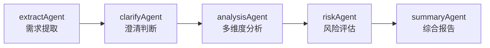

这条链路的核心特征，不是“没有推理”，而是两件事同时存在：

*   **编排固定（Static Orchestration）**：节点、边和执行顺序都在开发期写死，每次执行路径完全一致
*   **局部推理（Local Reasoning）**：每个节点内部都在做判断，例如 extractAgent 抽字段、analysisAgent 评估多维度结果、summaryAgent 汇总并成文

换句话说，**推理一直都存在，只是过去只发生在节点内部；而本章要讨论的，是如何让推理进一步发生在节点之间。**

这种架构的优势很明显：

*   **可预测**：路径固定，调试和测试都更简单
*   **可控制**：不会出现“模型擅自跳过某一步”的不确定行为
*   **可视化**：五个阶段天然对应第六章 `ThinkingIndicator` 的 0% → 20% → 40% → 60% → 80% → 100% 进度条

但它的边界也同样清晰：
*   **不能跳步**：即使提取阶段已经判定“这只是一条简单 UI 调整需求”，后续仍会机械地继续做多维度分析和风险评估
*   **不能回退**：某一步结果不理想，流程无法自动回到上一步重做
*   **不能分支**：不能根据中间结果临时改变路径，例如“这是安全类需求 → 追加一个合规审查 Agent”
*   **不能自检**：即使综合报告内部自相矛盾，也不会被流程自动发现

因此，固定编排适用于“流程稳定、输入结构清晰、异常可预期”的场景。一旦连“编排本身”都需要在运行时动态决定，就必须引入一种新的能力：**动态推理。**

### 7.1.2 当路径需要在运行时决定时，就进入动态推理

动态推理的核心循环，可以抽象为四个动作：

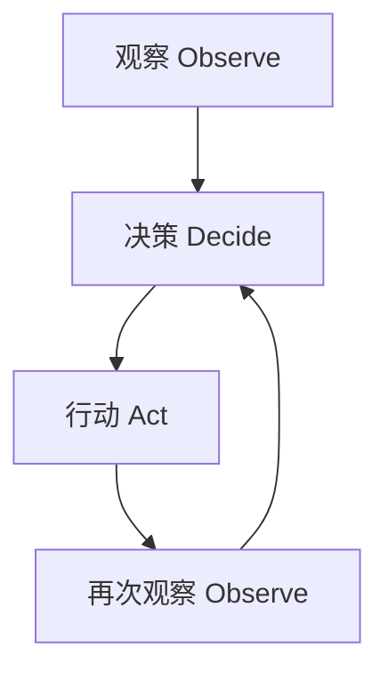

1.  **观察（Observe）**：获取当前状态——用户输入了什么、工具返回了什么、之前已经做过什么
2.  **决策（Decide）**：基于当前观察决定下一步——该走哪条路径？要调用哪个工具？当前结果是否足够好？
3.  **行动（Act）**：执行该决策——调用工具、生成回复、进入下一条链路，或结束任务
4.  **再次观察（Observe）**：把行动结果纳入新状态，进入下一轮循环

它和固定编排最关键的区别就在于：**“决策”这一步不再由开发者在编码时完全写死，而是由模型在运行时参与决定。**

我们把这种“连路径本身也交给模型来决定”的能力，称为 **路径级推理（Path-level Reasoning）**。它是本章后续所有讨论的总纲。

### 7.1.3 Agent 推理可以拆成三层决策

理解动态推理时，一个很关键的洞察是：**它不是单一动作，而是三类不同决策的叠加。**

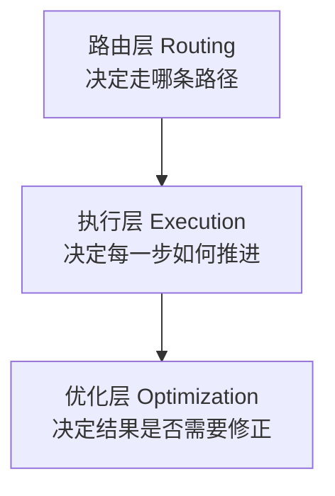

三层分别回答不同的问题：

| **层级**               | **回答的问题**        | **典型策略**                                     | **输入 → 输出**       |
| -------------------- | ---------------- | -------------------------------------------- | ----------------- |
| **路由层 Routing**      | 这个任务应该进入哪条链路？    | Router / Classifier                          | 任务特征 → 目标链路       |
| **执行层 Execution**    | 进入链路后，每一步应该如何推进？ | ReAct / Plan-and-Execute / Fixed Workflow    | 目标 + 当前状态 → 下一步动作 |
| **优化层 Optimization** | 当前结果够不够好？要不要修？   | Reflexion / Critic-Refine / Self-Consistency | 执行结果 → 修订后的结果     |

这三层的关系是**递进**而不是**并列**：

*   路由层位于最外层，先把任务送到合适的链路中
*   执行层位于中间，负责真正推进任务
*   优化层位于后段，负责对结果进行复核、修订与增强

可以用一个更直观的比喻来理解：

*   **路由层**像分诊台：先判断病人该去哪个科室
*   **执行层**像科室内部的诊疗过程：决定检查什么、怎么治疗
*   **优化层**像复核医生：在结果产出后再次审查，确认是否需要修订

这个分层框架最大的价值在于：**第六章的 Fixed Workflow 并没有被淘汰，而是被重新定位为执行层中的稳定实现方式。** 它与 ReAct、Plan-and-Execute 不是“新旧替代关系”，而是“同层不同策略”。后面你会反复看到：在真实生产系统中，Routing 的下游往往接的就是一条或多条 Fixed Workflow，而不是默认上 ReAct。

接下来，我们将逐层展开说明。

***

## 7.2 路由层：先决定走哪条链（Routing）

### 7.2.1 什么是 Routing

**Routing** 是整个动态推理体系的入口层，解决的是一个非常直接的问题：

> 当系统里同时存在多种任务类型、多个专门化链路时，如何根据输入特征，把任务分发到最合适的处理路径？

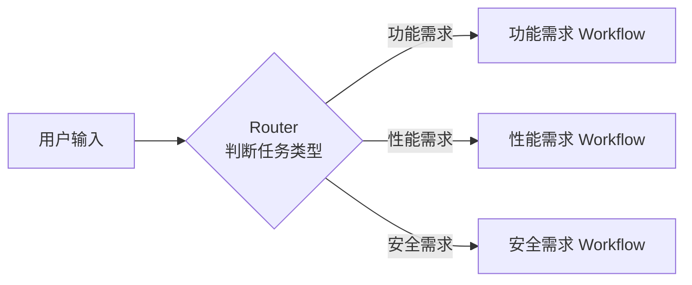

Router 往往是一个轻量的分类 Agent：输入是任务描述，输出是一个标签（例如 `functional` / `performance` / `security`），系统再根据标签把任务分发到相应链路。

之所以把 Routing 单独拆成一层，是因为它和执行层解决的问题完全不同：**Routing 只关心“任务应该去哪”，并不负责“进入以后怎么做”。** 这一层选错了，后面即使执行得再精细，结果也很难可靠——例如把安全需求送进功能分析链，再认真分析，结论也会偏题。

### 7.2.2 Routing 适合什么场景

Routing 适合的典型场景通常具备三个特征：

*   **存在多种任务类型**：例如系统要同时处理功能需求、性能需求、安全需求、UI/UX 需求
*   **已经有多条专门化链路**：不同任务对应不同分析维度、不同专家提示词、不同工具集合
*   **归类主要依赖文本特征**：不需要先做复杂多步推理，就能大致判断任务属于哪类

继续沿用第六章的需求分析系统来举例：

*   **功能需求**：走“提取 → 澄清 → 分析 → 风险 → 汇总”这条标准链
*   **性能需求**：走“提取 → 指标识别 → 基线对比 → 容量规划 → 汇总”这条性能专门链
*   **安全需求**：走“提取 → 威胁建模 → 合规检查 → 风险评估 → 汇总”这条安全专门链

这三条链在前置步骤上可能有重合，例如都需要 extractAgent，但中间核心步骤明显不同。如果强行用一条统一 Workflow 去覆盖所有需求类型，结果往往会出现两种问题：

*   某些步骤对某些任务根本无效，例如给普通功能需求做威胁建模
*   某些关键分析维度被遗漏，例如性能需求没有做容量规划

所以，**Router 的价值不是“替代分析”，而是“先把任务送对地方”。** 让下游链路专注处理自己擅长的问题，整体质量和效率都会更高。

### 7.2.3 Routing 与 Fixed Workflow 的关系

这也是第六章与第七章之间最自然的连接点：

> **Routing 的本质，就是“动态选择某一条固定 Workflow”。**

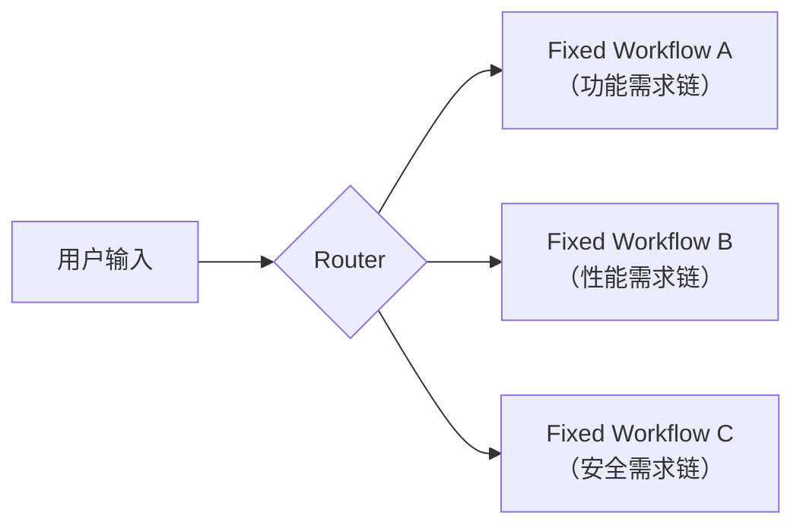

换句话说：

*   第六章的 Fixed Workflow，是 Routing 下游的**稳定处理单元**
*   第七章并没有推翻第六章，而是在它外层**补上一层动态选路能力**
*   每条 Fixed Workflow 内部，依旧可以沿用第六章那种“提取 → 澄清 → 分析 → 风险 → 汇总”的局部推理模式

这个认知非常重要，因为它直接决定了你后面对 LangGraph 和 Multi-Agent 的理解方式：

*   到了 **第八章实现 Router Node** 时，Router 只是图中的一个节点，下游连接的是多条不同子图；而这些子图本身，就可以是第六章那种 Fixed Workflow
*   到了 **第九章实现 Multi-Agent 系统** 时，第一步往往也不是让所有 Agent 自由协商，而是先通过 Router 把任务分派清楚，再进入各自擅长的执行链路

<aside>

📌 **Router 是最容易被低估的一层**

很多人学完 ReAct 后，会倾向于“所有任务都上 ReAct”。但在生产系统里，大量任务其实只需要：**Router 输出一个标签，下游进入一条稳定的 Fixed Workflow。**

真正值得记住的是：**“动态”不等于“每一步都自由”，而是“只在需要动态的那一层动态”。**

</aside>

***

## 7.3 执行层：任务在链内如何推进

路由层选好链路之后，真正的问题才开始出现：**在这条链内部，每一步到底应该如何推进？** 这就是执行层要解决的问题。

执行层最典型的两种策略，是 **ReAct** 和 **Plan-and-Execute**。二者都属于“推进任务”的方法，但核心区别并不在于“哪个更高级”，而在于：**决策是局部做，还是先全局做。**

### 7.3.1 ReAct：边想边做

ReAct（Reasoning + Acting）来自 2022 年的同名论文，核心思想非常直接：**让模型在每一步先显式表达自己的思考，再决定行动。**

作为执行层策略，它可以概括成下面这个循环：

    Thought → Action → Observation → Thought → ...

普通工具调用中，模型“决定调用哪个工具”这一步往往是隐式完成的；ReAct 的关键改进，是把这一步的思考显式化。仍以第六章里的需求 REQ-20240315-001 为例，ReAct 风格的链路大致会像这样：

    Thought: 用户提交了需求“批量导入 Excel 数据”。我需要先判断是否已经存在类似需求，避免重复分析。
    Action: search_similar_requirements("批量导入 Excel 数据")
    Observation: 找到 2 条相关需求，其中 REQ-20240110-007 已在 Q1 实现了“单条 Excel 导入”。

    Thought: 既然已有相关能力，就需要评估它与当前需求之间是冲突、复用还是增强关系。
    Action: check_conflicts("REQ-20240315-001", relatedIds=["REQ-20240110-007"])
    Observation: 冲突类型=扩展型增强；风险=中；可复用 30% 的解析逻辑。

    Thought: 当前描述仍缺少“最大支持行数”和“异常数据处理策略”这两个关键约束，需要先澄清。
    Final Answer: 需求 REQ-20240315-001 与 REQ-20240110-007 属扩展型关系，建议复用现有解析能力；
    但在进入排期评估前，仍需补充最大行数上限与异常数据处理策略。

在每一轮中，都包含三个核心元素：

*   **Thought**：为什么下一步要这样做
*   **Action**：具体要执行什么动作，例如调用哪个工具、传什么参数
*   **Observation**：动作执行后的结果，即模型拿到了什么新信息

<aside>

💡 **你其实每天都在用 ReAct**

> 当你在 ChatGPT 或 Claude 中打开联网搜索、工具调用，看到界面显示“正在搜索……”“正在读取网页……”之类的提示时，背后本质上就是 ReAct 在运行。每一次“正在做什么”的提示，都是一次 Thought + Action；而模型读取结果后继续往下推，就是下一轮 Observation → Thought。

</aside>

从执行层视角看，ReAct 的特点可以总结为：

*   **决策粒度细**：每一步只决定“下一步做什么”
*   **灵活性高**：可以随着中间结果不断调整方向
*   **可观测性强**：思考链更容易被追踪、调试和干预
*   **适合探索型任务**：尤其适合步骤不长、但中间结果会显著影响后续动作的场景

<aside>

📌 **ReAct 最适合什么场景？**

*   步骤数量通常在 3–5 步以内
*   中间结果会明显影响下一步选择
*   工具数量有限（通常 < 10 个），且用途清晰
*   对可观测性要求较高，需要追踪模型的推理过程

**第六章的标准需求分析 Pipeline 适合 ReAct 吗？**

通常不太适合。因为标准流程本身就是稳定的（提取 → 澄清 → 分析 → 风险 → 汇总），用 Fixed Workflow 更可靠、更高效，也更容易直接映射到 `steps` 进度条。

但如果任务变成“一条模糊需求，需要动态判断是先查相似、先估复杂度，还是先问澄清”，那 ReAct 的优势就会立刻显现。

</aside>

### 7.3.2 Plan-and-Execute：先规划，再执行

如果说 ReAct 是“走一步看一步”，那么 Plan-and-Execute 就是“先画地图，再按图前进”。它把执行过程明确分成两个阶段：

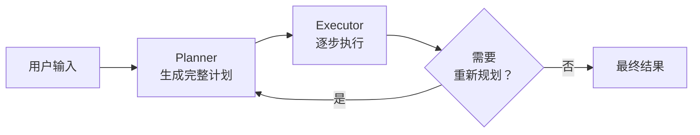

*   **Planner（规划器）**：接收任务输入，一次性产出完整计划，明确包含哪些步骤、每步做什么，以及它们之间的依赖关系
*   **Executor（执行器）**：根据计划逐步执行，不再负责重新思考“下一步该做什么”——这部分已经由 Planner 提前确定

这种拆分带来一个非常实用的优势：**规划和执行可以使用不同能力层级的模型。** 规划阶段需要更强的全局推理能力，通常用更强的大模型；执行阶段很多时候只是调用工具、读取结果、做简单判断，完全可以交给更便宜的小模型或函数节点来处理。

当场景从“单条需求分析”切换成“批量需求评审”时，Plan-and-Execute 的优势会更明显。假设产品经理提出这样的要求：

> 帮我评审这批 50 条需求，先判断哪些与已实现功能冲突，再对不冲突的做复杂度评估，最后汇总一份可直接带进排期会的评审报告。

对于这种任务，如果使用 ReAct，模型在处理每一条需求时都要重新决定下一步，既冗余又容易失去全局结构。Plan-and-Execute 则会先生成类似下面的执行计划：

    Goal: 批量评审 50 条需求，并生成可直接用于排期会的评审报告
    Steps:
      1. query_requirements(ids=[...])
      2. load_existing_feature_index()
      3. 对每条需求并行执行：check_conflicts(req, index)
      4. 过滤出 eligible = 不存在阻断型冲突的需求
      5. 对 eligible 中的每条需求并行执行：estimate_complexity(req)
      6. 对冲突型需求：generate_conflict_resolution(req)
      7. summarize(all_results)
      8. render_ui_components(summary)

此后，Executor 只需按计划推进。即使某一步失败，也不是让执行器继续“边做边猜”，而是触发 **Replan**：把“已经完成了什么、哪些步骤失败了、当前剩余任务是什么”重新交给 Planner，让它为剩余部分生成新计划。

Replan 常见的触发条件包括：

*   工具调用失败
*   中间结果显示原计划不再成立
*   执行步数超出预期或资源成本明显上升

这里有一个容易被忽略的工程点：**Replan 必须拿到“已完成状态”，否则 Planner 很容易重新规划已经做过的事。** 在 LangGraph 里，这正是共享状态（State）天然擅长解决的问题。

<aside>

📌 **Plan-and-Execute 最适合什么场景？**

*   步骤较多（通常 5–15 步）的复杂任务
*   步骤之间依赖关系明确，整体结构相对稳定
*   对 Token 成本较敏感，希望执行阶段尽量降本
*   需要向用户展示一份“可确认的执行计划”

**它与第六章 UI 协议的结合点是什么？**

Planner 生成的 plan，本身就可以直接映射为 `steps` 组件；再配合 `confirmation` 组件，用户甚至可以在执行前确认、调整或审批计划。这是 Plan-and-Execute 相较于 ReAct 的一个天然优势：它的中间产物就是结构化计划，更容易可视化和交互化。

</aside>

### 7.3.3 ReAct 与 Plan-and-Execute 的本质区别：局部决策 vs. 全局规划

这两种策略都属于执行层，但它们真正的分界线，不在于“步骤多少”，而在于：**决策是局部进行，还是先从全局展开。**

| **维度** | **ReAct（局部决策）**   | **Plan-and-Execute（全局规划）** |
| ------ | ----------------- | -------------------------- |
| 决策时机   | 每一步都重新决策          | 任务开始时先完成整体规划               |
| 决策视野   | 只关注当前状态和下一步       | 关注整个任务的全局结构                |
| 模型成本   | 大模型往往每步都要参与       | 规划用大模型，执行可降级为小模型或函数节点      |
| 中间调整   | 天然支持，下一步会自动根据观察变化 | 需要显式触发 Replan              |
| 适合任务   | 中间结果高度影响后续动作      | 步骤依赖清晰、整体结构稳定              |
| 类比     | 游客在每个路口都重新看地图     | 出发前先规划好整条路线，再按图前进          |

有一个非常实用的判断标准：

> **问自己一句：这个任务的下一步，是否必须看到上一步的具体结果，才能做出决定？**

*   如果答案是 **是**，通常更适合 ReAct
*   如果答案是 **否**，通常更适合 Plan-and-Execute

更重要的是，要始终记住：**ReAct 与 Plan-and-Execute 都只解决执行层问题。** 它们不回答“该走哪条链”（路由层），也不回答“结果够不够好，要不要修”（优化层）。

***

## 7.4 优化层：结果生成后如何自我修正

执行层产出了结果，任务就结束了吗？很多时候并不是。

如果把整个 Agent 系统类比成软件开发流程：

*   **路由层** 像任务分派：把需求交给合适的团队
*   **执行层** 像开发实现：把功能写出来
*   **优化层** 则更像 **Code Review + 自动化测试 + 修订重跑**

执行层的 ReAct 与 Plan-and-Execute 有一个共同局限：**它们负责推进，但默认不回头看。** 一旦结果生成，就可能直接返回给用户。如果输出有误、遗漏了关键条件，或者前后逻辑存在矛盾，系统本身未必会主动发现。

优化层就是为了解决这个问题。它的三类典型策略是：

*   **Reflexion**：整体评估结果，如果不满意，就带着反思重跑
*   **Critic-Refine**：不重跑全链，只对有问题的局部做修订
*   **Self-Consistency**：多次独立推理，再做投票或聚合

这三种方法的共同点是：**它们都不负责推进任务，只负责评估和修正结果。** 这也是它们与执行层策略最根本的区别。

### 7.4.1 Reflexion：做完之后，再整体评估

Reflexion（反思）是在执行链路的**末端**增加一个自我评估闭环：

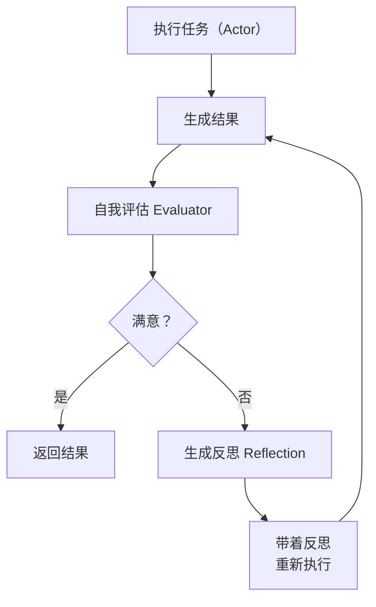

这个结构里通常有三个角色：

*   **Actor**：真正执行任务的 Agent，可以是 Fixed Workflow、ReAct 或 Plan-and-Execute
*   **Evaluator**：对 Actor 产出的结果进行质量评估，给出通过/不通过或打分
*   **Reflector**：当评估不通过时，提炼失败原因，形成可操作的修正建议，并反馈给 Actor

<aside>

⚠️ **Reflexion 不是“又一种执行方式”**

这是最容易混淆的地方。Reflexion 本身不推进任务，它只是包裹在已有执行器外侧的一层优化机制。也正因为如此，它不会和 ReAct、Plan-and-Execute 冲突，而是可以叠加在它们之上。

</aside>

回到第六章的需求分析场景，五段式 Pipeline 跑完后，综合报告仍然可能出现以下问题：

*   extractAgent 漏掉关键约束，例如没有提取“最大行数上限”
*   analysisAgent 基于过时的架构假设做了分析
*   summaryAgent 在结论中出现前后矛盾

这些问题在固定 Workflow 中往往很难被自动识别，因为每个 Agent 只关注自己那一段，没有一个节点会“站在全文视角”通读整份结果。Reflexion 中的 Evaluator，恰好扮演了这个“通读全文”的角色。它不只看某个单点输出，而是把 `extract / clarify / analysis / risk / summary` 作为整体来检查；如果不达标，就由 Reflector 生成反思，再让 Actor 带着改进意见重跑。

一个日常中很容易观察到的手动版 Reflexion 是这样的：

> 第一轮提示：帮我把这份会议纪要整理成结构化格式。

> 收到回复后继续说：你漏了“下周行动项”这一节，也没有标注责任人。请按以下标准重新整理：① 必须有“行动项”小节；② 每项都标出负责人和 deadline。

第二轮结果往往明显优于第一轮。把这一步从“人工指出问题”改成“Evaluator 自动发现问题”，本质上就是 Reflexion。

<aside>

📌 **Reflexion 最适合什么场景？**

*   输出质量有明确标准，而且这些标准可以被写进 prompt 或规则中
*   任务允许更长的响应时间，例如离线报告、后台任务、复杂生成内容
*   输出是长文本、长报告、复杂代码等“一次往往做不对”的内容

可以把它类比成 Agent 世界里的：**自动化测试 + 自动修复。**

</aside>

### 7.4.2 Critic-Refine：局部修订，而不是整链重跑

很多场景下，Reflexion 的“整条链重跑”成本太高。你只是想修一个局部问题，没必要把整套分析从头再跑一遍。这时更适合使用 **Critic-Refine**：

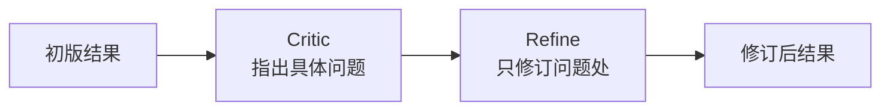

它与 Reflexion 的差异，关键在于**修订粒度**：

| **维度** | **Reflexion** | **Critic-Refine** |
| ------ | ------------- | ----------------- |
| 评估对象   | 整体结果 + 整条执行过程 | 主要关注最终产出          |
| 修订方式   | 带着反思重跑整条链     | 只修订有问题的局部内容       |
| 成本     | 较高            | 较低                |
| 适用场景   | 执行过程本身可能出错    | 执行过程可信，但结果表达仍需打磨  |

在第六章的需求分析系统中，Critic-Refine 通常更常见。例如：

*   summaryAgent 已经生成了一份综合报告
*   Critic 指出“排期建议部分缺少依赖说明”
*   Refine 只修改“排期建议”那一段，而不重新执行前面的提取、澄清、分析和风险评估

<aside>

📌 **什么时候优先用 Critic-Refine，而不是 Reflexion？**

*   产出是长文本、报告、代码，主要问题集中在结构、措辞或完整性上
*   中间步骤整体可信，问题只出在“最后一公里”
*   成本敏感，整链重跑不划算
*   需要多轮细修，但不希望每次都从头开始

</aside>

### 7.4.3 Self-Consistency：多次推理后再投票

第三种优化策略走的是另一条思路：它既不评估整条链，也不局部重写，而是**让模型独立推理多次，再对结果做投票或聚合。**

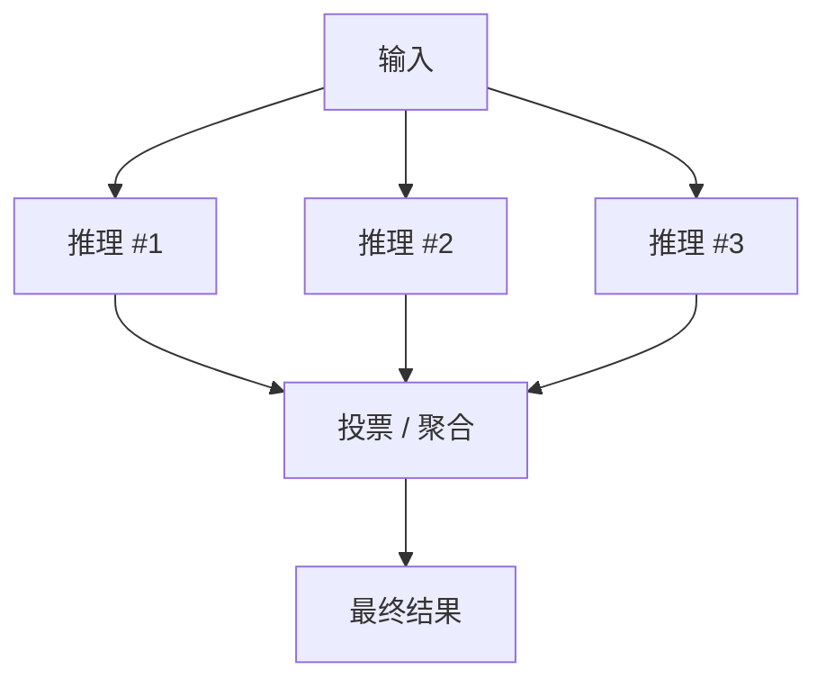

它利用的是大模型的一个常见特性：**对于存在相对明确答案的判断类任务，多次独立推理后的多数结果，往往比单次输出更稳定。**

在第六章的需求分析场景中，Self-Consistency 很适合以下类型的问题：

*   **分类判断**：“这是功能需求还是性能需求？”——跑 3 次，取多数结果
*   **风险评级**：“这条需求属于 P0 / P1 / P2？”——跑 5 次，取多数结果
*   **复杂度评估**：“复杂度是高 / 中 / 低？”——跑 3 次，取多数结果
*   **冲突判定**：“这两条需求是否冲突？”——跑 3 次，取多数结果

但它**不适合**开放式生成任务，例如长报告、代码、创意文案。因为这些任务并不存在一个天然的“多数答案”，强行投票反而容易稀释表达的质量和个性。

<aside>

📌 **优化层的三种策略如何选择？**

*   **Reflexion**：执行链本身可能有问题，需要整体回看并可能重跑
*   **Critic-Refine**：执行过程基本可信，只需要对最终产出做局部打磨
*   **Self-Consistency**：任务本质上是有明确答案的判断题，更适合多次推理后投票

</aside>

***

## 7.5 模式组合：真实 Agent 系统如何协作

前面我们把三层分别拆开讲清楚了，但真实系统几乎不会只动其中一层。真正的工程实践，通常是：**按层组合。**

### 7.5.1 三层组合模式

最常见的整体结构，是一条“路由 → 执行 → 优化”的三段式链路：

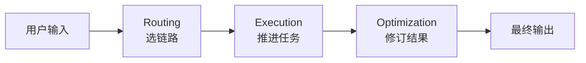

但需要注意的是，每一层内部都可以替换不同策略，因此最终会组合出不同风格的系统：

| **组合** | **路由层**     | **执行层**                | **优化层**              | **典型场景**            |
| ------ | ----------- | ---------------------- | -------------------- | ------------------- |
| 经典需求分析 | 任务类型 Router | Fixed Workflow（五段式）    | Critic-Refine（修报告）   | 单条需求分析 + 报告打磨       |
| 模糊需求探索 | —           | ReAct                  | Reflexion            | 不确定先调哪个工具时的动态探索     |
| 批量需求评审 | 任务类型 Router | Plan-and-Execute       | Critic-Refine（修汇总报告） | 一次评审 50 条需求 + 排期会材料 |
| 判断类任务  | —           | Fixed Workflow / ReAct | Self-Consistency     | 风险评级、冲突判定、优先级打分     |

这里最需要记住的，不是某个具体组合，而是三条原则：

*   **不是三选一，而是三层分别选策略**
*   **某一层可以不用动态机制**，例如只有一条执行链时就不需要 Router
*   **层与层之间职责要清晰**：选路的不负责执行，执行的不负责质检，质检的不替代执行

### 7.5.2 第六章需求分析系统如何演进
    
如果把第六章已经搭好的系统，按照三层架构再向前演进一版，整体结构大致会是这样：

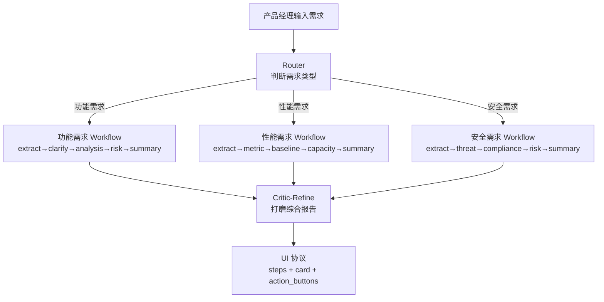
    

它的演进方式可以拆成三步来看：

*   **路由层**：新增一个 Router，根据输入特征识别需求类型，并分派到不同 Workflow
*   **执行层**：每条 Workflow 都是第六章那种 Fixed Workflow，只不过中间核心步骤发生了差异化
*   **优化层**：所有链路最后汇总到同一个 Critic-Refine 节点，对综合报告进行统一打磨，再输出到第六章已经打通的 UI 协议中

这种演进路径有几个明显优点：

*   **向后兼容**：已有 Fixed Workflow 基本不用推翻，只是被放进更大的结构中
*   **增量落地**：可以先补 Router，再补优化层，而不必一次性重构全部系统
*   **职责清晰**：新增一种需求类型时，只需增加一条 Workflow，并在 Router 中补一个分支
*   **天然适配 LangGraph**：三层结构可以直接映射为 Router Node、子图和 Critic Node

***

## 7.6 为什么需要 LangGraph：把三层推理落到图结构

在概念层面，用几层 if-else 加 while 循环，当然也能把“三层决策机制”讲清楚；但一旦进入生产环境，就会很快遇到一系列无法回避的工程问题：

*   **状态管理**：Router 的分类结果、Execution 的推进状态、Optimization 的重试轮次，到底放在哪里维护？
*   **持久化与恢复**：长任务执行到一半服务重启了，如何从中间状态继续？
*   **并行执行**：Plan-and-Execute 中没有依赖关系的步骤，如何安全并发？
*   **条件分支**：Router 的分类结果如何自然地驱动不同路径？
*   **人工介入**：执行到某一步需要产品经理确认时，如何暂停、等待、再恢复？
*   **流式反馈**：如何把执行过程中的状态变化，实时推给前端？

这些问题正是 LangGraph 试图系统性解决的。它把 Agent 的推理过程建模为一张 **有状态的图（Stateful Graph）**：

*   **节点（Node）**：每个决策或执行单元，例如 Router、ReAct Agent、Critic
*   **边（Edge）**：节点之间的转移关系，可以是固定边，也可以是条件边
*   **状态（State）**：在整张图中共享的上下文数据，例如消息历史、中间结果、执行进度

### 7.6.1 三层决策在 LangGraph 中的自然表达

三层架构在 LangGraph 中其实有非常自然的映射关系：

| **层级** | **典型策略**            | **LangGraph 表达**                                   |
| ------ | ------------------- | -------------------------------------------------- |
| 路由层    | Router / Classifier | **Router Node**  • 条件边（Conditional Edge）           |
| 执行层    | Fixed Workflow      | 由固定边串联而成的**子图（Subgraph）**                          |
| 执行层    | ReAct               | **Agent Node + Tool Node** 之间的循环边                  |
| 执行层    | Plan-and-Execute    | **Planner Node → Executor 子图**，必要时再通过条件边触发 Replan  |
| 优化层    | Reflexion           | **Evaluator Node** 判断通过与否；不通过则回到 Reflector / Actor |
| 优化层    | Critic-Refine       | 主链后串联 **Critic Node → Refine Node**                |
| 优化层    | Self-Consistency    | 同一节点的**并行分支**  • Aggregator Node                   |

一张典型的“Router + Execution + Optimization”组合图，结构大致如下：

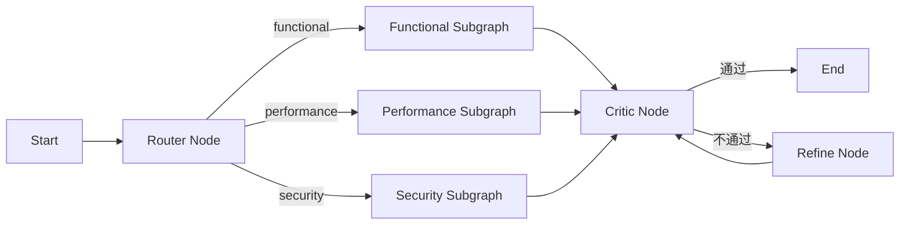

之所以说这种映射“自然”，是因为 LangGraph 原生就提供了实现这些结构所需的关键能力：

*   节点执行后的状态可以自动持久化，便于断点恢复
*   条件边可以直接承载 Router 的分类结果
*   并行分支天然适合 Self-Consistency 和 Plan-and-Execute 中的独立步骤
*   `interrupt` 机制可以让图在任意节点暂停，等待人工确认——这正好对应第六章的 `confirmation` 组件
*   流式回调可以把节点级执行过程实时推给前端——这正好对应第六章的 SSE 与 `ThinkingIndicator`

### 7.6.2 本章 → 第八章 → 第九章的衔接

到这里，章节之间的衔接路径也会变得非常清晰：

*   **第七章（本章）**：建立三层决策机制的认知框架——路由、执行、优化，以及各层的典型策略和适用边界
*   **第八章**：用 LangGraph 把这些策略逐一落成图——Router Node、ReAct Agent、条件路由、并行执行、状态持久化
*   **第九章**：把“Router + 多条 Workflow + 优化层”组合成真正生产可用的 Multi-Agent 系统，并与第六章的 UI 协议、流式渲染、`ThinkingIndicator` 完整合流

***

## 7.7 本章小结

这一章围绕同一个核心问题展开：**当任务不再是一条固定 Pipeline 时，Agent 应该如何决定下一步做什么？**

为了解答这个问题，我们没有把动态推理简单理解为某一种“高级 Agent 模式”，而是把它拆成了三层决策机制，让第六章的 Fixed Workflow 也能被自然纳入，而不是被粗暴替换：

*   **从固定编排到动态推理（7.1）**：重新定义了第六章链路的本质——它并非“没有推理”，而是“固定编排 + 局部推理”；进一步引入 **路径级推理（Path-level Reasoning）**，并给出“路由层 / 执行层 / 优化层”这条贯穿后续章节的主线。
*   **路由层 Routing（7.2）**：回答“该走哪条链”。它本质上是“动态选择某一条固定 Workflow”，因此也是第六章与第七章之间最自然的桥梁。
*   **执行层 Execution（7.3）**：回答“链内每一步如何推进”。ReAct 与 Plan-and-Execute 的本质差异，不在于“复杂度高低”，而在于 **局部决策 vs. 全局规划**。
*   **优化层 Optimization（7.4）**：回答“结果够不够好”。Reflexion、Critic-Refine、Self-Consistency 三种策略分别对应整体回看、局部修订和多次投票，它们共同构成结果质量的保障机制。
*   **模式组合（7.5）**：真实系统不是“三选一”，而是“按层组合”。以第六章的需求分析系统为例，合理的演进结构会是：`Router → 多条 Workflow → Critic-Refine → UI 协议`。
*   **LangGraph 承接（7.6）**：三层决策在 LangGraph 中存在天然映射——Router Node、子图、Critic Node；同时它也提供了状态持久化、条件边、并行、人工中断和流式反馈这些工程能力，正好与第六章已有的 SSE、`ThinkingIndicator`、`confirmation` 机制对接。

### **本章的核心收获**

*   **什么时候该从“固定编排”切到“动态推理”？**
    *   当任务类型开始多样化，不同类型需要进入不同链路
    *   当中间结果会改变后续路径，例如需要临时插入新的 Agent 节点
    *   当执行结果可能出现结构性问题，需要系统自己发现并修订
    *   反过来说：如果单条标准需求分析的编排稳定、结果可信，那么继续使用 Fixed Workflow 往往更可靠、更高效
*   **什么时候该引入路由层？**
    *   当系统里已经存在或即将存在多条专门化 Workflow
    *   当任务归类主要可以靠文本特征判断，而不需要复杂多步推理
    *   当不同链路的 Agent 组合、工具集合、提示词差异明显时，Router 能有效降低“单链过载”问题
    *   反例是：如果系统里只有一条执行链，额外引入 Router 往往只是增加开销
*   **执行层如何在 ReAct 与 Plan-and-Execute 之间做选择？**
    *   如果下一步高度依赖上一步的具体结果，更适合 ReAct
    *   如果步骤结构可以提前规划出来，更适合 Plan-and-Execute
    *   如果任务本身流程固定且很短，那么 Fixed Workflow 通常已经足够，没有必要引入额外复杂度
*   **优化层如何选择 Reflexion / Critic-Refine / Self-Consistency？**
    *   执行链本身可能出错，需要整体回看并可能重跑 → **Reflexion**
    *   执行过程基本可信，只需要修文案、补结构、改表达 → **Critic-Refine**
    *   任务是有明确答案的判断题，如分类、评级、冲突判定 → **Self-Consistency**
    *   如果流程稳定、输出也无需打磨，那么优化层并不是必选项
*   **什么时候值得把三层推理迁移到 LangGraph？**
    *   需要状态持久化和断点恢复
    *   需要条件分支、并行执行或 Replan
    *   需要在关键节点加入人工确认
    *   需要把执行进度和中间状态实时流式推给前端
    *   如果只是一次性脚本、短链路 Demo、无状态任务，手写流程有时反而更直接

<aside>

➡️ **后续章节预告**

到这里，我们已经把 Agent 推理拆成了 **路由、执行、优化** 三层，也明确了每一层的典型策略与组合方式。

下一章会正式进入 LangGraph 的渐进式教程：从最小图开始，逐步实现 Router Node、ReAct Agent、条件路由、并行执行与状态持久化；第九章则会把这三层机制组合成一个真正生产级的 Multi-Agent 系统，并与第六章的 UI 协议、流式渲染、`ThinkingIndicator` 完整合流。

</aside>

## 写在最后🧪

> 这里是**言萧凡的 AI 编程实验室**。 我会在这里持续记录和分享 **AI 工具、编程实践**，以及那些值得沉淀下来的高效工作方法。 不只聊概念，也尽量分享能直接上手、能够复用的经验。 希望这间小小的实验室，能陪你一起探索、实践和成长。**2026 年，一起进步。**

**有兴趣的话可以添加我的微信号一起交流，不仅是编程也可以是畅谈人生。**

