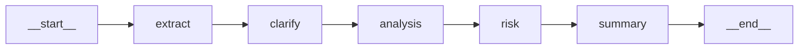
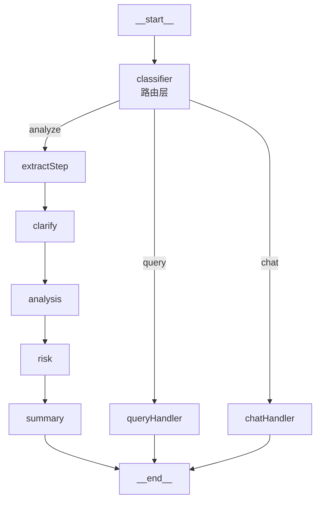
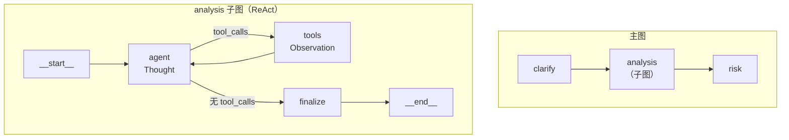
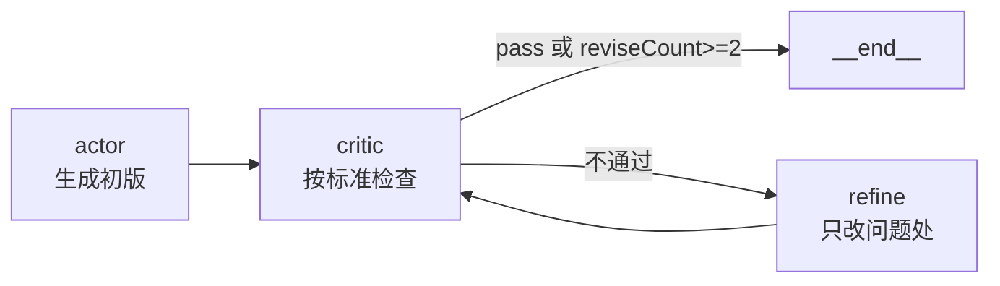
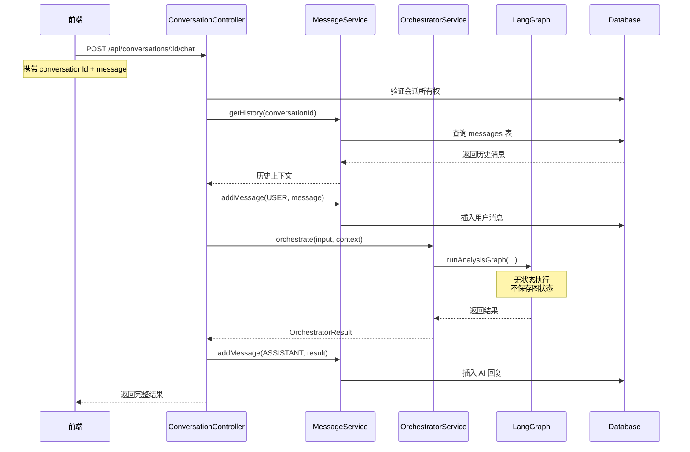

> 本文整理自《2026 前端 AI Agent 工程化实战营》课程资料，作为系列文章第 9 篇。

---
theme: channing-cyan
---


第七章将 Agent 推理拆分为路由层、执行层与优化层；第六章则给出了一个可运行的需求分析系统：`extract → clarify → analysis → risk → summary` 的五段式流程，以及与之配套的 `steps`、`ThinkingIndicator`、`confirmation` 等 UI 协议。

把两章放在一起看，演进方向就很明确了：第六章给了一个能跑的业务骨架，第七章给了从固定流程升级到图结构的思路。本章要做的事情，就是用 LangGraph 把第六章的实现一步步改造成一张支持路由、循环、优化闭环、持久化和人工介入的图。

为便于表述，下文中的 **Ch6** 与 **Ch7** 分别指代 **Chapter 6** 与 **Chapter 7**。

本章分支[feat/LangGraph](https://github.com/Cookieboty/Autix/tree/feat/LangGraph)

<aside>

🎯 **本章演进路线**

*   **8.3 基线迁移**：Ch6 五段式 Promise 链迁移为基础 StateGraph，对应执行层的固定流程。
*   **8.4 加入路由层**：增加 classifier，在“分析 / 查询 / 闲聊”之间分流。
*   **8.5 升级分析节点**：将回边原语与 ReAct 子图放在一起展开，把单体 `analysis` 节点升级为可循环的分析子图。
*   **8.6 升级汇总节点**：将单体 `summary` 节点升级为 Critic-Refine 子图。
*   **8.7 工程化落地**：把持久化、HITL、流式输出、NestJS 接入与调试统一收进同一节。

</aside>

<aside>

📌 **阅读建议**

> 建议始终打开 `services/chat/src/llm/graph/requirement-analysis-graph.ts`，边读边改。每一节都以上一节为基础，只做一次针对性的增量升级。

</aside>

***

## 8.1 从 LangChain 到 LangGraph：先讲清楚两者的定位

在动手改代码之前，先解决一个很多人开始学 LangGraph 时最容易卡住的问题：

> **LangChain 和 LangGraph 到底是什么关系？什么时候该用哪个？**

搞清楚这个问题，后面动手改代码时才不会迷路。

### 8.1.1 LangChain 擅长什么

LangChain 的定位更像一套 **“LLM 应用的组件库 + 流水线胶水”**：

*   统一抽象了 Chat Model、Prompt、Tool、Parser、Retriever、VectorStore、Memory 等核心组件。
*   通过 LCEL（`Runnable` / `.pipe()`）把组件串成链，输入输出类型在编译期就能对齐。
*   对于**线性、可预测、一次性跑完**的任务——RAG 问答、结构化抽取、一次性工具调用等——足够简洁优雅。

第六章的 `runRequirementAnalysis` 就是典型的 LangChain 风格：

```tsx
const extracted = await extractAgent.invoke({ input });
const clarified = await clarifyAgent.invoke({ extracted });
// ...
```

这种写法的优点是直观；缺点是**所有路径、所有控制流都硬编码在业务代码里**。

### 8.1.2 LangChain 做不了（或很难优雅做）的事

一旦碰到下面任何一个场景，LangChain 原生链就不够用了：

1.  **运行时路径决策**：分析 / 查询 / 闲聊要走不同链路。
2.  **局部循环**：Agent 需要反复“思考 → 调工具 → 观察”直到任务完成。
3.  **质量闭环**：结果不合格要自动返工修订。
4.  **长任务持久化**：多轮对话共享中间状态、支持断点恢复。
5.  **人工介入**：在危险操作前暂停、等待用户确认。
6.  **节点级流式反馈**：前端要精确展示“现在走到哪一步了”。

你可以用 `if / else`、递归函数、手写状态机硬塞进 LangChain，但代码复杂度很快就会失控。

### 8.1.3 LangGraph 补足了什么


LangGraph 在 LangChain 之上加了一层**状态机 + 图的运行时**。直接看对比表：

| 能力          | LangChain（LCEL） | LangGraph                    |
| ----------- | --------------- | ---------------------------- |
| 线性流水线       | ✅ 核心能力          | ✅ 完全兼容                       |
| 运行时条件路由     | ⚠️ 手写 if / else | ✅ 条件边原生支持                    |
| 循环 / 回边     | ❌ 不支持           | ✅ 原生支持                       |
| 子图组合        | ⚠️ 靠嵌套链手工实现     | ✅ “子图即节点”                    |
| 共享状态        | ⚠️ 靠参数透传        | ✅ 集中式 State + reducer        |
| 断点恢复 / 多轮状态 | ❌ 无             | ✅ Checkpointer               |
| 人工介入        | ❌ 无             | ✅ `interrupt()`  • `Command` |
| 节点级流事件      | ⚠️ 粗粒度          | ✅ `streamMode: "updates"`    |
| 多 Agent 协作  | ⚠️ 手工调度         | ✅ Supervisor / Swarm 模式      |

<aside>

💡 **一句话选型**

*   流程是**固定的直线或简单分支**：LangChain（LCEL）足够。
*   流程包含**运行时路径决策、循环、状态共享、人工介入、断点恢复、节点级进度**中的任意一项：上 LangGraph。
*   LangGraph **不是替代品，而是运行时升级**：节点内部仍然大量使用 LangChain 的 Chat Model、Tool、Prompt、Parser，只是“节点之间怎么走”这件事由 LangGraph 接管。

</aside>

### 8.1.4 回到我们的系统：为什么 Ch6 的链需要换成图

回头看第六章，升级动机就很清楚了：

*   `analysis` 阶段不再是一次调用，它往往需要按情况决定工具调用次数 → **需要循环**。
*   用户请求并非总是“完整分析”，有时只是查询状态、有时只是打招呼 → **需要运行时路由**。
*   报告质量存在波动，需要末端质检与修订机制 → **需要闭环优化**。
*   长任务需要断点恢复、人工审批与前端进度反馈 → **需要 Checkpointer / HITL / 流式输出**。

这些需求刚好对应上面表格里 LangGraph 才有的能力，也是本章所有改造的出发点。

***

## 8.2 LangGraph 核心概念

LangGraph 的能力建立在几个核心原语上。这一节不写业务代码，先把概念理清楚，后面读起来会顺畅很多。

### 8.2.1 State：图的共享上下文

State 是整张图的**共享数据层**。每个节点从 State 读数据、往 State 写结果，节点之间不用再一层层传参。v1 起推荐直接复用官方的 `MessagesAnnotation` 作为消息通道：

```tsx
import { Annotation, MessagesAnnotation } from '@langchain/langgraph';

export const DemoState = Annotation.Root({
  ...MessagesAnnotation.spec,						  // 复用官方消息通道（追加型 reducer）
  intent: Annotation<'analyze' | 'query' | 'chat' | ''>({
    default: () => '',
  }),
  draft: Annotation<string>({ default: () => '' }),
  reviseCount: Annotation<number>({ default: () => 0 }),
});
```

State 的两个关键设计：

*   **reducer**：决定字段如何合并。`messages` 用追加型 reducer（`MessagesAnnotation` 已内置），业务字段一般用覆盖型（默认行为）。
*   **default**：字段缺省时的初始值，避免 `undefined` 到处做判空。

<aside>

⚠️ **reducer 用错是最常见的翻车点**

把 `draft` / `summary` 这类 draft 字段设成追加型 reducer，会导致每次修订都把旧内容叠进来——看起来“越改越长”，其实全是历史垃圾。只有天然累积的字段（消息、日志、工具调用轨迹）才适合追加。

</aside>

### 8.2.2 Node：一步任务

节点就是一个普通的 async 函数：读 `state`，返回**要更新的字段**（`Partial<State>`）。

```tsx
async function classifierNode(state: typeof DemoState.State) {
  // ...调用模型，得到 intent
  return { intent: 'analyze' as const };
}
```

返回的对象只包含“本节点想写入的字段”，其他字段由 reducer 自动合并。**不要返回整个 state**，那不是预期用法。

### 8.2.3 Edge：节点之间怎么走

边分两种：

*   **普通边** `addEdge(A, B)`：A 完成后一定去 B。
*   **条件边** `addConditionalEdges(A, routerFn)`：A 完成后由 `routerFn(state)` 返回目标节点名。

`START` 和 `END` 是 LangGraph 内置的入口 / 出口锚点。v1 起推荐使用 **常量** 替代字符串 `"__start__"` / `"__end__"`：

```tsx
import { START, END, StateGraph } from '@langchain/langgraph';

const graph = new StateGraph(DemoState)
  .addNode('classifier', classifierNode)
  .addNode('analyze', analyzeNode)
  .addNode('chat', chatNode)
  .addEdge(START, 'classifier')
  .addConditionalEdges('classifier', (s) =>
    s.intent === 'analyze' ? 'analyze' : 'chat',
  )
  .addEdge('analyze', END)
  .addEdge('chat', END)
  .compile();
```

这张图已经具备了 LangChain 做不到的能力：**路径在运行时决定**。

### 8.2.4 循环与子图

*   **循环**：条件边可以指回前序节点，只要有明确的退出条件即可（例如 `reviseCount >= 2` 或 `!critique`），再配合一个硬上限就能构成可靠的循环。
*   **子图**：一张 `compile()` 后的图可以直接作为另一张图的**节点**使用。这是 LangGraph 最重要的组合原语——外层看它仍是一个节点，内部却可以有自己的循环、工具调用和终止逻辑。

### 8.2.5 工程能力三件套

这三项不是“概念”，而是 LangGraph 运行时自带的工程能力，后面 8.7 会统一展开：

*   **Checkpointer**：在每个节点边界自动保存 State 快照，支持断点恢复与多轮共享。
*   **`interrupt()`** + **`Command`**：在任意节点中暂停图的执行，把控制权交还给调用方，等用户确认后再 `new Command({ resume })` 恢复，并可双向传值。
*   **`graph.stream(..., { streamMode: "updates" })`**：按节点粒度推送状态增量，天然驱动前端进度条。


### 8.2.6 一个 50 行的最小示例

先跳出需求分析系统，看一张最朴素的图能做什么：

```tsx
import { StateGraph, Annotation, START, END } from '@langchain/langgraph';

const State = Annotation.Root({
  input: Annotation<string>(),
  intent: Annotation<'greet' | 'calc' | ''>({ default: () => '' }),
  output: Annotation<string>({ default: () => '' }),
});

const classify = (s: typeof State.State) => ({
  intent: /\d+\s*[+\-*/]\s*\d+/.test(s.input) ? 'calc' as const : 'greet' as const,
});

const greet = (s: typeof State.State) => ({
  output: `你好，你说的是：${s.input}`,
});

const calc = (s: typeof State.State) => ({
  // eslint-disable-next-line no-eval
  output: `结果是 ${eval(s.input)}`,
});

const graph = new StateGraph(State)
  .addNode('classify', classify)
  .addNode('greet', greet)
  .addNode('calc', calc)
  .addEdge(START, 'classify')
  .addConditionalEdges('classify', (s) => s.intent)
  .addEdge('greet', END)
  .addEdge('calc', END)
  .compile();

await graph.invoke({ input: '1 + 2' });
// => { input: '1 + 2', intent: 'calc', output: '结果是 3' }
```

例子虽简单，但 State / Node / Edge / 条件路由四个核心原语都用到了。8.3 开始，我们就是把这几个原语落到第六章的需求分析系统上——后面的内容都是在这个基础上做组合和扩展。

<aside>

🧭 **从这里开始衔接 Ch6**

到这里，你应该已经能回答三个问题：

1.  LangChain 和 LangGraph 各自擅长什么。
2.  LangGraph 的核心原语是哪几个。
3.  为什么 Ch6 的五段式 Promise 链需要被重写成一张图。

下一节开始，我们就把这张最小示例“放大”到真实业务：用 LangGraph 重写 Ch6 的 `extract → clarify → analysis → risk → summary` 流程，并在此基础上逐步叠加路由、循环、质检、持久化、HITL 和流式输出。

</aside>

### 8.2.7 文件结构与版本

整章只围绕一个文件展开：

    services/chat/src/llm/graph/
    └── requirement-analysis-graph.ts

后续每一节都在这一个文件上做增量演进。

本章示例基于 `@langchain/langgraph` **v1.2.9**（v1 起 `START` / `END` 常量、`MessagesAnnotation`、`interrupt()` / `Command`、`streamMode: "updates"` 等均为推荐写法）：

```bash
cd services/chat && bun add @langchain/langgraph@^1.2.9
```

***

## 8.3 基线迁移：把五段式搬到 StateGraph

这一节只做一件事：**业务逻辑不动，把 Promise 链换成基础图结构**。后面所有改动都在这个基线上叠加。

*   🤖 用 AI 生成本节代码（对应 8.3 基线）

    将以下 Prompt 粘贴到 Claude CLI 中执行：
````
 把 services/chat/src/llm/agents/requirement-analysis.ts 的 Promise 链迁移到 LangGraph（@langchain/langgraph ^1.2.9）：

 1. 新建 services/chat/src/llm/graph/requirement-analysis-graph.ts
 2. 使用 Annotation.Root + MessagesAnnotation.spec 定义 RequirementAnalysisState，字段：messages（复用 MessagesAnnotation）、extracted、clarified、analysis、risk、summary，业务字段使用默认覆盖型 reducer
 3. 五个节点 extract/clarify/analysis/risk/summary 一一对应第六章的 Agent，节点内部复用原来的 Agent 调用，只返回 Partial<State>
 4. 线性边使用 v1 常量：START → extract → clarify → analysis → risk → summary → END
 5. 导出 createAnalysisGraph() 和 runAnalysisGraph(input)
 6. 保留原 Ch6 入口文件，仅改为转调新的 graph

 验证：同样的输入，新图的 summary 与旧链一致
````

```tsc
import { Annotation, MessagesAnnotation, StateGraph, START, END } from '@langchain/langgraph';
import { BaseChatModel } from '@langchain/core/language_models/chat_models';
import {
  createExtractAgent,
  createClarifyAgent,
  createAnalysisAgent,
  createRiskAgent,
  createSummaryAgent,
} from '../agents/sub-agents';

export const RequirementAnalysisState = Annotation.Root({
  ...MessagesAnnotation.spec,
  input: Annotation<string>,
  retrievedContext: Annotation<string>,
  extracted: Annotation<Record<string, unknown>>,
  clarified: Annotation<{ needsClarification: boolean; questions: string[] }>,
  analysisResult: Annotation<string>,
  riskResult: Annotation<string>,
  summary: Annotation<string>,
});

const parseJson = <T>(raw: string, fallback: T): T => {
  try {
    const match = raw.match(/```(?:json)?\s*([\s\S]*?)```/);
    return JSON.parse(match ? match[1].trim() : raw.trim());
  } catch {
    return fallback;
  }
};

const createNodes = (model: BaseChatModel) => ({
  extractStep: async (state: typeof RequirementAnalysisState.State) => {
    const raw = await createExtractAgent(model).invoke({ input: state.input });
    return {
      extracted: parseJson(raw, {
        isComplete: false,
        missingFields: ['JSON 解析失败，请重试'],
      }),
    };
  },

  clarifyStep: async (state: typeof RequirementAnalysisState.State) => {
    const raw = await createClarifyAgent(model).invoke({
      input: state.input,
      extractResult: JSON.stringify(state.extracted),
    });
    return {
      clarified: parseJson(raw, {
        needsClarification: false,
        questions: [],
      }),
    };
  },

  analysisStep: async (state: typeof RequirementAnalysisState.State) => ({
    analysisResult: await createAnalysisAgent(model).invoke({
      input: state.input,
      extractResult: JSON.stringify(state.extracted),
    }),
  }),

  riskStep: async (state: typeof RequirementAnalysisState.State) => ({
    riskResult: await createRiskAgent(model).invoke({
      input: state.input,
      extractResult: JSON.stringify(state.extracted),
    }),
  }),

  summaryStep: async (state: typeof RequirementAnalysisState.State) => ({
    summary: await createSummaryAgent(model).invoke({
      input: state.input,
      extractResult: JSON.stringify(state.extracted),
      analysisResult: state.analysisResult,
      riskResult: state.riskResult,
      retrievedContext: state.retrievedContext || '无相关参考文档',
    }),
  }),
});

export function createAnalysisGraph(model: BaseChatModel) {
  const nodes = createNodes(model);

  return new StateGraph(RequirementAnalysisState)
    .addNode('extractStep', nodes.extractStep)
    .addNode('clarifyStep', nodes.clarifyStep)
    .addNode('analysisStep', nodes.analysisStep)
    .addNode('riskStep', nodes.riskStep)
    .addNode('summaryStep', nodes.summaryStep)
    .addEdge(START, 'extractStep')
    .addEdge('extractStep', 'clarifyStep')
    .addEdge('clarifyStep', 'analysisStep')
    .addEdge('analysisStep', 'riskStep')
    .addEdge('riskStep', 'summaryStep')
    .addEdge('summaryStep', END)
    .compile();
}

export async function runAnalysisGraph(args: {
  input: string;
  retrievedContext: string;
  model: BaseChatModel;
}) {
  const graph = createAnalysisGraph(args.model);
  const result = await graph.invoke({
    input: args.input,
    retrievedContext: args.retrievedContext,
    messages: [],
  });

  return {
    summary: result.summary ?? '',
    extracted: result.extracted ?? {},
    clarified: result.clarified ?? { needsClarification: false, questions: [] },
    analysisResult: result.analysisResult ?? '',
    riskResult: result.riskResult ?? '',
    steps: {
      extract: JSON.stringify(result.extracted ?? {}),
      clarify: JSON.stringify(result.clarified ?? {}),
      analysis: result.analysisResult ?? '',
      risk: result.riskResult ?? '',
      summary: result.summary ?? '',
    },
  };
}
````
以上为示例代码。


<aside>

📌 **为什么这一步仍然重要**

把 Promise 链改写为线性图，本身不会立即带来巨大收益；它真正的意义在于，为后续加入路由、循环、优化闭环、断点恢复等能力提供统一容器。后面各节几乎都只是在这张基线图上替换某个节点或插入某条边。

</aside>

***

## 8.4 加路由层：不是每个请求都需要跑完整分析链

系统上线后，用户请求通常会分成三类：

1.  **分析需求**：需要跑完整五段式流程。
2.  **查询需求状态**：只需要取数，不需要完整分析。
3.  **闲聊或寒暄**：不需要进入业务链路。

如果继续沿用 Promise 链，主流程会被大量 `if / else` 分支切碎；而在图结构里，只需要增加一个 `classifier` 节点，再从它发出一条条件边。

*   🤖 用 AI 生成本节代码（对应 8.4 路由层升级）

    将以下 Prompt 粘贴到 Claude CLI 中执行：
````
在 8.3 的 requirement-analysis-graph.ts 基础上增量升级（@langchain/langgraph ^1.2.9）：
## 1. State 扩展
- 新增 intent 字段：Annotation<'analyze' | 'query' | 'chat'>({ default: () => 'analyze' })
- 新增 queryResponse、chatResponse 字段用于存储对应响应
## 2. classifierNode 实现要求
- 使用 ChatModel.withStructuredOutput(zod schema) 判断意图
- Zod schema 包含：intent (enum) 和 reasoning (string)
- System prompt 需包含：
  - 明确的三类意图判断规则（analyze/query/chat）
  - 每类意图的关键特征和示例
  - 边界情况处理策略（如“查询XXX的分析报告”应判为 query）
  - 优先级规则：有需求编号优先 query，纯闲聊优先 chat，默认 analyze
- 实现 try-catch 降级：失败时用关键词匹配（需求编号正则、关键词检测）
## 3. 新增处理节点
- queryHandlerNode：调用 model.invoke()，system prompt 为“你是需求查询助手”
- chatHandlerNode：调用 model.invoke()，system prompt 为“你是友好的AI助手”
- 两者均返回 { [responseField]: content, summary: content } 兼容旧接口
## 4. 图结构配置
- 边：START → classifier
- 条件边：addConditionalEdges('classifier', routeByIntent)
- routeByIntent 返回：'extractStep' | 'queryHandler' | 'chatHandler'
- queryHandler/chatHandler → END
- 保留完整分析链：extractStep → clarifyStep → analysisStep/riskStep → summaryStep → END
## 5. 输出类型扩展
- RunAnalysisGraphOutput 新增：intent、queryResponse、chatResponse 字段（可选）
- steps 记录根据 intent 动态添加相应步骤
## 6. 测试用例（创建 test-graph.ts）
包含以下测试场景：
### Case 1: 完整需求分析
- 输入：'分析需求 REQ-20240315-001：开发在线问卷系统，支持多种题型...'
- 期望：intent='analyze'
- 验证：extracted、clarified、analysisResult、riskResult、summary 均非空
### Case 2: 需求状态查询
- 输入：'查询 REQ-20240315-001 的当前状态'
- 期望：intent='query'
- 验证：queryResponse 非空，analysisResult/riskResult/extracted 为 undefined
### Case 3: 普通闲聊
- 输入：'你好，今天天气不错'
- 期望：intent='chat'
- 验证：chatResponse 非空，业务节点未触发，响应时间 < 5秒
### Case 4: 模糊意图
- 输入：'看看 REQ-20240315-001 有没有什么问题'
- 期望：能明确选出 analyze 或 query（不卡住）
### Case 5: 带编号的查询
- 输入：'REQ-20240415-002 的进度如何'
- 期望：intent='query'（需求编号优先级高）
### Case 6: 简短需求
- 输入：'我需要一个用户登录功能'
- 期望：intent='analyze'，能正常提取并分析
### Case 7: 多重含义
- 输入：'查询 REQ-20240315-001 的风险分析报告'
- 期望：intent='query'（“查询”优先级高于“分析”）
## 验收标准
- 意图分类准确率 ≥ 85%（7个测试用例至少6个正确）
- 不同意图走不同路径，节点触发符合预期
- query/chat 响应时间明显快于完整分析
- 无死循环或卡住情况
- 测试脚本输出清晰的通过/失败状态
````

```tsc
import { z } from 'zod';
import { createChatModel } from '../model.factory';

async function classifierNode(state: typeof RequirementAnalysisState.State) {
  const model = createChatModel();
  const structured = model.withStructuredOutput(
    z.object({ intent: z.enum(['analyze', 'query', 'chat']) }),
  );
  const { intent } = await structured.invoke([
    {
      role: 'system',
      content:
        '判断用户意图：analyze（需要完整分析需求/冲突/复杂度）、query（只查需求详情或状态）、chat（闲聊/问候/感谢）。',
    },
    state.messages.at(-1)!,
  ]);
  return { intent };
}

async function queryHandlerNode(state: typeof RequirementAnalysisState.State) {
  const extracted = await extractAgent.invoke({
    input: state.messages.at(-1)?.content,
  });
  return { extracted, summary: `已查询到：${JSON.stringify(extracted)}` };
}

async function chatHandlerNode(state: typeof RequirementAnalysisState.State) {
  const model = createChatModel();
  const response = await model.invoke(state.messages);
  return { summary: response.content as string };
}

function routeByIntent(state: typeof RequirementAnalysisState.State) {
  switch (state.intent) {
    case 'query':
      return 'queryHandler';
    case 'chat':
      return 'chatHandler';
    case 'analyze':
    default:
      return 'extractStep';
  }
}
```

上面的代码是**最小示例**，用于说明路由层的核心结构；完整实现仍应包含 Prompt 中提到的结构化输出、try-catch 降级与测试用例。



<aside>

📌 **这就是路由层在工程上的最直接形态**

`addConditionalEdges(source, routerFn)` 实际上就是“路径级推理”：先判断请求属于哪一类，再决定后面应该进入哪条链路。后续如果要升级为 Supervisor 调度多个专家子图，也依然沿用这一思想。

</aside>

### **🧪 验证步骤（对应 8.4）**

完成 `classifierNode` 与条件边改造后，建议按 **“脚本快速验证 → 前端体验验证”** 的顺序检查。

#### 方式 1：脚本快速验证（推荐）

运行测试脚本：

```bash
cd services/chat
bun run src/llm/graph/test-graph.ts
```

重点关注以下结果：

*   **分类是否正确**：`analyze / query / chat` 是否符合预期
*   **路径是否正确**：不同意图是否只触发对应节点
*   **耗时是否合理**：`query` / `chat` 是否明显快于完整分析链
*   **通过率是否达标**：7 个测试用例至少通过 6 个


#### 方式 2：前端体验验证

1.  启动项目：

```bash
bun run dev
```

1.  打开 `http://localhost:3000`，登录后创建新对话。
2.  依次输入下面三类消息进行验证：

    *   **分析请求**：如“分析需求 REQ-20240315-001：开发一个在线问卷调查系统，支持多种题型（单选、多选、填空），能够实时收集和统计数据，目标用户是企业HR和市场调研人员。”


    *   **查询请求**：如“查询 REQ-20240315-001 的当前状态”


    *   **闲聊请求**：如“你好，今天天气不错”


预期表现：

*   **分析请求**：展示五段步骤进度，并生成完整分析报告
*   **查询请求**：快速返回查询结果，不进入完整分析链
*   **闲聊请求**：直接返回自然对话，不生成业务产物

<aside>

📌 **验证重点**：路径正确（不同意图走不同链路）、最短路径（query/chat 不进五段链）、失败兜底（classifier 对未知值有默认出口）、可观测（日志与 SSE 能看到节点执行顺序）。详细排查见 8.8。

</aside>

***

## 8.5 升级分析节点：从回边原语到 ReAct 子图

8.4 的路由层解决的是“**走哪条路**”：请求进入系统后，先判断应该进入完整分析、状态查询，还是普通闲聊。但每条路径本身仍然是一次性执行。

8.5 开始复杂度上了一个台阶：节点内部不再是调一次就完事，可能需要多轮"判断 → 调工具 → 看结果 → 再判断"。这是从条件分支走向循环子图的转折点。

一旦 `analysis` 需要反复"思考 → 调工具 → 观察"，把它塞在单个节点里就不合适了。不管是本节的 ReAct 循环还是下一节的 Critic-Refine 闭环，底层用的都是同一个图结构原语：**条件边回指前序节点**。

<aside>

🧩 **本节主线**

先理解“回边”这种最小循环原语，再把它落实到 `analysis` 节点上：将一次性调用升级为一个可以自主决定是否继续用工具的 ReAct 子图。

</aside>

<aside>

🗺️ **本节你会得到什么**

*   理解 LangGraph 里的“回边”为什么是循环能力的基础
*   看懂 `analysis` 节点为何要升级为 ReAct 子图
*   拿到可直接落地的 Prompt、代码骨架、图示和验证步骤

</aside>

### 8.5.1 回边原语：循环结构的基础

在 LangGraph 中，一个可靠的循环通常包含三部分：

1.  **计数字段**：在 State 中保留循环计数，如 `iterationCount` 或 `toolCallCount`。
2.  **退出条件**：在条件边中写明“继续循环”还是“退出”的业务规则。
3.  **硬上限**：始终设置最大循环次数，防止失控。

```tsx
function shouldLoop(state, { counterField, limit, targetNode }) {
  // 优先级 1：硬上限检查
  if (state[counterField] >= limit) return END;

  // 优先级 2：业务退出条件
  if (/* 业务上满足终止条件 */) return END;

  // 优先级 3：继续循环
  return targetNode;
}
```

**回边的图结构表示：**

    agent → (条件判断) → tools
      ↑                    ↓
      └────────────────────┘  (这就是回边)

<aside>

⚠️ **硬上限不可省略**

ReAct 可能反复调用工具确认细节，Critic 也可能持续提出新的修改意见。只要存在回边，就必须有明确的退出条件。本文后续示例中，ReAct 子图设置 `maxSteps = 6`，Critic-Refine 子图设置 `maxRevises = 2`。

</aside>

### 8.5.2 为什么需要 ReAct 子图

有了回边的概念，再看 `analysis` 节点就好理解了：Ch6 的 `analysisAgent` 是一锤子买卖——把上下文丢给模型，直接出结论。但实际的需求分析中，这一步经常需要多次工具检索：

1.  **查询当前需求详情**：通过需求编号获取完整信息。
2.  **查询相似历史需求**：找到可借鉴的案例。
3.  **调用冲突检测工具**：识别与现有需求的冲突点。
4.  **综合信息后再输出分析结论**：整合所有信息给出完整分析。

这就是第七章讲的 **ReAct**（Reasoning + Acting）模式。在 LangGraph 里，与其继续往单个节点里堆逻辑，不如直接把 `analysis` 拆成一张子图。


<aside>

✅ **子图的三大优势**

1.  **逻辑隔离**：子图内部的循环不影响主图的线性流程。
2.  **可复用**：同一个 ReAct 子图可以用在不同的主图中。
3.  **可测试**：子图可以独立测试，不依赖主图的其他节点。

</aside>

### 8.5.3 Prompt：生成 ReAct 子图

*   🤖 用 AI 生成本节代码（对应 8.5 analysis 升级）

    将以下 Prompt 粘贴到 Claude CLI 中执行：

        在 8.4 的 requirement-analysis-graph.ts 基础上增量升级（@langchain/langgraph ^1.2.9）：

        1. 将原本的 analysisStep 替换为一个 ReAct 子图 createAnalysisSubGraph()
        2. State 增加 toolLoopCount: number（default 0）用于限制最大工具轮次
        3. 子图包含以下节点：
           - agentNode：模型负责判断是否需要调用工具，或直接输出分析结论
           - toolsNode：使用 @langchain/langgraph/prebuilt 的 ToolNode 执行工具
           - finalizeNode：从最后一条 AIMessage 中提取分析结果，写入 analysisResult
        4. 图结构：
           - START → agent
           - agent --(有 tool_calls)--> tools
           - tools → agent
           - agent --(无 tool_calls 或达到上限)--> finalize
           - finalize → END

        节点实现要求：

        agentNode：
        - 使用 createChatModel().bindTools(analysisTools)
        - system prompt 明确说明：
          1. 如果输入中包含需求编号（如 REQ-XXX），先调用 search_requirement
          2. 如果需要检测冲突，调用 check_conflicts
          3. 获取足够信息后，直接输出分析结论，不再继续调用工具
          4. 避免对相同参数重复调用同一工具
        - 输出内容至少包含：功能分解、用户故事、验收标准、技术复杂度评估

        toolsNode：
        - 直接使用 ToolNode，无需手写工具执行逻辑

        finalizeNode：
        - 从 messages 中提取最后一条 AI 回复
        - 将其写入 analysisResult
        - 若最后一条为空，提供安全降级

        工具要求：
        - 提供 search_requirement 工具：根据 reqId 查询需求详情
        - 提供 check_conflicts 工具：根据 reqId 与描述检测冲突
        - 如果项目里暂无真实工具，可先用 Mock 实现

        测试要求：
        1. 无编号的普通需求输入，能直接生成分析
        2. 带 REQ 编号的输入，会先查详情再分析
        3. 涉及登录/认证类需求时，可触发冲突检测
        4. 工具轮次达到 6 次时强制退出，避免死循环
        5. 子图可独立运行，且服务端日志能看到 agent → tools → agent → finalize 的路径

        验收标准：
        - 子图具备稳定的回边循环
        - analysisResult 能正确写入主图 State
        - 不出现无限循环
        - 至少 4/5 测试用例通过

<aside>

🛠️ **落地时重点关注三件事**

*   `agentNode` 负责决定“继续调工具”还是“直接收敛输出”
*   `ToolNode` 负责执行工具，避免手写重复的工具分发逻辑
*   `finalizeNode` 负责把子图结果稳定写回主图 State

</aside>

### 8.5.4 代码示例

```tsx
import { ToolNode } from '@langchain/langgraph/prebuilt';
import {
  searchRequirementTool,
  checkConflictsTool,
} from '../tools/business.tools';

const analysisTools = [searchRequirementTool, checkConflictsTool];

function createAnalysisSubGraph() {
  async function agentNode(state: typeof RequirementAnalysisState.State) {
    const model = createChatModel().bindTools(analysisTools);
    const response = await model.invoke([
      {
        role: 'system',
        content:
          '你是需求分析专家。使用工具检索需求详情、检测冲突。分析完成后直接给出结论，不再调用工具。',
      },
      ...state.messages,
      {
        role: 'user',
        content: `已澄清的需求：${JSON.stringify(state.clarified)}`,
      },
    ]);
    return { messages: [response] };
  }

  function shouldCallTools(state: typeof RequirementAnalysisState.State) {
    const last = state.messages.at(-1) as any;
    const toolRounds = state.messages.filter(
      (m: any) => m._getType?.() === 'tool',
    ).length;
    if (toolRounds >= 6) return 'done';
    return last?.tool_calls?.length > 0 ? 'tools' : 'done';
  }

  async function finalizeNode(state: typeof RequirementAnalysisState.State) {
    const last = state.messages.at(-1);
    return { analysisResult: (last?.content as string) ?? '' };
  }

  return new StateGraph(RequirementAnalysisState)
    .addNode('agent', agentNode)
    .addNode('tools', new ToolNode(analysisTools))
    .addNode('finalize', finalizeNode)
    .addEdge(START, 'agent')
    .addConditionalEdges('agent', shouldCallTools, {
      tools: 'tools',
      done: 'finalize',
    })
    .addEdge('tools', 'agent')
    .addEdge('finalize', END)
    .compile();
}
```

### 8.5.5 图结构可视化




### 8.5.6 关键要点

<aside>

📌 **“子图作为节点”是 LangGraph 极其关键的组合原语**

从主图视角看，`analysis` 仍然只是一个节点；但这个节点内部已经具备自己的循环、工具调用与终止逻辑。未来如果扩展到多专家协作、Supervisor 调度，本质上仍然是在主图中挂载更复杂的子图。

</aside>

<aside>

⚠️ **工具描述会直接影响 Agent 的决策质量**

`bindTools()` 会把工具的 `name` 与 `description` 一起传给模型。描述越清晰，模型越容易正确判断“什么时候该调哪个工具、参数该怎么传”；如果工具说明含糊，错误选工具和错误传参都会明显增多。

</aside>

<aside>

💡 **`messages` 数组的管理机制**

子图与主图共享同一个 State，所以 `messages` 字段是累积的：

*   `agent` 节点追加 AIMessage
*   `tools` 节点追加 ToolMessage
*   这些消息对后续所有节点可见

如果需要完全隔离子图的消息，有两种方案：

1.  在子图内使用独立的 State 字段（如 `subgraphMessages`）
2.  在 `finalize` 节点中清空或过滤 messages

本例采用共享方案，因为后续节点（如 `summary`）可能需要参考工具调用的上下文。

</aside>

### 8.5.7 验证步骤（对应 8.5）

完成 ReAct 子图改造后，建议从 **“子图能否稳定闭环”** 这个角度验证，而不是只看最终有没有产出文本。

#### 方式 1：脚本快速验证（推荐）

运行测试脚本：

```bash
cd services/chat
bun run src/llm/graph/test-graph.ts
```

重点检查以下结果：

*   **是否出现回边循环**：日志中能看到 `agent → tools → agent → finalize` 的路径。
*   **是否正确触发工具**：带 `REQ-` 编号的输入会优先查询详情；涉及登录 / 认证类需求时可触发冲突检测。
*   **是否具备硬上限保护**：工具轮次达到 6 次后会强制结束，不会无限循环。
*   **是否能安全降级**：没有工具调用时，子图也能直接产出分析结果。
*   **analysisResult 是否正确落盘**：主图后续节点能够读取分析结果，而不是拿到空值。


#### 方式 2：日志与前端联调验证

1.  启动项目并发送一条普通需求分析请求。
2.  观察服务端日志中的节点顺序，确认是否按预期进入 ReAct 子图。
3.  再分别用以下输入做对比测试：
    * **普通需求**：如“我需要一个用户登录功能” → 应可直接分析。
    * **带编号需求**：如“分析需求 REQ-20240315-001 的实现方案” → 应先查详情再分析。
    * **冲突敏感需求**：如“新增登录认证能力，并兼容现有认证系统” → 应有机会触发冲突检测。
    * **极端情况**：构造容易反复调工具的输入，确认不会卡死在子图里。

预期表现：

*   `analysis` 不再是一次性黑盒调用，而是可观察的“思考 / 工具 / 观察 / 收敛”过程。
*   子图结束后，`risk` 与 `summary` 能继续消费 `analysisResult`，主流程不被破坏。
*   即使工具没有命中，仍能回退到直接生成分析结论。

<aside>

📌 **验证重点**：循环可控（有硬上限和退出条件）、工具有用（不重复调用）、状态正确（`analysisResult` 写回主图）、主图无感（不影响后续 `risk` / `summary`）。详细排查见 8.8。

</aside>

***

## 8.6 升级汇总节点：给 summary 挂 Critic-Refine 子图

经过 8.5 的改造，`analysis` 的质量已经好了不少；但 `summary` 这边还是会冒出章节缺失、排期不完整、冲突解决方案太笼统之类的毛病。

这种情况用 **Critic-Refine** 更合适：不重跑整条链，而是在现有 draft 上做局部修补。具体做法是把 `summary` 节点替换成一个小子图：`actor → critic → refine → critic`。

### 8.6.1 Critic-Refine 模式的原理

Critic-Refine 与 ReAct 同样依赖回边原语，但两者的**回边指向位置**和**循环目的**完全不同：

| 维度       | ReAct（8.5）          | Critic-Refine（8.6）    |
| -------- | ------------------- | --------------------- |
| **回边指向** | tools → agent（思考节点） | refine → critic（评审节点） |
| **循环目的** | 获取更多信息（工具调用）        | 提升现有内容质量（修订）          |
| **成本特点** | 每次循环可能有外部工具开销       | 纯 LLM 调用，无外部依赖        |
| **终止条件** | 信息足够 or 达到硬上限       | 质量通过 or 达到硬上限         |
| **适用场景** | 需要外部数据的分析任务         | 报告、文档、创意内容            |

**图结构对比**：

    ReAct:
      agent → (有工具调用?) → tools
        ↑                        ↓
        └────────────────────────┘  (获取信息)

    Critic-Refine:
      actor → critic → (不通过?) → refine
                ↑                      ↓
                └──────────────────────┘  (提升质量)

### 8.6.2 为什么 summary 需要质量闭环

**一次性生成的三大局限**：

1.  **章节遗漏**：模型可能遗忘某些必需章节（如排期、风险缓解措施）
2.  **细节不足**：排期没有标明依赖项、冲突分析只描述问题不给方案
3.  **前后矛盾**：摘要说"低复杂度"，但技术分析又提到"需要重构数据库架构"

这些问题的共同特点是：**不是信息缺失，而是生成质量不稳定**。

**为什么不重跑 summaryAgent？**

*   重跑整个 summary 成本高，且可能引入新问题
*   Critic-Refine 只修订被指出的问题，保留正确部分
*   评审标准可以显式定义，质量更可控


### 8.6.3 Prompt：生成 Critic-Refine 子图

本节先给出完整工程版 Prompt，便于一次性生成带测试、日志和排查能力的实现。首次学习时，可以先关注 8.6.4 的最小代码示例，理解 `actor → critic → refine → critic` 的闭环后，再回来看完整 Prompt。

*   🤖 用 AI 生成本节代码（对应 8.6 summary 升级）

    将以下 Prompt 粘贴到 Claude CLI 中执行：
    
    ````
    在 8.5 的 requirement-analysis-graph.ts 基础上增量升级（@langchain/langgraph ^1.2.9）：
    
        ## 1. State 字段管理
    
        ### 新增字段
        - critique: Annotation<string>({ default: () => '' })  // 评审意见（覆盖型）
        - reviseCount: Annotation<number>({ default: () => 0 })  // 修订次数（覆盖型）
        - summaryDraft: Annotation<string>({ default: () => '' })  // 可选：如果需要保留历史版本
    
        ### 字段说明
        - critique 为空字符串表示通过评审
        - reviseCount 用于硬上限检查（建议上限 2-3 次）
        - summary 字段被覆盖更新，不保留历史
    
        ## 2. 创建 Critic-Refine 子图函数
    
        ### 函数签名
    ```
    
    function createSummarySubGraph(model: BaseChatModel): CompiledStateGraph
    
    ```
    
    ### 节点实现要求
    
    #### actorNode（生成初版报告）
    ```
    
    async function actorNode(state: typeof RequirementAnalysisState.State) {
    const model = createChatModel();
    
    // System prompt 要求：
    
    // 1. 明确报告的必需章节（摘要、冲突、复杂度、排期）
    
    // 2. 每个章节的具体要求
    
    // 3. 输出格式要求（Markdown、层级结构）
    
    const response = await model.invoke([
    
    {
    role: 'system',
    
    content: `你是资深需求分析师。根据分析和风险评估生成综合报告。
    
    **报告必需章节**：
    
    1. 需求摘要：200-300 字概述
    2. 功能分解：主要模块和子功能
    3. 冲突分析：与现有需求的冲突点 + 解决方案
    4. 技术复杂度：评估（低/中/高）+ 理由
    5. 开发排期：各阶段时长 + 依赖项
    
    **格式要求**：
    
    - 使用 Markdown 标题（## 和 ###）
    - 关键信息用粗体或列表
    - 排期必须标明依赖关系
    - 冲突分析必须包含解决方案，不能只描述问题`,
        
        },
        
        {
        
        role: 'user',
        
        content: `原始需求：${state.input}
        
    
    提取结果：${JSON.stringify(state.extracted)}
    
    分析结果：${state.analysisResult}
    
    风险评估：${state.riskResult}
    
    请生成完整的综合报告。`,
    
    },
    
    ]);
    
    return { summary: response.content as string };
    }
    
    ```
    
    #### criticNode（评审检查）
    ```
    
    async function criticNode(state: typeof RequirementAnalysisState.State) {
    const model = createChatModel();
    
    // 使用结构化输出确保返回格式正确
    
    const structured = model.withStructuredOutput(
    
    z.object({
    pass: z.boolean().describe('是否通过评审'),
    
    critique: z.string().describe('不通过时的修改意见，通过时为空'),
    
    issues: z.array(z.string()).optional().describe('具体问题列表'),
    
    })
    
    );
    
    const result = await structured.invoke([
    
    {
    role: 'system',
    
    content: `你是资深需求评审专家。按以下标准检查综合报告：
    
    **评审标准**（必须全部满足）：
    
    1. 章节完整性：必须包含"需求摘要"、"冲突分析"、"技术复杂度"、"开发排期"
    2. 排期依赖项：排期章节必须标明各阶段的依赖关系（如"前端开发依赖后端 API 完成"）
    3. 冲突解决方案：如果存在冲突，必须给出具体解决方案，不能只描述问题
    4. 逻辑一致性：各章节之间不能有明显矛盾（如摘要说低复杂度，但技术分析提到大规模重构）
    
    **输出要求**：
    
    - 如果全部满足，返回 pass=true, critique=""
    - 如果任一不满足，返回 pass=false，并给出最关键的 1-2 条修改意见
    - 修改意见要具体，指出缺少什么或哪里矛盾
    - 避免主观性评价（如"语言不够优美"）
    
    **重要**：不要过度严格，只检查核心要素，否则会导致无限循环。`,
    
    },
    
    {
    role: 'user',
    
    content: `待评审报告：
    
    ${state.summary}
    
    请按标准评审。`,
    
    },
    
    ]);
    
    console.log(`[Critic] pass=${result.pass}, critique=${result.critique}`);
    
    return {
    critique: result.pass ? '' : result.critique
    
    };
    }
    
    ```
    
    #### refineNode（修订改进）
    ```
    
    async function refineNode(state: typeof RequirementAnalysisState.State) {
    const model = createChatModel();
    
    const response = await model.invoke([
    
    {
    role: 'system',
    
    content: `你是需求分析师。根据评审意见修订报告。
    
    **修订原则**：
    
    1. 只修改被指出的问题部分
    2. 未被批评的章节保持不变
    3. 补充缺失的章节或内容
    4. 修正逻辑矛盾
    
    **禁止行为**：
    
    - 不要重新生成整个报告
    - 不要删除正确的内容
    - 不要改变原有的结构和风格`,
        
        },
        
        {
        
        role: 'user',
        
        content: `原报告：
        
    
    ${state.summary}
    
    评审意见：
    
    ${state.critique}
    
    请根据评审意见修订报告，只改有问题的地方。`,
    
    },
    
    ]);
    
    console.log(`[Refine] reviseCount=${state.reviseCount + 1}`);
    
    return {
    summary: response.content as string,
    
    reviseCount: state.reviseCount + 1,
    
    };
    }
    
    ```
    
    #### shouldRefine（条件边函数）
    ```
    
    function shouldRefine(state: typeof RequirementAnalysisState.State): string {
    // 优先级 1：硬上限检查（防止无限循环）
    
    if (state.reviseCount >= 2) {
    console.log('[Critic子图] 达到修订上限，强制终止');
    
    return END;
    }
    
    // 优先级 2：检查是否通过评审
    
    if (!state.critique || state.critique.trim() === '') {
    console.log('[Critic子图] 通过评审，完成');
    
    return END;
    }
    
    // 优先级 3：需要修订
    
    console.log('[Critic子图] 未通过评审，进入 refine');
    
    return 'refine';
    }
    
    ```
    
    ### 图结构配置
    ```
    
    return new StateGraph(RequirementAnalysisState)
    
    .addNode('actor', actorNode)
    
    .addNode('critic', criticNode)
    
    .addNode('refine', refineNode)
    
    .addEdge(START, 'actor')        // 开始 → 生成初版
    
    .addEdge('actor', 'critic')     // 初版 → 评审
    
    .addConditionalEdges('critic', shouldRefine, {
    [END]: END,                   // 通过或达上限 → 结束
    
    'refine': 'refine',           // 未通过 → 修订
    
    })
    
    .addEdge('refine', 'critic')    // 修订完 → 重新评审（回边！）
    
    .compile();
    
    ```
    
    ## 3. 主图装配
    
    ### 替换原有的 summaryStep 节点
    
    ```
    
    export function createAnalysisGraph(model: BaseChatModel) {
    // 创建子图
    
    const summarySubGraph = createSummarySubGraph(model);
    
    const graph = new StateGraph(RequirementAnalysisState)
    
    .addNode('classifier', (state) => classifierNode(state, { model }))
    
    .addNode('extractStep', (state) => extractNode(state, { model }))
    
    .addNode('clarifyStep', (state) => clarifyNode(state, { model }))
    
    .addNode('analysisStep', analysisSubGraph)  // 8.5 的 ReAct 子图
    
    .addNode('riskStep', (state) => riskNode(state, { model }))
    
    // ⭐ 关键：summary 节点替换为 Critic-Refine 子图
    
    .addNode('summaryStep', summarySubGraph)
    
    .addNode('queryHandler', (state) => queryHandlerNode(state, { model }))
    
    .addNode('chatHandler', (state) => chatHandlerNode(state, { model }))
    
    // ... 边的配置保持不变 ...
    
    .compile();
    
    return graph;
    }
    ````
    
    本 Prompt 不再内嵌完整测试用例、测试运行器和长篇排查 FAQ，避免与正文的 8.6.7 与 8.8 重复。生成代码时只保留以下验收约束：
    
    - 子图必须包含 `actor → critic → refine → critic` 闭环。
    - `critique` 为空时直接结束；未通过时进入 `refine`。
    - `reviseCount >= 2` 时强制结束，防止无限循环。
    - `refineNode` 只修改被指出的问题，不重写全文。
    - `summary` 始终写回主图 State；即使达到修订上限，也要保持可用结果。
    - 详细单元测试、前端验证和异常排查统一见 8.6.7 与 8.8。

### 8.6.4 代码示例

```tsx
// RequirementAnalysisState 增量字段：
// critique: Annotation<string>({ default: () => '' }),
// reviseCount: Annotation<number>({ default: () => 0 }),

function createSummarySubGraph() {
  async function actorNode(state: typeof RequirementAnalysisState.State) {
    const summary = await summaryAgent.invoke({
      extracted: state.extracted,
      analysis: state.analysisResult,
      risk: state.riskResult,
    });
    return { summary };
  }

  async function criticNode(state: typeof RequirementAnalysisState.State) {
    const model = createChatModel();
    const structured = model.withStructuredOutput(
      z.object({ pass: z.boolean(), critique: z.string() }),
    );
    const result = await structured.invoke([
      {
        role: 'system',
        content: `你是资深需求评审人。按四条标准检查综合报告：
1) 是否覆盖全部章节（摘要/冲突/复杂度/排期）
2) 排期是否标明依赖项
3) 冲突分析是否给出解决方案而不仅描述
4) 有无前后矛盾
任一不满足，则返回 pass=false，并给出最关键的 1~2 条修改意见。`,
      },
      { role: 'user', content: `待评审报告：\n${state.summary}` },
    ]);
    return { critique: result.pass ? '' : result.critique };
  }

  async function refineNode(state: typeof RequirementAnalysisState.State) {
    const model = createChatModel();
    const response = await model.invoke([
      {
        role: 'system',
        content: '你是需求分析师，根据评审意见只修订被指出的问题，其他部分保持不变。',
      },
      {
        role: 'user',
        content: `原报告：\n${state.summary}\n\n评审意见：\n${state.critique}`,
      },
    ]);
    return {
      summary: response.content as string,
      reviseCount: state.reviseCount + 1,
    };
  }

  function shouldRefine(state: typeof RequirementAnalysisState.State) {
    if (state.reviseCount >= 2) return END;
    if (!state.critique) return END;
    return 'refine';
  }

  return new StateGraph(RequirementAnalysisState)
    .addNode('actor', actorNode)
    .addNode('critic', criticNode)
    .addNode('refine', refineNode)
    .addEdge(START, 'actor')
    .addEdge('actor', 'critic')
    .addConditionalEdges('critic', shouldRefine)
    .addEdge('refine', 'critic')
    .compile();
}
```

### 8.6.5 图结构可视化



### 8.6.6 关键要点

<aside>

📌 **回边差异回顾**（详见 8.6.1 对比表）

ReAct 回边 `tools → agent` 用于获取信息，有工具开销，硬上限建议 5–6 次；Critic-Refine 回边 `refine → critic` 用于提升质量，纯 LLM 调用，2–3 次即可。

</aside>

<aside>

⚠️ **评审标准设计的三大原则**

1.  **客观性**：只检查可验证的内容
    *   ✅ 好："是否包含排期章节"
    *   ❌ 差："语言是否优美"
2.  **核心性**：只检查 3-5 个最重要的标准
    *   标准越多，修订次数越多，成本越高
    *   次要问题可以容忍
3.  **可终止性**：必须有明确的通过条件
    *   避免"持续改进到完美"的思路
    *   设置合理的硬上限（2-3 次）

如果 critic 标准过严，会导致：
*   频繁触发修订，成本线性增长
*   达到硬上限强制终止，输出仍不满意
*   难以调试（不知道哪条标准太严格）

</aside>

<aside>

💡 **修订的增量性原则**

refineNode 的核心价值是**只改有问题的部分**，而不是重新生成：

**为什么不重新生成？**

*   重新生成可能引入新问题
*   正确的章节会被覆盖
*   成本与 actorNode 相当，失去了 Critic-Refine 的优势

**如何确保增量修订？**

*   System prompt 明确"只修订被指出的问题"
*   将原报告和评审意见一起传入
*   在 prompt 中列出禁止行为（"不要重写整个报告"）

**降级策略**：如果 refineNode 频繁重写全文，考虑：

1.  在输入中明确标注需要保留的章节
2.  使用 few-shot 示例展示正确的修订方式
3.  切换到质量更稳定的模型

</aside>

### 8.6.7 验证步骤

完成 Critic-Refine 子图改造后，本节只保留**最小验收路径**，详细排查统一放到 8.8，避免同类 FAQ 重复出现。

#### 推荐验证顺序

1.  **单元测试**：运行 `bun run src/llm/graph/test-graph.ts`，确认子图能够正常结束。
2.  **日志检查**：观察是否出现 `actor → critic → refine → critic` 的闭环路径。
3.  **前端联调**：发送一条完整需求和一条简单需求，确认最终报告可用，且不会卡在修订循环中。

#### 核心验收点

*   **能收敛**：`critique` 为空时直接结束；未通过时最多修订 2 次。
*   **不死循环**：`reviseCount` 永远不超过硬上限。
*   **修订有效**：缺少排期、冲突解决方案或依赖关系时，修订后应补齐关键内容。
*   **状态正确**：最终 `summary` 可被主图后续流程和前端正常读取。
*   **可观察**：日志或 SSE 事件能看出 `actor / critic / refine` 的实际执行路径。

***

## 8.7 工程化落地：持久化、HITL、流式输出与调试

走到这里，路由层、执行层、优化层三块核心结构都有了。本节把上生产前绕不开的几件事一次讲完：状态持久化、人工介入、节点级流式反馈、以及图跑出问题时怎么排查。8.2.5 提过的那三个工程能力，这里统一落地。

如果你正在跟随本教程的示例项目，可以采用下面的实现方案；如果你只是学习 LangGraph，也可以把本节理解为工程化选型参考。

<aside>
🗺️

**本节内容组织逻辑**

按照"已实现 → 可选扩展"的顺序展开：

1.  **会话持久化（8.7.1）**：✅ 已实现，通过业务层管理会话与消息，无需 LangGraph Checkpointer。
2.  **HITL 人工介入（8.7.2）**：⚠️ 可选扩展，本项目通过 UI 协议实现确认流程，无需图级中断。
3.  **流式输出（8.7.3）**：✅ 已实现，通过 `streamAnalysisGraph()` + SSE 推送节点级事件。
4.  **常见问题排查（8.8）**：✅ 统一收口 8.4–8.7 的 FAQ，避免同一类排查内容散落在各小节中重复出现。

如果你是首次接入，建议按顺序阅读；8.7.2 为可选内容，可根据实际需求决定是否实现。

</aside>

<aside>

📌 **与现有项目的衔接**

本项目已有 `OrchestratorService` 作为统一的编排层，无需额外创建 Service 层。只需在现有服务中调用 LangGraph 的 `runAnalysisGraph()` 或 `streamAnalysisGraph()` 即可。你可以结合当前工程项目进行学习，也可以按本文设计继续自行开发。

</aside>

### 8.7.1 会话持久化：本项目的实现方案

<aside>

📌 **关于 LangGraph Checkpointer**

LangGraph 提供了内置的持久化机制 **Checkpointer**（`MemorySaver` / `PostgresSaver`），用于在每个节点边界自动保存图的完整状态，支持断点恢复、多轮对话状态共享、以及 HITL（人工介入）场景下的暂停-恢复。

**本项目目前暂时不使用 LangGraph Checkpointer**，而是通过业务层管理会话持久化。原因如下：

*   ✅ **已有完整的会话管理体系**：基于 NestJS + Prisma + PostgreSQL，会话与消息数据已统一保存在业务数据库的 `conversations` 和 `messages` 表。
*   ✅ **图执行是无状态的**：每次调用 `runAnalysisGraph()` 都是独立执行，不依赖上一次的图状态。历史上下文通过加载数据库中的消息记录传入，而不是依赖图的内部快照。
*   ✅ **前端控制更灵活**：会话生命周期（创建、删除、重命名、导出）完全由业务逻辑控制，无需关心图状态的清理与迁移。
*   ✅ **避免双重存储**：如果启用 Checkpointer，会产生额外的 `checkpoints` / `checkpoint_writes` 表，与业务表形成数据冗余。

**何时需要 LangGraph Checkpointer？**

只有在以下场景中，才建议启用 Checkpointer：

*   需要使用 `interrupt()` / `Command` 实现 HITL（人工介入），并在用户审批后精确恢复到中断点。
*   需要图级别的断点续传（例如长任务中途崩溃后，从最后一个完成的节点恢复）。
*   需要在图内部维护跨节点的临时状态，且这些状态不适合持久化到业务表。

如果你的项目立刻有这些需求，可参考官方文档：[LangGraph Persistence](https://langchain-ai.github.io/langgraph/concepts/persistence/)

</aside>

#### 本项目的持久化架构




#### 核心组件说明

**1. 数据库表结构（Prisma Schema）**

    model conversations {
      id        String     @id @default(cuid())
      userId    String
      title     String     @default("New Conversation")
      createdAt DateTime   @default(now())
      updatedAt DateTime   @updatedAt
      messages  messages[]

      @@index([userId])
    }

    model messages {
      id             String        @id @default(cuid())
      conversationId String
      role           MessageRole   // USER | ASSISTANT | SYSTEM
      content        String
      metadata       Json?         // 存储 uiResponse、interactionState 等
      createdAt      DateTime      @default(now())
      conversations  conversations @relation(fields: [conversationId], references: [id], onDelete: Cascade)

      @@index([conversationId])
    }

**2. 会话服务（ConversationService）**

```tsx
// services/chat/src/conversation/conversation.service.ts
@Injectable()
export class ConversationService {
  async create(userId: string, title?: string) {
    return this.prisma.conversations.create({
      data: { userId, title: title ?? 'New Conversation' },
    });
  }

  async findByUser(userId: string) {
    return this.prisma.conversations.findMany({
      where: { userId },
      orderBy: { updatedAt: 'desc' },
    });
  }

  async findById(conversationId: string, userId: string) {
    // 验证会话所有权
    const conv = await this.prisma.conversations.findUnique({
      where: { id: conversationId },
    });
    if (!conv) throw new NotFoundException('会话不存在');
    if (conv.userId !== userId) throw new ForbiddenException('无权访问该会话');
    return conv;
  }
}
```

**3. 消息服务（MessageService）**

```tsx
// services/chat/src/message/message.service.ts
@Injectable()
export class MessageService {
  async addMessage(
    conversationId: string,
    role: MessageRole,
    content: string,
    metadata?: Record<string, unknown>,
  ) {
    return this.prisma.messages.create({
      data: { conversationId, role, content, metadata },
    });
  }

  async getHistory(conversationId: string, limit?: number) {
    return this.prisma.messages.findMany({
      where: { conversationId },
      orderBy: { createdAt: 'asc' },
      ...(limit ? { take: limit } : {}),
    });
  }

  async getHistoryAsLangChainMessages(conversationId: string): Promise<BaseMessage[]> {
    const messages = await this.getHistory(conversationId);
    return messages.map((m) =>
      m.role === MessageRole.USER
        ? new HumanMessage(m.content)
        : new AIMessage(m.content),
    );
  }
}
```

**4. 请求处理流程（ConversationController）**

```tsx
// services/chat/src/conversation/conversation.controller.ts（节选）
@Post(':id/chat')
async chat(
  @Req() req: Request,
  @Param('id') conversationId: string,
  @Body() body: { message: string; modelId?: string },
) {
  const userId = (req.user as any).userId;

  // 1. 验证会话所有权
  await this.conversationService.findById(conversationId, userId);

  // 2. 加载历史消息（可选限制条数，避免上下文过长）
  const historyMessages = await this.messageService.getHistoryAsLangChainMessages(conversationId);

  // 3. 保存用户消息
  await this.messageService.addMessage(conversationId, MessageRole.USER, body.message);

  // 4. 调用 LangGraph 执行分析（无状态）
  const result = await this.orchestratorService.orchestrate(
    body.message,
    retrievedContext,
    body.modelId,
  );

  // 5. 保存 AI 回复
  await this.messageService.addMessage(
    conversationId,
    MessageRole.ASSISTANT,
    result.summary,
    { uiResponse: result.uiResponse, usedAgents: result.usedAgents },
  );

  // 6. 返回结果
  return result;
}
```

**5. LangGraph 执行层（OrchestratorService）**

```tsx
// services/chat/src/llm/agents/orchestrator.service.ts（节选）
@Injectable()
export class OrchestratorService {
  async orchestrate(
    input: string,
    retrievedContext: string,
    modelConfigId?: string,
  ): Promise<OrchestratorResult> {
    // 每次调用都是独立的，不依赖上一次的图状态
    const { runAnalysisGraph } = await import('../graph/requirement-analysis-graph');

    const result = await runAnalysisGraph({
      input,
      retrievedContext,
      model,
    });

    return {
      summary: result.summary,
      intent: result.intent,
      // ...其他字段
    };
  }
}
```

#### 验证步骤

**1. 创建会话并发送消息**

```bash
# 1. 创建新会话
curl -X POST http://localhost:4001/api/conversations \
  -H "Authorization: Bearer YOUR_TOKEN" \
  -H "Content-Type: application/json" \
  -d '{"title": "测试会话"}'

# 返回: {"id": "clxxx...", "userId": "...", "title": "测试会话"}

# 2. 发送第一条消息
curl -X POST http://localhost:4001/api/conversations/clxxx.../chat \
  -H "Authorization: Bearer YOUR_TOKEN" \
  -H "Content-Type: application/json" \
  -d '{"message": "分析需求：开发一个用户登录功能"}'

# 3. 发送第二条消息（验证多轮对话）
curl -X POST http://localhost:4001/api/conversations/clxxx.../chat \
  -H "Authorization: Bearer YOUR_TOKEN" \
  -H "Content-Type: application/json" \
  -d '{"message": "补充：需要支持邮箱和手机号登录"}'
```

**2. 前端验证多轮对话**

1.  启动前端项目：`cd clients/chat-web && bun run dev`
2.  登录后创建新对话
3.  发送第一条消息："分析需求：开发一个用户登录功能"
4.  等待 AI 回复后，继续发送："补充：需要支持邮箱和手机号登录"
5.  刷新页面，确认历史消息完整保留

**验证要点**：

*   ✅ 会话在数据库中正确创建
*   ✅ 每轮对话产生 2 条消息（USER + ASSISTANT）
*   ✅ 多轮对话的上下文正确累积
*   ✅ 刷新页面后历史消息不丢失
*   ✅ 删除会话后，关联的消息也被级联删除

***

### 8.7.2 Human-in-the-Loop：风险评审前暂停等待审批（可选扩展）

<aside>

⚠️ **本项目暂未实现此功能**

本节内容描述的是 LangGraph 原生的 `interrupt()` / `Command` 机制，**本项目暂未实现**。原因：

1.  依赖 Checkpointer（见 8.7.1，本项目使用业务层持久化）
2.  已有第六章的 `confirmation` 组件（业务层实现）
3.  大多数场景下业务层控制已足够

本节内容仅供参考，如需实现请参考：[LangGraph Human-in-the-Loop](https://langchain-ai.github.io/langgraph/concepts/human_in_the_loop/)

</aside>

假设 `risk` 节点会触发“提交冲突检测工单”这样的外部副作用操作，那么它就不应在没有确认的情况下自动执行。LangGraph v1 提供了两种写法，**推荐使用动态中断** `interrupt()` ——它能携带自定义 payload，并通过 `new Command({ resume })` 精准恢复。

#### 写法 A：静态中断（最简单场景）

```tsx
return builder.compile({
  checkpointer,
  interruptBefore: ['risk'],
});
```

适合“只要到达某个节点就无条件暂停”的场景，缺点是没法把任何上下文带给前端。

#### 写法 B：动态中断（推荐）

```tsx
import { interrupt, Command } from '@langchain/langgraph';

async function riskNode(state: typeof RequirementAnalysisState.State) {
  // 图会在这里暂停；传入的对象会作为 interrupt payload 返回给调用方
  const approved = interrupt({
    question: '即将提交冲突检测工单，是否继续？',
    preview: state.analysisResult,
  });

  if (!approved) {
    return { riskResult: '用户已拒绝风险评审，流程终止。' };
  }

  const risk = await riskAgent.invoke({
    analysis: state.analysisResult,
    clarified: state.clarified,
  });
  return { riskResult: risk };
}
```

前端侧的典型流程：

1.  调用 `graph.invoke({...}, { configurable: { thread_id } })`，图运行到 `interrupt()` 时暂停，返回结构中包含 `__interrupt__` payload。
2.  前端拿 payload 里的 `question` / `preview` 渲染 Ch6 的 `confirmation` 组件。
3.  用户点“确认”：`graph.invoke(new Command({ resume: true }), { configurable: { thread_id } })` 恢复执行；点“拒绝”：传 `resume: false`。
4.  需要在恢复前顺便修改 state，可改用 `new Command({ update: { ... }, resume })`。

<aside>
📌

Ch6 的 `confirmation` 组件与 LangGraph 的 `interrupt()` 是天然配套的：前者定义了交互形态，后者提供了运行时暂停与双向传值能力。写法 A 适合最小可用版本，真正上生产建议直接用写法 B。

</aside>

#### 验证步骤（对应 8.7.2）

完成 HITL 配置后，建议按以下步骤验证：

1.  **后端验证**

    ```bash
    cd services/chat
    bun run test-hitl.ts
    ```

    预期输出：

    *   ✅ 第一次 invoke 返回 `__interrupt__` 对象
    *   ✅ 同意后继续执行并完成
    *   ✅ 拒绝后优雅终止，不崩溃
2.  **前端验证**
    *   启动完整应用 `bun run dev`
    *   发起需求分析请求
    *   观察 confirmation 弹窗是否正确显示
    *   点击“确认”，验证流程继续
    *   点击“取消”，验证流程终止
3.  **验证要点**
    *   ✅ interrupt payload 包含完整上下文
    *   ✅ 前端能正确渲染 preview 信息
    *   ✅ 同意/拒绝都能正确处理
    *   ✅ 多次中断场景正常工作
    *   ✅ 与 Checkpointer 配合无冲突

***

### 8.7.3 流式输出：把节点事件推给 Ch6 的 steps 组件

Ch6 的 `steps` 组件原本依赖主流程手动上报阶段进度；而在 LangGraph 中，每个节点天然就是一个进度单元。LangGraph v1 提供了两种常用流模式，针对 `steps` 场景各自有最合适的用法：

*   `graph.stream(input, { streamMode: 'updates' })`：**按节点推送 State 增量**，每条事件形如 `{ [nodeName]: partialState }`。驱动 `steps` 这类“节点级进度条”最直接。
*   `graph.streamEvents(input, { version: 'v2' })`：**更细粒度的执行事件**（chain start/end、LLM token、tool call 等），适合需要逐 token 渲染或工具调用可视化。

#### 推荐写法：`streamMode: "updates"`

```tsx
@Sse('analysis-stream')
async analysisStream(@Query('input') input: string, @Query('thread') thread: string) {
  const subject = new Subject<MessageEvent>();
  const graph = createAnalysisGraph();

  (async () => {
    const stream = await graph.stream(
      { messages: [new HumanMessage(input)] },
      { streamMode: 'updates', configurable: { thread_id: thread } },
    );

    for await (const chunk of stream) {
      // chunk 形如 { classifier: { intent: 'analyze' } }
      const [nodeName, patch] = Object.entries(chunk)[0] ?? [];
      if (!nodeName) continue;
      subject.next({
        data: JSON.stringify({ type: 'step:update', step: nodeName, patch }),
      });
    }

    subject.next({ data: JSON.stringify({ type: 'done' }) });
    subject.complete();
  })();

  return subject.asObservable();
}
```

#### 需要 token 级细节时：`streamEvents`

```tsx
const stream = graph.streamEvents(
  { messages: [new HumanMessage(input)] },
  { version: 'v2', configurable: { thread_id: thread } },
);

for await (const event of stream) {
  if (event.event === 'on_chat_model_stream') {
    // 逐 token 输出
  }
  if (event.event === 'on_tool_start') {
    // 工具调用可视化
  }
}
```

<aside>

📌 升级到图之后，`steps` 不必再手工硬编码。节点名本身就是进度定义：新增一个节点，步骤列表就自然多一项；如果路由层提前结束，进度条也会按实际执行路径自动停在对应位置。优先用 `streamMode: "updates"` 喂进度条，只在需要 token / 工具级细节时才退到 `streamEvents`。

</aside>

#### 验证步骤（对应 8.7.3）

完成流式输出配置后，建议按以下步骤验证：

1.  **后端验证（使用 curl）**

    ```bash
    # 测试 SSE 连接
    curl -N "http://localhost:3000/api/analysis/stream?input=分析需求：用户登录&sessionId=test-stream"
    ```

    预期输出：
    * ✅ 连接立即建立，输出 `data: {"type":"start"}`
    * ✅ 每个节点执行时推送 `step:update` 事件
    * ✅ 最后输出 `data: {"type":"done"}`
    * ✅ 连接自动关闭
2.  **前端验证**
    * 启动应用并打开浏览器开发者工具
    * 发起需求分析请求
    * 观察 Network 标签中的 EventStream 连接
    * 确认 steps 组件实时更新
3.  **验证要点**
    * ✅ 节点按正确顺序执行并推送
    * ✅ 路由分流时只推送实际执行的节点
    * ✅ 中断事件能被正确捕获
    * ✅ 错误不会导致连接卡死
    * ✅ patch 数据被正确清理，体积合理

## 8.8 常见问题排查 FAQ

本节把 8.4–8.7 分散出现的排查内容统一收口，目标不是罗列更多细节，而是给出一条稳定的定位路径：先判断问题属于哪一层，再沿着“输入 → 节点路径 → State 字段 → 条件边 → SSE 事件”逐步缩小范围。

<aside>

🧭 **建议使用顺序**

1.  **先看 8.8.1 跨节排查汇总**：按模块判断问题属于路由、ReAct、Critic-Refine、会话持久化、HITL 还是 SSE。
2.  **再看 8.8.2 调试技巧与常见问题**：用 `streamEvents` 确认节点路径，再按 FAQ 症状快速定位修复点。

</aside>

<aside>

🧩 **一张排查地图**

*   **请求走错路**：优先查 `classifierNode`、`routeByIntent`、条件边 mapping。
*   **节点没产出**：优先查节点返回字段、State 字段名、reducer、结构化输出降级逻辑。
*   **循环不结束**：优先查 `shouldCallTools` / `shouldRefine` 的硬上限和退出条件。
*   **工具不触发**：优先查工具 `name` / `description`、`bindTools()`、最后一条 AIMessage 的 `tool_calls`。
*   **报告反复修订**：优先查 critic 标准是否过严、`critique` 是否在通过时清空、`reviseCount` 是否正确递增。
*   **前端进度异常**：优先查 `streamMode: "updates"` 输出结构、SSE 格式、事件完成与错误兜底。

</aside>

| 现象                   | 优先定位点                                              | 常见修复                                                                    |
| -------------------- | -------------------------------------------------- | ----------------------------------------------------------------------- |
| 分析请求被当成闲聊            | classifier prompt / 降级关键词 / `routeByIntent`        | 补充需求类关键词、把默认意图设为 `analyze`、检查条件边返回节点名                                   |
| query / chat 也跑完整五段链 | `addConditionalEdges('classifier', routeByIntent)` | 确认 `queryHandler`、`chatHandler` 直接连到 `END`，不要再进入 `extractStep`          |
| ReAct 一直调工具          | `shouldCallTools`、工具轮次统计、重复工具参数                    | 硬上限放在第一行判断；prompt 中禁止相同参数重复调用                                           |
| summary 一直被修订        | `criticNode` 标准、`critique` 清空逻辑、`reviseCount`      | 只保留 3–5 条客观标准；通过时返回 `critique: ''`；`reviseCount >= 2` 强制结束              |
| 前端 steps 不更新         | SSE 事件格式、`streamMode: "updates"`、节点名映射             | 统一输出 `{ type: 'step:update', step, patch }`；结束时发送 `done` 并 `complete()` |

<aside>

✅ **整理目标**

8.8 不再按“某个功能出问题就回到对应小节翻找”的方式组织，而是统一按 **模块定位 → 调试流程 → 症状 FAQ → 验收清单** 四层展开。这样实际排障时，可以先确定问题属于路由、循环、状态、持久化还是前端事件，再进入对应修复路径。

</aside>

### 8.8.1 跨节排查汇总

把 8.4–8.7 各节的高频问题按模块归类。实际踩坑时，不必从头翻每一节，先在这里按模块定位；如果还不能解决，再进入 8.8.2 的通用调试流程，最后用 8.8.3 做症状级快速定位。

<aside>

🌊 **SSE / 流式输出**

1.  **SSE 连接建立失败**
    *   检查 NestJS 的 CORS 配置
    *   确认 `@Sse()` 装饰器正确使用
    *   验证返回类型为 `Observable<MessageEvent>`
2.  **前端收不到事件**
    *   检查 EventSource URL 是否正确
    *   确认事件格式符合 SSE 规范（`data: {...}`
    ）
    *   查看浏览器控制台错误
3.  **事件推送过快导致卡顿**
    *   使用 `throttleTime` 节流
    *   清理 patch 中的大型数据
    *   考虑只推送关键字段
4.  **连接不会自动关闭**
    *   确认 `subject.complete()` 被调用
    *   检查错误处理是否完整
    *   验证 `finally` 块正常执行

</aside>

<aside>

🔁 **循环与回边：硬上限与退出条件**（涉及 8.5 ReAct、8.6 Critic-Refine）

**典型现象**

* ReAct 持续 agent → tools → agent，不收敛
* `reviseCount` 一直增长或卡住，日志未出现“达到上限”提示

**排查清单**

1. 条件边函数（`shouldCallTools` / `shouldRefine`）是否把硬上限检查放在最前面
2. 是否实现了“无 tool\_calls”或“critique 为空”的退出分支
3. 退出分支返回值与 `addConditionalEdges` 的 mapping 是否一致
4. critic 标准是否过严：保持客观、3–5 条、避免主观风格描述

</aside>

<aside>

🪫 **节点不触发：工具 / 中断 / 修订都没动作**（涉及 8.5、8.6、8.7.2）

**典型现象**

*   工具一次都没调用
*   评审从未失败（`reviseCount` 总是 0）
*   HITL 没有触发暂停

**排查清单**

1.  agent / critic 的 system prompt 是否清晰说明了触发条件
2.  工具的 `name`、`description` 是否描述准确
3.  `withStructuredOutput` 的 zod schema 是否完整
4.  `interruptBefore` 节点名是否与图节点名完全一致；图编译时是否启用了 checkpointer

</aside>

<aside>

🧪 **状态字段未正确读写**（涉及 8.5、8.6）

**典型现象**

*   `analysisResult` / `summary` 为空
*   评审通过后 `critique` 仍残留旧内容
*   refine 后正确章节被覆盖

**排查清单**

1. `finalizeNode` 是否读到最后一条 AIMessage，并对空消息做降级
2. `criticNode` 通过时必须返回空字符串 `''`，不要 `null` / `undefined`
3. `shouldRefine` 用 `!state.critique || state.critique.trim() === ''` 判断
4. `refineNode` 的 prompt 强调“只改有问题的地方”，并把原报告与评审意见一起传入
5. 子图与主图的 `messages` 默认共享，需要隔离时再加独立字段

</aside>

<aside>

🚦 **路由分流走错路径**（涉及 8.4、8.7.2）

**典型现象**

*   query / chat 被拖入完整分析链
*   分类正确但路径不对
*   HITL 恢复后从头执行

**排查清单**

1.  `addConditionalEdges` 的 mapping 与 `routerFn` 返回值是否完全一致
2.  `routerFn` 是否对未知值给出默认出口
3.  模型温度是否过高，分类是否稳定
4.  HITL 场景 `thread_id` 必须保持一致，并通过 `new Command({ resume })` 恢复

</aside>

<aside>

💾 **持久化与多轮对话**（涉及 8.7.1）

**典型现象**

*   历史消息不显示或刷新后丢失
*   多轮对话每次都“失忆”
*   会话创建失败

**排查清单**

1.  JWT Token 与 `conversationId` 校验是否一致
2.  `addMessage` 在 USER / ASSISTANT 两侧都被调用
3.  `getHistoryAsLangChainMessages` 是否正确转换消息类型
4.  `orchestrate` 是否真正接收到历史上下文

</aside>

<aside>

📡 **SSE / 流式输出与前端联调**（涉及 8.6、8.7.2、8.7.3）

**典型现象**

*   前端 `steps` 不更新
*   meta 信息（`reviseCount`、`critique`）拿不到
*   前端拿不到 `__interrupt__` payload

**排查清单**

1.  后端是否用 `streamMode: 'updates'` 推送，而非 invoke
2.  关键状态变更时是否通过 SSE 发送 meta 事件
3.  Controller 是否把图返回结构原样转给前端（保留 `__interrupt__` 字段）
4.  前端 EventSource / fetch-stream 是否正确解析 `data:` 行

</aside>

<aside>

⚙️ **测试脚本与环境**（涉及 8.4 起所有节）

**典型现象**

*   脚本启动报错、模型 401 / 超时

**排查清单**

1.  `.env` 是否齐全（模型 key、base URL、temperature）
2.  模型服务是否可达，建议先用 `curl` 单独验证
3.  `services/chat/src/config/load-langchain-config.ts` 配置是否正确加载

</aside>

***

### 8.8.2 调试技巧与常见问题

图结构的运行路径比线性链更丰富。调试时建议先用 `streamEvents` 观察节点执行顺序：

```tsx
for await (const event of graph.streamEvents(input, { version: 'v2' })) {
  if (event.event === 'on_chain_start') console.log('→', event.name);
  if (event.event === 'on_chain_end') console.log('←', event.name);
}
```

**高频问题快速定位：**

*   **图出现无限循环**：条件边始终没有返回 `__end__`。检查是否缺少硬上限。
*   **State 字段异常丢失**：通常是 reducer 设置不当。`messages` 应追加，其他多数业务字段应覆盖。
*   **ToolNode 报错**：常见原因是工具 `name` 与模型输出不匹配。
*   **模型不调用工具**：优先检查工具 `description` 是否足够明确，以及 system prompt 是否清晰表达了“需要用工具”。
*   **Checkpointer 不生效**：通常是每次请求都重新实例化图，或 `thread_id` 没有保持一致。
*   **HITL 没有暂停**：检查 `interruptBefore` 中的节点名是否与 `addNode()` 完全一致。
*   **Critic 长时间无法通过**：评审标准过严，且缺少硬上限。需要同时调整标准与终止条件。

***

## 8.9 本章总结：从单 Agent 图到多 Agent 协作

本章把 Ch6 的五段式 Promise 链改造成了一套基于 LangGraph 的单图系统：

1.  **执行层图化**：用 `StateGraph` 承接 `extract → clarify → analysis → risk → summary`，把原本硬编码在业务代码里的流程迁移到可扩展的图结构中。
2.  **路由层显式化**：用 `classifier` 和条件边区分分析、查询与闲聊请求，让同一个入口可以根据意图进入不同路径。
3.  **分析节点循环化**：用 ReAct 子图升级 `analysisStep`，让分析过程可以按需调用工具、读取观察结果，并通过硬上限保持可控。
4.  **汇总节点闭环化**：用 Critic-Refine 子图升级 `summaryStep`，让最终报告具备评审、局部修订与收敛能力。
5.  **工程能力产品化**：用业务层持久化、SSE 节点流、HITL 选型说明和 FAQ，把图结构接入真实项目。


<aside>

💡 **一句话总结**

LangGraph 不是为了把简单的事搞复杂，而是让本来就复杂的控制流变得**好写、好看、好测、好恢复**。直线能搞定的问题就别画图；但一旦涉及分流、循环、质量闭环或人工介入，图结构就比手写 if-else 靠谱得多。

</aside>

### 后续章节预告

下一章会进入 **LangGraph Multi-Agent 实战**。本章的几个组件会继续升级：

*   `Router` 会进一步升级为 `Supervisor`，由它决定把任务交给哪个专家 Agent。
*   ReAct 子图会拆分为独立的分析专家、查询专家或风险专家。
*   Critic-Refine 会从单节点质量闭环，扩展为跨 Agent 的评审与修订机制。
*   `State` 不再只服务一条单 Agent 流程，而会成为多个专家协作时共享上下文的核心。

第八章讲的是一个 Agent 内部怎么把流程跑通；第九章要解决的是多个 Agent 之间怎么分工、配合、最终收敛出结果。

## 写在最后🧪

> 这里是**言萧凡的 AI 编程实验室**。 我会在这里持续记录和分享 **AI 工具、编程实践**，以及那些值得沉淀下来的高效工作方法。 不只聊概念，也尽量分享能直接上手、能够复用的经验。 希望这间小小的实验室，能陪你一起探索、实践和成长。**2026 年，一起进步。**

**有兴趣的话可以添加我的微信号【Cookieboty】一起交流，不仅是编程也可以是畅谈人生。**
