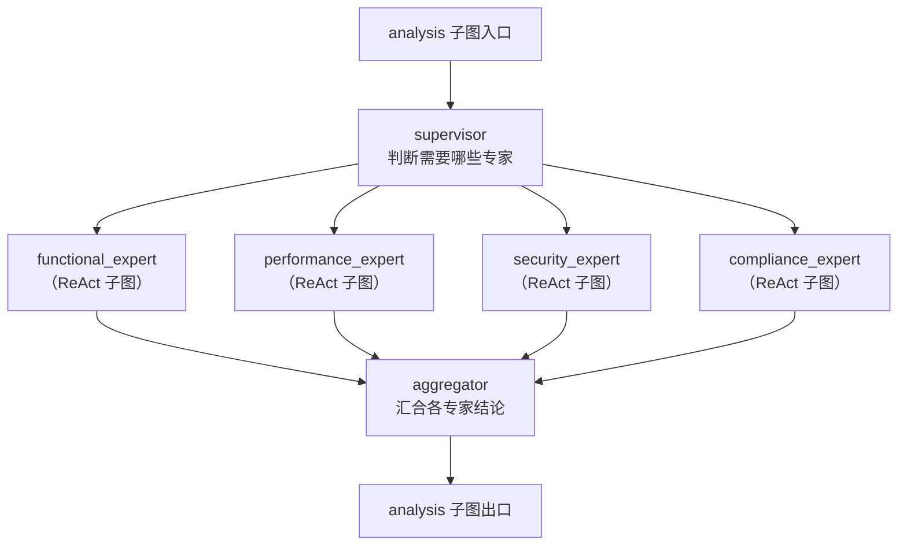
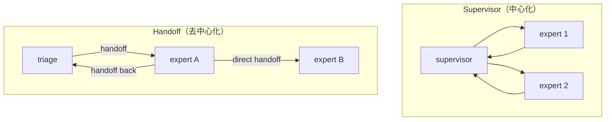
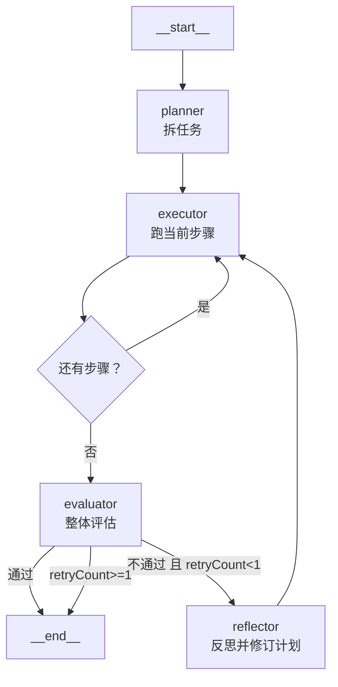

> 本文整理自《2026 前端 AI Agent 工程化实战营》课程资料，作为系列文章第 10 篇。

---
theme: channing-cyan
---


第八章把 Ch6 的五段式 Promise 链改造成了一张完整的单 Agent 图：classifier 分发意图、analysis 是一个 ReAct 子图、summary 是一个 Critic-Refine 子图，再加上 Checkpointer、HITL 与流式输出。前一章解决的是"一个 Agent 内部怎么把流程跑通"；本章要回答下一个问题：**当一个 Agent 不够用时，怎么办？**

**本章demo地址**：[feat/LangGraph](https://github.com/Cookieboty/autix-demo/tree/feat/LangGraph)


9.2 Supervisor + 多专家 Agent 集群

<aside>

📖 **上段提到的几个术语**

*   **ReAct**（Reasoning + Acting）：让 LLM 交替进行"推理"和"调用工具执行动作"的循环模式，直到任务完成。结构：agent → tools → agent → …
*   **Critic-Refine**：局部修订模式。Critic 评价输出质量，不合格则交给 Refine 修改，循环直到达标。只在子图内部回旋。
*   **Checkpointer**：LangGraph 的状态持久化机制，在每个节点后自动保存 State 快照，支持断点恢复和回溯。可以理解为：每跑完一步就存一次档。
*   **HITL**（Human-in-the-Loop，人工介入）：在自动化流程的关键节点暂停执行，等人类审核或补充信息后再继续。

</aside>

继续在**同一个文件**上升级。当需求类型从”单纯的业务需求”扩展到”功能/性能/安全/合规”四大类时，8.6 的单 Agent ReAct 会开始出现三类症状：

1.  一个 Agent 带 15+ 工具 → 选错工具、参数传错
2.  系统提示堆叠所有领域知识 → 上下文爆炸、token（LLM 的计费单位，约等于 0.75 个英文单词或 1\~2 个中文字符）成本失控
3.  想单独优化”安全评审”的质量 → 改动会波及所有领域的分析

解决方案就是第四章提过、本章要正式落地的 **Multi-Agent**：把 analysis 拆成多个专业子图，用不同的编排模式组合起来。

> **你可以把这一章的内容复制到项目里（如下图所示），再借助 AI 阅读本章并配合 spec，这样确实更容易把项目跑通。但如果目的是学习，我不建议这么做：亲自摸索一遍会更有收获。你可以把 AI 当作辅助，但它无法替代完整的思考过程；只有自己学习、自己思考，才能把这些内容真正内化。**


<aside>

🎯 **本章继续在** `requirement-analysis-graph.ts` **上演进**

*   **9.2 Supervisor**：analysis 子图 → Supervisor + 4 个专家 ReAct 子图，替换 8.6 的 analysis 子图。
*   **9.3 并行分发**：Supervisor 内部多个专家**同时**执行；无依赖就并发，改写 9.2 的调度方式。
*   **9.4 Handoff**：去中心化交接，分诊 Agent ↔︎ 专家 Agent 直接传控制权，作为 Supervisor 的替代范式。
*   **9.5 组合流水线**：外层 Plan-and-Execute + 末端 Reflexion，包住 9.2\~9.3，替换主图装配器。
*   **9.6 生产化**：错误降级 / UI 协议 / PostgresSaver / 成本控制，工程化补齐。

</aside>

<aside>

📌 **Multi-Agent 的本质是"子图编排"**

第八章 8.6 已经给出了最关键的原语：**子图作为节点**。本章不引入新原语，只是把这个原语用到更大规模——每个专家 Agent 就是一张和 8.6 完全同构的 ReAct 子图，Multi-Agent 模式只是"怎么编排这些子图"。

</aside>

***

## 9.1 从单 Agent 到 Multi-Agent：问题在哪


9.1 从单 Agent 到 Multi-Agent：问题在哪

第八章 8.6 的 analysis 子图结构：

    analysis 子图
      ├── agent（bindTools: [search_requirement, check_conflicts]）
      └── tools（ToolNode）

扩展到四大类需求后，工具会膨胀成这样：

    search_requirement, check_conflicts, check_performance_budget,
    load_perf_baseline, check_security_policy, list_auth_scenarios,
    check_compliance_matrix, check_data_residency, check_retention_policy,
    ...

这会同时打破三件事：

| **症状**           | **根因**                                                    | **Multi-Agent 的对策**         |
| ---------------- | --------------------------------------------------------- | --------------------------- |
| 模型经常选错工具         | 工具 description 互相干扰，单 Agent 的 context 里 15+ 工具签名会让模型判断力下降 | 每个领域的工具只暴露给对应专家 Agent       |
| system prompt 失控 | 要同时讲”功能分析规范 / 性能基线 / 安全策略 / 合规矩阵”                         | 每个专家的 system prompt 只讲自己的领域 |
| 质量改不动            | 调优安全评审会影响功能分析的输出                                          | 专家子图独立迭代、独立评估               |

**本章要把 8.6 的 analysis 子图替换成这样的结构**：



主图（triage → extract → clarify → **analysis** → risk → summary，9.4 之前入口节点叫 classifier）**完全不用改**——这是”子图作为节点”的复利：只要新子图的输入输出契约不变（读取 `state.clarified`、写入 `state.analysis`），主图对此无感。

***

## 9.2 把 analysis 子图升级为 Supervisor + 专家集群

<aside>

📖 **Supervisor（中心化调度模式）**：一个"调度员"节点判断本次需要哪些专家参与，将任务分发下去，专家完成后结果汇合到聚合节点。可以理解为：先由一个调度角色分派任务，再把各方结论收回来统一整理。

</aside>


### 🤖 用 AI 生成本节代码

*   点击展开完整 Prompt（可直接粘贴到 Cursor/Claude 执行）

        我正在实现第九章 9.2 节：把单 Agent analysis 子图升级为 Supervisor + 多专家架构。

        **背景**：
        - 当前第八章的 requirement-analysis-graph.ts 已有完整的单 Agent ReAct 子图
        - 需要保持主图不变，只替换 analysis 子图内部实现

        **任务**：
        1. 在 services/chat/src/llm/graph/ 下创建 experts.ts
        2. 实现 createExpertSubGraph 工厂函数（参数化 model、tools、systemPrompt、outputField）
        3. 实现四个专家工厂：createFunctionalExpert、createPerformanceExpert、createSecurityExpert、createComplianceExpert
        4. 为每个专家配置正确的工具集和详细的 system prompt（参考文档中的完整版本）
        5. 实现 supervisorNode（使用 withStructuredOutput 判断需要哪些专家）
        6. 实现 createAnalysisSupervisorSubGraph（包含 supervisor、4 个专家节点、aggregator）
        7. 使用 START/END 常量替代字符串
        8. 所有需要 model 的节点都通过参数传递，不要调用 createChatModel()

        **关键约束**：
        - 专家子图内部可以使用 messages（用于工具调用），但只输出到各自的 outputField
        - aggregator 汇总时检查 state.activeExperts，只合并被选中的专家结论
        - 条件边 routeToExperts 返回数组以触发并行执行
        - 使用 @langchain/langgraph 的 START, END 常量

        **输出要求**：
        - 生成完整的 experts.ts 文件
        - 在 requirement-analysis-graph.ts 中增加 State 字段定义
        - 说明如何替换 createAnalysisGraph 中的 analysis 子图
        - 不要删除原有的 createAnalysisSubGraph，保留作为对比

        请按照第九章文档中的完整代码实现。

**业务驱动**：需求 REQ-20240315-001 是”批量导入 Excel 数据”——同时涉及功能（导入入口）、性能（大文件）、安全（数据权限）。单 Agent 很难一口气把三方面讲清楚；用 Supervisor 派给三个专家，每个专家只做自己那部分，汇总时自然形成结构化报告。

<aside>

⚠️ **关于 model 参数的重要说明**

在前面的章节中，我们已经将模型配置迁移到了数据库。当前项目中 `OrchestratorService` 通过 `ModelConfigService.getConfigForOrchestrator(modelConfigId)` 从数据库读取模型配置，然后调用 `createChatModelFromDbConfig(dbConfig)` 创建 `ChatOpenAI` 实例（详见 `services/chat/src/llm/model.factory.ts`）。

因此本章所有的 `createExpertSubGraph(model)`、`supervisorNode(state, { model })` 等函数签名中，`model` 参数都是从 `OrchestratorService` 一路透传下来的，不是在图内部自己创建的。这保证了：

1.  所有专家共用同一个模型实例（或配置），行为一致
2.  模型切换只需修改数据库记录，无需改代码
3.  模型实例通过 `modelCache` 缓存，不会重复创建

如果你在跟随本章动手实践但还没做模型数据库化，可以暂时用硬编码的方式创建 model：

```tsx
import { createChatModel } from '../model.factory';

const model = createChatModel({
  modelConfigId: 'default',
  modelName: 'gpt-4',
  temperature: 0.7,
  apiKey: process.env.OPENAI_API_KEY,
  baseUrl: process.env.OPENAI_BASE_URL,
});
```

</aside>

### 9.2.1 专家子图：和 8.6 的 ReAct 子图完全同构

每个专家 Agent 就是一张 ReAct 子图，结构和 8.6 的 `createAnalysisSubGraph` 一模一样，只有三个变量不同：**工具集、system prompt、写入的 state 字段**。

先在 State 里为每个专家预留一个字段：

```tsx
// RequirementAnalysisState 增量
// （把 analysis: string 继续保留，但现在由 aggregator 填写；分专家的原始结论进入下面四个字段）
functionalAnalysis: Annotation<string>({ default: () => '' }),
performanceAnalysis: Annotation<string>({ default: () => '' }),
securityAnalysis: Annotation<string>({ default: () => '' }),
complianceAnalysis: Annotation<string>({ default: () => '' }),
activeExperts: Annotation<string[]>({
  reducer: (_prev, next) => next,  // 每次由 supervisor 覆盖
  default: () => [],
}),
```

复用 8.6 的 ReAct 模板，抽成一个工厂函数：

```tsx
// services/chat/src/llm/graph/experts.ts
import { ToolNode } from '@langchain/langgraph/prebuilt';
import { START, END, StateGraph } from '@langchain/langgraph';
import { BaseChatModel } from '@langchain/core/language_models/chat_models';
import { RequirementAnalysisState } from './requirement-analysis-graph';

type ExpertOptions = {
  name: string;
  model: BaseChatModel;
  tools: any[];
  systemPrompt: string;
  outputField: 'functionalAnalysis' | 'performanceAnalysis' | 'securityAnalysis' | 'complianceAnalysis';
  maxSteps?: number;
};

export function createExpertSubGraph(opts: ExpertOptions) {
  const { model, tools, systemPrompt, outputField, maxSteps = 6 } = opts;

  async function agentNode(state: typeof RequirementAnalysisState.State) {
    const modelWithTools = model.bindTools(tools);
    const response = await modelWithTools.invoke([
      { role: 'system', content: systemPrompt },
      { role: 'user', content: `已澄清的需求：${JSON.stringify(state.clarified)}\n\n原始输入：${state.input}` },
    ]);
    // ⚠️ 子图内部的 messages 用于工具调用循环（agent → tools → agent）
    // 最终结论通过 finalizeNode 写入专家各自的 outputField，不会污染主图 messages
    return { messages: [response] };
  }

  function shouldCallTools(state: typeof RequirementAnalysisState.State) {
    const last = state.messages.at(-1) as any;
    const toolRounds = state.messages.filter((m: any) => m._getType?.() === 'tool').length;
    if (toolRounds >= maxSteps) return END;
    return last?.tool_calls?.length > 0 ? 'tools' : 'finalize';
  }

  async function finalizeNode(state: typeof RequirementAnalysisState.State) {
    // 9.6.1 错误降级：如果 agentNode 的 catch 已经写入"暂不可用"标记，直接保留
    const existingOutput = (state as any)[outputField];
    if (existingOutput && existingOutput.includes('暂不可用')) {
      return {};
    }

    const last = state.messages.at(-1);
    const content = (last?.content as string) ?? '';
    // 9.8.4 Q8 空内容兜底：模型偶尔返回空 content，给个明确占位避免 aggregator 收到空串
    if (!content.trim()) {
      return {
        [outputField]: `[${opts.name} 专家未生成有效输出，请检查输入和工具配置]`,
      };
    }
    // 只写入专家结论，不写入 messages
    return { [outputField]: content };
  }

  return new StateGraph(RequirementAnalysisState)
    .addNode('agent', agentNode)
    .addNode('tools', new ToolNode(tools))
    .addNode('finalize', finalizeNode)
    .addEdge(START, 'agent')
    .addConditionalEdges('agent', shouldCallTools, {
      tools: 'tools',
      finalize: 'finalize',
    })
    .addEdge('tools', 'agent')
    .addEdge('finalize', END)
    .compile();
}
```

用这个工厂创建四个专家工厂函数（注意：需要传入 model）：

```tsx
import { searchRequirementTool, checkConflictsTool } from '../tools/analysis-tools';
import {
  readFeatureSpecTool,
  loadPerfBaselineTool,
  checkPerfBudgetTool,
  checkSecurityPolicyTool,
  listAuthScenariosTool,
  checkComplianceMatrixTool,
  checkDataResidencyTool,
  checkRetentionPolicyTool,
} from '../tools/expert-tools';

export function createFunctionalExpert(model: BaseChatModel) {
  return createExpertSubGraph({
    name: 'functional',
    model,
    tools: [searchRequirementTool, checkConflictsTool, readFeatureSpecTool],
    systemPrompt: `你是功能需求分析专家，专注评估需求的功能完整性、交互合理性和系统兼容性。

**核心职责**：
1. 功能分解：将需求拆解为具体、可实现的功能模块
2. 交互分析：评估用户操作流程的合理性和一致性
3. 冲突检测：识别与现有功能的重叠或矛盾之处

**工具使用策略**：
- 如需求提到具体编号（如 REQ-XXX），先用 search_requirement 查询详情
- 如需求涉及已有功能模块，用 read_feature_spec 获取规范
- 完成信息收集后，用 check_conflicts 检测潜在冲突

**输出必需章节（使用 Markdown 二级标题）**：
## 功能模块拆解
- 列出 3-6 个主要功能模块
- 每个模块说明核心职责和边界

## 用户交互流程
- 描述典型使用场景的完整流程
- 标注关键交互点和用户决策点

## 功能依赖关系
- 列出前置功能或模块依赖
- 说明与其他系统的集成点

## 冲突与重叠分析
- 明确指出与现有功能的冲突（如有）
- 提供解决方案或替代设计`,
    outputField: 'functionalAnalysis',
  });
}

export function createPerformanceExpert(model: BaseChatModel) {
  return createExpertSubGraph({
    name: 'performance',
    model,
    tools: [loadPerfBaselineTool, checkPerfBudgetTool],
    systemPrompt: `你是系统性能分析专家，专注评估需求对系统吞吐、延迟、资源占用的影响。

**核心职责**：
1. 负载评估：预估新需求的访问量、并发数和数据量
2. 性能影响：分析对响应时间、吞吐量、资源使用的影响
3. 瓶颈识别：找出可能的性能瓶颈和优化点

**工具使用策略**：
- 首先用 load_perf_baseline 获取相关服务的当前性能基线
- 再用 check_perf_budget 评估新需求是否超出性能预算
- 基于工具返回的数据给出量化的分析结论

**输出必需章节（使用 Markdown 二级标题）**：
## 负载特征评估
- 预估 QPS / TPS / 并发连接数
- 数据量级（单次请求、存储增长）
- 访问模式（读多写少、突发流量等）

## 性能影响分析
- 对响应时间的影响（P50/P95/P99）
- 对吞吐量的影响
- CPU、内存、磁盘、网络资源消耗
- 与当前性能基线的对比

## 性能风险与瓶颈
- 可能的性能瓶颈点（数据库、缓存、网络等）
- 容量是否充足（需要扩容吗？）
- 高并发场景下的风险

## 优化建议
- 架构层面优化（如异步处理、队列、缓存）
- 具体实施建议（限流、分片、索引等）`,
    outputField: 'performanceAnalysis',
  });
}

export function createSecurityExpert(model: BaseChatModel) {
  return createExpertSubGraph({
    name: 'security',
    model,
    tools: [checkSecurityPolicyTool, listAuthScenariosTool],
    systemPrompt: `你是信息安全分析专家，专注识别需求中的安全风险和合规要求。

**核心职责**：
1. 威胁建模：识别潜在的安全威胁（认证、授权、数据泄露等）
2. 攻击面分析：评估新功能引入的攻击向量
3. 安全策略验证：确保符合组织的安全规范

**工具使用策略**：
- 先用 check_security_policy 检查需求是否触发已知安全策略
- 如涉及身份认证或授权，用 list_auth_scenarios 了解当前认证体系
- 基于 OWASP Top 10 和行业最佳实践进行分析

**输出必需章节（使用 Markdown 二级标题）**：
## 威胁与风险识别
- 列出主要安全威胁（如 SQL 注入、XSS、CSRF、越权访问）
- 评估风险等级（高/中/低）和潜在影响

## 认证与授权
- 需求涉及的认证场景
- 权限控制要求（RBAC / ABAC）
- Session 或 Token 管理策略

## 数据保护
- 敏感数据识别（PII、凭证、密钥等）
- 传输加密要求（HTTPS、TLS版本）
- 存储加密要求（字段级加密、全盘加密）
- 数据脱敏和访问日志

## 安全实施要求
- 必须遵循的安全编码规范
- 需要的安全测试（渗透测试、SAST/DAST）
- 上线前安全检查清单`,
    outputField: 'securityAnalysis',
  });
}

export function createComplianceExpert(model: BaseChatModel) {
  return createExpertSubGraph({
    name: 'compliance',
    model,
    tools: [checkComplianceMatrixTool, checkDataResidencyTool, checkRetentionPolicyTool],
    systemPrompt: `你是数据合规与隐私保护专家，专注评估需求的法律合规性和监管风险。

**核心职责**：
1. 法律法规适用性：识别需求涉及的法律法规（如个人信息保护法、网络安全法）
2. 数据合规：评估数据收集、处理、存储、跨境传输的合规性
3. 行业监管：检查是否符合特定行业的监管要求（金融、医疗、教育等）

**工具使用策略**：
- 用 check_compliance_matrix 检查需求涉及的数据类型和行业要求
- 如涉及跨境数据或特定地区用户，用 check_data_residency 验证数据驻留策略
- 用 check_retention_policy 确认数据保留时长是否合规

**输出必需章节（使用 Markdown 二级标题）**：
## 适用法律法规
- 列出适用的法律法规（中国：个人信息保护法、网络安全法；欧盟：GDPR等）
- 说明触发这些法规的具体条款

## 个人信息处理合规
- 收集的个人信息类型和范围
- 收集依据（用户同意、合同履行、法定义务等）
- 告知义务（隐私政策更新点）
- 用户权利（查询、更正、删除、撤回同意）

## 数据跨境与驻留
- 数据存储位置要求
- 是否涉及跨境传输（需要的评估和审批）
- 数据本地化要求

## 数据生命周期管理
- 数据保留期限
- 删除或匿名化策略
- 备份和归档要求

## 合规风险与整改建议
- 识别的合规风险点（高/中/低）
- 需要的合规整改措施
- 建议咨询法务部门确认的事项`,
    outputField: 'complianceAnalysis',
  });
}
```

<aside>

📌 **复用 8.6 的关键动作**

专家子图不是"新概念"，它就是 8.6 的 `createAnalysisSubGraph`，只是参数化了工具、prompt、输出字段。工厂函数 `createExpertSubGraph` 一次写好，四个专家只是调用。这就是为什么 8.6 的子图原语如此重要。

</aside>

> 📋 **本节配套用例**：`bun test test/chapter9-multi-agent.spec.ts -t "9.2.1"`
> 跑完会看到：State 4 个新字段一览、`createExpertSubGraph` 在专家抛错时如何降级输出”暂不可用：xxx”。


### 9.2.2 Supervisor：决定这次请求需要哪些专家

不是所有需求都需要四个专家全上。“批量导入 Excel”可能只需要功能+性能+安全；“修改按钮文案”可能只需要功能。Supervisor 的职责就是读 `clarified`，通过 `withStructuredOutput`（📖 LangChain 提供的方法，让 LLM 按 Zod Schema 输出结构化 JSON 而非自由文本，确保返回值可靠可解析）判断**本次需要哪些专家**。

```tsx
import { z } from 'zod';

async function supervisorNode(
  state: typeof RequirementAnalysisState.State,
  config: { model: BaseChatModel },
) {
  const { model } = config;
  const structured = model.withStructuredOutput(
    z.object({
      experts: z
        .array(
          z.enum(['functional', 'performance', 'security', 'compliance']),
        )
        .min(1)
        .describe(
          '需要参与本次分析的专家列表。functional=功能分析, performance=性能分析, security=安全分析, compliance=合规分析',
        ),
      reason: z.string().describe('选择这些专家的理由'),
    }),
  );
  const result = await structured.invoke([
    {
      role: 'system',
      content: `你是需求分析调度员。根据已澄清的需求，判断本次需要哪些专家评审。

可选专家：
- functional：功能需求分析（任何需求都至少需要）
- performance：性能分析（涉及批量操作、大文件、实时性、高并发时选择）
- security：安全分析（涉及登录、权限、数据访问、文件上传时选择）
- compliance：合规分析（涉及跨境、个人信息、行业监管、金融/医疗时选择）

判断规则：
- 涉及批量操作、大文件、实时性 → 必须包含 performance
- 涉及登录、权限、数据访问 → 必须包含 security
- 涉及跨境、个人信息、行业监管 → 必须包含 compliance
- 任何需求都至少包含 functional

至少选一个专家。`,
    },
    {
      role: 'user',
      content: `已澄清的需求信息：${JSON.stringify(state.clarified)}\n\n原始输入：${state.input}`,
    },
  ]);
  return { activeExperts: result.experts };
}
```

<aside>

💡 **Prompt 选型说明**

早期版本只有"可选 functional / performance / security / compliance。至少选一个"这一句，调度结果偏保守（参见 9.8.1 Q1 排查）。落地版本把"何时该选"显式写进 prompt 并配上 `.describe()` 元信息，模型选择更稳定。

</aside>

> 📋 **本节配套用例**：`bun test test/chapter9-multi-agent.spec.ts -t "9.2.2"`
> 用 mock model 喂 3 类需求（文案修改 / 批量导入 / 综合场景），看 Supervisor 输出的 `activeExperts` 数组。

### 9.2.3 Supervisor 子图装配

```tsx
function createAnalysisSupervisorSubGraph(model: BaseChatModel) {
  // aggregator：把选中的专家结论合成 analysis 总输出
  async function aggregatorNode(state: typeof RequirementAnalysisState.State) {
    const parts: string[] = [];
    if (state.activeExperts.includes('functional') && state.functionalAnalysis) {
      parts.push(`## 功能分析\n${state.functionalAnalysis}`);
    }
    if (state.activeExperts.includes('performance') && state.performanceAnalysis) {
      parts.push(`## 性能分析\n${state.performanceAnalysis}`);
    }
    if (state.activeExperts.includes('security') && state.securityAnalysis) {
      parts.push(`## 安全分析\n${state.securityAnalysis}`);
    }
    if (state.activeExperts.includes('compliance') && state.complianceAnalysis) {
      parts.push(`## 合规分析\n${state.complianceAnalysis}`);
    }
    return { analysisResult: parts.join('\n\n') };
  }

  // Supervisor 跑完后，按 activeExperts 动态决定走哪些分支
  function routeToExperts(state: typeof RequirementAnalysisState.State) {
    // 返回一个数组 → LangGraph 会并发触发这些节点
    return state.activeExperts.map((e) => `${e}_expert`);
  }

  // 创建专家子图实例
  const functionalExpert = createFunctionalExpert(model);
  const performanceExpert = createPerformanceExpert(model);
  const securityExpert = createSecurityExpert(model);
  const complianceExpert = createComplianceExpert(model);

  return new StateGraph(RequirementAnalysisState)
    .addNode('supervisor', (state) => supervisorNode(state, { model }))
    .addNode('functional_expert', functionalExpert)
    .addNode('performance_expert', performanceExpert)
    .addNode('security_expert', securityExpert)
    .addNode('compliance_expert', complianceExpert)
    .addNode('aggregator', aggregatorNode)
    .addEdge(START, 'supervisor')
    .addConditionalEdges('supervisor', routeToExperts, {
      functional_expert: 'functional_expert',
      performance_expert: 'performance_expert',
      security_expert: 'security_expert',
      compliance_expert: 'compliance_expert',
    })
    // 每个专家跑完都汇合到 aggregator（LangGraph 会自动等所有并发分支都到齐）
    .addEdge('functional_expert', 'aggregator')
    .addEdge('performance_expert', 'aggregator')
    .addEdge('security_expert', 'aggregator')
    .addEdge('compliance_expert', 'aggregator')
    .addEdge('aggregator', END)
    .compile();
}
```

> 📋 **本节配套用例**：

*   `bun test test/chapter9-multi-agent.spec.ts -t "9.2.3"` —— 看 `aggregatorNode` 如何把多专家输出合成报告，以及降级专家如何被标 ⚠️


*   `bun test test/chapter9-multi-agent.spec.ts -t "9.3"` —— 看 `routeToExperts` 把 `activeExperts` 数组转成并发节点列表


### 9.2.4 主图装配：只改一处

> 说明：本节展示的是\*\*当前主图（已包含 9.4 Triage 改造）\*\*的装配代码。如果想看 8.6 → 9.2 的”最小 diff”，关键就一行：`createAnalysisSubGraph(model)` 换成 `createAnalysisSupervisorSubGraph(model)`，主图其余部分一行不改。

```tsx
export function createAnalysisGraph(
  model: BaseChatModel,
  options?: {
    checkpointer?: BaseCheckpointSaver;
    interruptBefore?: string[];
  },
) {
  // 9.2: Supervisor + 4 专家并行子图
  const analysisSubGraph = createAnalysisSupervisorSubGraph(model);
  // 8.7: Critic-Refine 子图不变
  const summarySubGraph = createSummarySubGraph(model);

  const graph = new StateGraph(RequirementAnalysisState)
    // 9.4: Triage 替代原 classifier，简单问题在 triage 内直接回答
    .addNode('triage', (state) => triageNode(state, { model }))
    .addNode('extractStep', (state) => extractNode(state, { model }))
    .addNode('clarifyStep', (state) => clarifyNode(state, { model }))
    .addNode('analysisStep', analysisSubGraph)  // 🔑 子图作为节点，主图无感
    .addNode('riskStep', (state) => riskNode(state, { model }))
    .addNode('summaryStep', summarySubGraph)
    .addNode('queryHandler', (state) => queryHandlerNode(state, { model }))

    .addEdge(START, 'triage')
    // triage 根据 intent 路由：analyze→extractStep / query→queryHandler / chat→END
    .addConditionalEdges('triage', routeByIntent)
    .addEdge('extractStep', 'clarifyStep')
    // clarify 后条件路由：不需要澄清时并行触发 analysis + risk
    .addConditionalEdges('clarifyStep', routeAfterClarify)
    // analysis 和 risk 都汇聚到 summary
    .addEdge('analysisStep', 'summaryStep')
    .addEdge('riskStep', 'summaryStep')
    .addEdge('summaryStep', END)
    .addEdge('queryHandler', END);

  return graph.compile({
    checkpointer: options?.checkpointer,
    interruptBefore: options?.interruptBefore as any,
  });
}
```

<aside>

💡 **几个被读者反复问的细节**

*   `clarifyStep` 后是 `routeAfterClarify` 条件边，不需要澄清时**并行触发** `analysisStep` 和 `riskStep`，两者都完成后才进入 `summaryStep`，比串行 `analysis → risk → summary` 快接近一倍。
*   chat 意图直接由 `triage` 节点写入 `chatResponse`/`messages` 后路由到 `END`，不再经过额外的 `chatHandler`，省一次 LLM 调用——细节见 9.4.2。
*   `checkpointer` 和 `interruptBefore` 是可选参数；不传时图就是普通无状态版本，传了就启用 HITL（参见 9.6.2）。

</aside>

<aside>

📌 **"子图作为节点"的复利在这里兑现**

主图的边、Checkpointer 配置、HITL 配置、流式推送、UI 映射——**一行都不用改**。这正是第八章坚持把 analysis 做成独立子图的原因：单 Agent → Multi-Agent 的迁移被收敛到了 analysis 子图内部。

</aside>

***

## 9.3 并行分发：让多个专家同时工作


9.3 LangGraph 多专家并行分发

9.2 的 `routeToExperts` 返回**数组**而非单个字符串——这是关键。LangGraph 识别到条件边返回数组时，会**并发触发**所有目标节点，并等它们全部到达同一个汇合节点（aggregator）后再继续。

这个机制天然替代了第四章的 `Promise.all`——不需要手动 `await Promise.all([...])`，图引擎自己处理并发、错误、汇合。

### 9.3.1 并行执行的时间线

以”需要 functional + performance + security 三个专家”为例：

    时间轴 →

    supervisor ─┬─▶ functional_expert ─────┐
                ├─▶ performance_expert ────┼─▶ aggregator ─▶ ...
                └─▶ security_expert ───────┘
                (三条分支同时启动)           (所有分支到齐才继续)

假设三个专家各自平均耗时 4 秒：

*   串行版（Supervisor 一次调一个）：≈ 12 秒
*   并行版（9.2/9.3 的写法）：≈ 4 秒（取最慢的那个）

### 9.3.2 并发写入 State 的一个关键细节

四个专家会**同时**往 State 写入：

*   `functional_expert` 写 `functionalAnalysis`
*   `performance_expert` 写 `performanceAnalysis`
*   `security_expert` 写 `securityAnalysis`
*   `compliance_expert` 写 `complianceAnalysis`

因为**每个专家写的是不同字段**，默认的覆盖式 reducer（📖 State 字段的合并函数——当多个节点同时写入同一字段时，决定是覆盖、追加还是自定义合并）不会冲突。但如果你不小心让两个并发节点都去写同一个字段（比如都写 `analysis`），后者会覆盖前者——这是并发场景下最容易踩的坑。

<aside>

⚠️ **并发写同一字段必须用追加/合并 reducer**

如果确实需要多个并发节点写同一字段（比如都往 `messages` 追加），必须用追加 reducer：`reducer: (prev, next) => [...prev, ...next]`。否则并发写入会变成"随机保留一个"。

</aside>

### 9.3.3 和第四章 Promise.all 的对比

| **维度** | **第四章 Promise.all**                           | **本章图原生并行**                 |
| ------ | --------------------------------------------- | --------------------------- |
| 并发表达   | `await Promise.all([a.invoke(), b.invoke()])` | 条件边返回数组，引擎自动并发              |
| 状态共享   | 每个 Agent 的输出要手动合并                             | State + reducer 自动合并        |
| 错误处理   | 一个失败全体失败，要自己 try-catch                        | 节点级失败可在图里单独处理（见 9.6）        |
| 可观测性   | 手工打日志                                         | `streamEvents` 自动分别上报每个并发节点 |
| 持久化    | 中间状态要自己存                                      | Checkpointer 自动快照”已完成的并发分支” |

**Checkpointer 的部分尤其关键**：如果 4 个专家并发中有 3 个完成、1 个超时挂起，断点恢复后图会**只重跑未完成的那一个**，不会重复消耗已完成专家的 token。这是 Promise.all 完全做不到的。

### 9.3.4 验证与测试

完成 9.2 和 9.3 的实现后，需要系统地验证 Supervisor 调度和并行执行是否正常工作。

### 测试脚本

创建 `services/chat/src/llm/graph/test-multi-agent.ts`：

```tsx
import { createAnalysisGraph } from './requirement-analysis-graph';
import { createChatModel } from '../model.factory';

async function testMultiAgent() {
  const model = createChatModel({
    modelConfigId: 'test-multi-agent',
    modelName: process.env.OPENAI_MODEL || 'gpt-5.5',
    temperature: 0,
    apiKey: process.env.OPENAI_API_KEY,
    baseUrl: process.env.OPENAI_BASE_URL,
  });

  const graph = createAnalysisGraph(model);

  const testCases = [
    {
      name: '单专家场景：简单文案修改',
      input: '需求：将登录页的"登录"按钮文案改为"立即登录"',
      expectedExperts: ['functional'],
    },
    {
      name: '双专家场景：功能+性能',
      input: '需求 REQ-20240315-001：支持批量导入 Excel 用户数据，单次最多 10000 行',
      expectedExperts: ['functional', 'performance'],
    },
    {
      name: '三专家场景：功能+性能+安全',
      input: '需求：新增用户敏感数据导出功能，支持导出用户手机号和身份证信息',
      expectedExperts: ['functional', 'performance', 'security'],
    },
    {
      name: '四专家全开：复杂的金融场景',
      input: '需求：开发跨境支付功能，支持欧盟和中国用户，涉及个人金融信息处理',
      expectedExperts: ['functional', 'performance', 'security', 'compliance'],
    },
    {
      name: '边界场景：模糊需求',
      input: '需求：优化系统',
      expectedExperts: [], // 期望 supervisor 至少选一个
    },
  ];

  for (const testCase of testCases) {
    console.log(`\n${'='.repeat(60)}`);
    console.log(`测试用例：${testCase.name}`);
    console.log(`输入：${testCase.input}`);
    console.log(`期望专家：${testCase.expectedExperts.join(', ') || '至少一个'}`);
    console.log(`${'='.repeat(60)}\n`);

    const startTime = Date.now();

    try {
      const result = await graph.invoke(
        {
          input: testCase.input,
          messages: [],
        },
      );

      const elapsedTime = Date.now() - startTime;

      console.log(`\n✓ 执行成功 (耗时:${elapsedTime}ms)`);
      console.log(`实际选中的专家：${result.activeExperts?.join(', ') || '无'}`);

      // 检查每个专家的输出
      if (result.activeExperts) {
        for (const expert of result.activeExperts) {
          const outputField = `${expert}Analysis`;
          const output = (result as any)[outputField];
          console.log(`\n【${expert} 专家输出】（${output?.length || 0} 字符）`);
          console.log(output?.substring(0, 200) + (output?.length > 200 ? '...' : ''));
        }
      }

      // 检查汇总结果
      console.log(`\n【汇总结果】（${result.analysisResult?.length || 0} 字符）`);
      console.log(result.analysisResult?.substring(0, 300) + '...');

      // 验证并行执行（如果有多个专家）
      if (result.activeExperts && result.activeExperts.length > 1) {
        const avgTimePerExpert = elapsedTime / result.activeExperts.length;
        console.log(`\n⚡ 并行效果：平均每专家${avgTimePerExpert.toFixed(0)}ms`);
        console.log(`   （串行预估：${(elapsedTime / result.activeExperts.length * result.activeExperts.length).toFixed(0)}ms）`);
      }

    } catch (error: unknown) {
      const err = error instanceof Error ? error : new Error(String(error));
      console.error(`\n✗ 执行失败：${err.message}`);
      console.error(err.stack);
    }
  }
}

testMultiAgent().catch(console.error);
```

### 执行测试

```bash
cd services/chat
bun run src/llm/graph/test-multi-agent.ts
```


### 验收标准

1.  **Supervisor 调度正确性**
    *   简单需求（文案修改）只调用 functional 专家
    *   批量导入场景调用 functional + performance
    *   敏感数据导出调用 functional + performance + security
    *   跨境金融场景调用全部 4 个专家
2.  **并行执行验证**
    *   多专家场景的总耗时接近单个最慢的专家（而非总和）
    *   查看日志确认专家节点的 timestamp 接近（并发启动）
3.  **专家输出完整性**
    *   每个被调用的专家都有对应的 `${expert}Analysis` 输出
    *   aggregator 的 `analysisResult` 正确合成了所有专家的结论
    *   每个专家的输出包含了 prompt 要求的必需章节（如”功能模块拆解”）
4.  **错误处理**
    *   模糊需求不会导致 activeExperts 为空（至少选一个）
    *   单个专家失败不影响其他专家执行（见 9.6.1 错误降级）
5.  **工具调用验证**
    *   functional 专家调用了 search\_requirement / check\_conflicts
    *   performance 专家调用了 load\_perf\_baseline / check\_perf\_budget
    *   security 专家调用了 check\_security\_policy
    *   工具调用次数在 maxSteps=6 限制内

### 前端集成验证

启动完整系统并在前端测试：

```bash
# 启动全服务
bun run dev
```

在前端 Chat 界面输入：

    支持批量导入 Excel 用户数据，单次最多 10000 行


**期望行为**：

*   主进度条显示：triage → extract → clarify → 多维度分析 → risk → summary
*   “并行执行”面板里 functional\_expert 和 performance\_expert 同时进入 “running” 状态
*   两个专家完成后并行面板里同时变为 “completed”
*   最终的分析报告包含”功能分析”和”性能分析”两个章节

> 注意：你的输入会直接影响最终结果。我提供的测试用例也可能受到模型幻觉影响，因此需要根据实际情况进行 prompt 微调与适配；同时，不同的 LLM 也可能产生不同的结果倾向。

### 常见问题排查

| 症状                                | 可能原因                                  | 排查方法                                                                      |
| --------------------------------- | ------------------------------------- | ------------------------------------------------------------------------- |
| activeExperts 始终为 \[‘functional’] | supervisorNode 的 prompt 太保守，总是只选功能专家  | 检查 supervisor 的 system prompt，增强专家选择的判断逻辑                                 |
| 并行耗时和串行一样                         | 条件边没有返回数组                             | 确认 routeToExperts 返回的是数组（如 `['functional_expert', 'performance_expert']`） |
| aggregatorNode 收到空的专家输出           | 专家子图的 finalizeNode 没有正确写入 outputField | 检查 createExpertSubGraph 中 finalizeNode 的返回值                               |
| messages 字段出现多个专家的对话混杂            | 专家 agentNode 写入了 messages             | 确认专家只写 outputField，不写 messages                                            |

### 自动化回归（推荐每次改动 supervisor/experts 时都跑）

```bash
cd services/chat
bun test test/chapter9-multi-agent.spec.ts
# 49 个 mock 用例（无需 API key）+ 8 个集成用例（设置 OPENAI_API_KEY 后启用）
```

mock 用例在 \~150ms 内跑完，覆盖了上面”验收标准”清单里大部分逻辑分支，并按章节组织（`-t "9.2.1"` / `-t "9.5.5"` 等可单独跑）；集成用例则对应”前端集成验证”那一节描述的 LLM 实测，包含 supervisor 调度准确性、triage 意图识别、runPipeline 端到端等。

***

## 9.4 Handoff：去中心化交接作为 Supervisor 的替代范式

### 🤖 用 AI 生成本节代码

<aside>

✅ **本节已落地**

下面的 Prompt 记录的是 classifier → triage 的改造路径，保留它是为了方便回看重构思路；如果只关心当前实现，直接看 9.4.2 即可。

</aside>

*   点击展开完整 Prompt（可直接粘贴到 Cursor/Claude 执行）

        我正在实现第九章 9.4 节：用 Handoff 模式升级 classifier 为 triageNode。

        **背景**：
        - 当前的 classifierNode 只做意图分类（analyze / query / chat）
        - 需要升级为具有更灵活交接能力的 triageNode

        **任务**：
        1. 在 requirement-analysis-graph.ts 中定义 triageSchema（zod schema）
           - action: 'answer' | 'handoff_to_analysis' | 'handoff_to_risk'
           - response: 用于 action='answer' 时直接回复用户
           - reason: 交接理由（可选）
        2. 实现 triageNode 函数
           - 接收 state 和 { model } config
           - 使用 model.withStructuredOutput 进行结构化输出
           - 返回 messages（包含分诊结果）、intent、handoffReason
        3. 在 State 中新增字段：
           - handoffReason: Annotation<string>
        4. 更新主图的 classifier 节点为 triage（可选，作为演示）

        **关键约束**：
        - triageNode 需要接收 config: { model } 参数
        - 使用 AIMessage 构造消息
        - intent 映射：handoff_to_analysis → 'analyze'，handoff_to_risk → 'risk_only'，answer → 'chat'

        **输出要求**：
        - 完整的 triageNode 实现
        - triageSchema 定义
        - State 增量定义
        - 说明如何在主图中替换 classifierNode

        本节是可选升级，也可以保留原 classifierNode，将 triage 作为概念演示。

Supervisor 是**中心化调度**：所有专家都必须经过 Supervisor 才能进入/退出。Handoff 是**去中心化交接**：Agent 之间直接传递控制权，没有中心调度者。


### 9.4.1 什么时候需要 Handoff 而不是 Supervisor

| **场景**                                  | **选择**          |
| --------------------------------------- | --------------- |
| 一个请求明确涉及多个独立维度（功能+性能+安全）                | Supervisor（9.2） |
| 分诊场景：先粗判，简单问题直接回，复杂问题转专家，专家处理完可能还要回分诊收尾 | Handoff（本节）     |
| 对话连续性重要：希望前一个 Agent 把自己的上下文”交接”给下一个     | Handoff         |

在当前系统里，Handoff 最自然的落点是**把 classifier 升级成分诊 Agent**——原本 classifier 只是意图分类，简单问题（闲聊/问候）也要走完整的”分类 → chatHandler”两步。Handoff 把”简单问题直接答”和”复杂问题交接专家”合并到一个节点里，闲聊场景节省一次 LLM 调用。

### 9.4.2 改造：用 Handoff 替换 classifier（已落地）

<aside>

✅ **本节内容已落地**

`services/chat/src/llm/graph/requirement-analysis-graph.ts` 中，原 `classifierNode` 已被删除，主图入口节点 `triage` 在 `createAnalysisGraph` 里替代它；闲聊场景由 `triage` 直接回答并短路 END，不再走 `chatHandler`。

</aside>

```tsx
import { AIMessage } from '@langchain/core/messages';

// 把原 classifierNode 升级为 triageNode
export const triageSchema = z.object({
  action: z.enum(['answer', 'handoff_to_query', 'handoff_to_analysis']),
  response: z.string().describe('当 action=answer 时直接回复用户的内容'),
  reason: z.string().nullable().describe('交接理由，无理由时为 null'),
});

export async function triageNode(
  state: typeof RequirementAnalysisState.State,
  config: { model: BaseChatModel },
): Promise<Partial<typeof RequirementAnalysisState.State>> {
  const { model } = config;
  const structured = model.withStructuredOutput(triageSchema);
  const result = await structured.invoke([
    {
      role: 'system',
      content: `你是需求分诊 Agent。判断用户意图，规则：
- 闲聊、问候、术语解释 → action: answer（直接在 response 里回答用户）
- 查询已有需求的状态/信息（含 REQ-编号） → action: handoff_to_query
- 需要完整性/冲突/复杂度分析、需求评估 → action: handoff_to_analysis
转交时给出简要理由。`,
    },
    ...state.messages,
    { role: 'user', content: state.input },
  ]);

  if (result.action === 'answer') {
    // chat 短路：triage 直接回答，主图随后路由到 END
    return {
      messages: [new AIMessage(result.response)],
      intent: 'chat',
      chatResponse: result.response,
      summary: result.response,
      handoffReason: '',
    };
  }

  if (result.action === 'handoff_to_query') {
    return { intent: 'query', handoffReason: result.reason || '' };
  }

  return { intent: 'analyze', handoffReason: result.reason || '' };
}
```

主图装配只改一处：

```tsx
// createAnalysisGraph 入口
.addNode('triage', (state) => triageNode(state, { model }))
.addEdge(START, 'triage')
.addConditionalEdges('triage', routeByIntent);

// 路由规则
function routeByIntent(state: typeof RequirementAnalysisState.State): string {
  switch (state.intent) {
    case 'query':   return 'queryHandler';
    case 'chat':    return END;        // ⭐ triage 已直接回答
    case 'analyze':
    default:        return 'extractStep';
  }
}
```

> **设计要点**：

*   `intent` 类型仍然是 `'analyze' | 'query' | 'chat'` 三选一，前端 SSE/UI 协议无感知
*   chat 走 END 而非 chatHandler，省一次 LLM 调用；`triage` 节点同时负责”分诊”和”闲聊回答”两个职责
*   `OrchestratorService` 的 `nodeToAgentMap` 同步把 `'classifier' → 'classifierAgent'` 改成 `'triage' → 'triageAgent'`，并在 `chat` 分支只 push `triageAgent`


> 📋 **本节配套用例**：`bun test test/chapter9-multi-agent.spec.ts -t "9.4"`
> 8 个用例覆盖：schema 接受 3 种合法 action / 拒绝旧 `handoff_to_risk` / `answer` 短路链路 / `handoff_to_query` / `handoff_to_analysis`。


### 9.4.3 Supervisor vs Handoff：结构对比



<aside>

📌 **两种模式可以共存**

实际生产系统里常见组合：外层 Handoff（分诊 ↔︎ 业务领域）+ 领域内 Supervisor（派发给该领域的多个专家）。本章的 `requirement-analysis-graph.ts` 里就是这样：classifier/triage 做 Handoff 级的粗分诊，analysis 子图内部用 Supervisor 派发专家。

</aside>

***

## 9.5 组合流水线：Plan-and-Execute + Supervisor + Reflexion


### 🤖 用 AI 生成本节代码

> ✅ **本节已落地**。`pipeline.ts` 已经导出 `createPipelineGraph` / `runPipeline`，spec 也已覆盖端到端 mock + 真实 LLM。下面的 Prompt 主要用于回看改造过程，按它再生成一遍也可以拿来对比当前实现。

*   点击展开完整 Prompt（可直接粘贴到 Cursor/Claude 执行）

        我正在实现第九章 9.5 节：Plan-and-Execute 外层流水线 + Reflexion。

        **背景**：
        - 已有 9.2 的 Supervisor + 专家子图，以及完整的主图（createAnalysisGraph）
        - 需要在外层包一个 Plan-and-Execute 流水线，用于处理跨工单的联合分析

        **任务**：
        1. 定义 PipelineState（使用 Annotation.Root）
           - plan: 步骤计划数组（每项包含 id、description、done）
           - currentStepIndex: 当前执行到第几步
           - stepResults: 每步的执行结果（字典）
           - reflections: 反思记录数组
           - retryCount: 重试次数
           - parentThreadId: 父线程 ID
           - finalReport: 最终报告
        2. 实现 plannerNode（拆解大任务为步骤）
           - 接收 state 和 { model } config
           - 使用 LLM 生成步骤计划
        3. 实现 executorNode
           - 读取 plan[currentStepIndex]
           - 调用 createAnalysisGraph(model).invoke() 执行单步
           - 使用 ${parentThreadId}:step-${index} 作为子 thread_id
           - 更新 stepResults 和 currentStepIndex
        4. 实现 evaluatorNode（评估总报告质量）
        5. 实现 reflectorNode（反思并修订计划）
           - 接收 state 和 { model } config
           - 分析为什么不达标
           - 返回修订后的 plan 和递增的 retryCount
        6. 装配外层图：planner → executor → evaluator → [通过/reflector → executor]
        7. 设置硬上限：retryCount >= 1 时停止

        **关键约束**：
        - executor 调用的 analysisGraph 是 9.2/9.3 的完整图
        - 使用独立的 thread_id 实现子任务的独立持久化
        - Reflexion 回边指向 executor（整链重跑）
        - 所有节点接收 { model } config

        **输出要求**：
        - PipelineState 完整定义
        - 5 个节点的实现
        - 外层图的装配代码
        - 说明如何在实际项目中使用（何时用 pipeline 包住 analysis，何时直接用 analysis）

        注意：本节是高级扩展，可以作为概念演示，不强制集成到主流程。

到 9.3 为止，系统结构是：

    triage → extract → clarify → [Supervisor + 4 专家并发] → risk → [Critic-Refine]

它已经能处理绝大多数需求，但还有一类场景处理不好：**跨多个工单的联合分析**（比如”评估本季度三个新需求对核心系统的总体影响”）。这种任务需要

1.  **先规划**：把大任务拆成”需求A分析→需求B分析→需求C分析→交叉影响评估→总报告”这样的步骤
2.  **再执行**：逐步调用已有能力
3.  **最后复盘**：如果总报告发现前面某步漏了，要能整体重跑

这就是第七章 7.3.2 的 **Plan-and-Execute**（📖 先规划再执行的两阶段模式——Planner 将大任务拆解为步骤列表，Executor 逐步调用已有能力执行）+ 7.4.1 的 **Reflexion**（📖 反思-重跑机制——执行完成后评估质量，不达标则分析原因、修订计划，从头重跑整条链；与 Critic-Refine 的区别在于回边指向链起点）的组合。它们**不替代 9.2/9.3**，而是**包在外层**。

### 9.5.1 外层结构与 State 定义



首先定义 PipelineState：

```tsx
import { Annotation } from '@langchain/langgraph';
import { BaseMessage } from '@langchain/core/messages';

// 单个步骤的结构
interface PlanStep {
  id: string;
  description: string;
  done: boolean;
}

// Pipeline 外层的 State
export const PipelineState = Annotation.Root({
  // 继承基础消息字段
  messages: Annotation<BaseMessage[]>({
    reducer: (prev, next) => [...prev, ...next],
    default: () => [],
  }),

  // 任务规划
  plan: Annotation<PlanStep[]>({
    reducer: (_prev, next) => next,
    default: () => [],
  }),

  // 当前执行到第几步
  currentStepIndex: Annotation<number>({
    reducer: (_prev, next) => next,
    default: () => 0,
  }),

  // 每步的执行结果（键为 step.id）
  stepResults: Annotation<Record<string, string>>({
    reducer: (prev, next) => ({ ...prev, ...next }),
    default: () => ({}),
  }),

  // 反思记录
  reflections: Annotation<string[]>({
    reducer: (prev, next) => [...prev, ...next],
    default: () => [],
  }),

  // 重试次数
  retryCount: Annotation<number>({
    reducer: (_prev, next) => next,
    default: () => 0,
  }),

  // 父线程 ID（用于生成子 thread_id）
  parentThreadId: Annotation<string>({
    reducer: (_prev, next) => next,
    default: () => '',
  }),

  // 最终报告
  finalReport: Annotation<string>({
    reducer: (_prev, next) => next,
    default: () => '',
  }),

  // 评估是否通过
  approved: Annotation<boolean>({
    reducer: (_prev, next) => next,
    default: () => false,
  }),
});
```

**planner 节点**：拆解大任务为可执行步骤

```tsx
import { z } from 'zod';

const planSchema = z.object({
  steps: z.array(
    z.object({
      id: z.string(),
      description: z.string(),
    })
  ).min(1).max(10),
  reasoning: z.string(),
});

async function plannerNode(
  state: typeof PipelineState.State,
  config: { model: BaseChatModel },
) {
  const { model } = config;
  const structured = model.withStructuredOutput(planSchema);

  const userInput = state.messages[0]?.content || '';

  const result = await structured.invoke([
    {
      role: 'system',
      content: `你是任务规划专家。将复杂的跨工单分析任务拆解为可执行的步骤。

**规则**：
1. 每个步骤应该是独立的、可执行的子任务
2. 步骤数量：最少 1 个，最多 10 个
3. 每个步骤的 description 应该是完整的、可直接传给需求分析系统的输入
4. 步骤之间应该有逻辑顺序（如先分析单个需求，再分析交叉影响）

**输出格式**：
- steps: 步骤数组，每项包含 id（唯一标识，如 "step-1"）和 description
- reasoning: 拆解的理由（为什么这样拆，每步做什么）`,
    },
    {
      role: 'user',
      content: `请将以下任务拆解为步骤：\n\n${userInput}`,
    },
  ]);

  const plan: PlanStep[] = result.steps.map((step) => ({
    ...step,
    done: false,
  }));

  console.log(`[Planner] 拆解为${plan.length} 个步骤：`);
  plan.forEach((step, i) => {
    console.log(`${i + 1}.${step.id}:${step.description.substring(0, 60)}...`);
  });

  return {
    plan,
    currentStepIndex: 0,
    parentThreadId: state.parentThreadId || `pipeline-${Date.now()}`,
  };
}
```

> 📋 **本节配套用例**：`bun test test/chapter9-multi-agent.spec.ts -t "9.5.1"`
> 跑完会看到 `[Planner] 拆解为 3 个步骤` 的日志，以及 `parentThreadId` 在新会话/续会话两种场景下的生成与保留。


### 9.5.2 executor 直接调用 9.2\~9.3 的主图

关键点：executor 不是新写一个”分析”的逻辑，而是**把 9.2\~9.3 的整张图当成一个调用**：

```tsx
const analysisGraph = createAnalysisGraph();  // 9.2 + 9.3 + 8.7 的完整图

async function executorNode(state: typeof PipelineState.State) {
  const step = state.plan[state.currentStepIndex];
  if (!step) return {};

  try {
    // 🔑 复用 9.2/9.3 的 analysisGraph，把单个需求当一次子任务跑
    const subResult = await analysisGraph.invoke(
      { messages: [new HumanMessage(step.description)] },
      { configurable: { thread_id: `${state.parentThreadId}:step-${state.currentStepIndex}` } },
    );

    const updatedPlan = [...state.plan];
    updatedPlan[state.currentStepIndex] = { ...step, done: true };

    return {
      plan: updatedPlan,
      stepResults: {
        [step.id]: subResult.summary || subResult.analysisResult || '(无输出)',
      },
      currentStepIndex: state.currentStepIndex + 1,
    };
  } catch (error) {
    // 步骤级错误降级：记录失败但继续推进，让 evaluator 看到"完整图景"再决定是否反思
    console.error(`[Executor] 步骤 ${step.id} 执行失败:`, error);
    const updatedPlan = [...state.plan];
    updatedPlan[state.currentStepIndex] = { ...step, done: true };
    return {
      plan: updatedPlan,
      stepResults: {
        [step.id]: `[执行失败] ${error instanceof Error ? error.message : String(error)}`,
      },
      currentStepIndex: state.currentStepIndex + 1,
    };
  }
}
```

注意 `thread_id` 的设计：`${parentThreadId}:step-${index}`——这样每一步的 Checkpointer 状态可以**独立持久化、独立恢复**，还天然具备”某步失败单独重跑”的能力。

<aside>

💡 **错误降级的层次**

与 9.6.1 专家级降级（`agentNode` try-catch）形成两层防护——专家级 catch 让 4 个并行专家中的一个失败不会拖垮 analysis 子图；executor 级 catch 让 N 个步骤中的一个失败不会拖垮 pipeline。两处兜底信息最终都汇聚到 `evaluator`，由 evaluator 决定要不要触发 Reflexion 重跑。

</aside>

> 📋 **本节配套用例**：`bun test test/chapter9-multi-agent.spec.ts -t "9.5.2"`
> 三个用例分别覆盖：成功路径（`currentStepIndex` 推进 + `stepResults` 写入）、容错路径（子图抛错时 `[执行失败] xxx` 兜底）、防御性边界（plan 越界时直接返回空）。


### 9.5.3 reflector：Reflexion 的图结构落地

Reflexion 和 8.7 的 Critic-Refine 的关键差异：**回边指向的不是 refine，而是整个执行链的起点**。

```tsx
const reflectSchema = z.object({
  revisedSteps: z.array(z.object({
    id: z.string(),
    description: z.string(),
  })).min(1).max(10),
  reflection: z.string(),
});

async function reflectorNode(
  state: typeof PipelineState.State,
  config: { model: BaseChatModel },
) {
  const { model } = config;
  const structured = model.withStructuredOutput(reflectSchema);
  const result = await structured.invoke([
    {
      role: 'system',
      content: `分析为什么总报告不达标。如果是前面步骤信息不足，修订计划（补充新步骤或调整现有步骤）；如果只是表达问题，返回原计划不变。

返回修订后的步骤列表和反思总结。`,
    },
    { role: 'user', content: `当前报告：\n${state.finalReport}\n\n当前计划：\n${JSON.stringify(state.plan, null, 2)}` },
  ]);
  const newPlan: PlanStep[] = result.revisedSteps.map((s) => ({ ...s, done: false }));
  return {
    plan: newPlan,
    currentStepIndex: 0,  // 🔑 从头开始，但带着 reflections
    reflections: [result.reflection],
    retryCount: state.retryCount + 1,
  };
}
```

硬上限 `retryCount >= 1`——Reflexion 代价很高（整链重跑），最多允许一次反思。

**evaluator 节点**：评估整体任务完成质量

```tsx
const evaluationSchema = z.object({
  approved: z.boolean(),
  score: z.number().min(0).max(100),
  issues: z.array(z.string()),
  suggestion: z.string(),
});

async function evaluatorNode(
  state: typeof PipelineState.State,
  config: { model: BaseChatModel },
) {
  const { model } = config;
  const structured = model.withStructuredOutput(evaluationSchema);

  // 汇总所有步骤的结果
  const allResults = state.plan
    .map((step, i) => {
      const result = state.stepResults[step.id];
      return `### 步骤${i + 1}:${step.description}\n结果：\n${result || '(未执行)'}`;
    })
    .join('\n\n---\n\n');

  const finalReport = `# 联合分析报告\n\n${allResults}`;

  const evaluation = await structured.invoke([
    {
      role: 'system',
      content: `你是质量评估专家。评估跨工单联合分析报告的完整性和质量。

**评分标准**（0-100分）：
- 80-100分：所有工单都分析完整，交叉影响清晰，结论明确 → approved: true
- 60-79分：基本完整但有遗漏，或部分结论不够深入 → approved: false
- 0-59分：重大遗漏或逻辑错误 → approved: false

**评估维度**：
1. 每个子任务是否都有对应的分析结果
2. 交叉影响分析是否充分（如有多个工单）
3. 结论是否可操作、具体

如果 approved 为 false，在 issues 中列出具体问题，在 suggestion 中给出改进建议。`,
    },
    {
      role: 'user',
      content: `请评估以下报告：\n\n${finalReport}`,
    },
  ]);

  console.log(`[Evaluator] 评分：${evaluation.score}/100, 通过：${evaluation.approved}`);
  if (!evaluation.approved) {
    console.log(`[Evaluator] 问题：${evaluation.issues.join('; ')}`);
  }

  return {
    finalReport,
    approved: evaluation.approved,
  };
}
```

**路由函数**：控制执行流程

```tsx
// executor 之后：判断是否还有步骤
function shouldContinue(state: typeof PipelineState.State): string {
  if (state.currentStepIndex < state.plan.length) {
    return 'executor'; // 继续执行下一步
  }
  return 'evaluator'; // 所有步骤完成，进入评估
}

// evaluator 之后：判断是否需要 Reflexion
function shouldReflect(state: typeof PipelineState.State): string {
  if (state.approved) {
    return END; // 通过，结束
  }

  if (state.retryCount >= 1) {
    console.log('[Pipeline] 已达重试上限，强制结束');
    return END; // 达到重试上限，强制结束
  }

  return 'reflector'; // 不通过且未达上限，进入反思
}
```

> 📋 **本节配套用例**：`bun test test/chapter9-multi-agent.spec.ts -t "9.5.3"`
> 看 `evaluatorNode` 在 approved=true / false 两种打分下的行为，以及 `reflectorNode` 修订计划后 `retryCount: 0 → 1` 的变化。


### 9.5.4 完整的 Pipeline 图装配

```tsx
import { StateGraph, START, END } from '@langchain/langgraph';
import { BaseChatModel } from '@langchain/core/language_models/chat_models';
import { createAnalysisGraph } from './requirement-analysis-graph';

export function createPipelineGraph(model: BaseChatModel) {
  // 复用 9.2/9.3 的完整分析图
  const analysisGraph = createAnalysisGraph(model);

  return new StateGraph(PipelineState)
    .addNode('planner', (state) => plannerNode(state, { model }))
    .addNode('executor', async (state) => executorNode(state, { analysisGraph }))
    .addNode('evaluator', (state) => evaluatorNode(state, { model }))
    .addNode('reflector', (state) => reflectorNode(state, { model }))

    // 流程编排
    .addEdge(START, 'planner')
    .addEdge('planner', 'executor')
    .addConditionalEdges('executor', shouldContinue, {
      executor: 'executor',
      evaluator: 'evaluator',
    })
    .addConditionalEdges('evaluator', shouldReflect, {
      reflector: 'reflector',
      [END]: END,
    })
    .addEdge('reflector', 'executor') // Reflexion 回边

    .compile();
}
```

**使用示例**：

```tsx
const model = createChatModel({ provider: 'openai', modelName: 'gpt-4' });
const pipelineGraph = createPipelineGraph(model);

const result = await pipelineGraph.invoke(
  {
    messages: [
      new HumanMessage(
        '评估本季度三个新需求 REQ-001、REQ-002、REQ-003 对核心系统的总体影响'
      ),
    ],
    parentThreadId: `user-${userId}:pipeline-${sessionId}`,
  },
  {
    configurable: {
      thread_id: `user-${userId}:pipeline-${sessionId}`,
    },
  }
);

console.log('最终报告：', result.finalReport);
console.log('是否通过：', result.approved);
```

**何时使用 Pipeline Graph**：

| 场景             | 使用图                           | 说明                              |
| -------------- | ----------------------------- | ------------------------------- |
| 单个需求分析         | `createAnalysisGraph`         | 直接调用 9.2/9.3 的主图                |
| 2-5 个相关需求的联合分析 | `createPipelineGraph`         | 用 planner 拆解为步骤，executor 逐个调用主图 |
| 跨模块影响评估        | `createPipelineGraph`         | 先分析各模块，再汇总交叉影响                  |
| 季度/年度需求回顾      | `createPipelineGraph`  • 外部聚合 | Pipeline 处理批次，外部做最终汇总           |

<aside>

⚠️ **Pipeline 的适用边界**

Plan-and-Execute + Reflexion 的组合适合“明确可拆解”的大任务。对于高度不确定的探索性任务，单次 Reflexion 可能不够，此时应该：

1.  缩小任务范围，拆成多个独立的 Pipeline 调用
2.  或者在 Pipeline 外层加人工审核环节，每轮反思后让人介入

</aside>

> 📋 **本节配套用例**：`bun test test/chapter9-multi-agent.spec.ts -t "9.5.4"`
> 用纯函数测试覆盖 `shouldContinue` / `shouldReflect` 的全部分支：还有未做的步骤 → executor，全部完成 → evaluator，approved 通过 → END，retryCount=1 触发硬上限 → END。


### 顶层实验入口：`runPipeline()`

`createPipelineGraph` 直接拼装的是图对象。为了让上游脚本/测试/未来的 batch 任务能够用一行代码跑通”输入 → 完整报告”，`pipeline.ts` 末尾导出了一个非流式的封装：

```tsx
export async function runPipeline(
  input: string,
  model: BaseChatModel,
): Promise<RunPipelineResult> {
  const graph = createPipelineGraph(model);
  const result = (await graph.invoke({
    messages: [new HumanMessage(input)],
  })) as typeof PipelineState.State;

  return {
    finalReport: result.finalReport,
    approved: result.approved,
    retryCount: result.retryCount,
    plan: result.plan,
    stepResults: result.stepResults,
    reflections: result.reflections,
  };
}
```

返回结构 `RunPipelineResult` 包含：最终报告、是否通过、重试次数、计划、各步骤产物、所有反思记录——便于断言、日志或离线对比。

<aside>

⚠️ `runPipeline` **不接 chat 路由**，仅供脚本、测试、batch 任务使用；用户对话仍走 9.4 主图（Triage → Analysis）。

</aside>

> 📋 **本节配套用例（端到端）**：

*   纯 mock：`bun test test/chapter9-multi-agent.spec.ts -t "9.5.5"`
    覆盖两条路径——一次通过（无 reflexion）和 reflexion 一轮后通过；通过自定义 `RoutedFakeChatModel` 按 prompt 内容路由响应，避开并行节点扰乱顺序消费的问题。
*   真实 LLM（需要 `OPENAI_API_KEY`）：`bun test test/chapter9-multi-agent.spec.ts -t "9.5 runPipeline"`
    会真的调一次完整流水线（约 10+ 次 LLM 调用），用于在写完代码后做一次端到端冒烟。

> ⚠️ **mock 端到端的两个坑**：

1.  流水线内部包含并行节点（`analysisStep || riskStep`），不能用 `FakeListChatModel({ responses: [...] })` 顺序消费——必须按 system prompt 关键字路由；
2.  `FakeListChatModel.bindTools` 内部会 `new FakeListChatModel(...)`，导致子类的 `_generate` 重写丢失。子类化时必须同时重写 `bindTools` 返回 `this`，否则专家 ReAct 子图（用了 `bindTools`）会跳过 mock。


### 9.5.5 三种推理模式在图中的位置总览（来自第七章的对照）

系统演进到这一步后，三种推理模式在图里各司其职：

| **第七章模式**                  | **在最终图中的位置**                                       | **回边指向**                  |
| -------------------------- | -------------------------------------------------- | ------------------------- |
| Router（路由层）                | 8.4 classifier + 9.4 triage                        | 无（一次性分发）                  |
| ReAct（执行层·局部决策）            | 8.6 / 9.2 的每个专家子图                                  | tools → agent             |
| Fixed Workflow（执行层）        | extract → clarify → analysis → risk → summary 这条主链 | 无                         |
| Plan-and-Execute（执行层·全局规划） | 9.5 最外层 planner → executor                         | executor → executor（推进步骤） |
| Critic-Refine（优化层·局部修订）    | 8.7 summary 子图                                     | refine → critic           |
| Reflexion（优化层·整体重跑）        | 9.5 evaluator → reflector → executor               | reflector → executor（链起点） |
| Self-Consistency（优化层·并行投票） | 未采用（适用分类任务，不适合报告）                                  | —                         |

***

## 9.6 生产化要点

### 🤖 用 AI 生成本节代码

<aside>

✅ **本节大部分已落地**

错误降级在 `experts.ts:agentNode` 的 try-catch 里；HITL 用 `MemorySaver + interruptBefore`（见 9.6.2，PostgresSaver 替换是一行的事）；并行可视化链路在 9.6.3 已经写明。下面的 Prompt 保留为改造过程参考：其中“toUIResponse 动态 steps”已被 SSE `progress + parallel` 流式方案取代，实际实现以 9.6.3 为准。

</aside>

*   点击展开完整 Prompt（可直接粘贴到 Cursor/Claude 执行）

        我正在实现第九章 9.6 节：Multi-Agent 系统的生产化工程能力。

        **背景**：
        - 已有 9.2 的 Supervisor + 专家子图架构
        - 需要补充错误降级、PostgresSaver、UI 协议、成本控制等生产化能力

        **任务**：

        **1. 错误降级（在 experts.ts 的 createExpertSubGraph 中）**
        - 在 agentNode 中添加 try-catch
        - 捕获错误后返回降级输出到 outputField（而非抛错）
        - 降级消息格式：`[${opts.name} 专家暂不可用：${err}] 本项分析已跳过，建议人工补充。`
        - aggregatorNode 中识别降级标记，在报告里明确标出

        **2. PostgresSaver 配置**
        - 在 requirement-analysis-graph.ts 中引入 PostgresSaver
        - 从环境变量读取 DATABASE_URL
        - 调用 checkpointer.setup() 创建所需表
        - thread_id 命名规范：`user-{userId}:session-{sessionId}`

        **3. UI 协议升级（在 orchestrator.service.ts 的 toUIResponse 中）**
        - interrupted 时渲染 confirmation 组件（HITL）
        - steps 组件动态生成：从 state.activeExperts 读取并行专家
        - 为每个专家动态添加 step（label: `${expert}_expert`, status: completed/running）

        **4. 成本控制硬上限**
        - 专家子图：maxSteps = 6
        - Critic-Refine：maxRevises = 2
        - Reflexion：retryCount <= 1
        - activeExperts 最多 4 个（zod schema 约束）

        **关键约束**：
        - PostgresSaver 与第五章的会话库共用同一个 PostgreSQL
        - 错误降级只在专家节点层面，不影响主图流转
        - UI 协议升级需要保持向后兼容

        **输出要求**：
        - experts.ts 中 agentNode 的 try-catch 实现
        - requirement-analysis-graph.ts 中 PostgresSaver 配置
        - orchestrator.service.ts 中 toUIResponse 的 steps 动态生成逻辑
        - 成本控制的各个硬上限配置代码片段

        请提供完整的代码实现，并说明如何测试错误降级（模拟专家失败）。

系统结构定下来了，剩下是**让它在生产环境能跑稳**。


### 9.6.1 错误降级：节点级失败的处理

并发专家中一个超时、一个抛错，不应该整体失败。在 `createExpertSubGraph` 工厂里加上 try-catch + 降级输出：

```tsx
async function agentNode(state) {
  try {
    // ... 原逻辑
  } catch (err) {
    // 返回一条标记失败的降级输出，而不是抛错
    return {
      [outputField]: `[${opts.name} 专家暂不可用：${String(err)}] 本项分析已跳过，建议人工补充。`,
    };
  }
}
```

配合 aggregator 在合成最终 `analysis` 时识别降级标记，在报告里明确标出”本项缺失”。这样：

*   用户拿到的是**带缺口的完整报告**，而不是 500 错误
*   `summary` 节点的 Critic-Refine 会看到缺口，可以在修订时补充说明
*   运维侧从 `streamEvents` 的错误事件里能拿到哪个专家失败、为什么失败

> 📋 **本节配套用例**：`bun test test/chapter9-multi-agent.spec.ts -t "9.6.1"`
> 同时跑一遍 9.2.1 工厂的降级用例（`-t "9.2.1"`）就能完整看到：专家抛错 → 子图 finalize 兜底 → aggregator 把”暂不可用”标成 ⚠️ 安全分析（降级）这条完整链路。


### 9.6.2 Checkpointer + HITL：在 clarifyStep 前中断

<aside>

📖 **什么是 HITL（Human-in-the-Loop）？**

即 Human-in-the-Loop（人工介入），指在自动化流水线的关键决策点**暂停机器执行，等待人类介入**后再继续。常见场景：需求澄清（本节）、敏感操作审批、输出质量把关。LangGraph 通过 `interruptBefore` 参数 + Checkpointer 快照实现：图跑到指定节点前自动暂停并持久化当前 State，人类通过 `updateState` 写入补充信息后调用 `invoke(null)` 从断点恢复。

</aside>

<aside>

✅ **本节内容已落地（后端层 + 测试）**

`createAnalysisGraph` 现在接收可选的 `checkpointer` / `interruptBefore` 参数；同文件提供 `createAnalysisGraphHITL` / `startAnalysisGraphHITL` / `resumeAnalysisGraphHITL` 三个 HITL API。当前用 `MemorySaver` 落地，生产替换为 `PostgresSaver` 只需要换 saver 实例。前端 HITL UI 协议尚未开通，留作下一步。

</aside>

### 工厂签名扩展（向后兼容）

```tsx
import { MemorySaver, type BaseCheckpointSaver } from '@langchain/langgraph';

export function createAnalysisGraph(
  model: BaseChatModel,
  options?: {
    checkpointer?: BaseCheckpointSaver;
    interruptBefore?: string[];
  },
) {
  // ...同样的节点装配...
  return graph.compile({
    checkpointer: options?.checkpointer,
    interruptBefore: options?.interruptBefore as any,
  });
}
```

不传 `options` 时行为与旧版完全一致（无 checkpoint，每次从头开始）。

### HITL 三件套：start / update / resume

```tsx
// 共享 saver：同一个 thread_id 的 checkpoint 在多次调用之间保持
export const hitlCheckpointer = new MemorySaver();

export function createAnalysisGraphHITL(model: BaseChatModel) {
  return createAnalysisGraph(model, {
    checkpointer: hitlCheckpointer,
    interruptBefore: ['clarifyStep'],
  });
}

/** 第一次：跑到 clarifyStep 前暂停，返回 state 快照 */
export async function startAnalysisGraphHITL(
  threadId: string,
  input: string,
  model: BaseChatModel,
) {
  const graph = createAnalysisGraphHITL(model);
  await graph.invoke(
    { input, retrievedContext: '', messages: [] },
    { configurable: { thread_id: threadId } },
  );
  return graph.getState({ configurable: { thread_id: threadId } });
}

/** 用户答完澄清问题后：updateState 写回 checkpoint，invoke(null) 从断点继续 */
export async function resumeAnalysisGraphHITL(
  threadId: string,
  patch: Partial<typeof RequirementAnalysisState.State>,
  model: BaseChatModel,
) {
  const graph = createAnalysisGraphHITL(model);
  await graph.updateState(
    { configurable: { thread_id: threadId } },
    patch,
  );
  return graph.invoke(null, { configurable: { thread_id: threadId } });
}
```

### 行为规约

| 输入                  | 第一阶段（start）                                            | 第二阶段（resume）                                                                  |
| ------------------- | ------------------------------------------------------ | ----------------------------------------------------------------------------- |
| `intent: 'analyze'` | 跑到 clarifyStep 前停下，`snapshot.next === ['clarifyStep']` | `updateState({ clarified: { needsClarification: false } })` 后 invoke(null) 继续 |
| `intent: 'chat'`    | triage 已直接答，主图短路 END，`snapshot.next === []`            | 不需要 resume                                                                    |
| `intent: 'query'`   | queryHandler 直接执行到底，无需中断                               | 不需要 resume                                                                    |

### 切换到 PostgresSaver

只需替换 saver 实例，HITL 逻辑代码不动：

```tsx
import { PostgresSaver } from '@langchain/langgraph-checkpoint-postgres';

const pgSaver = PostgresSaver.fromConnString(process.env.DATABASE_URL!);
await pgSaver.setup(); // 首次启动创建所需表

// 替换上面的 hitlCheckpointer 即可
export const hitlCheckpointer = pgSaver;
```

几点注意：

*   和第五章的会话库**共用同一个 PostgreSQL**，不要为 Checkpointer 新起一套
*   `thread_id` 命名规范：`user-{userId}:session-{sessionId}`，方便排查和清理
*   定期归档旧 thread：Checkpointer 会按 thread\_id 累积快照，长期运行必须有清理策略

> 📋 **本节配套用例**：`bun test test/chapter9-multi-agent.spec.ts -t "9.6.2"`
> 三个用例端到端验证：

1.  analyze 路径在 clarifyStep 前暂停，`extracted` 已写入 checkpoint
2.  chat 路径 triage 直答 → 不触发中断，`snapshot.next === []`
3.  `updateState({clarified: ...})` 后再 `getState` 能读到补丁


<aside>

⚠️ **测试 mock 要点**

必须用 `FakeListChatModel`（来自 `@langchain/core/utils/testing`）作为模型，**不能**用 ad-hoc plain object mock —— 后者不是合法的 Runnable 子类，`prompt.pipe(model).pipe(parser)` 链式调用时会陷入 RunnableLambda 递归卡死。

</aside>

### 9.6.3 与 OrchestratorService 的完整对接

`OrchestratorService` 的”非流式” `orchestrate()` 方法主要服务 UI 状态机和兜底场景；真正承担用户对话的是 `streamOrchestrate()`。它消费 `streamAnalysisGraph` 推出的图事件，对外输出适合 SSE（📖 Server-Sent Events，一种让服务端持续向客户端推送事件流的 HTTP 协议）传输的 `OrchestratorStreamEvent`。9.2 引入专家子图后，这一层的关键改动是**区分”主图节点”和”子图节点”**：前者推进进度条，后者打 `parallel` 旗标，让前端把它们渲染到并行面板中。

### 9.6.3.1 streamOrchestrate：双映射区分主图与子图

```tsx
// services/chat/src/llm/agents/orchestrator.service.ts
async *streamOrchestrate(
  input: string,
  retrievedContext: string,
  modelConfigId?: string,
  uiContext?: UIContext,
): AsyncGenerator<OrchestratorStreamEvent> {
  let currentStep = 0;

  // ① 主图节点 → Agent 名（参与 step 计数）
  const nodeToAgentMap: Record<string, string> = {
    triage:        'triageAgent',
    extractStep:   'extractAgent',
    clarifyStep:   'clarifyAgent',
    analysisStep:  'analysisAgent',
    riskStep:      'riskAgent',
    summaryStep:   'summaryAgent',
    queryHandler:  'queryAgent',
  };

  // ② 9.2 专家子图节点 → Agent 名（不参与 step 计数，标记 parallel）
  const expertSubgraphMap: Record<string, string> = {
    supervisor:         'supervisorAgent',
    functional_expert:  'functionalExpert',
    performance_expert: 'performanceExpert',
    security_expert:    'securityExpert',
    compliance_expert:  'complianceExpert',
    aggregator:         'aggregatorAgent',
  };

  // 进度条只用主链上的 6 个 agent 算分母
  const agentOrder = [
    'triageAgent', 'extractAgent', 'clarifyAgent',
    'analysisAgent', 'riskAgent', 'summaryAgent',
  ];

  const { model } = await this.createAgents(modelConfigId);
  const { streamAnalysisGraph } = await import('../graph/requirement-analysis-graph');

  for await (const event of streamAnalysisGraph({ input, retrievedContext, model })) {
    if (event.type === 'node_start') {
      // 子图节点：沿用父 step，加 parallel 旗标
      if (event.node in expertSubgraphMap) {
        yield {
          type: 'agent_start',
          agent: expertSubgraphMap[event.node],
          step: currentStep,
          totalSteps: agentOrder.length,
          parallel: true,
        };
      } else {
        // 主图节点：推进 currentStep
        const agentName = nodeToAgentMap[event.node] || event.node;
        const idx = agentOrder.indexOf(agentName);
        currentStep = idx >= 0 ? idx + 1 : currentStep + 1;
        yield { type: 'agent_start', agent: agentName, step: currentStep, totalSteps: agentOrder.length };
      }
    }
    // node_end / token / log / complete 同理（详见源码）
  }
}
```

**为什么要双映射**？因为 9.3 把 analysis 子图变成”supervisor → 4 个专家并发 → aggregator”后：

* 子图内部 `supervisor`、`functional_expert` 这些节点也会触发 `node_start/end` 事件
* 它们和主链上的 `analysisStep` 是**父子关系**，不能再加到 `agentOrder` 里——否则进度条会从”6 步”膨胀成”12 步”，回退一次还会出现”step 3 → step 9 → step 4”的诡异跳变
* `parallel: true` 是**唯一**告诉前端”这是个并行子任务”的信号；进度条照常按主链推进，专家事件被路由到独立面板

### 9.6.3.2 streamAnalysisGraph 推出的事件类型

`streamAnalysisGraph` 是 `requirement-analysis-graph.ts` 在 `graph.compile().streamEvents(..., { version: 'v2' })` 之上的薄封装，把 LangGraph 原生事件抽象成四种”业务事件”：

| 事件 type                 | 触发时机                               | orchestrator 处理                                             |
| ----------------------- | ---------------------------------- | ----------------------------------------------------------- |
| `node_start`/`node_end` | 主图节点或专家子图节点进入/离开                   | 上面的双映射 + parallel 旗标                                        |
| `token`                 | LLM 输出文本 chunk（仅在 markdown 类节点上转发） | 透传到前端实时渲染                                                   |
| `log`                   | 节点内 `console.log` / 自定义打点          | 透传到 controller 落本地日志                                        |
| `complete`              | 整图执行完毕                             | 用 final state 拼出 `OrchestratorResult`，再 yield 一个 `final` 事件 |

> 实现细节：内部用 `jsonNodes`（默认 `['triage', 'extractStep', 'clarifyStep']`）过滤掉那些只生产 JSON 的节点的 `token` 事件，避免给前端推半截 JSON。专家子图内部的 ReAct 循环（`agent` / `tools` / `finalize`）也被过滤掉，外层只暴露专家本身的 `node_start/end`，这样前端只需要关注专家级别的开始/结束事件。

### 9.6.3.3 Controller：把 OrchestratorStreamEvent 转成 SSE

`ConversationController.streamMessage` 消费 orchestrator 的 async generator，把 `agent_start` / `agent_end` 翻译成 `progress` 类 SSE 包，并完整保留 `parallel` 旗标：

```tsx
// services/chat/src/conversation/conversation.controller.ts
const AGENT_DISPLAY_NAMES: Record<string, string> = {
  triageAgent: '需求分诊',
  extractAgent: '需求提取',
  clarifyAgent: '澄清判断',
  analysisAgent: '多维度分析',
  riskAgent: '风险评估',
  summaryAgent: '综合报告',
  queryAgent: '查询处理',
  // 9.2 专家子图节点
  supervisorAgent:    '需求调度',
  functionalExpert:   '功能专家',
  performanceExpert:  '性能专家',
  securityExpert:     '安全专家',
  complianceExpert:   '合规专家',
  aggregatorAgent:    '结论汇总',
};

for await (const event of stream) {
  if (event.type === 'agent_start') {
    const progress: StreamMessage = {
      messageType: 'progress',
      timestamp: new Date().toISOString(),
      payload: {
        agent: event.agent,
        agentDisplayName: AGENT_DISPLAY_NAMES[event.agent] || event.agent,
        step: event.step,
        totalSteps: event.totalSteps,
        status: 'started',
        parallel: event.parallel, // ⭐ 子图节点带 parallel:true，主图节点为 undefined
      } as ProgressPayload,
    };
    res.write(formatSSE(progress));
  }
  // agent_end / token / log 同理
}
```

`ProgressPayload.parallel` 是 P3 在 `services/chat/src/llm/ui-protocol/ui-types.ts` 里加的可选字段，前端按它分流即可。

### 9.6.3.4 前端：parallelAgents 独立面板

前端在 `useAIUIStore`（`clients/chat-web/store/ai-ui.store.ts`）里维护了两个互斥的进度状态：

```tsx
interface AIUIStore {
  currentProgress: ProgressInfo | null;          // 主链进度，只有一个
  parallelAgents: Record<string, ProgressInfo>;  // 并行专家，按 agent 去重
  setProgress: (info: ProgressInfo) => void;     // 顺手清空 parallelAgents
  setParallelAgent: (info: ProgressInfo) => void;
  clearParallelAgents: () => void;
}
```

`ChatView` 在 SSE handler 里按 `parallel` 旗标分发：

```tsx
// clients/chat-web/components/chat/ChatView.tsx
case 'progress': {
  const p = msg.payload as ProgressPayload;
  const info = {
    agent: p.agent,
    agentDisplayName: p.agentDisplayName,
    step: p.step,
    totalSteps: p.totalSteps,
    status: p.status,
  };
  if (p.parallel) {
    setParallelAgent(info);   // 9.2 子图节点 → 并行面板
  } else {
    setProgress(info);        // 主链节点 → 进度条
  }
  break;
}
```

`ThinkingIndicator` 拿到 `parallelAgents` 后，**只有非空时**才渲染并行面板，避免对老链路（无并行）造成视觉干扰：

```tsx
// clients/chat-web/components/chat/ThinkingIndicator.tsx
const parallelList = Object.values(parallelAgents || {});

return (
  <div className="thinking">
    <ProgressBar progress={progress} />
    {parallelList.length > 0 && (
      <div className="parallel-panel">
        <div className="label">并行执行</div>
        {parallelList.map((item) => (
          <ParallelAgentRow key={item.agent} info={item} />
        ))}
      </div>
    )}
  </div>
);
```

**实际跑一次的视觉效果**（去掉样式只看结构）：

    [主进度条] 多维度分析  4/6 步  67%
    └─ 并行执行
       ✓ 需求调度
       ⏳ 功能专家
       ⏳ 性能专家
       ✓ 安全专家

### 9.6.4 成本控制的两条线

Multi-Agent + Reflexion 的组合很容易让 token 成本失控。有两条必须的防线：

1.  **硬上限**
    *   每个专家子图：`maxSteps = 6`（8.6 就已经设了）
    *   Critic-Refine：`maxRevises = 2`（8.7）
    *   Reflexion：`retryCount <= 1`（9.5.3）
    *   activeExperts 最多 4 个（Supervisor 的 zod schema 已约束）
2.  **短路路由**
    *   triage 判断是 query → 直接路由到 queryHandler；判断是 chat → triage 直接回答并短路 END，完全不进入分析链
    *   Supervisor 判断只需要一个专家 → 跳过并发开销
    *   extract 阶段就能判断需求是简单（如文案修改）→ 只走 functional\_expert，跳过其他专家

第十章（Token 经济学）会把这些防线系统化。

> 📋 **本节配套用例**：`bun test test/chapter9-multi-agent.spec.ts -t "9.6"`
> 验证三条硬上限是否在代码里真的生效：`createExpertSubGraph` 默认 maxSteps=6、`supervisorSchema` zod `.min(1)` 强制至少一个专家、`shouldReflect` 在 `retryCount>=1` 时返回 END。


***

## 9.7 常见问题排查（Multi-Agent FAQ）

Multi-Agent 系统引入了并发执行、动态调度、子图嵌套等复杂性，这一节汇总最常见的问题和排查方法。

### 9.7.1 Supervisor 调度问题

#### Q1: Supervisor 总是只选择 functional 专家，其他专家从不执行

**症状**：

*   不管什么需求，`state.activeExperts` 始终是 `['functional']`
*   性能/安全/合规专家从未被调用

**可能原因**：

1.  supervisorNode 的 prompt 太保守，缺少明确的选择标准
2.  withStructuredOutput 的 schema 没有给出足够的选项说明
3.  模型温度太低（temperature=0），倾向选择”最安全”的选项

**排查方法**：

```tsx
// 在 supervisorNode 中添加调试日志
async function supervisorNode(state, config) {
  const { model } = config;
  const structured = model.withStructuredOutput(schema);

  const result = await structured.invoke([...]);

  console.log('[Supervisor Debug]');
  console.log('输入需求：', JSON.stringify(state.clarified).substring(0, 200));
  console.log('选中的专家：', result.experts);
  console.log('选择理由：', result.reason);

  return { activeExperts: result.experts };
}
```

**解决方案**：

1.  强化 supervisor 的 system prompt，增加判断逻辑示例：
    `判断规则：    - 涉及批量操作、大文件、实时性 → 必须包含 performance    - 涉及登录、权限、数据访问 → 必须包含 security    - 涉及跨境、个人信息、行业监管 → 必须包含 compliance    - 任何需求都至少包含 functional`
2.  提高模型温度到 0.3-0.5（在 createChatModel 时设置）
3.  在 zod schema 的 experts 字段添加 `.describe()` 说明每个专家的职责

#### Q2: activeExperts 为空，导致 routeToExperts 返回空数组，图卡住

**症状**：

*   图执行到 supervisor 后停止，没有进入任何专家节点
*   日志显示 `routeToExperts returned []`

**原因**：

*   supervisorNode 没有设置 `min(1)` 约束，LLM 返回了空数组
*   或者 supervisor 判断需求”太简单”不需要专家

**解决方案**：

```tsx
const supervisorSchema = z.object({
  experts: z.array(
    z.enum(['functional', 'performance', 'security', 'compliance'])
  ).min(1), // ✓ 必须至少选一个
  reason: z.string(),
});
```

如果需求确实太简单（如”查询 REQ-001 的状态”），应该在 triage 层面就路由到 queryHandler（或者闲聊场景由 triage 直接回答短路 END），不进入 analysis 子图。

### 9.7.2 并行执行问题

#### Q3: 多个专家的执行时间和串行一样，没有加速效果

**症状**：

*   4 个专家各耗时 5 秒，总耗时 20 秒（预期应该是 \~5 秒）
*   日志显示专家节点的 timestamp 是递增的（而非接近）

**原因**：

*   `routeToExperts` 没有返回数组，或者条件边的配置不正确
*   LangGraph 没有识别到这是并发场景

**排查方法**：

```tsx
function routeToExperts(state) {
  const result = state.activeExperts.map((e) => `${e}_expert`);
  console.log('[Route Debug] 返回的分支：', result); // 应该是数组，如 ['functional_expert', 'performance_expert']
  return result;
}
```

**解决方案**：
确认条件边配置正确：

```tsx
.addConditionalEdges('supervisor', routeToExperts, {
  functional_expert: 'functional_expert',
  performance_expert: 'performance_expert',
  security_expert: 'security_expert',
  compliance_expert: 'compliance_expert',
})
```

如果 `routeToExperts` 返回 `['functional_expert', 'performance_expert']`，LangGraph 会并发触发这两个节点。

#### Q4: 专家并发执行时，messages 字段出现多个专家的对话混杂

**症状**：

*   functional 专家的工具调用消息出现在 performance 专家的上下文中
*   aggregator 看到的 messages 有 4 个专家的所有对话历史交织

**原因**：

*   这是 9.2.1 提到的最严重问题：4 个专家同时往追加型 `messages` 写入
*   `MessagesAnnotation.spec` 的 reducer 是追加的，并发写入会交叉污染

**解决方案**：
专家的 `agentNode` 不应写入 `messages`，只写各自的 `outputField`：

```tsx
// ✗ 错误：会污染共享 messages
async function agentNode(state) {
  const response = await model.invoke([...]);
  return { messages: [response] }; // ✗ 多个专家并发写入
}

// ✓ 正确：只写自己的输出字段
async function finalizeNode(state) {
  const last = state.messages.at(-1);
  return { [outputField]: last?.content ?? '' }; // ✓ 隔离输出
}
```

如果专家子图内部需要 messages（用于工具调用），应该在子图内部维护局部上下文，不回传给主图。

### 9.7.3 专家输出与工具调用问题

#### Q5: 专家的 outputField 始终为空

**症状**：

*   aggregatorNode 收到的 `state.functionalAnalysis` 是空字符串
*   但日志显示 functional\_expert 节点确实执行了

**可能原因**：

1.  finalizeNode 没有正确写入 outputField
2.  专家子图的 `addEdge('finalize', END)` 缺失，finalizeNode 没执行
3.  outputField 的字段名拼写错误（如写成 `functionalAnalysis` 但 State 定义的是 `functionalAnalysisResult`）

**排查方法**：

```tsx
async function finalizeNode(state) {
  const last = state.messages.at(-1);
  const content = last?.content ?? '';
  console.log(`[Finalize${opts.name}] 输出字段:${outputField}, 内容长度:${content.length}`);
  return { [outputField]: content };
}
```

**解决方案**：

1.  确认 State 定义中有对应的字段：
    `typescript    functionalAnalysis: Annotation<string>({ default: () => '' }),`
2.  确认专家子图装配了 finalize 节点和边：
    `typescript    .addNode('finalize', finalizeNode)    .addEdge('finalize', END)`

#### Q6: 专家调用工具次数过多，超出 maxSteps 限制

**症状**：

*   专家执行了 10+ 轮工具调用，最终输出被截断
*   日志显示 `toolRounds >= maxSteps, forcing end`

**原因**：

*   专家的 prompt 没有明确说明”何时停止工具调用”
*   工具返回的信息不足，专家陷入”反复查询”的循环
*   maxSteps 设置过大（>10）或过小（<3）

**解决方案**：

1.  在专家 prompt 中增加工具使用策略：
    `工具使用策略：    - 首先用 search_requirement 查询需求详情（如需）    - 再用领域工具获取必要信息（最多 2-3 次）    - 信息充足后直接输出分析结论，不要反复调用相同工具`
2.  改进工具的 mock 实现，确保返回足够详细的信息
3.  设置合理的 maxSteps（建议 5-8）

### 9.7.4 错误降级与容错问题

#### Q7: 单个专家超时导致整个 analysis 子图失败

**症状**：

*   performance 专家调用外部 API 超时，整个 analysis 子图抛错
*   aggregatorNode 没有执行，前端收到 500 错误

**原因**：

*   专家 agentNode 中没有 try-catch，错误直接上抛
*   9.6.1 的错误降级机制未实现

**解决方案**：
在 `createExpertSubGraph` 的 agentNode 中加 try-catch：

```tsx
async function agentNode(state) {
  try {
    const response = await modelWithTools.invoke([...]);
    return { messages: [response] };
  } catch (err) {
    console.error(`[${opts.name} Expert] 执行失败：`, err);
    // 返回降级输出，而不是抛错
    return {
      messages: [
        new AIMessage(
          `[${opts.name} 专家暂不可用：${String(err).substring(0, 100)}] 本项分析已跳过，建议人工补充。`
        ),
      ],
    };
  }
}
```

aggregatorNode 识别降级标记，在报告中明确标出：

```tsx
async function aggregatorNode(state) {
  const parts: string[] = [];

  state.activeExperts.forEach((expert) => {
    const outputField = `${expert}Analysis`;
    const content = state[outputField];

    if (content && content.includes('暂不可用')) {
      parts.push(`##${expertNames[expert]}（降级）\n⚠️${content}`);
    } else if (content) {
      parts.push(`##${expertNames[expert]}\n${content}`);
    }
  });

  return { analysisResult: parts.join('\n\n') };
}
```

#### Q8: aggregatorNode 收到部分专家的输出为空，但没有错误日志

**原因**：

*   某个专家的子图确实执行完成（没有抛错），但 finalizeNode 返回了空字符串
*   可能是 LLM 返回的 content 为空，或者工具调用后没有生成最终总结

**排查方法**：
检查 finalizeNode 的逻辑：

```tsx
async function finalizeNode(state) {
  const last = state.messages.at(-1);
  const content = last?.content as string ?? '';

  if (!content || content.trim() === '') {
    console.warn(`[${opts.name} Expert] 输出为空，检查最后一条消息：`, last);
  }

  return { [outputField]: content };
}
```

**解决方案**：

1.  在专家 prompt 中强制要求”必须输出完整的分析报告，包含所有必需章节”
2.  在 finalizeNode 中做空值兜底：
    `typescript    return {      [outputField]: content || \`\[\${[opts.name](http://opts.name)} 专家未生成有效输出，请检查输入和工具配置]`,    };`

### 9.7.5 State 管理与字段冲突

#### Q9: aggregatorNode 的输出覆盖了某些专家的 outputField

**症状**：

*   functional\_expert 执行完成，`state.functionalAnalysis` 有内容
*   但 aggregator 执行后，`state.functionalAnalysis` 变回空字符串

**原因**：

*   aggregatorNode 错误地返回了专家的 outputField（而不是只写 `analysisResult`）
*   或者 State 的 reducer 配置有问题，覆盖式 reducer 会导致后写入覆盖先写入

**解决方案**：
aggregatorNode 只写 `analysisResult`，不写各专家的字段：

```tsx
async function aggregatorNode(state) {
  // ✓ 只读取专家字段，不写入
  const parts = state.activeExperts.map((e) => {
    const field = `${e}Analysis`;
    return state[field] ? `##${e}\n${state[field]}` : '';
  }).filter(Boolean);

  // ✓ 只写汇总字段
  return { analysisResult: parts.join('\n\n') };
}
```

### 9.7.6 前端集成与 UI 显示问题

#### Q10: 前端”并行执行”面板不显示专家进度（专家事件被挤进了主进度条）

**症状**：

*   主进度条从 6 步突然跳到 12 步、又回退到 4 步
*   或者主链上能看到 `functionalExpert`、`supervisorAgent` 这种本不该出现在主链的 agent 名

**原因**：

*   `streamOrchestrate` 没有把专家子图节点放进 `expertSubgraphMap`，导致它们和主图节点一起进入了 `nodeToAgentMap`
*   或者 `agent_start` / `agent_end` 事件**漏带 `parallel: true`**，controller 的 SSE 包传给前端时没有这个旗标，前端 `setProgress` 走了主链分支

**排查方法**：
后端打开 `[chat] Agent 开始` 那行日志，正确情况下专家事件后面会有 `[parallel]` 标签：

    [chat] Agent 开始: analysisAgent (4/6)
    [chat] Agent 开始: supervisorAgent (4/6) [parallel]
    [chat] Agent 开始: functionalExpert (4/6) [parallel]

**解决方案**：

1.  确认 `expertSubgraphMap` 包含所有专家节点（`supervisor`/`functional_expert`/`performance_expert`/`security_expert`/`compliance_expert`/`aggregator`），并且 `streamOrchestrate` 在 `event.node in expertSubgraphMap` 分支里 yield 时**显式带上 `parallel: true`**（见 9.6.3.1）。
2.  确认 `ConversationController` 在 SSE `progress` payload 里**透传 `parallel: event.parallel`**——别在转 SSE 的时候忘了这个字段。
3.  前端 `ChatView` 收到 `progress` 后按 `parallel` 旗标分流：`setParallelAgent` vs `setProgress`，且 `setProgress` 应该顺手清空 `parallelAgents`，避免上一轮专家面板残留。

#### Q11: 前端拿到的 markdown 内容缺失（progress 事件正常但正文是空的）

**症状**：

*   “并行执行”面板里专家正常变绿
*   但聊天气泡里只显示标题，没有报告正文

**原因**：

*   `streamAnalysisGraph` 内部用 `jsonNodes`（`['triage', 'extractStep', 'clarifyStep']`）过滤了那些只产 JSON 的节点的 `token` 事件——如果这个名单**少了一个还是多了一个**，前端要么收到半截 JSON，要么收不到 markdown。
*   或者 `summaryStep`（综合报告节点）的 `token` 事件没有被 controller 转成 `markdown` SSE 包写出去。

**排查方法**：

```tsx
// services/chat/src/llm/agents/orchestrator.service.ts 的 token 分支
case 'token': {
  console.log('[token]', event.node, event.content.substring(0, 30));
  // ...
}
```

正常情况下，summaryStep / riskStep / 各 expert 节点都会持续刷出 token；如果只看到 `summaryStep` 的极少几条或完全没有，就是流被截断了。

**解决方案**：

1.  检查 `streamAnalysisGraph` 的 `jsonNodes` 列表是否包含了不该过滤的节点（比如把 `summaryStep` 错误加进去）。
2.  前端 `ChatView` 在收到第一个 `markdown` chunk 时正确切换到 `firstTokenSent = true` 路径，避免后续 chunk 被丢弃。
3.  如果 progress 事件能到但 markdown 事件不到，多半是 SSE 连接已经被代理（Nginx / Cloudflare）做了缓冲——需要在 controller 那一层加 `X-Accel-Buffering: no` 头。

#### 9.7.7 调试技巧与工具

**快速定位问题的方法**：

1.  **启用详细日志**：

    ```tsx
    // 在每个关键节点添加日志
    console.log('[NodeName] Input:', JSON.stringify(state).substring(0, 500));
    console.log('[NodeName] Output:', result);
    ```

2.  **使用 test-multi-agent.ts 脚本**：
    *   隔离测试单个用例
    *   打印中间状态
    *   对比不同输入的行为

3.  **检查 Checkpointer 快照**：

    ```tsx
    // 读取最近的 checkpoint
    const checkpoints = await checkpointer.list({ thread_id });
    console.log('最近的快照：', checkpoints[0]);
    ```

4.  **监控 streamEvents**：

    ```tsx
    for await (const event of graph.streamEvents(...)) {
      console.log('[Event]', event.name, event.type, event.data);
    }
    ```

5.  **对比 Ch8 单 Agent 行为**：
    *   同一个需求分别用 Ch8 的 `createAnalysisSubGraph` 和 Ch9 的 `createAnalysisSupervisorSubGraph` 执行
    *   对比输出差异和执行路径

***

## 9.8 本章总结：从单 Agent 图到 Multi-Agent 系统

本章在第八章的单 Agent 图基础上，把 `requirement-analysis-graph.ts` 从单 Agent 图继续推进到 Multi-Agent 系统。整体改造可以概括为五步：

1.  **拆分职责**：把 8.6 的单个 analysis ReAct 子图，升级为 Supervisor + functional / performance / security / compliance 四类专家子图。
2.  **引入并行**：Supervisor 的条件边返回数组，让多个无依赖专家同时执行，再由 aggregator 汇合结果。
3.  **补充分诊能力**：用 triage 替代原 classifier，让简单对话直接短路，复杂请求再交给 query 或 analysis 链路。
4.  **组合外层流程**：用 Plan-and-Execute 包住完整分析图，让跨工单、跨步骤任务可以先拆解再逐步执行。
5.  **补齐生产化细节**：用节点级错误降级、Checkpointer、PostgresSaver、SSE 并行事件和成本硬上限，让多 Agent 架构能稳定接入实际系统。

### 演进路径回顾

    Ch6 起点：
      Promise 链：extract → clarify → analysis → risk → summary

    8.3 基线迁移：
      线性 StateGraph（相同的五段）

    8.4 + 路由层：
      classifier → { analyze 分支 | query_handler | chat_handler }

    8.6 + 执行层循环：
      analysis 节点 → ReAct 子图（agent + tools）

    8.7 + 优化层：
      summary 节点 → Critic-Refine 子图（actor + critic + refine）

    8.7~8.8 + 工程能力：
      Checkpointer + interruptBefore + streamEvents + 持久化 + HITL + 流式输出

    9.2 + Multi-Agent：
      analysis 子图内部 → Supervisor + 4 专家 ReAct 子图

    9.3 + 并行：
      Supervisor 条件边返回数组 → 4 专家并发执行

    9.4 + Handoff（可选范式）：
      classifier 升级为 triage，去中心化交接

    9.5 + 外层流水线：
      Plan-and-Execute 包住整张图 + 末端 Reflexion 兜底

    9.6 + 生产化：
      节点级错误降级 + PostgresSaver + UI 协议深化 + 成本硬上限

这些升级基本都收敛在子图、条件边和 State 字段上。相比继续手写编排，LangGraph 的价值在这里更明显：**用图结构承载复杂度，用子图原语承载复用，用 State 承载持久化和并发**。

<aside>

💡 **一句话总结**

Multi-Agent 不是把系统写复杂，而是把已经复杂的需求拆到合适的位置：Supervisor 负责分发，Handoff 负责交接，Plan-and-Execute 负责拆大任务，Reflexion 负责兜底复盘。它们底层依赖的，仍然是第八章反复强调的“子图作为节点”。

</aside>

### 后续章节预告

多 Agent、并行专家和 Reflexion 跑起来以后，单次请求的 token 消耗会明显高于 Ch6 的单链版本。下一章进入 **Token 经济学**，继续把 9.6.4 提到的成本控制思路系统化：

*   上下文主要堆积在哪些节点和循环里
*   如何用路由、裁剪、缓存和预算减少无效消耗
*   如何把成本控制做成可观测、可配置的工程策略

## 写在最后🧪

> 这里是**言萧凡的 AI 编程实验室**。 我会在这里持续记录和分享 **AI 工具、编程实践**，以及那些值得沉淀下来的高效工作方法。 不只聊概念，也尽量分享能直接上手、能够复用的经验。 希望这间小小的实验室，能陪你一起探索、实践和成长。**2026 年，一起进步。**

**有兴趣的话可以添加我的微信号【Cookieboty】一起交流，不仅是编程也可以是畅谈人生。**
