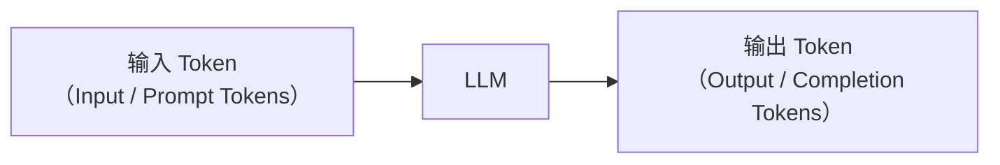
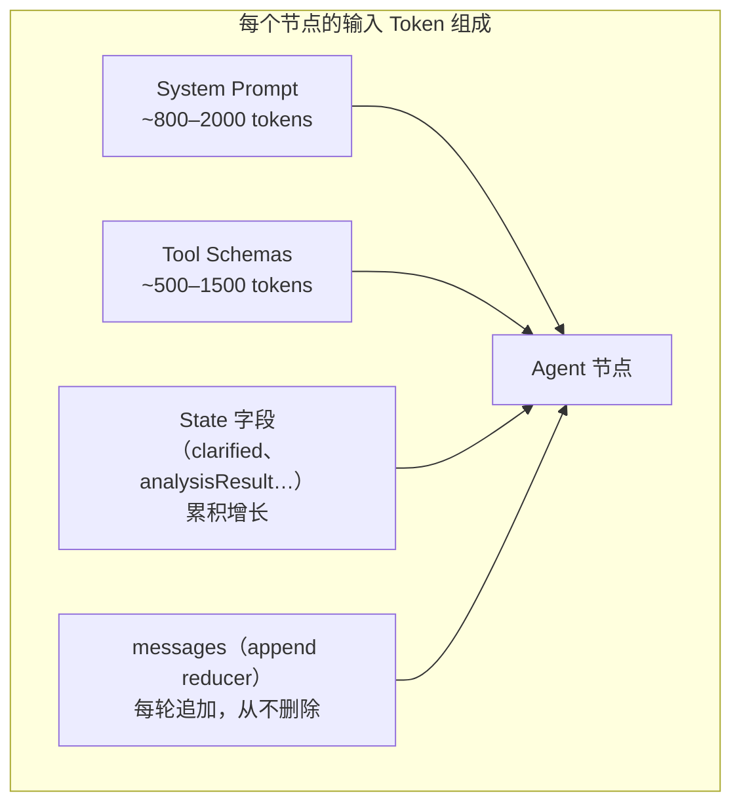
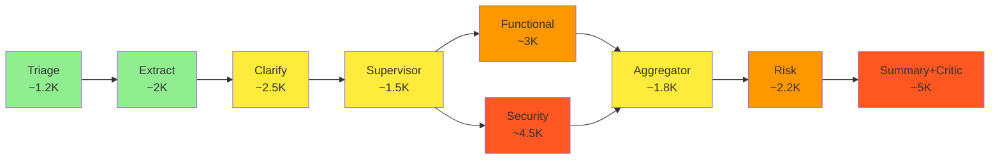
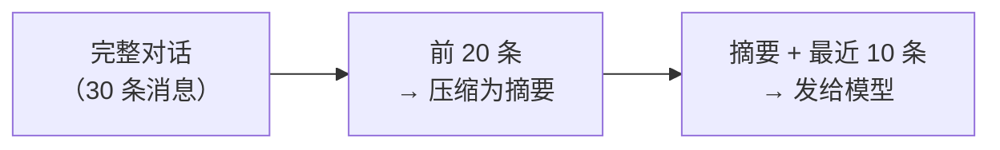
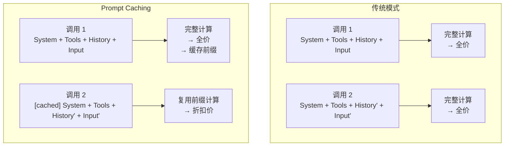
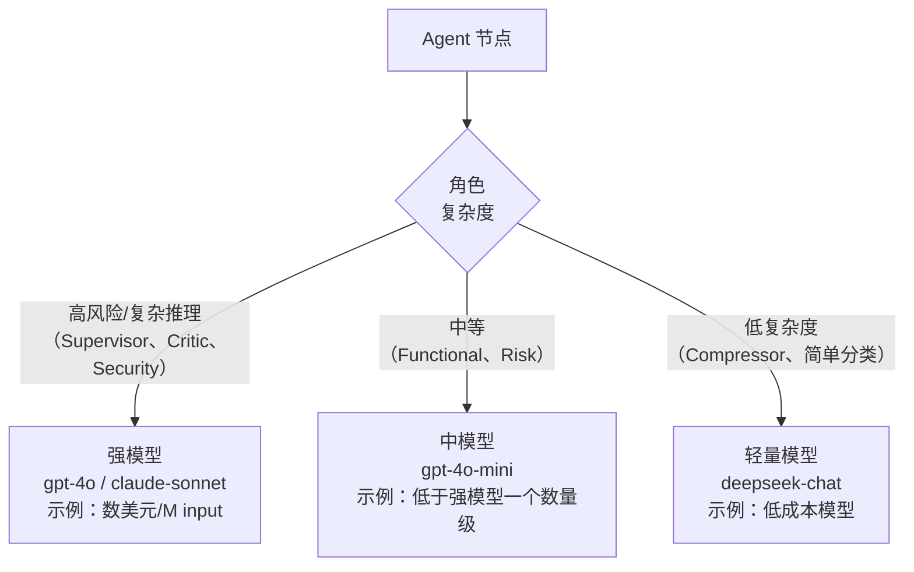
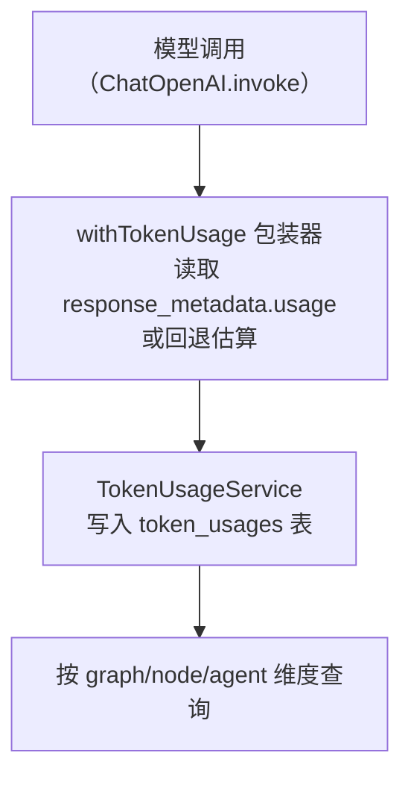
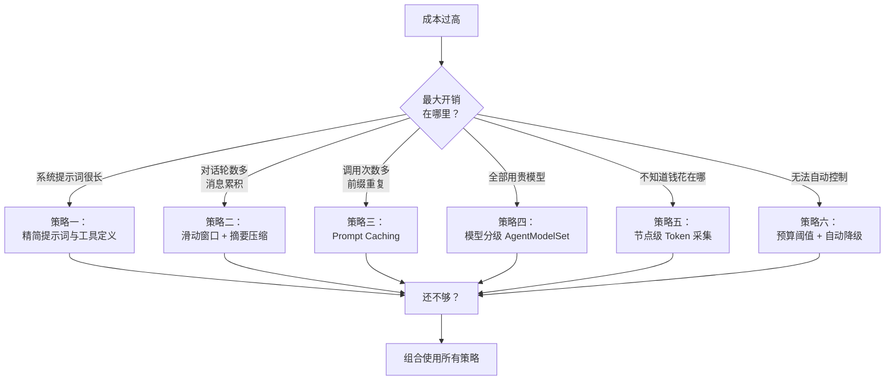

> 本文整理自《2026 前端 AI Agent 工程化实战营》课程资料，作为系列文章第 11 篇。

---
theme: channing-cyan
---


**本章demo地址**：[feat/token](https://github.com/Cookieboty/autix-demo/tree/feat/token)

前九章把 Agent 系统从模型调用一路推进到了生产级 Multi-Agent 流水线。到这里，系统已经能跑起来；但还有一个问题一直没有正面展开：**这套系统每跑一次，要花多少钱？**

每个 Agent 每次调用模型都会消耗 Token。第九章的 Supervisor + 4 个专家子图 + Critic-Refine 循环，单次需求分析可能调用模型 9–12 次；每次调用都要把系统提示词、工具定义、澄清后的需求和中间结果重新提交给模型——这些内容都会计入 Token，也都会进入成本。

本章从 Token 的基础原理开始，逐步展开成本拆账、上下文膨胀分析、6 种省 Token 策略、节点级采集与持久化、预算控制与自动降级。目标不是单纯“省钱”，而是让 Multi-Agent 系统在能力、质量和成本之间更可控。

**本章验收点**

*   理解 Token 的本质：什么是 Token、如何计数、定价模型是什么
*   能对第九章 Multi-Agent 系统做完整的成本拆账
*   掌握 6 种省 Token 的实战策略
*   实现节点级 Token usage 采集与数据库持久化
*   实现按 Agent 角色配置不同模型，并支持运行时覆盖
*   建立预算控制与自动降级机制
*   和第九章一样，每个阶段都配套可直接交给 AI 编程工具执行的 Prompt，正文只展示关键片段。

***

## 10.1 Token 不是概念，是 Agent 的运行成本

### 10.1.1 什么是 Token


Token 不是"字"，也不是"词"。它是模型词表中的最小单元。不同模型使用不同的 Tokenizer（分词器），但基本原理相同：把文本切分成模型能理解的最小块。

对于英文，一个 Token 大约是 4 个字符（约 0.75 个单词）；对于中文，一个汉字通常占 1–2 个 Token。

    英文示例：
    "Hello, world!" → ["Hello", ",", " world", "!"] → 4 tokens

    中文示例：
    "你好，世界！" → ["你好", "，", "世界", "！"] → 4–8 tokens（取决于 Tokenizer）

    代码示例：
    "function hello()" → ["function", " hello", "()"] → 3 tokens

**📌 实践小练习**

用 OpenAI 的 [tiktoken](https://github.com/openai/tiktoken) 或在线工具 [platform.openai.com/tokenizer](http://platform.openai.com/tokenizer) 把你的系统提示词粘贴进去，看看它占多少 Token。实际结果通常会比直觉更高。

### 10.1.2 一次 API 调用的 Token 组成

每次调用 LLM（Large Language Model，大语言模型）时，Token 分为两部分：



*   **输入 Token**：发给模型的全部内容，包括系统提示词、工具定义、对话历史、用户输入和中间状态。
*   **输出 Token**：模型生成的回复内容。

关键点：**输入 Token 和输出 Token 的单价不同**。很多模型的输出 Token 通常比输入 Token 更贵，但具体倍率随厂商、模型和计费周期变化。

下表只是写作时查询到的**示例价格**，用于帮助你理解数量级，不应作为长期准确报价。真正上线前，请以厂商官网的实时价格为准。

| **模型/系列（示例）**        | **输入价格（/1M tokens，示例）** | **输出价格（/1M tokens，示例）** | **上下文窗口（示例）** |
| -------------------- | ----------------------- | ----------------------- | ------------- |
| GPT-4o               | \$2.50                  | \$10.00                 | 128K          |
| GPT-4o-mini          | \$0.15                  | \$0.60                  | 128K          |
| Claude Sonnet 系列     | 约 \$3.00                | 约 \$15.00               | 约 200K        |
| Claude Haiku 系列      | 约 \$1.00                | 约 \$5.00                | 约 200K        |
| DeepSeek Chat / V 系列 | 价格变动较快，通常显著低于强模型        | 价格变动较快                  | 上下文窗口随版本变化    |

**⚠️ 价格随时变动**

> 以上价格和窗口都仅供参考，各厂商经常调价、改模型名、改上下文长度。重要的不是记住具体数字，而是理解三个结构性规律：输入和输出分开计费；输出通常更贵；小模型和强模型的价差可能非常大。

### 10.1.3 上下文窗口：你的硬性约束

上下文窗口是模型单次调用能处理的最大 Token 数（输入 + 输出）。这是一个硬性约束：

*   **128K 窗口**：约 10 万字中文，看似很多，但一个 Multi-Agent 系统很容易快速消耗掉
*   系统提示词：2000–5000 tokens
*   工具定义（5 个工具）：1000–3000 tokens
*   20 轮对话历史：5000–15000 tokens
*   工具调用结果（JSON）：2000–5000 tokens

加起来可能就 25000–28000 tokens，再留给模型输出的空间，实际可用不到 128K 的 1/4。

***

## 10.2 用第九章 Multi-Agent 图算一笔真实账

来算一笔账。我们用第九章的需求分析图处理这样一条需求：“我们需要一个移动端扫码签到功能，支持蓝牙围栏校验位置、批量导出签到记录为 Excel，要考虑跨境数据合规。”

| **步骤** | **调用者**                       | **输入 Token（估算）** | **输出 Token（估算）** | **累计输入** |
| ------ | ----------------------------- | ---------------- | ---------------- | -------- |
| 1      | Triage/Classifier             | \~1200           | \~80             | 1200     |
| 2      | Extract Agent                 | \~2000           | \~400            | 3200     |
| 3      | Clarify Agent                 | \~2500           | \~200            | 5700     |
| 4      | Supervisor（选择专家）              | \~1500           | \~100            | 7200     |
| 5      | Functional Expert (ReAct × 2) | \~3000           | \~600            | 10200    |
| 6      | Security Expert (ReAct × 3)   | \~4500           | \~800            | 14700    |
| 7      | Aggregator                    | \~1800           | \~200            | 16500    |
| 8      | Risk Agent                    | \~2200           | \~500            | 18700    |
| 9      | Summary/Critic-Refine × 2     | \~5000           | \~1200           | 23700    |

**合计：输入 \~23,700 tokens + 输出 \~4,080 tokens**

按上表示例中的 GPT-4o 价格估算：

    输入成本: 23,700 / 1,000,000 × $2.50 = $0.059
    输出成本: 4,080 / 1,000,000 × $10.00 = $0.041
    单次请求总计: $0.100（约 ¥0.73）

单次看起来不高，但放到日常调用量里，差距会很明显：

    日均 200 次需求分析:
      全部用 GPT-4o:     约 $20/天 → 约 $600/月
      全部用 GPT-4o-mini: 约 $1.2/天 → 约 $36/月
      混合模型（本章策略）: 约 $3/天 → 约 $90/月

**⚠️ Multi-Agent 为什么贵：上下文被反复传输**

LLM API 是无状态的：每次调用都必须把“当前上下文”完整提交一次。Multi-Agent 让一次需求分析跨多个节点，于是同一份内容会在不同节点之间被反复传输。具体有 4 类重复：

*   **对话历史**：多数框架（包括 LangGraph 的 `MessagesAnnotation`）默认全量发送——上游 Agent 看过的消息，下游 Agent 还要再看一遍。严格说不是“必须全部”，而是“默认全部”，10.5 之后会展开如何按需裁剪。
*   **System Prompt**：每个 Agent 各自的角色提示词、行为约束、输出格式，每次调用都要重发，几百到几千 token。
*   **Tool Schema**：function calling 时，工具的 JSON Schema 必须随请求注入。工具越多、Agent 越多，这部分重复越严重——也是很多人低估的大头。
*   **中间推理结果**：Extract → Clarify → Supervisor → Expert 这条链上，前序节点的输出会作为后续节点的输入持续累积。

所以更准确的一句话是：**Multi-Agent 系统贵，不只是因为 Agent 数量多，而是因为无状态 LLM 调用让上下文、工具定义和中间推理结果在多个 Agent 之间被反复传输**。后面 10.4–10.7 的省钱策略——精简提示词、裁剪历史、摘要压缩、Prompt Caching、按需注入工具——本质都在做同一件事：让同一份内容不要反复重发。

### 10.2.1 成本估算工具

为了让上面的“估算”变成可运行的数字，我们在项目中实现一个 Token 估算器。完整 Prompt 放在 10.2.2，下面先看参考实现：

```tsx
// services/chat/src/llm/cost/token-estimator.ts
const PRICING: Record<string, { input: number; output: number; cachedInput?: number }> = {
  'gpt-4o': { input: 2.50, output: 10.00, cachedInput: 1.25 },
  'gpt-4o-mini': { input: 0.15, output: 0.60, cachedInput: 0.075 },
  'claude-sonnet': { input: 3.00, output: 15.00, cachedInput: 0.30 },
  'claude-haiku': { input: 0.80, output: 4.00, cachedInput: 0.08 },
  'deepseek-chat': { input: 0.27, output: 1.10 },
};

export function estimateTextTokens(text: string): number {
  if (!text) return 0;
  let tokens = 0;
  for (const char of text) {
    if (/[\u4e00-\u9fff\u3000-\u303f\uff00-\uffef]/.test(char)) {
      tokens += 1; // 中文字符约 1 token
    } else {
      tokens += 0.25; // 英文/数字每 4 字符约 1 token
    }
  }
  return Math.ceil(tokens);
}

export function getModelPricing(modelName: string) {
  return PRICING[modelName] || PRICING['gpt-4o-mini'];
}

export function estimateGraphNodeCost(input: {
  nodeName: string;
  modelName: string;
  systemPrompt: string;
  toolSchemas?: string;
  messages?: string;
  outputText: string;
}): { inputTokens: number; outputTokens: number; estimatedCostUsd: number } {
  const inputText = [input.systemPrompt, input.toolSchemas || '', input.messages || ''].join('\n');
  const inputTokens = estimateTextTokens(inputText);
  const outputTokens = estimateTextTokens(input.outputText);
  const pricing = getModelPricing(input.modelName);

  const estimatedCostUsd =
    (inputTokens / 1_000_000) * pricing.input +
    (outputTokens / 1_000_000) * pricing.output;

  return { inputTokens, outputTokens, estimatedCostUsd };
}
```

这个估算器并不追求精确，它的作用是在设计阶段快速回答“这条链路大概要花多少钱”。真正的精确数据，要靠 10.8 节的 `withTokenUsage` 从 provider（模型服务商）返回的 `usage` 元数据中读取。

**📋 本节配套用例**：`bun test test/chapter10-token-economics.spec.ts -t "10.2.1"`


### 10.2.2 🤖 用 AI 生成本节代码

* 点击展开完整 Prompt（可直接粘贴到 Cursor / Claude 执行）

        我正在实现第十章 10.2 节：为第九章的 LangGraph Multi-Agent 需求分析图增加一个设计期 Token 成本估算工具。

        **背景**：
        - 项目位于当前工作区，需求分析主图代码在 services/chat/src/llm/graph/，模型工厂在 services/chat/src/llm/model.factory.ts。
        - 第九章已完成 Supervisor + 4 专家 + Aggregator + Risk + Summary/Critic 的 Multi-Agent 图，但只有运行时日志，没有"这条链路大概要花多少钱"的设计期工具。
        - 模型价格示例（按 /1M tokens）：gpt-4o input 2.50 / output 10.00 / cachedInput 1.25；gpt-4o-mini input 0.15 / output 0.60 / cachedInput 0.075；claude-sonnet input 3.00 / output 15.00 / cachedInput 0.30；claude-haiku input 0.80 / output 4.00 / cachedInput 0.08；deepseek-chat input 0.27 / output 1.10。这些只是写作时的示例价，不是长期有效报价。

        **任务**：
        1. 在 services/chat/src/llm/cost/ 下新建 token-estimator.ts，导出三个函数：
           - estimateTextTokens(text: string): number
           - getModelPricing(modelName: string): { input: number; output: number; cachedInput?: number }
           - estimateGraphNodeCost(input): { inputTokens, outputTokens, estimatedCostUsd }
        2. estimateTextTokens 的实现规则：
           - 空字符串 / null / undefined 返回 0
           - 中文字符（含中文标点 \u4e00-\u9fff、\u3000-\u303f、\uff00-\uffef）按 1 token
           - 其余字符按每 4 字符约 1 token（即每字符 0.25）
           - 最后 Math.ceil 取整
        3. getModelPricing：内置上述价格表，未知 modelName 回退到 gpt-4o-mini
        4. estimateGraphNodeCost：
           - 入参含 nodeName、modelName、systemPrompt、toolSchemas?、messages?、outputText
           - 输入文本 = systemPrompt + toolSchemas + messages 拼接后估算
           - 输出 token = estimateTextTokens(outputText)
           - 成本 = inputTokens × pricing.input + outputTokens × pricing.output（除以 1_000_000）
        5. 在 services/chat/test/chapter10-token-economics.spec.ts 内新增对应单元测试，使用 bun:test 风格、mock-first，无需真实 API key 或数据库。

        **关键约束**：
        - 估算器只用于设计期"这条链路大概多少钱"，不负责精确成本——精确值由 10.8 的 withTokenUsage 从 provider usage 读取
        - 价格、上下文窗口、各厂商优惠都会随时间变化，注释里注明"以上价格示例自 2025-2026 年早期，仅供参考；上线前请以厂商官网为准"
        - 中文 token 估算偏简化（1 字 ≈ 1 token），不要去引入 tiktoken 这类依赖，保持零依赖
        - 文件位置必须是 services/chat/src/llm/cost/token-estimator.ts，不要放到 packages 或其他服务下

        **输出要求**：
        - 生成完整的 token-estimator.ts 文件，含 PRICING 常量、estimateTextTokens、getModelPricing、estimateGraphNodeCost
        - 生成对应的测试用例：空文本为 0；纯中文文本 token > 0；纯英文每 4 字符约 1 token；带 toolSchemas 的成本高于不带；输出按 pricing.output 计费
        - 不要修改第九章的 graph 文件，只新增 cost/ 目录和测试文件

        请按照本文档 10.2.1 中的参考实现完成代码。

***

## 10.3 上下文为什么会膨胀


在单 Agent 场景中，上下文通常由 system prompt（系统提示词）和 messages（消息历史）组成，增长相对线性。但在 Multi-Agent 图中，上下文膨胀是**多维的**：



**📖 本节涉及的几个工程术语**

*   **State**：LangGraph 在图中流转的状态对象，用来保存输入、澄清结果、专家结论、风险分析等字段。
*   **Annotated State**：用 `Annotation.Root` 定义的结构化 State，每个字段可以配置默认值和合并规则。
*   **MessagesAnnotation**：LangGraph 内置的消息状态结构，常用于保存对话消息和工具调用消息。
*   **append reducer**：追加式合并规则。新消息不会覆盖旧消息，而是不断追加到数组末尾。
*   **Tool schema**：模型调用工具前看到的工具参数说明，通常也是输入 Token 的一部分。

**膨胀的五个驱动力**：

1.  **State 字段累积**：`clarified`、`analysisResult`、`riskResult` 等字段在 Annotated State 中被下游节点读取——这些都是输入 Token
2.  **messages 使用 append reducer**：LangGraph 的 `MessagesAnnotation` 默认追加消息，不删除。每个专家的对话历史都在 `messages` 中积累
3.  **Tool schemas 随每次调用发送**：Functional Expert 带 3 个工具，Security Expert 带 2 个工具——工具的 `description` + `schema` 每次调用都完整发送
4.  **每个 Expert 拿到完整的已澄清需求**：`clarified` 字段在所有专家节点中被完整传入
5.  **Critic-Refine 循环倍增成本**：Summary → Critic → 修改 → 再 Critic，每次循环都重新发送前面的全部上下文



颜色越深，输入 Token 越多。Security Expert 和 Summary/Critic 是最贵的两个节点——前者因为工具调用循环多（ReAct × 3），后者因为要读取所有前序分析结果。

**📌 关键洞察**

Multi-Agent 系统的 Token 成本不是各节点之和，而是会随着上下文累积不断放大。每个后续节点都要重读前序节点的输出，这就是为什么 10.2 中 9 个步骤的总输入 Token 不是简单累加，而是呈加速增长。

**📋 本节配套用例**：`bun test test/chapter10-token-economics.spec.ts -t "10.3"`


***

## 10.4 策略一：Prompt 与工具定义瘦身

提示词是每次调用都会发送的固定成本。优化它是最容易落地、也最容易长期受益的手段之一。

### 10.4.1 精简系统提示词

以需求分析流水线中的 Supervisor 提示词为例：

```tsx
// ❌ 冗余的提示词（约 180 tokens，按中文约 1 token/字粗估）
const verbosePrompt = `
你是一个非常专业的需求分析调度员，你的职责是根据用户提交的需求，
仔细分析需求的内容和特征，然后决定应该由哪些专家来进行评审。
你需要始终保持专业、严谨的态度。当你看到需求时，你应该仔细判断
这个需求涉及哪些领域（功能、性能、安全、合规），然后选择相应的
专家。如果你不确定是否需要某个专家，宁可多选也不要漏选。
你的选择应该有充分的理由，并且要考虑到需求的复杂性和风险性。
`;

// ✅ 精简后的提示词（约 140–160 tokens，按相同口径粗估）——来自 experts.ts 的实际实现
const concisePrompt = `你是需求分析调度员。根据已澄清的需求，判断本次需要哪些专家评审。

可选专家：
- functional：功能需求分析（任何需求都至少需要）
- performance：性能分析（涉及批量操作、大文件、实时性、高并发时选择）
- security：安全分析（涉及登录、权限、数据访问、文件上传时选择）
- compliance：合规分析（涉及跨境、个人信息、行业监管、金融/医疗时选择）`;
```

按中文约 1 token/字的粗略口径估算，冗余版约 180 tokens，精简版约 140–160 tokens，节省大约 10%–25%。真正明显的收益通常来自两类情况：一是把上千 token 的长角色说明压缩成结构化规则；二是在 Multi-Agent 场景下，多个子 Agent、多轮 ReAct 和 Critic-Refine 循环反复发送同一类 system prompt，单次几十 token 的节省会被调用次数放大。

### 10.4.2 提示词优化清单

*   **删除礼貌用语**：“请”“非常感谢”“麻烦你”通常不会改善模型判断，可以从常驻提示词中移除
*   **删除重复说明**：一个规则说一遍就够
*   **用缩写**：不要在提示词中反复说"已经澄清过的需求信息"，叫"澄清需求"或直接用字段名
*   **结构化而非叙述式**：用列表而不是段落
*   **把规则和示例分开**：规则放 system prompt，示例用 few-shot 只在需要时加

### 10.4.3 工具定义优化

工具的 `description` 和 `schema` 也是输入 Token 的一部分。每次调用都会发送。以 `expert-tools.ts` 中的工具为例：

```tsx
// ❌ 冗余的工具定义
{
  name: 'check_security_policy',
  description: '这个工具用于检查需求是否符合组织内部的安全策略和安全基线要求，它会返回安全策略命中情况和相应的合规要求，你应该在分析安全相关的需求时优先调用这个工具。',
  schema: z.object({
    requirementText: z.string().describe('用户提交的完整需求描述文本，需要包含功能描述和约束条件'),
  }),
}

// ✅ 精简后
{
  name: 'check_security_policy',
  description: '检查需求的安全策略命中情况',
  schema: z.object({
    requirementText: z.string().describe('需求描述'),
  }),
}
```

看起来很小的优化，但每次工具调用都省 50–100 tokens。Security Expert 一次 ReAct 循环调用 3 次工具，就是 150–300 tokens；整个图跑下来，工具定义的 Token 累计可观。

***

## 10.5 策略二：消息裁剪与摘要压缩


这一类策略通常优先级最高。`messages` 往往是输入 Token 的最大来源之一，而 LangGraph 的 `MessagesAnnotation` 使用 append reducer——只增不减。

### 10.5.1 滑动窗口裁剪

最简单的方法是只保留最近的 N 条消息。关键难点是 **tool\_calls 与 ToolMessage 必须成对保留**：如果截断了带 `tool_calls` 的 AIMessage，却保留了对应的 ToolMessage，provider 可能会报错，或者模型会基于不完整工具上下文继续生成。完整 Prompt 放在 10.5.4，下面先看参考实现：

**📖 消息类型说明**

*   **BaseMessage**：LangChain 中所有消息类型的基础类型。
*   **SystemMessage**：系统消息，通常保存角色设定、规则和长期约束。
*   **AIMessage**：模型生成的消息，其中可能包含 `tool_calls`。
*   **ToolMessage**：工具执行后的返回结果，需要和对应的 `tool_call_id` 配对。

```tsx
// services/chat/src/llm/context/message-trimmer.ts
import { BaseMessage, SystemMessage } from '@langchain/core/messages';

export function trimMessagesForContext(
  messages: BaseMessage[],
  options: { maxMessages?: number; preserveSystemMessages?: boolean } = {},
): BaseMessage[] {
  const { maxMessages = 20, preserveSystemMessages = true } = options;

  const systemMsgs = preserveSystemMessages
    ? messages.filter((m) => m instanceof SystemMessage)
    : [];
  const nonSystemMsgs = messages.filter((m) => !(m instanceof SystemMessage));

  const trimmed = nonSystemMsgs.slice(-maxMessages);
  const cleaned = removeOrphanToolMessages(trimmed);
  return [...systemMsgs, ...cleaned];
}

/**
 * 按 tool_call_id 精确配对，避免 OpenAI/Anthropic 因 tool_calls 不完整报错。
 * 策略是"全有或全无"：
 *   - AIMessage(tool_calls) 必须每一个 tool_call.id 都能在窗口内找到对应的
 *     ToolMessage(tool_call_id)，否则整条 AIMessage 移除。
 *   - ToolMessage 仅当 tool_call_id 出现在某条幸存的 AIMessage 的 tool_calls 中
 *     时才保留。
 */
function removeOrphanToolMessages(messages: BaseMessage[]): BaseMessage[] {
  const respondedToolCallIds = new Set<string>();
  for (const msg of messages) {
    if (msg._getType() === 'tool') {
      const tcId = (msg as any).tool_call_id as string | undefined;
      if (tcId) respondedToolCallIds.add(tcId);
    }
  }

  const survivingAiIndices = new Set<number>();
  const survivingToolCallIds = new Set<string>();
  for (let i = 0; i < messages.length; i++) {
    const msg = messages[i];
    if (msg._getType() !== 'ai') continue;
    const toolCalls = (msg as any).tool_calls as Array<{ id?: string }> | undefined;
    if (!toolCalls || toolCalls.length === 0) continue;

    const allResponded = toolCalls.every(
      (tc) => tc.id && respondedToolCallIds.has(tc.id),
    );
    if (allResponded) {
      survivingAiIndices.add(i);
      for (const tc of toolCalls) if (tc.id) survivingToolCallIds.add(tc.id);
    }
  }

  const result: BaseMessage[] = [];
  for (let i = 0; i < messages.length; i++) {
    const msg = messages[i];
    const msgType = msg._getType();

    if (msgType === 'ai') {
      const toolCalls = (msg as any).tool_calls as Array<{ id?: string }> | undefined;
      if (toolCalls && toolCalls.length > 0) {
        if (survivingAiIndices.has(i)) result.push(msg);
        continue;
      }
    }

    if (msgType === 'tool') {
      const tcId = (msg as any).tool_call_id as string | undefined;
      if (tcId && survivingToolCallIds.has(tcId)) result.push(msg);
      continue;
    }

    result.push(msg);
  }
  return result;
}
```

**📋 本节配套用例**：`bun test test/chapter10-token-economics.spec.ts -t "10.5.1"`


### 10.5.2 摘要压缩

滑动窗口会丢失早期信息。更智能的方法是：把早期对话压缩成摘要，保留关键信息。



参考实现：

```tsx
// services/chat/src/llm/context/conversation-compressor.ts
import { BaseMessage, SystemMessage } from '@langchain/core/messages';

export interface SummaryModel {
  invoke(messages: { role: string; content: string }[]): Promise<{ content: string }>;
}

export async function compressConversation(
  messages: BaseMessage[],
  summaryModel: SummaryModel,
  options: { keepRecent?: number; summaryMaxTokens?: number } = {},
): Promise<BaseMessage[]> {
  const { keepRecent = 10, summaryMaxTokens = 500 } = options;

  const systemMsgs = messages.filter((m) => m instanceof SystemMessage);
  const nonSystemMsgs = messages.filter((m) => !(m instanceof SystemMessage));

  if (nonSystemMsgs.length <= keepRecent) return messages;

  const earlyMsgs = nonSystemMsgs.slice(0, -keepRecent);
  const recentMsgs = nonSystemMsgs.slice(-keepRecent);

  const conversationText = earlyMsgs.map((m) => `${m._getType()}: ${m.content}`).join('\n');
  const summaryResponse = await summaryModel.invoke([
    {
      role: 'system',
      content: `把以下对话压缩为摘要，保留关键信息（需求编号、功能描述、用户意图、已完成的操作）。最多 ${summaryMaxTokens} 个 token。`,
    },
    { role: 'user', content: conversationText },
  ]);

  const summaryMsg = new SystemMessage(`[对话摘要] ${summaryResponse.content}`);
  return [...systemMsgs, summaryMsg, ...recentMsgs];
}
```

在图的 Agent 节点中使用：

```tsx
async function expertAgentNode(state: typeof RequirementAnalysisState.State) {
  // 先裁剪，再压缩——两种策略组合使用
  const trimmed = trimMessagesForContext(state.messages, { maxMessages: 15 });
  const compressed = await compressConversation(trimmed, summaryModel, { keepRecent: 10 });

  const model = createChatModel({
    modelConfigId: 'demo-gpt-4o-mini',
    modelName: 'gpt-4o-mini',
  });
  const modelWithTools = model.bindTools(tools);
  const response = await modelWithTools.invoke([
    { role: 'system', content: expertSystemPrompt },
    ...compressed,
  ]);
  return { messages: [response] };
}
```

**⚠️ 压缩本身也要花 Token**

摘要压缩本身需要一次模型调用，所以它只在对话很长时才划算。一般规则是：当被压缩的消息超过 2000 tokens 时，压缩才更容易省钱。用小模型（如 `deepseek-chat`）做摘要，成本通常可以控制在很低水平。

**📋 本节配套用例**：`bun test test/chapter10-token-economics.spec.ts -t "10.5.2"`


### 10.5.3 两种策略的对比

| **维度** | **滑动窗口**                       | **摘要压缩**                |
| ------ | ------------------------------ | ----------------------- |
| 实现复杂度  | 简单（纯数组操作）                      | 中等（需要额外模型调用）            |
| 信息保留   | 会丢失早期信息                        | 保留关键信息的摘要               |
| 额外成本   | 无                              | 每次压缩一次小模型调用             |
| 适用场景   | 对话轮数多但早期信息不重要                  | 早期信息包含关键上下文（如需求编号、业务约束） |
| 推荐组合   | 先用摘要压缩早期对话，然后对压缩后的内容再用滑动窗口做硬截断 |                         |

### 10.5.4 🤖 用 AI 生成本节代码

*   点击展开完整 Prompt（可直接粘贴到 Cursor / Claude 执行）

        我正在实现第十章 10.5 节：在第九章 LangGraph Multi-Agent 图基础上加一层"消息裁剪 + 摘要压缩"，控制每个 Agent 节点的输入 messages 长度。

        **背景**：
        - 项目位于当前工作区。LangGraph 的 MessagesAnnotation 默认是 append reducer，messages 只增不减，是 Multi-Agent 系统输入 Token 的最大来源。
        - 第九章的 experts.ts、aggregator、risk、summary/critic 节点都直接读 state.messages 全量送给模型，这是膨胀的根因之一。
        - 本节要新增两个独立工具，不修改第九章已有图节点；后续是否接入由后续章节决定。
        - LangChain 类型来自 @langchain/core/messages：BaseMessage、SystemMessage、HumanMessage、AIMessage、ToolMessage。

        **任务**：
        1. 在 services/chat/src/llm/context/ 下新建 message-trimmer.ts，导出：
           - 接口 TrimOptions { maxMessages?: number; preserveSystemMessages?: boolean }
           - 函数 trimMessagesForContext(messages: BaseMessage[], options?: TrimOptions): BaseMessage[]
           - 默认 maxMessages=20，preserveSystemMessages=true
           - 行为：抽出全部 SystemMessage 单独保留；对剩余消息 slice(-maxMessages)；调用内部 removeOrphanToolMessages 做工具消息清理；最后拼回 [system..., 清理后]
        2. removeOrphanToolMessages 必须按 tool_call_id 精确配对（"全有或全无"策略）：
           - 第一遍扫描收集 respondedToolCallIds = 当前窗口里所有 ToolMessage.tool_call_id
           - 第二遍判定每条 AIMessage(tool_calls)：仅当它的 **每一个** tool_call.id 都出现在 respondedToolCallIds 时才幸存，并把这些 id 加入 survivingToolCallIds
           - 第三遍组装结果：普通消息直接保留；AIMessage(tool_calls) 仅幸存的保留；ToolMessage 仅 tool_call_id ∈ survivingToolCallIds 的保留
           - 这样做的目的是避免 OpenAI/Anthropic 因 tool_calls 部分缺失响应而拒绝请求
        3. 在 services/chat/src/llm/context/ 下新建 conversation-compressor.ts，导出：
           - 接口 SummaryModel { invoke(messages: { role: string; content: string }[]): Promise<{ content: string }> }
           - 函数 compressConversation(messages, summaryModel, options): Promise<BaseMessage[]>
           - options: { keepRecent?: number; summaryMaxTokens?: number }，默认 keepRecent=10、summaryMaxTokens=500
        4. compressConversation 行为：
           - 抽出全部 SystemMessage 单独保留
           - 非 system 消息数 <= keepRecent 时直接 return messages 原样
           - 否则把早期消息用 summaryModel 压缩成 [对话摘要] 开头的 SystemMessage，最终返回 [原 system..., 摘要 system, 最近 keepRecent 条]
           - 摘要 system prompt 要要求保留：需求编号、功能描述、用户意图、已完成的操作；总长度 <= summaryMaxTokens
        5. 在 services/chat/test/chapter10-token-economics.spec.ts 中补充 mock-first 测试，分两个 describe：
           - 10.5.1 message-trimmer：保留 system；只保留最近 N 条；删除孤立 ToolMessage；AIMessage(tool_calls) 与 ToolMessage 成对保留；多个 tool_call_id 精确配对（错配的孤立 ToolMessage 被清理）；AIMessage 部分 tool_call 缺失响应时整条移除
           - 10.5.2 conversation-compressor：短对话不触发压缩；长对话触发 summaryModel.invoke；返回结果包含 [对话摘要] 前缀；SystemMessage 始终保留

        **关键约束**：
        - 两个文件零 LLM 依赖：message-trimmer 不调任何模型；conversation-compressor 通过 SummaryModel 接口注入，单元测试用 mock 实现，不要直接 import 真实 ChatOpenAI
        - removeOrphanToolMessages **必须**按 tool_call_id 精确配对，不可退化为"前面是否存在任意 AIMessage(tool_calls)"的近似判断
        - 不要修改 services/chat/src/llm/graph/ 下任何已有图节点；本节只新增 context/ 子目录
        - 文档要求"先裁剪、再压缩"两种策略组合使用；conversation-compressor 内部不要再调 trimMessagesForContext，调用顺序由使用方控制

        **输出要求**：
        - 完整生成 services/chat/src/llm/context/message-trimmer.ts、conversation-compressor.ts
        - 在测试文件中补全两个 describe 块及其用例，全部使用 bun:test 的 describe/it/expect/mock
        - 不要新增任何外部依赖（@langchain/core 已存在）
        - 不要顺手"优化"第九章 experts.ts 或 graph 文件

        请按照本文档 10.5.1 / 10.5.2 中的参考实现完成代码。

***

## 10.6 策略三：Prompt Caching 与稳定前缀


在 system prompt、工具定义较长，并且多次调用共享稳定前缀的场景里，Prompt Caching 很值得优先考虑。

### 10.6.1 原理

在传统模式中，每次 API 调用都会重新处理全部输入 Token——即使 90% 的内容（系统提示词、工具定义）跟上一次完全一样。

Prompt Caching 的核心思想：**如果输入的前缀部分没变，就复用上次的计算结果，不重新计算。**



### 10.6.2 各厂商的 Prompt Caching 实现

| **厂商**             | **机制**               | **缓存命中折扣（示例）**                                   | **最小缓存前缀（示例）**                                    | **缓存过期时间（示例）** |
| ------------------ | -------------------- | ------------------------------------------------ | ------------------------------------------------- | -------------- |
| OpenAI             | 自动（无需配置）             | 输入价 50% off                                      | 1024 tokens                                       | 5–10 分钟        |
| Anthropic (Claude) | 显式标记 `cache_control` | cache read 约为普通输入价的 10%；首次 cache write 通常比普通输入更贵 | Haiku 通常约 1024 tokens；Sonnet/Opus 通常约 2048 tokens | 常见 5 分钟        |
| DeepSeek           | 自动识别相同 prefix        | cache hit 价格通常显著低于 cache miss                    | 随版本变化，实践中通常需要较长稳定前缀                               | 短时间内           |

这里同样不要把表格当成长期准确资料。Prompt Caching 的支持模型、最低 Token 数、过期时间和折扣都会变化，发布前应重新核对对应厂商文档。

**📖 Prompt Caching 相关术语**

*   **cache write**：首次把稳定前缀写入缓存，部分厂商会按更高价格计费。
*   **cache read**：后续请求命中缓存并复用前缀计算结果，通常比普通输入 Token 更便宜。
*   **稳定前缀**：多次请求中保持不变的开头部分，例如 system prompt、工具定义和长期规则。
*   **cache\_control**：Anthropic 等厂商用于显式声明缓存断点的参数。

### 10.6.3 Prompt Caching 的工作流程

以 OpenAI 为例，缓存是自动的：

    第 1 次调用（Functional Expert）：
      输入: [System Prompt (800 tokens)] + [Tools (1200 tokens)] + [User: "分析此需求"]
      全部计算 → 缓存 System + Tools 前缀
      成本: 2100 tokens × $2.50/M = $0.00525

    第 2 次调用（同一专家 ReAct 循环第 2 轮，5 分钟内）：
      输入: [System Prompt (800)] + [Tools (1200)] + [History + ToolMessage + User]
      前 2000 tokens 命中缓存 → 半价
      成本: 2000 × $1.25/M + 800 × $2.50/M = $0.0045

      节省了 ~14%

### 10.6.4 如何最大化 Prompt Caching 效果

核心原则：**把不变的内容放在前面，变化的内容放在后面。**

```tsx
// ✅ 好的顺序（缓存命中率高）
const messages = [
  // 1. System Prompt（不变） → 被缓存
  { role: 'system', content: EXPERT_SYSTEM_PROMPT },
  // 2. 工具定义（不变） → 被缓存
  // （bindTools 会自动放在 system 之后）
  // 3. 对话历史（变化） → 前缀部分可能被缓存
  ...conversationHistory,
  // 4. 用户新输入（变化） → 不会被缓存
  { role: 'user', content: clarifiedRequirement },
];

// ❌ 差的顺序（缓存命中率低）
const messages = [
  { role: 'user', content: clarifiedRequirement },    // 变化的内容放前面
  { role: 'system', content: EXPERT_SYSTEM_PROMPT },   // 不变的内容放后面
  // → 缓存无法命中，因为前缀每次都不同
];
```

对于 [Anthropic 的 Claude](https://platform.claude.com/docs/en/build-with-claude/prompt-caching?utm_source=chatgpt.com)，需要显式标记缓存点。Anthropic API 的 `system` 字段支持两种写法：

*   **string 形式**：`system: 'You are ...'`，写法简单，但不能挂载 `cache_control`。
*   **block array 形式**：`system: [{ type: 'text', text: '...' }]`，可在每个 block 上挂 `cache_control` 来声明缓存断点。

要做 Prompt Caching，必须用第二种写法：

```tsx
const response = await anthropic.messages.create({
  model: 'claude-sonnet-4-20250514',
  max_tokens: 1024,
  // 注意：必须用 block array 形式，cache_control 才能挂在 block 上；
  // 不能写成 system: 'You are ...' 这种字符串形式。
  system: [
    {
      type: 'text',
      text: EXPERT_SYSTEM_PROMPT,
      cache_control: { type: 'ephemeral' },
    },
  ],
  messages: [
    ...conversationHistory,
    { role: 'user', content: clarifiedRequirement },
  ],
});

// 响应中可以看到缓存统计
console.log(response.usage);
// {
//   input_tokens: 3500,
//   cache_creation_input_tokens: 2000,  // 首次创建缓存（按更高单价计费）
//   cache_read_input_tokens: 1500,      // 后续读取缓存（按 0.1x 单价计费）
//   output_tokens: 200,
// }
```

> 注：Anthropic 的最小可缓存前缀有长度门槛（具体数值以官方文档为准），太短的 system prompt 即使挂了 `cache_control` 也不会真的进缓存——这是踩坑点。

**📌 Prompt Caching 的核心理解**

可以把 Prompt Caching 近似理解为：厂商复用了稳定前缀的中间计算结果（常被解释为 KV Cache 一类的机制），而不是缓存模型最终输出。所以它通常不改变回复内容，只是降低重复前缀的输入处理成本。不同厂商的底层实现不一定完全相同，文档中只需要抓住“稳定前缀可复用”这个工程原则。

**📋 本节配套用例**：`bun test test/chapter10-token-economics.spec.ts -t "10.6.4"`


### 10.6.5 缓存命中率监控（可选）

`cache-monitor.ts` 不是当前项目已经存在的必需文件，它只是一个可选观测示例，用来解释“如何把 provider 返回的 cache usage 变成命中率”。如果你已经在 10.8 的 `token_usages.cachedInputTokens` 里记录了缓存命中 token，就不一定需要单独创建这个文件。

```tsx
// 可选示例：services/chat/src/llm/cost/cache-monitor.ts

interface CacheStats {
  totalCalls: number;
  cacheHits: number;
  cacheMisses: number;
  tokensSaved: number;
  moneySaved: number;
}

const cacheStats: CacheStats = {
  totalCalls: 0,
  cacheHits: 0,
  cacheMisses: 0,
  tokensSaved: 0,
  moneySaved: 0,
};

export function recordCacheResult(usage: {
  input_tokens: number;
  cache_read_input_tokens?: number;
  cache_creation_input_tokens?: number;
}) {
  cacheStats.totalCalls++;

  if (usage.cache_read_input_tokens && usage.cache_read_input_tokens > 0) {
    cacheStats.cacheHits++;
    cacheStats.tokensSaved += usage.cache_read_input_tokens;
    cacheStats.moneySaved += (usage.cache_read_input_tokens / 1_000_000) * 3.00 * 0.9;
  } else {
    cacheStats.cacheMisses++;
  }
}

export function getCacheStats() {
  return {
    ...cacheStats,
    hitRate: cacheStats.totalCalls > 0
      ? (cacheStats.cacheHits / cacheStats.totalCalls * 100).toFixed(1) + '%'
      : '0%',
  };
}
```

***

## 10.7 策略四：模型分级与节点级模型选择


不是所有 Agent 节点都需要最强的模型。更稳妥的做法是按角色分配模型：高风险节点保留强模型，低复杂度节点使用更便宜的模型。

### 10.7.1 模型分级原则



### 10.7.2 AgentModelSet：按角色配置默认模型

我们用一个 `AgentModelSet` 接口来声明每种角色对应哪个 `modelConfigId`。这里的 `modelConfigId` 指数据库或配置文件中的模型配置 ID，而不是模型名称本身。完整 Prompt 放在 10.7.6，先看参考实现：

```tsx
// services/chat/src/llm/cost/agent-model-set.ts

export interface AgentModelSet {
  supervisorModelConfigId: string;
  functionalModelConfigId: string;
  performanceModelConfigId: string;
  securityModelConfigId: string;
  complianceModelConfigId: string;
  riskModelConfigId: string;
  summaryModelConfigId: string;
  criticModelConfigId: string;
  compressorModelConfigId: string;
}

export const DEFAULT_AGENT_MODEL_SET: AgentModelSet = {
  supervisorModelConfigId: 'demo-gpt-4o',       // 调度决策需要强推理
  functionalModelConfigId: 'demo-gpt-4o-mini',   // 功能分析中等复杂度
  performanceModelConfigId: 'demo-gpt-4o-mini',  // 性能分析有工具辅助
  securityModelConfigId: 'demo-gpt-4o',          // 安全分析必须严谨
  complianceModelConfigId: 'demo-gpt-4o',        // 合规分析法律敏感
  riskModelConfigId: 'demo-gpt-4o-mini',         // 风险汇总中等复杂度
  summaryModelConfigId: 'demo-gpt-4o',           // 最终报告质量要求高
  criticModelConfigId: 'demo-gpt-4o',            // 质量审查需要强推理
  compressorModelConfigId: 'demo-deepseek-chat',  // 摘要压缩用最便宜的
};
```

**📋 本节配套用例**：`bun test test/chapter10-token-economics.spec.ts -t "10.7.2"`


### 10.7.3 两层模型选择：默认查表 + 运行时覆盖

`resolveModelForAgent` 实现两层逻辑：

```tsx
// services/chat/src/llm/cost/agent-model-set.ts（续）

const HIGH_RISK_AGENTS: AgentName[] = [
  'supervisor', 'security_expert', 'compliance_expert', 'critic', 'summary_agent',
];

export function resolveModelForAgent(input: {
  agentName: AgentName;
  defaultModelSet?: AgentModelSet;
  requirementComplexity?: 'low' | 'medium' | 'high';
  budgetStatus?: { usedPercent: number };
}): { selectedModelConfigId: string; overrideReason: string | null } {
  const modelSet = input.defaultModelSet || DEFAULT_AGENT_MODEL_SET;
  const configKey = AGENT_TO_CONFIG_KEY[input.agentName];
  const defaultId = modelSet[configKey];
  const isHighRisk = HIGH_RISK_AGENTS.includes(input.agentName);
  const budgetPercent = input.budgetStatus?.usedPercent ?? 0;

  // 层 1：预算超限
  if (budgetPercent >= 100) {
    if (input.agentName === 'compressor') {
      return { selectedModelConfigId: defaultId, overrideReason: null }; // compressor 豁免
    }
    return { selectedModelConfigId: defaultId, overrideReason: 'budget_exceeded_reject' };
  }

  // 层 2：预算紧张（80–100%），非高风险 Agent 降级
  if (budgetPercent >= 80 && !isHighRisk) {
    return {
      selectedModelConfigId: modelSet.compressorModelConfigId,
      overrideReason: `budget_tight_downgrade (${budgetPercent}%)`,
    };
  }

  // 层 3：低复杂度需求，非高风险 Agent 降级
  if (input.requirementComplexity === 'low' && !isHighRisk) {
    return {
      selectedModelConfigId: modelSet.compressorModelConfigId,
      overrideReason: 'low_complexity_downgrade',
    };
  }

  // 默认：按角色查表
  return { selectedModelConfigId: defaultId, overrideReason: null };
}
```

**📋 本节配套用例**：`bun test test/chapter10-token-economics.spec.ts -t "10.7.3"`


### 10.7.4 可以这样升级 Supervisor 子图：从单模型到 ModelSet

第九章的 `createAnalysisSupervisorSubGraph` 接受一个 `model` 参数——所有专家共用同一个模型。当前仓库新增了 `AgentModelSet` 和 `resolveModelForAgent`，但还没有把它们接入主图。后续如果要继续工程化，可以按下面的方式升级，让每个专家使用不同模型：

```tsx
// 第九章：所有专家用同一个 model
export function createAnalysisSupervisorSubGraph(model: BaseChatModel) {
  const functionalExpert = createFunctionalExpert(model);  // 都用同一个
  const securityExpert = createSecurityExpert(model);       // 都用同一个
  // ...
}

// 可选升级：每个专家按角色用不同 model
export function createAnalysisSupervisorSubGraph(modelSet: AgentModelSet) {
  const functionalModel = createChatModel({
    modelConfigId: modelSet.functionalModelConfigId,
    modelName: resolveModelName(modelSet.functionalModelConfigId),
  });
  const securityModel = createChatModel({
    modelConfigId: modelSet.securityModelConfigId,
    modelName: resolveModelName(modelSet.securityModelConfigId),
  });

  const functionalExpert = createFunctionalExpert(functionalModel);
  const securityExpert = createSecurityExpert(securityModel);
  // ...
}
```

### 10.7.5 模型分级后的成本对比

| **方案**                                    | **单次请求成本（示例估算）** | **月度成本（200 次/天，示例估算）** |
| ----------------------------------------- | ---------------- | ---------------------- |
| 全部用 GPT-4o                                | \~\$0.100        | \~\$600                |
| Supervisor/Critic 用 4o + Expert 用 4o-mini | \~\$0.025        | \~\$150                |
| 上面 + Prompt Caching                       | \~\$0.018        | \~\$108                |
| 上面 + 消息裁剪/压缩                              | \~\$0.015        | \~\$90                 |

在这组示例假设下，从约 $600 到约 $90，成本下降约 **85%**。真实比例取决于模型价格、缓存命中率、输出长度和实际调用次数。

### 10.7.6 🤖 用 AI 生成本节代码

*   点击展开完整 Prompt（可直接粘贴到 Cursor / Claude 执行）

        我正在实现第十章 10.7 节：在第九章的需求分析 Multi-Agent 图基础上加一层"按角色默认 + 运行时覆盖"的模型分级。

        **背景**：
        - 项目位于当前工作区，第九章的 createAnalysisSupervisorSubGraph 当前接受单个 model 参数，所有专家共用同一个模型，全图节点都用相同价格。
        - 现有 services/chat/src/llm/model.factory.ts 提供 createChatModel({ modelConfigId, modelName, ... })，配置存在 model_configs 表里，第十章实验数据库的 seed 脚本里已经有 demo-gpt-4o / demo-gpt-4o-mini / demo-deepseek-chat 三个 modelConfigId。
        - 节点角色一共 9 种：supervisor、functional_expert、performance_expert、security_expert、compliance_expert、risk_agent、summary_agent、critic、compressor。其中 supervisor / security_expert / compliance_expert / summary_agent / critic 属于高风险，错误会影响全局或法律敏感性，预算紧张时不允许降级。

        **任务**：
        1. 在 services/chat/src/llm/cost/ 下新建 agent-model-set.ts，导出：
           - 类型 AgentName = supervisor | functional_expert | performance_expert | security_expert | compliance_expert | risk_agent | summary_agent | critic | compressor
           - 接口 AgentModelSet：包含 supervisor/functional/performance/security/compliance/risk/summary/critic/compressorModelConfigId 9 个字段
           - 常量 DEFAULT_AGENT_MODEL_SET：
             · supervisor/security/compliance/summary/critic → 'demo-gpt-4o'
             · functional/performance/risk → 'demo-gpt-4o-mini'
             · compressor → 'demo-deepseek-chat'
           - 常量 HIGH_RISK_AGENTS = ['supervisor', 'security_expert', 'compliance_expert', 'critic', 'summary_agent']
           - 常量 AGENT_TO_CONFIG_KEY：把 AgentName 映射到 AgentModelSet 的字段名
        2. 在同一文件实现函数 resolveModelForAgent(input)：
           - 入参：{ agentName: AgentName; defaultModelSet?: AgentModelSet; requirementComplexity?: 'low' | 'medium' | 'high'; budgetStatus?: { usedPercent: number } }
           - 返回：{ selectedModelConfigId: string; overrideReason: string | null }
           - 决策顺序（必须严格按这个顺序）：
             · budgetPercent >= 100 且 agentName === 'compressor'：返回默认 modelConfigId、reason=null（compressor 豁免）
             · budgetPercent >= 100 其余 agent：返回默认 modelConfigId、reason='budget_exceeded_reject'
             · budgetPercent ∈ [80,100) 且非高风险：返回 modelSet.compressorModelConfigId、reason=`budget_tight_downgrade (X%)`
             · requirementComplexity === 'low' 且非高风险：返回 modelSet.compressorModelConfigId、reason='low_complexity_downgrade'
             · 否则：返回默认 modelConfigId、reason=null
        3. 在 services/chat/test/chapter10-token-economics.spec.ts 中补充 mock-first 测试，分两个 describe：
           - 10.9.1 AgentModelSet：默认按角色返回不同 modelConfigId；高风险 5 个角色默认 demo-gpt-4o；低复杂度时 functional 降级到 demo-deepseek-chat 并附 overrideReason 含 'low_complexity'
           - 10.9.2 运行时模型覆盖：85% 预算时 functional 降级；90% 预算时 security 仍是 demo-gpt-4o；110% 预算时返回 budget_exceeded_reject reason；110% 预算时 compressor 仍可用且 reason=null；任何 override 路径 overrideReason 不为空
        4. 演示如何把 createAnalysisSupervisorSubGraph 从"单 model"升级为"按角色取 model"，但仅作为示例代码块写在文档里，**不要直接修改第九章的 experts.ts**。

        **关键约束**：
        - 只新增 services/chat/src/llm/cost/agent-model-set.ts 一个文件，不要 import 真实 PrismaClient 或 ChatOpenAI
        - HIGH_RISK_AGENTS 的判断必须用 includes，不要硬编码到 if-else
        - resolveModelForAgent 是纯函数，无副作用，无 DB 访问，便于单元测试
        - 不要顺手改 model.factory.ts 或第九章 experts.ts；本节负责"声明 + 决策"，"接入"放到 10.9 节再讨论

        **输出要求**：
        - 完整生成 agent-model-set.ts，含上述类型、常量、resolveModelForAgent
        - 生成对应测试，覆盖默认查表、5 个高风险角色、低复杂度降级、3 档预算（< 80% / 80–100% / >= 100%）和 compressor 豁免
        - 不要新增依赖，不要修改 prisma schema

        请按照本文档 10.7.2 / 10.7.3 中的参考实现完成代码。

***

## 10.8 策略五：节点级 Token usage 采集与数据库记录

前面的策略主要解决“如何降低成本”。但到底省了多少、哪个节点最贵、哪类 Agent 最容易超预算，这些问题都需要**数据**来回答。

### 10.8.1 三层设计



*   **第一层：模型调用** → LLM provider（模型服务商）在响应中返回 `usage` 元数据（如 `prompt_tokens`、`completion_tokens`）
*   **第二层：节点归因** → `withTokenUsage` 包装器标注这次调用属于哪个图、哪个节点、哪个 Agent
*   **第三层：DB 持久化** → `TokenUsageService` 写入 Prisma `token_usages` 表

**📖 本节涉及的几个工程术语**

*   **usage 元数据**：模型服务商返回的 Token 消耗统计，通常包含输入 Token、输出 Token 和缓存命中 Token。
*   **节点归因**：把一次模型调用归属到具体 graph / node / agent，方便后续分析成本来源。
*   **Prisma**：TypeScript 生态常用的 ORM，用来操作数据库表。
*   **token\_usages 表**：本章新增的成本明细表，用来记录每次模型调用的 Token 与成本。

### 10.8.2 Prisma 数据模型

    // services/chat/prisma/schema.prisma

    model token_usages {
      id                String   @id @default(cuid())
      conversationId    String?  @db.VarChar(255)
      messageId         String?  @db.VarChar(255)
      threadId          String?  @db.VarChar(255)
      graphName         String   @db.VarChar(100)
      nodeName          String   @db.VarChar(100)
      agentName         String   @db.VarChar(100)
      modelConfigId     String?  @db.VarChar(255)
      modelName         String   @db.VarChar(100)
      provider          String   @default("openai") @db.VarChar(50)
      inputTokens       Int      @default(0)
      outputTokens      Int      @default(0)
      totalTokens       Int      @default(0)
      cachedInputTokens Int      @default(0)
      estimatedCostUsd  Float    @default(0)
      isEstimated       Boolean  @default(false)
      latencyMs         Int      @default(0)
      overrideReason    String?
      createdAt         DateTime @default(now())

      @@index([conversationId])
      @@index([graphName, nodeName])
      @@index([agentName])
      @@index([modelConfigId])
      @@index([createdAt])
    }

关键字段说明：

*   `graphName` + `nodeName`：定位到图的哪个节点
*   `agentName`：定位到哪个 Agent 角色（如 `functional_expert`）
*   `isEstimated`：区分精确值（从 provider 读取）和估算值（回退计算）
*   `overrideReason`：如果模型被降级了，记录原因（如 `budget_tight_downgrade`）

### 10.8.3 TokenUsageService

完整 prompt 在 10.8.5，先看参考实现：

```tsx
// services/chat/src/llm/cost/token-usage.service.ts
import { PrismaClient } from '@prisma/client';

export class TokenUsageService {
  constructor(private prisma: PrismaClient) {}

  async recordUsage(record: TokenUsageRecord): Promise<void> {
    try {
      await this.prisma.token_usages.create({
        data: {
          conversationId: record.conversationId,
          messageId: record.messageId,
          threadId: record.threadId,
          graphName: record.graphName,
          nodeName: record.nodeName,
          agentName: record.agentName,
          modelConfigId: record.modelConfigId,
          modelName: record.modelName,
          provider: record.provider || 'openai',
          inputTokens: record.inputTokens,
          outputTokens: record.outputTokens,
          totalTokens: record.totalTokens ?? (record.inputTokens + record.outputTokens),
          cachedInputTokens: record.cachedInputTokens || 0,
          estimatedCostUsd: record.estimatedCostUsd,
          isEstimated: record.isEstimated || false,
          latencyMs: record.latencyMs || 0,
          overrideReason: record.overrideReason,
        },
      });
    } catch (err) {
      console.warn('[TokenUsageService] recordUsage failed, skipping:', err);
    }
  }

  async getMonthlyStats(): Promise<MonthlyStats> {
    const monthStart = new Date(new Date().getFullYear(), new Date().getMonth(), 1);
    const records = await this.prisma.token_usages.findMany({
      where: { createdAt: { gte: monthStart } },
    });
    return {
      totalCost: records.reduce((s, r) => s + r.estimatedCostUsd, 0),
      totalInputTokens: records.reduce((s, r) => s + r.inputTokens, 0),
      totalOutputTokens: records.reduce((s, r) => s + r.outputTokens, 0),
      totalCachedTokens: records.reduce((s, r) => s + r.cachedInputTokens, 0),
      calls: records.length,
    };
  }
}
```

**📋 本节配套用例**：`bun test test/chapter10-token-economics.spec.ts -t "10.8.3"`


### 10.8.4 withTokenUsage 包装器

这一层负责把“模型调用”与“DB 记录”连接起来。当前项目已经提供了独立的 `withTokenUsage` 工具，但尚未把它接入 `experts.ts` 或 `OrchestratorService` 的主流程。它会包装一个 `async` 函数，优先从 LangChain 的 `response_metadata` 中读取 `usage`；如果 provider 没有返回 usage，再回退到估算逻辑。参考实现：

```tsx
// services/chat/src/llm/cost/with-token-usage.ts
import { TokenUsageService, TokenUsageRecord } from './token-usage.service';
import { estimateTextTokens, getModelPricing } from './token-estimator';

export async function withTokenUsage<T>(
  options: WithTokenUsageOptions,
  usageService: TokenUsageService | null,
  fn: () => Promise<T>,
): Promise<T> {
  const start = Date.now();
  const result = await fn();
  const latencyMs = Date.now() - start;

  if (!usageService) return result;

  try {
    const usage = extractUsageFromResponse(result);
    const pricing = getModelPricing(options.modelName);

    let inputTokens: number, outputTokens: number, cachedInputTokens: number, isEstimated: boolean;

    if (usage) {
      inputTokens = usage.inputTokens;
      outputTokens = usage.outputTokens;
      cachedInputTokens = usage.cachedInputTokens || 0;
      isEstimated = false;
    } else {
      // provider 没回 usage 时的兜底估算。
      // 倍率 5 来自 10.2 的真实样本（输入 ≈ 5.8x 输出）取保守圆整，
      // 不同场景在 3-7 之间波动；估算只是兜底，应优先依赖 provider 真实 usage。
      const content = extractContentFromResponse(result);
      outputTokens = estimateTextTokens(content);
      inputTokens = outputTokens * 5;
      cachedInputTokens = 0;
      isEstimated = true;
    }

    const normalInputTokens = inputTokens - cachedInputTokens;
    const estimatedCostUsd =
      (normalInputTokens / 1_000_000) * pricing.input +
      (cachedInputTokens / 1_000_000) * (pricing.cachedInput || pricing.input) +
      (outputTokens / 1_000_000) * pricing.output;

    await usageService.recordUsage({
      ...options,
      inputTokens, outputTokens,
      totalTokens: inputTokens + outputTokens,
      cachedInputTokens, estimatedCostUsd, isEstimated, latencyMs,
    });
  } catch (err) {
    console.warn('[withTokenUsage] Failed to record usage, skipping:', err);
  }

  return result;
}
```

如果后续要接入专家子图，可以这样改：

```tsx
// 可选升级：experts.ts 中的 agentNode
async function agentNode(state: typeof RequirementAnalysisState.State) {
  const modelWithTools = model.bindTools?.(tools) || model;

  const response = await withTokenUsage(
    {
      graphName: 'requirement-analysis',
      nodeName: `${opts.name}_expert`,
      agentName: `${opts.name}_expert`,
      modelName: 'gpt-4o-mini',
      modelConfigId: 'demo-gpt-4o-mini',
    },
    tokenUsageService,
    () => modelWithTools.invoke([
      { role: 'system', content: systemPrompt },
      { role: 'user', content: `已澄清的需求：${JSON.stringify(state.clarified)}` },
    ]),
  );

  return { messages: [response] };
}
```

**📌 设计原则：记录失败不影响主流程**

`withTokenUsage` 的 `try/catch` 确保：即使数据库写入失败（网络问题、表不存在），模型调用结果也照常返回。Token 采集是“尽力而为”的辅助能力，绝不能成为业务流程的阻塞点。注意：这一节展示的是接入方式，不表示主图已经完成接入。

**📋 本节配套用例**：`bun test test/chapter10-token-economics.spec.ts -t "10.8.4"`


### 10.8.5 🤖 用 AI 生成本节代码

*   点击展开完整 Prompt（可直接粘贴到 Cursor / Claude 执行）

        我正在实现第十章 10.8 节：在第九章的需求分析 Multi-Agent 图基础上，给每次模型调用加上节点级 Token usage 采集，并持久化到 PostgreSQL。

        **背景**：
        - 项目位于当前工作区，使用 Prisma + PostgreSQL，PrismaClient 通过 @prisma/adapter-pg 的 PrismaPg 适配器初始化（Prisma 7 要求）。
        - 第十章使用独立的 demo 数据库 autix_chat_demo，由 services/chat/.env 的 DATABASE_URL 切换；不要影响主库 autix_chat。
        - 第九章的 experts.ts、aggregator、risk、summary/critic 节点目前直接调用 model.invoke()，没有任何 token usage 持久化。本节要新增"采集"工具，但是否接入主图由后续决定。
        - LangChain ChatOpenAI 的响应在 response_metadata.usage 或 usage_metadata 里返回 usage（OpenAI 是 prompt_tokens/completion_tokens/prompt_tokens_details.cached_tokens；Anthropic 风格是 input_tokens/output_tokens/cache_read_input_tokens）。
        - 价格表沿用 10.2 的 PRICING：gpt-4o 2.50/10.00/1.25；gpt-4o-mini 0.15/0.60/0.075；deepseek-chat 0.27/1.10。

        **任务**：
        1. 在 services/chat/prisma/schema.prisma 中新增 token_usages 模型，字段：id (cuid)、conversationId、messageId、threadId（均可空 VarChar(255)）、graphName、nodeName、agentName（必填 VarChar(100)）、modelConfigId (VarChar(255) 可空)、modelName (VarChar(100))、provider (默认 'openai')、inputTokens / outputTokens / totalTokens / cachedInputTokens (Int 默认 0)、estimatedCostUsd (Float 默认 0)、isEstimated (Boolean 默认 false)、latencyMs (Int 默认 0)、overrideReason (String?)、createdAt (DateTime now())。索引：conversationId、(graphName, nodeName)、agentName、modelConfigId、createdAt。
        2. 在 services/chat/src/llm/cost/ 下新建 token-usage.service.ts，导出：
           - 接口 TokenUsageRecord（与 token_usages 字段对齐，graphName/nodeName/agentName/modelName 必填，其它可选）
           - 接口 MonthlyStats { totalCost; totalInputTokens; totalOutputTokens; totalCachedTokens; calls }
           - 类 TokenUsageService(constructor 接 PrismaClient)，方法：
             · recordUsage(record): Promise<void>，try/catch 写入失败时只 console.warn 不抛
             · getMonthlyStats(): Promise<MonthlyStats>，按当月 createdAt >= 月初聚合
             · getStatsByNode(): 按 nodeName 聚合 totalCost/calls，按 totalCost 降序
             · getStatsByAgent(): 按 agentName 聚合，逻辑同上
             · isOverBudget(monthlyBudgetUsd: number): Promise<boolean>
        3. 在 services/chat/src/llm/cost/ 下新建 with-token-usage.ts，导出：
           - 接口 WithTokenUsageOptions（graphName、nodeName、agentName、modelName 必填，其它如 modelConfigId/provider/conversationId/messageId/threadId/overrideReason 可选）
           - 函数 withTokenUsage<T>(options, usageService: TokenUsageService | null, fn: () => Promise<T>): Promise<T>
           - 行为：
             · 计时 latencyMs = Date.now() - start
             · 调 fn() 拿 result（无论后续记录是否成功，都最终返回 result）
             · usageService 为 null：直接 return
             · 尝试从 result.response_metadata.usage 或 result.usage_metadata 抽 usage（兼容 OpenAI 和 LangChain v2 两种 key 命名）
             · 抽不到 → 兜底估算：outputTokens = estimateTextTokens(result.content || result.text || '')、inputTokens = outputTokens × 5（注释里说明这个倍率来自 10.2 真实样本，约 5.8:1 取保守圆整，应优先用 provider 真实 usage）、isEstimated=true
             · 用 getModelPricing(modelName) 计算 estimatedCostUsd，cachedInputTokens 走折扣价（pricing.cachedInput 或 pricing.input 兜底）
             · 调 usageService.recordUsage；任何异常 console.warn 后吞掉，不影响 result 返回
        4. 在 services/chat/test/chapter10-token-economics.spec.ts 中补充 mock-first 测试，分两个 describe：
           - 10.8.2 TokenUsageService：mock prisma 验证 recordUsage 写入完整字段；月度聚合 totalCost；按 nodeName/agentName 聚合并排序；isOverBudget 判断；prisma 抛异常时 service 不向上抛
           - 10.8.3 withTokenUsage：mock response 带 usage metadata 时精确记录 input/output/cached、isEstimated=false；不带 metadata 时走估算 input = output × 5、isEstimated=true；recordUsage 抛错时仍返回模型响应；usageService 为 null 时跳过记录并返回结果

        **关键约束**：
        - 整个 10.8 节的"采集"必须是侧路：失败不阻塞主流程；usageService 可注入 null
        - 不要修改第九章 experts.ts / orchestrator.service.ts；只新增 cost/ 目录文件、prisma schema 模型、测试用例
        - estimateTextTokens 沿用 10.2 已经实现的 token-estimator.ts，不要重写
        - isEstimated 的兜底倍率必须是 5（注释说明依据），不是 3
        - TokenUsageRecord.totalTokens 为可空字段：service 写入时如果未传，用 inputTokens + outputTokens 兜底
        - prisma client 必须能识别 token_usages 模型 → 实现完成后必须先 prisma db push 同步 schema 再 prisma generate 重新生成 client，否则 typecheck 通不过

        **输出要求**：
        - 完整生成 prisma schema 增量、token-usage.service.ts、with-token-usage.ts
        - 在测试文件中补全两个 describe 块所有用例（mock-first，不连真实 DB / API）
        - 文档说明：本节只完成"采集 + 持久化"工具，把它接入主图的示例代码放在 10.9.3，但这个接入不在本节任务范围

        请按照本文档 10.8.2 / 10.8.3 / 10.8.4 中的参考实现完成代码。

***

## 10.9 策略六：预算阈值、模型降级与运行时覆盖


有了 Token 数据（10.8），也有了模型分级（10.7），现在可以把它们连起来：**当预算紧张时自动降级模型，预算耗尽时拒绝调用。**

**📖 预算策略里的三个动作**

*   **allow**：允许按当前策略继续执行。
*   **downgrade**：允许执行，但把非高风险 Agent 切换到更低成本模型。
*   **reject**：拒绝执行本次高成本调用，通常用于预算已经耗尽的场景。

### 10.9.1 预算策略选择器

完整 prompt 在 10.9.4，先看参考实现：

```tsx
// services/chat/src/llm/cost/budget-policy.ts

export type BudgetAction = 'allow' | 'downgrade' | 'reject';

const HIGH_RISK_AGENTS = ['supervisor', 'security_expert', 'compliance_expert', 'critic', 'summary_agent'];

export function resolveBudgetAction(input: {
  budgetUsedPercent: number;
  agentName: string;
  requirementRiskLevel?: 'low' | 'medium' | 'high';
}): { action: BudgetAction; reason: string } {
  const { budgetUsedPercent, agentName, requirementRiskLevel } = input;

  // < 80%：正常
  if (budgetUsedPercent < 80) {
    return { action: 'allow', reason: `budget OK (${budgetUsedPercent}%)` };
  }

  // 80–100%：根据 Agent 风险等级决定
  if (budgetUsedPercent < 100) {
    const isHighRisk = HIGH_RISK_AGENTS.includes(agentName);
    if (isHighRisk) {
      return { action: 'allow', reason: `high-risk agent, no downgrade (${budgetUsedPercent}%)` };
    }
    return { action: 'downgrade', reason: `budget tight, low-risk agent can downgrade (${budgetUsedPercent}%)` };
  }

  // >= 100%：compressor 豁免（它本身就是省钱的工具），其余拒绝
  if (agentName === 'compressor') {
    return { action: 'allow', reason: 'compressor allowed even over budget (cost reduction purpose)' };
  }
  return { action: 'reject', reason: `budget exceeded (${budgetUsedPercent}%)` };
}
```

**📋 本节配套用例**：`bun test test/chapter10-token-economics.spec.ts -t "10.9.1"`


### 10.9.2 预算策略的设计决策

为什么有些 Agent 预算紧张时不降级？

| **Agent**           | **预算紧张（80–100%）** | **预算耗尽（≥100%）** | **理由**       |
| ------------------- | ----------------- | --------------- | ------------ |
| supervisor          | ✅ 不降级             | ❌ 拒绝            | 调度决策错误影响全局   |
| security\_expert    | ✅ 不降级             | ❌ 拒绝            | 安全分析不能用弱模型   |
| compliance\_expert  | ✅ 不降级             | ❌ 拒绝            | 合规分析法律敏感     |
| critic              | ✅ 不降级             | ❌ 拒绝            | 质量审查降级则形同虚设  |
| summary\_agent      | ✅ 不降级             | ❌ 拒绝            | 最终报告质量要求高    |
| functional\_expert  | ⬇️ 降级             | ❌ 拒绝            | 功能分析可容忍质量下降  |
| performance\_expert | ⬇️ 降级             | ❌ 拒绝            | 有工具辅助，弱模型也能做 |
| risk\_agent         | ⬇️ 降级             | ❌ 拒绝            | 风险汇总中等复杂度    |
| compressor          | ✅ 不降级             | ✅ 豁免            | 它本身就是省钱用的    |

### 10.9.3 可以这样接入图节点

下面是接入思路示例，不表示当前主图已经完成这段集成。真实接入时要把 `tokenUsageService`、`MONTHLY_BUDGET`、`resolveModelName` 和 `outputField` 放到当前服务已有的依赖注入和状态结构里。

```tsx
async function expertNodeWithBudget(state, agentName: AgentName) {
  const monthlyStats = await tokenUsageService.getMonthlyStats();
  const budgetPercent = (monthlyStats.totalCost / MONTHLY_BUDGET) * 100;

  // 预算策略
  const budgetResult = resolveBudgetAction({
    budgetUsedPercent: budgetPercent,
    agentName,
  });
  if (budgetResult.action === 'reject') {
    return { [outputField]: `[${agentName} 因预算耗尽被跳过] ${budgetResult.reason}` };
  }

  // 模型选择
  const modelResult = resolveModelForAgent({
    agentName,
    budgetStatus: { usedPercent: budgetPercent },
  });

  const model = createChatModel({
    modelConfigId: modelResult.selectedModelConfigId,
    modelName: resolveModelName(modelResult.selectedModelConfigId),
  });

  // 执行 + 记录
  const response = await withTokenUsage(
    {
      graphName: 'requirement-analysis',
      nodeName: `${agentName}`,
      agentName,
      modelName: resolveModelName(modelResult.selectedModelConfigId),
      overrideReason: modelResult.overrideReason ?? undefined,
    },
    tokenUsageService,
    () => model.invoke([...]),
  );

  return { messages: [response] };
}
```

**⚠️ 降级后的质量标注**

当模型被降级时，`overrideReason` 会被写入 `token_usages` 表。前端可以在 UI meta 中标注“此分析使用了降级模型”，让用户知道质量可能低于正常水平。

### 10.9.4 🤖 用 AI 生成本节代码

*   点击展开完整 Prompt（可直接粘贴到 Cursor / Claude 执行）

        我正在实现第十章 10.9 节：在 10.7 模型分级和 10.8 token usage 持久化之上，加一层"预算阈值 + 自动降级 + 拒绝"的运行时策略。

        **背景**：
        - 项目位于当前工作区。10.7 已实现 agent-model-set.ts（DEFAULT_AGENT_MODEL_SET、HIGH_RISK_AGENTS、resolveModelForAgent），10.8 已实现 token-usage.service.ts（getMonthlyStats / isOverBudget）。
        - HIGH_RISK_AGENTS = ['supervisor', 'security_expert', 'compliance_expert', 'critic', 'summary_agent']，预算紧张时不允许降级；compressor 是省钱工具，超预算时仍允许执行（豁免）。
        - 真实接入主图的代码示例只用于讲解，不要实际改第九章 experts.ts。

        **任务**：
        1. 在 services/chat/src/llm/cost/ 下新建 budget-policy.ts，导出：
           - 类型 BudgetAction = 'allow' | 'downgrade' | 'reject'
           - 接口 BudgetPolicyInput { budgetUsedPercent: number; agentName: string; requirementRiskLevel?: 'low' | 'medium' | 'high' }
           - 常量 HIGH_RISK_AGENTS（与 10.7 保持一致；可以从 agent-model-set.ts 直接 import 复用，避免重复声明）
           - 函数 resolveBudgetAction(input): { action: BudgetAction; reason: string }
        2. resolveBudgetAction 决策必须严格按以下顺序：
           - budgetUsedPercent < 80：action=allow，reason=`budget OK (X%)`
           - budgetUsedPercent ∈ [80, 100)：
             · agent ∈ HIGH_RISK_AGENTS → allow，reason=`high-risk agent, no downgrade (X%)`
             · 否则 → downgrade，reason=`budget tight, low-risk agent can downgrade (X%)`
           - budgetUsedPercent >= 100：
             · agent === 'compressor' → allow，reason='compressor allowed even over budget (cost reduction purpose)'
             · 否则 → reject，reason=`budget exceeded (X%)`
        3. 在 services/chat/test/chapter10-token-economics.spec.ts 中补充 mock-first 测试 describe '10.9.3 预算动作选择 - resolveBudgetAction'：
           - 50% 预算 → allow
           - 85% 预算 + functional → downgrade，reason 含 '85'
           - 90% 预算 + security_expert → allow（高风险不降级）
           - 110% 预算 + risk_agent → reject
           - 110% 预算 + compressor → allow（豁免）
        4. 在文档里给一段"如何接入图节点"的示例代码，演示 resolveBudgetAction + resolveModelForAgent + withTokenUsage 串联使用，但**只是文档示例，不要修改 experts.ts**。

        **关键约束**：
        - budget-policy.ts 是纯函数模块，无副作用，无 IO
        - HIGH_RISK_AGENTS 列表与 agent-model-set.ts 必须保持一致；优先 import 复用，不要复制粘贴常量
        - compressor 在超预算时永远 allow（这是设计决策，不可绕过；测试要覆盖这一条）
        - reason 字段必须包含具体百分比，便于排查
        - 不要把 budget-policy 的判断混进 resolveModelForAgent；两者职责分离：resolveModelForAgent 负责"选哪个模型"，resolveBudgetAction 负责"是否执行 / 是否降级 / 是否拒绝"

        **输出要求**：
        - 完整生成 budget-policy.ts
        - 补全测试，全部使用 bun:test 的 describe/it/expect
        - 在 10.9.3 给出接入示例（伪代码可以，但变量名要用真实存在的：tokenUsageService、MONTHLY_BUDGET、createChatModel、resolveModelName、outputField），并显式标注"接入思路示例，不表示主图已经完成集成"

        请按照本文档 10.9.1 / 10.9.2 / 10.9.3 中的参考实现完成代码。

***

## 10.10 工程落地清单与常见坑

前面六类策略已经分别讲过，这里不再重复每个实现细节，只给一张排查路径图：先判断成本主要花在哪里，再选择对应手段。



**落地建议：**

1.  **先做无侵入改造**：模型分级、Prompt Caching 和提示词瘦身通常不需要改动主业务流程，适合作为第一轮优化。
2.  **再处理上下文增长**：如果成本主要来自多轮对话、ReAct 循环或长工具返回，再引入滑动窗口和摘要压缩。
3.  **最后补齐治理闭环**：Token 采集和预算控制更偏运行时治理，适合在系统稳定后接入，用来持续发现异常成本和自动兜底。

### 常见问题 FAQ

**Q: Token usage 记录失败怎么办？**

A: `withTokenUsage` 的 `catch` 会将失败降级为 `console.warn`，不中断主流程。如果需要更强的保障，可以增加本地日志文件或异步队列作为二级备份。但不要让 Token 采集成为业务阻塞点。

**Q: 模型降级后质量下降怎么办？**

A: 两个手段：(1) `overrideReason` 写入 `token_usages` 表，前端在 UI meta 中标注降级原因，让用户知情；(2) `HIGH_RISK_AGENTS` 清单确保安全、合规等关键 Agent 永远不被降级。

**Q: Prompt Caching 命中率低怎么办？**

A: 检查消息顺序——System Prompt 和工具定义必须在最前面。如果使用 Anthropic Claude，确保 `cache_control` 标记在正确位置。另外，同一用户的连续请求间隔不要超过缓存过期时间（OpenAI 5–10 分钟，Claude 5 分钟）。

**Q: 压缩摘要丢失了关键信息怎么办？**

A: (1) 调大 `summaryMaxTokens` 允许摘要更长；(2) 只在超过 10 轮对话时才触发压缩（通过 `keepRecent` 控制）；(3) 关键业务信息（需求编号、约束条件）应该写入 State 的独立字段（如 `clarified`），而不是只存在 `messages` 中。

***

## 10.11 本章总结

这一章的核心，是把 Token 从“看不见的消耗”变成一项可以度量、可以治理的工程资源。

和前面章节相比，本章不再只关注“Agent 能不能完成任务”，而是把注意力转向另一个生产环境里绕不开的问题：**每一次模型调用背后，都有上下文长度、调用次数、模型价格和运行时策略共同决定的成本结构**。

可以把本章内容收束成三层：

1.  **先算清楚账**：用成本估算器和节点级 usage 记录，知道一次 Multi-Agent 流水线到底在哪些节点花了钱。
2.  **再压住上下文**：通过提示词瘦身、工具定义精简、消息裁剪、摘要压缩和 Prompt Caching，减少重复发送的内容。
3.  **最后建立治理机制**：用 `AgentModelSet` 做模型分级，用 `resolveBudgetAction` 做预算判断，让系统在预算紧张时能降级，在预算耗尽时能拒绝高成本调用。

这样，第九章搭起来的 Multi-Agent 图就不只是“能跑”，而是开始具备生产系统需要的成本意识：知道钱花在哪里，知道哪些调用可以省，知道什么时候必须保质量，也知道什么时候应该停下来。

本章配套的 testcase 也延续这个原则：它们没有接入真实 LLM，而是采用 mock-first 的方式验证工程逻辑。这样设计有三个好处：

*   **不依赖外部环境**：不需要数据库连接，也不需要真实 API Key，本地环境可以直接运行。
*   **执行速度足够快**：通常约 200ms 跑完，适合放进 pre-commit 或 CI fast-lane，作为快速反馈的一部分。
*   **测试边界更清晰**：本文件验证的是消息裁剪规则、成本计算、模型降级决策、字段写入等工程逻辑，而不是模型输出质量。后者应该交给集成测试或 evaluator 评估，不放在这组快速单元测试里。

**⚠️ 关于 Mermaid 流程图的显示**

本文包含大量 Mermaid 语法的流程图和架构图。部分平台（如微信公众号、某些博客系统）可能无法直接渲染 Mermaid 图表，会显示为代码块。如果你看到的是原始代码而非图形，可以：

*   将 Mermaid 代码复制到 [Mermaid Live Editor](https://mermaid.live) 在线查看
*   在支持 Mermaid 的编辑器中打开（如 Notion、Typora、VS Code + Mermaid 插件、Obsidian）
*   使用 GitHub 直接渲染（GitHub Markdown 原生支持 Mermaid）

***

**下一步：进入 RAG**

成本可控之后，Agent 系统还需要解决另一个问题：知识从哪里来。下一章会进入 RAG（检索增强生成），让 Agent 从外部知识库中检索相关内容，而不是把所有信息都提前塞进上下文窗口。换句话说，RAG 不只是能力增强，也是一种更可控的上下文管理方式。

## 写在最后 🧪

> 这里是**言萧凡的 AI 编程实验室**。我会在这里持续记录和分享 **AI 工具、编程实践**，以及那些值得沉淀下来的高效工作方法。不只聊概念，也尽量分享能直接上手、能够复用的经验。希望这间小小的实验室，能陪你一起探索、实践和成长。**2026 年，一起进步。**

**有兴趣的话可以添加我的微信号【Cookieboty】一起交流，不仅是编程也可以是畅谈人生。**
