> 本文整理自《2026 前端 AI Agent 工程化实战营》课程资料，作为系列文章第 12 篇。

---
theme: channing-cyan
---


> 本章内容信息密度较高：不仅涵盖完整的 RAG 知识体系，也结合项目细节展开，因此阅读与知识提取的难度会稍高、耗时也更长。此外，RAG 的概念与优化实操远非一篇文章能够讲透；待项目完成后，我也会在附篇中继续拓展。

第十章已经把 Token 成本变成了“可见、可控、可优化”的资源。但还有一个更基础的问题需要解决：**模型并不掌握企业最新的业务知识**。

GPT-4o 见过大量公开互联网语料，却不会自动读取公司上周更新的《SaaS 安全策略 v3.2》，也不会掌握那本 600 页的《内部 API 设计规范》。如果把这些资料直接写入 system prompt，工具描述可能膨胀到 5000 tokens，对话历史也可能扩展到 30000 tokens，系统会重新陷入第十章讨论过的“上下文膨胀”问题。

让模型“读懂”业务，本质上需要两个能力：

1.  **按需检索**：用户问什么，就只把和这个问题相关的几段知识提供给模型。
2.  **持续更新**：知识库新增/修改文档后，不重训模型、不改代码，下一次问答就能命中。

这两点合起来就是本章的主角——**RAG（Retrieval-Augmented Generation，检索增强生成）**。它不是某个具体框架，而是一种把“外部知识库”和“语言模型”连接起来的工程模式。

本章从 RAG 的本质出发，依次展开向量是什么、Embedding 模型如何训练、文档如何切分、向量库如何选型、检索如何提升召回率、重排如何工作，再进一步介绍 HyDE / Self-RAG / CRAG / Adaptive RAG / Graph-RAG 等 2024–2026 年逐渐成为主流的高级模式，最后把这些能力接入第八九章的 LangGraph Agent。

**本章验收点**

*   能够清晰说明 RAG 是什么、为什么需要它（vs 微调 / vs 长上下文）
*   理解一次完整检索发生了什么：embedding → 切分 → 入库 → 检索 → 重排 → 生成
*   掌握工程落地的全套选型：Embedding 模型 / 索引算法（HNSW vs IVF）/ 切分策略 / 检索方式（向量 / BM25 / 混合）
*   能读懂并解释 HyDE / Self-RAG / CRAG / Adaptive RAG / Graph-RAG 五个现代变体
*   把 RAG 检索能力作为一个 Tool 集成进第八九章的 LangGraph Agent
*   问题排查时能够定位关键环节：FAQ 五大故障 + Recall\@K / NDCG / MRR 三大指标 + 重排参数调优
*   每个阶段都配有可直接用于生成代码的 Prompt，正文仅保留关键片段。

***

## 11.1 RAG 的本质

### 11.1.1 一句话定义

> **RAG = 先检索 + 再生成。** 用户提问时，系统先从外部知识库中检索出最相关的几段内容，再连同问题一起提供给 LLM，让模型基于“现场资料”回答，而不是依赖训练时的记忆进行无依据生成。

可以把 LLM 类比为“开卷考试的学生”：闭卷考试（没有 RAG）只能依赖训练时学到的“教材”；开卷考试（带 RAG）则可以现场查阅业务知识库，并基于真实文档作答。

### 11.1.2 没有 RAG 时会发生什么

考虑一个客服场景。用户问：“我们这套 SaaS 的企业版每月最多能创建多少个项目？”

**没有 RAG 的纯 LLM 回答**：

    模型 → "通常情况下，企业版的项目数量限制为 100–500 个，
    具体取决于您所购买的版本。建议您查阅产品文档或联系销售。"

这类回答表面完整，但**本质上是模型推测**——它并不知道当前产品企业版的真实上限。这就是**幻觉（hallucination）**：模型用”看起来合理”的表述填补了”它不知道”的事实。

**带 RAG 的回答**：

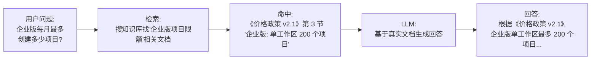

模型从推测式回答变成了“按文档说话”。**这正是 RAG 解决的核心问题：让 LLM 的回答有据可查**。

但要注意：RAG 不是“防幻觉开关”。它只能把幻觉问题从“模型凭空编造”转化为“检索是否召回正确资料、上下文是否足够、模型是否忠实引用资料”的工程问题。如果检索结果本身错误、权限过滤遗漏、chunk 切分不当，LLM 仍然可能基于错误上下文生成错误答案。

### 11.1.3 RAG 的完整链路全景

一次完整的 RAG 流程其实分两条线：离线的“建索引”和在线的“问答”。


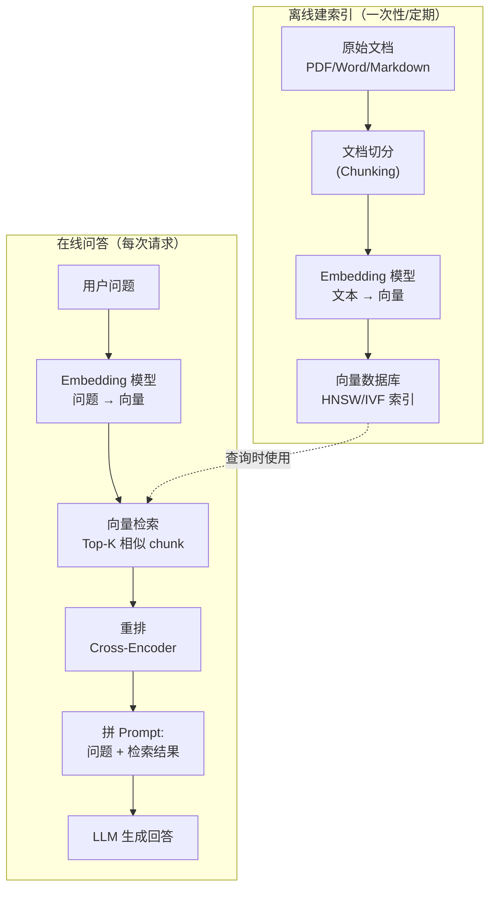


这张图是理解本章的主线。本章 11.2–11.6 都是在拆解其中的一个关键环节：

| 章节    | 对应环节         | 关键决策                                              |
| ----- | ------------ | ------------------------------------------------- |
| 11.2  | 向量本质         | 为什么向量能表达语义？余弦相似度为什么有效？                            |
| 11.3  | Embedding 模型 | OpenAI / BGE / Cohere 选谁？维度多少合适？                  |
| 11.4  | 文档切分         | 按字数 / 按句子 / 按段落 / Parent-Child？chunk\_size 如何选择？  |
| 11.5  | 向量数据库        | pgvector / Pinecone / Milvus？HNSW vs IVF？         |
| 11.6  | 生成环节         | 检索到的 5 段如何组织进 Prompt？Stuff / Map-Reduce / Refine？ |
| 11.7  | 评估           | 如何理解 Recall\@K / MRR / NDCG？如何评测 faithfulness？    |
| 11.8  | 提升召回         | Query 改写 / 混合检索 / 重排 / HyDE……                     |
| 11.9  | 高级模式         | HyDE / Self-RAG / CRAG / Adaptive / Graph-RAG     |
| 11.10 | 集成 Agent     | RAG 作为 Tool 接入 LangGraph                          |

### 11.1.4 RAG vs 微调 vs 长上下文：一张表看清差异

读者最常问的一个问题：

> 现在 GPT-4o 已经支持 128K 上下文、Claude 支持 200K 上下文，是否可以直接把整本文档放进上下文，而不再建设 RAG 流程？

或者另一个问题：

> 如果目标是让模型“懂业务”，是否可以直接用业务数据微调一个领域模型？

这三条路（RAG / 微调 / 长上下文）确实都能”让模型懂业务”，但工程权衡完全不同：

| 维度         | RAG                                                                   | 微调（Fine-tuning）                                                          | 长上下文塞文档                        |
| ---------- | --------------------------------------------------------------------- | ------------------------------------------------------------------------ | ------------------------------ |
| **知识时效**   | 实时（文档改了下次问就生效）                                                        | 滞后（知识冻结在训练时刻，新文档要重训）                                                     | 实时（每次都塞最新文档）                   |
| **加新知识成本** | 加一个文档 → embedding → 入库（几秒～几分钟）                                        | 从小规模 API fine-tuning 的几十美元，到领域模型训练的数千 / 数万美元都有可能；真正成本通常来自数据清洗、标注、评估和反复迭代 | 改 prompt 模板（瞬间）                |
| **单次推理成本** | 中（检索几十 ms + LLM 调用）                                                   | 低（只是 LLM 调用）                                                             | **极高**（每次都把整本文档放入上下文，Token 爆炸） |
| **可解释性**   | **强**（能告诉用户”答案来自《文档 X》第 N 节”）                                         | 弱（知识混进权重，无法溯源）                                                           | 中（答案在上下文里，但不知道用了哪一段）           |
| **私有数据安全** | 取决于部署方式：Embedding、向量库、LLM 都自托管时最强；若调用外部 Embedding / LLM API，检索片段仍可能出域 | 中（通常要把私有数据交给训练平台）                                                        | 中到强（取决于是否把完整文档发给外部模型）          |
| **回答风格定制** | 弱（受 Prompt 控制，能力上限是 base 模型）                                          | **强**（能改输出风格、语气、思维链）                                                     | 弱                              |
| **知识规模上限** | **极高**（百万级文档可索引）                                                      | 中（受训练数据规模和成本约束）                                                          | 低（受上下文窗口约束，几十 K Token 就到顶）     |
| **冷启动门槛**  | 低（一台服务器 + 一个 Embedding 模型就能跑）                                         | 高（要 GPU、训练数据、调参经验）                                                       | 低                              |
| **典型适用场景** | 业务知识库、产品文档问答、客服 FAQ、企业内搜                                              | 改写风格、行业术语、专属推理范式                                                         | 单文档总结、合同审查、临时一次性问答             |


**结论**：

*   知识量大、时效要求高、需要溯源 → 走 **RAG**（本章主线）
*   模型回答风格要彻底改造（如医疗诊断、法律行文） → 走 **微调**（往往还会和 RAG 结合）
*   偶尔一两次放入一份文档让模型读 → 用 **长上下文**（成本不可持续做高频业务）

很多生产系统实际上采用“微调基础模型 + RAG 接入业务知识”的组合方案，这两条路线并不冲突。

**经验法则**

99% 的”让企业业务落地 AI 客服 / AI 搜索 / AI 助手”需求，第一步选型通常都是 RAG。微调和长上下文要么成本更高、要么维护难度更大，只在特定场景才划算。

### 11.1.5 RAG 的简化心智模型

RAG 的本质可以概括为：

> **把检索系统当成 LLM 的“长期记忆”，把 LLM 当成“会读会写的执行器”。**

*   检索系统：能保存任意多的、可随时更新的、可精确溯源的知识。
*   LLM：能理解检索到的几段文本，并按用户问题组织成自然语言回答。

两者结合后，LLM 不再只依赖”训练时记忆”，而是优先依赖”现场资料”，幻觉率通常会显著下降，知识更新成本也大幅降低。但最终质量仍取决于检索召回、重排、权限过滤、Prompt 约束和评估闭环。

接下来，11.2 将系统展开”向量”的数学本质，11.3 则进入 Embedding 模型选型。

***

## 11.2 向量的数学本质

要让计算机判断”两段文本意思相不相近”，必须先把文本变成数字——这就是 **Embedding（嵌入向量）** 的本质：把任意一段文本映射到一个高维空间里的点，让”意思相近”对应”距离相近”。


### 11.2.1 从词到向量：Embedding 具体是什么

最简单的理解：

    "猫"        → [0.21, -0.83, 0.42, ..., 0.05]   # 384 维向量
    "小猫"      → [0.23, -0.79, 0.39, ..., 0.07]   # 与"猫"非常接近
    "路由器"    → [-0.51, 0.12, 0.66, ..., -0.33]  # 与"猫"完全不同
    "网络设备"  → [-0.48, 0.15, 0.61, ..., -0.30]  # 与"路由器"非常接近

向量本身的每一维都是模型学出来的”隐含特征”——你无法解释第 17 维具体代表什么（这就是为什么 Embedding 常被叫做”黑盒表示”），但作为整体，**距离表达了语义关系**。

### 11.2.2 余弦相似度的几何直觉

两个向量靠不靠近，如何衡量？最常用的有三种距离/相似度：

| 度量        | 公式                                           | 含义                        |
| --------- | -------------------------------------------- | ------------------------- |
| **欧氏距离**  | $\sqrt{\sum (a_i - b_i)^2}$                  | 两点之间的直线距离，关心”绝对位置”        |
| **余弦相似度** | $\cos\theta = \dfrac{a \cdot b}{\|a\|\|b\|}$ | 两个向量夹角的余弦，关心”方向”          |
| **点积**    | $a \cdot b = \sum a_i b_i$                   | 同方向且都大 → 大；正交 → 0；反方向 → 负 |

为什么文本检索几乎清一色用**余弦相似度**？两个原因：

**(1) Embedding 模型训练时通常做了 L2 归一化**

也就是说，模型输出的向量长度都是 1（$\|v\|=1$）。在这种约束下：

$$
\cos\theta = \dfrac{a \cdot b}{\|a\|\|b\|} = a \cdot b
$$

而且 $\|a-b\|^2 = 2 - 2(a \cdot b)$。因此在 **Top-K 排序意义上**，余弦相似度、点积和欧氏距离通常会给出等价排序：余弦越大，欧氏距离越小。但它们的数值含义并不相同，不能简单说三者“完全相同”。

工程上常用余弦相似度，是因为它直接刻画向量方向，并且输出在 $[-1, 1]$ 区间内，便于跨样本比较。不过在真实 embedding 分布中，分数通常会集中在较窄范围，不一定覆盖完整 $[-1, 1]$。

**(2) “方向”才是语义，模长不要过度解释**

可以这样直觉理解：

*   向量的**方向** ≈ 文本表达的”是什么意思”
*   未归一化向量的**大小** 可能受到文本长度、token 分布、模型内部激活等因素影响，但不应简单解释为“语义强度”

检索关心的是”意思像不像”，所以通常会先做 L2 归一化，再用余弦相似度或归一化后的点积比较方向。

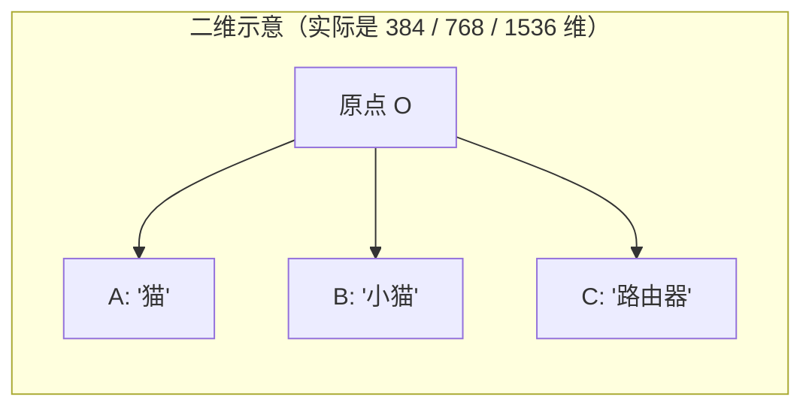

二维想象中，A 和 B 夹角很小（cos ≈ 0.95），A 和 C 几乎垂直（cos ≈ 0.05）。在 384 维空间里，这种”几乎垂直”的现象会更显著——高维空间的随机向量大多近乎正交，所以**余弦 0.7 和 0.9 在 384 维空间里的差距远比 2D 直觉强**。这既是高维的”诅咒”，也是高维的”馈赠”：让相关与不相关的区分非常清晰。

**高维诅咒 vs 高维馈赠**

*   **诅咒**：维度高了，欧氏距离会因维度数目变得难以区分（所有点对距离都趋于一致）
*   **馈赠**：但对于”训练过的 Embedding 空间”，高维让”相关语义”被压缩到一个低维流形上，余弦相似度反而更敏锐

所以在文本 Embedding 检索中，余弦相似度或归一化后的点积通常是默认选择；但如果某个模型的官方文档明确推荐点积或 L2 距离，应优先遵循模型卡和向量库的推荐配置。

### 11.2.3 距离度量速查表

| 你的场景       | 用什么       | 原因             |
| ---------- | --------- | -------------- |
| 文本检索（最常见）  | **余弦相似度** | L2 归一化后方向最稳定   |
| 推荐系统（隐式反馈） | **点积**    | 关心”激活强度 × 匹配度” |
| 图像检索（已归一化） | 余弦或点积     | 等价             |
| 异常检测       | 欧氏距离      | 关心”偏离正常区域多远”   |

本章后面的所有代码示例统一使用**余弦相似度**。需要注意的是，不同向量库和模型的默认距离度量可能不同；生产环境应以模型卡、向量库文档和离线评测结果为准。

### 11.2.4 🤖 用 AI 生成本节代码（向量相似度工具）

**完整 Prompt（可直接粘贴到 Cursor / Claude 执行）**

    **背景**：
    - 项目位于当前工作区，第十一章 RAG 系统代码统一放在 services/chat/rag/ 下。
    - 本节是 11.2，目标是产出一个零依赖的纯函数模块，用于演示余弦相似度 / 欧氏距离的计算，并验证"L2 归一化后余弦 = 点积"。
    - 不依赖 numpy / pgvector，纯 TypeScript 实现，方便测试和读者本地跑。

    **任务**：
    1. 在 services/chat/rag/embedding/ 下新建 similarity.ts，导出：
       - dot(a: number[], b: number[]): number
       - l2Norm(v: number[]): number
       - normalize(v: number[]): number[]   // 返回 L2 归一化后的新向量
       - cosineSimilarity(a: number[], b: number[]): number
       - euclideanDistance(a: number[], b: number[]): number
    2. 所有函数对长度不一致的输入要抛 RangeError('向量维度不匹配')。
    3. 在 services/chat/test/chapter11-rag.spec.ts 内 describe '11.2.4 相似度' 下补充：
       - 单位向量自相似 = 1
       - 反方向向量相似 = -1
       - 正交向量相似 = 0
       - 归一化后 cosineSimilarity === dot（容差 1e-9）
       - 维度不匹配抛错

    **约束**：
    - 零外部依赖
    - 不要使用 Float32Array，保持 number[]，便于读者理解
    - 测试用 bun:test 风格，mock-first，无网络无 DB

    **输出**：
    - 完整 similarity.ts
    - 补全 chapter11-rag.spec.ts 中 11.2.4 的 describe 块

**本节配套用例**：`bun test test/chapter11-rag.spec.ts -t "11.2.4"`

覆盖：单位向量自相似 = 1、反向 = -1、正交 = 0、归一化后余弦 = 点积、维度不匹配抛错。


### 11.2.5 Embedding 模型如何训练出来（对比学习）

读者经常停在”模型能把文本变向量”这一层，但**模型为什么能学出”相似的文本距离近”这个性质**，需要再往下挖一层。答案是 **对比学习（Contrastive Learning）**。

**核心思想**：

> 给模型一堆”正样本对”（意思相近的两段文本）和”负样本对”（意思无关的两段文本），训练时强行让正样本向量靠近、负样本向量远离。

**(1) 正负样本如何构造**

| 样本类型                    | 构造方式                            | 代表模型             |
| ----------------------- | ------------------------------- | ---------------- |
| **正样本**                 | 问答对 / 双语对照 / 同义改写 / 同主题摘要       | Sentence-BERT、E5 |
| **正样本（自监督）**            | 同一句话两次过 dropout → 得到两个略不同向量     | SimCSE（开创性）      |
| **负样本（简单）**             | 一个 batch 内随机抽其他样本               | 几乎所有模型           |
| **难负样本（hard negative）** | 看起来很像但实际无关的样本（如 BM25 检索到的非相关结果） | BGE、E5-large     |

难负样本挖掘是现代 Embedding 模型质量的关键——简单负样本太容易区分，模型学不到细粒度差异；难负样本逼迫模型”在很像的两段文本里找出真正的相关”，因此 BGE、E5、Cohere v3 这些近年来的强模型都重度使用 hard negative mining。

**(2) InfoNCE 损失函数**

对比学习最经典的损失叫 **InfoNCE（Noise-Contrastive Estimation）**：

$$
\mathcal{L} = -\log \dfrac{\exp(\text{sim}(q, k^+) / \tau)}{\exp(\text{sim}(q, k^+) / \tau) + \sum_{i=1}^{N} \exp(\text{sim}(q, k_i^-) / \tau)}
$$

直观解释：

*   $q$ 是 query，$k^+$ 是正样本，$k_i^-$ 是负样本
*   分子是”和正样本的相似度”，分母是”和正样本 + 所有负样本相似度的总和”
*   训练目标 = 最大化这个比值 = 让正样本相似度远高于所有负样本
*   $\tau$ 是温度（temperature），控制”区分难度”，越小越严格

**(3) 训练目标和检索任务的对齐**

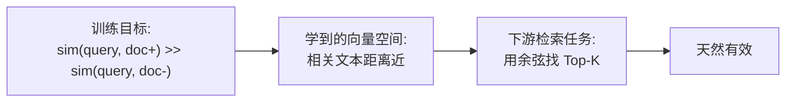

这正是 **Embedding 模型能够用于检索** 的原因：训练目标本身就是“让相似文本距离更近”，检索任务可以直接复用这一性质。

**(4) 代表模型一览**

| 模型                            | 创新点                                         | 备注            |
| ----------------------------- | ------------------------------------------- | ------------- |
| Sentence-BERT (2019)          | 孪生 BERT + 平均池化 + cosine 损失                  | 开山之作，奠定双塔范式   |
| SimCSE (2021)                 | dropout 当数据增强 → 同句两次 forward 当正样本对          | 启发自监督对比学习浪潮   |
| Contriever (2022)             | 完全自监督，无需任何监督数据                              | 不需要打标，规模可大    |
| E5 (2022)                     | “task prefix”（query: / passage:）+ 大规模弱监督预训练 | 多语言效果好        |
| **BGE (2023, 智源)**            | 中英文最佳之一，三阶段训练（预训练 → 通用对比 → 任务微调）            | **中文 RAG 首选** |
| OpenAI text-embedding-3-large | 3072 维（可截断）+ 大规模工程                          | 闭源但易用         |

### 11.2.6 Embedding 模型的内部流程与 Pooling 策略

Sentence-BERT 类模型的内部 forward 流程：

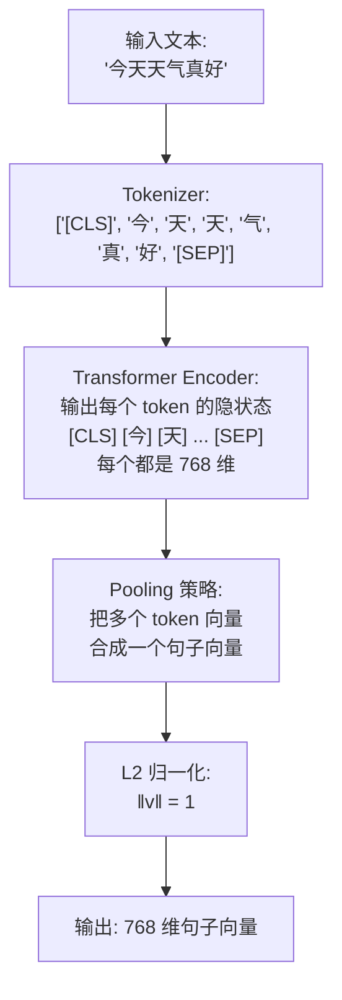

第 4 步 **Pooling** 是把”一堆 token 向量”合成”一个句子向量”的关键操作。常见三种策略：

| Pooling 策略                 | 做法                                | 优点                        | 缺点                       | 谁在用                                                                                        |
| -------------------------- | --------------------------------- | ------------------------- | ------------------------ | ------------------------------------------------------------------------------------------ |
| **Mean / Average Pooling** | 所有 token 向量按 attention\_mask 加权平均 | 鲁棒、平滑，捕捉全局语义              | 长文本”被稀释”——主旨被无关 token 拉平 | Sentence-BERT 默认、本项目 MiniLM-L12-v2；E5 常见实现也使用 average pooling，并配合 `query:` / `passage:` 前缀 |
| **CLS Pooling**            | 取 \[CLS] 特殊 token 的向量作为句向量        | BERT 原生设计 \[CLS] 就是用来代表全句 | 必须在大量监督任务上微调 \[CLS] 才有用  | BGE 部分模型常用 CLS pooling；具体以模型卡和实现为准                                                         |
| **Max Pooling**            | 每一维取所有 token 中的最大值                | 捕捉”最突出的特征”                | 容易丢上下文，对长文本不友好           | 较少单独使用                                                                                     |

**注意：闭源模型的 Pooling 不要反推**

OpenAI、Cohere、Voyage 等闭源 Embedding API 只暴露最终句向量，不公开内部 pooling 细节。工程上只需要关注它们的输入上限、输出维度、推荐距离度量、价格和评测效果，不应假设其内部一定使用 mean pooling 或 CLS pooling。

**注意：长文本被稀释问题**

mean / average pooling 在长文本上有一个隐患：512 个 token 取平均时，主旨可能被 400 个无关 token “拉平”，向量失去判别力。这是为什么 **文档切分（11.4）非常关键**——把长文档切成足够聚焦的小块，每个块的向量才不会被无关内容稀释。

参考本项目的实现 `services/chat/src/document/embedding.service.ts`（已存在）使用的是 Xenova/paraphrase-multilingual-MiniLM-L12-v2 + mean pooling + L2 归一化的标准 Sentence-BERT 范式：

```tsx
/**
 * EmbeddingService — 本地向量生成
 *
 * 使用@xenova/transformers (Transformers.js) 在 Node.js 环境运行。
 *
 * 模型: Xenova/paraphrase-multilingual-MiniLM-L12-v2
 *   - 12 层 Transformer Encoder（蒸馏版 BERT）
 *   - 输出维度: 384 维（适合 pgvector + HNSW 的常见配置；具体维度上限要看 pgvector 版本、索引类型和字段类型）
 *   - 支持 50+ 语言（含中文），专为短文本相似度优化
 */
```

后面 11.3 节会展开”OpenAI / BGE / 本地 MiniLM 如何选”。

### 11.2.7 维度大小如何选择

Embedding 维度（dim）通常在 256–3072 之间。

| 维度   | 代表模型                                              | 特点                 |
| ---- | ------------------------------------------------- | ------------------ |
| 384  | MiniLM-L12-v2                                     | 蒸馏小模型，本地推理快、向量库存储省 |
| 768  | BGE-base、E5-base、all-mpnet-base-v2                | 中等精度，性价比之选         |
| 1024 | BGE-large、E5-large、Cohere v3                      | 高精度，主流大模型默认值       |
| 1536 | OpenAI text-embedding-ada-002 / 3-small           | OpenAI 历史默认        |
| 3072 | OpenAI text-embedding-3-large（可截断到 256/1024/3072） | 顶级精度，按位截断          |

**实战取舍**：

*   知识库小（< 10 万 chunk）：384–768 维就够，存储和计算便宜
*   中等规模（10 万–100 万）：1024 维是性价比最佳
*   超大规模 / 多语言 / 高精度：1536–3072

**注意：向量维度还要受向量库限制**

维度不是越大越好，还要看向量库和索引是否支持。例如 pgvector 的 `vector` + HNSW 索引存在维度上限，不同版本、字段类型（`vector` / `halfvec` / `bit` / `sparsevec`）限制不同。OpenAI `text-embedding-3-large` 默认 3072 维，接 pgvector HNSW 时通常要考虑用 `dimensions` 参数截断到 1024 / 1536，或者改用 `halfvec` / 其他向量库。上线前务必用当前 pgvector 版本文档确认。

**本节配套用例**：`bun test test/chapter11-rag.spec.ts -t "11.2"`

覆盖：normalize 后向量范数为 1、余弦 ∈ \[-1, 1] 严格成立、不同维度向量计算抛错、空向量抛错。


**本节小结**

*   如果只记住一句话：Embedding 把文本映射成向量，RAG 检索本质上是在向量空间里找语义邻居。
*   工程默认选择：文本检索优先用余弦相似度或归一化后的点积，但要以模型卡和离线评测为准。
*   最容易踩的坑：把“归一化后的排序等价”误解成“余弦、点积、欧氏距离数值完全相同”。

***

## 11.3 Embedding 模型选型


11.2 讲清楚”向量是什么、如何训出来的”之后，工程上的下一个问题是：**在众多 Embedding 模型中，应该如何选型？**

### 11.3.1 选型的四个维度

1.  **任务匹配度**：你的检索语料是中文 / 英文 / 多语种？是短文本（FAQ）还是长文档（合同）？
2.  **精度 vs 成本**：闭源 API（OpenAI / Cohere）开箱即用但有费用；开源（BGE / E5 / MiniLM）需自托管但零边际成本。
3.  **维度选择**：384 / 768 / 1024 / 1536 / 3072，越大越准但存储和检索成本同步上升（11.2.7 已展开）。
4.  **可控性**：是否需要本地化部署（合规、私有数据不出域）？是否要做领域微调？

### 11.3.2 当前主流 Embedding 模型对比（截至 2026 年初）

| 模型                                | 维度                    | 中文     | 类型     | 上下文窗口                                | 典型场景                                               |
| --------------------------------- | --------------------- | ------ | ------ | ------------------------------------ | -------------------------------------------------- |
| **OpenAI text-embedding-3-small** | 1536（可截 256/512/1024） | 中等     | 闭源 API | 8K                                   | 通用、易用、\$0.02/M tokens                              |
| **OpenAI text-embedding-3-large** | 3072（可截）              | 良      | 闭源 API | 8K                                   | 高精度 SaaS、\$0.13/M tokens                           |
| **Cohere embed-v3**               | 1024                  | 良      | 闭源 API | 常见版本上下文较短，具体以当前模型文档的 Max Tokens 字段为准 | 多语言、压缩感知（int8）                                     |
| **BGE-large-zh-v1.5**             | 1024                  | **优秀** | 开源     | 512 tokens                           | **中文 RAG 首选**                                      |
| **BGE-M3**                        | 1024                  | 优      | 开源     | 8192 tokens                          | 长文档 + 多语种 + 多检索范式融合；但长输入会显著增加显存和延迟，仍然需要合理 chunking |
| **E5-large-v2**                   | 1024                  | 良      | 开源     | 512 tokens                           | 英文为主、有 task prefix                                 |
| **MiniLM-L12-v2 (multilingual)**  | 384                   | 中      | 开源     | 128 tokens                           | 短文本、低成本、本地                                         |
| **Voyage-3**                      | 1024                  | 良      | 闭源 API | 32K                                  | 长文档、高精度（最近上升明显）                                    |

> 模型生态变化非常快，上面是 2026 年初的概况。MTEB 排行榜（[Hugging Face MTEB Leaderboard](https://huggingface.co/spaces/mteb/leaderboard)）每月都在变，上线前请查最新榜单。价格、上下文窗口、输出维度和可截断能力也会随 API 版本变化，生产选型时必须以官方模型文档为准。

### 11.3.3 MTEB 基准是什么

**MTEB（Massive Text Embedding Benchmark）** 是 Hugging Face 维护的 Embedding 模型评测体系，覆盖：

*   **8 大任务类型**：Retrieval（检索）、STS（语义相似度）、Classification、Clustering、Reranking、PairClassification、Summarization、BitextMining
*   **58 个数据集**，涵盖英文、中文、多语种
*   **核心指标**：每个任务有专属指标，综合排名按平均分

读 MTEB 榜单时要关注两点：

1.  **任务对齐**：做检索就看 Retrieval（占 RAG 中的关键）和 Reranking 这两栏，不要被 STS 平均分迷惑
2.  **语种对齐**：MTEB-zh（中文榜）和 MTEB-en（英文榜）分开看，BGE 在中文榜常年第一不代表它在英文榜也第一

### 11.3.4 选型决策树

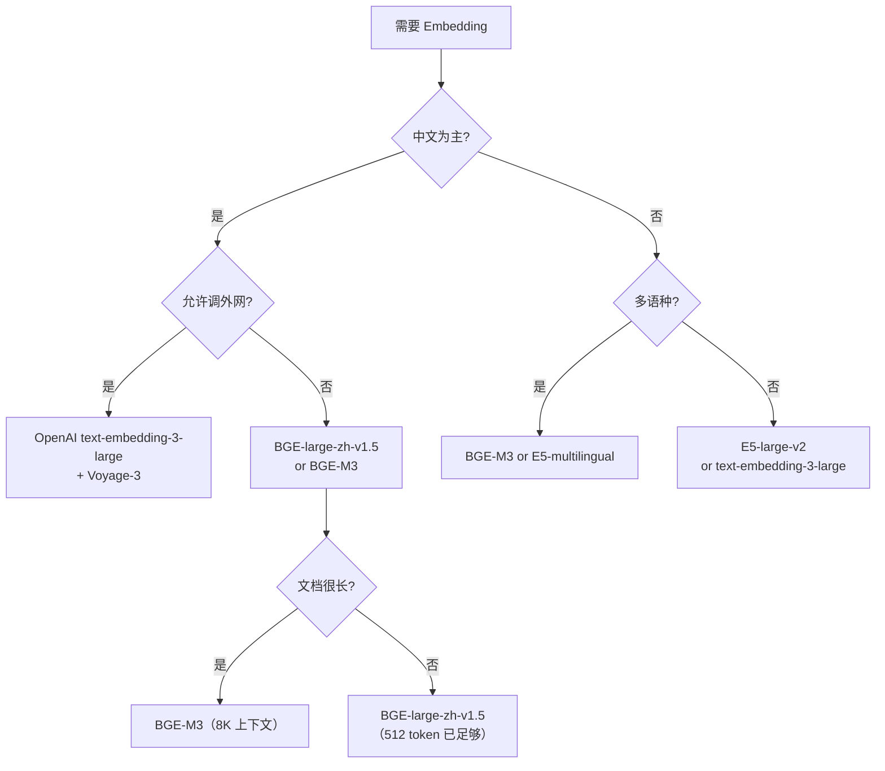

### 11.3.5 本项目当前选择：MiniLM-L12-v2（multilingual）

本项目 `services/chat/src/document/embedding.service.ts` 已经在用 `Xenova/paraphrase-multilingual-MiniLM-L12-v2`：

*   **优势**：本地推理（Transformers.js）、384 维省存储、零外部依赖、支持中文
*   **代价**：精度低于 BGE-large 一档；上下文限 128 token（约 100–200 个中文字符，本项目 chunkSize=500 字时超出部分会被截断；生产环境建议换用 512 token 上下文的 BGE-large 等模型）

这是一个”教学和开发期的合理选择”。生产环境如果中文检索精度不够，第一优先级换成 **BGE-large-zh-v1.5**（开源、不出域）；如果接受调外网 API，**OpenAI text-embedding-3-large** 是接入成本很低的选择，但要同步检查向量维度与向量库索引是否兼容。若使用 pgvector HNSW，通常需要通过 `dimensions` 参数降维，或调整字段类型 / 向量库方案。

### 11.3.6 Bi-Encoder vs Cross-Encoder：检索器与重排器的本质区别

这是 RAG 高阶选型里**最容易被忽略**的一个区分。理解它之后，你才能看懂 11.8.4 节的”重排器为什么必须存在”。

**Bi-Encoder（双塔模型）**：

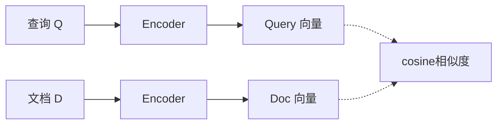

*   两段文本各自独立进同一个 Encoder（或两个共享参数的孪生塔）
*   输出两个独立向量
*   比较向量距离得到相似度
*   **关键特性**：Encoder 看不到”对方文本”，纯靠向量空间表达

**Cross-Encoder（交叉编码）**：

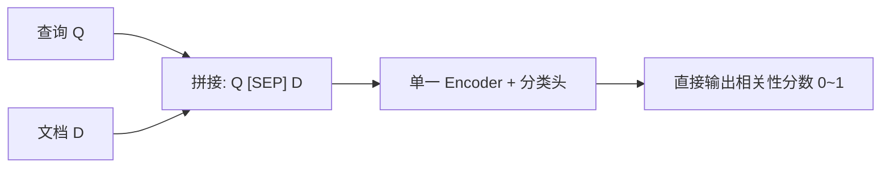

*   Q 和 D 拼接成一段长文本，一起喂进 Transformer
*   Encoder 内部的注意力机制可以**直接看到 Q 和 D 的每个 token 互相对照**
*   最后用一个分类头输出 \[0, 1] 的相关性分数

**对比一览**：

| 维度       | Bi-Encoder                  | Cross-Encoder                              |
| -------- | --------------------------- | ------------------------------------------ |
| **结构**   | 两段文本独立编码                    | 两段文本拼接后一起编码                                |
| **精度**   | 受限（向量空间瓶颈）                  | **高**（细粒度 token 交互）                        |
| **速度**   | 极快（文档向量可预计算并入库）             | 慢（每对都要重新计算）                                |
| **可扩展性** | 百万级文档（向量入库 + ANN 检索）        | 几十到几百候选（无法预计算）                             |
| **典型代表** | Sentence-BERT、BGE、E5、OpenAI | BGE-reranker、Cohere rerank-v3、mxbai-rerank |
| **典型用法** | **初次检索**（topK=20–100）       | **重排**（topK=20 → top5）                     |

**配对工作流——工业 RAG 的标准两阶段架构**：

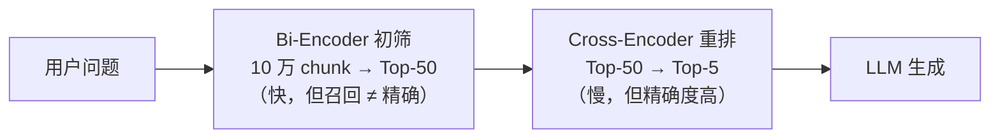


为什么不直接用 Cross-Encoder 检索？**计算成本不可接受**——10 万个 chunk 都要分别和 Query 拼接并重新计算，每次查询需要执行 10 万次完整 Transformer 推理。

为什么不只用 Bi-Encoder？**精度不足**——双塔架构无法捕捉”Q 里的’蓝牙围栏’和 D 里的’BLE 信标’是同义”这种细粒度对齐。

**RAG 系统通常采用这种”漏斗式”流程**：

| 阶段           | 输入规模        | 算法                | 速度         | 输出规模      |
| ------------ | ----------- | ----------------- | ---------- | --------- |
| 1. 向量检索      | 100 万 chunk | HNSW + Bi-Encoder | < 100 ms   | Top-50    |
| 2. 关键词检索（可选） | 100 万 chunk | BM25              | < 50 ms    | Top-50    |
| 3. 融合（可选）    | 上面两组        | RRF               | < 1 ms     | Top-50    |
| 4. **重排**    | Top-50      | **Cross-Encoder** | 100–500 ms | **Top-5** |
| 5. LLM 生成    | Top-5       | GPT-4o 等          | 1–5 s      | 回答        |

11.8.4 会展开重排器的具体调用代码。需要先明确：**初筛用双塔，精排用交叉**——这是 RAG 检索质量的关键架构经验。

### 11.3.7 Embedding 模型升级 / 切换的工程注意事项

最常见的事故：**入库时用了 model A，查询时用了 model B**。两个模型生成的向量空间完全不一样，检索结果会变成纯噪音。

工程上必须做到：

1.  **数据库表里存 `model_name` 列**——每条 chunk 记录它是哪个模型生成的
2.  **查询时校验**——查询用的模型 == 入库时的模型
3.  **换模型 = 全量重新 embedding + 重建索引**——不能”老数据不动新数据用新模型”
4.  **换 chunk 策略也要重建**——chunk 边界变了，旧向量和旧引用位置都不再可靠

```sql
-- 推荐的 chunk 表 schema
CREATE TABLE document_chunks (
  id          UUID PRIMARY KEY,
  documentId  UUID NOT NULL,
  content     TEXT NOT NULL,
  chunkIndex  INT NOT NULL,
  embedding   vector(384) NOT NULL,
  modelName   VARCHAR(128) NOT NULL  -- ← 关键: 记录生成它的模型
);
```

常见变更的处理方式可概括如下：

| 变更类型            | 是否重新 Embedding | 是否重建索引     | 备注                     |
| --------------- | -------------- | ---------- | ---------------------- |
| 新增文档            | 是，增量处理         | 通常否，索引自动维护 | 写入新 chunk 与向量即可        |
| 修改文档            | 是，局部或整篇重算      | 通常否        | 建议删除旧 chunk 后写入新 chunk |
| 删除文档            | 否              | 通常否        | 可硬删除或软删除 chunk         |
| 更换 Embedding 模型 | 是，全量           | 是          | 新旧模型向量空间不能混用           |
| 更换 chunk 策略     | 是，全量           | 是          | chunk 边界、引用位置和向量全部变化   |

11.12 FAQ 的 Q4 会详细展开这个常见问题。

**本节配套用例**：`bun test test/chapter11-rag.spec.ts -t "11.3"`

覆盖：模型名校验失败抛错、不同 dim 的向量不能写入同一字段、双塔检索 vs 交叉重排的 mock 流程。


**本节小结**

*   如果只记住一句话：Embedding 模型选型不是只看榜单，还要同时看语种、维度、上下文长度、部署方式、向量库兼容性和评测集表现。
*   工程默认选择：中文优先 BGE 系列；教学 / 本地开发可用 MiniLM；闭源 API 接入快但要评估数据出域和成本。
*   最容易踩的坑：换模型只改查询端，不重算历史 chunk；或者用 3072 维模型直接接入不兼容的 pgvector HNSW 配置。

***

## 11.4 文档切分（Chunking）

11.3 选好了 Embedding 模型，下一个工程问题就来了：**一份 100 页的 PDF，如何变成”可检索的若干小块”？** 这就是 **Chunking（文档切分）**。

切分看上去简单，但它是整条 RAG 链路里**最影响最终效果**的环节之一。切得太小，每个 chunk 信息不完整，模型读了等于没读；切得太大，向量被”稀释”（11.2.6 提过的长文本问题），检索召回率断崖式下跌。


### 11.4.1 为什么要切

三个理由：

1.  **Embedding 模型有最大输入长度**——MiniLM 是 128 token，BGE-large 常见为 512 token，BGE-M3 可到 8192 token，但长输入会显著增加延迟和显存
2.  **长文本会稀释主旨**——无论是 mean pooling 还是其他句向量生成方式，一段 5000 字的文档通常都会混入太多无关信息，让向量不够聚焦
3.  **检索粒度要和”用户问题”匹配**——用户问的是一个具体问题，应该召回与问题相关的”段落”而不是”整本书”

### 11.4.2 切分粒度的工程取舍

切得太小：

*   每块语义不完整（半句话）
*   上下文丢失（不知道这段在讲哪个章节）
*   chunk 数爆炸，存储和检索成本飙升

切得太大：

*   向量稀释（11.2.6 长文本问题）
*   召回率下降
*   即使检索到了，喂给 LLM 也太冗长

**经验数值**：

| 文档类型              | 推荐 chunk\_size | 推荐 chunk\_overlap |
| ----------------- | -------------- | ----------------- |
| **技术文档 / API 文档** | 500–800 字      | 50–100 字          |
| **FAQ / 客服记录**    | 200–400 字      | 30–50 字           |
| **长篇报告 / 合同**     | 800–1200 字     | 100–200 字         |
| **聊天日志**          | 300–500 字      | 50 字              |
| **代码文件**          | 按函数/类切，不按字数    | 0 字（不重叠）          |

本项目当前使用 `chunkSize: 500, chunkOverlap: 50`：

```tsx
@Injectable()
export class ChunkService {
  private readonly splitter = new RecursiveCharacterTextSplitter({
    chunkSize: 500,
    chunkOverlap: 50,
  });
```

### 11.4.3 五种主流切分策略

**(1) 固定字数切分（Fixed-size chunking）**

最原始的方法：按固定字数切分，比如每 500 字切一次。

    "...产品支持 SSO 登录。管理员可在控制台创建用户组，配置组级权限。批量导入用户支持 CSV 格式...|...续上一段："
                                                       ^^^^切在这里——半句话切断了

**问题**：可能切在半句话中间，破坏语义。

**(2) 递归字符切分（Recursive Character Splitting）**

LangChain `RecursiveCharacterTextSplitter` 的默认策略：

    优先级: ["\n\n", "\n", "。", "！", "？", "，", " ", ""]

按”段落 → 行 → 句号 → 问号 → 逗号 → 空格 → 字符”的顺序逐级尝试，**优先在自然边界切**。如果某个段落太长，就用下一级（句号）切。

这是生产环境中最常见的默认方案，本项目也采用了这一策略。

**(3) 按句子 / 按段落切分（Sentence / Paragraph splitting）**

用 NLP 工具（spaCy / nltk / jieba）做精确句子边界识别。中文要特别小心”句号” vs “顿号” vs “省略号”。

```python
# 伪代码示例
from jieba import lcut_for_search
sentences = re.split(r'(?<=[。！？\.\!\?])\s*', text)
```

适用场景：FAQ、问答对、对话日志（每条对话就是一个 chunk）。

**(4) 语义切分（Semantic chunking）**

更高级：用 Embedding 模型计算相邻句子的相似度，当相似度突然下降时（话题切换点）进行切分。

    句 1: "我们的安全策略要求 SSO 登录。"     ←┐
    句 2: "管理员需要配置 SAML 元数据。"      ←┤ 相似度高 → 一块
    句 3: "另外，关于计费方式..."             ← 突变点：相似度断崖式下跌
    句 4: "企业版按年付费..."                ←┐
    句 5: "支持发票和合同形式..."            ←┘ 又是一块

LangChain 提供了 `SemanticChunker`，但它对每对句子都要算一次相似度，成本不低。适合”内容主题切换频繁但段落界限不清晰”的文档。

**(5) Parent-Child 切分（小块检索 + 大块生成）**

这是工业 RAG 的高阶玩法：

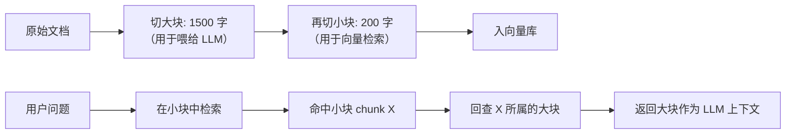

*   **检索阶段用小块**：每个 200 字的小块向量很”聚焦”，检索精度高
*   **生成阶段用大块**：找到目标小块后，返回它所属的 1500 字大块，给 LLM 更完整的上下文

这种”检索用小块，生成用大块”的设计，能同时优化”召回精度”和”生成质量”。LangChain 的 `ParentDocumentRetriever` 是这种模式的官方实现。

### 11.4.4 重叠（chunk\_overlap）为什么必要

考虑两段紧邻的切分：

    chunk_A: "...支持 OIDC 协议，用户登录后会获得 JWT。Token 有效期默认 24 小时。"
    chunk_B: "管理员可以调整 Token 过期时间，最长可设置为 30 天..."

如果用户问”JWT 默认有效期多长”，**只命中 A 没问题**。如果用户问”Token 最长能设多久”，**只命中 B**——但 B 一开头就是”管理员可以调整 Token 过期时间”，没说是哪种 Token、没说背景。这时如果 A 和 B 之间没有重叠，模型读了 B 也不知道在讲哪个系统的 Token。

**重叠（overlap）= 让相邻 chunk 共享一小段上下文**：

    chunk_A: "...支持 OIDC 协议，用户登录后会获得 JWT。Token 有效期默认 24 小时。"
    chunk_B: "Token 有效期默认 24 小时。管理员可以调整 Token 过期时间，最长可设置为 30 天..."
                                      ^^^^^^^^^^^^^^^^^^^^^^^^^^^^^^^ 重叠的 50 字

重叠的代价：存储和向量计算成本增加 \~10%。收益：召回率显著提升，是值得的。

### 11.4.5 中文切分的特殊问题

中文没有空格，标点也比英文丰富。几个常见问题：

1.  **句号、问号、感叹号的全角/半角混用**：`。 vs .`，正则要全覆盖
2.  **省略号是 6 个字符还是 1 个 token**：`...` vs `……`
3.  **专有名词不能从中间切**：「人工智能与机器学习」不能切成「人工」+「智能与机器学习」
4.  **数字、日期、单位连续**：`2026 年 5 月 15 日 14:30`，正则切句容易把数字切散

最稳的中文切分方法：

```jsx
const splitter = new RecursiveCharacterTextSplitter({
  chunkSize: 500,
  chunkOverlap: 50,
  separators: ['\n\n', '\n', '。', '！', '？', '；', '，', ' ', ''],
});
```

注意 separators 里加了中文全角标点。

### 11.4.6 切分流程参考实现

本项目 `services/chat/src/document/chunk.service.ts` 已经实现了完整的”提取 → 切分 → 向量化 → 入库”流水线：

```tsx
async processDocument(documentId: string, userId: string): Promise<void> {
  const doc = await this.prisma.documents.findUnique({
    where: { id: documentId },
  });
  if (!doc) throw new NotFoundException('文档不存在');
  if (!doc.filePath) throw new NotFoundException('文档文件路径不存在');

  // ...

  try {
    const text = await extractText(doc.filePath, doc.mimeType);
    const chunks = await this.splitter.splitText(text);

    await this.prisma.document_chunks.deleteMany({ where: { documentId } });

    const vectors = await this.embedding.embedTexts(chunks);

    for (let i = 0; i < chunks.length; i++) {
      const created = await this.prisma.document_chunks.create({
        data: { documentId, content: chunks[i], chunkIndex: i },
      });

      const vector = `[${vectors[i].join(',')}]`;
      await this.prisma.$executeRaw`
        UPDATE document_chunks
        SET embedding =${vector}::vector
        WHERE id =${created.id}
      `;
    }
  }
}
```

完整流水线（建议放到 `services/chat/rag/chunking/` 下作为可独立测试的模块）：

```tsx
// services/chat/rag/chunking/document-chunker.ts
import { RecursiveCharacterTextSplitter } from '@langchain/textsplitters';

export interface ChunkOptions {
  chunkSize?: number;
  chunkOverlap?: number;
  separators?: string[];
}

export interface Chunk {
  index: number;
  content: string;
  startOffset: number;
  endOffset: number;
}

export async function chunkText(
  text: string,
  options: ChunkOptions = {},
): Promise<Chunk[]> {
  const {
    chunkSize = 500,
    chunkOverlap = 50,
    separators = ['\n\n', '\n', '。', '！', '？', '；', '，', ' ', ''],
  } = options;

  const splitter = new RecursiveCharacterTextSplitter({
    chunkSize,
    chunkOverlap,
    separators,
  });
  const pieces = await splitter.splitText(text);

  let cursor = 0;
  return pieces.map((content, index) => {
    const startOffset = text.indexOf(content, cursor);
    const endOffset = startOffset + content.length;
    cursor = endOffset - chunkOverlap; // 留出 overlap 区域
    return { index, content, startOffset, endOffset };
  });
}
```

### 11.4.7 Parent-Child 切分的实现示例

```tsx
// services/chat/rag/chunking/parent-child-chunker.ts
export interface ParentChildChunks {
  parents: Chunk[];                 // 大块，给 LLM 用
  children: Array<Chunk & { parentIndex: number }>; // 小块，给检索用
}

export async function chunkParentChild(
  text: string,
  parentSize = 1500,
  childSize = 200,
): Promise<ParentChildChunks> {
  const parents = await chunkText(text, { chunkSize: parentSize, chunkOverlap: 100 });

  const children: Array<Chunk & { parentIndex: number }> = [];
  for (const parent of parents) {
    const subChunks = await chunkText(parent.content, { chunkSize: childSize, chunkOverlap: 30 });
    for (const sub of subChunks) {
      children.push({ ...sub, parentIndex: parent.index });
    }
  }
  return { parents, children };
}
```

**关键点**：

*   入库时只把 `children` 入向量库（含 `parentIndex` 字段）
*   检索命中 child 后，根据 `parentIndex` 回查对应 parent
*   LLM 上下文用 parent 的全文

### 11.4.8 🤖 用 AI 生成本节代码（文档切分流水线）

**完整 Prompt（可直接粘贴到 Cursor / Claude 执行）**

    **背景**：
    - 项目位于当前工作区，第十一章 RAG 系统代码统一放在 services/chat/rag/ 下。
    - 已有 services/chat/src/document/chunk.service.ts，使用 RecursiveCharacterTextSplitter (chunkSize=500, overlap=50)，但缺少 Parent-Child 切分能力和明确的中文 separators。
    - 本节目标是把切分能力下沉到一个零依赖（除 @langchain/textsplitters 外）的纯函数模块，方便复用与单测。

    **任务**：
    1. 在 services/chat/rag/chunking/ 下新建 document-chunker.ts，导出：
       - chunkText(text, options): Promise<Chunk[]>
       - 接口 Chunk { index, content, startOffset, endOffset }
       - 默认 chunkSize=500, chunkOverlap=50, separators=['\n\n','\n','。','！','？','；','，',' ','']
    2. 在同目录下新建 parent-child-chunker.ts，导出 chunkParentChild(text, parentSize, childSize)
    3. 在 services/chat/test/chapter11-rag.spec.ts 中 describe '11.4 文档切分'：
       - 11.4.3 默认 chunk_size 500 切 1200 字文本得 3 个 chunk
       - 11.4.4 重叠 50 字时，相邻 chunk 末尾==下一 chunk 开头
       - 11.4.5 中文标点优先切分: '...第一段。\n第二段...' 切点在 '。' 或 '\n'，不在词中
       - 11.4.7 Parent-Child: parents.length < children.length, 每个 child 的 parentIndex 必有对应 parent

    **关键约束**：
    - 不要去引入新的 NLP 依赖（spaCy / jieba），仅使用 @langchain/textsplitters
    - 中文 separators 必须显式声明，覆盖全角标点
    - startOffset/endOffset 必须能在原文中通过 substring 精确还原 chunk.content
    - 不修改既有 services/chat/src/document/chunk.service.ts，只在 rag/chunking/ 新增

    **输出**：
    - 完整 document-chunker.ts、parent-child-chunker.ts
    - 补全 chapter11-rag.spec.ts 的 11.4 用例

**本节配套用例**：`bun test test/chapter11-rag.spec.ts -t "11.4"`

覆盖：默认 chunk\_size、overlap 正确性、中文标点优先切分、Parent-Child 切分中 children 数 > parents 数 且每个 child 的 parentIndex 在 parents 范围内。


### 11.4.9 切分策略选择速查

| 你的场景      | 推荐策略                           | chunk\_size             |
| --------- | ------------------------------ | ----------------------- |
| 标准 RAG 起步 | RecursiveCharacterTextSplitter | 500/50                  |
| 短问答 / FAQ | 按问答对切分                         | 1 条问答 = 1 块             |
| 长合同 / 长报告 | Parent-Child                   | parent 1500 / child 200 |
| 主题切换频繁    | Semantic chunking              | 动态                      |
| 代码库       | 按函数/类切                         | 不限字数                    |

**本节小结**

*   如果只记住一句话：切分不是预处理小事，而是决定 RAG 召回质量的核心环节。
*   工程默认选择：标准文档先用 RecursiveCharacterTextSplitter + 中文 separators + 适度 overlap；长合同 / 长报告考虑 Parent-Child。
*   最容易踩的坑：看到 BGE-M3 支持 8192 tokens 就不切分；长输入虽然能跑，但延迟、显存和语义聚焦度都会变差。

***

## 11.5 向量数据库

向量切好、嵌好之后，下一个问题是：**几十万、几百万、几千万条向量，如何高效找到与查询向量最相似的 Top-K 结果？**

答案就是**向量数据库（Vector Database）**。它不是普通数据库的”附带功能”，而是为高维向量相似度检索专门设计的存储 + 索引系统。

### 11.5.1 向量数据库选型一览

| 产品                     | 类型          | 适合规模           | 特点                           |
| ---------------------- | ----------- | -------------- | ---------------------------- |
| **pgvector**           | Postgres 扩展 | < 1000 万 chunk | **本项目在用**，已有 Postgres 就是首选   |
| **Pinecone**           | SaaS 闭源     | 任意             | 全托管、按用量付费、运维零负担              |
| **Milvus**             | 开源分布式       | 千万 - 百亿        | 大厂常用，Kubernetes 部署           |
| **Qdrant**             | 开源/SaaS     | 任意             | Rust 写的，单机性能极强，支持 payload 过滤 |
| **Weaviate**           | 开源/SaaS     | 任意             | 自带模块化 Embedding，GraphQL 接口   |
| **Chroma**             | 开源          | 小规模 / 原型       | Python 友好，本地开发首选             |
| **Faiss**              | 算法库         | 任意             | Meta 出品，不是数据库而是索引库           |
| **Elasticsearch 8.0+** | 全文搜索        | 任意             | k-NN 索引 + BM25 关键词二合一        |

**选型决策**：

*   已有 Postgres、规模 < 1000 万 chunk → **pgvector**（本项目选择）
*   不想运维、预算够 → Pinecone
*   自建大规模 → Milvus / Qdrant
*   已经用 ES → 直接用 ES 8.0+ 的 k-NN

### 11.5.2 KNN vs ANN：为什么”近似”是正确的工程选择


配图：HNSW 与 IVF 的近似最近邻检索

**KNN（K-Nearest Neighbors，精确最近邻）**

最朴素的实现：

```python
def knn_search(query_vec, all_vecs, k=5):
    distances = [cosine(query_vec, v) for v in all_vecs]  # O(n) 次距离计算
    return sorted(zip(distances, all_vecs), reverse=True)[:k]
```

100 万向量？算 100 万次余弦距离。1000 万？算 1000 万次。**这是 O(n)**，规模上去后单次查询要几秒甚至几十秒，无法上生产。

**ANN（Approximate Nearest Neighbors，近似最近邻）**

**核心思路**：用索引结构（图、树、哈希）把搜索空间剪枝，不再扫描全部向量，只看”看起来很可能是邻居的少量候选”。

```python
def ann_search(query_vec, index, k=5, ef=50):
    candidates = index.search_with_pruning(query_vec, ef)  # 只看 ef 个候选
    return sorted_by_distance(candidates)[:k]
```

代价：**会漏掉一小部分真正的最近邻**（这就是”近似”的含义）。收益：**速度快 100–1000 倍**。

**为什么”近似”是正确的工程选择**

很多读者第一次听到”近似最近邻”会本能反感：“漏掉的那部分会不会就是最重要的？” 工程上回答这个问题需要看具体数字。下面的数字只是经验级示例，会受数据规模、维度、硬件、过滤条件、索引参数和实现差异影响，不能直接当作生产 SLA：

| 方案              | 召回率（Recall\@10） | 查询延迟（100 万向量） |
| --------------- | --------------- | ------------- |
| KNN（精确）         | 100%            | 几秒 - 几十秒      |
| HNSW (ef=50)    | 95–98%          | 1–10 ms       |
| HNSW (ef=200)   | 99–99.5%        | 10–30 ms      |
| IVF (nprobe=10) | 90–95%          | 5–20 ms       |
| IVF + PQ 量化     | 85–92%          | 1–5 ms        |

**结论**：在多数 RAG 场景里，召回率 95% + 速度快 1000 倍，通常比召回率 100% + 慢 1000 倍更实用。但“近似”的代价是否可控，必须通过自己的评测集验证 Recall\@K、NDCG\@K、P95 延迟和内存占用。

**主流 ANN 算法**

| 算法         | 数据结构             | 优势                 | 代表实现                         |
| ---------- | ---------------- | ------------------ | ---------------------------- |
| **HNSW**   | 多层小世界图           | 召回率高、查询快、对参数不敏感    | pgvector、Milvus、Qdrant、Faiss |
| **IVF**    | 倒排索引（k-means 聚类） | 内存省、构建快、适合超大规模     | Faiss、Milvus                 |
| **LSH**    | 局部敏感哈希           | 实现简单               | 早期产品，现已被前两者取代                |
| **PQ（量化）** | 乘积量化             | 极致省内存（向量压缩 8–32 倍） | 常和 IVF 组合使用：IVF + PQ         |
| **Annoy**  | 随机投影树            | Spotify 出品         | 老牌，现也被 HNSW 取代               |

接下来 11.5.3、11.5.4 分别展开 HNSW 和 IVF——RAG 选型时 99% 会落在这两者之一。

### 11.5.3 HNSW（Hierarchical Navigable Small World）

HNSW 是目前**最主流**的 ANN 算法，pgvector、Milvus、Qdrant 等都把它作为默认索引。

**直觉：六度分隔 + 高速公路**

HNSW 利用了两个深刻的现实直觉：

**(1) 小世界图（Small World）**

社交网络中”任意两人之间最多经过 6 个中间人就能连上”——这就是六度分隔理论。其本质是：图中只要有少量”长程连接”（远距离朋友），任意两点都能在很少步数内可达。

向量空间中也一样：每个向量随机连一些远距离邻居 + 一些近距离邻居 → 整张图就具备了”小世界性质”，从任意点出发都能快速逼近目标。

**(2) 分层 = 高速公路 + 国道 + 乡道**

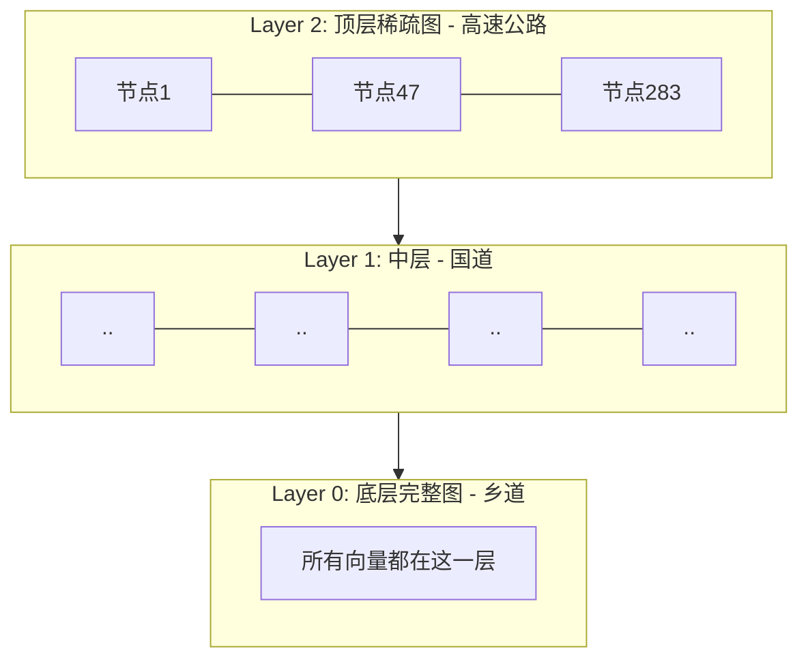

这张图是帮助理解的类比，不是 HNSW 真实内存结构的精确画法。它想表达的是：先在稀疏高层快速接近目标区域，再到底层做更细的邻域搜索。

*   **顶层（高速公路）**：节点稀疏、连接远，用于快速跨大区域跳转
*   **中层（国道）**：密度适中
*   **底层（乡道）**：所有向量都在这一层，连接稠密，用于在小邻域精细搜索

**查询过程（层级跳跃）**：

1.  从顶层一个入口点开始
2.  在当前层贪心走最近的邻居（远距离跳跃）
3.  走到”再无更近邻居”时，下钻到下一层
4.  重复，最终在底层得到 Top-K

直觉上就像”先用高速公路跳到目的城市附近 → 再用国道到目的县 → 最后用乡道找到具体地址”。

**关键参数（HNSW 用 pgvector 创建索引时的实战参数）**

```sql
CREATE INDEX ON document_chunks
USING hnsw (embedding vector_cosine_ops)
WITH (m = 16, ef_construction = 64);

-- 查询时
SET hnsw.ef_search = 100;
```

| 参数                | 含义             | 实战建议                         |
| ----------------- | -------------- | ---------------------------- |
| `m`               | 每层每个节点的最大连接数   | 中小规模 16；超大规模 32–48           |
| `ef_construction` | 建索引时每个节点考察的候选数 | 64–200，越大索引质量越好但建库慢          |
| `ef_search`       | 查询时每层考察的候选数    | 50–200 之间动态调，**质量 vs 延迟的旋钮** |

**调参经验**：

1.  **召回率不够** → 优先调大 `ef_search`（不用重建索引）
2.  **建库太慢** → 调小 `ef_construction`（但召回率会受影响）
3.  **大规模数据集** → 调大 `m`（更稠密的图），但内存占用上升
4.  **`ef_search` 永远要 ≥ k**（要返回 Top-10，就至少设为 ef=10）

**HNSW 的代价**

*   **内存大**：所有向量 + 多层图结构都要常驻内存
*   **构建慢**：每加一个向量都要建立多层连接
*   **删除困难**：图结构难”原地删点”，pgvector 等实现采用”软删除 + 后台 rebuild”

> 在 pgvector 中创建 HNSW 索引很慢——100 万 chunk 可能要 10–30 分钟。**更推荐先批量完成无索引入库，再统一执行 `CREATE INDEX` 建好索引**，比“插一条建一条”快得多。

### 11.5.4 IVF（Inverted File Index，倒排索引）

HNSW 之外的另一种主流 ANN 算法。原理完全不同。

**直觉：先分大区，再在大区内细查**

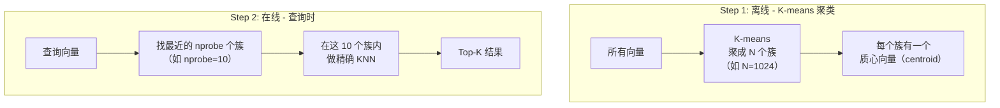

**步骤**：

1.  **离线**：把所有向量用 k-means 聚成 N 个簇（每个簇一个 centroid）
2.  **在线查询**：
    *   算 query 和所有 N 个 centroid 的距离 → 找最近的 `nprobe` 个簇
    *   只在这 nprobe 个簇内的向量里做精确 KNN
3.  假设总向量 = 100 万，N=1024，nprobe=10
    *   不用 IVF：扫 100 万次
    *   用 IVF：扫 1024 次（找 centroid）+ 约 10000 次（10 个簇 × 平均 \~1000 个向量/簇）
    *   **加速比约 100 倍**

**关键参数（IVF）**

| 参数       | 含义       | 实战建议                          |
| -------- | -------- | ----------------------------- |
| `nlist`  | 簇的数量 N   | 通常 = √(向量总数)，100 万取 1024–4096 |
| `nprobe` | 查询时考察的簇数 | 1–N 之间，越大召回越高但越慢              |

**IVF 和 PQ 量化的常见组合：IVF + PQ**

**PQ（Product Quantization，乘积量化）**：把每个 1024 维向量拆成 8 段、每段 128 维，每段做向量量化（用 256 个 codebook 向量近似），最终 1024×4 字节（float32）→ 8×1 字节 = 8 字节，**内存压缩 512 倍**。

`IVF + PQ` 组合可以让 10 亿向量在几十 GB 内存里检索，是 Facebook、Yandex 等大公司的标配。代价是召回率会下降到 85–92%。

### 11.5.5 HNSW vs IVF 对比

| 维度       | HNSW                          | IVF                   |
| -------- | ----------------------------- | --------------------- |
| **数据结构** | 多层小世界图                        | k-means 聚类 + 倒排表      |
| **召回率**  | 高（95–99.5%）                   | 中高（90–95%）            |
| **查询延迟** | 极快（1–10 ms）                   | 快（5–20 ms）            |
| **内存占用** | **大**（图结构常驻内存）                | 小（只存 centroid + 量化向量） |
| **构建速度** | 慢                             | **快**                 |
| **可删除性** | 弱（需 rebuild）                  | 较好（直接从簇中删）            |
| **适合规模** | < 1000 万                      | 1000 万 - 百亿           |
| **代表实现** | pgvector / Qdrant / Milvus 默认 | Faiss / Milvus 大规模场景  |

**选择经验**：

*   **< 100 万向量** → 优先使用 HNSW（默认参数即可）
*   **100 万 - 1000 万** → HNSW 默认参数；如内存紧张可考虑 IVF
*   **> 1000 万** → 优先考虑 IVF + PQ 组合
*   **频繁删除/更新** → IVF 更适合

### 11.5.6 pgvector 实战配置

本项目使用 pgvector，建库脚本通常长这样。

**注意：先确认维度和索引类型**

pgvector 的字段类型和索引类型都有维度限制。以常见配置为例，`vector` + HNSW 对维度有上限；如果使用 OpenAI `text-embedding-3-large` 默认 3072 维，可能需要先用 `dimensions` 参数降维，或改用 `halfvec` / 其他向量库。不要只看模型效果，也要确认“模型输出维度 × 向量库字段 × 索引类型”三者兼容。

**注意：权限过滤必须发生在检索阶段**

企业 RAG 不能先把全库 Top-K 检出来，再让 LLM “不要回答无权限内容”。正确做法是在 SQL / 向量库查询阶段就加上 `userId`、`workspaceId`、`teamId`、`documentType`、时间范围等 metadata 过滤条件，否则可能把无权限片段送入模型上下文，造成数据泄露。

```sql
-- 1. 开启 pgvector 扩展
CREATE EXTENSION IF NOT EXISTS vector;

-- 2. 建表
CREATE TABLE document_chunks (
  id          UUID PRIMARY KEY,
  documentId  UUID NOT NULL,
  content     TEXT NOT NULL,
  chunkIndex  INT NOT NULL,
  embedding   vector(384) NOT NULL,
  modelName   VARCHAR(128) NOT NULL,
  createdAt   TIMESTAMPTZ DEFAULT NOW()
);

-- 3. 建 HNSW 索引（在数据全部导入后做）
CREATE INDEX idx_chunks_embedding ON document_chunks
USING hnsw (embedding vector_cosine_ops)
WITH (m = 16, ef_construction = 64);

-- 4. 查询时调整 ef_search
SET hnsw.ef_search = 100;

-- 5. 检索（余弦距离）
SELECT dc.id, dc.content, 1 - (dc.embedding <=> $1::vector) AS score
FROM document_chunks dc
JOIN documents d ON d.id = dc."documentId"
WHERE d."userId" = $2
  AND d."workspaceId" = $3
  AND d."documentType" = ANY($4)
ORDER BY dc.embedding <=> $1::vector
LIMIT 5;
```

`<=>` 是 pgvector 提供的余弦距离运算符（距离 = 1 - 相似度）。本项目的 `SearchService` 实现：

```tsx
const rows = await this.prisma.$queryRaw<
  Array<{
    chunk_id: string;
    document_id: string;
    content: string;
    score: string | number;
    chunk_index: number;
  }>
>`
  SELECT
    dc.id             AS chunk_id,
    dc."documentId"   AS document_id,
    dc.content        AS content,
    dc."chunkIndex"   AS chunk_index,
    1 - (dc.embedding <=>${vecRaw}) AS score
  FROM document_chunks dc
  JOIN documents d ON d.id = dc."documentId"
  WHERE d."userId" =${userId}
    AND d."workspaceId" =${workspaceId}
    AND dc.embedding IS NOT NULL
  ORDER BY dc.embedding <=>${vecRaw}
  LIMIT${topK}
`;
```

### 11.5.7 存储与运维成本估算

100 万 chunk、384 维向量、HNSW 索引：

| 项目                          | 大小估算         |
| --------------------------- | ------------ |
| 向量本身（4 byte × 384 × 100 万）  | \~1.5 GB     |
| HNSW 索引（m=16，约向量大小的 1.5–2x） | \~3 GB       |
| chunk 文本（平均 500 字 × 100 万）  | \~500 MB     |
| Postgres 表头 / WAL / 索引元数据   | \~500 MB     |
| **总计**                      | **\~5.5 GB** |

如果是 1024 维向量，存储和内存都会 **乘 2.67 倍**（≈ 15 GB）；3072 维则 ≈ 44 GB。这就是为什么 11.2.7 强调”小规模选小维度”。

### 11.5.8 🤖 用 AI 生成本节代码（pgvector 仓储 + 索引脚本）

**完整 Prompt（可直接粘贴到 Cursor / Claude 执行）**

    **背景**：
    - 项目位于当前工作区，已有 services/chat/src/document/search.service.ts 实现 pgvector 余弦检索；本节目标是把"仓储层 + 索引脚本"独立到 services/chat/rag/retrieval/ 下，便于复用与单测。
    - 数据库迁移已建表 document_chunks(embedding vector(384), modelName varchar)，HNSW 索引尚未建。

    **任务**：
    1. 在 services/chat/rag/retrieval/ 下新建 vector-store.ts，导出：
       - 接口 VectorStoreRecord { id, documentId, content, chunkIndex, embedding: number[], modelName }
       - upsertChunks(prisma, records)
       - similaritySearch(prisma, queryVector, options): SearchResult[]
       - 必须在 similaritySearch 入参检查 queryVector 长度与库中向量维度一致，否则抛 RangeError
    2. 在 services/chat/scripts/ 下新建 create-hnsw-index.sql：
       - 启用 vector 扩展
       - 在 document_chunks(embedding) 上建 HNSW 索引：m=16, ef_construction=64, ops=vector_cosine_ops
       - 注释说明：先全量入库再建索引
    3. 在 services/chat/test/chapter11-rag.spec.ts 中 describe '11.5 向量数据库'：
       - 11.5.2 KNN 暴力实现作为 baseline，验证小数据集上"暴力 vs ANN"结果一致性（mock 数据 50 条向量）
       - 11.5.6 余弦相似度计算的 score = 1 - 距离 一致性

    **关键约束**：
    - vector-store.ts 不直接 import pgvector 客户端，仅通过 prisma.$queryRaw 操作
    - queryVector 与 record embedding 维度必须严格一致；用类型 [number, ...number[]] 也行，但运行时 length 校验是必须
    - HNSW 索引脚本要写在 .sql 里而不是迁移文件，方便上线时手动批准执行

    **输出**：
    - vector-store.ts 完整代码
    - create-hnsw-index.sql
    - chapter11-rag.spec.ts 中 11.5 用例

**本节配套用例**：`bun test test/chapter11-rag.spec.ts -t "11.5"`

覆盖：维度不一致抛错、KNN 暴力 baseline 与 mock ANN 结果一致性、cosine 距离与相似度互转。


**本节小结**

*   如果只记住一句话：向量数据库的核心不是“存数组”，而是用 ANN 索引在可接受召回率下把 Top-K 检索延迟降到生产可用。
*   工程默认选择：已有 Postgres 且规模中小，优先 pgvector + HNSW；超大规模或强过滤需求再评估 Milvus / Qdrant / ES。
*   最容易踩的坑：只做向量相似度，不做 `userId` / `workspaceId` / 权限元数据过滤，导致无权限片段进入 LLM 上下文。

***

## 11.6 生成环节：检索结果如何提供给 LLM

11.2–11.5 把检索这一半 RAG 解决了。下一半是**生成**：检索到 Top-K（典型 5 段）后，如何组合到 Prompt 里、如何让 LLM 基于这些内容回答？


### 11.6.1 Prompt 模板的标准结构

    你是一个基于知识库回答问题的助手。请严格根据下方提供的 [上下文] 回答用户问题。

    [规则]
    - 只用上下文中的信息回答，不要凭借常识或推测
    - 如果上下文不足以回答，明确说"根据提供的资料，我无法确定..."
    - 引用来源时标注 [文档 X, 第 Y 段]
    - 用简洁清晰的中文回答

    [上下文]
    {retrieved_chunks_with_citations}

    [用户问题]
    {user_question}

    [回答]

四个关键设计点：

1.  **明确角色**：限定模型只能基于上下文，不能编造
2.  **回退策略**：明确告诉它”找不到时如何说”，否则模型仍可能编造
3.  **要求引用**：让模型必须标注来源，方便用户溯源
4.  **检索结果在前，问题在后**：符合 KV-Cache 复用规律（前缀稳定）；问题在后让模型读完资料再回答

### 11.6.2 检索结果的注入格式

检索结果最好带上可追溯元信息，而不是只传 chunk 文本。常见字段包括 `sourceTitle`、`sourceUrl`、`sectionTitle`、`pageNumber`、`startOffset`、`endOffset`、`chunkId`、`documentVersion`。这样前端才能做“点击引用 → 跳转原文 → 高亮段落”，评测系统也能校验引用是否真实。

过于简化的写法（不推荐）：

    [上下文]
    SSO 配置需要在控制台启用 SAML。
    管理员可以在用户组设置权限。
    批量导入支持 CSV 格式。
    ...

问题：模型不知道**每段来自哪里**、**重要性如何**。

推荐写法（带元信息）：

    [上下文]
    ---
    [来源: SSO 配置指南.md, 第 2.3 节, 相关性 0.91]
    SSO 配置需要在控制台启用 SAML。具体步骤：进入「设置」→「身份验证」→「启用 SAML」...

    ---
    [来源: 用户权限手册.md, 第 5 节, 相关性 0.87]
    管理员可以在用户组设置权限。支持三类预设角色...

    ---
    [来源: 数据导入说明.md, 第 1.1 节, 相关性 0.78]
    批量导入支持 CSV 格式...
    ---

元信息带来三个好处：

*   **可溯源**：用户和模型都能看出”哪个结论来自哪个文档”
*   **可加权**：模型隐性感知”相关性 0.91 比 0.78 更重要”
*   **可分段**：明确的分隔符（`--`）让模型容易在回答里区分多个来源

### 11.6.3 引用回写：让模型在回答里标注来源

进阶版 Prompt 加一条规则：

    - 回答时必须在每个事实后面标注引用，格式 [文档名, 第 N 节]

LLM 的输出会变成：

    SSO 的配置需要在控制台启用 SAML [SSO 配置指南.md, 第 2.3 节]。
    管理员可以在用户组里设置三类预设角色 [用户权限手册.md, 第 5 节]。

前端展示时可以把这些 `[...]` 渲染成可点击的链接，跳转到对应文档/章节。这就是企业内搜（Glean、Notion AI）的标准交互。

### 11.6.4 四种 Prompt 组合策略

当检索结果较多时（比如 Top-10、Top-20），不能直接放入一个 Prompt。LangChain 把这一类组合方式总结为四种：

**(1) Stuff（填塞，最常用）**

把所有检索结果直接拼进一个 Prompt。

    [上下文]
    chunk1 + chunk2 + ... + chunk5

*   ✅ 简单，一次 LLM 调用
*   ❌ 受上下文窗口约束，Top-K 不能太大
*   适合：Top-K ≤ 10，每个 chunk ≤ 1000 字

**这是 99% 的 RAG 实战场景**。

**(2) Map-Reduce**

每个 chunk 单独问 LLM 一次（“你能从这段内容里提取出和问题相关的信息吗”）→ 把所有结果汇总成最终答案。

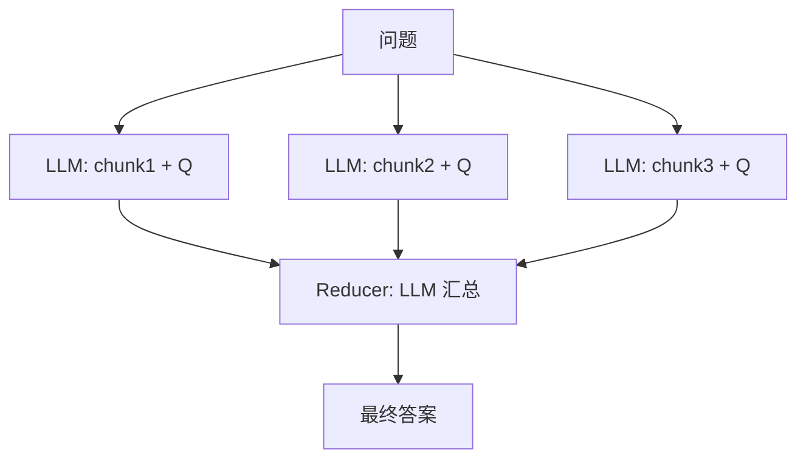

*   ✅ 能处理几十、几百个 chunk
*   ❌ 多次 LLM 调用，慢且贵
*   适合：跨文档总结、多文档对比

**(3) Refine（迭代精炼）**

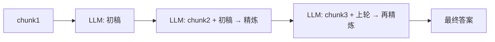


*   ✅ 答案在迭代中越来越完善
*   ❌ 串行，无法并行化，慢
*   适合：长文档逐段细化（合同审查）

**(4) Map-Rerank**

每个 chunk 让 LLM 给出一个”打分 + 答案”，取分数最高的那个。

*   ✅ 适合”只有一个 chunk 真正相关”的场景
*   ❌ 同样多次调用
*   适合：单点问答

| 策略             | 调用次数  | 速度    | 适用 Top-K | 典型场景   |
| -------------- | ----- | ----- | -------- | ------ |
| **Stuff**      | 1     | 快     | ≤ 10     | 标准 RAG |
| **Map-Reduce** | K + 1 | 慢     | ≤ 100    | 跨文档总结  |
| **Refine**     | K     | 慢（串行） | ≤ 20     | 长文档分析  |
| **Map-Rerank** | K     | 中     | ≤ 50     | 单点问答   |

### 11.6.4.1 上下文压缩：把 Top-K 变成可用上下文

当检索返回 Top-20 / Top-50 时，即使上下文窗口足够，也不应该把所有 chunk 原样塞给 LLM。更稳的做法是增加一层 **Contextual Compression（上下文压缩）**：

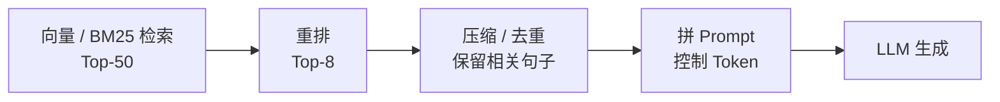

常见压缩方式：

*   **句子级过滤**：只保留包含关键实体、时间、数字、条件约束的句子
*   **LLM 压缩**：让小模型从 chunk 中抽取和问题相关的原文句子
*   **去重合并**：多个 chunk 来自同一章节时，合并相邻内容，避免重复上下文
*   **引用保留**：压缩后仍然保留 `chunkId`、`sourceUrl`、`startOffset`、`endOffset`，否则答案无法溯源

上下文压缩和第十章的 Token 成本控制直接相关：它减少输入 token，同时提升上下文信噪比。但压缩不能改变原意，尤其不能删除时间、范围、否定词和权限条件。

### 11.6.5 防幻觉的 Prompt 工程清单

即使有检索结果，LLM 仍然可能生成超出资料范围的内容。下面是一个验证过的防幻觉清单：

1.  **强限定**：`严格根据提供的资料回答，资料未覆盖的内容不要推测`
2.  **明确回退**：`如果资料不足以回答，回复 "根据提供的资料，我无法确定..."`
3.  **要求引用**：`每句结论必须标注来源 [文档名, 第N节]`
4.  **要求结构化**：`如果问题是"对比 A 和 B"，请以表格形式回答`
5.  **温度调低**：`temperature: 0.1`（不需要创造性，需要准确性）
6.  **拒答示例（few-shot）**：在 prompt 里给一个”无法回答”的示例，模型更容易模仿这种回退行为

### 11.6.6 输出格式控制

业务系统的回答往往不是纯文本，而是要带结构（用于前端渲染、下游 Agent 消费）。常见三种：

**(1) JSON 结构化回答**：

```tsx
const schema = z.object({
  answer: z.string(),
  citations: z.array(z.object({
    source: z.string(),
    section: z.string().optional(),
    confidence: z.number(),
  })),
  needsMoreInfo: z.boolean(),
});
const result = await model.withStructuredOutput(schema).invoke(prompt);
```

**(2) Markdown 带引用**：

```markdown
## 配置 SSO

1.进入控制台 「设置 → 身份验证」 [SSO 配置指南.md, 第 2.3 节]
2.启用 SAML 协议并填入 IdP 元数据 [SSO 配置指南.md, 第 2.4 节]
```

**(3) UI Protocol 事件流**：

参考第七章 UI Protocol，把”检索过程”和”回答内容”分别打包成 SSE 事件流，前端边检索边渲染。

### 11.6.7 一个完整的 RAG Pipeline 参考实现

整合 11.4–11.6 的所有思路：

```tsx
// services/chat/rag/pipeline/rag-pipeline.ts
import type { BaseChatModel } from '@langchain/core/language_models/chat_models';
import { SystemMessage, HumanMessage } from '@langchain/core/messages';
import { similaritySearch, type VectorStoreRecord } from '../retrieval/vector-store';

export interface RagAskInput {
  question: string;
  userId: string;
  topK?: number;
  model: BaseChatModel;
}

export interface RagAskOutput {
  answer: string;
  citations: Array<{
    chunkId: string;
    documentId: string;
    score: number;
  }>;
  retrievedChunks: VectorStoreRecord[];
}

const RAG_SYSTEM_PROMPT = `你是一个基于知识库的问答助手。请严格根据[上下文]回答用户问题。

规则：
- 只用上下文中的信息回答，不要凭借常识或推测
- 如果上下文不足以回答，明确说"根据提供的资料，我无法确定..."
- 每句结论后用 [chunkId] 标注引用来源
- 简洁清晰，最多 5 段`;

export async function ragAsk(input: RagAskInput): Promise<RagAskOutput> {
  const { question, userId, topK = 5, model } = input;

  // Step 1: 检索
  const chunks = await similaritySearch(question, userId, topK);

  // Step 2: 拼接 Prompt 上下文
  const contextBlock = chunks
    .map(
      (c, i) =>
        `[chunkId:${c.chunkId}, 来源:${c.documentId}, 相关性:${c.score.toFixed(2)}]\n${c.content}`,
    )
    .join('\n\n---\n\n');

  const userMessage = `[上下文]\n${contextBlock}\n\n[用户问题]\n${question}`;

  // Step 3: LLM 生成
  const response = await model.invoke([
    new SystemMessage(RAG_SYSTEM_PROMPT),
    new HumanMessage(userMessage),
  ]);

  return {
    answer: String(response.content),
    citations: chunks.map((c) => ({
      chunkId: c.chunkId,
      documentId: c.documentId,
      score: c.score,
    })),
    retrievedChunks: chunks,
  };
}
```

这就是一个最小但完整的 RAG Pipeline。后面 11.8 节会展开”召回率不够该如何改进”，11.10 节会把它包装成 LangGraph Agent 的工具。

**本节配套用例**：`bun test test/chapter11-rag.spec.ts -t "11.6"`

覆盖：Prompt 模板拼接正确、检索 0 结果时回退到”无法确定”、引用列表与检索结果数量一致、温度参数透传到 model.invoke。


***

## 11.7 召回率与准确率：RAG 系统如何评估

11.6 让 RAG 完成基础运行了。下一个问题：**它具体跑得好不好？**

工程上有一个反直觉的事实：**RAG 的好坏 90% 是检索决定的，10% 是 LLM 决定的**。模型再强，检索给的资料是错的，回答就一定是错的。所以评估 RAG 第一步是评估检索。


### 11.7.1 检索质量的三大指标

**Recall\@K（召回率）**

> 前 K 个检索结果中，找到的”真正相关文档”占所有相关文档的比例。

公式：

$$
\text{Recall@K} = \dfrac{\text{Top-K 中相关文档数}}{\text{知识库中所有相关文档数}}
$$

例：用户问”如何配置 SSO”，知识库里有 3 篇相关文档，检索 Top-5 中命中 2 篇，则 Recall\@5 = 2/3 ≈ 0.67。

*   ✅ 关心”该召回的有没有都召回”
*   ❌ 不关心”召回的位置”
*   适合：要求”宁可多召回”的场景

**典型目标**：Recall\@5 ≥ 0.8，Recall\@10 ≥ 0.9。

**MRR（Mean Reciprocal Rank，平均倒数排名）**

> 第一个相关结果的排名的倒数，对所有查询取平均。

公式：

$$
\text{MRR} = \dfrac{1}{|Q|} \sum_{q \in Q} \dfrac{1}{\text{rank}_q^{\text{first relevant}}}
$$

例：3 个测试问题，第一个相关结果分别排在第 1、第 3、第 2 位 → MRR = (1 + 1/3 + 1/2) / 3 ≈ 0.61。

*   ✅ 关心”第一个相关结果是不是排得够前”
*   适合：单点问答（只需要”最相关的那一个”）

**典型目标**：MRR ≥ 0.7（也就是说，第一个相关结果平均排在前 1–2 位）。

**NDCG\@K（Normalized Discounted Cumulative Gain）**

> 综合考虑”相关性 + 位置”的指标。位置越靠前权重越大。

公式（简化）：

$$
\text{DCG@K} = \sum_{i=1}^{K} \dfrac{\text{rel}_i}{\log_2(i+1)}
$$

$$
\text{NDCG@K} = \dfrac{\text{DCG@K}}{\text{IDCG@K}}
$$

其中 IDCG 是”理想排序”下的 DCG（即所有相关文档按相关性从高到低排好的最优值）。

*   ✅ 同时考虑”召回率 + 排名质量”
*   ✅ 是 MTEB / BEIR / TREC 等检索基准的标配指标
*   适合：所有需要”排序质量”的场景

**典型目标**：NDCG\@10 ≥ 0.65。

**三大指标对比**

| 指标            | 关心          | 不关心     | 典型场景       |
| ------------- | ----------- | ------- | ---------- |
| **Recall\@K** | “该召回的全召回了吗” | 召回的位置   | 候选生成阶段     |
| **MRR**       | “第一个相关在前面吗” | K 以外的命中 | 单点问答       |
| **NDCG\@K**   | “排序质量好不好”   | —       | **综合检索评估** |

工程上：RAG 系统**至少同时跟踪 Recall\@K 和 NDCG\@K**，前者反映”召回完整性”，后者反映”排序精度”。

### 11.7.2 端到端生成质量的评估指标

检索完了，LLM 也答完了，整个回答是不是好？需要另一组指标：

| 指标                            | 含义                | 评测方式                             |
| ----------------------------- | ----------------- | -------------------------------- |
| **Faithfulness（忠实度）**         | 回答是否完全基于检索结果，没有幻觉 | LLM-as-judge：把回答和检索结果给另一个 LLM 判断 |
| **Answer Relevancy（答案相关性）**   | 回答是否真正回答了用户问题     | LLM-as-judge                     |
| **Context Precision（上下文精度）**  | 检索结果里有多少是真正用上的    | LLM 判断 + 引用回写校验                  |
| **Context Recall（上下文召回）**     | 真正能回答问题的内容是否都被检索到 | 需要 ground truth                  |
| **Answer Correctness（答案正确性）** | 和参考答案的语义一致性       | 用 Embedding 算相似度 + LLM judge     |

### 11.7.3 RAGAS 评估框架（自动化评测）

11.7.2 的指标都要”人工对答案”来算，规模化如何处理？现在有现成的开源框架：

*   **RAGAS**（[Ragas 文档](https://docs.ragas.io/)）：Python 库，用另一个 LLM 当 judge 自动算 faithfulness / answer\_relevancy / context\_precision / context\_recall
*   **TruLens**：类似定位，更强调实时监控
*   **LangSmith Evaluations**：LangChain 官方的评估平台
*   **DeepEval**：基于 LLM-as-judge 的 pytest 风格框架

下面是用 RAGAS 评一组 RAG 输出的最小示例（Python 伪代码）。需要注意：RAGAS 本身更常见的形态是 Python 评测库，并不是默认自带标准 REST API 的服务。Node.js 项目如果要在 CI 中调用，可以额外封装一个内部 Python 微服务，例如提供 `POST /evaluate` 端点。

```python
# pip install ragas
from ragas import evaluate
from ragas.metrics import faithfulness, answer_relevancy, context_precision, context_recall
from datasets import Dataset

eval_data = Dataset.from_list([
    {
        "question": "企业版每月最多创建多少个项目？",
        "answer": "根据《价格政策 v2.1》，企业版单工作区最多 200 个项目。",
        "contexts": ["《价格政策 v2.1》第 3 节：企业版单工作区项目上限为 200..."],
        "ground_truth": "企业版单工作区最多 200 个项目。",
    },
    # ... 更多评测样本
])

result = evaluate(
    eval_data,
    metrics=[faithfulness, answer_relevancy, context_precision, context_recall],
    llm=eval_llm,  # 通常用 GPT-4o 作 judge
)
print(result)
# {'faithfulness': 0.95, 'answer_relevancy': 0.91, 'context_precision': 0.88, 'context_recall': 0.90}
```

**集成到 CI 的标准流程**：

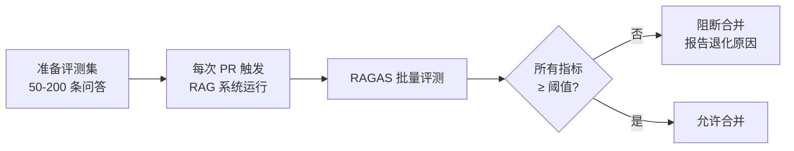


实战建议：

*   评测集规模 **至少 50 条**，否则方差太大不能反映真实情况
*   评测集要覆盖**真实业务问题分布**（FAQ、长尾、对抗性问法）
*   judge LLM 用**强模型**（GPT-4o / Claude Sonnet），用 RAG 自身的 base 模型会有 bias
*   每次大改 Embedding 模型 / chunk 策略 / Prompt 模板时，**必须跑回归**

### 11.7.4 评测集如何构造

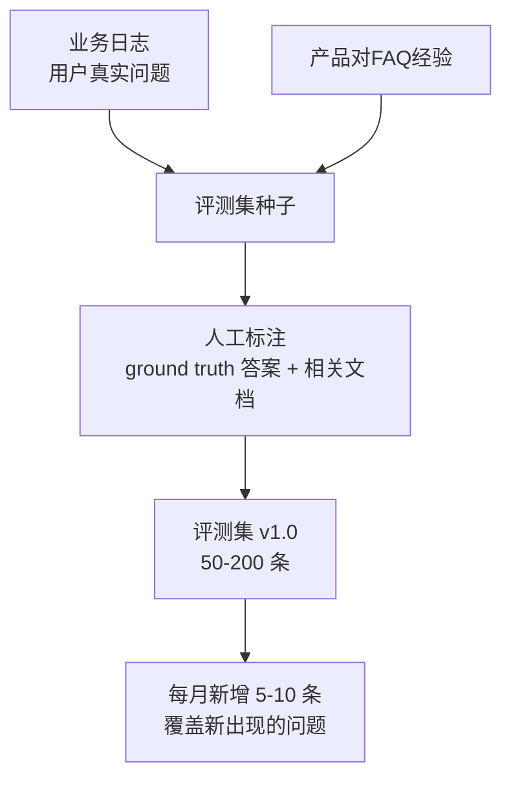


种子来源：

1.  **业务日志中的高频问题**（最重要，反映真实分布）
2.  **客服 FAQ 文档**（成熟问题）
3.  **对抗性问题**（“知识库里没有”的问题，验证”无法回答”是否回退正确）
4.  **多跳问题**（需要综合多个文档才能回答）

评测集本身也要版本化、纳入 Git 仓库。

一条更接近真实工程的评测样本可以长这样：

```json
{
  "question": "企业版每月最多能创建多少个项目？",
  "groundTruth": "企业版单工作区最多 200 个项目。",
  "expectedDocIds": ["pricing-v2.1"],
  "relevantChunkIds": ["pricing-v2.1-sec3"],
  "hardNegativeChunkIds": ["pricing-v1.8-sec3", "team-plan-limit"],
  "shouldRefuse": false
}
```

这里的 `hardNegativeChunkIds` 很重要：它们通常“看起来很像”，但答案不对。例如旧版价格政策、其他套餐限制、相似产品线说明。把 hard negative 纳入评测，才能发现“检索到了相似文本，但不是正确文本”的问题。

### 11.7.5 🤖 用 AI 生成本节代码（评测指标 + RAGAS 集成）

**完整 Prompt（可直接粘贴到 Cursor / Claude 执行）**

    **背景**：
    - 项目位于当前工作区，第十一章 RAG 系统代码统一放在 services/chat/rag/ 下。本节目标是建立"检索 + 生成"双层评测能力：
      · 检索层用纯函数计算 Recall@K / MRR / NDCG@K，无外部依赖
      · 生成层接入 RAGAS（独立服务），仅在 CI 触发，不耦合到主进程
    - 评测集放在 services/chat/test/fixtures/rag-eval-set.json，每条 { question, expectedDocIds, groundTruth }

    **任务**：
    1. 在 services/chat/rag/evaluation/ 下新建 retrieval-metrics.ts，导出：
       - recallAtK(retrievedIds: string[], relevantIds: string[], k: number): number
       - mrr(rankedListsPerQuery: string[][], relevantPerQuery: string[][]): number
       - ndcgAtK(retrievedIds: string[], relevantIds: string[], k: number): number
       - 所有函数纯函数，零依赖
    2. 在 services/chat/rag/evaluation/ 下新建 ragas-runner.ts：
       - 通过 HTTP 调用团队自行封装的 RAGAS REST 服务（Python 微服务，端点 POST /evaluate；RAGAS 本身是 Python 库，不默认提供该端点）
       - 入参 { samples: Array<{ question, answer, contexts, ground_truth }>, metrics: string[] }
       - 出参 { [metric: string]: number }
       - 实现 timeout=60s 与可重试 3 次
    3. 在 services/chat/test/chapter11-rag.spec.ts 中 describe '11.7 评估':
       - 11.7.1 Recall@K = 1 当所有 relevant 都在 Top-K
       - 11.7.1 MRR 第一个相关在第 1 位 → 1.0；第 2 位 → 0.5
       - 11.7.1 NDCG@K 单个完全命中 = 1.0
       - 11.7.3 ragas-runner 在 RAGAS 不可用时返回 null + warn，不抛错

    **关键约束**：
    - 检索指标完全离线、无依赖
    - RAGAS 接入失败必须降级（不能阻塞主流程）
    - 测试用 mock fetch / mock prisma，不能依赖真实 RAGAS 服务

    **输出**：
    - retrieval-metrics.ts、ragas-runner.ts
    - chapter11-rag.spec.ts 中 11.7 用例

**本节配套用例**：`bun test test/chapter11-rag.spec.ts -t "11.7"`

覆盖：Recall\@K 边界值（K=0、Top-K 全命中、零命中）、MRR 单 query 单相关、NDCG\@K 单点 vs 多点排名差异、RAGAS runner 在服务不可用时降级。


***

## 11.8 提升召回率的策略

11.7 给出了”评什么”的指标。但当指标不达标——召回率只有 60% 而你需要 90% 时，如何改进？这一节是 RAG **工程优化的核心战场**。


按效果从高到低、改造成本从低到高，五个标准策略。

**Query 改写的风险**

Query Rewrite / Multi-Query 很有效，但不能无脑改写。改写器必须保留用户问题中的关键约束：

*   时间：例如“近三个月的退款政策”不能改成“退款政策”
*   范围：例如“企业版”不能泛化成“所有套餐”
*   否定：例如“不支持 SSO 的方案”不能丢掉“不”
*   数字：例如“最多 200 个项目”不能改成“项目限制”
*   权限：改写不能扩大检索范围，也不能绕过 metadata filter

工程上建议同时保留 `originalQuery` 和 `rewrittenQueries`，评测时分别记录是哪一个 query 命中了最终答案，方便排查“改写改变原意”的问题：

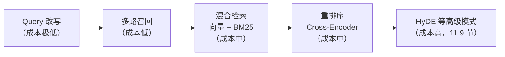

### 11.8.1 Query 改写

用户的原始问题往往**短、模糊、口语化**，向量空间里不一定对得上文档的”长、规范、书面化”表达。**先用 LLM 把问题改写成更利于检索的形式，再去检索**。

三种改写方式：

### (1) 同义改写（Query Expansion）

    原问题: "如何登录"
    改写后: "如何登录系统" / "用户登录步骤" / "系统认证方法"

把多个改写都拿去检索，结果合并。

### (2) 子问题分解（Sub-query Decomposition）

复杂问题拆成多个简单问题，分别检索：

    原问题: "对比企业版和专业版的 SSO 配置、用户上限、计费方式"
    拆解:
      1. 企业版 SSO 配置
      2. 专业版 SSO 配置
      3. 企业版用户上限
      4. 专业版用户上限
      5. 企业版计费
      6. 专业版计费

每个子问题独立检索后合并结果。

### (3) 历史上下文回填

对话场景下，用户的问题往往依赖前文：

    用户: "我们的 SSO 如何配置？"
    助手: "..."
    用户: "那企业版呢？"   ← 这里"企业版"什么意思全靠上下文

改写后：

    "企业版的 SSO 如何配置？"

LangChain 提供 `RephraseQueryRetriever`，本质就是用 LLM 把对话上下文 + 当前问题改写成自包含的查询。

### 实现示例

```tsx
// services/chat/rag/retrieval/query-rewriter.ts
import type { BaseChatModel } from '@langchain/core/language_models/chat_models';
import { z } from 'zod';

const REWRITE_SCHEMA = z.object({
  queries: z.array(z.string()).min(1).max(5),
});

const REWRITE_SYSTEM = `你是一个查询改写助手。把用户的原始问题改写为 1-3 个更利于检索的版本：
- 保持原意
- 用规范的书面表达
- 复杂问题可以拆成多个子问题
返回 JSON: { "queries": ["改写1", "改写2", ...] }`;

export async function rewriteQuery(
  model: BaseChatModel,
  originalQuery: string,
  conversationHistory?: string,
): Promise<string[]> {
  const userMessage = conversationHistory
    ? `历史对话：\n${conversationHistory}\n\n当前问题：${originalQuery}`
    : originalQuery;

  const result = await model
    .withStructuredOutput(REWRITE_SCHEMA)
    .invoke([
      { role: 'system', content: REWRITE_SYSTEM },
      { role: 'user', content: userMessage },
    ] as any);

  return result.queries;
}
```

### 11.8.2 多路召回（Multi-Query Retrieval）

把 Query 改写得到的多个查询**分别检索后合并去重**：

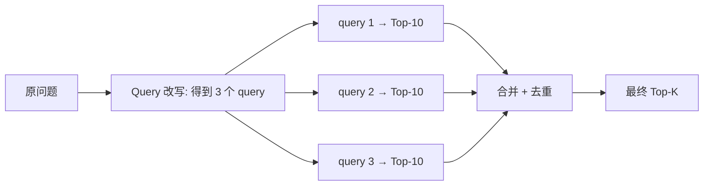


合并策略：

*   **简单去重**：按 chunkId 去重
*   **加权打分**：同一个 chunk 在多个 query 中都被召回 → 加分
*   **RRF 融合**（见 11.8.3.1）

### 11.8.3 混合检索（Hybrid Retrieval）：向量 + BM25

向量检索的盲点：**它依赖”语义相似”，但对”完全相同的关键词”反而不一定敏感**。

考虑两个查询：

    查询 A: "如何用 OAuth2 配置 SSO"
    文档 X: "OAuth2 协议详细说明..."

向量召回率高吗？不一定——文档 X 没有”配置 SSO”这个表达，向量空间里距离可能不近。但如果用关键词检索”OAuth2”，**精确命中**。

**结论：向量检索擅长”语义模糊匹配”，关键词检索擅长”精确实体匹配”**。两者结合 = **混合检索**。

### 11.8.3.1 BM25 / TF-IDF / RRF 原理

要看懂混合检索的代码，先把这三个算法原理过一遍。

**TF-IDF（Term Frequency - Inverse Document Frequency）**

最基础的关键词权重算法：

$$
\text{TF-IDF}(t, d, D) = \text{TF}(t, d) \times \log \dfrac{|D|}{|\{d \in D : t \in d\}|}
$$

直观解释：

*   **TF（词频）**：词 t 在文档 d 中出现次数
*   **IDF（逆文档频率）**：词 t 越罕见（出现在越少文档中），IDF 越大

直觉：

*   在《SSO 配置文档》中”SSO”出现 10 次 → TF 高
*   “SSO”在整个知识库的 1000 篇文档中只出现于 50 篇 → IDF 高
*   → 这篇文档对查询 “SSO” 的相关性分数高

**缺陷**：

*   没考虑文档长度（短文档里”SSO”出现 3 次 vs 长文档里出现 3 次，意义不同）
*   TF 线性增长（出现 10 次比出现 1 次重要 10 倍？显然不合理）

**BM25**

TF-IDF 的工业升级版：

$$
\text{BM25}(q, d) = \sum_{t \in q} \text{IDF}(t) \cdot \dfrac{f(t, d) \cdot (k_1 + 1)}{f(t, d) + k_1 \cdot \left(1 - b + b \cdot \dfrac{|d|}{\text{avgdl}}\right)}
$$

其中：

*   $f(t, d)$ = 词 t 在文档 d 中的频次
*   $|d|$ = 文档 d 的长度
*   $\text{avgdl}$ = 平均文档长度
*   $k_1$（词频饱和参数，典型值 1.2–2.0）
*   $b$（长度归一化强度，典型值 0.75）

BM25 在 TF-IDF 上做了两个关键改进：

1.  **词频饱和**：通过 $\dfrac{f \cdot (k_1+1)}{f + k_1}$ 让 TF 不再线性增长。当 $k_1=1.5$ 时，f 从 1 到 10 的得分不是 10 倍而是约 2.7 倍——**符合直觉**。
2.  **文档长度归一化**：分母里加入 $b \cdot \dfrac{|d|}{\text{avgdl}}$，让长文档的 TF 被”打折”，避免长文章靠堆字数获胜。

BM25 是 Elasticsearch / Lucene / OpenSearch 等全文搜索引擎的**默认算法**，常年是关键词检索的工业标准。

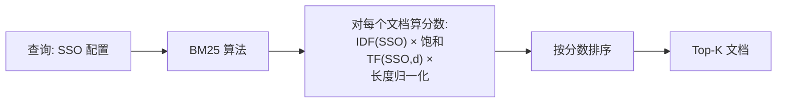

**实现库**：

*   Node: `bm25` / `okapibm25` / 直接用 Postgres 全文检索 + `ts_rank_cd`
*   Postgres: `tsvector` + `ts_rank_cd` 内置 BM25 类似算法
*   Elasticsearch: 开箱即用

**RRF（Reciprocal Rank Fusion，倒数排名融合）**

向量检索给出一个排序，BM25 给出另一个排序——如何合并？

最朴素的想法：归一化分数后加权求和。问题：**向量相似度（0–1）和 BM25 分数（0–几十）量纲完全不同**，强行归一化容易出问题。

RRF 的思路非常聪明：**不用分数，只用排名**。公式：

$$
\text{RRF}(d) = \sum_{r \in R} \dfrac{1}{k + \text{rank}_r(d)}
$$

其中 $R$ 是所有的排序列表（向量 / BM25），$\text{rank}_r(d)$ 是 d 在列表 r 中的排名（1-indexed），$k$ 是常数（典型值 60）。

举例：

| 文档 | 向量排名 | BM25 排名 | RRF 得分（k=60）         |
| -- | ---- | ------- | -------------------- |
| A  | 1    | 5       | 1/61 + 1/65 ≈ 0.0317 |
| B  | 3    | 1       | 1/63 + 1/61 ≈ 0.0322 |
| C  | 2    | 12      | 1/62 + 1/72 ≈ 0.0300 |

最终融合排名：B > A > C。

**为什么 k=60**？这是 Cormack 等人在 2009 年原始论文中实验得出的经验值。直觉：

*   k 太小（如 k=1）：排第 1 的得分 0.5，排第 10 的得分 0.09，**头部权重过大**
*   k 太大（如 k=1000）：所有排名得分都接近 0.001，**区分度太低**
*   k=60：让”排第 1”和”排第 10”的得分差距合理（1/61 vs 1/70，约 1.15 倍），不会让头部完全压制中部

### 混合检索实现

```tsx
// services/chat/rag/retrieval/hybrid-search.ts
export interface HybridSearchOptions {
  topK?: number;
  vectorWeight?: number;  // 不使用，因为 RRF 不依赖加权
  rrfK?: number;          // 默认 60
}

export async function hybridSearch(
  prisma: any,
  query: string,
  userId: string,
  options: HybridSearchOptions = {},
): Promise<SearchResult[]> {
  const { topK = 5, rrfK = 60 } = options;

  // 1. 并行执行两路检索
  const [vectorResults, bm25Results] = await Promise.all([
    vectorSearch(prisma, query, userId, topK * 4),  // 多召回一些作为重排候选
    bm25Search(prisma, query, userId, topK * 4),
  ]);

  // 2. RRF 融合
  const scoreMap = new Map<string, number>();

  for (let i = 0; i < vectorResults.length; i++) {
    const id = vectorResults[i].chunkId;
    const rank = i + 1;
    scoreMap.set(id, (scoreMap.get(id) ?? 0) + 1 / (rrfK + rank));
  }

  for (let i = 0; i < bm25Results.length; i++) {
    const id = bm25Results[i].chunkId;
    const rank = i + 1;
    scoreMap.set(id, (scoreMap.get(id) ?? 0) + 1 / (rrfK + rank));
  }

  // 3. 按 RRF 分数排序、取 Top-K
  const merged = [...vectorResults, ...bm25Results];
  const dedupedById = new Map<string, SearchResult>();
  for (const r of merged) dedupedById.set(r.chunkId, r);

  return [...dedupedById.values()]
    .map((r) => ({ ...r, score: scoreMap.get(r.chunkId) ?? 0 }))
    .sort((a, b) => b.score - a.score)
    .slice(0, topK);
}
```

### 11.8.4 重排序（Re-ranking）

11.3.6 铺垫过：**Bi-Encoder 粗排（快）→ Cross-Encoder 精排（准）** 是工业 RAG 的标准两阶段架构。

### 为什么粗排出来还要再排一次

向量检索是 Bi-Encoder——Query 和 Document 各自独立编码后比较向量距离。这有两个内在限制：

1.  **细粒度对齐能力弱**：模型无法直接看到 Q 里的具体词和 D 里的具体词如何对齐
2.  **训练目标和实际任务有 gap**：训练时的”正样本对”分布和你的业务问题分布不一定一致

Cross-Encoder 把 Q 和 D 拼接后一起进 Transformer，**注意力机制让每个 Q 的 token 都能直接看到 D 的每个 token**，精度显著高。

### 主流重排模型

| 模型                     | 类型     | 中文 | 特点            |
| ---------------------- | ------ | -- | ------------- |
| **BGE-reranker-large** | 开源     | 优秀 | 中文 RAG 首选     |
| **BGE-reranker-v2-m3** | 开源     | 优秀 | 支持多语种、长文档     |
| **Cohere rerank-v3**   | API    | 良  | 商用 SaaS、按调用付费 |
| **Jina Reranker**      | API/开源 | 良  | 开源版可本地部署      |
| **mxbai-rerank-large** | 开源     | 中  | 英文为主          |

### 实现示例

```tsx
// services/chat/rag/retrieval/reranker.ts
import type { BaseChatModel } from '@langchain/core/language_models/chat_models';

export interface RerankerClient {
  rerank(query: string, documents: string[]): Promise<Array<{ index: number; score: number }>>;
}

export async function rerankResults(
  reranker: RerankerClient,
  query: string,
  candidates: SearchResult[],
  topK = 5,
): Promise<SearchResult[]> {
  const documents = candidates.map((c) => c.content);
  const scored = await reranker.rerank(query, documents);

  return scored
    .sort((a, b) => b.score - a.score)
    .slice(0, topK)
    .map((s) => ({
      ...candidates[s.index],
      score: s.score,  // 用 reranker 的分数覆盖原向量分数
    }));
}
```

### 在 RAG 流水线中插入重排

```mermaid
flowchart LR
    Q[用户问题] --> R1[Query 改写] --> R2[多路召回\n向量 + BM25 + RRF\nTop-50]
    R2 --> R3[Cross-Encoder 重排\nTop-50 → Top-5]
    R3 --> R4[拼 Prompt + LLM]
```


实测经验：在 11.6 的 baseline RAG 上加一层重排，Recall\@5 可以从 0.65 提升到 0.85+，NDCG\@10 提升 10–20 个百分点。**几乎是免费的午餐**（除了多一次 API 调用的成本）。

### 11.8.5 元数据过滤（Metadata Filtering）

不是所有提升召回的策略都靠”检索算法”。有时候**改约束条件就能精准击中目标**。

每个 chunk 入库时，除了向量还要存元数据（document\_id、author、tags、updated\_at 等）。检索时先按元数据过滤，再做向量检索：

```sql
SELECT id, content, 1 - (embedding <=> $1::vector) AS score
FROM document_chunks
WHERE "userId" = $2
  AND "documentType" = 'security_policy'     -- 元数据过滤
  AND "updatedAt" > NOW() - INTERVAL '6 month' -- 时效过滤
ORDER BY embedding <=> $1::vector
LIMIT 5;
```

效果：

*   缩小搜索空间 → 速度提升
*   排除无关分类 → 精度提升
*   时效性控制 → 不会召回过期文档

### 11.8.6 五种策略组合实战


```mermaid
flowchart TB
    Q[用户问题] --> S1["1. Query 改写\n（LLM 同义/拆解）"]
    S1 --> S2["2. 多路并行检索\n各改写各跑一次"]
    S2 --> S3["3. 混合检索\n向量 + BM25 + RRF"]
    S3 --> S4["4. 元数据过滤\nWHERE user_id, document_type..."]
    S4 --> S5["5. 重排\nCross-Encoder"]
    S5 --> A[Top-K → LLM]
```


每个策略相对 baseline 的提升参考（不同业务差异很大，仅供数量级直觉）：

| 策略                    | Recall\@5 提升 | 实现成本 |
| --------------------- | ------------ | ---- |
| Query 改写              | +5–10%       | 低    |
| 多路召回                  | +3–5%        | 低    |
| 混合检索（向量 + BM25 + RRF） | +10–20%      | 中    |
| 元数据过滤                 | +5–15%（看业务）  | 低    |
| 重排序（Cross-Encoder）    | +15–25%      | 中    |

实战中**最少要做”混合检索 + 重排”**，这两步是工业 RAG 的及格线。Query 改写和元数据过滤按业务需要补充。

**本节配套用例**：`bun test test/chapter11-rag.spec.ts -t "11.8"`

覆盖：Query 改写返回 1–3 条改写（失败回退原句）、RRF 融合两个排序列表头部一致性、混合检索去重 + 端到端 Top-K、reranker mock 调用后顺序按新分数（越界 index 被过滤）。


***

## 11.9 RAG 高级模式

11.8 的五个策略已经能把 baseline RAG 从”能用”推到”好用”。但 2023–2026 年学术界和工业界又跑出了一批**结构性创新**——它们不是简单的”参数调优”，而是改变了”检索 + 生成”两步流水线本身的结构。


本节展开 5 个最有影响力的模式：**HyDE / Self-RAG / CRAG / Adaptive-RAG / Graph-RAG**。每个模式给出：

*   **解决什么问题**
*   **核心思想 + 流程图**
*   **可读的伪代码 / 最小实现片段**
*   **什么时候用 vs 什么时候不用**

### 11.9.1 HyDE（Hypothetical Document Embeddings）

> 论文：[Precise Zero-Shot Dense Retrieval without Relevance Labels (Gao et al., 2022)](https://arxiv.org/abs/2212.10496)

### 解决的问题

向量检索的一个隐藏假设：**“问题”和”文档”在向量空间里距离应该接近**。但实际上：

*   问题通常**短**（10 字）：「企业版用户上限是多少」
*   文档通常**长**（500 字）：「在企业版中，单个工作区最多可创建 200 个用户……配额限制详见……」

两者结构、用词、表达完全不对称，向量空间里**未必真的近**——这就是为什么”看起来很相关”的文档可能并未被召回。

### 核心思想

让 LLM 先\*\*“幻想”一个答案\*\*（即使是错的也无所谓）→ 用幻想答案的 Embedding 去检索（而不是用问题的 Embedding）。

```mermaid
flowchart LR
    Q[用户问题:\n企业版用户上限是多少] --> LLM["LLM:\n根据训练知识幻想一个答案"]
    LLM --> H["幻想答案:\n企业版单工作区最多 500 用户...\n（可能是错的）"]
    H --> EMB[Embedding]
    EMB --> SEARCH[向量检索]
    SEARCH --> R["命中真实文档:\n《企业版规格》:\n实际是 200 用户"]
```

**为什么这能 work**：

*   幻想答案虽然”事实可能错”，但**用词、结构、长度都接近真实文档**
*   向量空间里”幻想答案” ↔︎ “真实文档” 的距离 < “原始问题” ↔︎ “真实文档”
*   LLM 用真实文档生成最终回答，纠正幻想

### 伪代码

```tsx
// services/chat/rag/retrieval/hyde.ts
export async function hydeSearch(
  model: BaseChatModel,
  searchFn: (query: string) => Promise<SearchResult[]>,
  question: string,
  topK = 5,
): Promise<SearchResult[]> {
  // Step 1: 让 LLM 幻想一个答案
  const hypothetical = await model.invoke([
    { role: 'system', content: '请用一段简短的事实陈述回答下面的问题。如果不知道，编一个看起来合理的答案。50-150 字。' },
    { role: 'user', content: question },
  ] as any);

  const hypotheticalText = String(hypothetical.content);

  // Step 2: 用幻想答案做向量检索
  return searchFn(hypotheticalText);
}
```

### 效果

在 BEIR、TREC 等零样本检索基准上，HyDE 相对 baseline 向量检索的 Recall\@10 提升 **10–15%**。中文场景表现类似。

### 什么时候用 vs 不用

*   ✅ **零样本场景**：知识库刚建好，没有任何业务问答对训练数据
*   ✅ **问题非常短或非常口语化**：「我登录不上去咋整」
*   ❌ **强结构化查询**：「订单号 12345 的状态」——HyDE 反而会引入噪音
*   ❌ **延迟敏感**：每次检索都多一次 LLM 调用，增加 1–3 秒

### 11.9.2 Self-RAG

> 论文：[Self-RAG: Learning to Retrieve, Generate, and Critique through Self-Reflection (Asai et al., 2023)](https://arxiv.org/abs/2310.11511)

### 解决的问题

baseline RAG 是”无脑检索”——每个问题都会检索一次。但：

*   “今天几号” → 根本不需要检索
*   “对比方案 A 和 B” → 可能需要多次检索（每次检索一个方案）
*   “你是谁” → 闲聊，禁止检索

**盲目检索会引入噪音**：检索到无关文档反而把 LLM 带偏。

### 核心思想

让模型用**特殊 reflection token** 自己决定”要不要检索 / 检索到的东西好不好 / 回答好不好”。

四类 reflection token：

| Token        | 含义            | 决策点                    |
| ------------ | ------------- | ---------------------- |
| `[Retrieve]` | 这个问题需不需要外部检索？ | yes / no / continue    |
| `[IsREL]`    | 检索到的这段内容相关吗？  | relevant / irrelevant  |
| `[IsSUP]`    | 我的回答有这段内容支撑吗？ | fully / partially / no |
| `[IsUSE]`    | 我的最终回答有没有用？   | 1-5 分                  |

### 流程图

```mermaid
flowchart TB
    Q[用户问题] --> R0{Retrieve?}
    R0 -->|No| GEN_NORAG[LLM 直接回答]
    R0 -->|Yes| SEARCH[检索 Top-K]

    SEARCH --> REL{IsREL?}
    REL -->|Irrelevant| FILTER[过滤掉]
    REL -->|Relevant| GEN[基于这段生成]

    GEN --> SUP{IsSUP?}
    SUP -->|No| RETRY["重新检索 or 标注'不确定'"]
    SUP -->|Yes| USE{IsUSE?}

    USE -->|≥ 3| OUTPUT[输出答案]
    USE -->|&lt; 3| RETRY
```


### 伪代码

```tsx
// services/chat/rag/pipeline/self-rag.ts
export async function selfRagAsk(
  model: BaseChatModel,
  searchFn: (q: string) => Promise<SearchResult[]>,
  question: string,
): Promise<{ answer: string; reflection: any }> {
  // Step 1: 判断是否需要检索
  const needRetrieve = await classifyRetrieveNeed(model, question);
  if (!needRetrieve) {
    const direct = await model.invoke(question);
    return { answer: String(direct.content), reflection: { retrieved: false } };
  }

  // Step 2: 检索 + 评估相关性
  const chunks = await searchFn(question);
  const relevantChunks = [];
  for (const c of chunks) {
    const isRel = await judgeRelevance(model, question, c.content);
    if (isRel) relevantChunks.push(c);
  }

  if (relevantChunks.length === 0) {
    return { answer: '根据现有资料，我无法回答这个问题。', reflection: { retrieved: true, relevant: 0 } };
  }

  // Step 3: 生成答案
  const draft = await generateWithContext(model, question, relevantChunks);

  // Step 4: 评估支撑度
  const isSupported = await judgeSupport(model, draft, relevantChunks);
  if (!isSupported) {
    return { answer: `${draft}\n\n（注：该回答可能未完全由提供的资料支撑）`, reflection: { supported: false } };
  }

  return { answer: draft, reflection: { retrieved: true, relevant: relevantChunks.length, supported: true } };
}
```

### 什么时候用 vs 不用

*   ✅ **业务场景混杂**：闲聊 + 业务查询 + 复杂分析都有
*   ✅ **检索噪音是主要问题**：召回了一堆”看起来相关但其实无关”的文档
*   ❌ **简单单一场景**：只有”业务问答”一种流量，baseline RAG 就够
*   ❌ **延迟敏感**：每次问答要多 3–5 次 LLM 调用

### 11.9.3 CRAG（Corrective RAG）

> 论文：[Corrective Retrieval Augmented Generation (Yan et al., 2024)](https://arxiv.org/abs/2401.15884)

### 解决的问题

Self-RAG 用”模型自我评估”判断检索质量，但 LLM 评估自己生成的内容存在**自我偏见**（更倾向认为自己生成的好）。CRAG 用一个**独立的轻量评估器**给检索结果打分，并按分数走三条不同路径。

### 核心思想

```mermaid
flowchart TB
    Q[用户问题] --> S[向量检索 Top-K]
    S --> E[轻量评估器\n打分 0-1]
    E --> G{分数?}
    G -->|>0.7 Correct| USE[直接用]
    G -->|0.3-0.7 Ambiguous| KNOW[知识精炼\n+ Web 搜索补充]
    G -->|<0.3 Incorrect| REWRITE[改写查询\n+ Web 搜索]
    USE --> GEN[LLM 生成]
    KNOW --> GEN
    REWRITE --> GEN
```


三档决策：

| 分数        | 标签            | 策略                         |
| --------- | ------------- | -------------------------- |
| \> 0.7    | **Correct**   | 检索结果质量高，直接拼 Prompt         |
| 0.3 - 0.7 | **Ambiguous** | 拆解检索内容（去掉噪音段落） + 补充 Web 搜索 |
| < 0.3     | **Incorrect** | 检索完全失败，改写查询 + Web 搜索兜底     |

### 伪代码

```tsx
// services/chat/rag/pipeline/crag.ts
export async function cragAsk(
  evaluator: { score(query: string, doc: string): Promise<number> },
  searchFn: (q: string) => Promise<SearchResult[]>,
  webSearchFn: (q: string) => Promise<string[]>,
  model: BaseChatModel,
  question: string,
): Promise<string> {
  const chunks = await searchFn(question);
  const scored = await Promise.all(
    chunks.map(async (c) => ({ chunk: c, score: await evaluator.score(question, c.content) })),
  );

  const avgScore = scored.reduce((a, b) => a + b.score, 0) / scored.length;

  let finalContext: string[];

  if (avgScore > 0.7) {
    // Correct
    finalContext = scored.map((s) => s.chunk.content);
  } else if (avgScore > 0.3) {
    // Ambiguous: 保留高分段 + 补 Web
    const filtered = scored.filter((s) => s.score > 0.5).map((s) => s.chunk.content);
    const web = await webSearchFn(question);
    finalContext = [...filtered, ...web];
  } else {
    // Incorrect: 改写 + Web
    const rewritten = await rewriteQueryForWeb(model, question);
    const web = await webSearchFn(rewritten);
    finalContext = web;
  }

  return generateWithContext(model, question, finalContext);
}
```

### 评估器如何选

*   **Cross-Encoder** (BGE-reranker 等)：直接复用 11.8.4 的重排模型，返回的分数就是相关性
*   **LLM-as-judge**：用 GPT-4o-mini 给每段打分（贵但灵活）
*   **专门训练的小分类器**：T5-base 微调一个”query-doc 相关性”分类头

### 什么时候用 vs 不用

*   ✅ **知识库覆盖不全**：很多业务问题在内部文档里找不到，需要 Web 兜底
*   ✅ **检索质量波动大**：不同类型问题召回质量差异巨大
*   ❌ **离线/私有环境**：Web 搜索路径不可用
*   ❌ **检索质量已经很稳**：CRAG 增加了 3 条路径，调试和监控成本上升

### 11.9.4 Adaptive-RAG

> 论文：[Adaptive-RAG: Learning to Adapt Retrieval-Augmented Large Language Models through Question Complexity (Jeong et al., 2024)](https://arxiv.org/abs/2403.14403)

### 解决的问题

不同复杂度的问题需要不同的 RAG 路径：

| 问题示例                      | 复杂度       | 最佳策略            |
| ------------------------- | --------- | --------------- |
| “今天几号？”                   | 简单 / 不需检索 | No-RAG          |
| “什么是 SSO？”                | 单跳        | Single-Step RAG |
| “对比 A、B、C 三个方案的成本、合规、扩展性” | 多跳        | Multi-hop RAG   |

Self-RAG / CRAG 是”事后纠正”，Adaptive-RAG 是”事前路由”——更省成本。

### 核心思想

```mermaid
flowchart LR
    Q[用户问题] --> C[复杂度分类器]
    C -->|Simple| A[No-RAG: LLM 直接回答]
    C -->|Single-hop| B[单次检索 + 生成]
    C -->|Multi-hop| M["多跳检索:\n拆解为子问题 →\n逐个检索 → 综合"]
    A --> OUT[输出]
    B --> OUT
    M --> OUT
```


分类器可以是：

*   一个微调过的小模型（T5-small / BERT）
*   一个 LLM Prompt 分类（用 GPT-4o-mini 二分/三分类）

### 伪代码

```tsx
// services/chat/rag/pipeline/adaptive-rag.ts
type Complexity = 'simple' | 'single_hop' | 'multi_hop';

export async function adaptiveRagAsk(
  classifier: { classify(q: string): Promise<Complexity> },
  searchFn: (q: string) => Promise<SearchResult[]>,
  model: BaseChatModel,
  question: string,
): Promise<string> {
  const complexity = await classifier.classify(question);

  if (complexity === 'simple') {
    const direct = await model.invoke(question);
    return String(direct.content);
  }

  if (complexity === 'single_hop') {
    const chunks = await searchFn(question);
    return generateWithContext(model, question, chunks);
  }

  // multi_hop: 拆解 + 逐个检索 + 综合
  const subQuestions = await decomposeIntoSubQuestions(model, question);
  const allChunks: SearchResult[] = [];
  for (const sub of subQuestions) {
    const chunks = await searchFn(sub);
    allChunks.push(...chunks);
  }
  return generateWithContext(model, question, dedupe(allChunks));
}
```

### 与第八章 Classifier / 第九章 Supervisor 的关联

第八章的 `triageNode`（intent classifier）、第九章的 `supervisorNode`（专家选择器），本质上都是**前置路由器**——按问题特征决定后续走哪条路径。

**Adaptive-RAG 把同一思路下沉到了 RAG 内部**：问题进 RAG 模块前先分类，决定走 No-RAG / Single / Multi-hop 哪一支。

这意味着：你可以在第八九章已有的 Multi-Agent 架构上，把”是否检索”“单跳还是多跳”作为路由维度，和”安全 / 合规 / 功能 / 性能”专家路由叠加。**RAG 不再是工具，而是 Agent 内部的一种受控决策**。

### 什么时候用 vs 不用

*   ✅ **业务流量复杂**：闲聊、单点问答、跨文档分析都有
*   ✅ **想精细控制成本**：让简单问题走廉价路径
*   ❌ **业务单一**：例如纯客服 FAQ，所有问题都是 single-hop，没必要

### 11.9.5 Graph-RAG（GraphRAG）

> 项目：[Microsoft GraphRAG (2024)](https://github.com/microsoft/graphrag) — 论文：[From Local to Global (Edge et al., 2024)](https://arxiv.org/abs/2404.16130)

### 解决的问题

传统 RAG 擅长 **“事实查询”**——「企业版用户上限是多少」。但弱于 **“全局推理”**：

*   “我们公司在过去 6 个月里有哪些产品策略调整？”
*   “工程团队最近的重大架构决策有哪些共同主题？”
*   “总结全公司知识库里关于’安全’的所有立场”

这类问题答案散落在几十、几百个文档里，**没有任何单一 chunk 能直接命中**——但传统 RAG 只能召回 5 个 chunk 喂给 LLM。

### 核心思想

把”知识库”从”chunk 集合”升级成”知识图谱”：

1.  **离线阶段**：用 LLM 从每个文档里提取**实体 + 关系**（如「产品 A —使用→ 技术 B」）
2.  **构建图**：所有文档的实体关系汇总成一个大图
3.  **社区检测**：用图算法（Leiden / Louvain）把图分成多个”社区”（相关实体聚集的子图）
4.  **社区摘要**：用 LLM 对每个社区生成一份摘要
5.  **检索时**：根据问题类型，返回**社区摘要**（全局问题）或**具体 chunk**（事实问题）

```mermaid
flowchart TB
    subgraph 离线
        D[原始文档] --> EXT[LLM 提取\n实体 + 关系]
        EXT --> G[构建图谱]
        G --> CD[社区检测\nLeiden 算法]
        CD --> CS[每个社区\nLLM 生成摘要]
    end
    subgraph 在线
        Q[用户问题] --> CL{全局 or 事实?}
        CL -->|全局| RS[返回相关社区摘要]
        CL -->|事实| RC[返回 chunk]
        RS --> LLM
        RC --> LLM
    end
```


### 伪代码（关键步骤）

```tsx
// services/chat/rag/pipeline/graph-rag.ts

// 1. 离线建图（每次知识库更新时跑）
async function buildKnowledgeGraph(documents: Document[]): Promise<KnowledgeGraph> {
  const allTriples: Triple[] = [];
  for (const doc of documents) {
    const triples = await llmExtractTriples(doc.content);
    // triples 形如 [{ head: '产品A', relation: '使用', tail: '技术B' }, ...]
    allTriples.push(...triples);
  }
  return assembleGraph(allTriples);
}

// 2. 社区检测 + 摘要
async function buildCommunities(graph: KnowledgeGraph): Promise<Community[]> {
  const communities = leidenClustering(graph); // 图聚类
  return Promise.all(
    communities.map(async (c) => ({
      id: c.id,
      entities: c.entities,
      summary: await llmSummarize(c.entities, c.edges),
    })),
  );
}

// 3. 在线查询
async function graphRagAsk(
  question: string,
  graphIndex: { searchCommunities: (q: string) => Promise<Community[]>; searchChunks: (q: string) => Promise<SearchResult[]> },
  model: BaseChatModel,
): Promise<string> {
  const isGlobal = await classifyGlobalVsLocal(model, question);

  if (isGlobal) {
    const communities = await graphIndex.searchCommunities(question);
    const summaries = communities.map((c) => c.summary).join('\n\n---\n\n');
    return generateWithContext(model, question, [summaries]);
  } else {
    const chunks = await graphIndex.searchChunks(question);
    return generateWithContext(model, question, chunks.map((c) => c.content));
  }
}
```

### 关键成本警告

Graph-RAG 的离线建图阶段非常贵：

*   一个 10 万 chunk 的知识库，建图阶段可能调用 LLM **数十万次**（每个 chunk 都要做实体抽取）
*   用 GPT-4o 跑完一次可能要几百到几千美元
*   增量更新虽然便宜，但全量重建周期可能要几小时

### 什么时候用 vs 不用

*   ✅ **典型场景**：企业知识库总结、研究文献综述、跨文档主题分析
*   ✅ **问题类型多为全局推理**：「最近半年的策略变化」「常见模式」
*   ❌ **典型客服 FAQ**：完全过度设计，传统 RAG 足矣
*   ❌ **预算紧张 / 知识库变动频繁**：建图成本承受不起

### 11.9.6 五种高级模式选型速查

```mermaid
flowchart TD
    A[需要超出 baseline RAG] --> B{问题类型?}
    B -->|短/口语化| C[HyDE]
    B -->|混杂场景\n含闲聊| D[Self-RAG]
    B -->|检索质量不稳/\n需 Web 兜底| E[CRAG]
    B -->|复杂度差异大| F[Adaptive-RAG]
    B -->|跨文档全局推理| G[Graph-RAG]
```


| 模式               | 一句话总结          | 主要成本                 | 适用规模        |
| ---------------- | -------------- | -------------------- | ----------- |
| **HyDE**         | 用 LLM 幻想答案再检索  | +1 次 LLM 调用          | 任意          |
| **Self-RAG**     | 模型自我决策检索 + 反思  | +3-5 次 LLM 调用        | 任意          |
| **CRAG**         | 独立评估器 + Web 兜底 | +1 次评估器 + 可能的 Web 搜索 | 任意          |
| **Adaptive-RAG** | 前置分类决定 RAG 路径  | +1 次分类器              | 任意          |
| **Graph-RAG**    | 知识图谱 + 社区摘要    | 离线建图昂贵               | 1 万-100 万文档 |

**警告：不要过度迷信高级模式**
工业实践中 **80% 的 RAG 系统不需要这些高级模式**。先把 baseline + 11.8 的五个策略（Query 改写 / 多路 / 混合 / 重排 / 元数据过滤）打磨到 Recall\@10 ≥ 0.85，再考虑高级模式。
否则你会得到一个调试困难、监控复杂、成本高昂的”看起来很厉害的 RAG”，但实际效果可能还不如调好的 baseline。

**本节配套用例**：`bun test test/chapter11-rag.spec.ts -t "11.9"`

覆盖：HyDE 用幻想答案替换原始 query 去检索、Adaptive-RAG 在 simple / single\_hop / multi\_hop 三档路径上分别走 0 次 / 1 次 / N 次检索。


***

## 11.10 集成到 LangGraph Agent

11.2–11.9 把 RAG 自身讲透了。现在回到第八九章的视角：**Agent 系统如何用上 RAG？**

答案非常简单：**把 RAG 包装成一个 Tool**，让 LangGraph 的 Agent 节点像调用任何普通工具一样调用它。


### 11.10.1 RAG 作为工具的设计原则

不是”把 RAG 流水线放入某个 Agent 节点里硬编码”，而是：

```mermaid
flowchart TB
    subgraph Agent [LangGraph Agent]
        SUP[Supervisor / 业务 Agent]
        SUP --> T1[search_knowledge_base Tool]
        SUP --> T2[create_ticket Tool]
        SUP --> T3[其他工具]
    end

    subgraph RAG [RAG 子系统]
        T1 -.->|调用| PIPE[RAG Pipeline\n11.6 ragAsk]
        PIPE --> VEC[向量检索]
        PIPE --> RERANK[重排]
        PIPE --> LLM[生成]
    end
```


这样做有三个好处：

1.  **可组合**：Agent 可以决定”先检索一次再决定要不要再查”或”一次检索就够”，灵活性强
2.  **可观测**：每次工具调用都会写入 LangGraph 的 messages，调试、回放、Token 统计无缝衔接第十章
3.  **可独立部署**：RAG 子系统可以单独跑成 Service，多个 Agent 共享一份向量库

### 11.10.2 定义 RAG 工具

```tsx
// services/chat/rag/agent/rag-tool.ts
import { tool } from '@langchain/core/tools';
import { z } from 'zod';
import { ragAsk } from '../pipeline/rag-pipeline';

export function createRagTool(deps: { model: BaseChatModel; userId: string }) {
  return tool(
    async ({ question, topK }: { question: string; topK?: number }) => {
      const result = await ragAsk({
        question,
        userId: deps.userId,
        topK: topK ?? 5,
        model: deps.model,
      });
      return JSON.stringify({
        answer: result.answer,
        citations: result.citations.map((c) => ({
          chunkId: c.chunkId,
          documentId: c.documentId,
          score: Number(c.score.toFixed(3)),
        })),
      });
    },
    {
      name: 'search_knowledge_base',
      description:
        '根据问题检索企业内部知识库，返回基于知识库的回答和引用来源。' +
        '适用于查询业务规则、产品文档、内部规范、历史决策等需要从知识库找答案的场景。' +
        '不适用于：闲聊、纯计算、时间查询。',
      schema: z.object({
        question: z.string().describe('用户的问题，应当是自然语言完整问句'),
        topK: z.number().optional().describe('检索结果数量，默认 5'),
      }),
    },
  );
}
```

`description` 是 LLM 决定是否调用工具的依据，所以要**清晰描述”适用场景”和”不适用场景”**——这是第四章和第八章的老教训。

### 11.10.3 把 RAG 工具挂载到第九章的专家 Agent

回顾第九章的 Functional Expert（功能需求评审专家），它本来就有 `read_requirement` / `check_existing_features` 等工具。加入 RAG 后：

```tsx
// services/chat/src/llm/graph/experts.ts （示例片段）
import { createRagTool } from '../../rag/agent/rag-tool';

export function buildFunctionalExpertTools(model: BaseChatModel, userId: string) {
  return [
    // 既有工具
    readRequirementTool,
    checkExistingFeaturesTool,
    // 新增 RAG 工具
    createRagTool({ model, userId }),
  ];
}
```

功能专家在执行时，遇到”用户需求里提到了某个内部术语，我不知道是什么”的时候，会自主调用 `search_knowledge_base("XX 模块是什么")`，从内部文档中查到定义，再继续推理。

这就是 **RAG-as-Tool** 的强大之处：不需要硬编码”什么时候 RAG”，让 Agent 自己决定。

### 11.10.4 RAG 节点 vs RAG 工具：两种模式取舍

第三种集成方式：**把 RAG 做成 LangGraph 的一个独立节点**。

```mermaid
flowchart LR
    A[用户输入] --> R[RAG 节点\n强制每次都检索]
    R --> S[Supervisor]
    S --> E[Expert 节点]
```


对比：

| 模式              | 优点                         | 缺点             | 适合                 |
| --------------- | -------------------------- | -------------- | ------------------ |
| **RAG 作为 Tool** | 灵活、按需调用、模型自主决策             | 模型可能”该用没用”     | Multi-Agent / 复杂业务 |
| **RAG 作为节点**    | 强制检索，行为可预测                 | 不该检索时也检索，引入噪音  | 单一场景（如纯客服 FAQ）     |
| **RAG 作为前置预处理** | 把检索结果注入 State，所有 Agent 都能读 | 同样有”不该用也注入”的问题 | 中小复杂度              |

**实战推荐**：

*   第八九章的 Multi-Agent 系统 → **Tool 模式**（本节示例）
*   单一客服机器人 → **节点模式**（强制检索）
*   混合场景 → 用 11.9.4 Adaptive-RAG 的思路前置分类，分别走 Tool / 节点路径

### 11.10.5 与第十章 Token 经济学的协同

接入 RAG 工具后，**新的成本来源出现**：

1.  **检索调用**：每次 RAG Tool 调用都执行一次 Embedding + 向量检索（成本低，几 ms）
2.  **重排调用**（如果用）：Cross-Encoder 调用（中等成本）
3.  **RAG 内部的 LLM 调用**：`ragAsk` 内部还有一次 LLM 生成
4.  **Agent 外层的 LLM 调用**：Agent 节点拿到 RAG 结果后还要再调一次 LLM 综合

最容易超预算的是 #3 + #4——**一次用户问答可能触发 2 次 LLM 调用**。

回到第十章的预算控制：

```tsx
// services/chat/rag/agent/rag-tool.ts (含预算保护)
import { resolveBudgetAction } from '../../llm/cost/budget-policy';

export function createRagTool(deps: { /*...*/ }) {
  return tool(
    async ({ question, topK }) => {
      // 预算检查
      const stats = await tokenUsageService.getMonthlyStats(deps.userId);
      const action = resolveBudgetAction({
        budgetUsedPercent: stats.percentUsed,
        agentName: 'rag_tool',
      });
      if (action.action === 'reject') {
        return JSON.stringify({ error: 'budget_exceeded', message: action.reason });
      }

      // 正常 RAG 流程
      const result = await ragAsk({ /*...*/ });
      return JSON.stringify(result);
    },
    { /*...*/ },
  );
}
```

`rag_tool` 不在 `HIGH_RISK_AGENTS` 列表里，预算紧张时会被降级（10.9 节）——这是合理的：**预算花完时优先保供给关键 Agent，RAG 可以等下个计费周期再开**。

### 11.10.6 端到端流水线全景

把第八九章 + 本章 RAG 串起来看：

```mermaid
flowchart TB
    USER[用户消息] --> TRIAGE[Triage 分类]
    TRIAGE --> EXTRACT[需求提取]
    EXTRACT --> CLARIFY[澄清 HITL]
    CLARIFY --> SUP[Supervisor 选专家]
    SUP --> EXP[Expert ReAct 循环]

    subgraph 工具池
        T_REQ[read_requirement]
        T_FEAT[check_existing_features]
        T_RAG[search_knowledge_base 🆕]
        T_OTHER[其他业务工具]
    end

    EXP -.->|调用工具| T_REQ
    EXP -.->|调用工具| T_FEAT
    EXP -.->|调用工具| T_RAG
    EXP -.->|调用工具| T_OTHER

    T_RAG -.-> RAG_SUB
    subgraph RAG_SUB [RAG 子系统]
        QR[Query 改写] --> HS[混合检索]
        HS --> RR[重排] --> GEN[LLM 生成]
    end

    EXP --> AGG[Aggregator]
    AGG --> RISK[Risk Agent]
    RISK --> CRITIC[Summary/Critic-Refine]
    CRITIC --> OUTPUT[最终输出]
```


*   第八九章主图保持不变
*   RAG 作为一个独立子系统，通过 `search_knowledge_base` 工具被需要时调用
*   第十章的 Token 采集 / 预算控制覆盖整个链路（包括 RAG 内部的 LLM 调用）
*   第七章 UI Protocol 把 RAG 内部的”检索过程”通过 SSE 流回前端，用户看到”正在查询知识库……”

### 11.10.7 🤖 用 AI 生成本节代码（RAG-as-Tool 接入）

**完整 Prompt（可直接粘贴到 Cursor / Claude 执行）**

    **背景**：
    - 项目位于当前工作区，第八九章已完成 LangGraph Multi-Agent 主图（services/chat/src/llm/graph/experts.ts）。
    - 本章 11.6 已实现 ragAsk（services/chat/rag/pipeline/rag-pipeline.ts）。
    - 本节目标是把 RAG 包装成 LangChain Tool，并接入第九章 Functional Expert 的工具池中，集成第十章的预算控制。

    **任务**：
    1. 在 services/chat/rag/agent/rag-tool.ts 中导出 createRagTool(deps): StructuredTool
       - 入参 schema: { question: string; topK?: number }
       - description 明确"适用 / 不适用"场景
       - 内部先调 resolveBudgetAction 做预算检查；reject 时返回 { error: 'budget_exceeded' }
       - 否则调用 ragAsk，把结果序列化为 JSON 字符串返回（LangChain 工具返回必须是 string）
    2. 在 services/chat/src/llm/graph/experts.ts（教学示例，不直接覆盖现有文件）中演示：
       - 在 buildFunctionalExpertTools 等位置 import 并加入工具列表
       - 用伪代码标注"接入示例，不表示主图已经集成"
    3. 在 services/chat/test/chapter11-rag.spec.ts 中 describe '11.10 集成 Agent'：
       - mock ragAsk 返回 { answer, citations }
       - mock resolveBudgetAction 分别返回 allow / reject
       - 用例 1：allow 时工具调用返回的 JSON.parse 含 answer / citations
       - 用例 2：reject 时返回 error: 'budget_exceeded'
       - 用例 3：tool 的 description 字符串包含 '不适用' 关键词，避免 LLM 在闲聊场景误调用

    **关键约束**：
    - 不修改既有 services/chat/src/llm/graph/experts.ts，只在 rag/agent/ 下新增
    - LangChain 工具的返回必须 string，序列化用 JSON.stringify
    - 预算检查放在最前面（避免调用昂贵的 ragAsk 后才发现超预算）
    - description 直接抄 11.10.2 中的版本，要求 LLM 能据此判断"该不该调"

    **输出**：
    - 完整 rag-tool.ts
    - chapter11-rag.spec.ts 中 11.10 用例
    - 文档示例代码不要落到主图文件，仅 doc 中说明接入方式

**本节配套用例**：`bun test test/chapter11-rag.spec.ts -t "11.10"`

覆盖：tool description 含”适用 / 不适用”、预算 allow 时正常返回、预算 reject 时返回 budget\_exceeded、返回值是 JSON 字符串可被 LangGraph parse、citations 按 chunkId 去重。


***

## 11.11 RAG 全景回顾

走到这里，本章 11.1–11.10 已经把 RAG 拆成 9 个独立环节深入讲过。回头看，**一次完整的工业级 RAG 请求究竟经历了什么**？

### 11.11.1 从用户问题到最终回答：完整时序图

```mermaid
sequenceDiagram
    autonumber
    participant U as 用户
    participant A as LangGraph Agent
    participant T as RAG Tool
    participant Q as Query 改写
    participant V as 向量检索
    participant B as BM25 检索
    participant R as Cross-Encoder 重排
    participant L as LLM 生成

    U->>A: "如何配置 SSO？"
    A->>A: Supervisor 决定调用 search_knowledge_base
    A->>T: search_knowledge_base("如何配置 SSO？")
    T->>Q: 改写为多个 query
    Q-->>T: ["如何配置 SSO", "SSO 启用步骤", "单点登录设置"]

    par 并行检索
        T->>V: 向量检索（每个 query）
        V-->>T: Top-20 向量结果
    and
        T->>B: BM25 关键词检索
        B-->>T: Top-20 关键词结果
    end

    T->>T: RRF 融合 → Top-50 候选
    T->>R: Cross-Encoder 重排
    R-->>T: Top-5 精排结果
    T->>L: 拼 Prompt: 问题 + Top-5 + 系统指令
    L-->>T: 带引用的回答
    T-->>A: { answer, citations }
    A->>L: 让 Agent 综合 RAG 结果给最终答案
    L-->>A: 最终回答
    A-->>U: 最终回答 + 引用
```

### 11.11.2 数据流维度

```mermaid
flowchart LR
    subgraph Offline [离线 - 建索引]
        DOC[文档源] --> PARSE[解析:\nPDF/Word/MD]
        PARSE --> CHUNK[切分:\nRecursive 500/50]
        CHUNK --> EMB[Embedding:\nMiniLM-L12-v2]
        EMB --> STORE[pgvector\n+ HNSW 索引\n+ modelName 标记]
    end

    subgraph Online [在线 - 检索 + 生成]
        Q[用户问题] --> QR[Query 改写]
        QR --> HS[混合检索\nVector + BM25 + RRF]
        STORE -.->|读| HS
        HS --> RR[Cross-Encoder 重排]
        RR --> PROMPT[拼 Prompt]
        PROMPT --> LLM[LLM 生成]
        LLM --> CITE[输出 + 引用回写]
    end
```

### 11.11.3 决策维度地图

每个环节都有一个或多个工程决策。把它们整理成一张速查图：

| 环节               | 你必须做出的决策                                         | 默认建议                                   |
| ---------------- | ------------------------------------------------ | -------------------------------------- |
| **Embedding 模型** | OpenAI / BGE / 本地 MiniLM？维度？                     | 中文 BGE-large-zh-v1.5；开发期 MiniLM        |
| **切分策略**         | 字数 / 递归 / 语义 / Parent-Child？chunk\_size？overlap？ | RecursiveCharacterTextSplitter, 500/50 |
| **向量数据库**        | pgvector / Pinecone / Milvus？                    | 已有 Postgres → pgvector                 |
| **ANN 算法**       | HNSW / IVF / IVF+PQ？参数？                          | < 1000 万用 HNSW（m=16, ef\_c=64）         |
| **检索方式**         | 纯向量 / 混合？是否重排？                                   | 至少”混合 + 重排”                            |
| **重排模型**         | BGE-reranker / Cohere / Jina？                    | 中文 BGE-reranker-v2-m3                  |
| **Prompt 模板**    | Stuff / Map-Reduce / Refine？                     | Top-K ≤ 10 用 Stuff                     |
| **高级模式**         | HyDE / Self-RAG / CRAG / Adaptive / Graph？       | 先打磨 baseline，再考虑                       |
| **评估方式**         | Recall\@K / MRR / NDCG / RAGAS？                  | NDCG\@10 + RAGAS faithfulness          |
| **Agent 集成**     | Tool / 节点 / 预处理？                                 | Multi-Agent → Tool 模式                  |

### 11.11.4 成本与质量的”性价比阶梯”

```mermaid
flowchart LR
    A[Baseline\nVector + Stuff\nRecall ~60%] --> B[+ Query 改写\nRecall ~65%]
    B --> C[+ 混合检索\nRecall ~75%]
    C --> D[+ Cross-Encoder 重排\nRecall ~85%]
    D --> E[+ HyDE 等高级\nRecall ~88%]
    E --> F[+ Graph-RAG\n全局推理能力]
```


每一步都不应跳过——先做 baseline，再按”召回率不达标的具体瓶颈”逐步升级。**直接上 Graph-RAG 是工程灾难**：调试地狱 + 高成本 + 多数业务用不上。

### 11.11.5 RAG 系统的可观测性

第七章 UI Protocol、第十章 Token 采集让 RAG 流水线可观测：

```tsx
// 推荐的 trace 字段
interface RagTrace {
  requestId: string;
  question: string;
  rewrittenQueries: string[];
  retrievedCount: { vector: number; bm25: number; merged: number; reranked: number };
  topKChunks: Array<{ chunkId: string; documentId: string; score: number }>;
  tokensUsed: { rewrite: number; rerank: number; generate: number; total: number };
  costUsd: number;
  latencyMs: { rewrite: number; retrieve: number; rerank: number; generate: number; total: number };
  feedback?: { thumbsUp: boolean; reason?: string };
}
```

每次 RAG 调用都写一条 trace 到数据库，配合第十章的 `TokenUsageService` 做联合查询：

*   **检索性能波动监控**：retrieve 阶段延迟 P99 是否升高？
*   **重排是否过载**：rerank 阶段延迟和 latency 报警
*   **召回质量看板**：top1\_score、avg\_score 趋势图（突然下降 = 知识库可能有问题）
*   **业务反馈闭环**：thumbsUp / thumbsDown 关联 trace，定位”哪些 chunk 总被点踩”

### 11.11.6 把 RAG 当成”持续运营”的系统而不是”一次部署”

RAG 不是搭起来就完事的——它需要持续运维：

| 周期    | 任务                               | 责任   |
| ----- | -------------------------------- | ---- |
| 每天    | 监控 trace 看延迟 / 成本 / Recall\@K 趋势 | SRE  |
| 每周    | 审查”thumbs down”样本，标注新评测集         | 业务运营 |
| 每月    | 跑 RAGAS 全量评测，对比上月趋势              | 算法工程 |
| 每季    | 评估 Embedding 模型是否需要升级 / 微调       | 算法工程 |
| 文档更新时 | 触发增量入库 + 索引更新                    | 工程   |

**本节配套用例**：`bun test test/chapter11-rag.spec.ts -t "11.11"`

覆盖：Query 改写 → 混合检索 → 重排 → RAG Pipeline → RAG-as-Tool 的完整 mock 端到端串联，并在过程中同步打印 Recall\@3 / NDCG\@3 让读者直观看到”评测指标如何贯穿整条流水线”。

***

## 11.12 RAG 常见问题排查 FAQ

实际上线后，RAG 系统报障的方向比较收敛。下面 5 个问题覆盖了 90% 的工程事故。


### Q1：用户反馈”检索结果完全不相关”，往哪查？

按这个顺序逐步排查：

```mermaid
flowchart TB
    A[用户反馈：检索不相关] --> S1{1. 入库时 modelName\n和检索时 modelName 一致?}
    S1 -->|不一致| F1[修：换回原模型 或 全量重建]
    S1 -->|一致| S2{2. 这段内容真的在\n知识库里吗?}
    S2 -->|不存在| F2[修：补充文档/确认入库成功]
    S2 -->|存在但没召回| S3{3. 把 Top-K 调到 50\n能召回吗?}
    S3 -->|能| F3[修：召回数太少 / 加重排 / 改 chunk]
    S3 -->|不能| S4{4. 用 BM25 关键词\n能命中吗?}
    S4 -->|能| F4[修：向量空间表达不足 / 用混合检索]
    S4 -->|不能| F5[修：chunk 切分粒度有问题 / 内容真的找不到]
```


**最常见的根因**（按出现频率）：

1.  **Embedding 模型升级后老数据没重建索引**（占故障 40%+）
2.  **chunk 切得太大或太小**（语义被稀释 or 信息不完整）
3.  **检索 K 太小**（只取 Top-3 漏掉真正相关的）
4.  **用户问法和文档表达完全脱节**（这种情况 HyDE 或 Query 改写效果显著）

### Q2：LLM 回答里出现明显的”幻觉”——内容知识库里没有

幻觉的 4 种典型成因：

| 现象                  | 根因            | 解决                  |
| ------------------- | ------------- | ------------------- |
| 模型把无关 chunk 当相关用了   | 检索召回了无关内容     | 加重排、提高检索分数阈值        |
| 检索是对的，但模型超出资料发挥     | Prompt 里没有强限定 | 加”严格基于资料”指令 + 拒答示例  |
| 模型在多个 chunk 间”脑补连接” | Prompt 没要求引用  | 强制要求每句标注 \[chunkId] |
| temperature 太高      | 模型自由发挥        | temperature=0 或 0.1 |

**防幻觉的 Prompt 模板**（11.6.5 已铺垫，这里再强化一次）：

    你是基于知识库回答问题的助手。请严格根据下方[上下文]回答。

    [绝对规则]
    1. 只用[上下文]里的信息，不要凭借常识或推测
    2. 每句话必须在末尾标注引用：[chunkId: xxx]
    3. 如果[上下文]不足以回答，回复：「根据提供的资料，我无法确定答案。」
    4. 不允许编造、推断、扩展[上下文]里没有的内容

    [上下文]
    {retrieved_chunks_with_chunkIds}

    [问题]
    {user_question}

**最后兜底**：在 LLM 输出后做一道”引用回写校验”——把模型答案里的每个 `[chunkId: xxx]` 拿出来，确认对应 chunk 确实在本次检索结果里；否则把这条标记为”高幻觉风险”，人工审核或自动重试。

### Q3：中文检索效果差，英文知识库效果好

几乎一定是这三个问题之一：

**(1) 用了纯英文 Embedding 模型**

OpenAI text-embedding-ada-002、E5-large-v2 等模型在中文上表现明显不如 BGE / Cohere multilingual。

**修复**：换 BGE-large-zh-v1.5（中文最佳）或 BGE-M3（多语种最佳）。

**(2) Tokenizer 对中文不友好**

某些 Embedding 模型用 BPE tokenizer，把中文切成”一个汉字 = 多个 token”或更奇怪的子词，导致语义破碎。

**修复**：用 SentencePiece 或专为中文优化的 tokenizer，BGE / E5 系列都做了。

**(3) BM25 中文分词没配置**

如果用 Postgres 全文检索（`tsvector`），默认是英文分词器，中文无法正确切词。

**修复**：用 [pg\_jieba](https://github.com/jaiminpan/pg_jieba) 扩展或 Elasticsearch + IK 分析器。

### Q4：换了 Embedding 模型后，老数据查询返回乱七八糟的结果

这是 RAG 工程里最经典的事故，对应 11.3.7 提过的”入库 / 查询模型必须一致”。

**根因**：

*   老数据是用 OpenAI ada-002 生成的（1536 维）
*   新代码改成 BGE-large（1024 维）
*   维度对不上时 pgvector 直接报错（看运气）；维度对上但模型不同时，**返回的就是”语义空间错位”的乱结果**——不报错，但用户用着就发现”质量崩了”

**正确的迁移流程**：

```mermaid
flowchart TB
    A[决定换模型] --> B["新建一张表\ndocument_chunks_v2 vector(1024)"]
    B --> C[后台 worker 全量重建:\n旧 chunk → 新模型 embedding → 入新表]
    C --> D[双写一段时间\n验证新表质量]
    D --> E[切换查询读新表]
    E --> F[下线老表]
```


**强制约束**（11.3.7 强调过）：

```sql
ALTER TABLE document_chunks ADD COLUMN modelName VARCHAR(128) NOT NULL DEFAULT 'unknown';
```

并在 SearchService 里**显式校验**：

```tsx
const expectedModel = this.embedding.modelName;
const actualModels = await this.prisma.$queryRaw<{ modelName: string }[]>`
  SELECT DISTINCT "modelName" FROM document_chunks WHERE "userId" =${userId}
`;
if (actualModels.some((m) => m.modelName !== expectedModel)) {
  throw new Error(
    `Embedding model mismatch: index has${actualModels.map((m) => m.modelName).join(',')} but query uses${expectedModel}`,
  );
}
```

这个校验加上去后，类似事故再也不会”静默失败”。

### Q5：向量库查询慢 / 偶发超时

按延迟数量级排查：

| 延迟           | 可能根因             | 解决                            |
| ------------ | ---------------- | ----------------------------- |
| \> 500 ms    | HNSW 索引没建（暴力扫表）  | `CREATE INDEX ... USING hnsw` |
| 100 - 500 ms | `ef_search` 调得太大 | 降到 50–100                     |
| 50 - 100 ms  | 知识库太大 + 没用过滤     | 加元数据 WHERE 提前过滤               |
| < 50 ms      | Embedding 接口慢    | Embedding 调用是瓶颈，不是向量库         |

**典型常见问题**：

1.  **每次查询都同步调用 Embedding API**——OpenAI Embedding 接口本身就要 100-300ms。**加缓存**：热问题的 query embedding 用 Redis 缓存 5 分钟。
2.  **未启用连接池**——Postgres 默认连接数有限，并发 RAG 请求时排队。**用 PgBouncer 或 Prisma 的连接池配置**。
3.  **HNSW 索引被写阻塞**——大批量入库时 `ef_construction` 高会拖累查询。**入库走单独的”建库通道”**，避开高峰。
4.  **没有读写分离**——查询和入库都打主库。**入库走主库，查询走只读副本**。

**性能基线**（pgvector + HNSW，100 万 chunk + 384 维 + 单机 8C16G）：

*   p50 延迟 < 30ms
*   p99 延迟 < 100ms
*   QPS > 500（带 ef\_search=50）

如果实际延迟显著高于这个数量级，按上表逐项排查。

***

## 11.13 RAG 术语速查表

按字母顺序排列。本章涉及的核心术语都收录在此，便于回查。

| 术语                                         | 一句话解释                                       | 关联章节     |
| ------------------------------------------ | ------------------------------------------- | -------- |
| **Adaptive-RAG**                           | 前置分类器决定走 No-RAG / Single-hop / Multi-hop 路径 | 11.9.4   |
| **ANN（Approximate Nearest Neighbors）**     | 近似最近邻搜索，用索引剪枝换速度                            | 11.5.2   |
| **Answer Relevancy**                       | 答案相关性，回答是否真正回应用户问题                          | 11.7.2   |
| **avgdl**                                  | BM25 中的”平均文档长度”，用于长度归一化                     | 11.8.3.1 |
| **BEIR**                                   | 检索基准集合，零样本检索能力评测                            | 11.9.1   |
| **Bi-Encoder（双塔模型）**                       | 两段文本独立编码后比较向量距离                             | 11.3.6   |
| **BM25**                                   | TF-IDF 工业升级版，加入饱和 + 长度归一化                   | 11.8.3.1 |
| **Chunking（切分）**                           | 把长文档切成小块以便检索                                | 11.4     |
| **chunk\_overlap**                         | 相邻 chunk 共享的字符数，保留上下文                       | 11.4.4   |
| **chunk\_size**                            | 每个 chunk 的目标字数                              | 11.4.2   |
| **CLS Pooling**                            | 取 \[CLS] token 作为句向量，BGE / E5 默认            | 11.2.6   |
| **Cohere Rerank**                          | Cohere 的商用 Cross-Encoder 重排 API             | 11.8.4   |
| **Community Detection**                    | 图聚类算法（如 Leiden），Graph-RAG 用                 | 11.9.5   |
| **Contrastive Learning（对比学习）**             | 让正样本距离近、负样本距离远的训练范式                         | 11.2.5   |
| **Context Precision**                      | 检索结果里有多少被真正用上                               | 11.7.2   |
| **Context Recall**                         | 该被检索到的内容是否被检索到                              | 11.7.2   |
| **Cosine Similarity（余弦相似度）**               | 文本检索默认距离度量                                  | 11.2.2   |
| **CRAG（Corrective RAG）**                   | 独立评估器 + Web 兜底的纠错型 RAG                      | 11.9.3   |
| **Cross-Encoder（交叉编码）**                    | 两段文本拼接后一起编码，精度高于 Bi-Encoder                 | 11.3.6   |
| **DCG / NDCG**                             | 按位置打折的累积增益，评检索排序质量                          | 11.7.1   |
| **ef\_construction**                       | HNSW 建索引时考察的候选数                             | 11.5.3   |
| **ef\_search**                             | HNSW 查询时考察的候选数，质量 vs 延迟的旋钮                  | 11.5.3   |
| **Embedding**                              | 文本到高维向量的映射                                  | 11.2.1   |
| **Faithfulness（忠实度）**                      | 回答是否完全基于检索结果                                | 11.7.2   |
| **Few-shot Examples**                      | Prompt 里嵌入示例帮助模型对齐输出风格                      | 11.6.5   |
| **Graph-RAG**                              | 知识图谱 + 社区摘要的 RAG 变体                         | 11.9.5   |
| **Hard Negative Mining**                   | 难负样本挖掘，BGE / E5 训练关键                        | 11.2.5   |
| **HNSW**                                   | Hierarchical Navigable Small World，多层小世界图索引 | 11.5.3   |
| **Hybrid Search（混合检索）**                    | 向量 + BM25 双路检索后融合                           | 11.8.3   |
| **HyDE（Hypothetical Document Embeddings）** | 先让 LLM 幻想答案再用它去检索                           | 11.9.1   |
| **InfoNCE Loss**                           | 对比学习的标准损失函数                                 | 11.2.5   |
| **IsREL / IsSUP / IsUSE**                  | Self-RAG 的 reflection token                 | 11.9.2   |
| **IVF（Inverted File Index）**               | 倒排文件索引，k-means 聚类剪枝                         | 11.5.4   |
| **k₁ / b**                                 | BM25 的两个核心超参（饱和、长度归一化强度）                    | 11.8.3.1 |
| **K-means**                                | 把向量聚成 N 个簇的经典算法，IVF 用                       | 11.5.4   |
| **KNN（K-Nearest Neighbors）**               | 精确最近邻，O(n) 暴力搜索                             | 11.5.2   |
| **L2 归一化**                                 | 把向量长度变成 1，让余弦 = 点积                          | 11.2.2   |
| **LLM-as-judge**                           | 用强 LLM 给生成结果打分的评测范式                         | 11.7.2   |
| **m（HNSW 参数）**                             | 每层每个节点的最大连接数                                | 11.5.3   |
| **Map-Reduce / Refine / Stuff**            | 检索结果组合策略：填塞 / 映射归约 / 迭代精炼                   | 11.6.4   |
| **Mean Pooling**                           | 取所有 token 向量平均，最常见的池化策略                     | 11.2.6   |
| **Metadata Filtering**                     | 在向量检索前先按字段过滤，缩小搜索空间                         | 11.8.5   |
| **MRR（Mean Reciprocal Rank）**              | 第一个相关结果的倒数排名                                | 11.7.1   |
| **MTEB**                                   | 主流 Embedding 模型评测基准                         | 11.3.3   |
| **Multi-Query Retrieval**                  | 多路召回，把改写后的 N 个 query 各自检索                   | 11.8.2   |
| **NDCG\@K**                                | 前 K 结果的排名质量评分                               | 11.7.1   |
| **nlist / nprobe**                         | IVF 的簇数 / 查询时考察的簇数                          | 11.5.4   |
| **Parent-Child Chunk**                     | 小块检索 + 大块生成，精度 + 上下文兼得                      | 11.4.7   |
| **pgvector**                               | Postgres 的向量扩展，本项目用                         | 11.5.6   |
| **Pooling**                                | 把多个 token 向量合成一个句向量的操作                      | 11.2.6   |
| **PQ（Product Quantization）**               | 乘积量化，向量压缩 8-32 倍                            | 11.5.4   |
| **Query Expansion**                        | 查询改写为多个同义形式                                 | 11.8.1   |
| **Query Rewriting**                        | 用 LLM 把口语化问题改成书面化查询                         | 11.8.1   |
| **RAGAS**                                  | 自动评测 RAG 的开源框架（Python）                      | 11.7.3   |
| **Recall\@K**                              | 前 K 结果中找到的相关文档比例                            | 11.7.1   |
| **Re-ranking（重排序）**                        | 用 Cross-Encoder 对粗排结果重新打分                   | 11.8.4   |
| **Reflection Token**                       | Self-RAG 引入的特殊控制 token                      | 11.9.2   |
| **RRF（Reciprocal Rank Fusion）**            | 用倒数排名融合多个排序列表，k=60                          | 11.8.3.1 |
| **Self-RAG**                               | 模型自我控制检索 + 反思的 RAG 变体                       | 11.9.2   |
| **SemanticChunker**                        | 按相邻句子相似度突变点切分                               | 11.4.3   |
| **Sentence-BERT**                          | 双塔 BERT，对比学习 Embedding 鼻祖                   | 11.2.5   |
| **SimCSE**                                 | dropout 当数据增强的对比学习模型                        | 11.2.5   |
| **Small-World Graph（小世界图）**                | 六度分隔现象，HNSW 的数据结构直觉                         | 11.5.3   |
| **Stuff Chain**                            | 把所有检索结果一次性塞 Prompt                          | 11.6.4   |
| **System Prompt**                          | 系统提示词，限定 LLM 行为                             | 11.6.1   |
| **Task Prefix**                            | E5 等模型在输入前加 `query:` / `passage:` 区分角色      | 11.2.5   |
| **TF-IDF**                                 | 词频 × 逆文档频率，关键词权重经典算法                        | 11.8.3.1 |
| **Tokenizer**                              | 把文本切分为模型词表单位                                | 11.2.1   |
| **Top-K**                                  | 检索返回前 K 个最相似的结果                             | 11.6     |
| **TruLens**                                | LLM 应用观测和评测框架                               | 11.7.3   |
| **Vector Database**                        | 专为向量相似度检索设计的数据库                             | 11.5.1   |
| **Voyage / Cohere / BGE**                  | 主流 Embedding 模型品牌                           | 11.3.2   |

***

## 11.14 本章小结


这一章把 RAG 从”听过的概念”变成了”完整、可落地、能调优、可监控”的工程系统：

*   **RAG 的本质（11.1）**：先检索 + 再生成，让模型”开卷考试”而非依赖训练记忆。RAG vs 微调 vs 长上下文的工程权衡，给整章立锚。
*   **向量数学本质（11.2）**：Embedding 是文本到高维向量的映射；余弦相似度因 L2 归一化稳定胜出；Embedding 模型靠对比学习 + InfoNCE 损失 + 难负样本挖掘训练；Mean / CLS / Max Pooling 三策略对比。
*   **Embedding 模型选型（11.3）**：MTEB 看检索栏 + 中英文对齐；BGE / OpenAI / E5 / MiniLM 选型决策树；**Bi-Encoder 检索 vs Cross-Encoder 重排**的本质区别；换模型必须存 `modelName` 并全量重建。
*   **文档切分（11.4）**：固定字数 / 递归 / 句子 / 语义 / Parent-Child 五种策略；chunk\_size=500、overlap=50 是合理 baseline；中文 separators 要显式覆盖全角标点。
*   **向量数据库（11.5）**：KNN 暴力 vs ANN 近似的工程取舍；**HNSW（小世界图 + 分层跳跃）** 和 **IVF（k-means 聚类剪枝）** 是两大主流 ANN；< 1000 万 chunk 用 HNSW，更大规模用 IVF + PQ。
*   **生成环节（11.6）**：Prompt 模板四要素（角色 / 回退 / 引用 / 顺序）；检索结果带元信息注入；Stuff / Map-Reduce / Refine / Map-Rerank 四种组合策略；防幻觉清单。
*   **评估（11.7）**：Recall\@K / MRR / NDCG\@K 三大检索指标 + Faithfulness / Answer Relevancy / Context Precision/Recall 四大端到端指标；RAGAS 自动化集成到 CI。
*   **提升召回的策略（11.8）**：Query 改写 → 多路召回 → 混合检索（向量 + BM25 + RRF）→ 重排（Cross-Encoder）→ 元数据过滤五层加成；BM25 公式、RRF 为什么 k=60 都讲透。
*   **RAG 高级模式（11.9）**：HyDE / Self-RAG / CRAG / Adaptive-RAG / Graph-RAG 五个 2023–2026 年的现代变体，配可读伪代码与”什么时候用 vs 不用”的判断标准。
*   **集成 Agent（11.10）**：把 RAG 包装成 LangChain Tool 接入第八九章的 LangGraph Multi-Agent；与第十章 Token 预算控制协同；RAG-as-Tool vs RAG-as-Node 取舍。
*   **全景回顾 + FAQ + 术语表（11.11–11.13）**：时序图、决策维度地图、性价比阶梯、5 大常见故障排查路径、70+ 术语速查。

### 本章应该已经回答的核心问题

*   **RAG 是什么、为什么需要它（vs 微调 / vs 长上下文）** → 11.1.4
*   **一次完整检索发生了什么** → 11.1.3 + 11.11.1 时序图
*   **如何选 Embedding 模型 / 索引算法 / 切分策略 / 检索方式 / 高级模式** → 11.3 / 11.5 / 11.4 / 11.8 / 11.9
*   **出问题时往哪查** → 11.12 FAQ 五大故障路径

如果有任何一个还讲不清楚，回头精读对应小节——本章的目标是让你**用自己的话能向同事讲明白**。

➡️ **后续章节预告**

RAG 让模型 **“读懂”** 你的业务知识库，但模型还需要 **“动手”** 调用业务系统——查订单、建工单、发邮件、改配置、触发流程……每一种”调用外部能力”的方式都需要一套接口约定。 

第四章我们已经看到了 LangChain Tool 的写法，第八九章用它接入了若干工具。但当工具数量上百、需要跨团队 / 跨服务 / 跨语言、需要支持权限和审计时，“每个团队各自实现 Tool”会陷入碎片化泥潭。

2024 年 Anthropic 提出了 **MCP（Model Context Protocol**）——LLM 与外部工具 / 资源之间的”USB-C 标准”。它把”工具 / 资源 / 提示词模板”统一成一套协议，让 LLM 客户端（IDE / Agent / 桌面应用）可以即插即用任何符合 MCP 的服务器。

**下一章会做三件事**：

1.  拆开 MCP 协议：什么是 MCP Server / Client / Resource / Tool / Prompt，相比第四章的 LangChain Tool 多了什么、少了什么
2.  自建一个 MCP Server：把本章的 `search_knowledge_base` 工具按 MCP 协议封装，让任何 MCP Client（如 Cursor、Claude Desktop）都能直接调用
3.  让 LangGraph Agent 通过 MCP 与本章 RAG 检索能力解耦协作——RAG 服务可以独立部署 / 独立扩缩容 / 跨团队复用

**一句话锚点**：第十一章解决了”让模型读懂业务”，第十二章解决”让模型调用业务”——两者合起来，模型才能真正变成业务系统的”操作员”，而不只是”问答机”。

## 写在最后🧪

> 这里是**言萧凡的 AI 编程实验室**。我会在这里持续记录和分享 **AI 工具、编程实践**，以及那些值得沉淀下来的高效工作方法。不只聊概念，也尽量分享能直接上手、能够复用的经验。希望这间小小的实验室，能陪你一起探索、实践和成长。**2026 年，一起进步。**

**有兴趣的话可以添加我的微信号【Cookieboty】一起交流，不仅是编程也可以是畅谈人生。**
