> 本文整理自《2026 前端 AI Agent 工程化实战营》课程资料，作为系列文章第 13 篇。

---
theme: channing-cyan
---

**本章demo地址**：[feat/mcp](https://github.com/Cookieboty/autix-demo/tree/feat/mcp)

上一章解决的是“让模型读懂业务知识库”：通过 RAG，Agent 可以在回答前先检索文档，再基于资料生成结果。但读懂资料还不够，一个真正能落地的 Agent 还需要“动手”——查询项目管理系统、读取设计稿、查看代码仓库、搜索外部资料，甚至触发业务流程。

回到第九章的 Multi-Agent 系统，当时的工具仍然写在代码里：`readFeatureSpecTool`、`loadPerfBaselineTool` 这些函数都固定在 `expert-tools.ts` 中，随着项目一起编译和部署。这种方式适合教学项目，也适合少量自有工具；但一旦进入真实业务，工具数量和外部系统会迅速增加：

*   **项目管理**：Jira、Linear、Asana 里的 backlog、issue、sprint 数据
*   **文档协作**：Confluence、Notion、飞书文档里的 PRD、技术方案、会议纪要
*   **代码仓库**：GitHub、GitLab 的目录结构、PR、commit history
*   **设计工具**：Figma 的设计稿、组件标注、交互说明
*   **数据库**：MySQL、PostgreSQL 中的数据模型、表结构、业务记录
*   **网络搜索**：竞品调研、行业最佳实践、公开技术方案

每个系统都有自己的 API、认证方式、数据结构和错误模型。如果每接入一个系统，都要在业务代码里写一套专用 Tool，再重新发版，工程复杂度会很快失控。

本章的主角 **MCP（Model Context Protocol，模型上下文协议）**，解决的正是这个问题。它不是一个新的大模型，也不是一个新的 Agent 框架，而是一套连接协议：让 AI 应用用统一方式发现、连接、调用外部工具和数据源。

可以把 MCP 理解成“AI 工具调用的 USB-C 接口”。没有 MCP 时，每个外部服务都像一根专用线；有了 MCP，只要服务端按协议暴露能力，客户端就可以在运行时发现并调用它。对 Agent 系统来说，这意味着工具不再只能硬编码在项目里，而可以变成独立部署、跨项目复用、按需连接的外部能力。


本章内容信息密度较高，会同时涉及协议设计、工程实现、LangChain 桥接、多 Server 编排、安全模型与生产可观测性。为了避免专业名词堆叠，正文会像第十一章一样，先解释概念，再进入代码实现。

先给几个核心术语打底：

*   **MCP Server**：能力提供方。它对外暴露 Tools、Resources、Prompts，例如“需求完整性分析工具”“PRD 模板资源”“需求分析 Prompt 模板”。
*   **MCP Client**：能力调用方。它连接一个或多个 MCP Server，获取可用工具列表，并在需要时发起调用。
*   **Host**：运行 MCP Client 的应用，例如 IDE、桌面助手、LangGraph Agent 服务。
*   **Tool**：可执行操作，由模型决定是否调用，例如 `analyze_completeness`。
*   **Resource**：只读数据，由应用决定何时读取，例如 `requirement://templates/prd`。
*   **Prompt**：预定义提示词模板，由用户或应用选择使用。
*   **Transport**：Client 和 Server 的通信方式，常见有 `stdio`、`Streamable HTTP`、早期的 `SSE`。

**本章验收点**

*   理解 Function Calling 的局限，以及 MCP 解决的核心问题
*   掌握 MCP 协议的设计本质：JSON-RPC 2.0、生命周期状态机、能力协商
*   理解 Tool / Resource / Prompt 三种核心原语的控制模型
*   从零搭建一个 MCP Server，暴露需求分析相关工具
*   搭建第二个 MCP Server，提供网络搜索能力，用于竞品调研和方案参考
*   掌握 MCP Client 的连接、调用，以及 MCP Tool → LangChain Tool 的桥接
*   理解传输层选型：stdio / Streamable HTTP / SSE
*   掌握多 Server 编排、命名隔离与降级策略
*   掌握错误处理、韧性设计和基础安全模型
*   把 MCP 集成到第九章的 LangGraph Agent，实现工具能力的“即插即用”
*   每个阶段都配有可直接用于生成代码的 Prompt，正文只保留关键片段。

***

## 12.1 为什么 Function Calling 不够用

### 12.1.1 编译时绑定 vs 运行时发现

回顾第八章，我们用 Function Calling 让 LLM 调用工具：

```tsx
// 第八章模式：编译时绑定
const tools = [
  { name: 'analyze_requirement', description: '...', parameters: {...} },
  { name: 'check_conflicts',     description: '...', parameters: {...} },
];
// 这些工具在代码里写死，要加新工具就要改代码、重新部署
```

这就是**编译时绑定（compile-time binding）**——工具清单在代码编写时就确定了。类比第十一章 11.1.2 讲的“没有 RAG 时会发生什么”：

| 维度     | Function Calling（编译时绑定） | MCP（运行时发现）                          |
| ------ | ----------------------- | ----------------------------------- |
| 新增工具   | 改代码 → 编译 → 部署           | Server 加工具 → Client 自动发现            |
| 跨项目复用  | 复制粘贴代码                  | 同一个 MCP Server 被多个 Agent 连接         |
| 第三方服务  | 每个服务写一个适配器              | 服务自己提供 MCP Server                   |
| 工具描述更新 | 改代码重新部署                 | Server 热更新，Client 下次 listTools 自动获取 |
| 类比     | 没有 USB，每个设备一根专用线        | USB-C：一根线连一切                        |

### 12.1.2 连接外部服务的五大痛点

1.  **认证碎片化**：Jira 用 API Token，GitHub 用 OAuth App，飞书用 App Secret，每个都要写认证逻辑
2.  **数据格式不统一**：REST 返回 JSON、GraphQL 返回嵌套结构、gRPC 返回 Protobuf
3.  **错误处理不一致**：有的用 HTTP 状态码，有的在 body 里放 error 字段
4.  **发现机制缺失**：Agent 不知道“外面有哪些工具可用”，只能硬编码在代码里
5.  **生命周期无管理**：连接什么时候建立、什么时候释放、崩溃了怎么重连

### 12.1.3 MCP 的定位

如果用操作系统做类比，MCP 提供的是工具调用所需的几层基础能力：

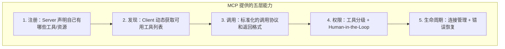

### 12.1.4 MCP vs Function Calling vs LangChain Tool

| 维度   | OpenAI Function Calling | LangChain Tool | MCP                |
| ---- | ----------------------- | -------------- | ------------------ |
| 本质   | LLM 输出格式约束              | 代码里的工具抽象       | 跨进程通信协议            |
| 工具发现 | ❌ 硬编码                   | ❌ 硬编码          | ✅ 运行时 `tools/list` |
| 跨语言  | ❌ 取决于 SDK               | ❌ Python/JS    | ✅ JSON-RPC 语言无关    |
| 独立部署 | ❌ 打包在应用里                | ❌ 打包在应用里       | ✅ Server 独立进程/服务   |
| 生态复用 | ❌ 自己写                   | ⚠️ 社区贡献        | ✅ 标准化生态            |
| 版本兼容 | 跟着 OpenAI API           | 跟着 LangChain   | 有明确版本协商            |

**关键点**：三者不是替代关系，而是分工不同——

    LLM (Function Calling 格式) → LangChain Tool (本地抽象) → MCP Client (跨进程协议) → MCP Server

MCP 是最外层的「连接协议」，LangChain Tool 是应用内的「工具接口」，Function Calling 是 LLM 的「输出格式」。本章的目标就是把这三层串起来。

***

## 12.2 MCP 协议的设计本质

> 第十一章用一节解释了“向量为什么能表示语义”。这一节对应地解释 MCP 的协议本质：它到底靠什么完成跨进程、跨语言的工具调用。


### 12.2.1 为什么选 JSON-RPC 2.0

MCP 底层使用 [JSON-RPC 2.0](https://www.jsonrpc.org/specification) 作为消息格式。这不是随意选择——JSON-RPC 恰好提供了 MCP 需要的三种消息模式：

**1. Request（请求）**：Client → Server，带 `id`，期待 Response

```json
{
  "jsonrpc": "2.0",
  "id": 1,
  "method": "tools/call",
  "params": {
    "name": "analyze_completeness",
    "arguments": { "requirementText": "作为管理员..." }
  }
}
```

**2. Response（响应）**：Server → Client，匹配 `id`

```json
{
  "jsonrpc": "2.0",
  "id": 1,
  "result": {
    "content": [{ "type": "text", "text": "{\"completenessScore\": 67, ...}" }]
  }
}
```

**3. Notification（通知）**：单向消息，无 `id`，不期待回复

```json
{
  "jsonrpc": "2.0",
  "method": "notifications/tools/list_changed"
}
```

这里需要区分几个概念：

*   **REST** 更适合无状态的资源访问，例如 `GET /users/1`、`POST /orders`。它的核心是请求-响应，不擅长描述一条长期连接里的能力协商、状态通知和双向消息。
*   **WebSocket** 解决的是“全双工通信通道”，但它只规定了怎么传消息，并不规定消息内部的请求、响应、错误码、方法名应该如何组织。
*   **JSON-RPC 2.0** 解决的是“消息格式和调用语义”：哪个请求对应哪个响应、方法不存在怎么报错、参数错误怎么表达、通知消息是否需要回复。

MCP 选择 JSON-RPC，是因为它需要的不只是传输通道，而是一套稳定的远程过程调用约定。传输层可以是 stdio，也可以是 HTTP；但消息语义保持一致，Client 和 Server 才能跨语言、跨进程协作。

### 12.2.2 MCP 生命周期状态机

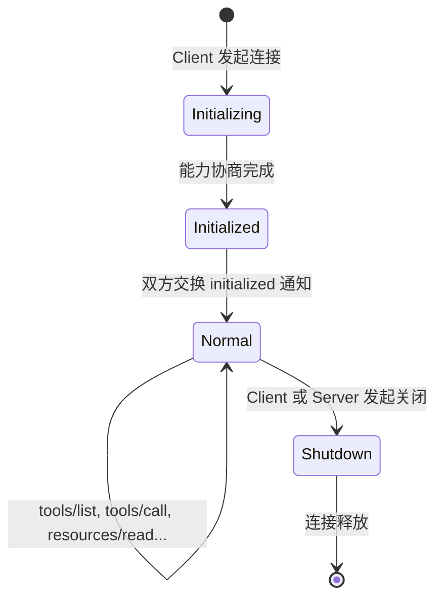

每个阶段的实际报文：

**阶段 1：initialize（能力协商）**

```json
// Client → Server
{
  "jsonrpc": "2.0",
  "id": 1,
  "method": "initialize",
  "params": {
    "protocolVersion": "2025-03-26",
    "capabilities": { "roots": { "listChanged": true } },
    "clientInfo": { "name": "autix-chat", "version": "1.0.0" }
  }
}

// Server → Client
{
  "jsonrpc": "2.0",
  "id": 1,
  "result": {
    "protocolVersion": "2025-03-26",
    "capabilities": {
      "tools": { "listChanged": true },
      "resources": { "subscribe": true }
    },
    "serverInfo": { "name": "requirement-analyzer", "version": "1.0.0" }
  }
}
```

**为什么需要能力协商？** Client 不知道 Server 支持什么（可能只有 Tools 没有 Resources），Server 也不知道 Client 支持什么（可能不支持 sampling）。协商确保双方只使用对方支持的功能。

**阶段 2：initialized（通知）**

```json
// Client → Server（Notification，无 id）
{ "jsonrpc": "2.0", "method": "notifications/initialized" }
```

**阶段 3：Normal（正常交互）**

此时可以发起 `tools/list`、`tools/call`、`resources/list`、`resources/read` 等请求。

**阶段 4：Shutdown**

任意一方可以发起关闭。对于 stdio 传输，关闭 stdin 即可；对于 HTTP 传输，发送关闭请求或断开连接。

### 12.2.3 Session 的两种模式

| 模式  | 描述                       | 传输                                          | 适用场景               |
| --- | ------------------------ | ------------------------------------------- | ------------------ |
| 有状态 | Server 维护 session，记住协商结果 | stdio / Streamable HTTP with Mcp-Session-Id | 需要订阅、需要工具列表变更通知    |
| 无状态 | 每次请求独立，不保持上下文            | Streamable HTTP without session             | 简单查询、Serverless 部署 |

### 12.2.4 版本演进

| 版本         | 时间        | 关键变化                                          |
| ---------- | --------- | --------------------------------------------- |
| 2024-11-05 | 初始版本      | 基础 Tools/Resources/Prompts                    |
| 2025-03-26 | 截至写作时的稳定版 | 新增 Streamable HTTP 传输、annotations、elicitation |
| latest     | 开发中       | OAuth 2.1 集成增强                                |

***

## 12.3 三种核心原语的设计哲学

> 理解 MCP，不能只看接口怎么写，还要看三种原语分别由谁控制。这个控制模型决定了工具、资料和 Prompt 在 Agent 系统中的边界。

MCP 定义了三种核心原语（Primitive）。这里的“原语”可以理解为协议里最基础的能力单元：所有上层功能都由这些能力组合出来。

三种原语的关键区别不在于“长得像不像工具”，而在于**谁决定使用它**：

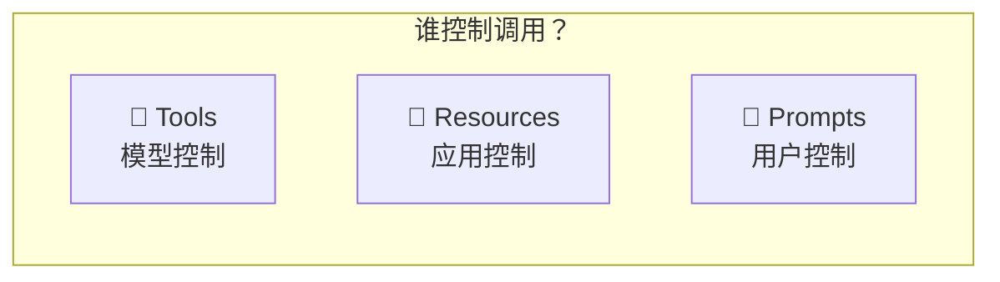

*   **Tools**：模型在推理过程中决定是否调用，适合“执行一个动作”。
*   **Resources**：应用程序决定何时读取，适合“查阅一份资料”。
*   **Prompts**：用户或产品界面决定何时使用，适合“选择一套预定义工作流”。

### 12.3.1 Tools（模型控制）

Tools 是 MCP 最核心的原语——**让 LLM 自主决定调用什么工具、传什么参数**。

**定义结构**：

```json
{
  "name": "analyze_completeness",
  "description": "分析需求描述的完整性...",
  "inputSchema": {
    "type": "object",
    "properties": {
      "requirementText": { "type": "string", "description": "需求描述文本" }
    },
    "required": ["requirementText"]
  },
  "annotations": {
    "readOnlyHint": true,
    "destructiveHint": false,
    "openWorldHint": false
  }
}
```

**关键设计点**：

*   `inputSchema`：标准 JSON Schema，LLM 用它来理解参数结构和约束
*   `annotations`：给 Client 的提示（只读？有破坏性？对外部世界有影响？）
    *   `readOnlyHint: true` → 工具不修改任何状态，可以安全自动调用
    *   `destructiveHint: true` → 工具会修改/删除数据，应当请求用户确认
    *   `openWorldHint: true` → 工具会访问外部网络（如搜索引擎）
    *   说明：以上描述的是各字段为 `true` 时的语义。示例中 `analyze_completeness` 的值为 `false`，因为该工具不访问外网也不修改数据
*   结果格式：`content[]` 数组，每个元素可以是 `text` / `image` / `embedded resource`

**结果示例**：

```json
{
  "content": [
    { "type": "text", "text": "{\"completenessScore\": 67, ...}" }
  ],
  "isError": false
}
```

**`isError` vs 协议错误**：`isError: true` 表示工具执行失败（但协议通信正常），比如“输入的需求文本太短无法分析”。而 JSON-RPC error 表示协议层面的失败，比如“找不到这个工具”。

### 12.3.2 Resources（应用控制）

Resources 是**只读数据源**——由应用（而非 LLM）决定何时读取。

```json
{
  "uri": "requirement://templates/prd",
  "name": "PRD 标准模板",
  "mimeType": "text/markdown"
}
```

**与 Tool 的本质区别**：Tool 是“让模型决定是否执行一个动作”，Resource 是“让应用按自己的流程读取一份资料”。后文 12.3.4 会用一张综合表统一对比 Tool / Resource / Prompt，这里先记住控制者不同即可。

**动态 Resource Templates**：

```json
{
  "uriTemplate": "requirement://projects/{projectId}/requirements",
  "name": "项目需求列表",
  "mimeType": "application/json"
}
```

URI 模板允许参数化资源路径，应用可以根据当前上下文填入 `projectId`。

**订阅更新**：Client 可以订阅 Resource 变更通知——当 PRD 模板更新时，Server 发出 `notifications/resources/updated`。

### 12.3.3 Prompts（用户控制）

Prompts 是 Server 提供的**预定义 Prompt 模板**——由用户（通过 UI）选择使用。

```json
{
  "name": "analyze_requirement",
  "description": "需求分析标准 Prompt",
  "arguments": [
    { "name": "requirementText", "description": "需要分析的需求描述", "required": true }
  ]
}
```

调用后返回一组预构建的消息：

```json
{
  "messages": [
    {
      "role": "user",
      "content": { "type": "text", "text": "请对以下需求进行全面分析：\n..." }
    }
  ]
}
```

**使用场景**：Server 作者是领域专家，他提供的 Prompt 模板比用户自己写的更专业——比如需求分析应该从哪些维度切入，竞品调研应该关注哪些点。

### 12.3.4 三者控制模型对比表

| 原语       | 谁发起        | 谁决策  | 谁确认                  | 典型场景       |
| -------- | ---------- | ---- | -------------------- | ---------- |
| Tool     | LLM 在对话中决定 | 模型自主 | 可选 Human-in-the-Loop | 执行分析、搜索、写入 |
| Resource | 应用代码程序化读取  | 应用逻辑 | 不需要                  | 加载模板、读取配置  |
| Prompt   | 用户在 UI 中选择 | 用户手动 | 用户自己就是确认者            | 选择“深度分析”模板 |

***

## 12.4 从零搭建 MCP Server：需求分析工具

> 前面先把概念讲清楚，从这一节开始进入实现：先写一个最小可运行的 MCP Server，再逐步增加工具、资源和 Prompt。

### 12.4.1 最小可运行版本：一个文件、一个 Tool

**目标**：10 分钟搭建一个最小 MCP Server，只暴露 `analyze_completeness` 一个工具。

```json
{
  "name": "@mcp-servers/requirement-analyzer",
  "version": "1.0.0",
  "type": "module",
  "scripts": {
    "build": "tsc",
    "start": "node dist/index.js",
    "dev": "tsx src/index.ts"
  },
  "dependencies": {
    "@modelcontextprotocol/sdk": "^1.12.0",
    "zod": "^3.24.0"
  }
}
```

核心代码（完整实现在 `mcp-servers/requirement-analyzer/src/index.ts`）：

```tsx
server.tool(
  'analyze_completeness',
  '分析需求描述的完整性，检查是否缺少关键维度（用户角色、功能描述、验收标准、非功能需求等）',
  {
    requirementText: z.string().describe('需求描述文本'),
  },
  async ({ requirementText }) => {
    const dimensions = [
      { name: '用户角色', keywords: ['用户', '角色', '作为', 'PM', '开发', '管理员', '运营'], found: false },
      { name: '功能描述', keywords: ['能够', '可以', '支持', '实现', '功能', '需要', '希望'], found: false },
      { name: '验收标准', keywords: ['验收', '标准', '条件', '期望', '预期结果', '应该', '必须'], found: false },
      { name: '优先级', keywords: ['优先', 'P0', 'P1', 'P2', '紧急', '重要', '高', '低'], found: false },
      { name: '非功能需求', keywords: ['性能', '安全', '可用性', '并发', '响应时间', '可靠', '稳定'], found: false },
      { name: '边界条件', keywords: ['边界', '异常', '限制', '最大', '最小', '超出', '错误', '失败'], found: false },
    ];

    for (const dim of dimensions) {
      dim.found = dim.keywords.some((kw) => requirementText.includes(kw));
    }

    const missing = dimensions.filter((d) => !d.found).map((d) => d.name);
    const covered = dimensions.filter((d) => d.found).map((d) => d.name);
    const score = Math.round((covered.length / dimensions.length) * 100);

    return {
      content: [
        {
          type: 'text' as const,
          text: JSON.stringify(
            {
              completenessScore: score,
              totalDimensions: dimensions.length,
              coveredDimensions: covered,
              missingDimensions: missing,
              suggestion:
                missing.length > 0
                  ? `建议补充以下维度：${missing.join('、')}`
                  : '需求描述较为完整',
            },
            null,
            2,
          ),
        },
      ],
    };
  },
);
```

**启动和验证**：

```bash
cd mcp-servers/requirement-analyzer
bun install
bun run dev
```

Server 通过 stdio 通信——它从 stdin 读取 JSON-RPC 消息，向 stdout 写入响应。你看不到交互式输出（那些诊断信息打到了 stderr）。


*   🧩 生成代码 Prompt：最小 MCP Server

        用 TypeScript + @modelcontextprotocol/sdk 创建一个最小的 MCP Server：

        1. 只暴露一个 tool: analyze_completeness
        2. 输入：requirementText (string)
        3. 逻辑：检查文本是否包含 6 个维度的关键词（用户角色、功能描述、验收标准、优先级、非功能需求、边界条件）
        4. 输出：completenessScore (0-100)、coveredDimensions、missingDimensions、suggestion
        5. 使用 stdio 传输
        6. 用 zod 定义 inputSchema

        文件结构：
        - package.json (type: module, 依赖 @modelcontextprotocol/sdk + zod)
        - tsconfig.json (ESNext, bundler resolution)
        - src/index.ts (全部代码)

📋 **本节配套用例**

```bash
bun test test/chapter12-mcp.spec.ts -t "12.4.1"
```

| 验证点                                                  | 预期 |
| ---------------------------------------------------- | -- |
| 返回标准 `{ content: [{ type: 'text', text: ... }] }` 结构 | ✅  |
| 全维度覆盖时分数为 100                                        | ✅  |


### 12.4.2 加入更多 Tools

在 `analyze_completeness` 的基础上，加入三个工具：

| Tool                    | 功能     | 关键逻辑                          |
| ----------------------- | ------ | ----------------------------- |
| `estimate_complexity`   | 估算复杂度  | 正则匹配复杂因子，加权计分，映射 T-shirt size |
| `check_conflicts`       | 冲突检查   | 提取关键词，计算与现有需求的重叠度             |
| `generate_user_stories` | 生成用户故事 | 提取角色和动作，套用 User Story 模板      |

```tsx
server.tool(
  'estimate_complexity',
  '估算需求的技术复杂度，返回 T-shirt size（S/M/L/XL）和估算依据',
  {
    requirementText: z.string().describe('需求描述文本'),
    techStack: z.string().optional().describe('技术栈（可选，用于更精确的估算）'),
  },
  async ({ requirementText }) => {
    let score = 0;
    const factors: string[] = [];

    if (/集成|对接|第三方|API|接口|外部/.test(requirementText)) {
      score += 3;
      factors.push('涉及外部系统集成');
    }
    if (/迁移|导入|导出|批量|同步|Excel|CSV/.test(requirementText)) {
      score += 2;
      factors.push('涉及数据处理/迁移');
    }
    if (/权限|角色|鉴权|审批|多租户/.test(requirementText)) {
      score += 2;
      factors.push('涉及权限体系');
    }
    if (/实时|推送|WebSocket|通知|消息/.test(requirementText)) {
      score += 2;
      factors.push('涉及实时通信');
    }
    if (/AI|智能|推荐|预测|模型|LLM/.test(requirementText)) {
      score += 3;
      factors.push('涉及 AI/ML 能力');
    }
    if (/加密|安全|合规|审计/.test(requirementText)) {
      score += 1;
      factors.push('有安全合规要求');
    }
    if (requirementText.length > 500) {
      score += 1;
      factors.push('需求描述较长，可能涉及多个子功能');
    }

    const size = score <= 2 ? 'S' : score <= 4 ? 'M' : score <= 6 ? 'L' : 'XL';
    const estimatedDays = { S: '1-3天', M: '3-7天', L: '1-3周', XL: '3周以上' }[size];
    // ...
  },
);
```

*   🧩 生成代码 Prompt：完整 4 工具 Server

        在已有的 MCP Server 基础上，新增三个 tool：

        1. estimate_complexity
           - 输入：requirementText, techStack?(optional)
           - 逻辑：正则匹配复杂因子（集成/权限/实时/AI/安全等），加权计分
           - 输出：size (S/M/L/XL), estimatedDays, complexityScore, factors[]

        2. check_conflicts
           - 输入：newRequirement, existingRequirements (array of {id, title, description})
           - 逻辑：提取关键词，计算与每个现有需求的重叠度，重叠 ≥ 3 关键词则标记冲突
           - 输出：hasConflicts, conflictCount, conflicts[], suggestion

        3. generate_user_stories
           - 输入：requirementText, maxStories?(default 3)
           - 逻辑：用正则提取角色(作为XX)和动作(能够XX)，生成 User Story 格式
           - 输出：stories[] (id, story, acceptanceCriteria[], priority)

        所有工具都在同一个 src/index.ts 文件中。

📋 **本节配套用例**

```bash
bun test test/chapter12-mcp.spec.ts -t "12.4"
```

| 验证点                                 | 预期 |
| ----------------------------------- | -- |
| `estimate_complexity` 简单需求返回 S      | ✅  |
| `estimate_complexity` 复杂需求返回 L 或 XL | ✅  |
| `check_conflicts` 关键词重叠 ≥ 3 时检出冲突   | ✅  |
| `generate_user_stories` 生成符合格式的用户故事 | ✅  |
| `tools/list` 返回 4 个工具               | ✅  |


### 12.4.3 加入 Resources

在同一个 Server 中加入两个 Resource：

```tsx
server.resource('requirement://templates/prd', 'PRD（产品需求文档）标准模板', async () => ({
  contents: [
    {
      uri: 'requirement://templates/prd',
      mimeType: 'text/markdown',
      text: `# PRD: [需求标题]

## 1. 背景与目标
- 业务背景：
- 用户痛点：
- 预期目标：

## 2. 用户角色
| 角色 | 描述 | 核心诉求 |
|------|------|----------|

## 3. 功能需求
### 3.1 核心功能
### 3.2 辅助功能

## 4. 非功能需求
- 性能：
- 安全：
- 可用性：

## 5. 验收标准
- Given [前置条件]
- When [用户操作]
- Then [预期结果]

## 6. 排期与里程碑`,
    },
  ],
}));
```

Resource 是**只读的数据**，应用可以在构建 Prompt 时主动拉取模板内容，而不是让 LLM 决定。

### 12.4.4 加入 Prompts

```tsx
server.prompt(
  'analyze_requirement',
  '需求分析的标准 Prompt 模板，引导 LLM 对一段需求做全面分析',
  { requirementText: z.string().describe('需要分析的需求描述') },
  async ({ requirementText }) => ({
    messages: [
      {
        role: 'user' as const,
        content: {
          type: 'text' as const,
          text: `请对以下需求进行全面分析：

【需求描述】
${requirementText}

请从以下维度分析：
1. 完整性：是否缺少用户角色、功能边界、验收标准、非功能需求？
2. 可行性：技术复杂度如何？有哪些技术风险？
3. 优先级建议：基于业务价值和技术成本给出 P0/P1/P2 建议
4. 拆分建议：如果需求过大，建议如何拆分为可独立交付的子需求？
5. 潜在风险：时间风险、技术风险、依赖风险`,
        },
      },
    ],
  }),
);
```

Server 作者（需求分析领域专家）提供了“应该从哪几个维度分析需求”的标准 Prompt。用户在 UI 中选择后，这段专业 Prompt 会自动注入对话。

### 12.4.5 用 MCP Inspector 调试

MCP 官方提供了 [Inspector](https://modelcontextprotocol.io/docs/tools/inspector) 工具，可以可视化地与 Server 交互：

```bash
npx @modelcontextprotocol/inspector tsx mcp-servers/requirement-analyzer/src/index.ts
```

Inspector 会在浏览器中打开一个 UI，你可以：

*   看到所有注册的 Tools / Resources / Prompts
*   手动填入参数调用工具
*   查看原始 JSON-RPC 消息往返

Inspector 可以理解为 MCP Server 的调试台，作用类似 HTTP 开发中的 Postman：不用先写 Client 代码，就能查看工具列表、填写参数、观察返回结果和原始协议消息。

***

## 12.5 MCP Client：连接与调用

### 12.5.1 Client 生命周期

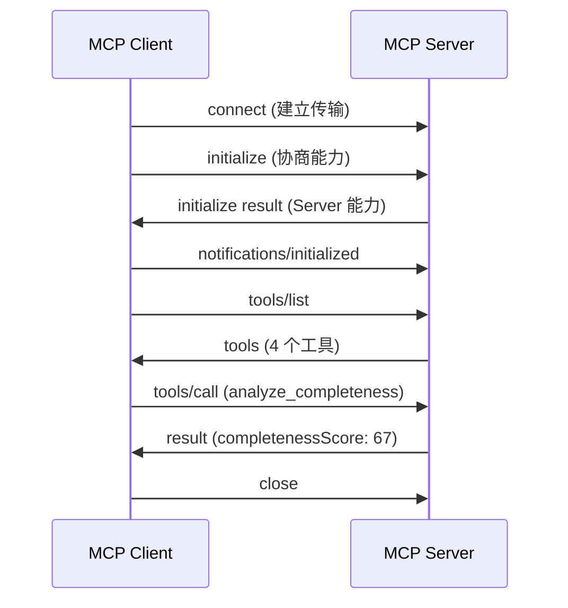

### 12.5.2 最小 Client 实现

```tsx
/**
 * MCP Client Service
 *
 * 封装对单个 MCP Server 的连接、生命周期管理和工具调用。
 * 生命周期：connect → initialize → listTools → callTool → close
 */
import { Client } from '@modelcontextprotocol/sdk/client/index.js';
import { StdioClientTransport } from '@modelcontextprotocol/sdk/client/stdio.js';
import type { Tool, CallToolResult } from '@modelcontextprotocol/sdk/types.js';

export interface MCPClientConfig {
  /** Server 可执行文件的命令 */
  command: string;
  /** 命令参数 */
  args?: string[];
  /** 环境变量 */
  env?: Record<string, string>;
  /** 连接超时（ms） */
  timeout?: number;
}

export class MCPClientService {
  private client: Client;
  private transport: StdioClientTransport | null = null;
  private connected = false;
  private tools: Tool[] = [];
  private readonly config: MCPClientConfig;

  constructor(config: MCPClientConfig) {
    this.config = config;
    this.client = new Client(
      { name: 'autix-chat-client', version: '1.0.0' },
      { capabilities: {} },
    );
  }

  async connect(): Promise<void> {
    if (this.connected) return;

    this.transport = new StdioClientTransport({
      command: this.config.command,
      args: this.config.args,
      env: { ...process.env, ...this.config.env } as Record<string, string>,
    });

    await this.client.connect(this.transport);
    this.connected = true;

    const { tools } = await this.client.listTools();
    this.tools = tools;
  }
```

> 以上代码基于 @modelcontextprotocol/sdk v1.12.x。SDK 仍在快速迭代中，Client 构造函数签名可能随版本变化，建议以实际安装版本的类型定义为准。

**关键设计**：`connect()` 完成后立即 `listTools()` 缓存工具列表。后续调用直接查缓存，无需重复网络请求。

### 12.5.3 MCP Tool → LangChain Tool 桥接器

这是本章最关键的适配层：把 MCP 里运行时发现的工具转换成 LangChain 的 `DynamicStructuredTool`，让 LangGraph Agent 可以像使用本地工具一样调用外部 MCP 工具。

```tsx
/**
 * MCP Tool → LangChain Tool 桥接器
 *
 * 将 MCP Server 暴露的 Tools 动态转换为 LangChain 的 DynamicStructuredTool，
 * 使其可被 LangGraph Agent 直接使用。
 *
 * 核心转换：JSON Schema → Zod Schema，MCP content[] → string
 */
import { DynamicStructuredTool } from '@langchain/core/tools';
import { z, ZodObject, ZodRawShape, ZodTypeAny } from 'zod';
import type { Tool as MCPTool } from '@modelcontextprotocol/sdk/types.js';
import type { MCPClientService } from './mcp-client.service.js';

/**
 * 将 MCP Server 的所有工具转换为 LangChain Tools
 * @param client - 已连接的 MCPClientService 实例
 * @param prefix - 工具名前缀（用于多 Server 去重），如 "req_"
 */
export function bridgeMCPToLangChain(
  client: MCPClientService,
  prefix = '',
): DynamicStructuredTool[] {
  const mcpTools = client.getTools();
  return mcpTools.map((tool) => mcpToolToLangChain(tool, client, prefix));
}

function mcpToolToLangChain(
  tool: MCPTool,
  client: MCPClientService,
  prefix: string,
): DynamicStructuredTool {
  const zodSchema = jsonSchemaToZod(tool.inputSchema as JsonSchemaObject);

  return new DynamicStructuredTool({
    name: `${prefix}${tool.name}`,
    description: tool.description || tool.name,
    schema: zodSchema,
    func: async (args) => {
      const result = await client.callTool(tool.name, args);
      return serializeMCPContent(result.content as MCPContent[]);
    },
  });
}
```

**桥接的三步转换**：

1.  **JSON Schema → Zod**：MCP 用 JSON Schema 描述参数，LangChain 用 Zod。需要运行时转换。
2.  **调用代理**：LangChain 调用 `func(args)` → 内部转为 `client.callTool(name, args)`
3.  **结果序列化**：MCP 返回 `content[]` 数组 → 序列化为 LangChain 期望的 string

**动态工具发现的意义**：Server 新增工具后，Client 下次 `connect()` 自动获取新工具列表，**无需改任何 Client 代码**。这就是 MCP 相对于硬编码工具的核心价值。

桥接层最容易卡在 Schema 转换和结果序列化。下面给出一个最小可用的 `jsonSchemaToZod` 递归转换片段；完整工程可以继续补充 `format`、`oneOf`、`anyOf`、`additionalProperties` 等边界类型：

```tsx
type JsonSchemaObject = {
  type?: string;
  properties?: Record<string, JsonSchemaObject>;
  required?: string[];
  items?: JsonSchemaObject;
  enum?: unknown[];
  description?: string;
};

function jsonSchemaToZod(schema: JsonSchemaObject): ZodTypeAny {
  let zod: ZodTypeAny;

  if (schema.enum?.length) {
    const values = schema.enum.map(String);
    zod = z.enum(values as [string, ...string[]]);
  } else {
    switch (schema.type) {
      case 'string':
        zod = z.string();
        break;
      case 'number':
      case 'integer':
        zod = z.number();
        break;
      case 'boolean':
        zod = z.boolean();
        break;
      case 'array':
        zod = z.array(jsonSchemaToZod(schema.items ?? {}));
        break;
      case 'object': {
        const shape: ZodRawShape = {};
        const required = new Set(schema.required ?? []);
        for (const [key, child] of Object.entries(schema.properties ?? {})) {
          const childZod = jsonSchemaToZod(child);
          shape[key] = required.has(key) ? childZod : childZod.optional();
        }
        zod = z.object(shape);
        break;
      }
      default:
        zod = z.unknown();
    }
  }

  return schema.description ? zod.describe(schema.description) : zod;
}
```

工具结果也需要序列化：LangChain Tool 更适合返回字符串，而 MCP 原始结果是结构化的 `content[]`：

```tsx
function serializeMCPContent(content: MCPContent[]): string {
  return content
    .map((item) => {
      if (item.type === 'text') return item.text;
      if (item.type === 'image') return `[image: ${item.mimeType}]`;
      if (item.type === 'resource') return `[resource: ${item.resource.uri}]`;
      return `[unsupported content: ${item.type}]`;
    })
    .join('\n');
}
```

*   🧩 生成代码 Prompt：MCP Client + 桥接器

        创建 MCP Client 服务和 LangChain 桥接器：

        文件 1: services/chat/src/mcp/mcp-client.service.ts
        - 封装 @modelcontextprotocol/sdk 的 Client
        - 接口 MCPClientConfig: { command, args?, env?, timeout? }
        - MCPClientService 类：connect(), getTools(), callTool(name, args), close(), isConnected()
        - connect 时自动 listTools 缓存

        文件 2: services/chat/src/mcp/mcp-to-langchain.ts
        - bridgeMCPToLangChain(client, prefix?) → DynamicStructuredTool[]
        - jsonSchemaToZod(schema) → ZodObject（处理 string/number/boolean/array/object/optional/enum）
        - 内部 serializeMCPContent：content[] → string（text 类型直接取 text，image 返回 [image: mimeType]）

📋 **本节配套用例**

```bash
bun test test/chapter12-mcp.spec.ts -t "12.5"
```

| 验证点                             | 预期 |
| ------------------------------- | -- |
| JSON Schema → Zod：string 类型正确   | ✅  |
| JSON Schema → Zod：number 类型正确   | ✅  |
| JSON Schema → Zod：optional 字段正确 | ✅  |
| JSON Schema → Zod：array 类型正确    | ✅  |
| JSON Schema → Zod：嵌套 object 正确  | ✅  |
| 桥接后工具数量 = tools/list 数量         | ✅  |


***

## 12.6 传输层：从本地到远程

### 12.6.1 stdio：最简单的传输

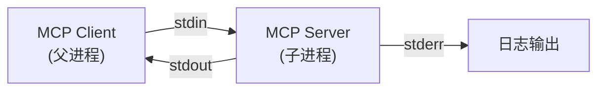

**stdio（standard input / standard output）** 指标准输入和标准输出。它不是网络协议，而是操作系统里最基础的进程通信方式：父进程把消息写入子进程的 stdin，子进程把响应写回 stdout。

在 MCP 场景中，Client 会把 Server 启动成一个子进程，然后通过 stdin/stdout 发送 JSON-RPC 消息。诊断日志应写到 stderr，避免污染 stdout 里的协议消息。

**优势**：零网络配置、无端口冲突、进程隔离，适合本地开发和桌面应用。
**限制**：只能本机使用，不适合多个 Client 共享同一个远程 Server。

```tsx
// Client 侧初始化 stdio 传输
const transport = new StdioClientTransport({
  command: 'tsx',
  args: ['mcp-servers/requirement-analyzer/src/index.ts'],
});
await client.connect(transport);
```

### 12.6.2 Streamable HTTP：生产首选

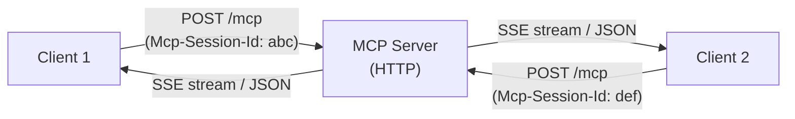

**Streamable HTTP** 是 MCP 当前推荐的远程传输方式。它仍然使用 HTTP 作为基础协议，但允许 Server 根据请求情况返回普通 JSON 响应，或返回一段可持续输出的事件流。

这里的 **SSE（Server-Sent Events）** 可以理解为“服务器向客户端持续推送文本事件”的机制。它常用于长耗时任务、流式输出和服务端通知。

**工作原理**：

*   Client 通过 HTTP POST 发送 JSON-RPC 请求
*   Server 可以返回普通 JSON 响应（同步），也可以返回 SSE 流（异步 / 长耗时）
*   通过 `Mcp-Session-Id` header 维持会话状态
*   多个 Client 可以连接同一个远程 Server

**有状态 vs 无状态模式**：

```tsx
// 有状态：Server 维持 session，支持工具列表变更通知
// 适用于长期运行的 Agent
const transport = new StreamableHTTPClientTransport({
  url: 'https://mcp.example.com/mcp',
});

// 无状态：每次请求独立，适合 Serverless
// Server 不返回 Mcp-Session-Id header
```

**部署架构**：

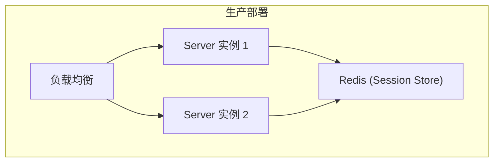

### 12.6.3 SSE（已过时）

早期 MCP 版本使用 Server-Sent Events 作为传输层：Client POST 发起，Server 通过 SSE 推送响应。已被 Streamable HTTP 取代，新项目不推荐使用。

### 12.6.4 Streamable HTTP Server 端最小示例

前面的 `requirement-analyzer` 使用的是 stdio。切到 Streamable HTTP 时，Client 侧只需要换 transport，但 Server 侧也要把 MCP Server 挂到 HTTP endpoint 上。下面是一个最小结构示例：

```tsx
import express from 'express';
import { randomUUID } from 'node:crypto';
import { McpServer } from '@modelcontextprotocol/sdk/server/mcp.js';
import { StreamableHTTPServerTransport } from '@modelcontextprotocol/sdk/server/streamableHttp.js';
import { z } from 'zod';

function createRequirementServer() {
  const server = new McpServer({
    name: 'requirement-analyzer',
    version: '1.0.0',
  });

  server.tool(
    'analyze_completeness',
    '分析需求描述的完整性',
    { requirementText: z.string() },
    async ({ requirementText }) => ({
      content: [
        {
          type: 'text',
          text: JSON.stringify({ length: requirementText.length }),
        },
      ],
    }),
  );

  return server;
}

const app = express();
app.use(express.json());

app.post('/mcp', async (req, res) => {
  const server = createRequirementServer();
  const transport = new StreamableHTTPServerTransport({
    sessionIdGenerator: () => randomUUID(),
  });

  await server.connect(transport);
  await transport.handleRequest(req, res, req.body);
});

app.listen(3000, () => {
  console.error('MCP HTTP server listening on http://localhost:3000/mcp');
});
```

这段代码只展示最小结构：HTTP endpoint 负责接收 JSON-RPC 请求，`StreamableHTTPServerTransport` 负责把 HTTP 请求交给 MCP Server。生产环境还需要补充认证、session 存储、限流、超时和日志。

### 12.6.5 传输切换的代码改动

从 stdio 到 HTTP **只需改 transport 初始化**——其余业务代码完全不变：

```tsx
// 开发环境：stdio
const transport = new StdioClientTransport({
  command: 'tsx',
  args: ['mcp-servers/requirement-analyzer/src/index.ts'],
});

// 生产环境：Streamable HTTP（只改这一处）
const transport = new StreamableHTTPClientTransport({
  url: process.env.MCP_REQUIREMENT_ANALYZER_URL,
});

// 后续代码完全相同
await client.connect(transport);
const { tools } = await client.listTools();
await client.callTool({ name: 'analyze_completeness', arguments: {...} });
```

这是 MCP 传输层抽象的核心价值：**业务逻辑与通信方式解耦**。

***

## 12.7 第二个 MCP Server：网络搜索

### 12.7.1 为什么需求分析需要搜索

在实际需求分析工作中，以下场景需要外部信息：

| 场景   | 需要搜索什么      | 对应工具                    |
| ---- | ----------- | ----------------------- |
| 竞品调研 | 竞品如何实现类似功能  | `search_competitors`    |
| 方案参考 | 行业最佳实践和设计模式 | `search_best_practices` |
| 工期估算 | 类似技术方案的实施经验 | `search_tech_stack`     |

**与第十一章 CRAG 的关联**：回顾 11.9.3 CRAG（Corrective RAG），当 RAG 检索结果质量不够时，会 fallback 到 Web 搜索。这里的 Web Search MCP Server 就是 CRAG “Web 兜底” 路径的**标准化封装**——同样的搜索能力，MCP 化后可以被任意 Agent 复用，不再绑定在某一条 RAG pipeline 里。

### 12.7.2 搭建 Web Search MCP Server

完整代码在 `mcp-servers/web-search/src/index.ts`：

```tsx
server.tool(
  'search_competitors',
  '搜索竞品的相关功能实现，了解市场上类似产品的做法。适用于需求分析时调研竞品如何实现类似功能。',
  {
    query: z.string().describe('搜索关键词，如"Jira 批量导入功能"、"Notion AI 写作助手"'),
    domain: z.string().optional().describe('限定搜索域名，如"atlassian.com"'),
  },
  async ({ query, domain }) => {
    const searchQuery = `${query} product feature implementation`;
    const results = await doSearch(searchQuery, domain);
    return {
      content: [
        {
          type: 'text' as const,
          text: JSON.stringify(
            {
              query,
              mode: IS_MOCK ? 'mock' : 'live',
              results: results.map((r) => ({
                title: r.title,
                snippet: r.snippet,
                url: r.url,
              })),
              summary: results.length > 0
                ? `找到${results.length} 个竞品参考，涵盖：${results.map((r) => r.title).join('、')}`
                : '未找到相关竞品信息',
            },
            null,
            2,
          ),
        },
      ],
    };
  },
);
```

### 12.7.3 Mock 模式设计

```tsx
const TAVILY_API_KEY = process.env.TAVILY_API_KEY;
const IS_MOCK = !TAVILY_API_KEY;
```

**设计原则**：无 API Key 时自动降级为 Mock 模式，返回预置结果，让读者无需注册第三方服务也能跑通完整流程。Mock 数据覆盖批量导入、权限设计、实时通信等常见场景，保证测试和学习过程不依赖外部网络。

生产环境配置 `TAVILY_API_KEY` 后自动切换为真实搜索。

### 12.7.4 底层搜索实现

```tsx
async function tavilySearch(query: string, domain?: string): Promise<SearchResult[]> {
  const body: Record<string, unknown> = {
    query,
    max_results: 5,
    search_depth: 'basic',
  };
  if (domain) {
    body.include_domains = [domain];
  }

  const res = await fetch('https://api.tavily.com/search', {
    method: 'POST',
    headers: {
      'Content-Type': 'application/json',
    },
    body: JSON.stringify({ ...body, api_key: TAVILY_API_KEY }),
  });

  if (!res.ok) {
    // 降级到 mock
    return getMockResults(query);
  }
  // ...
}
```

*   🧩 生成代码 Prompt：Web Search MCP Server

        创建一个 Web Search MCP Server：

        位置：mcp-servers/web-search/
        结构：package.json + tsconfig.json + src/index.ts

        三个工具：
        1. search_competitors(query, domain?) - 搜索竞品功能
        2. search_best_practices(topic, industry?) - 搜索最佳实践
        3. search_tech_stack(technology, useCase?) - 搜索技术选型

        底层实现：
        - 有 TAVILY_API_KEY 环境变量时调用 Tavily Search API
        - 无 API Key 时自动降级为 Mock 模式，返回预置结果
        - Mock 数据覆盖：批量导入、权限设计、实时通信三个场景
        - 每个 mock 结果包含 title, snippet, url

        使用 stdio 传输，依赖 @modelcontextprotocol/sdk + zod。

📋 **本节配套用例**

```bash
bun test test/chapter12-mcp.spec.ts -t "12.7"
```

| 验证点                                          | 预期 |
| -------------------------------------------- | -- |
| mock 模式返回预置结果                                | ✅  |
| `search_competitors` 批量导入查询返回 Jira/Linear 参考 | ✅  |
| `search_best_practices` 权限设计返回 RBAC 参考       | ✅  |
| `search_tech_stack` WebSocket 返回技术对比         | ✅  |
| `tools/list` 返回 3 个工具                        | ✅  |


***

## 12.8 多 Server 编排与协同

### 12.8.1 MCPManager

一个真实 Agent 往往不会只连接一个 MCP Server。需求分析 Server 负责业务分析，Web Search Server 负责外部搜索，后续还可能接入 Jira、GitHub、数据库或内部 RAG 服务。

这时就需要一个统一管理层。本文把它称为 **MCPManager**：它不是 MCP 官方协议的一部分，而是本项目为了管理多个 Server 连接而实现的工程组件。

```tsx
/**
 * MCP Manager
 *
 * 统一管理多个 MCP Server 连接，提供：
 * - 工具命名空间隔离（前缀策略）
 * - 按需连接 / 启动时预连接
 * - 降级策略：Server 不可用时回退本地工具
 * - 所有工具的聚合列表
 */
import { DynamicStructuredTool } from '@langchain/core/tools';
import { MCPClientService, MCPClientConfig } from './mcp-client.service.js';
import { bridgeMCPToLangChain } from './mcp-to-langchain.js';

export interface ServerRegistration {
  id: string;
  config: MCPClientConfig;
  prefix?: string;
  /** 连接失败时的降级工具 */
  fallbackTools?: DynamicStructuredTool[];
}

export class MCPManager {
  private servers = new Map<string, MCPClientService>();
  private registrations: ServerRegistration[] = [];
  private tools: DynamicStructuredTool[] = [];

  register(registration: ServerRegistration): void {
    this.registrations.push(registration);
  }

  async connectAll(): Promise<void> {
    const results = await Promise.allSettled(
      this.registrations.map((reg) => this.connectOne(reg)),
    );
    // 连接失败的 Server 使用 fallbackTools 降级...
  }
```

### 12.8.2 工具命名空间策略

当多个 Server 有同名工具时（比如两个 Server 都有 `search`），需要命名隔离：

```tsx
manager.register({
  id: 'requirement',
  config: { command: 'tsx', args: ['mcp-servers/requirement-analyzer/src/index.ts'] },
  prefix: 'req_',  // → req_analyze_completeness, req_estimate_complexity
});

manager.register({
  id: 'websearch',
  config: { command: 'tsx', args: ['mcp-servers/web-search/src/index.ts'] },
  prefix: 'ws_',   // → ws_search_competitors, ws_search_best_practices
});
```

**前缀策略**保证了：

*   LLM 看到的工具名全局唯一
*   工具名携带来源信息，方便调试
*   不同 Server 可以独立命名，互不干扰

### 12.8.3 实战组合：三 Server 协同

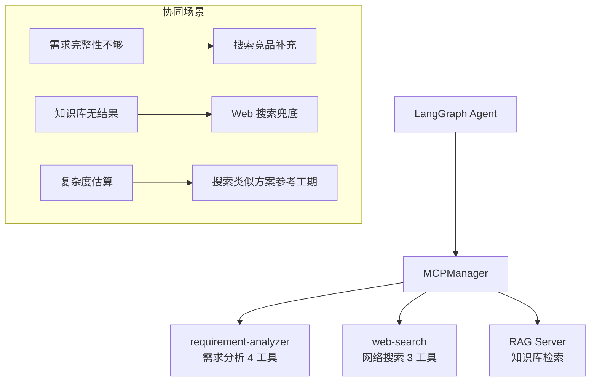

**典型协同流程**：

1.  用户提交需求 → Agent 调用 `req_analyze_completeness` → 发现缺少“验收标准”
2.  Agent 调用 `ws_search_competitors` → 搜索竞品如何定义类似功能的验收标准
3.  Agent 调用 `req_estimate_complexity` → 结合搜索结果给出复杂度评估

📋 **本节配套用例**

```bash
bun test test/chapter12-mcp.spec.ts -t "12.8"
```

| 验证点                | 预期 |
| ------------------ | -- |
| 两个 Server 工具列表正确合并 | ✅  |
| 合计 7 个工具（4 + 3）    | ✅  |


***

## 12.9 错误处理与韧性

MCP 把工具调用从“本地函数调用”变成了“跨进程 / 跨网络调用”。这意味着故障类型会变多：Server 可能启动失败，连接可能断开，参数可能不合法，工具执行可能超时，远程服务也可能返回 500。

这里的 **韧性（resilience）**，指系统在部分组件失败时仍能继续工作的能力。对 MCP 来说，韧性主要包括三件事：错误可分类、调用可重试、服务不可用时可降级。

### 12.9.1 JSON-RPC 标准错误码

| 错误码    | 含义               | 常见原因                 |
| ------ | ---------------- | -------------------- |
| -32700 | Parse error      | 发送的不是合法 JSON         |
| -32600 | Invalid Request  | 缺少 jsonrpc/method 字段 |
| -32601 | Method not found | 调用了不存在的方法            |
| -32602 | Invalid params   | 参数类型/格式错误            |
| -32603 | Internal error   | Server 内部异常          |

### 12.9.2 Client 重试策略

下面这段属于**调用层**：单次工具调用失败时，判断错误是否可重试，并用指数退避重试。

```tsx
async function callToolWithRetry(
  client: MCPClientService,
  name: string,
  args: Record<string, unknown>,
  options = { maxRetries: 3, baseDelay: 1000 }
): Promise<CallToolResult> {
  for (let attempt = 0; attempt <= options.maxRetries; attempt++) {
    try {
      return await client.callTool(name, args);
    } catch (err: any) {
      if (attempt === options.maxRetries) throw err;
      // 不可重试的错误
      if (err.code === -32601 || err.code === -32602) throw err;
      // 指数退避
      const delay = options.baseDelay * Math.pow(2, attempt);
      await new Promise((r) => setTimeout(r, delay));
    }
  }
  throw new Error('unreachable');
}
```

**重试策略要点**：

*   **不可重试**：`Method not found`、`Invalid params`（参数错误重试不会好转）
*   **可重试**：`Internal error`、网络超时、连接断开
*   **退避策略**：指数退避（1s → 2s → 4s），避免雪崩

### 12.9.3 Server 崩溃恢复

下面这段属于**连接管理层**：不是重试某一次 `tools/call`，而是在 MCP Server 进程或连接断开后，由 `MCPManager` 负责重连或切换到 fallback 工具。

```tsx
// MCPManager 中的自动重连逻辑
private async connectOne(reg: ServerRegistration): Promise<void> {
  const client = new MCPClientService(reg.config);

  client.onDisconnect(async () => {
    console.error(`[MCPManager] Server "${reg.id}" disconnected, reconnecting...`);
    try {
      await client.connect();
      console.error(`[MCPManager] Server "${reg.id}" reconnected`);
    } catch {
      console.error(`[MCPManager] Server "${reg.id}" reconnect failed, using fallback`);
      // 切换到降级工具
    }
  });

  await client.connect();
}
```

### 12.9.4 降级策略

```tsx
manager.register({
  id: 'websearch',
  config: { command: 'tsx', args: ['mcp-servers/web-search/src/index.ts'] },
  prefix: 'ws_',
  fallbackTools: [
    // MCP Server 不可用时，使用本地硬编码的工具
    new DynamicStructuredTool({
      name: 'ws_search_competitors',
      description: '搜索竞品（降级模式：返回提示信息）',
      schema: z.object({ query: z.string() }),
      func: async () => '搜索服务暂时不可用，建议稍后重试或手动搜索',
    }),
  ],
});
```

**降级策略原则**：MCP 不可用时，Agent 不应该卡死——应返回“服务暂时不可用”的清晰提示，让 LLM 可以跳过这个步骤继续分析。

📋 **本节配套用例**

```bash
bun test test/chapter12-mcp.spec.ts -t "12.9"
```

| 验证点               | 预期 |
| ----------------- | -- |
| 调用不存在的工具返回错误（不崩溃） | ✅  |


***

## 12.10 安全模型

工具一旦可以访问外部系统，就必须讨论安全。MCP Server 可能读取内部文档，也可能写入项目管理系统、调用数据库、触发审批流。协议本身提供了能力声明和 annotations，但真正的安全边界仍然要由 Host 和业务系统共同控制。

本节会用三个概念组织安全模型：

*   **信任边界**：哪些组件可以信任，哪些组件只能有限信任。
*   **Human-in-the-Loop**：高风险操作前让用户确认，避免模型自动执行破坏性动作。
*   **Prompt 注入防护**：把外部返回内容当作不可信数据处理，避免它反向操控模型行为。

### 12.10.1 信任边界三层模型

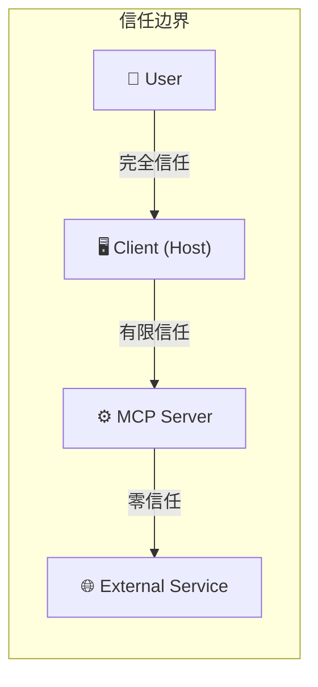

*   **User → Client**：用户信任自己安装的应用
*   **Client → Server**：Client 不盲目执行 Server 返回的所有内容
*   **Server → External**：Server 应验证外部服务的响应

### 12.10.2 工具权限分级

```tsx
type PermissionLevel = 'read' | 'write' | 'admin';

const toolPermissions: Record<string, PermissionLevel> = {
  // 只读工具：可安全自动调用
  analyze_completeness: 'read',
  estimate_complexity: 'read',
  check_conflicts: 'read',
  search_competitors: 'read',
  search_best_practices: 'read',

  // 写入工具：需要用户确认
  create_requirement: 'write',
  update_requirement: 'write',

  // 管理员工具：需要强确认
  delete_requirement: 'admin',
  purge_all_data: 'admin',
};

function requiresConfirmation(toolName: string): boolean {
  const level = toolPermissions[toolName];
  return level === 'write' || level === 'admin';
}
```

### 12.10.3 Human-in-the-Loop

对于写操作，在 Agent 执行前请求用户确认：

```tsx
// LangGraph 中的 interrupt 机制（回顾第九章）
if (requiresConfirmation(toolCall.name)) {
  // 暂停 Agent，向用户展示即将执行的操作
  return interrupt({
    action: toolCall.name,
    params: toolCall.args,
    message: `即将执行${toolCall.name}，是否确认？`,
  });
}
```

### 12.10.4 Prompt 注入防护

Server 返回的内容可能被注入恶意指令。防护策略：

1.  **内容清洗**：移除 Server 返回中的可疑指令（如 “ignore previous instructions”）
2.  **角色隔离**：Server 返回内容标记为 `tool_result`，不混入 `system` role
3.  **输出长度限制**：防止 Server 返回超长内容挤占上下文

### 12.10.5 OAuth 2.1 授权流程（Remote Server）

对于远程部署的 MCP Server（如公司内部的 Jira MCP Server），MCP 规范定义了 OAuth 2.1 授权流程：

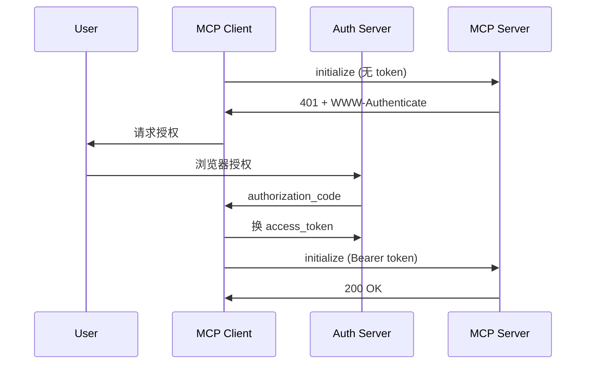

> 以上流程简化为 HTTP 语义展示。实际实现中，MCP 远程 Server 的认证错误可能在 JSON-RPC 层面返回，具体需参考 MCP 授权规范。

📋 **本节配套用例**

```bash
bun test test/chapter12-mcp.spec.ts -t "12.10"
```

| 验证点          | 预期 |
| ------------ | -- |
| read 工具不需要确认 | ✅  |
| write 工具需要确认 | ✅  |
| admin 工具需要确认 | ✅  |


***

## 12.11 测试策略

### 12.11.1 两层测试架构

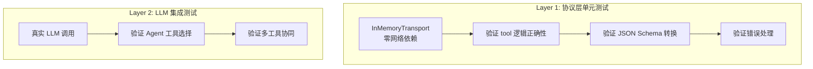

### 12.11.2 Layer 1：InMemoryTransport

MCP SDK 提供 `InMemoryTransport.createLinkedPair()` 用于测试——创建一对互联的内存传输，Server 和 Client 在同一进程中通过内存通信：

```tsx
import { InMemoryTransport } from '@modelcontextprotocol/sdk/inMemory.js';

const [clientTransport, serverTransport] = InMemoryTransport.createLinkedPair();

// Server 用 serverTransport
await server.connect(serverTransport);

// Client 用 clientTransport
await client.connect(clientTransport);

// 现在 client.callTool() 会通过内存直达 server
```

**优势**：

*   无进程启动开销（毫秒级）
*   无端口/网络依赖
*   可以在 CI 中稳定运行
*   方便验证纯逻辑（不混入传输层问题）

### 12.11.3 Layer 2：LLM 集成测试

```tsx
// chapter12-mcp-llm.spec.ts
it('Agent 收到"分析需求完整性" → 选择 analyze_completeness', async () => {
  const agent = createReactAgent({ llm, tools });
  const result = await agent.invoke({
    messages: [new HumanMessage('请分析这个需求的完整性：作为管理员...')],
  });

  const toolCalls = result.messages
    .filter((m) => m.tool_calls?.length > 0)
    .flatMap((m) => m.tool_calls.map((tc) => tc.name));

  expect(toolCalls).toContain('analyze_completeness');
});
```

**运行方式**：

```bash
# Layer 1：无需任何 API Key
bun test test/chapter12-mcp.spec.ts

# Layer 2：需要 OPENAI_API_KEY
OPENAI_API_KEY=sk-... bun test test/chapter12-mcp-llm.spec.ts
```

### 12.11.4 MCP Inspector 验证

对于手动验证和探索性测试，MCP Inspector 比自动化测试更直观：

```bash
# 启动 Inspector 连接需求分析 Server
npx @modelcontextprotocol/inspector tsx mcp-servers/requirement-analyzer/src/index.ts

# 启动 Inspector 连接搜索 Server
npx @modelcontextprotocol/inspector tsx mcp-servers/web-search/src/index.ts
```


*   🧩 生成代码 Prompt：测试文件

        为第十二章创建两个测试文件：

        文件 1: services/chat/test/chapter12-mcp.spec.ts (Layer 1 协议层)
        - 用 InMemoryTransport 模拟 Server+Client
        - 按章节组织 describe (12.4, 12.5, 12.7, 12.8, 12.9, 12.10)
        - 测试工具逻辑、JSON Schema→Zod 转换、多 Server 合并、错误处理、权限分级
        - 零网络依赖，bun:test

        文件 2: services/chat/test/chapter12-mcp-llm.spec.ts (Layer 2 LLM 集成)
        - 需要 OPENAI_API_KEY，无 key 时 skip
        - 用 createReactAgent + 真实 LLM 验证
        - 测试：Agent 能否自主选择正确的 MCP 工具
        - 测试：多工具协同场景（analyze + search + estimate）

📋 **完整测试运行**

```bash
# 运行所有 Layer 1 测试
bun test test/chapter12-mcp.spec.ts

# 运行指定章节
bun test test/chapter12-mcp.spec.ts -t "12.4.1"
bun test test/chapter12-mcp.spec.ts -t "12.5"
bun test test/chapter12-mcp.spec.ts -t "12.7"
```

***

## 12.12 可观测性与 Token 经济学

第十章已经讨论过 Token 成本，第十一章也强调了 RAG Trace。本章接入 MCP 后，可观测性需要继续向工具调用层下沉：不仅要知道 LLM 花了多少 token，还要知道它调用了哪个 Server、哪个工具、耗时多久、是否失败、返回内容有多长。

这里的 **Trace** 可以理解为一次调用的“流水账”。它不只是日志，更是后续排障、评估和成本优化的基础数据。

### 12.12.1 MCP 调用的 Trace 结构

每次 MCP 工具调用应产生一条 trace：

```tsx
interface MCPCallTrace {
  traceId: string;
  serverId: string;
  toolName: string;
  startTime: number;
  endTime: number;
  latencyMs: number;
  inputArgs: Record<string, unknown>;
  outputSize: number;      // 返回内容的字符数
  isError: boolean;
  errorCode?: number;
  transport: 'stdio' | 'http';
}
```

### 12.12.2 与第十章 Token 成本采集的协同

回顾第十章的 Token 经济学，MCP 工具调用影响成本的环节：

| 环节                  | Token 消耗             | 优化策略                |
| ------------------- | -------------------- | ------------------- |
| 工具描述（system prompt） | 每个工具 \~50-100 tokens | 只加载当前需要的 Server 的工具 |
| 工具参数（LLM 输出）        | 取决于参数复杂度             | 简化 inputSchema 描述   |
| 工具结果（注入上下文）         | 取决于返回内容长度            | Server 端控制返回大小      |

**实际计算**：假设连接 3 个 Server 共 7 个工具，每个工具描述 \~80 tokens：

*   工具描述开销：7 × 80 = 560 tokens/轮
*   对比第十章预算：如果轮次预算 4000 tokens，工具描述占 14%

**优化策略**：

*   按需连接：只连接当前对话主题相关的 Server
*   描述压缩：tool description 用最精简的文字
*   结果摘要：Server 返回过长时截断或摘要

### 12.12.3 监控指标

| 指标         | 告警阈值             | 含义                  |
| ---------- | ---------------- | ------------------- |
| 工具调用延迟 P95 | \> 5s            | Server 响应慢          |
| 工具错误率      | \> 5%            | Server 不稳定          |
| 连接失败率      | \> 10%           | 网络/Server 进程问题      |
| 工具未使用率     | \> 80% 未被 LLM 选择 | 工具描述不够清晰，LLM 不知道何时用 |

***

## 12.13 集成 LangGraph Agent（完整实战）

> 前面已经完成 Server、Client、桥接、多 Server 管理和安全策略。现在把这些部分接回第九章的 LangGraph Agent，形成一条完整链路。

### 12.13.1 目标架构


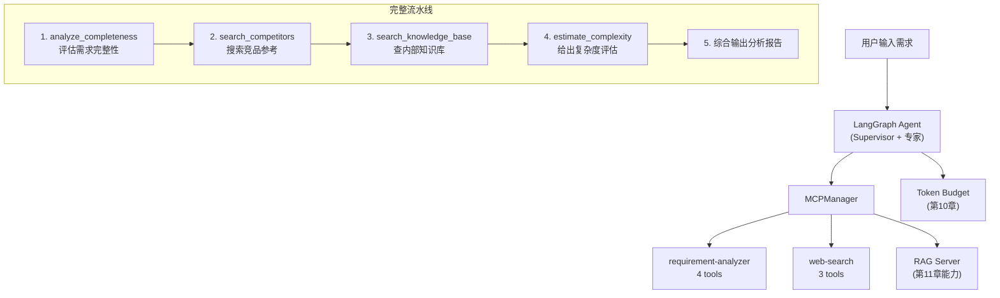

### 12.13.2 注入 MCP 工具到专家系统

回顾第九章的 Supervisor + 专家架构，现在用 MCP 替代硬编码工具。核心变化不是“换一个工具实现”，而是把工具来源从**编译时固定**改成**运行时发现**。

在第九章里，功能专家拿到的是本地写死的 `readFeatureSpecTool`、`loadPerfBaselineTool`。这一章里，功能专家拿到的是 MCPManager 聚合后的工具列表。Agent 不需要知道工具来自哪个进程、哪个服务、哪种传输方式，只需要按 LangChain Tool 的接口调用即可。

```tsx
import { MCPManager } from '../mcp/mcp-manager.js';
import { createReactAgent } from '@langchain/langgraph/prebuilt';

// 初始化 MCPManager
const manager = new MCPManager();

manager.register({
  id: 'requirement',
  config: { command: 'tsx', args: ['mcp-servers/requirement-analyzer/src/index.ts'] },
  prefix: 'req_',
});

manager.register({
  id: 'websearch',
  config: { command: 'tsx', args: ['mcp-servers/web-search/src/index.ts'] },
  prefix: 'ws_',
});

await manager.connectAll();

// 获取所有 MCP 工具
const mcpTools = manager.getTools();

// 创建功能专家 Agent，注入 MCP 工具
const featureExpert = createReactAgent({
  llm: model,
  tools: mcpTools,
  prompt: `你是一个需求分析专家。你可以使用以下工具：
    - req_analyze_completeness: 分析需求完整性
    - req_estimate_complexity: 估算复杂度
    - req_check_conflicts: 检查冲突
    - req_generate_user_stories: 生成用户故事
    - ws_search_competitors: 搜索竞品
    - ws_search_best_practices: 搜索最佳实践
    - ws_search_tech_stack: 搜索技术方案参考
    根据用户的需求，自主决定调用哪些工具，并给出完整的分析报告。`,
});
```

这段代码需要关注三点：

1.  **工具注册前置到 MCPManager**：Agent 不再直接依赖某个工具文件，而是依赖统一的工具管理层。
2.  **工具名前缀保持全局唯一**：`req_` 表示需求分析 Server，`ws_` 表示 Web Search Server，避免多个 Server 都有 `search`、`analyze` 这类重名工具。
3.  **Agent 只感知 LangChain Tool**：桥接层已经把 MCP Tool 转成 `DynamicStructuredTool`，所以 LangGraph 不需要理解 MCP 协议细节。

**对比之前**：

| 维度    | 第九章硬编码工具          | 第十二章 MCP 工具             |
| ----- | ----------------- | ----------------------- |
| 工具来源  | 项目代码内             | 独立 MCP Server           |
| 新增工具  | 改代码、重新部署 Agent    | Server 增加工具，Client 重新发现 |
| 跨项目复用 | 复制工具文件            | 多个 Agent 连接同一个 Server   |
| 故障隔离  | 工具异常可能拖垮主进程       | Server 可独立降级、重连、替换      |
| 团队边界  | 所有工具跟着 Agent 团队维护 | 工具 Server 可由业务团队独立维护    |

### 12.13.3 接入第九章专家工具池

更贴近第九章项目结构的接入方式，是把 MCP 工具和原有专家工具合并到同一个工具池里。这样可以逐步迁移，而不是一次性替换掉所有本地工具。

```tsx
// services/chat/src/llm/graph/experts.ts（示例）
export async function buildFunctionalExpertTools(deps: {
  model: BaseChatModel;
  userId: string;
}) {
  const manager = new MCPManager();

  manager.register({
    id: 'requirement',
    config: {
      command: 'tsx',
      args: ['mcp-servers/requirement-analyzer/src/index.ts'],
    },
    prefix: 'req_',
    fallbackTools: [localAnalyzeCompletenessTool],
  });

  manager.register({
    id: 'websearch',
    config: {
      command: 'tsx',
      args: ['mcp-servers/web-search/src/index.ts'],
    },
    prefix: 'ws_',
    fallbackTools: [localSearchUnavailableTool],
  });

  await manager.connectAll();

  return [
    // 第九章已有本地工具
    readRequirementTool,
    checkExistingFeaturesTool,
    loadPerfBaselineTool,

    // 第十一章 RAG 工具
    createRagTool({ model: deps.model, userId: deps.userId }),

    // 第十二章 MCP 工具
    ...manager.getTools(),
  ];
}
```

这种“本地工具 + RAG 工具 + MCP 工具”的混合模式，更适合真实项目迁移：

*   **已有稳定工具** 不必马上拆成 MCP Server
*   **需要复用 / 独立部署的工具** 优先 MCP 化
*   **外部服务型能力**（Jira、GitHub、Figma、搜索、数据库）优先用 MCP 封装
*   **核心业务强依赖工具** 可以保留本地 fallback，保证 MCP Server 不可用时系统仍能工作

### 12.13.4 三 Server 协同场景

现在功能专家可以同时使用三个来源的能力：

1.  `requirement-analyzer`：需求完整性、复杂度、冲突、用户故事
2.  `web-search`：竞品、最佳实践、技术方案搜索
3.  `rag-server`：内部知识库检索，也就是第十一章的 RAG 能力

这三类工具的定位并不一样：

| Server / 工具来源     | 回答什么问题         | 典型工具                                                 |
| ----------------- | -------------- | ---------------------------------------------------- |
| 需求分析 Server       | “这条需求本身写得怎么样？” | `req_analyze_completeness`、`req_estimate_complexity` |
| Web Search Server | “外部世界有没有参考做法？” | `ws_search_competitors`、`ws_search_best_practices`   |
| RAG Server        | “我们内部已有资料怎么说？” | `search_knowledge_base`                              |

**场景 1：需求完整性不够 → 搜索竞品补充**

    用户：分析这个需求 “支持批量导入功能”

    Agent：
      1. 调用 req_analyze_completeness
         → 得分 33%，缺少验收标准、非功能需求、边界条件

      2. 调用 ws_search_competitors("批量导入功能")
         → 获得 Jira / Linear / Airtable 的批量导入实现参考

      3. 调用 req_generate_user_stories
         → 生成用户故事和验收条件草案

      4. 综合输出：
         - 当前需求缺口
         - 竞品参考
         - 建议补充的验收标准
         - 可拆分的用户故事

**场景 2：内部知识库无结果 → Web 搜索兜底**

    用户：我们的安全策略文档里有没有关于 API 限流的规范？

    Agent：
      1. 调用 search_knowledge_base("API 限流 安全策略")
         → 内部知识库无相关结果

      2. 调用 ws_search_best_practices("API rate limiting")
         → 获得行业最佳实践：令牌桶、漏桶、按用户/租户限流、429 返回等

      3. 输出：
         - 内部资料未命中
         - 外部最佳实践参考
         - 建议补充内部安全规范章节

**场景 3：复杂度估算 → 搜索类似方案参考工期**

    用户：评估这个需求的复杂度 “对接第三方支付系统，支持微信/支付宝”

    Agent：
      1. 调用 req_estimate_complexity
         → XL（外部集成 + 安全合规 + 异常处理）

      2. 调用 ws_search_tech_stack("第三方支付集成")
         → 获得类似方案的常见工期和风险点

      3. 调用 search_knowledge_base("支付系统 对接 经验")
         → 查询内部历史项目有没有类似实现

      4. 输出：
         - 复杂度 T-shirt size
         - 主要技术风险
         - 内外部参考依据
         - 初步排期建议

**场景 4：冲突检查 → 内部知识 + 现有需求比对**

    用户：新增一个“管理员可批量删除用户”的需求，看看有没有冲突。

    Agent：
      1. 调用 search_knowledge_base("用户删除 权限 审计")
         → 找到内部安全规范：删除用户必须保留审计日志

      2. 调用 req_check_conflicts
         → 和现有“用户禁用 / 恢复”需求存在重叠

      3. 输出：
         - 与现有需求的重叠点
         - 与安全规范的冲突点
         - 建议改成“软删除 / 禁用”并保留审计链路

***

## 12.14 RAG-as-MCP-Server：把第十一章能力服务化

第十一章实现的 RAG 能力，也可以从 LangChain Tool 进一步升级为 MCP Server。

这样做的意义是：RAG 不再只是某个 Agent 内部的一个工具，而是一个可被多个客户端复用的标准服务。Cursor、Claude Desktop、内部运维 Agent、需求分析 Agent，都可以连接同一个 RAG MCP Server。

```tsx
// mcp-servers/rag-server/src/index.ts
server.tool(
  'search_knowledge_base',
  '搜索内部知识库（基于 RAG），检索与问题相关的业务文档。适用于查询内部规范、产品文档、历史决策、技术方案。',
  {
    query: z.string().describe('搜索问题，应当是自然语言完整问句'),
    topK: z.number().optional().describe('返回结果数量，默认 5'),
  },
  async ({ query, topK = 5 }) => {
    const results = await ragPipeline.search(query, { topK });

    return {
      content: [
        {
          type: 'text' as const,
          text: JSON.stringify(
            {
              query,
              results: results.map((r) => ({
                content: r.content,
                source: r.metadata.source,
                documentId: r.metadata.documentId,
                chunkId: r.metadata.chunkId,
                score: r.score,
              })),
            },
            null,
            2,
          ),
        },
      ],
    };
  },
);
```

进一步，也可以暴露一个生成式工具：

```tsx
server.tool(
  'answer_with_knowledge_base',
  '基于内部知识库回答问题，并返回引用来源。适用于需要按内部资料给出最终答案的场景。',
  {
    question: z.string().describe('用户问题'),
    topK: z.number().optional().describe('检索结果数量，默认 5'),
  },
  async ({ question, topK = 5 }) => {
    const result = await ragAsk({
      question,
      topK,
      model,
    });

    return {
      content: [
        {
          type: 'text' as const,
          text: JSON.stringify(
            {
              answer: result.answer,
              citations: result.citations,
            },
            null,
            2,
          ),
        },
      ],
    };
  },
);
```

这两个工具的职责不同：

| 工具                           | 返回什么             | 适合谁用            |
| ---------------------------- | ---------------- | --------------- |
| `search_knowledge_base`      | 检索到的 chunk + 元信息 | 需要自己综合判断的 Agent |
| `answer_with_knowledge_base` | 已经生成好的答案 + 引用    | 只需要最终回答的客户端     |

工程上推荐先暴露 `search_knowledge_base`，让上层 Agent 负责综合。因为多 Agent 系统往往需要把 RAG 结果和其他工具结果一起推理，如果 RAG Server 直接生成最终答案，反而可能让职责边界变模糊。

***

## 12.15 与预算、权限和可观测性的协同

把 MCP 工具接入 Agent 后，不代表可以无条件调用。真实系统还要把第十章的 Token 预算、第十一章的 RAG 权限过滤，以及本章的 MCP trace 串起来。


**(1) 预算协同**

MCP 工具本身不一定消耗 LLM Token，但它会影响 Agent 的上下文：

*   工具描述会进入模型上下文
*   工具参数由模型生成
*   工具结果会作为上下文再喂回模型
*   RAG-as-MCP-Server 内部可能再次调用 LLM

因此，MCPManager 可以在返回工具列表前做按需裁剪。这里不再重复 12.12.2 的 Token 成本公式，只保留工程落点：

```tsx
function selectToolsForIntent(intent: string, allTools: DynamicStructuredTool[]) {
  if (intent === 'requirement_review') {
    return allTools.filter((t) =>
      t.name.startsWith('req_') ||
      t.name.startsWith('ws_') ||
      t.name === 'search_knowledge_base'
    );
  }

  if (intent === 'smalltalk') {
    return [];
  }

  return allTools;
}
```

这样可以避免每轮对话都把全部工具描述塞进 system prompt，降低第十章提到的上下文膨胀问题。

**(2) 权限协同**

MCP Server 暴露能力，不等于所有用户都能调用。权限应分两层：

1.  **Host 层权限**：当前用户是否允许使用某个 Server / Tool
2.  **业务数据权限**：工具内部检索或操作数据时，是否按 `userId`、`workspaceId`、`teamId` 做过滤

```tsx
async function guardedCallTool(input: {
  userId: string;
  toolName: string;
  args: Record<string, unknown>;
}) {
  const allowed = await permissionService.canUseTool(input.userId, input.toolName);
  if (!allowed) {
    return {
      error: 'permission_denied',
      message: `当前用户无权调用工具 ${input.toolName}`,
    };
  }

  return manager.callTool(input.toolName, input.args);
}
```

尤其是 RAG-as-MCP-Server，必须继承第十一章强调过的权限过滤原则：**不能先检索全库，再让模型“不要回答无权限内容”**。权限过滤必须发生在检索阶段。

**(3) 可观测性协同**

可观测性字段以 12.12 的 `MCPCallTrace` 为主，不在集成章节重新定义一套结构。Agent 层只需要把同一轮请求里的多次 MCP 调用串到同一个 `requestId / conversationId` 下，再与第十章的 token usage、十一章的 RAG trace 合并。

有了这类 trace，后续才能回答三个生产问题：

*   哪些工具经常被调用，但结果很少被最终答案采用？
*   哪些 Server 延迟高、错误率高，拖慢整条 Agent 链路？
*   哪些工具描述太模糊，导致模型经常误调用？

***

## 12.16 端到端全景图

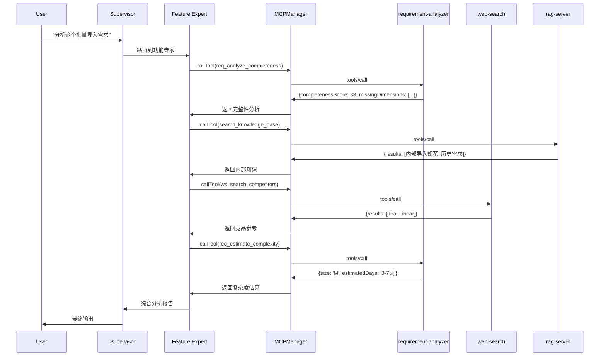

这张图把第九章、第十章、第十一章和本章串在一起：

*   第九章提供 Multi-Agent 编排框架
*   第十章提供 Token 预算与成本约束
*   第十一章提供内部知识库检索能力
*   第十二章把外部工具、搜索能力、RAG 服务统一接入

到这里，Agent 不再只是“会推理的节点”，而是具备了可发现、可扩展、可复用工具生态的执行系统。

*   🧩 生成代码 Prompt：Agent 集成

        将 MCP 工具集成到 LangGraph Agent：

        1. 初始化 MCPManager，注册三个 Server：
           - requirement-analyzer (prefix: req_)
           - web-search (prefix: ws_)
           - rag-server (tool: search_knowledge_base)

        2. 调用 manager.connectAll()，获取 manager.getTools()

        3. 将 MCP 工具与第九章已有工具合并：
           - readRequirementTool
           - checkExistingFeaturesTool
           - loadPerfBaselineTool
           - ...manager.getTools()

        4. 用 createReactAgent 创建功能专家：
           - llm: ChatOpenAI({ model: 'gpt-4o-mini' })
           - tools: mergedTools
           - prompt: 描述可用工具和使用场景

        5. 增加权限与预算保护：
           - 调用前检查 canUseTool(userId, toolName)
           - 根据 intent 裁剪工具列表，避免无关工具进入上下文
           - 记录 AgentMCPTrace

        6. 测试完整场景：
           - 输入一段需求
           - 验证 analyze + rag search + web search + estimate 的协同调用
           - 验证工具不可用时 fallbackTools 生效

📋 **本节配套用例**

```bash
# LLM 集成测试（需要 OPENAI_API_KEY）
OPENAI_API_KEY=sk-... bun test test/chapter12-mcp-llm.spec.ts -t "12.13"
```

| 验证点                           | 预期 |
| ----------------------------- | -- |
| Agent 能拿到 MCPManager 聚合后的工具列表 | ✅  |
| 功能专家可调用 req\_ 与 ws\_ 前缀工具     | ✅  |
| RAG-as-MCP-Server 可返回内部知识结果   | ✅  |
| 三 Server 工具可在同一轮推理中协同         | ✅  |
| Server 不可用时 fallbackTools 生效  | ✅  |
| 最终输出包含完整性评分、内部知识、竞品参考、复杂度     | ✅  |


***

## 12.17 全景回顾

走到这里，本章已经从“为什么需要 MCP”一路讲到“如何接入 LangGraph Agent”。回头看，MCP 解决的不是某一个工具怎么写，而是**工具生态如何被发现、连接、调用、治理**。

### 12.17.1 完整时序图

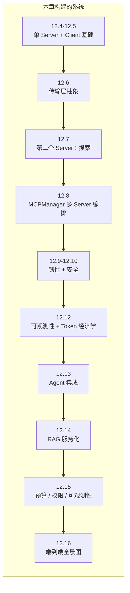

### 12.17.2 数据流维度

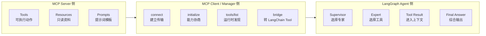

从数据流角度看，本章有三条主线：

1.  **能力从 Server 暴露出来**：Tools / Resources / Prompts
2.  **能力被 Client 发现和适配**：connect / initialize / listTools / bridge
3.  **能力进入 Agent 推理闭环**：工具描述进入上下文，工具结果回到模型，再生成最终答案

### 12.17.3 决策维度地图

什么时候用 MCP？什么时候直接写 Tool？可以用下面这张表做判断：

| 场景                                      | 推荐方案                         | 原因                     |
| --------------------------------------- | ---------------------------- | ---------------------- |
| 工具逻辑简单，只在一个 Agent 使用                    | 直接 LangChain Tool            | 无需跨进程通信，开发成本最低         |
| 工具需要被多个 Agent / 项目复用                    | MCP Server                   | 一次实现，多处连接              |
| 连接第三方服务（Jira / GitHub / Figma / Notion） | MCP Server                   | 认证、API、错误处理都适合封装在独立服务里 |
| 工具由另一个团队维护                              | MCP Server                   | 边界清晰，团队可独立迭代           |
| 工具需要独立扩缩容                               | MCP Server + Streamable HTTP | 可单独部署和伸缩，不拖累 Agent 主服务 |
| 需要本地桌面应用调用                              | MCP Server + stdio           | 零端口、零网络配置，适合本机进程       |
| 快速原型 / 一次性脚本                            | 直接 Tool                      | 少写协议层样板代码              |

**经验法则**：

*   如果一个工具只服务当前 Agent，先写成本地 Tool。
*   如果一个工具要服务多个 Agent，或者要独立部署，优先 MCP。
*   如果一个工具连接外部系统，优先 MCP。
*   如果一个工具有写操作、高权限、复杂认证，优先 MCP，但必须加权限与确认机制。

### 12.17.4 成本与灵活性阶梯

    硬编码 Function → LangChain Tool → MCP (stdio) → MCP (HTTP)
    ────────────────────────────────────────────────────────────→
      开发成本低                                    灵活性高
      部署简单                                      可独立扩展
      无运行时开销                                   跨项目复用

这条阶梯不是说越右越好，而是要看场景：

*   **硬编码 Function**：适合教学、Demo、短期验证
*   **LangChain Tool**：适合单项目内稳定工具
*   **MCP stdio**：适合本地工具、桌面应用、IDE 集成
*   **MCP HTTP**：适合生产服务、多团队共享、远程调用

### 12.17.5 可观测性回扣

可观测性字段和监控指标已经统一放在 12.12，本节不再重复表格。上线时只需要记住一个原则：第十章的 Token Usage、十一章的 RAG Trace、十二章的 MCP Trace 应该合并到同一条请求链路里。否则你只能看到“最终回答慢”，却不知道慢在模型、检索、MCP Server，还是外部 API。

***

## 12.18 FAQ

### Q1：Server 连接不上 / 连接超时

**常见原因**：

1.  Server 命令路径错误：检查 `command` 和 `args` 是否正确
2.  依赖未安装：Server 目录下执行 `bun install`
3.  TypeScript 编译错误：先 `bun run build` 确认无报错
4.  环境变量缺失：某些 Server 需要特定环境变量
5.  Server 把日志写到了 stdout，污染了 JSON-RPC 协议输出

**排查方式**：

```bash
# 手动启动 Server，看 stderr 输出
tsx mcp-servers/requirement-analyzer/src/index.ts 2>&1
```

如果使用 stdio，务必记住：**stdout 只能写协议消息，日志写 stderr**。这是最常见的连接失败原因之一。

### Q2：`tools/list` 返回空数组

**常见原因**：

1.  Server 代码中 `server.tool()` 注册有语法错误
2.  工具注册发生在 `server.connect()` 之后
3.  能力协商时 Server 没有声明 tools capability
4.  工具注册被条件判断跳过，例如缺少环境变量时直接不注册

**排查方式**：用 MCP Inspector 直接连接 Server，看工具列表是否存在。若 Inspector 能看到工具，但 Agent 看不到，问题通常在 Client / Manager 的桥接层。

### Q3：stdio vs Streamable HTTP 怎么选

| 场景              | 选择                | 原因                 |
| --------------- | ----------------- | ------------------ |
| 本地开发、单人使用       | stdio             | 零配置、最简单            |
| 桌面应用 / IDE 插件   | stdio             | 本机进程隔离，无需开放端口      |
| 多人 / 多 Agent 共享 | Streamable HTTP   | 支持远程连接与多客户端访问      |
| Serverless 部署   | HTTP 无状态模式        | 每次请求独立，不维护 session |
| 需要工具变更通知        | HTTP 有状态模式或 stdio | 需要保持会话             |
| CI/CD 中运行测试     | InMemoryTransport | 无进程、无网络，稳定可重复      |

### Q4：认证 Token 过期后工具调用全部失败

**解法**：

1.  Client 捕获 401 响应
2.  触发 token refresh 流程
3.  用新 token 重新 initialize
4.  重试失败的调用

```tsx
try {
  await client.callTool(name, args);
} catch (err) {
  if (err.code === 401) {
    const newToken = await refreshToken();
    await client.reconnect({ token: newToken });
    return client.callTool(name, args);
  }
  throw err;
}
```

对于远程 MCP Server，认证失败不应该直接表现成“工具不可用”。更好的做法是返回明确错误，让 Host 引导用户重新授权。

### Q5：工具调用返回内容太长，导致后续回答变慢

MCP 工具返回内容会进入 Agent 上下文。返回越长，后续 LLM 调用越贵。

**解决方式**：

*   Server 端限制返回条数和长度
*   对搜索结果只返回 title / snippet / url，不返回整页正文
*   对 RAG 结果只返回 topK chunk，必要时做摘要
*   对大结果返回 Resource URI，让应用按需读取
*   在 MCPManager 层记录 `outputSize`，超过阈值报警

### Q6：模型总是不调用某个 MCP 工具

常见原因不是协议问题，而是工具描述不清楚。

检查三点：

1.  `description` 是否说明了适用场景
2.  `inputSchema` 的字段描述是否具体
3.  工具名是否可理解，例如 `req_analyze_completeness` 比 `tool_1` 更容易被模型选择

好的工具描述应该同时写清：

*   什么时候用
*   输入是什么
*   返回什么
*   什么时候不要用

### Q7：MCP 与 OpenAI Function Calling / LangChain Tool 的区别和关系

三者的完整对比已经放在 12.1.4。这里用一句话回扣：Function Calling 解决“模型如何表达工具调用”，LangChain Tool 解决“应用内如何执行工具”，MCP 解决“外部工具如何被发现、连接和复用”。它们是分层关系，不是三选一。

### Q8：什么时候不要用 MCP

决策表已经放在 12.17.3。简单说：短小纯函数、只服务当前 Agent、对延迟极敏感、强依赖主进程内存状态、一次性 Demo，都不必急着 MCP 化。工程上可以先用 LangChain Tool 起步，等工具需要跨项目复用、独立部署或连接外部系统时，再升级为 MCP。

***

## 12.19 术语速查表

| 术语                | 定义                                      |
| ----------------- | --------------------------------------- |
| MCP               | Model Context Protocol，AI 工具调用的标准协议     |
| MCP Server        | 暴露 Tools/Resources/Prompts 的服务端         |
| MCP Client        | 连接 Server 并调用工具的客户端                     |
| Host              | 运行 MCP Client 的应用程序（如 IDE、Agent）        |
| Transport         | 传输层实现（stdio / Streamable HTTP / SSE）    |
| Tool              | 可执行操作，由模型控制调用                           |
| Resource          | 只读数据源，由应用控制读取                           |
| Prompt            | 预定义 Prompt 模板，由用户控制选择                   |
| JSON-RPC 2.0      | MCP 底层消息格式标准                            |
| Capability        | 能力声明，用于 Client/Server 协商                |
| Session           | 一次 Client-Server 连接的完整生命周期              |
| InMemoryTransport | 测试用的内存传输，无需进程/网络                        |
| Inspector         | MCP 官方调试工具                              |
| Annotation        | 工具的元信息提示（只读/破坏性/开放世界）                   |
| Notification      | 单向消息（无需响应）                              |
| inputSchema       | 工具的 JSON Schema 参数定义                    |
| content\[]        | MCP 工具返回格式（text/image/resource 数组）      |
| isError           | 工具级错误标记（区别于协议级错误）                       |
| listChanged       | 工具列表变更通知                                |
| Mcp-Session-Id    | HTTP 传输的会话标识 header                     |
| Streamable HTTP   | MCP 当前推荐的 HTTP 传输方式                     |
| MCPManager        | 多 Server 统一管理器（本项目实现）                   |
| Bridge            | MCP Tool → LangChain Tool 的转换层          |
| Namespace Prefix  | 多 Server 工具名前缀策略                        |
| Fallback          | Server 不可用时的降级工具                        |
| Circuit Breaker   | 断路器模式，连续失败后暂停调用                         |
| Human-in-the-Loop | 高危操作前的用户确认机制                            |
| Tavily            | Web 搜索 API 服务（本项目搜索 Server 底层）          |
| CRAG              | Corrective RAG，第十一章的 Web 搜索兜底模式         |
| T-shirt Size      | 复杂度估算单位（S/M/L/XL）                       |
| Primitive         | 协议中的基础能力单元，本章指 Tool / Resource / Prompt |
| Request           | 带 `id` 的请求消息，期待对端返回响应                   |
| Response          | 与请求 `id` 对应的响应消息                        |
| Resilience        | 韧性，系统在部分组件失败时继续工作的能力                    |
| Prompt Injection  | 提示词注入，外部内容试图影响模型行为的攻击方式                 |
| OAuth 2.1         | 远程 MCP Server 常用的授权流程                   |
| RAG-as-MCP-Server | 把 RAG 检索能力封装成 MCP Server，供多个 Agent 复用   |
| PRD               | Product Requirement Document，产品需求文档     |

***

## 12.20 精简小结 + 后续章节预告

### 本章要点

前面已经完成全景回顾，这里只保留几个要点：

1.  **MCP 解决的是“连接与复用”问题**：它不是替代 Function Calling，而是让工具可以独立开发、独立部署、跨 Agent 复用。
2.  **协议核心是 JSON-RPC 2.0 + 能力协商 + 三种原语**：Tools、Resources、Prompts 的关键区别在于控制者不同。
3.  **桥接层决定能否进入现有 Agent 生态**：JSON Schema → Zod、MCP `content[]` → string，是接入 LangChain / LangGraph 的关键适配点。
4.  **多 Server 编排要治理命名、降级和权限**：前缀解决重名，fallback 解决不可用，Human-in-the-Loop 约束高风险操作。
5.  **RAG-as-MCP-Server 让知识库能力服务化**：第十一章的检索能力不再绑定某个 Agent，而可以被多个客户端共享。

### 后续章节预告

下一章进入 **Skills**：从“会写一段代码、会调用一个工具”，进一步走向“把一类任务沉淀成可复用资产”。我们会讨论如何把提示词、工具、脚本、模板、检查清单和领域知识组合成一个可迁移的 Skill，让 Agent 不只是临时完成任务，而是逐步积累稳定能力。

一句话锚点：

> 第十一章让模型**读懂业务**，第十二章让模型**调用工具**，第十三章会讨论如何把这些能力沉淀为可复用的 **Skill 资产**。


## 写在最后 🧪

> 这里是**言萧凡的 AI 编程实验室**。我会在这里持续记录和分享 **AI 工具、编程实践**，以及那些值得沉淀下来的高效工作方法。不只聊概念，也尽量分享能直接上手、能够复用的经验。希望这间小小的实验室，能陪你一起探索、实践和成长。**2026 年，一起进步。**

**有兴趣的话可以添加我的微信号【Cookieboty】一起交流，不仅是编程也可以是畅谈人生。**
