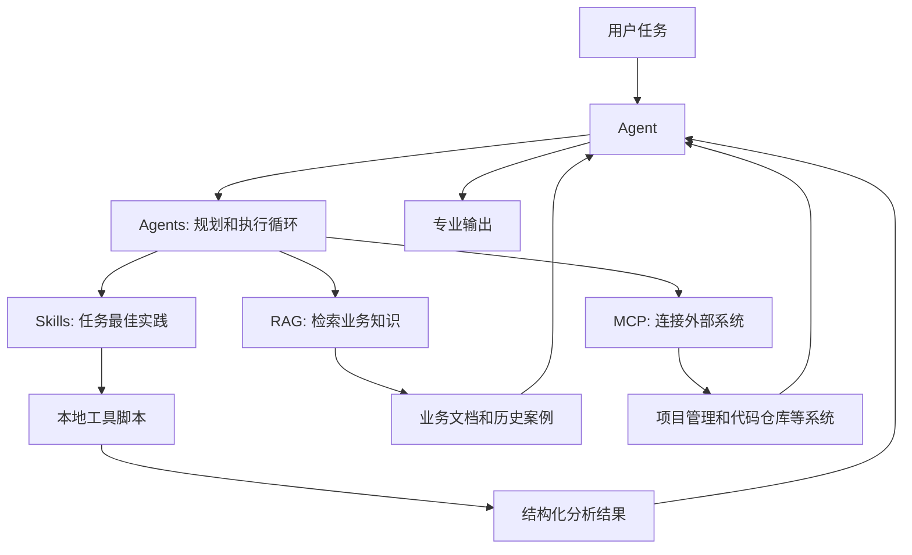
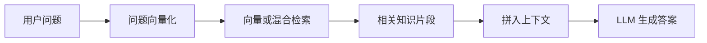
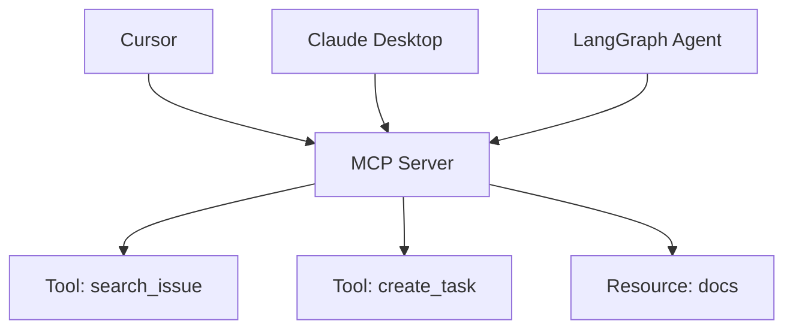
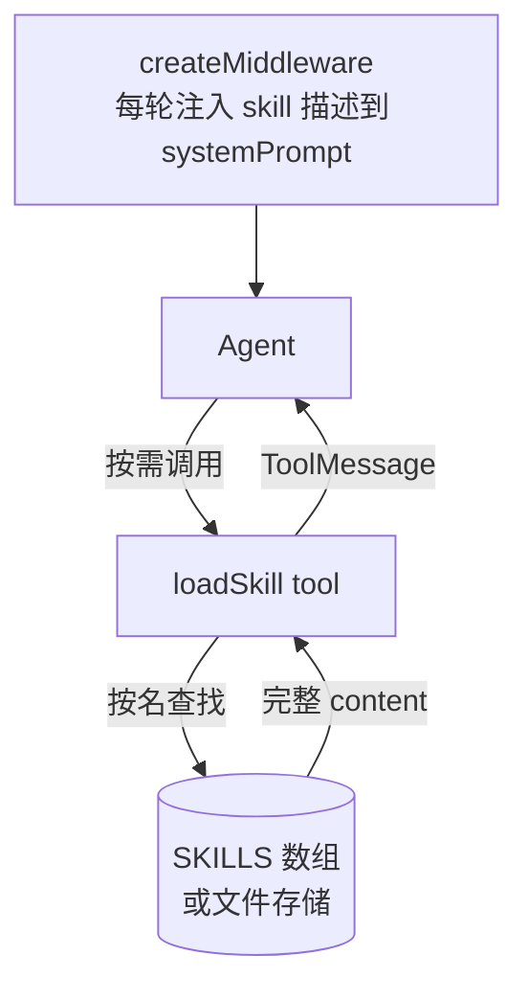
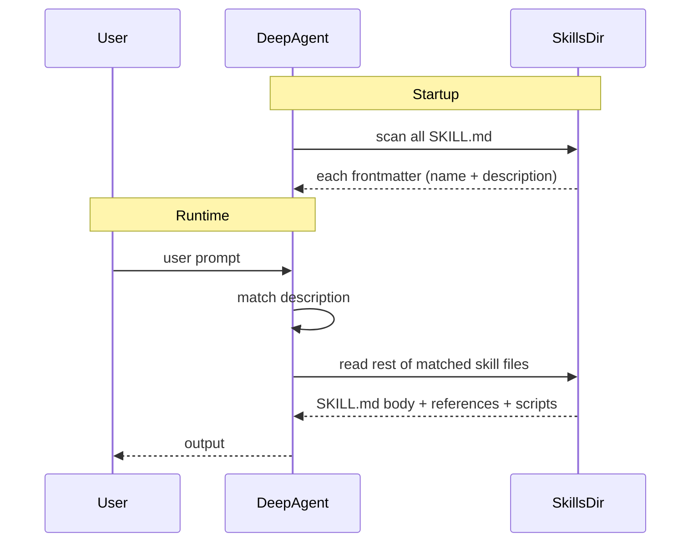
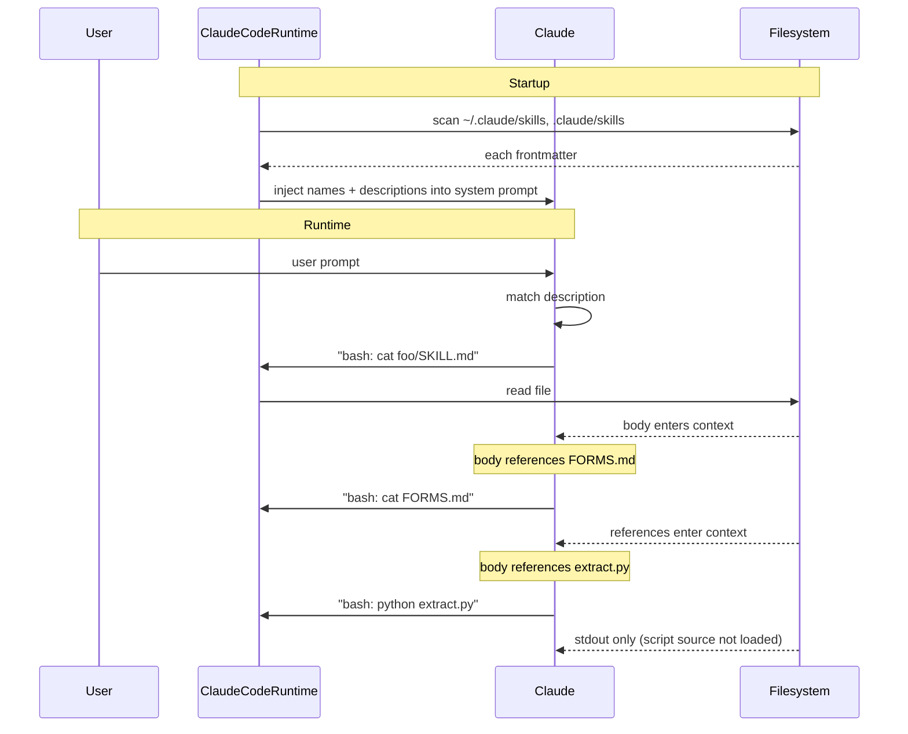
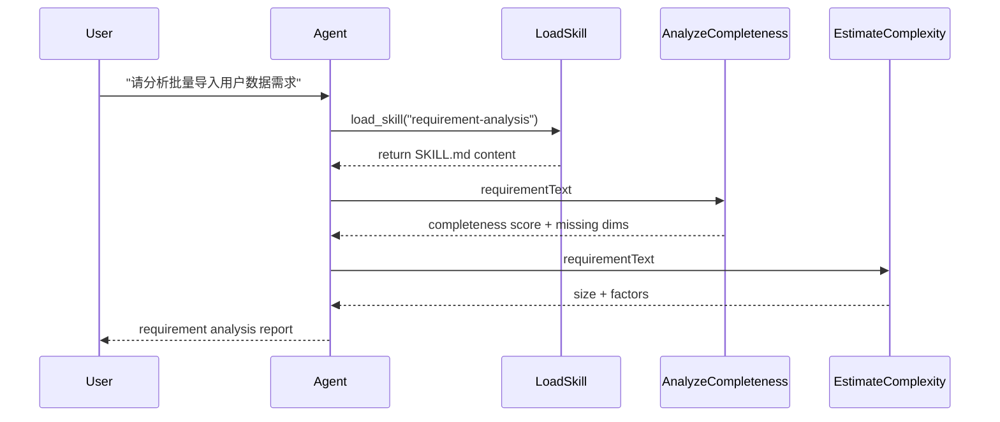
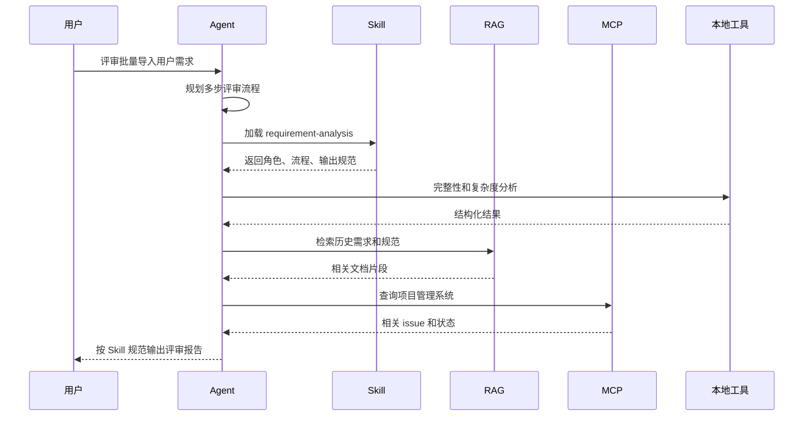

> 本文整理自《2026 前端 AI Agent 工程化实战营》课程资料，作为系列文章第 14 篇。

---
theme: channing-cyan
---

**本章demo地址**：[feat/skills](https://github.com/Cookieboty/autix-demo/tree/feat/skills)


前几章已经分别铺开了几块基础能力。第十一章讲 RAG，重点是让模型在回答前拿到企业内部资料；第十二章讲 MCP，重点是让 Agent 以统一方式接入外部系统；第八、九章讲 Agent 和 Multi-Agent，重点是让模型具备规划、调用工具和持续推进任务的能力。

但这些能力合在一起，还没有回答一个容易被忽略的问题：**一个领域专家到底由哪些能力构成？**

回看第九章的 Multi-Agent 系统，功能需求专家并不是因为模型更聪明才像专家，而是因为它背后有一组可沉淀的要素：

1.  系统提示词：定义角色、分析框架和行为边界。
2.  工具列表：说明可调用的工具，以及各自的使用时机。
3.  工作流：规定先做完整性检查，还是先查历史需求。
4.  输出规范：约定报告结构、字段和风险分级方式。
5.  质量标准：说明什么样的回答算合格，什么情况需要重试。

RAG 提供事实，MCP 提供工具，Agents 提供执行循环。但这些能力放在一起，并不自动等于“需求分析专家”。还需要一份稳定的任务方法，告诉 Agent 应该按什么流程、使用哪些工具、输出什么结果。

Skills 解决的正是这一层问题。

> RAG 让模型**读懂业务知识**，MCP 让模型**调用外部工具**，Agents 让模型**自主执行多步任务**，Skills 则把“某类任务怎么做才专业”沉淀为**可复用能力资产**。

**本章验收点**

*   能讲清楚 MCP、RAG、Agents、Skills 分别解决什么问题，以及为什么它们不是互相替代关系
*   理解 Skills 的核心价值：把最佳实践、角色约束、工作流、工具说明、输出规范和质量标准收进一份可读资产
*   掌握 `SKILL.md` 的结构：YAML frontmatter + Markdown 指令正文
*   理解 Progressive Disclosure：为什么 Skill 要按需加载，而不是全部塞进 system prompt
*   能读懂本章 PoC 的运行链路：`load_skill` 读文件，Agent 按指令调用 Python 工具，最后生成报告
*   能区分本章已经实现的内容、教学 PoC 的边界，以及生产化还需要补的能力
*   知道 LangChain 中结构化输出应优先使用 `withStructuredOutput()`、`StructuredOutputParser.fromZodSchema()` 等官方能力，而不是手写解析器
*   每个关键实现阶段都给出可直接粘贴到 Cursor / Claude 的生成 Prompt，并标注对应 testcase

***

## 13.1 先把 MCP、RAG、Agents、Skills 放在同一张图里

很多读者会把 MCP、RAG、Agents、Skills 混在一起，因为它们都在做一件表面相似的事：给模型增加能力。

拆开来看，一个 AI 系统要稳定完成专业任务，至少要回答四个问题：

1.  **连接**：模型如何标准化地接入外部系统。
2.  **知识**：模型如何获得私有、实时、可追溯的业务资料。
3.  **执行**：模型如何从目标出发，自主拆解并完成多步任务。
4.  **方法**：模型如何复用某类任务的最佳实践。

MCP、RAG、Agents、Skills 分别对应这四类问题：

| 概念     | 本质          | 解决的问题                  | 典型产物                                   |
| ------ | ----------- | ---------------------- | -------------------------------------- |
| MCP    | 协议层         | “LLM 如何标准化地调用外部工具？”    | MCP Server、Tool、Resource、Prompt        |
| RAG    | 数据管道        | “如何把私有/实时知识注入上下文？”     | Embedding、Vector DB、Retriever、Reranker |
| Agents | 运行模式        | “如何让 LLM 自主完成开放式多步任务？” | ReAct loop、Planner、Tool use、Reflection |
| Skills | Prompt 工程资产 | “如何把某类任务的最佳实践固化并复用？”   | `SKILL.md`、工作流、输出规范、质量规则               |


可以用一句话区分：

> MCP 管“怎么接”，RAG 管“查什么”，Agents 管“怎么推进”，Skills 管“怎么做才专业”。

四者可以组合，但职责不能混。



注意这张图里的方向：Agent 是运行模式，Skill 是任务方法。Skill 不替代 RAG、MCP 或 Agent，而是为 Agent 提供一套稳定的任务执行模板。一个好的 Skill 会明确：

*   这个任务需要先检索哪些知识
*   哪些信息必须通过工具确认
*   工具返回的数据应该如何解释
*   输出报告必须包含哪些章节
*   哪些质量规则必须满足

如果没有 Skills，RAG 和 MCP 只是分散的能力，Agent 也只是一个能够推进任务的运行时。它可能会查知识、调工具、循环执行，但不一定知道该按哪个专业流程完成任务。

工程选型时可以先按下面的顺序判断：

> 能用 Skills 固化的流程，不必先上 RAG；能用 RAG 回答的知识问题，不必升级成 Agent；能通过 MCP 工具明确执行的动作，不要让 Agent 自由探索。

这不是限制能力组合，而是提醒我们优先选择最小可行机制。机制越自由，成本、延迟和不确定性通常也越高。

***

## 13.2 RAG / MCP / Agents 的边界

13.1 已经把四个概念放进同一张图。要讲清楚 Skills 的独特位置，必须先把另外三层各自的职责和边界讲清楚——它们解决的不是 Skills 要解决的问题，但常常被读者误以为是。

### 13.2.1 RAG：知识检索

RAG 是 Retrieval-Augmented Generation。它不修改模型权重，也不把所有业务文档一次性塞进 prompt，而是在用户提问时从外部知识库检索最相关的片段，把这些片段拼进上下文，让模型基于现场资料回答。



第十一章已经展开过完整链路：文档切分、embedding、向量库、检索、重排、生成。这里浓缩成一句话：

> RAG 的核心不是”让模型记住知识”，而是”让模型在回答前拿到证据”。

**边界**：RAG 不知道一个”需求分析报告”应该有哪些章节，只负责把相关资料找出来。它也不负责调用项目管理系统创建任务，不负责决定先做竞品调研还是先做需求拆解。

### 13.2.2 MCP：工具协议

MCP 是 Model Context Protocol。它的目标不是让模型更聪明，而是让外部能力更容易被模型客户端发现和调用。没有 MCP 时，每个应用都要自己适配工具；有 MCP 后，工具由 MCP Server 暴露，客户端按协议发现和调用：



第十二章的重点就是：不让每个 Agent 各自硬编码一套工具适配层。

**边界**：MCP 能告诉模型”这里有一个 `searchRequirement` 工具，它接收 `query`，返回需求列表”，但不会告诉模型”做需求评审时，先查历史需求，再检查冲突，再估算复杂度，再输出带风险等级的报告”。协议解决”能不能调用”，不是”应该如何完成专业任务”。

### 13.2.3 Agents：运行模式

第八、九章已经使用 LangGraph 构建过单 Agent 和 Multi-Agent。Agent 的本质是运行模式：

    Goal → Reason → Plan → Act → Observe → Retry / Reflect

它解决的是”模型如何自主推进开放式多步任务”，是 coding agent、自动化办公 agent、研究 agent 的基础。但 Agent 的强项也是风险来源：

| 能力    | 价值      | 代价       |
| ----- | ------- | -------- |
| 自主规划  | 能处理开放任务 | 路径不确定    |
| 循环执行  | 能根据结果调整 | 可能死循环    |
| 多工具调用 | 能完成复杂流程 | 成本和延迟上升  |
| 反思修正  | 能自我纠错   | 评估标准更难稳定 |

**边界**：Agent 是运行模式，不是能力资产。一个固定格式的需求完整性检查，如果能用 Skill 和本地工具稳定完成，就不需要让 Agent 自由探索十几步。一个明确的数据库查询，如果能通过 MCP Tool 直接完成，就不应该让 Agent 自己”想办法”。

### 13.2.4 为什么它们都不是 Skills

| 问题             | 应该解决在  |
| -------------- | ------ |
| 答案缺少业务事实       | RAG    |
| 调不到外部系统        | MCP    |
| 任务需要多步规划和动态调整  | Agents |
| 输出缺少专业结构、流程不稳定 | Skills |
| 工具已接入，但缺少调用流程  | Skills |
| 固定流程能写成检查清单    | Skills |

RAG 提供事实，MCP 提供工具，Agents 提供运行循环。如果缺少一份**描述“某类任务应该按什么专业流程完成”的资产**，这三层能力就很容易各自为战。Skills 补的就是这一层。

***

## 13.3 Agent Skills 规范：通用概念

Skills 不是 LangChain 的发明，也不是 Anthropic 的私有概念。它有一份独立的开放规范——Agent Skills Specification1。LangChain Deep Agents、Claude Code 都跟随这份规范；本章 demo 走的是 LangChain Custom Skills Pattern，借用了规范的目录约定但运行时是自定义的。

理解这一节，可以避免把不同实现的”渐进式披露”搞混。


### 13.3.1 规范的核心要素

一个 Skill 是一个目录，至少包含一个 `SKILL.md` 文件，可选 scripts/references/assets：

    skills/
      some-skill/
        SKILL.md          ← 必须：指令和元数据
        scripts/          ← 可选：可执行脚本
        references/       ← 可选：补充参考文档
        assets/           ← 可选：模板或资源

`SKILL.md` 由 YAML frontmatter 和 Markdown 正文组成：

```yaml
---
name: some-skill                      # 必须
description: 当用户提到 X 时使用       # 必须，≤ 1024 字符
allowed-tools: tool_a, tool_b         # 可选
metadata:
  author: someone
  version: "1.0.0"
module: index.ts                      # 可选，对应可执行模块
---

# Some Skill

正文是给 Agent 阅读的指令：角色、工作流、输出规范……
```

`description` 是规范里**唯一负责”何时使用”的字段**——规范不要求 `tags`，因为 LLM 直接阅读 description 做匹配。

任何额外的资源（scripts/references/assets）**必须在 SKILL.md 正文里被引用并说明用途**，否则 Agent 无从知道什么时候去读它们。

### 13.3.2 规范的渐进式披露思想

规范层面的渐进式披露分为四层：

| 层  | 内容                                        | 何时进入上下文                   |
| -- | ----------------------------------------- | ------------------------- |
| L1 | 各 Skill 的 frontmatter（name + description） | 启动时一次性加载（极小）              |
| L2 | 命中 Skill 的 SKILL.md 正文                    | Agent 决定使用该 Skill 时       |
| L3 | SKILL.md 引用的 references / assets          | 任务真正需要时                   |
| L4 | SKILL.md 提到的脚本执行结果                        | Agent 决定运行该脚本时（只回 stdout） |

注意 L3 和 L4 是**规范层面**的设计，是否实现取决于运行时。下面三节分别讲三种实现：

*   **LangChain Custom Skills Pattern**——只做 L1 + L2（本章 demo 走这条路）
*   **LangChain Deep Agents Skills**——L1 + L2 + L3 + L4，把规范完整接住
*   **Claude Code Skills**——用 filesystem + bash 实现 L1\~L4，Anthropic 自家运行时

不要把三种”渐进式披露”混着讲——它们运行机制根本不同。

***

## 13.4 LangChain Custom Skills Pattern

LangChain 在 SQL Assistant 教程里给出了一份基础 Skills pattern2。它不直接消费 Agent Skills 规范的 frontmatter，而是把 Skill 当成一个 `{ name, description, content }` 数据结构，用一个 `loadSkill` 工具加一个 `createMiddleware` 中间件实现两层渐进式披露。


**本章 demo 走的就是这条路**。因此，本节是 13.8 实战部分的理论基础。

### 13.4.1 整体架构



两个组件协同完成渐进式披露：

*   **L1（索引）**：`createMiddleware.wrapModelCall` 在每次 model call 时往 `systemPrompt` 追加 skill 列表（只有 name + description，极小）
*   **L2（内容）**：Agent 主动调用 `loadSkill(skillName)`，工具返回该 skill 的完整 content 作为 ToolMessage（一次给全）

### 13.4.2 `loadSkill` Tool（标准写法）

```tsx
import { tool } from "langchain";
import { z } from "zod";

const loadSkill = tool(
  async ({ skillName }) => {
    const skill = SKILLS.find((s) => s.name === skillName);
    if (skill) {
      return `Loaded skill:${skillName}\n\n${skill.content}`;
    }
    const available = SKILLS.map((s) => s.name).join(", ");
    return `Skill '${skillName}' not found. Available skills:${available}`;
  },
  {
    name: "load_skill",
    description: `Load the full content of a skill into the agent's context.

Use this when you need detailed information about how to handle a specific
type of request. This will provide you with comprehensive instructions,
policies, and guidelines for the skill area.`,
    schema: z.object({
      skillName: z.string().describe("The name of the skill to load"),
    }),
  }
);
```

关键点：

*   `loadSkill` 一次返回**完整 content**。这是 LangChain Custom Pattern 的标准做法，不是简化版，也不是分段加载。
*   工具的 description **不**列出可用 skill 名，因为 skill 索引由 middleware 注入。
*   找不到 skill 时返回 available skills 列表，方便 Agent 自行纠错。

### 13.4.3 `createMiddleware`：注入 skill 索引

```tsx
import { createMiddleware } from "langchain";

const skillsPrompt = SKILLS.map(
  (skill) => `- **${skill.name}**:${skill.description}`
).join("\n");

const skillMiddleware = createMiddleware({
  name: "skillMiddleware",
  tools: [loadSkill],
  wrapModelCall: async (request, handler) => {
    const skillsAddendum =
      `\n\n## Available Skills\n\n${skillsPrompt}\n\n` +
      "Use the load_skill tool when you need detailed information " +
      "about handling a specific type of request.";
    return handler({
      ...request,
      systemPrompt: request.systemPrompt + skillsAddendum,
    });
  },
});
```

关键点：

*   `tools: [loadSkill]` 写在 middleware 里——middleware 启用时工具自动注册，不用再到 `createAgent({ tools: [...] })` 里重复列一遍。
*   `wrapModelCall` 在每轮 model call 时执行，所以即使前几轮没用 skill，后续 Agent 还是看得到 skill 索引。
*   多个 middleware 可以叠加（比如再加 `SummarizationToolMiddleware` 压缩对话历史）。

### 13.4.4 两层渐进式披露：和规范的对应关系

| Agent Skills 规范层                   | LangChain Custom Pattern                      |
| ---------------------------------- | --------------------------------------------- |
| L1 frontmatter（name + description） | `createMiddleware` 注入 systemPrompt 的 skill 索引 |
| L2 SKILL.md 正文                     | `loadSkill` 一次返回完整 content                    |
| L3 references / assets             | **不支持**——要应用层显式注册 `read_file` 类工具             |
| L4 脚本执行                            | **不支持**——要应用层把脚本包装成 LangChain tool            |

LangChain Custom Pattern 只覆盖规范中的 L1 + L2。它的定位很明确：把 Skill 内容作为一份完整指令交给 Agent，再由 Agent 调用应用层显式注册的工具。L3/L4 属于 Deep Agents 和 Claude Code 的能力，见 13.5 / 13.6。

### 13.4.5 进阶：`Command + skillsLoaded`

当出现”某些工具必须在某个 skill 加载之后才能调用”这种约束时，把 `loadSkill` 升级为返回 `Command`，并用 state 追踪：

```tsx
import { tool, ToolMessage, type ToolRuntime } from "langchain";
import { Command } from "@langchain/langgraph";
import { z } from "zod";

const loadSkill = tool(
  async ({ skillName }, runtime: ToolRuntime<typeof CustomState.State>) => {
    const skill = SKILLS.find((s) => s.name === skillName);
    if (skill) {
      return new Command({
        update: {
          messages: [new ToolMessage({
            content: `Loaded skill:${skillName}\n\n${skill.content}`,
            tool_call_id: runtime.toolCallId,
          })],
          skillsLoaded: [skillName],
        },
      });
    }
    // ...
  },
  { name: "load_skill", description: "...", schema: z.object({ skillName: z.string() }) }
);

// 其他工具读取 state.skillsLoaded 做依赖检查
const writeSqlQuery = tool(
  async ({ query, vertical }, runtime) => {
    const skillsLoaded = runtime.state.skillsLoaded ?? [];
    if (!skillsLoaded.includes(vertical)) {
      return `Error: load_skill('${vertical}') first to understand the schema.`;
    }
    // ...
  },
  { /* ... */ }
);
```

这是 LangChain 独有的能力——可以在工具层 enforce skill 依赖，Claude Code Skills 没有等价机制。本章 demo 没有用 `Command`，因为没有这种依赖约束需求；如果以后出现”必须先加载 X skill 才能调 Y tool”的场景，再升级。

***

## 13.5 LangChain Deep Agents Skills

LangChain 在 Deep Agents SDK 里实现了 **Agent Skills 规范的完整版本**（见参考资料 3）。Deep Agents Skills 和 Custom Pattern 的出发点不同：前者把 `SKILL.md` 当成文件系统中的一等资产，由运行时直接管理目录、扫描 frontmatter，并按需读取其余文件。

### 13.5.1 与 Custom Pattern 的根本区别

| 维度                        | Custom Pattern             | Deep Agents Skills                     |
| ------------------------- | -------------------------- | -------------------------------------- |
| Skill 来源                  | 应用代码里的 `SKILLS` 数组         | 文件系统目录（传 `skills=[dir]`）               |
| 索引暴露                      | `createMiddleware` 每轮注入    | 启动时 SDK 自动扫描所有 frontmatter 注入一次        |
| 内容加载                      | `loadSkill` 工具返回完整 content | SDK 自动读 SKILL.md body                  |
| 子资源（references / scripts） | **不支持**，要应用层处理             | **支持**，SKILL.md 引用即可，运行时按需读            |
| 脚本执行                      | 应用层包装成 LangChain tool      | 通过 `module: index.ts` 供 interpreter 调用 |

Deep Agents 的设计哲学是”Skill 是目录、是规范实体”；Custom Pattern 的设计哲学是”Skill 是数据，是你应用里的常量”。

### 13.5.2 启动 → 命中 → 详读 的渐进式披露

Deep Agents 文档原话：

> When the agent receives a prompt, the agent checks if it can use any skills while fulfilling the prompt. If it finds a matching prompt, it then reviews the rest of the skill files.



### 13.5.3 配置示例

```tsx
import { createDeepAgent } from "deepagents";

const agent = createDeepAgent({
  model: "anthropic:claude-sonnet-4-5",
  skills: ["./skills/research/", "./skills/web-search/"],
});
```

`skills` 是目录列表。每个目录必须有 `SKILL.md`，可选 scripts/references/assets。frontmatter 字段遵循 Agent Skills 规范（见参考资料 4）：

```yaml
---
name: skill-name
description: ...
license: MIT                # 可选
compatibility: ...          # 可选
metadata:
author: ...
version: "1.0"
allowed-tools: tool_a, tool_b
module: index.ts            # 可选，可执行模块
---
```

### 13.5.4 何时选 Deep Agents Skills

适合：

*   多个团队各自维护 skill 目录，需要按规范交付
*   Skill 要带较多 references（设计文档、模板、schema 等）
*   不想自己写 skill 加载逻辑

不适合（应该选 Custom Pattern）：

*   Skill 数量少、内容紧凑
*   需要在应用层强制 skill 依赖（用 `Command + skillsLoaded`）
*   想精确控制 skill 索引怎么进 systemPrompt（分组、按角色筛选等）

***

## 13.6 Claude Code Skills

Anthropic Claude Code 把 Agent Skills 规范实现为运行时机制（见参考资料 5、6）。Claude Code 不需要任何 LangChain 代码——它本身就是一个能识别 `SKILL.md` 的 CLI。

### 13.6.1 Filesystem + Bash 实现

Claude Code 用两个原语完成所有 skill 加载：

1.  **filesystem 扫描**：启动时扫描 `~/.claude/skills/`、当前项目下 `.claude/skills/`，读取每个 SKILL.md 的 frontmatter
2.  **bash 工具**：触发 skill 后，Claude 用 `bash: cat <file>` 读 SKILL.md body、用 `bash: cat <reference>` 读 references、用 `bash: python <script>` 跑脚本



### 13.6.2 四层渐进式披露的实现

| 规范层            | Claude Code 实现                                 |
| -------------- | ---------------------------------------------- |
| L1 frontmatter | 启动一次性扫描注入 system prompt                        |
| L2 SKILL.md 正文 | `bash: cat SKILL.md`                           |
| L3 references  | `bash: cat REFERENCE.md`                       |
| L4 脚本          | `bash: python script.py`，**只回 stdout，源码不进上下文** |

L4 的”只回 stdout”是 Claude Code 控制上下文成本的关键设计——一个 2000 行的解析脚本本身永远不会污染 Claude 的 token 预算。

### 13.6.3 与 LangChain Skills 的根本差异

*   Claude Code Skills 是**运行时机制**：你不写代码，丢 SKILL.md 进约定目录即可
*   LangChain Skills 是**应用层模式**：你写 agent 代码，skill 通过 tool 或 middleware 进入流程
*   跨项目复用：Claude Code 复制目录到 `~/.claude/skills/` 即可；LangChain 要发包或集成应用代码
*   状态追踪：Claude Code 没有显式 `skillsLoaded`，session 内自然保留；LangChain 进阶模式有 `Command + skillsLoaded`
*   依赖强制：Claude Code 靠 SKILL.md 文本指令；LangChain 靠 `state.skillsLoaded` 在工具里 enforce

**两者不是同一种渐进式披露机制，不要混用。**

***

## 13.7 三种模式并列对比


| 维度       | LangChain Custom Pattern              | LangChain Deep Agents          | Claude Code Skills                    |
| -------- | ------------------------------------- | ------------------------------ | ------------------------------------- |
| 运行时归属    | 你的应用代码                                | Deep Agents SDK                | Claude Code CLI                       |
| Skill 存储 | `SKILLS` 数组或自定义存储                     | 文件系统目录（传 `skills=[dir]`）       | `~/.claude/skills/`、`.claude/skills/` |
| L1 索引暴露  | `createMiddleware.wrapModelCall` 每轮注入 | 启动一次性扫描注入                      | 启动一次性扫描注入                             |
| L2 内容加载  | Agent 主动调 `loadSkill` 工具              | 运行时自动读 rest of files           | Claude 主动 `bash: cat`                 |
| L3 子资源   | 不支持（应用层处理）                            | 支持（SKILL.md 引用，自动读）            | 支持（`bash: cat`）                       |
| L4 脚本执行  | 不支持（应用层包装为 tool）                      | 通过 `module` 字段供 interpreter 调用 | `bash: python`，只回 stdout              |
| 状态追踪     | `Command + skillsLoaded`（进阶）          | SDK 内部管理                       | session 内自然保留                         |
| 工具依赖强制   | `runtime.state.skillsLoaded` enforce  | 受规范的 `allowed-tools` 约束        | 靠 SKILL.md 文本                         |
| 跨项目复用    | 发包或复制代码                               | 复制目录                           | 复制到 `~/.claude/skills/`               |
| 适用场景     | Skill 数量少、要在应用层精确控制                   | 多团队、规范化交付、带 references         | 在 Claude Code 中工作的场景                  |

换句话说：

> **LangChain Custom Pattern** 的渐进式披露发生在 **tool call 循环** 里；**LangChain Deep Agents** 依赖 **SDK 自动读文件**；**Claude Code** 依赖 **bash 多次读文件**。三者看起来都叫 Skills，但运行机制并不相同。

***

## 13.8 本章 demo 实战

### 13.8.1 为什么选 LangChain Custom Skills Pattern

本章 demo 不是要做生产级 Skills 平台，而是要让读者看到一条最小可跑的链路：用户输入 → 加载 Skill → 调用工具 → 输出报告。

按上一节对比表，三个候选：

| 候选                 | 取舍                                                       |
| ------------------ | -------------------------------------------------------- |
| Deep Agents Skills | 把 skill 加载逻辑藏在 SDK 里，读者看不到机制本身                           |
| Claude Code Skills | 需要在 Claude Code CLI 里运行，演示链路不在本项目代码中                     |
| **Custom Pattern** | 用 `tool` 和 `createMiddleware` 两段代码演示完整的 L1 + L2 链路，机制最直观 |

所以本章选 Custom Pattern。SKILL.md 文件按 Agent Skills 规范的 frontmatter 格式书写（让读者熟悉规范字段），但运行时是纯 LangChain Custom——这种”借用规范格式 + 自定义运行时”的搭配是真实项目里最常见的形态。

### 13.8.2 SKILL.md 文件形态

按规范修剪后，每个 SKILL.md 的 frontmatter 只保留规范字段：

```yaml
---
name: requirement-analysis
description: >-
  对用户需求进行结构化分析：完整性检查、模块拆解、风险识别、输出 PRD 级分析报告。
  当用户提到"分析需求"、"需求评审"、"PRD"、"需求完整性"时使用。
allowed-tools: load_skill, analyze_completeness, estimate_complexity
metadata:
author: autix-demo
version: "1.0.0"
---

# 需求分析 Skill

你是一位资深产品需求分析专家...

## 你拥有的工具

- `analyze_completeness`：分析需求完整性。对应脚本 `scripts/analyze_completeness.py`
- `estimate_complexity`：估算技术复杂度。对应脚本 `scripts/estimate_complexity.py`

## 分析框架
...
## 工作流
...
```

frontmatter 只保留规范要求的字段：`name` / `description` / `allowed-tools` / `metadata`。`description` 同时承担”何时使用”的关键词匹配职责（不需要 `tags`），脚本路径放正文 `## 你拥有的工具` 章节里说明（不需要 frontmatter `tools` 数组），质量校验思路放到 13.10 生产化章节讨论（不放 frontmatter）。

正文部分是规范允许的自由 markdown 区，专家角色、分析框架、工作流、输出规范、子扩展都在这里。

### 13.8.3 `loadSkill` Tool（demo 简化版 vs 标准写法）

demo 为了保持“最小可跑”，做了一个简化：没有使用 `createMiddleware`，而是把 skill 索引写在 `loadSkill.description` 里：

```tsx
const loadSkill = new DynamicStructuredTool({
  name: 'load_skill',
  description: `加载专业技能的完整提示词和上下文。

可用技能：
- requirement-analysis: 需求分析专家（自带工具：analyze_completeness, estimate_complexity）
- competitor-research: 竞品调研专家（自带工具：search_competitors, search_best_practices）

返回技能的完整 Markdown 内容。`,
  schema: z.object({
    skillName: z.string().describe('技能名称'),
  }),
  func: async ({ skillName }) => {
    return readFileSync(join(SKILLS_DIR, skillName, 'SKILL.md'), 'utf-8');
  },
});
```

从运行效果看，它和 13.4.3 的 `createMiddleware` 标准写法接近：Agent 读取 tool description 时可以看到 skill 索引，调用 `loadSkill` 后可以拿到完整 content。但长期来看，更推荐升级到 13.4.3 的写法：把 skill 列表从 description 抽到 middleware 中，新增 skill 时只需要维护 `SKILLS` 数组，不必修改工具描述。

> 注意：当前 `loadSkill` 返回的是包含 frontmatter 的整个 `SKILL.md` 原文。这符合 LangChain Custom Pattern 中“返回完整 content”的约定。Agent 阅读 Markdown 时通常会忽略 YAML 头；如果未来用 `createMiddleware` 注入索引，也可以只返回 Markdown body，让 ToolMessage 更紧凑。

### 13.8.4 Python 工具的 LangChain 包装

Python 工具脚本通过 stdin JSON → stdout JSON 协议工作：

```bash
$ echo '{"requirementText": "作为管理员，我需要能够批量导入用户数据"}' \
  | python3 analyze_completeness.py
{
  "completenessScore": 33,
  "coveredDimensions": ["用户角色", "功能描述"],
  "missingDimensions": ["验收标准", "优先级", "非功能需求", "边界条件"],
  "suggestion": "建议补充：验收标准、优先级、非功能需求、边界条件"
}
```

通过 `DynamicStructuredTool` 包装为 LangChain Tool：

```tsx
const analyzeCompleteness = new DynamicStructuredTool({
  name: 'analyze_completeness',
  description: '分析需求描述的完整性，从六个维度检查是否缺少关键信息。',
  schema: z.object({
    requirementText: z.string().describe('需求描述文本'),
  }),
  func: async ({ requirementText }) =>
    callPythonTool('requirement-analysis', 'analyze_completeness.py', { requirementText }),
});
```

这里的 Zod schema 是工具输入契约。Agent 读取工具描述和 schema 后，才能构造正确参数。Python 工具通过 JSON 字符串返回结构化结果，测试中用 `JSON.parse` 验证即可。这里解析的是本地工具的协议输出，**不是**解析 LLM 的自然语言回答。后者如果需要结构化结果，应优先使用 `model.withStructuredOutput(zodSchema)` 或 `StructuredOutputParser.fromZodSchema(schema)`，不要用正则拆字段。

### 13.8.5 实战一：需求分析 Skill


目录结构：

    requirement-analysis/
    ├── SKILL.md
    └── scripts/
        ├── analyze_completeness.py
        └── estimate_complexity.py

完整执行链：



它解决的问题是：当用户说“帮我分析这个需求”时，Agent 不再泛泛点评，而是按固定框架输出报告：六维完整性、复杂度估算、模块拆解、风险识别和验收标准。

`analyze_completeness.py` 是教学用启发式脚本，通过关键词覆盖判断哪些维度缺失；`estimate_complexity.py` 通过关键词匹配累加权重输出 T-shirt size。两者都是**Skill 自带的工具**，跟随 SKILL.md 一起分发——这表达了一个关键设计：**Skill 关心”这个能力需要这个工具”，不关心工具内部用什么语言实现**。生产环境里，Python 脚本可以换成 API 调用、MCP 工具调用、数据库查询。

### 13.8.6 实战二：竞品调研 Skill

同样的 pattern，验证模式可复用：

    competitor-research/
    ├── SKILL.md
    └── scripts/
        ├── search_competitors.py
        └── search_best_practices.py

`SKILL.md` 的 frontmatter：

```yaml
---
name: competitor-research
description: >-
  对目标产品进行竞品调研：搜索竞品信息、对比功能矩阵、输出竞品分析报告。
  当用户提到"竞品"、"调研"、"竞品分析"、"市场对比"时使用。
allowed-tools: load_skill, search_competitors, search_best_practices
metadata:
author: autix-demo
version: "1.0.0"
---
```

两个 Skill 的共同结构：

| 元素   | 需求分析 Skill     | 竞品调研 Skill     |
| ---- | -------------- | -------------- |
| 角色   | 需求分析专家         | 竞品分析师          |
| 自带工具 | 完整性分析、复杂度估算    | 竞品搜索、最佳实践搜索    |
| 工作流  | 检查、估算、拆解、风险、验收 | 搜索、实践、矩阵、差异、策略 |
| 输出   | 需求分析报告         | 竞品分析报告         |

这里复用的不是某一段具体代码，而是一种组织能力的方法：角色怎么定义，工具怎么说明，流程怎么走，输出怎么验收，都可以沉淀到同一种 Skill 结构里。产品经理可以 review 工作流，领域专家可以补充判断标准，开发者维护工具脚本，测试工程师把质量规则落到自动化测试里。

### 13.8.7 完整 Agent 配置

```tsx
const agent = createReactAgent({
  llm: model,
  tools: [
    loadSkill,
    analyzeCompleteness,
    estimateComplexity,
    searchCompetitors,
    searchBestPractices,
  ],
  prompt: "你是一个产品助手。你可以通过 load_skill 加载专业技能来增强你的能力。",
});
```

当前 demo 用 `createReactAgent`，并把 5 个工具显式列在 `tools` 中。**这是 Custom Pattern 的简化版**（没有使用 middleware）。升级到 13.4.3 的标准写法后：

```tsx
const agent = createAgent({
  model,
  tools: [analyzeCompleteness, estimateComplexity, searchCompetitors, searchBestPractices],
  // loadSkill 由 skillMiddleware 自带，不用显式列在 tools 里
  middleware: [skillMiddleware],
  systemPrompt: "你是一个产品助手。",
});
```

skill 索引由 middleware 注入 systemPrompt，新增 skill 只需改 SKILLS 数组。本章 demo 暂时保留简化版，文档里给出对照写法供升级参考。

### 13.8.8 生成代码 Prompt：Demo 脚本

前面已经拆完 Skill 文件、工具包装和 Agent 配置。接下来先生成 demo 脚本，再运行测试和 demo。

*   🧩 生成代码 Prompt：Demo 脚本

        创建第十三章 Skills Demo 脚本：

        位置：services/chat/scripts/run-skill-demo.ts

        目标：
        - 演示用户输入 → load_skill 读取 SKILL.md → Agent 调用 Python 工具 → 输出分析报告
        - 这是教学级 PoC，不是生产 Skills 平台

        要求：
        1. 加载 .env
        2. 读取 OPENAI_API_KEY、OPENAI_BASE_URL、SKILL_DEMO_MODEL
        3. 模型默认 gpt-5.4，可通过 SKILL_DEMO_MODEL 覆盖
        4. 定义 SKILLS_DIR，指向 services/chat/src/skills/definitions
        5. 实现 callPythonTool(skillName, scriptName, payload)
           - 定位到对应 Skill 的 scripts/*.py
           - stdin 传 JSON
           - stdout 返回 JSON 字符串
           - 打印脚本名、输入摘要和输出长度
        6. 实现 load_skill
           - 使用 DynamicStructuredTool
           - schema: { skillName: string }
           - 打印 skillName、文件路径、内容长度
           - 返回完整 SKILL.md 原文
        7. 显式注册四个 Python 工具
           - analyze_completeness
           - estimate_complexity
           - search_competitors
           - search_best_practices
        8. 使用 createReactAgent + ChatOpenAI 创建 Agent
        9. 依次运行两个 query
           - 需求分析：分析“批量导入用户数据”的需求
           - 竞品调研：调研“AI 写作助手”的竞品方案
        10. 每个 query 打印
           - 用户输入
           - 工具调用链
           - Agent 最终输出
           - 输出长度

        约束：
        - 不解析 frontmatter 自动注册工具
        - 不引入生产权限、监控、A/B 测试、版本路由
        - 工具必须显式注册，方便读者看清楚 Custom Pattern 的最小机制
        - LangChain 工具返回值保持 string，Python 输出不要直接返回对象
        - 如果没有 OPENAI_API_KEY，抛出清晰错误，并提示用户先运行 Layer 1 测试

### 13.8.9 生成代码 Prompt：测试文件

测试文件和 demo 脚本一样，也属于本章实战链路的一部分。先明确要测什么，再生成测试代码。

| 分层      | 测试用例                  | 预期                                             |
| ------- | --------------------- | ---------------------------------------------- |
| Layer 1 | `load_skill` 元信息和文件读取 | 能读取 `requirement-analysis/SKILL.md`，并包含关键工具名   |
| Layer 1 | Python 工具 JSON in/out | 需求分析和竞品调研脚本都能返回可解析 JSON                        |
| Layer 2 | 需求分析 Agent 链路         | Agent 调用 `load_skill` 和 `analyze_completeness` |
| Layer 2 | 竞品调研 Agent 链路         | Agent 调用 `load_skill` 和 `search_competitors`   |

*   🧩 生成代码 Prompt：测试文件

        为第十三章创建 Skills 测试文件：

        文件：services/chat/test/chapter13-skills.spec.ts

        Layer 1：零 LLM 依赖测试
        - 使用 bun:test
        - 构造 load_skill Tool（DynamicStructuredTool）
        - 验证 name 为 load_skill
        - 验证 description 包含 requirement-analysis、competitor-research、analyze_completeness
        - 调用 invoke({ skillName: "requirement-analysis" }) 能读取 SKILL.md 原文
        - 通过 child_process.execSync 调用 Python 脚本
        - 验证 analyze_completeness.py 返回 completenessScore、coveredDimensions、missingDimensions
        - 验证 estimate_complexity.py 返回 S/M/L/XL
        - 验证 search_competitors.py 返回多个竞品
        - 验证 search_best_practices.py 返回最佳实践列表

        Layer 2：LLM 集成测试
        - 只有 OPENAI_API_KEY 且 RUN_LLM_SKILLS_TESTS=1 时运行，否则 skip
        - 读取 OPENAI_BASE_URL
        - 默认模型 gpt-5.4，可用 LLM_SKILLS_TEST_MODEL 覆盖
        - 使用 createReactAgent + ChatOpenAI，不使用 fake/mock model
        - 需求分析用例：验证 Agent 调用 load_skill 和 analyze_completeness
        - 竞品调研用例：验证 Agent 调用 load_skill 和 search_competitors
        - 最终输出只做长度、关键词和基础结构断言

        约束：
        - 不解析 frontmatter 自动注册工具
        - Python 工具通过显式 DynamicStructuredTool 包装
        - Layer 1 不依赖 LLM、网络和外部 API
        - Layer 2 默认跳过，避免无模型权限导致本地验证失败
        - 测试名称按章节组织，至少包含 13.4 和 13.7 两组用例

### 13.8.10 运行和验收

代码和测试文件生成后，按下面的顺序验证。

**Layer 1：确定性测试**

```bash
cd services/chat
bun test test/chapter13-skills.spec.ts -t "13.4"
```


**Layer 2：Agent 集成测试**

```bash
cd services/chat
RUN_LLM_SKILLS_TESTS=1 bun test test/chapter13-skills.spec.ts -t "13.7"
```

如果要指定模型：

```bash
RUN_LLM_SKILLS_TESTS=1 LLM_SKILLS_TEST_MODEL=gpt-5.4 bun test test/chapter13-skills.spec.ts -t "13.7"
```

Layer 2 会调用真实模型，需要 `OPENAI_API_KEY` 和模型权限；没有设置 `RUN_LLM_SKILLS_TESTS=1` 时会自动跳过。


**运行 Demo**

```bash
cd services/chat
bun run scripts/run-skill-demo.ts
```

脚本会依次跑两个场景：

1.  需求分析：加载 `requirement-analysis`，调用需求分析相关工具。
2.  竞品调研：加载 `competitor-research`，调用竞品调研相关工具。

运行日志应能看到：

*   用户输入
*   `load_skill` 加载的 skillName、文件路径和内容长度
*   Agent 工具调用链
*   最终报告

📋 **验收点**

| 验证点        | 预期                              |
| ---------- | ------------------------------- |
| Layer 1 测试 | 零 LLM 依赖，稳定通过                   |
| Layer 2 测试 | 显式开启后验证关键 Agent 调用链             |
| Demo 日志    | 打印两条 query、skillName、工具调用链和最终报告 |
| 边界说明       | 明确这是教学 PoC，不是生产 Skills 平台       |

当前本地验证结果：


### 13.8.11 进阶：Command + skillsLoaded（未启用）

当前 demo 暂时没有引入 `Command`。主要原因有两个：

*   两个 Skill 之间没有强依赖，用户可以单独做需求分析，也可以单独做竞品调研。
*   Python 工具本身不依赖 `SKILL.md` 的上下文，直接调用也能返回稳定结果。

如果后续扩展到“必须先 `load_skill('requirement-analysis')`，才能调用 `generate_prd`”这类场景，再引入 13.4.5 的 `Command + skillsLoaded` 会更合适。

***

## 13.9 MCP、RAG、Agents、Skills 如何组合

把四者放到一个真实任务里更容易理解。

假设用户说：

> 帮我评审“批量导入用户”这个需求，看看是否和历史需求冲突，并给出实现风险。

合理的组合方式是：

1.  Agent 接收目标，决定这是一个需要多步执行的评审任务。
2.  Skills 提供需求分析的任务最佳实践，加载 `requirement-analysis`。
3.  Skill 工作流要求先做完整性检查和复杂度估算。
4.  RAG 检索历史需求、产品规范、数据导入设计文档。
5.  MCP 调用项目管理系统，查询相关 issue 或已有 PRD。
6.  Agent 汇总工具和知识结果，按 Skill 输出规范生成报告。




四者不是竞争关系，而是分工关系：

| 问题                  | 应该先看哪层            |
| ------------------- | ----------------- |
| 答案缺少业务事实            | RAG               |
| 调不到外部系统             | MCP               |
| 任务需要多步规划和动态调整、观察后修正 | Agents            |
| 输出缺少专业结构、流程不稳定      | Skills            |
| 工具已接入，但缺少调用流程       | Skills            |
| 知识库有了但不知道检索什么       | Skills + RAG      |
| 多个客户端都要复用同一工具       | MCP               |
| 固定流程能写成检查清单         | Skills，不要先上 Agent |

一条经验判断：

> 如果问题是“模型不知道”，优先看 RAG；如果问题是“模型不知道怎么接外部系统”，优先看 MCP；如果问题是“模型不知道怎么自主推进多步任务”，再看 Agents；如果问题是“模型不知道某类任务的最佳实践”，优先看 Skills。

再换成工程选型语言：

| 场景                         | 优先方案                             |
| -------------------------- | -------------------------------- |
| 企业知识库问答                    | RAG                              |
| 标准化接入 GitHub、Slack、数据库、IDE | MCP                              |
| 自动化办公、代码修改、长链路研究           | Agents                           |
| 需求分析、竞品调研、技术评审这类固定专业流程     | Skills                           |
| Coding Agent               | Agents + MCP + Skills + RAG，按需组合 |

Agent 给系统更大的自主性，也会带来更多路径不确定性和成本波动；Skill 则更像一套固定打法，牺牲一部分自由度，换来更稳定的流程和输出。实际落地时，不必一开始就把 MCP、RAG、Agents、Skills 全部堆上去。更稳妥的做法，是先判断任务到底缺知识、缺工具、缺执行循环，还是缺一套可复用的方法，再逐层补能力。

### 13.9.1 Skill 的工具可以来自任何来源

上面的序列图很容易让人理解成”Skill 自带本地工具，Agent 在 Skill 之外另外调 RAG 和 MCP”。实际上更准确的关系是：**Skill 的 `allowed-tools` 列出的是工具名字，不限定工具的实现方式**。在 LangChain Custom Pattern 里，只要应用层把工具注册到 Agent 工具栈，Skill 就能引用它——无论它背后是本地脚本、MCP Server 工具、RAG retriever 还是第三方 API。

| 工具来源            | LangChain 里的呈现                                                 | Skill 引用方式                            |
| --------------- | -------------------------------------------------------------- | ------------------------------------- |
| 本地脚本（Python/TS） | `DynamicStructuredTool` 包 `execSync`                           | `allowed-tools: analyze_completeness` |
| MCP Server 工具   | `MultiServerMCPClient.getTools()` 把 MCP tool 转成 LangChain Tool | `allowed-tools: jira_search_issue`    |
| RAG retriever   | `createRetrieverTool(retriever, ...)` 把检索器包成 Tool              | `allowed-tools: search_company_docs`  |
| 第三方 API         | `DynamicTool` 包 `fetch`                                        | `allowed-tools: send_slack_message`   |

把这四种来源混到 `requirement-analysis` Skill 上，frontmatter 看起来是这样：

```yaml
allowed-tools:>-
  load_skill,
  analyze_completeness,
  estimate_complexity,
  search_historical_requirements,
  jira_search_issue
```

正文工作流则把它们统一编排：

```markdown
### 步骤 1：用 analyze_completeness 检查需求完整性（本地工具）
### 步骤 2：用 search_historical_requirements 检索相似历史需求（RAG）
### 步骤 3：用 jira_search_issue 查相关 issue（MCP）
### 步骤 4：综合输出报告
```

这才是本节序列图想表达的组合方式：RAG 和 MCP 不是 Agent 在 Skill 之外临时调用的“外挂”，而是被 Skill 工作流**明确编排进流程**的工具。Skill 决定何时调用、按什么顺序调用，以及如何解释工具返回的结果。

这套组合需要遵守四条约束：

1.  **工具注册仍在应用层**。Custom Pattern 里 `allowed-tools` 是声明性引用，工具实例必须由应用代码显式 wrap 并注册到 Agent 工具栈。Skill 不会自动让 MCP / RAG 工具出现。

2.  **工具名是公共契约**。MCP Server 暴露的 tool name、retriever 包装时定的 name，一旦被 Skill 引用就成了公共契约——改名等同于改 Skill。

3.  **SKILL.md 不写运行时配置**。规范把 `allowed-tools` 定义成字符串列表（而不是对象数组），就是为了挡掉下面这种反模式：

    ```yaml
    allowed-tools:
      - name: jira_search
        server: https://jira.acme.com/mcp   # 错：运行时配置不属于资产
        auth: bearer                        # 错：凭证策略不属于资产
    ```

    Server URL、认证方式、retriever 用什么向量库——这些是运行时的事，属于应用配置。Skill 只引用工具**名字**。

4.  **RAG 进入 Skill 的两种姿势要分清**：

    | 姿势          | 怎么进入                                                                 | Agent 看到什么         |
    | ----------- | -------------------------------------------------------------------- | ------------------ |
    | 作为 Tool（推荐） | retriever 包成 LangChain Tool，列入 `allowed-tools`                       | Agent 主动决定什么步骤检索   |
    | 作为预检索       | 应用代码在 `load_skill` 前/后跑一次 retrieval，把片段塞进 systemPrompt 或 ToolMessage | Agent 任务一开始就拿到固定背景 |

    前者更自由（Agent 自己决定何时搜、搜什么），后者更确定（每次任务都带固定背景）。Skill 设计时要选清楚走哪条——不要混。

本章 demo 出于教学最小化只用了本地脚本工具。生产里完全可以把 RAG / MCP 直接接入 Skill 的 `allowed-tools`，让一个 Skill 的工作流贯通本地分析、知识检索和外部系统操作。

***

## 13.10 生产化还差什么

本章代码是教学 PoC，故意保留最小机制，方便看清 Skills 的核心链路。要进入生产环境，还需要补齐几类能力。


### 13.10.1 安全边界

当前 `load_skill` 按 `skillName` 拼路径读文件。生产环境需要：

*   skillName 白名单
*   路径穿越防护
*   只读目录约束
*   不把敏感文件路径和内容泄露给模型
*   工具调用权限控制

这些属于运行时安全，不应该藏在 `SKILL.md` 里。

### 13.10.2 工具发现和注册

当前工具要手动注册到 `allTools`。生产化可以考虑：

*   解析 frontmatter `tools`
*   根据 `script` 字段注册本地脚本工具
*   根据 `source: mcp` 绑定 MCP 工具
*   在启动时校验工具是否存在

但这会引入新的运行时机制。没有明确需求前，不应该为了“看起来平台化”提前实现。

### 13.10.3 质量校验

`quality_checks` 当前只是声明。生产化可以把质量检查做成独立阶段：

1.  Agent 输出报告。
2.  结构化提取关键字段。
3.  按 `quality_checks` 或 schema 校验。
4.  不通过则重试、降级或人工审核。

如果输出需要结构化，优先用 LangChain structured output：

```tsx
const structuredModel = model.withStructuredOutput(RequirementReport);
const report = await structuredModel.invoke(prompt);
```

不要把自然语言 Markdown 当作稳定数据源，再用正则强拆字段。

### 13.10.4 可观测性

生产环境至少需要记录：

| 字段               | 目的           |
| ---------------- | ------------ |
| `skillName`      | 哪个 Skill 被加载 |
| `skillVersion`   | 哪个版本产生输出     |
| `loadDurationMs` | Skill 加载耗时   |
| `toolCalls`      | 调用了哪些工具      |
| `qualityPassed`  | 质量检查是否通过     |
| `modelName`      | 哪个模型执行       |
| `tokenUsage`     | 成本和上下文压力     |

注意不要记录敏感原文。需求、客户资料、内部文档片段都可能包含敏感信息。日志应记录 ID、形状和统计信息，而不是原始内容。

***

## 13.11 常见问题

### Q1：Skills 是不是 RAG 的替代品？

不是。

RAG 解决知识检索，Skills 解决工作方式沉淀。一个需求分析 Skill 可以要求 Agent 去 RAG 里查历史 PRD，但 Skill 本身不是向量库，也不负责召回文档。

### Q2：Skills 是不是 MCP 的替代品？

不是。

MCP 解决工具协议和复用。Skill 可以引用 MCP 工具，告诉 Agent 在某个步骤调用它。但 Skill 不替代 MCP Server，也不负责外部系统权限、传输和协议。

### Q3：Skills 是不是 Agents 的替代品？

不是。

Agents 是运行模式，负责规划、执行、观察和循环修正。Skills 是任务方法，负责告诉 Agent 某类任务应该按什么最佳实践做。没有 Agent，Skill 只是静态指令资产；没有 Skill，Agent 可能能行动，但输出路径更随机。

固定流程优先写成 Skill。只有任务需要开放式探索、多步执行、观察后调整时，才需要引入更强的 Agent 编排。

### Q4：为什么不直接把所有 Skill 写进 system prompt？

因为上下文是成本，也是注意力预算。

一次任务通常只需要一个或少数几个 Skill。把所有 Skill 全塞进 system prompt，会浪费 token，也会稀释模型注意力。按需加载才符合第十章讲过的 Token 经济学。

### Q5：为什么本章不用 `SkillRegistry`？

因为当前目标是教学 PoC：让读者看清楚 Skill 的最小机制。

一上来写注册中心，会把重点从“能力如何资产化”带偏到“框架如何设计”。等出现多个运行时、自动注册、版本路由、权限控制这些真实需求时，再设计注册机制更合理。

### Q6：`quality_checks` 已经自动执行了吗？

没有。

当前它是 `SKILL.md` 中的声明式质量规则，测试里只做了局部硬编码断言。文章把它作为生产化方向讲，不把它说成已实现能力。

### Q7：`scripts/tools.ts` 是不是运行路径？

当前不是。

本章 demo 和测试调用的是 Python 脚本。`scripts/tools.ts` 没有被导入到 demo/test 中。它可以作为未来 TypeScript 工具实现的参考，但不是本章实际调用链路。

### Q8：结构化输出为什么不用自己写解析？

因为 LLM 自然语言输出不稳定。自己用正则或字符串切割解析模型回答，短 demo 里能跑，真实场景会被格式变化、模型升级、多语言表达击穿。

LangChain 已经提供结构化输出能力：

*   `model.withStructuredOutput(zodSchema)`
*   `StructuredOutputParser.fromZodSchema(schema)`
*   `JsonOutputParser`

推荐让模型一开始就按 schema 输出，而不是先生成 Markdown 再强行拆。

***

## 13.12 术语速查表

| 术语                       | 一句话解释                                         |
| ------------------------ | --------------------------------------------- |
| RAG                      | 检索增强生成，先查外部知识，再让模型基于资料回答                      |
| MCP                      | 模型上下文协议，用统一方式暴露工具、资源和提示词模板                    |
| Agent                    | 能自主规划、调用工具、观察结果并继续执行的运行模式                     |
| ReAct                    | Reason + Act 的 Agent 循环：推理、行动、观察、再推理          |
| Skill                    | 可按需加载的领域能力资产，通常以 `SKILL.md` 为核心               |
| `SKILL.md`               | Skill 主文件，包含元数据、角色、工具说明、工作流和输出规范              |
| frontmatter              | Markdown 文件开头的 YAML 元数据                       |
| Progressive Disclosure   | 渐进式披露，只在需要时加载相关 Skill                         |
| `load_skill`             | 本章 demo 中读取 `SKILL.md` 并返回内容的 Tool            |
| Tool                     | Agent 可调用的外部能力，带名称、描述和参数 schema               |
| `DynamicStructuredTool`  | LangChain 中定义结构化工具的一种方式                       |
| Zod schema               | TypeScript 生态中常用的运行时 schema 描述，本章用于工具输入和结构化输出 |
| `withStructuredOutput()` | LangChain 模型结构化输出能力，让模型按 schema 返回对象          |
| `StructuredOutputParser` | LangChain 官方输出解析器，可从 Zod schema 生成格式说明和解析逻辑   |
| `quality_checks`         | Skill 中声明的质量规则，当前 PoC 未自动执行                   |
| Layer 1 测试               | 不依赖 LLM 的确定性测试                                |
| Layer 2 测试               | 依赖 LLM 的 Agent 端到端测试                          |

***

## 13.13 本章小结

这一章建立的是一张能力地图：

*   **MCP**：标准化连接外部系统，解决“怎么接”的问题。
*   **RAG**：把业务知识带入上下文，解决“模型不知道”的问题。
*   **Agents**：让模型自主规划和执行多步任务，解决“如何推进开放任务”的问题。
*   **Skills**：按领域专家的方法组织知识、工具和输出，解决“最佳实践如何沉淀”的问题。

本章没有构建生产级 Skills 平台，而是用最小 PoC 演示一条核心链路：

1.  `SKILL.md` 描述领域角色、工具、工作流和输出规范。
2.  `load_skill` 按需读取 `SKILL.md`。
3.  Agent 读到 Skill 后，调用显式注册的 Python 工具。
4.  Python 工具通过 JSON in/out 返回结构化结果。
5.  Agent 按 Skill 工作流生成报告。

这条链路已经足够说明 Skills 的价值：**把散落在 prompt、工具代码、流程代码和团队经验里的领域能力，收敛成一份可读、可 review、可复制、可迭代的资产。**

同时要保留边界意识：当前 `quality_checks` 没有自动执行，frontmatter 不驱动自动注册，Skill 也还没有接入主聊天服务。生产化还需要安全、权限、质量校验、可观测性和版本治理。

最后用一句话收束四层关系：

> MCP 是连接层，RAG 是知识层，Agents 是运行层，Skills 是方法层。真正的领域 Agent，不只是会读、会调工具、会循环执行，还要知道如何按专业流程把事情做对。

### 后续章节预告

下一章进入 **DeepAgent 渐进式教程**。

前面几章已经分别拆开了知识、工具、运行模式和任务方法：RAG 解决知识注入，MCP 解决工具连接，Agents 解决多步执行，Skills 解决专业流程沉淀。接下来要把这些能力放进一套更完整的长链任务框架里，看一个 Agent 如何在更复杂的任务中拆解目标、管理上下文、调用工具，并逐步推进到可交付结果。

第十四章会先从最小 DeepAgent 开始，不直接堆概念，而是按阶段逐步搭出一条可运行链路：先理解 DeepAgent 解决什么问题，再看它如何组织任务、加载上下文、调用工具和沉淀中间结果。

## 写在最后 🧪

> 这里是**言萧凡的 AI 编程实验室**。我会在这里持续记录和分享 **AI 工具、编程实践**，以及那些值得沉淀下来的高效工作方法。不只聊概念，也尽量分享能直接上手、能够复用的经验。希望这间小小的实验室，能陪你一起探索、实践和成长。**2026 年，一起进步。**

**有兴趣的话可以添加我的微信号【Cookieboty】一起交流，不仅是编程也可以是畅谈人生。**
