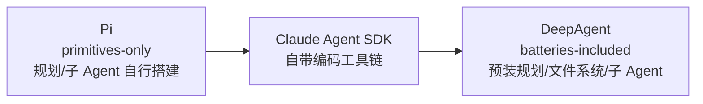
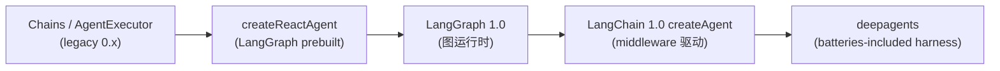
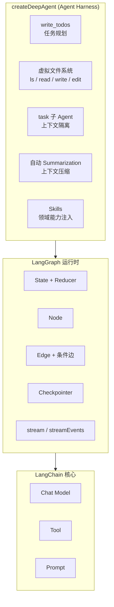

> 本文整理自《2026 前端 AI Agent 工程化实战营》课程资料，作为系列文章第 15 篇。

---
theme: channing-cyan
---

第十一章解决的是“让模型读懂业务知识”：通过 RAG，Agent 在回答前先检索资料。第十二章解决的是“让模型标准化地接入外部工具”：通过 MCP，工具不再硬编码在项目里。第十三章进一步把角色约束、工具说明、工作流、输出规范和质量标准沉淀成可复用的 Skill 资产。

但如果沿着第八章到第十三章一路实现下来，会发现大量代码并不直接属于业务逻辑，而是在反复搭建 Agent 运行时基础设施：

*   State 定义与 reducer
*   节点、边、条件分支和循环上限
*   工具绑定与 ToolNode 装配
*   Checkpointer 与线程状态
*   消息压缩和上下文管理
*   子图、Supervisor、Plan-and-Execute
*   `interrupt()` 与 `Command` 驱动的人工介入
*   Skill 加载、工具注册和运行时约束

这些部分共同构成了 Agent 的运行环境。每创建一个新 Agent，如果都从零装配一次，工程成本会快速上升。

本章的主角 `deepagents` SDK，解决的正是这一层问题。它不是新的大模型，也不是新的图原语，而是一套 **Agent Harness（运行时框架）**：把任务规划、虚拟文件系统、子 Agent 调度、上下文压缩、Skills 接入等通用能力，预装成一套默认中间件。开发者仍然提供业务工具和 system prompt，但不再需要为每个 Agent 重写同一套运行时脚手架。

> RAG 让模型**读懂知识**，MCP 让模型**调用工具**，Agents 让模型**自主执行**，Skills 把**方法资产化**，DeepAgent 则把这些能力组织成一套可复用的 **Agent Harness**。

本章先给出定位：DeepAgent 在 Agent Harness 谱系中处在哪一层，为什么有了现成 Agent 工具还需要 LangChain，为什么有了 LangChain 还需要 DeepAgent。随后进入最小可运行示例、产品调研 Agent、内置规划工具、虚拟文件系统、子 Agent 和 Skills 接入。

**本章验收点**

*   能在 Agent Harness 谱系中定位 DeepAgent，并区分 DeepAgent、Claude Agent SDK、Pi 的取舍
*   能说明“有了 Claude Agent SDK / Pi，为什么还需要 LangChain”
*   能说明“有了 LangChain，为什么还需要 DeepAgent”
*   能区分 `createReactAgent`、LangGraph `StateGraph`、`createDeepAgent` 的定位差异
*   理解 DeepAgent 的第一性原理：它没有引入新的图原语，而是把已有原语打包成默认中间件
*   跑通最小 DeepAgent 示例：`scripts/run-deepagent-hello.ts`
*   用“产品调研 Agent”场景观察 DeepAgent 相对 `createReactAgent` 的行为差异
*   理解三个核心内置能力：`write_todos`、虚拟文件系统、`task` 子 Agent
*   将第十三章的 `SKILL.md` 资产接入 DeepAgent，并理解为什么必须显式配置 `FilesystemBackend`
*   能区分本章演示内容、教学边界，以及留到第十五章的生产化内容
*   每个关键实现阶段都配有可直接用于生成代码的 Prompt，并标注对应测试用例

本章使用全新的“产品调研”场景做演示，**不修改第八、九章的需求分析代码**。DeepAgent 如何接入已有业务系统，将在第十五章展开。

**版本与运行假设**

本章基于当前仓库 `services/chat/package.json` 中的依赖组合编写：`deepagents` 为 `^1.10.2`，`@langchain/core` 为 `^1.1.41`，`@langchain/langgraph` 为 `^1.2.9`，`langchain` 为 `^1.2.37`。模型示例默认使用 `gpt-5.4`，可通过 `DEEPAGENT_MODEL` 或测试中的 `LLM_DEEPAGENT_TEST_MODEL` 覆盖。

文中涉及 `write_todos`、虚拟文件系统、`task`、`skills`、`FilesystemBackend` 的 API 和行为，均以这组依赖为准。后续升级 `deepagents` 或 LangChain / LangGraph 时，应优先复跑 14.9.3 的配套测试，再同步更新本章内容。

***

## 14.1 先看全景：Agent Harness 谱系


Agent Harness 的四类运行时要素：Guides、Sensors、Loop Control 与 Hardening

进入 DeepAgent 代码前，先把它放回 Agent 工具谱系中看。2026 年，Agent 产品和框架已经形成明显分层：有面向终端交互的 CLI，有面向编码任务的 SDK，也有面向通用长任务的运行时框架。DeepAgent 的位置，需要放在这张图里判断。

### 14.1.1 Harness Engineering：Agent = Model + Harness

过去几年，“如何让大模型把任务完成好”的工程重心经历了三次迁移：

| 阶段                  | 时期        | 关注点                          |
| ------------------- | --------- | ---------------------------- |
| Prompt Engineering  | 2022–2024 | 如何组织单次提示词，让一次回答更准确           |
| Context Engineering | 2025      | 如何把正确的信息放进上下文，包括 RAG、记忆和工具结果 |
| Harness Engineering | 2026      | 如何搭建模型外部的运行环境，让模型能自主推进长任务    |

到了 Harness Engineering 这一层，业界逐渐形成一个共识：

> **Agent = Model + Harness**。模型决定单次推理能力，harness 决定任务能否在真实环境中被规划、执行、观察、修正并最终交付。

一套 Agent Harness 通常包含四类要素：

| 要素                 | 作用               | 例子                                           |
| ------------------ | ---------------- | -------------------------------------------- |
| Guides（前馈）         | 在模型执行前提供方向、边界和方法 | `CLAUDE.md`、`AGENTS.md`、system prompt、Skills |
| Sensors（反馈）        | 让模型看见执行结果和质量信号   | lint、类型检查、测试结果、eval、工具返回                     |
| Loop Control（循环控制） | 驱动规划、工具调用、观察和修正  | ReAct loop、Plan-and-Execute、子 Agent 调度       |
| Hardening（加固）      | 控制风险、成本和权限       | 沙箱、审批、超时、预算、可观测性                             |

DeepAgent 的定位是：把这些长任务中最常见的运行时要素预装成默认中间件，让开发者从“搭建基础设施”转向“定义业务能力”。

### 14.1.2 三个 Harness 横向对比

把 DeepAgent 与 Claude Agent SDK、Pi 放在一起看，差异更清楚：

| 维度      | DeepAgent                                  | Claude Agent SDK                                          | Pi（pi.dev）              |
| ------- | ------------------------------------------ | --------------------------------------------------------- | ----------------------- |
| 定位      | 通用长任务 Agent Harness                        | 构建 Claude Code 式编码 Agent 的 SDK                            | 极简终端编码 Agent            |
| 运行方式    | 库，嵌入业务服务，底层运行在 LangGraph 上                 | 库，运行在自有进程或基础设施中                                           | 本地 CLI / 终端             |
| 模型支持    | provider 无关，依托 LangChain Chat Model        | 以 Claude 为核心，经 API / Bedrock / Vertex / Azure 使用          | provider 无关，支持多家模型和本地模型 |
| 设计哲学    | batteries-included，预装规划、文件系统、子 Agent、压缩等能力 | 内置完整编码工具链，如 Read / Write / Edit / Bash / Grep / WebSearch | primitives-only，尽量少内置能力 |
| 任务规划    | 内置 `write_todos`                           | 模型自决 + 内置 Plan 子代理                                        | 不内置                     |
| 子 Agent | 内置 `task` 工具，可声明专用 subagent                | 内置 subagents，偏编码场景                                        | 不内置                     |
| 上下文管理   | 自动 summarization + 虚拟文件系统                  | 自动 context 压缩 + Explore 子代理隔离上下文                          | 可定制 compaction          |
| 扩展机制    | middleware、tools、subagents、skills          | hooks、自定义工具、MCP、`.claude/agents`                          | extensions              |
| 与本书关系   | 本章主角                                       | 同类 Agent SDK 对照组                                          | 极简对照组                   |

读这张表，重点看两条主轴：

1.  **内置能力多少**：DeepAgent 和 Claude Agent SDK 都偏“开箱即用”，Pi 偏“只提供基础原语”。
2.  **绑定程度如何**：Claude Agent SDK 与 Claude 和编码场景绑定更强；DeepAgent 依托 LangChain，模型和业务场景都更开放。

### 14.1.3 设计哲学光谱



除了“内置多少”之外，还要看它是否能作为库嵌入业务系统：

*   **CLI 成品**：如 Pi，适合终端交互，不适合直接嵌入后端服务。
*   **可嵌入 SDK**：如 Claude Agent SDK、DeepAgent，可以 `import` 进业务服务并纳入测试、部署和观测体系。
*   **provider 无关的运行时**：DeepAgent 通过 LangChain Chat Model 支持不同模型供应商，更适合本书这种业务系统集成场景。

> DeepAgent 的取舍是：**内置多、面向通用长任务、可嵌入业务系统、模型供应商无关**。

***

## 14.2 三个关键问题

定位清楚后，还需要拆开三个问题：

1.  LangChain 自身为什么会演进到 DeepAgent 这一层？
2.  已经有 Claude Agent SDK / Pi，为什么还需要 LangChain？
3.  已经有 LangChain，为什么还需要 DeepAgent？

### 14.2.1 LangChain 自身的演进路径

DeepAgent 不是孤立出现的，它是 LangChain / LangGraph 生态持续抽象后的结果：



几个关键阶段：

1.  **Chains / `AgentExecutor`（0.x）**：早期通过链式封装串联 prompt、model、parser 和 tool。LangChain 1.0 后已属于 legacy 写法。
2.  **`createReactAgent`**：LangGraph 提供的预构建 ReAct 循环，第十三章使用的就是这种形态。
3.  **LangGraph 1.0**：把 Agent 执行抽象成显式图结构，包括 State、Node、Edge、条件边和 Checkpointer。
4.  **LangChain 1.0 `createAgent`**：引入 middleware 机制，把规划、记忆、压缩、人工介入等横切能力变成可插拔组件。
5.  **DeepAgent**：在 `createAgent` 和 LangGraph 之上，预装一组长任务常用中间件，形成可直接使用的 Agent Harness。

这条演进线解决的，是把重复脚手架从业务代码中抽离出来：先给图运行时，再给中间件机制，最后给一套默认装配好的运行时。

### 14.2.2 为什么有了 Claude Agent SDK / Pi，还需要 LangChain

Claude Agent SDK 和 Pi 都能构建 Agent，但它们的默认场景不同。

Pi 是 CLI 成品，适合在终端中交互式使用；要将它原样嵌入一个 NestJS 服务、接入自有权限系统、纳入单元测试和部署流水线，并不自然。

Claude Agent SDK 是可嵌入的库，但它的能力设计围绕 Claude Code 和编码任务展开，内置 Read / Write / Edit / Bash / Grep / WebSearch 等工具。对于非编码业务，例如需求分析、竞品调研、知识库问答、流程自动化，它仍然需要大量业务适配。

LangChain 的价值在于它是 **provider 无关、不预设业务场景的可编程地基**。同一套业务逻辑，可以根据复杂度选择不同粒度：

| 构建方式                   | 定位            | 需要手写什么                                          | 适合场景                     |
| ---------------------- | ------------- | ----------------------------------------------- | ------------------------ |
| `createReactAgent`     | 最小 ReAct 循环   | 工具列表 + prompt                                   | 工具少、流程短、无需复杂规划的任务        |
| LangGraph `StateGraph` | 底层图原语         | State / Node / Edge / 子图 / Checkpointer         | 需要精确控制每个节点、并行和汇合逻辑的复杂业务  |
| `createDeepAgent`      | Agent Harness | 工具列表 + prompt + 可选 subagents / skills / backend | 需要规划、上下文管理和子任务隔离的中等复杂度任务 |

> Claude Agent SDK 适合构建 Claude 驱动的编码 Agent；Pi 适合极简终端 Agent；LangChain 适合在自己的系统中、使用自己选择的模型，构建可测试、可部署、可治理的业务 Agent。

### 14.2.3 有了 LangChain，为什么还需要 DeepAgent

第八章到第十三章已经用 LangChain / LangGraph 手写过许多运行时能力：

| 章节   | 手写内容                                                              | 用途               |
| ---- | ----------------------------------------------------------------- | ---------------- |
| 8.3  | `RequirementAnalysisState`、`Annotation.Root`、`MessagesAnnotation` | 共享状态定义           |
| 8.4  | `classifierNode`、`addConditionalEdges`                            | 运行时路由            |
| 8.5  | `agentNode → ToolNode → agentNode` 循环                             | ReAct 工具调用循环     |
| 8.6  | `actorNode → criticNode → refineNode`                             | 质量闭环             |
| 8.7  | Checkpointer、`interrupt()`、`streamMode: "updates"`                | 持久化、人工介入、流式输出    |
| 9.2  | Supervisor、专家工厂、aggregator                                        | Multi-Agent 协作   |
| 9.5  | `plannerNode → executorNode → evaluatorNode → reflectorNode`      | Plan-and-Execute |
| 13.8 | `loadSkill`、`DynamicStructuredTool`、`createReactAgent`            | Skills 按需加载      |

LangChain 1.0 的 `createAgent` 提供了 middleware 机制，但机制本身不等于完整运行时。规划、文件系统、子 Agent、上下文压缩、Skills 加载等能力仍然需要选择、配置和装配。

DeepAgent 的作用，是把这一组长任务高频能力预装为默认中间件：



`createDeepAgent` 返回的仍然是一个编译后的 LangGraph 图，因此可以继续使用 `invoke()`、`stream()`、`streamEvents()`、Checkpointer 和 LangSmith trace。DeepAgent 并没有替代 LangGraph，而是在 LangGraph 之上给出一套默认装配。

> `createAgent` 提供 middleware 机制，DeepAgent 提供一组已经装配好的 middleware 默认值。前者是框架能力，后者是长任务运行时模板。

***

## 14.3 DeepAgent 的主要功能


DeepAgent 默认装配：规划、文件系统、子 Agent、摘要压缩与 Skills 统一进入运行时框架

`createDeepAgent` 默认提供五类能力，它们分别对应前面章节中手写过的机制：

| 内置能力             | 对应章节                         | DeepAgent 提供的能力                                                                       |
| ---------------- | ---------------------------- | ------------------------------------------------------------------------------------- |
| `write_todos`    | 9.5 plannerNode              | 让模型拆解任务、记录步骤、更新进度                                                                     |
| 虚拟文件系统           | 第十章 Token 经济学                | `ls` / `read_file` / `write_file` / `edit_file` / `glob` / `grep`，把中间产物从 messages 中移出 |
| `task` 子 Agent   | 9.2 Supervisor + 9.4 Handoff | 主 Agent 可把子任务委托给独立上下文的子 Agent                                                         |
| 自动 Summarization | 第十章上下文压缩                     | 消息过长时自动压缩历史，保留最近消息和摘要                                                                 |
| Smart Defaults   | 8.2 Agent 基础概念               | 内置 prompt 引导模型正确使用规划、文件系统和子 Agent                                                     |

这些能力都通过 **Middleware** 实现。每个 middleware 可以完成三类工作：

1.  向 Agent 注入工具，例如 `write_todos`、`read_file`
2.  在模型调用或工具调用前后插入逻辑，例如 summarization
3.  向 State 增加字段，例如 `todos`、`files`

默认中间件如下：

| 中间件                       | 注入或提供的能力                                                          |
| ------------------------- | ----------------------------------------------------------------- |
| `TodoListMiddleware`      | `write_todos`                                                     |
| `FilesystemMiddleware`    | `ls` / `read_file` / `write_file` / `edit_file` / `glob` / `grep` |
| `SubAgentMiddleware`      | `task`                                                            |
| `SummarizationMiddleware` | 自动上下文压缩，不注入工具                                                     |

按需启用的中间件：

| 中间件                        | 启用条件                |
| -------------------------- | ------------------- |
| `SkillsMiddleware`         | 传入 `skills` 参数      |
| `MemoryMiddleware`         | 传入 `memory` 参数      |
| `HumanInTheLoopMiddleware` | 传入 `interruptOn` 参数 |

这三个按需中间件的简要定位如下，其中 `MemoryMiddleware` 和 `HumanInTheLoopMiddleware` 的完整用法留到第十五章：

*   `SkillsMiddleware`：扫描 `skills` 目录中的 `SKILL.md`，按需把领域能力注入上下文（见 14.9）。
*   `MemoryMiddleware`：在多次会话（跨 thread）之间保留长期记忆，区别于 `SummarizationMiddleware` 只压缩当前会话的历史。
*   `HumanInTheLoopMiddleware`：在指定工具调用前插入人工审批，对应第八章手写的 `interrupt()` / `Command`。

需要注意：DeepAgent 没有引入新的 LangGraph 原语。`write_todos` 是一个普通 Tool，虚拟文件系统是一组文件工具，`task` 是在主 Agent 内部启动子 Agent。第八、九章讲过的 State、Node、Edge、条件边和子图，仍然是底层实现。

### 14.3.1 `createDeepAgent` 参数速查

为方便后文查阅，先把本章用到的主要参数集中如下：

| 参数             | 类型 / 取值                            | 作用                         | 出现小节        |
| -------------- | ---------------------------------- | -------------------------- | ----------- |
| `model`        | LangChain Chat Model               | 底层推理模型，provider 无关         | 14.4        |
| `tools`        | Tool\[]                            | 业务工具，与内置工具合并               | 14.4 / 14.5 |
| `systemPrompt` | string                             | 业务提示词，与内置 prompt 组合（见下）    | 14.4        |
| `subagents`    | SubAgent\[]                        | 声明专用子 Agent                | 14.8        |
| `skills`       | string\[]（目录路径）                    | Skill 目录，配合 backend 使用     | 14.9        |
| `backend`      | StateBackend / FilesystemBackend … | 虚拟文件系统后端，默认 `StateBackend` | 14.7 / 14.9 |
| `memory`       | 启用 `MemoryMiddleware`              | 跨会话长期记忆（第十五章）              | 第十五章        |
| `interruptOn`  | 启用 `HumanInTheLoopMiddleware`      | 工具调用前人工审批（第十五章）            | 第十五章        |
| `checkpointer` | boolean / Checkpointer             | 持久化与断点续跑（第十五章）             | 第十五章        |
| `middleware`   | Middleware\[]                      | 追加自定义中间件                   | —           |

> 关于 `systemPrompt`：你传入的业务 prompt **不会覆盖**内置 prompt，而是与之**组合**——DeepAgent 先提供引导模型使用规划、文件系统和子 Agent 的内置基础 prompt，再拼接你的业务 prompt。因此当业务 prompt 出现“直接回答、不要调用工具”这类指令时，可能与内置规划引导冲突，导致 `write_todos` 不被触发（参见 14.6.2）。

***

## 14.4 最小 DeepAgent：30 行跑通

### 14.4.1 安装依赖

```bash
cd services/chat && bun add deepagents
```

`deepagents` 会带上 `langchain`、`@langchain/core`、`@langchain/langgraph` 等核心依赖。项目中已有的 `@langchain/openai` 可以直接复用。

### 14.4.2 Hello World

先创建一个最小示例，验证 `createDeepAgent` 能正常工作。

*   生成代码 Prompt：Hello World 脚本

        在 services/chat/scripts/ 下创建 run-deepagent-hello.ts：

        1. 加载 .env
        2. 使用 createDeepAgent 创建最小 Agent
        3. model 使用 ChatOpenAI，读取 OPENAI_BASE_URL，默认模型为 gpt-5.4，可通过 DEEPAGENT_MODEL 覆盖
        4. 自定义工具 get_weather：接收 city 参数，返回固定天气字符串
        5. systemPrompt 设为“你是一个天气助手”
        6. invoke 输入“北京今天天气怎么样？”
        7. 打印最终回复、todos 和 files

        约束：
        - 工具使用 DynamicStructuredTool 包装，和第十三章 run-skill-demo.ts 保持一致

        验证：
        - bun run scripts/run-deepagent-hello.ts 能正常输出

```tsx
import { createDeepAgent } from 'deepagents';
import { ChatOpenAI } from '@langchain/openai';
import { DynamicStructuredTool } from '@langchain/core/tools';
import { z } from 'zod';
import { config } from 'dotenv';

config({ path: new URL('../.env', import.meta.url).pathname });

const getWeather = new DynamicStructuredTool({
  name: 'get_weather',
  description: '获取指定城市的天气',
  schema: z.object({ city: z.string().describe('城市名') }),
  func: async ({ city }) => `${city}：晴，28°C，微风`,
});

const agent = createDeepAgent({
  model: new ChatOpenAI({
    model: process.env.DEEPAGENT_MODEL || 'gpt-5.4',
    temperature: 0,
    configuration: { baseURL: process.env.OPENAI_BASE_URL },
  }),
  tools: [getWeather],
  systemPrompt: '你是一个天气助手。用户问天气时，调用 get_weather 工具获取数据。',
});

const result = await agent.invoke({
  messages: [{ role: 'user', content: '北京今天天气怎么样？' }],
});

const lastMsg = result.messages[result.messages.length - 1];
console.log('回复:', lastMsg.content);
console.log('todos:', JSON.stringify(result.todos ?? [], null, 2));
console.log('files:', Object.keys(result.files ?? {}));
```

一次典型输出：

    回复: 北京今天天气：晴，28°C，微风。
    todos: []
    files: []

### 14.4.3 这个最小示例说明了什么

即使任务很短，DeepAgent 也已经完成了以下装配：

1.  注入 `write_todos` 工具
2.  注入文件系统工具
3.  注入内置 system prompt，引导模型使用规划、文件系统和子 Agent
4.  准备好 summarization 机制

但在天气查询这类简单任务中，模型通常会直接调用业务工具并返回结果，不会生成 todos，也不会写文件。这是合理行为：DeepAgent 提供能力，不强制每个任务都使用全部能力。

***

## 14.5 第一个有用的 DeepAgent：产品调研 Agent

天气查询无法体现 DeepAgent 的差异。更能暴露问题的场景是“产品调研”：

> 调研中小团队项目管理工具竞品，分析主要竞品的功能、定价、优劣势，输出一份竞品分析报告。

这个任务会同时暴露三类需求：

1.  **需要规划**：先搜集竞品信息，再分析对比，最后形成报告。
2.  **中间产物多**：每个竞品的信息需要暂存，不能全部堆在 messages 中。
3.  **可以拆子任务**：不同竞品的分析可以交给子 Agent 独立完成。

它们正好对应 DeepAgent 的 `write_todos`、虚拟文件系统和 `task` 子 Agent。

### 14.5.1 代码实现

本节复用第十三章的 Python 工具脚本，通过 `callPythonTool` 包装为 LangChain Tool。

*   生成代码 Prompt：调研 Demo 脚本

        在 services/chat/scripts/ 下创建 run-deepagent-research-demo.ts：

        1. 加载 .env
        2. 复用第十三章的 Python 工具包装模式：
           - callPythonTool
           - child_process.execSync + stdin JSON
        3. 注册工具：
           - search_competitors，对应 competitor-research/scripts/search_competitors.py
           - search_best_practices，对应 competitor-research/scripts/search_best_practices.py
        4. 使用 createDeepAgent 创建 Agent：
           - model: ChatOpenAI
           - 读取 OPENAI_BASE_URL
           - 默认模型 gpt-5.4，可通过 DEEPAGENT_MODEL 覆盖
           - systemPrompt: 产品调研分析师
           - tools: 上面的工具
        5. invoke 输入：调研中小团队项目管理工具竞品
        6. 打印：
           - Agent 最终输出
           - 工具调用链
           - 输出长度

        约束：
        - 不修改第八、九章代码
        - 不修改第十三章 SKILL.md 和 Python 脚本
        - Python 工具脚本路径指向 src/skills/definitions/competitor-research/scripts/

```tsx
import { createDeepAgent } from 'deepagents';
import { ChatOpenAI } from '@langchain/openai';
import { DynamicStructuredTool } from '@langchain/core/tools';
import { z } from 'zod';
import { execSync } from 'child_process';
import { join } from 'path';
import { config } from 'dotenv';

config({ path: new URL('../.env', import.meta.url).pathname });

const SKILLS_DIR = join(import.meta.dir, '../src/skills/definitions');

function callPythonTool(skillName: string, scriptName: string, input: Record<string, unknown>): string {
  const scriptPath = join(SKILLS_DIR, skillName, 'scripts', scriptName);
  return execSync(`python3 "${scriptPath}"`, {
    input: JSON.stringify(input),
    encoding: 'utf-8',
  }).trim();
}

const searchCompetitors = new DynamicStructuredTool({
  name: 'search_competitors',
  description: '搜索竞品信息，返回竞品名称、定位、定价等关键信息。',
  schema: z.object({ query: z.string().describe('搜索关键词') }),
  func: async ({ query }) =>
    callPythonTool('competitor-research', 'search_competitors.py', { query }),
});

const searchBestPractices = new DynamicStructuredTool({
  name: 'search_best_practices',
  description: '搜索行业最佳实践和常见做法。',
  schema: z.object({ topic: z.string().describe('搜索主题') }),
  func: async ({ topic }) =>
    callPythonTool('competitor-research', 'search_best_practices.py', { topic }),
});

const model = new ChatOpenAI({
  model: process.env.DEEPAGENT_MODEL || 'gpt-5.4',
  temperature: 0,
  configuration: { baseURL: process.env.OPENAI_BASE_URL },
});

const agent = createDeepAgent({
  model,
  tools: [searchCompetitors, searchBestPractices],
  systemPrompt: '你是一位产品调研分析师。你的任务是调研竞品信息，并输出结构清晰、可用于产品决策的竞品分析报告。',
});

const result = await agent.invoke({
  messages: [
    {
      role: 'user',
      content: '调研中小团队项目管理工具竞品，我们想做一个轻量级项目管理工具。',
    },
  ],
});

const toolCalls = result.messages
  .filter((m: any) => m.tool_calls?.length > 0)
  .flatMap((m: any) => m.tool_calls.map((tc: any) => tc.name));

const output = result.messages[result.messages.length - 1].content.toString();
console.log(`调用链: ${toolCalls.join(' → ')}`);
console.log(output);
```

这一版只注册业务工具，暂不接入 Skills。它对应配套测试中的 Layer 2 端到端用例。

工具调用顺序不应写成固定预期。更可靠的观察点是：复杂任务中模型通常会先调用 `write_todos` 拆解任务，再调用业务工具，并在过程中更新进度。

典型调用链形态：

    write_todos → search_competitors → search_best_practices → write_todos → write_todos

调用次数会随模型、提示词和工具返回内容变化；需要关注的是“先规划、再执行、过程中更新计划”这一行为形态。

### 14.5.2 对比：`createReactAgent` vs `createDeepAgent`

| 维度    | `createReactAgent` | `createDeepAgent`           |
| ----- | ------------------ | --------------------------- |
| 任务规划  | 模型直接进入工具调用，没有显式计划  | 模型可先调用 `write_todos` 拆解步骤   |
| 中间产物  | 全部进入 messages，容易膨胀 | 可通过 `write_file` 写入虚拟文件系统   |
| 上下文管理 | 不内置压缩机制            | 内置 summarization            |
| 子任务隔离 | 所有步骤共享同一上下文        | 可通过 `task` 委托给独立上下文的子 Agent |
| 适合任务  | 短任务、工具少、流程简单       | 多步骤、上下文较长、可拆分的任务            |

**边界**：DeepAgent 不适合替代所有 Agent。天气查询、简单分类、单工具调用，使用 `createReactAgent` 已经足够。只有当任务需要规划、上下文管理或子任务隔离时，DeepAgent 的优势才明显。

***

## 14.6 任务规划：`write_todos`

### 14.6.1 机制

`write_todos` 是由 `TodoListMiddleware` 注入的普通 LangChain Tool。模型可以在执行过程中多次调用它，维护当前任务计划。

典型输入：

```tsx
{
  todos: [
    { id: "1", content: "搜索主要竞品", status: "in_progress" },
    { id: "2", content: "收集竞品功能和定价", status: "pending" },
    { id: "3", content: "对比分析", status: "pending" },
    { id: "4", content: "撰写报告", status: "pending" },
  ]
}
```

其中 `status` 的合法取值为三个：`pending`（待办）、`in_progress`（进行中）、`completed`（已完成）。约定上同一时刻最多只有一个 todo 处于 `in_progress`。

模型通常会在三个时机调用它：

1.  **初始规划**：把用户目标拆成多个可执行步骤。
2.  **进度更新**：完成一步后把状态改为 `completed`，并把下一步置为 `in_progress`。
3.  **计划调整**：发现新信息后增加、删除或修改步骤。

### 14.6.2 对照第九章 `plannerNode`

| 维度   | 第九章 `plannerNode`           | DeepAgent `write_todos`    |
| ---- | --------------------------- | -------------------------- |
| 规划时机 | 图中的固定第一个节点                  | 模型可在任意时刻调用                 |
| 规划格式 | 通过 Zod schema 强制结构          | 半结构化 todo 列表               |
| 进度追踪 | 手写 `currentStepIndex` 等状态字段 | 模型自行更新 todo status         |
| 计划修订 | 需要显式 reflector 节点           | 模型可再次调用 `write_todos` 覆盖计划 |
| 控制强度 | 强，路径可控                      | 中，依赖模型遵循内置 prompt          |

**边界**：`write_todos` 是引导式规划，不是强制流程。DeepAgent 的内置 prompt 会鼓励模型在复杂任务中先规划，但如果业务 prompt 明确要求“直接回答，不调用工具”，模型可能跳过规划。任务过于简单时跳过规划也是合理行为。

### 14.6.3 验收方式

运行调研 demo 后，观察工具调用链是否出现 `write_todos`。如果没有出现，可按以下顺序排查：

1.  任务是否过于简单，模型判断不需要规划
2.  业务 system prompt 是否与内置规划引导冲突
3.  当前模型是否稳定支持 tool calling
4.  是否需要在业务 prompt 中明确写入“先使用 `write_todos` 制定计划”

***

## 14.7 虚拟文件系统：长任务的草稿纸


虚拟文件系统把长任务中的中间产物从对话上下文迁移到可读写文件中

### 14.7.1 为什么需要文件系统

第十章讲 Token 经济学时已经讨论过：上下文窗口不是无限资源。一个产品调研任务如果分析 5 个竞品，每个竞品产生 2000 字信息，全部放在 messages 中会带来三个问题：

1.  token 成本随轮次线性增长
2.  模型注意力被大量中间信息稀释
3.  接近上下文窗口上限时触发截断或报错

DeepAgent 的虚拟文件系统提供了一个中间层：把阶段性资料写入文件，需要时再读取。这样 messages 中保留执行轨迹，文件系统保存中间产物。

> **如何量化收益**：本章的对比多为定性描述。若要拿到实际数字，可在同一调研任务上分别用 `createReactAgent` 和 `createDeepAgent` 跑一遍，从 LangSmith trace 或回调中读取每轮的 prompt tokens，对比“总 token 数 / 轮次 / 成本”。通常竞品越多、中间产物越大，文件系统对上下文的节省越明显。这与第十章的成本拆账方法一致。

### 14.7.2 六个内置工具

| 工具           | 用途       | 类比           |
| ------------ | -------- | ------------ |
| `ls`         | 列出目录内容   | shell `ls`   |
| `read_file`  | 读取文件     | shell `cat`  |
| `write_file` | 创建或覆盖文件  | shell `>`    |
| `edit_file`  | 编辑文件局部内容 | shell `sed`  |
| `glob`       | 按模式匹配文件  | shell `find` |
| `grep`       | 在文件中搜索内容 | shell `grep` |

`FilesystemMiddleware` 内部还可以注入 `execute` 工具，但只有后端支持命令执行时才会启用。本章使用的默认 `StateBackend` 和后文的 `FilesystemBackend` 都不启用 `execute`，因此实际可见的是上表六个文件工具。

### 14.7.3 默认后端：StateBackend

默认情况下，DeepAgent 使用 `StateBackend` 存储虚拟文件。它是内存态的、线程隔离的，只在当前 Agent 执行期间存在。

    Agent 执行期间的虚拟文件系统

    /competitors/
      asana.md
      trello.md
      linear.md

    /report.md

文件系统的典型使用方式：

1.  搜集 Asana 信息 → 写入 `/competitors/asana.md`
2.  搜集 Trello 信息 → 写入 `/competitors/trello.md`
3.  搜集 Linear 信息 → 写入 `/competitors/linear.md`
4.  汇总时读取上述文件
5.  生成 `/report.md`

是否使用文件系统由模型决定。短任务通常不会写文件；任务越长、中间产物越多，越容易触发文件工具。

**边界**：虚拟文件系统解决的是 Agent 执行期间的上下文管理，不是业务数据持久化。执行结束后，如果需要保存报告或中间文件，应由应用层将结果写入数据库、对象存储或业务系统。

### 14.7.4 文件系统验收方式

调研 demo 不能保证模型一定使用文件系统。要稳定验证文件系统，应在用户输入中明确要求写文件：

```tsx
const result = await agent.invoke({
  messages: [{
    role: 'user',
    content: [
      '调研中小团队项目管理工具竞品。',
      '要求：',
      '1. 先把 Asana、Trello、Linear 的竞品资料分别写入 /competitors/asana.md、/competitors/trello.md、/competitors/linear.md。',
      '2. 再读取这些文件，汇总成一份竞品分析报告。',
      '3. 最终回答里列出你写入过的文件路径。',
    ].join('\n'),
  }],
});
```

验收点：

1.  工具调用链中出现 `write_file` 和 `read_file`
2.  `Object.keys(result.files ?? {})` 包含三个目标路径
3.  最终报告使用了文件中的内容，而不是只复述搜索结果

### 14.7.5 自动 Summarization：与文件系统互补的上下文管理

虚拟文件系统是“主动”的上下文管理：由模型决定把什么写进文件、什么时候读回来。`SummarizationMiddleware` 则是“被动”的兜底：当消息历史增长到阈值时，自动把较早的消息压缩成摘要，只保留摘要加最近若干条原始消息。两者互补——文件系统决定哪些中间产物不进上下文，summarization 负责在历史仍然变长时防止超出窗口。

它的关键行为：

1.  **触发条件**：按消息历史的 token 规模触发，而不是固定轮次。未达阈值时不会压缩。
2.  **保留策略**：保留最近的消息原文，并用一段摘要替换更早的历史，从而保住近期上下文的精度。
3.  **对工具的影响**：它不注入任何工具，对模型是透明的；调用链里看不到它。
4.  **可配置性**：触发阈值、保留消息数、用于生成摘要的模型等通常可通过中间件参数覆盖。具体可配置项随 `deepagents` 版本变化，应以 14.9.3 的配套测试和当前版本文档为准。

**与第十章的关系**：第十章手写过消息裁剪 / 压缩逻辑，`SummarizationMiddleware` 把这一层变成默认能力。但它只压缩“当前会话”的历史；跨会话的长期记忆属于 `MemoryMiddleware`（第十五章）。

**验收方式**：summarization 在短任务中不会触发，难以稳定复现。要观察它，可构造一个工具返回内容很长、且需要多轮调用的任务，运行后对比压缩前后 messages 的长度与条数；或在中间件配置中调低触发阈值，再检查历史是否被替换为摘要。

***

## 14.8 Subagent：`task` 工具


主 Agent 将子任务委托给多个独立子 Agent，并汇总返回结果

### 14.8.1 为什么需要子 Agent

在产品调研任务中，每个竞品都可能需要多次工具调用、资料整理和判断。如果全部在主 Agent 的 messages 中完成，会出现三个问题：

1.  **上下文膨胀**：多个竞品的分析过程都进入主上下文。
2.  **信息干扰**：后续竞品分析会被前面竞品的细节污染。
3.  **失败传播**：单个子任务错误可能影响主任务继续推进。

DeepAgent 的 `task` 工具用于解决这个问题：主 Agent 将子任务委托给子 Agent，子 Agent 在独立上下文中执行，并将结果摘要返回给主 Agent。

### 14.8.2 两种子 Agent 声明方式

**方式一：使用默认通用子 Agent**

不传 `subagents` 参数时，DeepAgent 会提供通用子 Agent，主 Agent 可直接通过 `task` 委托任务：

```tsx
const agent = createDeepAgent({
  model,
  tools: [searchCompetitors, searchBestPractices],
  systemPrompt: '你是产品调研分析师。',
});
```

**方式二：声明专用子 Agent**

```tsx
import { type SubAgent } from 'deepagents';

const competitorAnalyst: SubAgent = {
  name: 'competitor-analyst',
  description: '对单个竞品进行功能、定价和适用场景分析',
  systemPrompt: '你是竞品分析专家。请对指定竞品进行功能拆解、定价模型分析和优劣势评估。',
  tools: [searchCompetitors, searchBestPractices],
};

const agent = createDeepAgent({
  model,
  tools: [searchCompetitors, searchBestPractices],
  subagents: [competitorAnalyst],
  systemPrompt: '你是产品调研分析师。需要深入分析单个竞品时，委托给 competitor-analyst。',
});
```

关于子 Agent 还有两点需要说明：

*   **工具继承**：声明专用 `SubAgent` 时，它使用自己 `tools` 字段里列出的工具；如示例中 `competitor-analyst` 显式获得了两个搜索工具。若不显式声明，子 Agent 能用哪些工具取决于 SDK 默认策略，建议总是为子 Agent 显式声明所需工具，避免依赖隐式继承。
*   **执行方式**：`task` 默认是**串行**委托——主 Agent 发起一次子任务、拿到摘要后再发起下一次。若需要并行委托，应以当前 `deepagents` 版本的能力为准，不要假设默认并行。

### 14.8.3 `task` 的验收方式

与虚拟文件系统类似，`task` 不一定在普通任务中自动触发。要稳定验证，应把任务设计成天然可拆分：

```tsx
const result = await agent.invoke({
  messages: [{
    role: 'user',
    content: [
      '请调研 Asana 和 Trello 两个项目管理工具。',
      '要求：',
      '1. 分别委托子 Agent 分析 Asana 和 Trello 的功能、定价、适合团队类型。',
      '2. 主 Agent 只负责汇总两个子 Agent 的结论。',
      '3. 最终输出一个对比报告。',
    ].join('\n'),
  }],
});
```

验收点：

1.  工具调用链中出现 `task`
2.  如果声明了 `competitor-analyst`，检查 `task` 入参是否选择该子 Agent
3.  主 Agent 的 messages 中只保留子任务结果，不包含子 Agent 的完整执行过程

### 14.8.4 对照第九章 Supervisor

| 维度         | 第九章 Supervisor + 专家               | DeepAgent `task`    |
| ---------- | --------------------------------- | ------------------- |
| 子 Agent 声明 | 手写 `createExpertSubGraph` 工厂并装配主图 | 通过 `subagents` 声明   |
| 调度方式       | Supervisor 节点根据状态分发               | 模型在执行过程中按需调用 `task` |
| 并行能力       | 可通过图路由并发分发                        | 默认串行委托              |
| 上下文隔离      | 依赖子图和 State 设计                    | 子 Agent 天然使用独立上下文   |
| 适合场景       | 专家集合固定、需要精确控制并行与汇合                | 子任务类型动态、需要按需委托      |

两者不是替代关系。固定多专家并行适合 LangGraph `StateGraph`；动态委托适合 DeepAgent `task`。第十五章会展示如何把已有 LangGraph 图作为 DeepAgent 的子 Agent 接入。

***

## 14.9 把第十三章的 Skills 接入 DeepAgent

第十三章用 `createReactAgent` + 手写 `load_skill` 工具演示了 Skills 按需加载。DeepAgent 内置 `SkillsMiddleware`，可以直接扫描 `SKILL.md` 目录，不再需要手写 `load_skill` 工具。

### 14.9.1 接入方式

```tsx
import { createDeepAgent, FilesystemBackend } from 'deepagents';
import { join } from 'path';

const SKILLS_DIR = join(import.meta.dir, '../src/skills/definitions');

const agent = createDeepAgent({
  model,
  tools: [searchCompetitors, searchBestPractices, analyzeCompleteness, estimateComplexity],
  backend: new FilesystemBackend({ rootDir: '/' }),
  skills: [SKILLS_DIR],
  systemPrompt: '你是一位产品调研分析师。需要专业能力时，可以加载对应 skill，并输出结构清晰的分析报告。',
});
```

`skills` 参数接收目录路径数组。DeepAgent 会：

1.  扫描目录下的 Skill 子目录
2.  读取每个子目录中的 `SKILL.md` frontmatter
3.  将 `name` 和 `description` 注入 skill 索引
4.  在任务需要时读取完整 `SKILL.md` 内容

每个 Skill 子目录下的 `SKILL.md` 顶部都是一段 YAML frontmatter，最小形态如下：

```markdown
---
name: competitor-research
description: 调研竞品功能、定价与优劣势，输出竞品分析报告
allowed-tools:
  - search_competitors
  - search_best_practices
---

# 竞品调研方法
（这里是供模型按需读取的完整方法说明……）
```

DeepAgent 先只把 `name` 和 `description` 放进索引，只有当任务匹配到该 Skill 时才读取正文，从而避免一次性把所有 Skill 内容塞进上下文。

**关键点：必须显式传入 `FilesystemBackend`。**

DeepAgent 的 Skill 加载依赖 backend。默认 `StateBackend` 是内存态，对操作系统磁盘上的 `SKILL.md` 不可见。如果只传 `skills: [SKILLS_DIR]`，但不传 `FilesystemBackend`，Skill 目录可能不会被正确加载。

教学 demo 使用：

```tsx
backend: new FilesystemBackend({ rootDir: '/' })
```

这是为了让绝对路径 `SKILLS_DIR` 能被 backend 访问。生产环境不应直接暴露系统根目录，而应将 `rootDir` 限定到明确的工作目录或 Skill 根目录，并只开放 Agent 完成任务所需的路径。

### 14.9.2 对照第十三章

| 维度              | 第十三章 Custom Pattern               | 第十四章 DeepAgent Skills         |
| --------------- | --------------------------------- | ----------------------------- |
| `load_skill` 工具 | 手写 `DynamicStructuredTool`        | SDK 自动处理 Skill 发现和读取          |
| Skill 发现        | 硬编码在工具 description 或 middleware 中 | 扫描目录中的 `SKILL.md` frontmatter |
| 新增 Skill        | 修改 skill 索引和工具描述                  | 新增目录和 `SKILL.md`              |
| Python 工具注册     | 需要显式注册                            | 仍然需要显式注册                      |
| 适合场景            | Skill 数量少、希望完全掌控加载逻辑              | Skill 目录规范化、希望由 SDK 管理加载      |

**边界**：`skills` 只负责 Skill 发现和加载，不负责自动创建业务工具。`SKILL.md` 中的 `allowed-tools` 是声明性引用，应用层仍然要把对应工具注册到 `tools` 参数中。

### 14.9.3 完整调研 Agent（含 Skills）

```tsx
import { createDeepAgent, FilesystemBackend } from 'deepagents';
import { ChatOpenAI } from '@langchain/openai';
import { DynamicStructuredTool } from '@langchain/core/tools';
import { z } from 'zod';
import { execSync } from 'child_process';
import { join } from 'path';

const SKILLS_DIR = join(import.meta.dir, '../src/skills/definitions');

function callPythonTool(skillName: string, scriptName: string, input: Record<string, unknown>): string {
  return execSync(`python3 "${join(SKILLS_DIR, skillName, 'scripts', scriptName)}"`, {
    input: JSON.stringify(input),
    encoding: 'utf-8',
  }).trim();
}

const tools = [
  new DynamicStructuredTool({
    name: 'search_competitors',
    description: '搜索竞品信息，返回竞品名称、定位、定价等关键信息。',
    schema: z.object({ query: z.string() }),
    func: async ({ query }) =>
      callPythonTool('competitor-research', 'search_competitors.py', { query }),
  }),
  new DynamicStructuredTool({
    name: 'search_best_practices',
    description: '搜索行业最佳实践和常见做法。',
    schema: z.object({ topic: z.string() }),
    func: async ({ topic }) =>
      callPythonTool('competitor-research', 'search_best_practices.py', { topic }),
  }),
  new DynamicStructuredTool({
    name: 'analyze_completeness',
    description: '分析需求描述的完整性，从六个维度检查是否缺少关键信息。',
    schema: z.object({ requirementText: z.string() }),
    func: async ({ requirementText }) =>
      callPythonTool('requirement-analysis', 'analyze_completeness.py', { requirementText }),
  }),
  new DynamicStructuredTool({
    name: 'estimate_complexity',
    description: '估算需求的技术复杂度，返回 T-shirt size 和预计工期。',
    schema: z.object({ requirementText: z.string() }),
    func: async ({ requirementText }) =>
      callPythonTool('requirement-analysis', 'estimate_complexity.py', { requirementText }),
  }),
];

const agent = createDeepAgent({
  model: new ChatOpenAI({
    model: process.env.DEEPAGENT_MODEL || 'gpt-5.4',
    temperature: 0,
    configuration: { baseURL: process.env.OPENAI_BASE_URL },
  }),
  tools,
  backend: new FilesystemBackend({ rootDir: '/' }),
  skills: [SKILLS_DIR],
  systemPrompt: '你是一位产品调研分析师。需要专业能力时，可以加载对应 skill；输出可用于产品决策的竞品分析报告。',
});
```

接入 Skills 后，调用链通常会多出一次 `read_file`，用于读取匹配 Skill 的 `SKILL.md`。典型调用链：

    read_file → write_todos → search_competitors → search_best_practices → write_todos

这里的 `read_file` 证明 `FilesystemBackend + skills` 配置已经生效。

**配套测试**

`services/chat/test/chapter14-deepagent.spec.ts` 按第十三章的 Layer 1 / Layer 2 分层方式组织：

| 分层      | 验证点                         | 预期                                                                |
| ------- | --------------------------- | ----------------------------------------------------------------- |
| Layer 1 | Python 工具 JSON in/out       | `search_competitors` 返回多个竞品，`search_best_practices` 返回最佳实践        |
| Layer 1 | `listSkills` 解析 frontmatter | 能解析 `competitor-research`、`requirement-analysis`，且 description 非空 |
| Layer 1 | `createDeepAgent` 创建 Agent  | 最小配置、`FilesystemBackend`、`skills` 配置均能创建可 invoke 的对象              |
| Layer 2 | 调研 Agent 端到端                | Agent 调用 `search_competitors`，输出包含“竞品/项目管理”，长度大于 300              |

运行方式：

```bash
cd services/chat

# Layer 1：零 LLM 依赖
bun test test/chapter14-deepagent.spec.ts

# Layer 2：调用真实模型
RUN_LLM_DEEPAGENT_TESTS=1 bun test test/chapter14-deepagent.spec.ts
```

Layer 2 默认跳过，只有设置 `RUN_LLM_DEEPAGENT_TESTS=1` 时才调用真实模型，避免本地缺少模型权限导致测试失败。


***

## 14.10 DeepAgent 换来了什么

把第八章到第十三章的手写机制与 DeepAgent 内置能力对齐，可以得到下面这张表：

| 前面章节手写机制                                            | DeepAgent 内置能力                    | 是否仍需手写                    |
| --------------------------------------------------- | --------------------------------- | ------------------------- |
| `plannerNode`  • `PlanStep[]`  • `currentStepIndex` | `write_todos`                     | 常规长任务不需要；需要强控制时仍可手写       |
| `agentNode → ToolNode → agentNode` ReAct 循环         | 内置 tool-calling loop              | 不需要                       |
| 消息压缩逻辑                                              | `SummarizationMiddleware`         | 不需要手写基础压缩                 |
| `createExpertSubGraph`  • Supervisor                | `task`  • `SubAgent` 声明           | 动态委托可不写；固定并行仍适合 LangGraph |
| `load_skill` 工具 + skill 索引                          | `SkillsMiddleware`  • `skills` 目录 | 不需要手写加载工具；业务工具仍需注册        |
| Checkpointer 配置                                     | `checkpointer: true` 等配置          | 基础能力不需要手写                 |
| `interrupt()`  • `Command`                          | `interruptOn` 声明式配置               | 常规 HITL 不需要手写底层流程         |
| `streamMode: "updates"` / `streamEvents`            | 继承 LangGraph 原生能力                 | 用法保持一致                    |

**边界声明**

*   DeepAgent 不是新的图原语，而是预装中间件集合。
*   DeepAgent 适合中等复杂度、需要规划和上下文管理的任务。
*   如果业务需要精确控制节点、并行、汇合、重试和状态更新，LangGraph `StateGraph` 仍然是更合适的选择。
*   DeepAgent 可以与 LangGraph 组合：外层用 DeepAgent 负责长任务编排，内层用 LangGraph 子图负责复杂业务流程。第十五章将展开这一点。

***

## 14.11 常见问题

### Q1：DeepAgent 和 LangGraph 是什么关系？

`createDeepAgent` 返回的是编译后的 LangGraph 图。它可以继续使用 `invoke()`、`stream()`、`streamEvents()`、Checkpointer 和 LangSmith trace。DeepAgent 只是在 LangGraph 之上预装了一组长任务中间件。

### Q2：为什么 `write_todos` 有时候不会出现？

常见原因有三类：

1.  任务过于简单，模型判断无需规划。
2.  业务 system prompt 与内置规划引导冲突。
3.  模型的 tool calling 能力不稳定或未正确配置。

天气查询这类任务不出现 `write_todos` 是正常行为。调研、分析、报告生成等多步骤任务更容易触发规划。

### Q3：虚拟文件系统内容会自动进入 LLM 上下文吗？

不会。文件内容只有在模型调用 `read_file` 时才会作为 ToolMessage 进入 messages。这个设计也是虚拟文件系统能降低上下文压力的原因：不用的文件不占上下文。

### Q4：能否把第八、九章的 LangGraph 子图接入 DeepAgent？

可以。`createDeepAgent` 的 `subagents` 支持声明式子 Agent，也可以接入已编译的 LangGraph 图。第十五章会展示如何把 `createAnalysisGraph()` 作为 DeepAgent 的子 Agent 接入。

### Q5：DeepAgent 适合什么任务，不适合什么任务？

| 适合               | 不适合                  |
| ---------------- | -------------------- |
| 多步骤调研、报告、分析任务    | 一问一答的简单查询            |
| 中间产物多，需要暂存和读取的任务 | 实时性要求极高的对话           |
| 可以拆分子任务的复杂工作     | 需要精确控制每个节点和并行逻辑的流程   |
| 上下文可能持续增长的长任务    | token 成本极度敏感且流程很短的任务 |

如果任务位于右侧，优先考虑 `createReactAgent` 或 LangGraph `StateGraph`。

### Q6：`deepagents` 的版本要求是什么？

本章基于 `deepagents@^1.10.2` 编写和验证。文中的 `createDeepAgent`、`FilesystemBackend`、`skills`、`write_todos`、虚拟文件系统和 `task` 行为均以该版本为准。升级依赖后，应先复跑 `services/chat/test/chapter14-deepagent.spec.ts`，再更新文档结论。

### Q7：工具或子 Agent 出错、陷入循环时怎么办？

DeepAgent 运行在 LangGraph 之上，因此沿用 LangGraph 的循环与终止机制：

1.  **工具失败**：工具抛出的错误会作为 ToolMessage 回到模型，模型可据此重试或换路径；是否自动重试取决于工具实现和中间件配置。
2.  **子 Agent 失败**：`task` 在独立上下文中执行，子 Agent 的失败以结果摘要的形式返回主 Agent，不会直接污染主上下文，主 Agent 可决定是否换策略。
3.  **循环上限**：可通过 LangGraph 的 `recursionLimit` 限制最大步数，防止模型在工具调用上无限循环。生产环境应结合超时、预算和可观测性一起设置（详见第十五章）。

***

## 14.12 术语速查表

| 术语                        | 一句话解释                                                                  |
| ------------------------- | ---------------------------------------------------------------------- |
| Agent Harness             | 模型外部的运行环境，负责规划、工具调用、上下文管理、权限和观测等能力                                     |
| `createDeepAgent`         | `deepagents` SDK 的核心入口，返回编译后的 LangGraph 图                              |
| `write_todos`             | 内置任务规划工具，模型用它拆解步骤并更新进度                                                 |
| 虚拟文件系统                    | Agent 执行期间保存中间产物的文件系统                                                  |
| `task`                    | 内置子 Agent 委托工具，用于把子任务交给独立上下文执行                                         |
| `SubAgent`                | 声明式子 Agent 规格，定义 name、description、tools 和 systemPrompt                 |
| `SkillsMiddleware`        | 读取 `SKILL.md` 目录并注入 skill 索引的中间件                                       |
| `SummarizationMiddleware` | 消息超长时自动压缩历史的中间件                                                        |
| Middleware                | DeepAgent 的扩展机制，可注入工具、状态字段和执行前后逻辑                                      |
| Backend                   | 虚拟文件系统的存储后端，默认是 `StateBackend`，可选 `FilesystemBackend` 等                |
| `StateBackend`            | 默认内存态文件系统后端，文件随当前 Agent 执行存在                                           |
| `FilesystemBackend`       | 基于真实文件系统的后端，用于读取磁盘上的 Skills 或工作目录文件                                    |
| `MemoryMiddleware`        | 跨会话保留长期记忆的中间件，区别于只压缩当前会话历史的 `SummarizationMiddleware`（第十五章展开）          |
| todo `status`             | 任务状态，取值为 `pending` / `in_progress` / `completed`                       |
| frontmatter               | `SKILL.md` 文件顶部的 YAML 元信息块，包含 `name`、`description`、`allowed-tools` 等字段 |
| ToolMessage               | 工具执行结果回传给模型的消息类型，文件内容只有被 `read_file` 读取时才以它进入上下文                       |
| LangSmith trace           | LangChain 的可观测性工具，可用于查看每轮 token、工具调用和执行链路                              |
| `recursionLimit`          | LangGraph 的最大步数限制，用于防止 Agent 陷入无限工具调用循环                                |

***

## 14.13 本章小结

本章建立了 DeepAgent 的工程定位：

*   第八、九章展示了如何用 LangGraph 原语从零构建 Agent 图，包括 State、Node、Edge、循环、子图和 Checkpointer。
*   第十三章展示了如何把领域方法沉淀为 `SKILL.md` 资产。
*   本章展示了如何用 `deepagents` SDK 直接获得任务规划、虚拟文件系统、子 Agent、上下文压缩和 Skills 接入。

DeepAgent 的价值不在于引入新能力，而在于改变打包方式：把前面几章反复手写的运行时脚手架，收敛为一套默认中间件。

同时需要保留边界意识：

*   DeepAgent 不替代 LangGraph `StateGraph`。
*   DeepAgent 适合中等复杂度、需要规划和上下文管理的长任务。
*   需要强控制、固定并行、复杂汇合逻辑时，仍应使用 LangGraph 手写图。
*   Skill 从磁盘加载时必须显式配置 `FilesystemBackend`。
*   文件系统和子 Agent 是可用能力，不是强制流程；是否使用取决于任务和模型决策。

可以用一句话收束：

> 简单任务用 `createReactAgent`，强控制流程用 LangGraph `StateGraph`，需要规划、上下文管理和子任务隔离的长任务用 `createDeepAgent`。三者不是替代关系，而是复杂度阶梯。

### 后续章节预告

第十五章进入 **DeepAgent 长链任务与自主规划**。本章只使用了默认配置，并采用独立的产品调研场景。下一章重点处理两个更接近生产环境的问题：

1.  **如何把 DeepAgent 接入已有业务系统**：将第八、九章的 `createAnalysisGraph()` 作为子 Agent，让 DeepAgent 编排多工单联合分析。
2.  **如何处理生产级长链任务**：持久化、Store、Disk backend、异步 subagent、HITL、权限控制和可观测性。


## 写在最后 🧪

> 这里是**言萧凡的 AI 编程实验室**。我会在这里持续记录和分享 **AI 工具、编程实践**，以及那些值得沉淀下来的高效工作方法。不只聊概念，也尽量分享能直接上手、能够复用的经验。希望这间小小的实验室，能陪你一起探索、实践和成长。**2026 年，一起进步。**

**有兴趣的话可以添加我的微信号【Cookieboty】一起交流，不仅是编程也可以是畅谈人生。**
