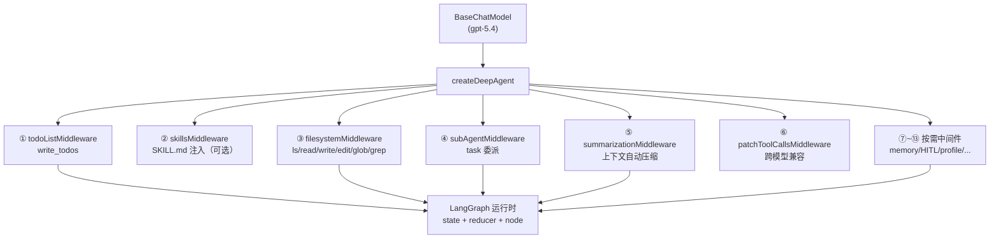
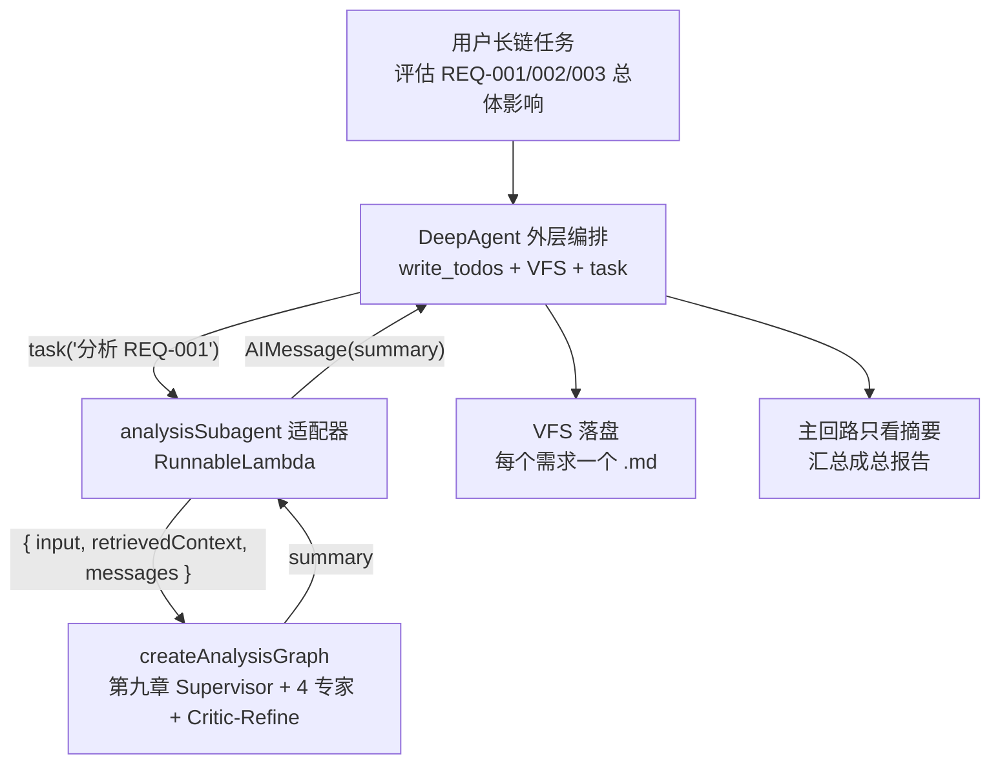
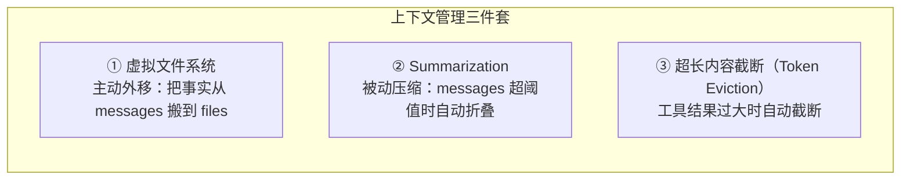
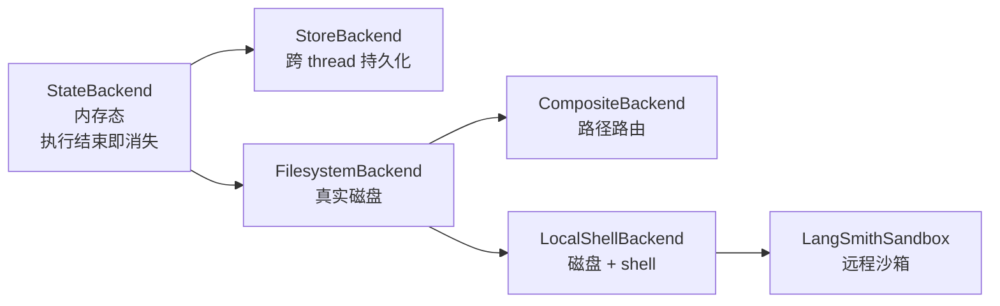
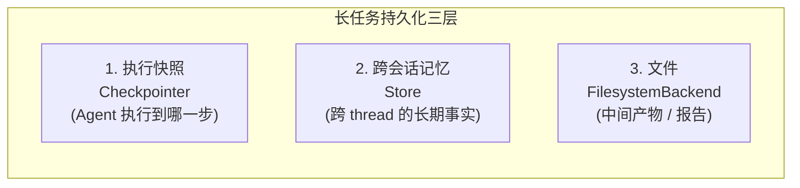
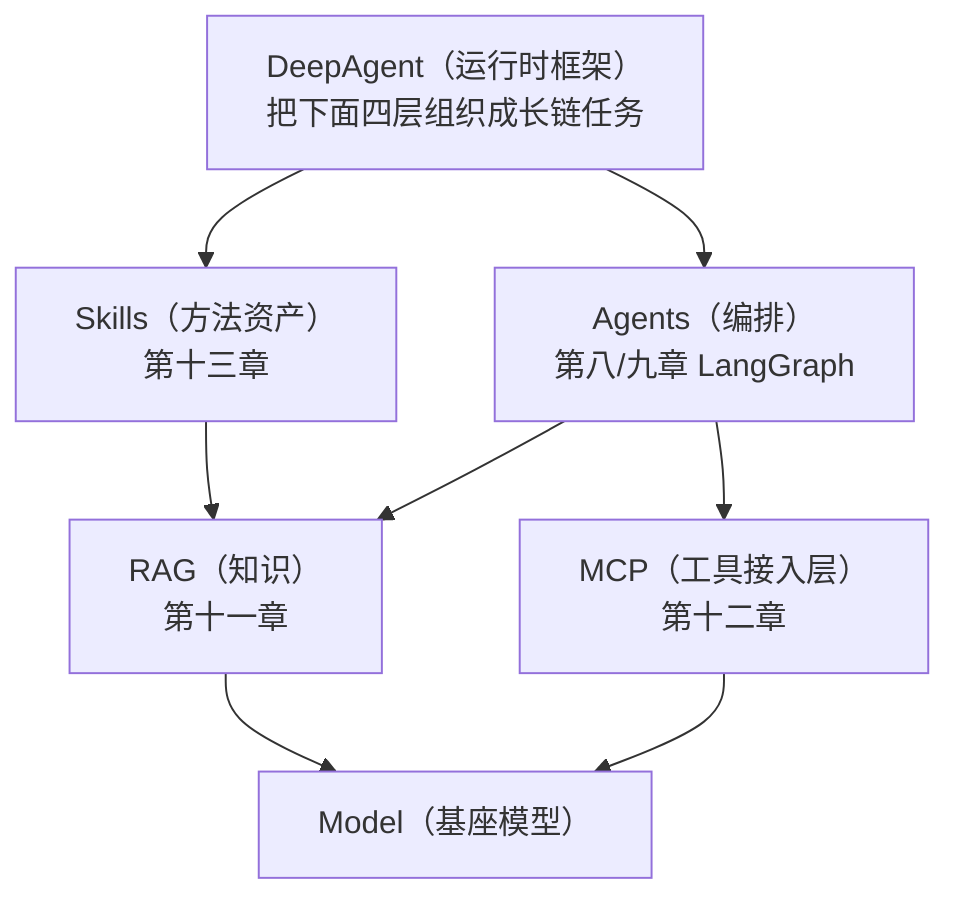

> 本文整理自《2026 前端 AI Agent 工程化实战营》课程资料，作为系列文章第 16 篇。

---
theme: channing-cyan
---


**本章demo地址**：[feat/deepagents](https://github.com/Cookieboty/autix-demo/tree/feat/deepagents)

第十四章完成了 DeepAgent 的入门装配：通过需求分析系统的主干场景，验证了 `write_todos`、虚拟文件系统、`task` 子 Agent 与 Skills 注入等基础能力。那个示例仍然属于短链任务：一次需求分析、一份报告，不涉及执行恢复、长期记忆、人工审批或跨需求编排。

本章继续沿用同一条业务主线，将 DeepAgent 放到更接近生产环境的长链任务中讨论。核心场景是：**将第九章的 `createAnalysisGraph()` 作为 DeepAgent 的 `CompiledSubAgent` 接入，由 DeepAgent 在外层负责多需求拆解、委派、文件暂存与最终汇总**。

因此，本章不再停留在“如何创建一个 DeepAgent”，而是回答更工程化的问题：长链任务如何判定，内置中间件按什么顺序装配，消息压缩何时触发，虚拟文件系统如何持久化，已有 LangGraph 图如何接入，人工审批和模型运行配置应该放在运行链路的哪一层。

> 本章定位：第十四章解决 DeepAgent 的基本使用；本章解决 DeepAgent 在长链任务中的运行时设计、子 Agent 适配、上下文管理、持久化与工程边界。

**本章验收点**

*   能说明「长链任务」的判定标准，以及它对 Agent 运行框架的额外要求
*   理解 DeepAgent 内置中间件的完整装配顺序，以及每个中间件的触发时机和职责
*   能把已编译的 LangGraph 图接成 DeepAgent 的 `CompiledSubAgent`，并理解输入输出适配器的必要性
*   掌握 Summarization 的三种触发模式（`messages` / `tokens` / `fraction`）和调参策略
*   理解 Backend 体系（`StateBackend` → `FilesystemBackend` → `CompositeBackend` → `LocalShellBackend` → `Sandbox`）的递进关系
*   能用 `memory` 参数为 Agent 注入跨会话的长期记忆（[AGENTS.md](http://AGENTS.md) 模式）
*   理解模型运行配置如何根据不同模型自动调整运行时行为
*   能区分本章可在本地完整运行的能力，以及依赖外部基础设施的架构演示能力

**版本与运行假设**

本章新增代码统一放在 `services/chat/src/llm/deepagent/`，新增脚本 `services/chat/scripts/run-deepagent-orchestrator-demo.ts`，新增测试 `services/chat/test/chapter15-deepagent-advanced.spec.ts`。为保证第九章图能够作为子 Agent 运行，本章仅对第八/九章代码做最小兼容性修复（见 15.12.2），不改变既有业务流程。

***

## 15.1 什么样的任务属于「长链」


不是「步骤多」就叫长链。一个执行 20 个步骤但每步都很短、上下文不持续增长的批处理，本质上仍然是短任务循环。**长链任务**的判定标准是下面这几条同时出现：

| 特征      | 含义                    | 短任务为什么不需要             |
| ------- | --------------------- | --------------------- |
| 上下文超窗   | 中间产物会导致 messages 快速膨胀 | 短任务一轮就结束，不堆积          |
| 需要持久化   | 执行到一半要能暂停、恢复          | 短任务通常一次执行完成，失败后重新执行即可 |
| 需要委派与隔离 | 子任务上下文要和主回路隔开         | 短任务没有子任务              |
| 需要人工介入  | 敏感动作要等审批              | 短任务没有敏感写操作            |

三类典型的长链场景：

1.  **跨需求联合分析**（本章主场景，接第九章 9.5）：「评估 REQ-001/002/003 对核心系统的总体影响」。每个需求要单独深度分析，再汇总。
2.  **多轮研究对话**：用户和 Agent 来回几十轮，逐步收敛一个调研结论，上下文持续增长。
3.  **数小时的 batch 任务**：执行一批需求评估，中途可能需要暂停、换机器、继续执行。

回顾我们手写过的应对方式：

*   第八章 8.7 我们靠 `interrupt()` + 业务层会话表实现「停下来等用户」。
*   第九章 9.5 我们靠 Plan-and-Execute + `parentThreadId` 实现「拆步骤 + 每步独立 thread」。
*   第十章我们讨论过 Token 经济学：把中间事实搬到外部存储，messages 只留思考链。

DeepAgent 做的事，就是把这些散落在各章的手写机制，**抽象成统一的中间件层**，让你不必每开一个长任务 Agent 就重写一遍。

***

## 15.2 拆开 DeepAgent：中间件装配全景

第十四章主要按默认装配使用 DeepAgent。本章要把它拆开：`createDeepAgent` 的能力，全部来自一组**内置中间件**，每个中间件在 LangGraph 的 `state + node` 之上注入工具、改写执行、管理状态。

### 15.2.1 完整装配顺序

`createDeepAgent` 内部按以下顺序装配中间件。理解这个顺序对调试和定制至关重要——**中间件是有序的，后装的可以覆盖先装的行为**：

| 序号 | 中间件                              | 触发条件                           | 职责                                                               |
| -- | -------------------------------- | ------------------------------ | ---------------------------------------------------------------- |
| 1  | `todoListMiddleware`             | **始终装配**                       | 注入 `write_todos` 工具，维护任务计划                                       |
| 2  | `createSkillsMiddleware`         | 传入 `skills` 参数                 | 扫描 SKILL.md 目录，注入技能索引                                            |
| 3  | `createFilesystemMiddleware`     | **始终装配**                       | 注入 `ls`/`read_file`/`write_file`/`edit_file`/`glob`/`grep`，加权限控制 |
| 4  | `createSubAgentMiddleware`       | **始终装配**                       | 注入 `task` 工具，管理子 Agent 调度                                        |
| 5  | `createSummarizationMiddleware`  | **始终装配**                       | 消息超阈值时自动压缩，不注入工具                                                 |
| 6  | `createPatchToolCallsMiddleware` | **始终装配**                       | 修复跨模型的 tool\_call / ToolMessage 配对问题                             |
| 7  | `createAsyncSubAgentMiddleware`  | `subagents` 中有 `AsyncSubAgent` | 注入 5 个异步任务工具                                                     |
| 8  | **用户自定义 `middleware`**           | 传入 `middleware` 参数             | 开发者追加的业务中间件                                                      |
| 9  | Anthropic Cache Middleware       | 模型为 Anthropic                  | 自动添加 `cache_control`                                             |
| 10 | `createMemoryMiddleware`         | 传入 `memory` 参数                 | 加载 AGENTS.md 到 system prompt                                     |
| 11 | `humanInTheLoopMiddleware`       | 传入 `interruptOn` 参数            | 指定工具调用前中断                                                        |
| 12 | 模型运行配置中间件                        | 模型有匹配的 profile                 | 模型级调优                                                            |
| 13 | 工具排除中间件                          | profile 排除了某些工具                | 按 profile 隐藏工具                                                   |




### 15.2.2 每个中间件对应我们手写过的什么

| 中间件                                       | 提供的能力                        | 对应前面哪一章                      |
| ----------------------------------------- | ---------------------------- | ---------------------------- |
| `todoListMiddleware`                      | `write_todos` 规划             | 9.5 `plannerNode` 显式拆步骤      |
| `filesystemMiddleware`                    | 虚拟文件系统 6 个工具                 | 第十章 Token 经济学 + 8.7 业务持久化    |
| `subAgentMiddleware`                      | `task` 委派 + 上下文隔离            | 9.2 Supervisor + 9.4 Handoff |
| `summarizationMiddleware`                 | 消息历史自动压缩                     | 第十章 摘要式记忆                    |
| `patchToolCallsMiddleware`                | 修复 Gemini 等模型的 tool\_call 配对 | 手写时靠排查解决                     |
| `skillsMiddleware`                        | 从 backend 加载 SKILL.md        | 第十三章 13.8                    |
| `memoryMiddleware`                        | 跨会话注入 AGENTS.md 长期记忆         | 无直接对应，新能力                    |
| `humanInTheLoopMiddleware`（`interruptOn`） | 节点级中断审批                      | 8.7.2 `interrupt()`          |

### 15.2.3 关键认知：没有新原语

DeepAgent 没有发明新的图原语。它建立在第八章 8.2 讲过的 `state / reducer / node` 之上——所谓「中间件」，本质就是**往图里注入工具 + 在节点前后挂钩子 + 在 state 上加 channel**。每个中间件最多做三件事：

1.  向 Agent 注入工具（如 `write_todos`、`read_file`）
2.  在模型调用或工具调用前后插入逻辑（如 summarization 在模型调用前检查 token）
3.  向 State 增加字段（如 `todos`、`files`、`asyncTasks`）

理解了这一点，你就知道：既然子 Agent 也只是 state 进、state 出的 Runnable，那也可以将第九章的图作为子 Agent 接入 DeepAgent。

**内置工具名冲突检查**

`createDeepAgent` 会检查你传入的 `tools` 是否和内置工具名冲突。以下名字**不能作为业务工具名**：

    ls, read_file, write_file, edit_file, glob, grep, execute,
    task, write_todos,
    start_async_task, check_async_task, update_async_task,
    cancel_async_task, list_async_tasks

如果传入同名工具，`createDeepAgent` 会抛出 `ConfigurationError`。

*   📋 配套用例

    ```bash
    cd services/chat
    bun test test/chapter15-deepagent-advanced.spec.ts --test-name-pattern "15.2"
    ```

    Layer 1 验证：`createDeepAgent` 返回含 `invoke`/`streamEvents` 的 Agent、`REQUIRED_MIDDLEWARE_NAMES` 包含 `FilesystemMiddleware` 和 `SubAgentMiddleware`、`GENERAL_PURPOSE_SUBAGENT` 结构完整。


***

## 15.3 把第九章 `createAnalysisGraph` 接成子 Agent

这是本章的主轴，也是第十四章 Q4 留下的预告：**把 `createAnalysisGraph()` 作为 DeepAgent 的子 Agent 接入**。

### 15.3.1 关键决策：主图 vs 子 Agent

有两种接法：

*   **方案 A（本章采用）**：第九章 `createAnalysisGraph()` 整张图作为 DeepAgent 的一个 `task` 子 Agent。DeepAgent 在外层做「拆需求 + 编排 + 汇总」，每个需求的深度分析交给该 LangGraph 图。**既有业务（`OrchestratorService` / SSE 路由）完全不动**，新代码放新目录。
*   **方案 B（不推荐）**：让 DeepAgent 完全替代 `OrchestratorService`，第九章主图退役。这会破坏现有业务数据流，影响范围太大，不在本章范围。

我们走方案 A。架构如下：




### 15.3.2 三种子 Agent 类型的选择

DeepAgent 支持三种子 Agent 类型，选对类型是接入的前提：

| 类型                 | 接口                                            | 运行方式                               | 适用场景                        |
| ------------------ | --------------------------------------------- | ---------------------------------- | --------------------------- |
| `SubAgent`         | `{ name, description, systemPrompt, tools? }` | DeepAgent 内部自动组装                   | 用 prompt + tools 定义的新 Agent |
| `CompiledSubAgent` | `{ name, description, runnable }`             | 传入已编译的 Runnable                    | 接入已有的 LangGraph 图           |
| `AsyncSubAgent`    | `{ name, description, graphId, url? }`        | 远程 Agent 服务（Agent Protocol Server） | 跨进程长时子任务                    |

本章用的是 `CompiledSubAgent`——因为第九章的图已经编译好了，我们需要直接传入它的 runnable。

### 15.3.3 为什么不能直接把编译后的图作为子 Agent 使用

`CompiledSubAgent` 的结构很简单：

```tsx
interface CompiledSubAgent {
  name: string;
  description: string;
  runnable: ReactAgent | Runnable;
}
```

一种直接做法是：既然 `createAnalysisGraph(model)` 返回的已经是编译后的 Runnable，是否可以直接传给 `CompiledSubAgent.runnable`。

结论是不建议直接使用，原因是两边的输入输出格式不一致。先看 `deepagents` 中 `task` 工具调用子 Agent 的方式（SDK 源码，已核验）：

```tsx
// 伪代码：task 工具内部
subagentState.messages = [new HumanMessage({ content: description })];
const result = await subagent.invoke(subagentState, config);
const content = result.messages[result.messages.length - 1].content;
```

也就是说，DeepAgent 调用子 Agent 时，输入和输出都围绕 `messages` 组织——它把委派描述写入 `messages`，再读最后一条消息当结果。

而第九章的分析图使用另一种输入格式：

```tsx
await graph.invoke({ input: userInput, retrievedContext: '', messages: [] });
```

它靠 `state.input`（一个字符串）驱动 triage→extract→clarify→analysis/risk→summary，产出在 `state.summary`。它根本不读 `messages` 来决定做什么。

两边的输入输出格式不一致：如果直接使用，DeepAgent 写入 `messages` 的描述，该 LangGraph 图的 `triage` 节点读 `state.input` 时拿到的是空字符串。

> **技术原理**：这是 DeepAgent 调用子 Agent 时的格式约束。`task` 工具统一使用 messages，是为了让主 Agent 和子 Agent 之间的输入输出形式保持一致，也与 LLM 的对话式交互模型一致。但现有的 LangGraph 图往往有自己的 state 输入格式（特别是自行定义 State 的图），因此需要适配层。

### 15.3.4 适配器：用 `RunnableLambda` 转换输入输出格式

解决办法是在中间加一层适配器，把 `messages` 输入转换成图需要的 state 输入，再把图的输出转换回 `messages`。这就是 `services/chat/src/llm/deepagent/deep-orchestrator.service.ts` 的核心：

```tsx
import { type CompiledSubAgent } from 'deepagents';
import { RunnableLambda } from '@langchain/core/runnables';
import { AIMessage, type BaseMessage } from '@langchain/core/messages';
import { BaseChatModel } from '@langchain/core/language_models/chat_models';
import { createAnalysisGraph } from '../graph/requirement-analysis-graph';

export const ANALYSIS_SUBAGENT_NAME = 'requirement_analyst';

export function extractLatestUserText(messages: BaseMessage[]): string {
  for (let i = messages.length - 1; i >= 0; i--) {
    const m = messages[i];
    if (m.getType() === 'human') {
      return typeof m.content === 'string' ? m.content : JSON.stringify(m.content);
    }
  }
  const last = messages[messages.length - 1];
  return last ? (typeof last.content === 'string' ? last.content : JSON.stringify(last.content)) : '';
}

export function createAnalysisSubagent(model: BaseChatModel): CompiledSubAgent {
  const runnable = RunnableLambda.from(async (state: { messages: BaseMessage[] }, config) => {
    const userInput = extractLatestUserText(state.messages ?? []);   // messages → input
    const graph = createAnalysisGraph(model);
    const result = await graph.invoke(
      { input: userInput, retrievedContext: '', messages: [] },
      config,                                                          // ← 透传 config
    );
    const summary =
      result.summary || result.queryResponse || result.chatResponse || '（需求分析子 Agent 未产出内容）';
    return { messages: [new AIMessage(summary)] };                   // summary → messages
  });

  return {
    name: ANALYSIS_SUBAGENT_NAME,
    description:
      '需求分析专家。输入单个需求的描述文本，内部执行第九章 Supervisor + 4 专家并行 + Critic-Refine，返回该需求的综合分析摘要。',
    runnable: runnable as unknown as CompiledSubAgent['runnable'],
  };
}
```

三个细节值得停下来看：

1.  **为什么只回 `{ messages: [AIMessage(summary)] }`？** 因为 `task` 工具会把子 Agent 返回的 state 合并回主 Agent 的 state。如果把第九章那张图的全部字段（`intent`、`analysisResult`、各专家结论……）都返回，会把子 Agent 的中间状态带入 DeepAgent 的主 state。所以适配器只回一条摘要消息——这实现了 Handoff 的精神：**主回路只看摘要，不看子 Agent 的中间过程**。
2.  **`summary` 的回退链** `result.summary || result.queryResponse || result.chatResponse`：第九章那张图按 intent 走不同分支（analyze 出 `summary`、query 出 `queryResponse`、chat 出 `chatResponse`），适配器把它们统一成一个「子 Agent 的最终回答」。
3.  **`config` 透传**：`RunnableLambda` 第二个参数 `config` 必须传给 `graph.invoke(input, config)`——否则父级的 `callbacks` / `streamEvents` / 追踪不会穿透到子 Agent，你在外层看到 `task` 委派那一步就「断」了，看不到子 Agent 内部的 LLM 调用。

### 15.3.5 组装外层 DeepAgent

有了子 Agent，外层编排就是常规的 `createDeepAgent`。完整代码在 `services/chat/src/llm/deepagent/deep-orchestrator.service.ts`：

```tsx
import { createDeepAgent, FilesystemBackend, type DeepAgent, type FilesystemPermission } from 'deepagents';
import { type BaseCheckpointSaver } from '@langchain/langgraph';
import { DynamicStructuredTool } from '@langchain/core/tools';
import { z } from 'zod';

export const SAVE_REPORT_TOOL_NAME = 'save_report';

const ORCHESTRATOR_SYSTEM_PROMPT = `你是一个跨需求分析协调者。

工作方式：
1. 先用 write_todos 把任务拆成「逐个需求分析 + 最终汇总」的步骤。
2. 对每个需求，用 task 工具委派给 requirement_analyst 子 Agent 做深度分析。
3. 把每个需求的分析摘要用 write_file 落到单独的 .md 文件，主回路只保留摘要。
4. 全部需求分析完后，读取这些文件，输出一份「总体影响评估」报告。`;

export interface DeepOrchestratorOptions {
  model: BaseChatModel;
  rootDir?: string;
  checkpointer?: BaseCheckpointSaver;
  permissions?: FilesystemPermission[];
  interruptOn?: Record<string, boolean>;
}

export function createDeepOrchestrator(options: DeepOrchestratorOptions): DeepAgent {
  const { model, rootDir, checkpointer, permissions, interruptOn } = options;

  if (interruptOn && !checkpointer) {
    throw new Error('interruptOn 需要同时传入 checkpointer（HITL 依赖执行快照才能中断与恢复）。');
  }

  const saveReport = new DynamicStructuredTool({
    name: SAVE_REPORT_TOOL_NAME,
    description: '把最终的总体影响评估报告归档（敏感操作，可能需要人工审批）。',
    schema: z.object({
      title: z.string().describe('报告标题'),
      content: z.string().describe('报告正文'),
    }),
    func: async ({ title }) => `已归档报告：《${title}》`,
  });

  return createDeepAgent({
    model: model as never,
    tools: [saveReport] as never,
    subagents: [createAnalysisSubagent(model)],
    systemPrompt: ORCHESTRATOR_SYSTEM_PROMPT,
    ...(rootDir ? { backend: new FilesystemBackend({ rootDir, virtualMode: true }) } : {}),
    ...(checkpointer ? { checkpointer } : {}),
    ...(permissions ? { permissions } : {}),
    ...(interruptOn ? { interruptOn } : {}),
  }) as DeepAgent;
}
```

`systemPrompt` 的设计要点：**显式写出期望的工作流步骤**（先 write\_todos、再 task、再 write\_file、最后汇总）。DeepAgent 的内置 prompt 会引导模型使用这些内置工具，但业务 prompt 越清晰，模型越不容易偏离预期。

*   🤖 生成代码 Prompt：跨需求协调模块

        在 services/chat/src/llm/deepagent/ 下新建 deep-orchestrator.service.ts：

        1. createAnalysisSubagent(model)：用 RunnableLambda 把 createAnalysisGraph(model) 包成
           CompiledSubAgent。适配器接收 { messages }，取最近一条 human 文本作为 input，
           调 graph.invoke({ input, retrievedContext:'', messages:[] })，
           输出 { messages: [AIMessage(summary)] }。
        2. createDeepOrchestrator(options)：createDeepAgent({ model, tools:[save_report],
           subagents:[analysisSubagent], systemPrompt, backend?, checkpointer?, permissions?, interruptOn? })。
           interruptOn 缺 checkpointer 时抛错。

        约束：
        - 不挂到现有 OrchestratorService / SSE 路由
        - 不动第八/九章既有业务逻辑
        - 适配器只回 messages，不把图的全部 state 返回

### 15.3.6 实跑与观测

脚本 `scripts/run-deepagent-orchestrator-demo.ts` 使用三个需求做端到端验证：

```tsx
const agent = createDeepOrchestrator({ model });
const result = await agent.invoke({
  messages: [{ role: 'user', content:
    '我们要评估以下三个需求对核心系统的总体影响，请逐个分析后给出整体结论：\n' +
    '- REQ-001：支持企业微信扫码登录\n' +
    '- REQ-002：订单导出支持百万行级别的异步下载\n' +
    '- REQ-003：为后台操作增加细粒度的审计日志' }],
});
```

配套测试 `test/chapter15-deepagent-advanced.spec.ts` 的 Layer 2 用例（单需求，控制时长）运行后，得到的真实调用链是：

    调用链: write_todos → task → write_todos → write_file → write_todos → read_file → write_todos
    todos: 3 项
    输出前 300 字: # 总体影响评估报告
    ## 评估对象
    - 需求：REQ-001
    - 需求：支持企业微信扫码登录
    ## 总体结论
    影响等级：中高 ...

这条链清楚地展示了 DeepAgent 长链编排的形态：

*   第一步通常调用 `write_todos`——模型自己拆步骤（详见 15.4）。
*   `task` 委派——把单个需求交给 `requirement_analyst` 子 Agent，子 Agent 内部执行第九章的分析图。
*   `write_file` / `read_file`——把需求摘要落到 VFS，主回路只看摘要（详见 15.5）。
*   反复 `write_todos`——每完成一步就更新计划状态。

> ⚠️ LLM 非确定性：上面的调用链是某次实跑的真实记录。即使 `temperature: 0`，模型每次的工具调用顺序也不完全可复现。稳定的模式是：**通常先调用 `write_todos`、用 `task` 委派分析、用文件系统暂存事实、最后汇总**；具体的步数和穿插顺序会有出入。

*   📋 配套用例（`test/chapter15-deepagent-advanced.spec.ts`）

    只运行 15.3 的用例：

    ```bash
    cd services/chat
    bun test test/chapter15-deepagent-advanced.spec.ts --test-name-pattern "15.3"
    ```

    分层沿用第九章 9.2.1 / 第十四章的写法。\*\* Layer 1（零 LLM、确定性）\*\* 验证适配器与装配：

    ```tsx
    describe('15.3 适配器：messages → input 映射', () => {
      it('取最近一条 human 消息文本', () => {
        const text = extractLatestUserText([
          new HumanMessage('第一条'),
          new AIMessage('助手回复'),
          new HumanMessage('分析 REQ-001'),
        ]);
        expect(text).toBe('分析 REQ-001');
      });
    });

    describe('15.3 createDeepOrchestrator 构造', () => {
      it('最小构造可创建 Agent', () => {
        const agent = createDeepOrchestrator({ model: makeStubModel() });
        expect(typeof agent.invoke).toBe('function');
      });
    });
    ```

    \*\*Layer 2（需 `OPENAI_API_KEY` + `RUN_LLM_DEEPAGENT_TESTS=1`）\*\*做端到端验证，断言委派确实发生：

    ```bash
    RUN_LLM_DEEPAGENT_TESTS=1 bun test test/chapter15-deepagent-advanced.spec.ts --test-name-pattern "15.3 子 Agent 接入端到端"
    ```

    ```tsx
    expect(toolCalls).toContain('task');
    expect(output.length).toBeGreaterThan(200);
    ```


#### 用 `streamEvents` 观测每一步

`agent.invoke(...)` 只在最后给你一个结果，只看最终结果时，很难了解中间执行过程。要**实时看到每一步**，把 `invoke` 换成 `streamEvents(v2)`。

脚本 `scripts/run-deepagent-orchestrator-demo.ts` 的完整实现：

```tsx
const oneLine = (v: unknown, n = 100) =>
  String(typeof v === 'string' ? v : JSON.stringify(v) ?? '')
    .replace(/\s+/g, ' ')
    .slice(0, n);

function toolArgs(data: unknown): any {
  const raw = (data as any)?.input;
  const inner = raw && typeof raw === 'object' && 'input' in raw ? (raw as any).input : raw;
  if (typeof inner === 'string') {
    try { return JSON.parse(inner); } catch { return inner; }
  }
  return inner;
}

let inSubagent = 0;
const indent = () => '  '.repeat(inSubagent > 0 ? 1 : 0);

let llmCalls = 0;
let rootRunId: string | undefined;
let finalState: any = null;

for await (const ev of agent.streamEvents(
  { messages: [{ role: 'user', content: task }] },
  { version: 'v2' },
)) {
  if (!rootRunId && ev.event === 'on_chain_start') rootRunId = ev.run_id;

  switch (ev.event) {
    case 'on_chat_model_start': {
      llmCalls++;
      const m = (ev.metadata as any)?.ls_model_name || 'llm';
      console.log(`${indent()}🧠 [真实 LLM 调用 #${llmCalls}] 模型=${m}`);
      break;
    }
    case 'on_tool_start': {
      const args = toolArgs(ev.data);
      if (ev.name === 'task') {
        inSubagent++;
        console.log(`📂 委派子 Agent：${args?.subagent_type ?? ''} —${oneLine(args?.description, 60)}`);
      } else {
        console.log(`${indent()}🔧 工具：${ev.name}  入参=${oneLine(args, 80)}`);
      }
      break;
    }
    case 'on_tool_end': {
      const out = (ev.data as any)?.output;
      const content = typeof out?.content === 'string' ? out.content : out;
      console.log(`${indent()}   ✅ 返回：${oneLine(content, 80)}`);
      if (ev.name === 'task') inSubagent = Math.max(0, inSubagent - 1);
      break;
    }
    case 'on_chain_end': {
      if (ev.run_id === rootRunId) finalState = (ev.data as any)?.output;
      break;
    }
  }
}
```

实跑某次输出（节选）：

    🧠 [真实 LLM 调用 #1] 模型=gpt-5.4
    🔧 工具：write_todos  入参={"todos":[{"content":"分析需求 REQ-001：支持企业微信扫码登录","status":"in_progress"}, ...]}
    🧠 [真实 LLM 调用 #2] 模型=gpt-5.4
    📂 委派子 Agent：requirement_analyst — 你是需求分析专家。请对以下单个需求做深度分析 ...
      🧠 [真实 LLM 调用 #3] 模型=gpt-5.4        ← 缩进的都是子 Agent 内部第九章图的调用
      🧠 [真实 LLM 调用 #4] 模型=gpt-5.4
      [Supervisor] 选中的专家：functional, security
      🔧 工具：check_security_policy  入参={"description":"REQ-001：支持企业微信扫码登录 ..."}
         ✅ 返回：安全策略检查 - REQ-001：⚠️ 涉及用户认证功能 ...
      ...

这条事件流可以回答三个关键问题：

*   **当前步骤是什么**：`write_todos`（规划）→ `task`（委派）→ 子 Agent 内部工具调用 → 汇总。
*   **是否实际调用了 LLM**：每个 `🧠` 都对应一次 `on_chat_model_start`。跨需求任务通常会产生多次模型调用，这也是长链任务在时延和成本上明显高于短任务的原因。
*   **子 Agent 内部如何执行**：缩进行表示第九章图在子 Agent 中执行的过程，包括 Supervisor、专家节点与 Critic-Refine 质量闭环。

> **技术技巧**：`toolArgs` 函数处理了 LangGraph `streamEvents` 中工具入参的嵌套包装——事件的 `data.input` 有时是 JSON 字符串，有时是嵌套对象，这个函数统一解包。这是在不同 LangGraph 版本间保持兼容的实践模式。

***

## 15.4 自主规划：`write_todos` 的深层机制

第九章 9.5 使用 `plannerNode` 显式规划：通过结构化输出让模型产出 `plan` 数组，再由 `executorNode` 逐步执行。DeepAgent 则采用引导式规划：`todoListMiddleware` 注入 `write_todos` 工具，模型在面对复杂任务时可以主动调用它。

### 15.4.1 write\_todos 的运行时行为

`write_todos` 在 state 上维护一个 `todos` channel（数组），每次调用时整体覆盖。模型通常在三个阶段调用它：

1.  **初始规划**：把用户目标拆成多个可执行步骤，全部设为 `pending`，第一步设为 `in_progress`。
2.  **进度更新**：完成一步后把状态改为 `completed`，并把下一步置为 `in_progress`。
3.  **计划调整**：发现新信息后增加、删除或修改步骤。

对照 15.3.6 的实跑：我们没有写任何「先分析 REQ-001、再分析 REQ-002」的步骤代码，DeepAgent 自己产出了 3 项 todos。这就是「自主规划」——把规划的控制权交给模型。

### 15.4.2 自主规划 vs 显式 planner：选型标准

| 维度              | 自主规划（DeepAgent `write_todos`） | 显式 planner（9.5 `plannerNode`） |
| --------------- | ----------------------------- | ----------------------------- |
| 步骤是否固定          | 不固定、随输入变化                     | 固定流程、可枚举                      |
| 是否需要审计每一步       | 不强制                           | 需要（plan 是结构化数据，可存库、可回放）       |
| 是否要对 plan 做程序校验 | 难（todo 是半结构化文本）               | 易（plan 是 Zod schema 校验过的数组）   |
| 偏离预期时的可控性       | 靠 prompt 约束                   | 靠代码降级处理                       |
| 灵活性             | 高（模型可动态调整）                    | 低（代码写死了分支）                    |

**经验法则**：**对外暴露、需要 SLA 和审计的流程用显式 planner；内部探索性、步骤不固定的长任务用自主规划。** 两者也可以叠：外层 DeepAgent 自主规划，某一步委派给一张固定图——这正是 15.3 在做的事。

**实践建议：提高 `write_todos` 触发稳定性**

在实践中，`write_todos` 是否被触发高度依赖 system prompt 的措辞。以下技巧可以提高规划的可靠性：

1.  **显式提到工具名**：在 system prompt 中直接说「先用 write\_todos 把任务拆成步骤」比说「先制定计划」更可靠——模型更容易把文字描述映射到具体工具。
2.  **给出步骤模板**：「步骤 1: 分析…、步骤 2: 评估…、步骤 3: 汇总…」这种模板会引导模型产出更结构化的 todos。
3.  **不要在业务 prompt 中与内置引导冲突**：如果业务 prompt 写了「直接回答、不调用工具」，内置的规划引导就会被压制。
4.  **短任务不强求**：天气查询这类任务不触发 `write_todos` 是正常行为，不要为了触发而强制。

***

## 15.5 上下文管理：Summarization × VFS × 超长内容截断（Token Eviction）


长链任务首先遇到的限制通常是上下文窗口。DeepAgent 通过**三条协同机制**处理，每条解决不同层面的问题：



### 15.5.1 虚拟文件系统：主动的上下文外移

15.3 的实跑里 `write_file` / `read_file` 就是这条机制：每个需求的分析摘要落到一个 `.md` 文件，主 Agent 的 messages 里只保留「我把 REQ-001 的分析存到了 [xxx.md](http://xxx.md)」这种指针，而不是把几千字的分析正文全部放入上下文。等要汇总时再 `read_file` 取回。

**配合关系一句话总结**：**思考链留在 messages，事实落到 files，接近窗口上限时压缩 messages**。三者分工明确，互不替代。

### 15.5.2 Summarization 深度：触发模式与配置

`createSummarizationMiddleware` 是 DeepAgent 的被动降级处理。当 `createDeepAgent` 调用它时，默认只传入 `{ backend }`，触发参数由 `computeSummarizationDefaults(model)` 根据模型自动计算。

### 三种触发模式

Summarization 的触发和保留都用 `ContextSize` 类型描述：

```tsx
type ContextSize = {
  type: "messages" | "tokens" | "fraction";
  value: number;
};
```

| 模式         | 含义        | 典型值                                 | 适用场景                |
| ---------- | --------- | ----------------------------------- | ------------------- |
| `messages` | 按消息条数     | `{ type: "messages", value: 20 }`   | 简单场景，不需要精确 token 计算 |
| `tokens`   | 按 token 数 | `{ type: "tokens", value: 170000 }` | 固定阈值，不依赖模型上下文窗口     |
| `fraction` | 按模型窗口的百分比 | `{ type: "fraction", value: 0.85 }` | 自适应，随模型窗口大小自动调整     |

### 默认阈值如何计算

`computeSummarizationDefaults(model)` 的逻辑（SDK 源码，已核验）：

*   **模型有 `profile.maxInputTokens`**（如 Claude、GPT 系列）：
    *   `trigger` = `{ type: "fraction", value: 0.85 }`——消耗 85% 上下文时触发
    *   `keep` = `{ type: "fraction", value: 0.1 }`——压缩后只保留 10% 的最近消息
*   **模型无 profile**（回退）：
    *   `trigger` = `{ type: "tokens", value: 170000 }`
    *   `keep` = `{ type: "messages", value: 6 }`

> **技术原理**：`fraction` 模式是最优选择——它自适应模型窗口大小。GPT-5.4 的窗口和 Claude Sonnet 的窗口不同，固定 170000 tokens 的阈值在一个模型上可能浪费空间、在另一个模型上可能太晚触发。`fraction: 0.85` 意味着「不管窗口多大，用到 85% 就开始压缩」。

### Summarization 的执行流程

当消息历史达到 `trigger` 阈值时，中间件执行以下步骤：

1.  **切分**：按 `keep` 保留最近的消息原文，其余标记为待压缩。
2.  **摘要生成**：用当前模型对待压缩部分生成一段摘要（默认用 `summaryPrompt` 模板，最多 `trimTokensToSummarize: 4000` tokens 的输入）。
3.  **历史归档**：把被压缩的原始消息写入 backend 的 `/conversation_history/{sessionId}.md`（可通过 `historyPathPrefix` 配置）。
4.  **替换**：在 messages 中用一条摘要 `HumanMessage`（标记 `lc_source: "summarization"`）替换被压缩的历史。
5.  **修复配对**：确保切分点不破坏 AI/Tool message 的配对完整性。

### 参数截断配置（TruncateArgsSettings）

Summarization 中间件还有一个常被忽略的功能：对旧消息中**超长的工具参数**自动截断。典型场景是 `write_file` 工具曾经写过一个 5000 字的文件——这个参数值留在历史消息里会持续消耗 token。

```tsx
interface TruncateArgsSettings {
  trigger: ContextSize;     // 开始截断的阈值
  keep: ContextSize;        // 最近多少条消息的参数不截断
  maxLength: number;        // 默认 2000 字符
  truncationText: string;   // 默认 "...(argument truncated)"
}
```

默认行为：当历史超过阈值时，早期消息中的 `write_file` / `edit_file` 等大参数会被截成 2000 字符 + 省略标记。**最近的消息不受影响**——模型需要看到近期操作的完整参数。

### 15.5.3 超长内容截断（Token Eviction）：文件系统层的自动截断

`filesystemMiddleware` 还有两个常被忽略的配置项：

| 参数                                  | 默认值           | 作用                  |
| ----------------------------------- | ------------- | ------------------- |
| `toolTokenLimitBeforeEvict`         | 20,000 tokens | 工具返回结果超过此限时自动截断     |
| `humanMessageTokenLimitBeforeEvict` | 50,000 tokens | 用户消息中内嵌的文件内容超过此限时截断 |

这意味着：如果 `read_file` 读回了一个超长文件，middleware 会在结果进入 messages **之前**就截断，避免单次工具调用直接超过上下文窗口。

> **实践建议**：这三条机制的调参没有万能公式。建议在你的真实任务上用 LangSmith（15.12.2）观测 token 曲线，看 summarization 触发了几次、VFS 写了多少次、大参数截断了多少。根据观测结果再决定是否需要调低 `trigger` 阈值或增加 `toolTokenLimitBeforeEvict`。

*   📋 配套用例

    ```bash
    cd services/chat
    bun test test/chapter15-deepagent-advanced.spec.ts --test-name-pattern "15.5"
    ```

    Layer 1 验证：`computeSummarizationDefaults(model)` 返回的 `trigger`、`keep`、`truncateArgsSettings` 结构正确。实跑结果确认 GPT-5.4 的默认阈值为 `{ type: "fraction", value: 0.85 }`。


***

## 15.6 Backend 体系：从内存到磁盘到沙箱

虚拟文件系统的底层是 Backend——决定文件存在哪里、能不能执行命令。DeepAgent 提供了一个完整的 Backend 递进体系，从最简单的内存态到最复杂的远程沙箱。

### 15.6.1 Backend 一览

| Backend             | 存储位置                  | 支持 `execute`？ | 持久化？             | 适用场景        |
| ------------------- | --------------------- | ------------- | ---------------- | ----------- |
| `StateBackend`      | LangGraph state（内存）   | 否             | 仅当有 checkpointer | 默认后端，短任务    |
| `StoreBackend`      | LangGraph `BaseStore` | 否             | 跨 thread 持久化     | 需要跨会话共享文件   |
| `FilesystemBackend` | 真实磁盘                  | 否             | 是                | 需要落盘或读取磁盘文件 |
| `CompositeBackend`  | 按路径前缀路由               | 委托给子 backend  | 取决于子 backend     | 混合场景        |
| `LocalShellBackend` | 真实磁盘 + 本地 shell       | **是**         | 是                | 需要执行命令      |
| `LangSmithSandbox`  | 远程沙箱                  | **是**         | 否                | 安全隔离执行      |




### 15.6.2 StateBackend（默认）

不传 `backend` 时，`createDeepAgent` 使用 `StateBackend`。文件存在 LangGraph 的 state 里，随图的执行存在。

*   **优点**：零配置、天然线程隔离。
*   **局限**：进程结束文件就没了；不能读取磁盘上的 SKILL.md。
*   **何时不够用**：需要 Skills 从磁盘加载时（14.9 已说明，必须换 `FilesystemBackend`）；需要跨进程共享文件时。

### 15.6.3 FilesystemBackend（本章可本地验证）

```tsx
new FilesystemBackend({ rootDir: '/tmp/deepagent-ch15', virtualMode: true })
```

| 参数              | 类型        | 默认      | 说明                                  |
| --------------- | --------- | ------- | ----------------------------------- |
| `rootDir`       | `string`  | 无       | 虚拟根目录，`/foo.md` 落到 `rootDir/foo.md` |
| `virtualMode`   | `boolean` | `false` | 开启后禁止 `..`、`~` 越界                   |
| `maxFileSizeMb` | `number`  | 无       | 单文件大小限制                             |

`virtualMode: true` 是关键安全措施。不开虚拟模式时，绝对路径会按真实文件系统解析，容易写到 `rootDir` 之外。

本章 Layer 1 用例直接验证了跨实例读回：

```tsx
it('一个实例写入、另一个实例读回，文件真实落盘', async () => {
  const root = mkdtempSync(join(tmpdir(), 'ch15-fs-'));
  const backend = new FilesystemBackend({ rootDir: root, virtualMode: true });
  await backend.write('/REQ-001.md', 'REQ-001 总体影响：高，涉及登录链路改造。');

  expect(existsSync(join(root, 'REQ-001.md'))).toBe(true);

  const reopened = new FilesystemBackend({ rootDir: root, virtualMode: true });
  const r = await reopened.read('/REQ-001.md');
  expect(String(r.content)).toContain('REQ-001');
});
```

### 15.6.4 CompositeBackend（路径路由）

当你需要「Skills 从磁盘读、工作文件存内存」这种混合场景时，`CompositeBackend` 把不同路径前缀路由到不同 backend：

```tsx
// ⚠️ 示意代码：展示 CompositeBackend 的组合模式
import { CompositeBackend, StateBackend, FilesystemBackend } from 'deepagents';

const backend = new CompositeBackend(
  new StateBackend(),                                       // 默认：工作文件存内存
  { '/skills': new FilesystemBackend({ rootDir: SKILLS_DIR }) },  // /skills/** 从磁盘读
);
```

> 这种模式的价值：让 Agent 的工作文件（`/analysis/REQ-001.md`）走内存态（不落盘、不泄露），而 Skills（`/skills/requirement-analysis/SKILL.md`）从真实磁盘读取。

### 15.6.5 LocalShellBackend（本地命令执行）

继承 `FilesystemBackend`，额外支持 `execute` 工具——在宿主机上执行 shell 命令：

```tsx
// ⚠️ 示意代码：需要谨慎使用，execute 不受 permissions 约束
import { LocalShellBackend } from 'deepagents';

const backend = LocalShellBackend.create({
  rootDir: '/tmp/agent-workspace',
  virtualMode: true,
  timeout: 120000,        // 命令超时 120 秒
  maxOutputBytes: 100000, // 输出最大 100KB
});
```

**安全警告**：`execute` 工具**不受 `permissions` 约束**——它直接在宿主机上执行命令。生产环境应优先用 `LangSmithSandbox` 或自定义 `BaseSandbox` 子类来隔离执行。

### 15.6.6 LangSmithSandbox（远程沙箱）

通过 LangSmith Sandbox API 在隔离环境中执行。适合生产环境中需要 Agent 执行代码但不能信任宿主机安全的场景：

```tsx
// ⚠️ 示意代码：需要 LangSmith 凭证和 Sandbox 服务
import { LangSmithSandbox } from 'deepagents';

const sandbox = await LangSmithSandbox.create({
  templateName: 'python-3.11',
  defaultTimeout: 30000,
});
```

> 本仓库未启用 `LocalShellBackend` 和 `LangSmithSandbox`。本章只使用 `StateBackend` 和 `FilesystemBackend` 做本地验证。

**选择建议：如何选择 Backend**

| 你的需求                  | 推荐 Backend                                |
| --------------------- | ----------------------------------------- |
| 最简单、不需要持久化            | `StateBackend`（默认）                        |
| 需要从磁盘读 Skills         | `FilesystemBackend`                       |
| 需要文件跨进程可读回            | `FilesystemBackend` + `virtualMode: true` |
| 需要跨会话共享文件             | `StoreBackend`                            |
| Skills 从磁盘读 + 工作文件存内存 | `CompositeBackend`                        |
| 需要 Agent 执行命令（可信环境）   | `LocalShellBackend`                       |
| 需要 Agent 执行命令（不可信环境）  | `LangSmithSandbox`                        |

*   📋 配套用例

    ```bash
    cd services/chat
    bun test test/chapter15-deepagent-advanced.spec.ts --test-name-pattern "15.6"
    ```

    Layer 1 验证：`FilesystemBackend` 跨实例写入后读回（真实落盘）、`StateBackend` 可构造、`CompositeBackend` 按路径前缀路由到不同后端。


***

## 15.7 长任务持久化：三层模型

长任务要能「停下来、换机器、续上跑」，靠的是持久化。要区分**三个不同的层**，它们解决不同的问题、互不替代：




| 层     | 存什么                                          | 用什么                                         | 跨进程？  | 跨 thread？ |
| ----- | -------------------------------------------- | ------------------------------------------- | ----- | --------- |
| 执行快照  | Agent 当前的完整 state（节点位置、messages、todos、files） | `checkpointer`（MemorySaver / PostgresSaver） | 取决于后端 | 否         |
| 跨会话记忆 | 用户偏好、长期事实、AGENTS.md                          | `store`（BaseStore） + `memory` 参数            | 取决于后端 | 是         |
| 文件    | 中间产物、报告、分析结果                                 | `FilesystemBackend`                         | 是     | 是         |

### 15.7.1 本地验证与生产持久化边界

`createDeepOrchestrator` 接受 `checkpointer` 和 `rootDir`：

*   `checkpointer`：传入 `MemorySaver`（进程内执行快照），同一个 `thread_id` 的多次 `invoke` 会接续状态。HITL（15.9）就依赖它。
*   `rootDir`：传入则用 `new FilesystemBackend({ rootDir, virtualMode: true })`，文件落到真实磁盘，**新进程也能按同一目录读回**。

**生产持久化示意（本仓库未启用）**

生产环境的「跨进程、可恢复」持久化通常需要切换到数据库后端。下面是架构示意：

```tsx
// ⚠️ 示意代码：需自备 Postgres，本仓库未启用、未做端到端验证
import { PostgresSaver } from '@langchain/langgraph-checkpoint-postgres';

const checkpointer = PostgresSaver.fromConnString(process.env.PG_URL!);
await checkpointer.setup();

const agent = createDeepOrchestrator({ model, checkpointer });
```

> ⚠️ 数据流边界声明
>
> 启用 PostgresSaver 会**新增 LangGraph 自带的表**（`checkpoints`、`checkpoint_writes`），这属于数据模型变更。它和第八章 8.7.1 的业务表是两套东西，互不替代：
>
> *   业务层 `conversations` / `messages` 表：存「用户视角的对话」。
> *   DeepAgent Checkpointer：存「Agent 视角的执行状态」（执行到哪个节点、中间 state）。
>
> 是否在生产启用 Postgres 持久化，需要结合部署方式、恢复目标、数据治理和运维成本统一评估，不应默认开启。

***

## 15.8 Memory 中间件：跨会话的长期记忆


第十四章提到了 `MemoryMiddleware` 但留到本章展开。它解决的问题和 Summarization 不同：

| 维度   | SummarizationMiddleware | MemoryMiddleware  |
| ---- | ----------------------- | ----------------- |
| 作用范围 | 当前会话（当前 thread）         | 跨会话（跨 thread）     |
| 解决什么 | 当前对话太长，需要压缩             | 新会话缺少上下文，需要注入背景知识 |
| 数据来源 | 自动压缩消息历史                | 从文件（AGENTS.md）加载  |
| 注入位置 | 替换旧消息                   | 拼入 system prompt  |

### 15.8.1 使用方式

`createDeepAgent` 的 `memory` 参数是一个便捷入口：

```tsx
const agent = createDeepAgent({
  model,
  tools: [...],
  memory: ['./AGENTS.md', '~/.deepagents/AGENTS.md'],  // 多个来源，按序合并
  backend: new FilesystemBackend({ rootDir: '/' }),     // 必须能读到文件
});
```

等效于手动装配 `createMemoryMiddleware`：

```tsx
createMemoryMiddleware({
  backend,
  sources: ['./AGENTS.md', '~/.deepagents/AGENTS.md'],
  addCacheControl: true,  // Anthropic 模型时自动加 cache_control
})
```

### 15.8.2 AGENTS.md 模式

`memory` 的典型用法是加载 `AGENTS.md`——一种在 AI 编码工具中流行的模式。`AGENTS.md` 文件包含项目级别的规范、约束和上下文，让每次新会话都能「记住」项目背景：

```markdown
# AGENTS.md
## 项目背景
这是一个需求分析系统，使用 NestJS + LangGraph 构建。

## 编码约束
-所有分析报告必须包含风险评估
-复杂度估算使用 T-shirt size（S/M/L/XL）
-新功能不得修改第八/九章既有业务逻辑
```

Memory 中间件会在 Agent 启动时通过 backend 读取这些文件，将内容拼入 system prompt 的前段。

### 15.8.3 与 Skills 的区别

| 维度    | Memory（AGENTS.md）     | Skills（SKILL.md） |
| ----- | --------------------- | ---------------- |
| 加载时机  | Agent 启动时立即加载         | 按需加载（模型判断需要时才读）  |
| 内容性质  | 全局背景和约束               | 特定领域的方法论         |
| 上下文影响 | 始终占用 system prompt 空间 | 只在使用时进入上下文       |
| 适用场景  | 项目级规范、团队约定            | 需求分析方法、竞品调研流程    |

> **实践建议**：AGENTS.md 适合放「始终需要知道的背景」（项目架构、编码约束、安全红线）；SKILL.md 适合放「按需调用的方法论」（需求分析步骤、竞品调研流程）。前者小而精（几百字），后者可以更详细（因为按需加载不浪费 token）。

***

## 15.9 HITL：在敏感节点等审批


第八章 8.7.2 我们用 `interrupt()` + checkpointer 实现「执行到敏感节点停下来等用户」。DeepAgent 把这件事做成了声明式的 `interruptOn`：

```tsx
import { MemorySaver } from '@langchain/langgraph';

const agent = createDeepOrchestrator({
  model,
  checkpointer: new MemorySaver(),     // HITL 必须配 checkpointer
  interruptOn: { save_report: true },  // 调用 save_report 前暂停，等人工审批
});
```

### 15.9.1 机制原理

底层和第八章完全一样：`interruptOn` 只是 `humanInTheLoopMiddleware` 的声明式包装，它在指定工具执行前触发中断，把控制权交回调用方；调用方审批后用同一个 `thread_id` 恢复执行。

这就是为什么 `createDeepOrchestrator` 里有那道守卫：

```tsx
if (interruptOn && !checkpointer) {
  throw new Error('interruptOn 需要同时传入 checkpointer（HITL 依赖执行快照才能中断与恢复）。');
}
```

中断/恢复要靠执行快照（checkpointer）才能记住「停在哪、state 是什么」。这道守卫由 Layer 1 用例确定性验证：

```tsx
it('interruptOn 缺少 checkpointer 时抛错', () => {
  expect(() =>
    createDeepOrchestrator({ model: makeStubModel(), interruptOn: { save_report: true } }),
  ).toThrow(/checkpointer/);
});
```

**补充：`interruptOn` 的高级配置**

除了简单的 `{ toolName: true }` 布尔值，`interruptOn` 还支持更细粒度的配置：

```tsx
interruptOn: Record<string, boolean | InterruptOnConfig>
```

`InterruptOnConfig` 可以控制中断的条件（如只在特定参数值时中断），具体接口随 `deepagents` 版本变化。

### 15.9.3 典型 HITL 场景

应该上 HITL 的工具：

*   **写数据库**：如归档分析报告到业务表
*   **发邮件/通知**：如发送分析结论给相关方
*   **调计费 API**：如触发第三方付费服务
*   **对外发布**：如把评估结果推到外部系统

判断标准：**做了就不可逆的动作**。`write_file` 到 VFS 通常不需要 HITL（VFS 是临时的、可覆盖的），但 `save_report` 到数据库就需要。

*   📋 配套用例

    ```bash
    cd services/chat
    bun test test/chapter15-deepagent-advanced.spec.ts --test-name-pattern "15.9"
    ```

    Layer 1 验证：`interruptOn` 缺少 `checkpointer` 时抛出包含 `checkpointer` 的错误消息。

***

## 15.10 异步 subagent（示意，需要远程 Agent 服务（Agent Protocol Server））

第十四章 14.8 提过：DeepAgent 的 `task` 目前是**串行**的——主 Agent 委派一个子任务，要等它跑完才继续。对于「让几个专家在后台并行跑数分钟」的场景，DeepAgent 提供了**异步 subagent**。

### 15.10.1 接口与工具

异步子 Agent 用 `AsyncSubAgent` 接口声明：

```tsx
interface AsyncSubAgent {
  name: string;
  description: string;
  graphId: string;        // Agent Protocol server 上的图/assistant ID
  url?: string;           // Agent Protocol server 地址
  headers?: Record<string, string>;
}
```

当 `subagents` 数组中存在 `AsyncSubAgent` 时，`createAsyncSubAgentMiddleware` 会自动装配，注入 5 个工具：

| 工具                  | 用途       |
| ------------------- | -------- |
| `start_async_task`  | 启动后台子任务  |
| `check_async_task`  | 查询子任务状态  |
| `update_async_task` | 追加信息给子任务 |
| `cancel_async_task` | 取消子任务    |
| `list_async_tasks`  | 列出所有子任务  |

和第九章 9.3 的并行分发相比，异步 subagent 的并行**可跨进程、可恢复、可被主 Agent 主动 cancel**。

> **判断标准**：`isAsyncSubAgent(subAgent)` 通过检查 `graphId` 字段来区分同步和异步子 Agent。

**运行边界：为什么本章只做架构说明**

`AsyncSubAgent` 必须指定 `graphId` 并连到一个**运行中的远程 Agent 服务（Agent Protocol Server）**（LangGraph Platform / `langgraph dev` 起的服务）。它不是进程内 Runnable，无法像 15.3 的同步子 Agent 那样在本地直接跑通。

**实务建议**：除非你确实有「子任务要执行很久、需要跨进程调度」的硬需求，否先用 15.3 的同步 `CompiledSubAgent`——它可以在本地运行、测试和调试，接入复杂度更低。

*   📋 配套用例

    ```bash
    cd services/chat
    bun test test/chapter15-deepagent-advanced.spec.ts --test-name-pattern "15.10"
    ```

    Layer 1 验证：`isAsyncSubAgent` 通过 `graphId` 字段正确区分同步子 Agent（`SubAgent`，返回 `false`）和异步子 Agent（`AsyncSubAgent`，返回 `true`）。


***

## 15.11 模型运行配置：根据模型调整运行时行为


DeepAgent 内置了**模型运行配置机制**——根据不同的模型自动调整运行时行为。这是一个常被忽略但在多模型部署中非常有用的能力。

### 15.11.1 什么是模型运行配置

不同模型在工具调用、system prompt 遵循度、结构化输出稳定性上差异很大。模型运行配置让 DeepAgent 针对每个模型系列预置最佳的运行时配置：

```tsx
interface HarnessProfile {
  systemPromptSuffix?: string;           // 追加到 system prompt 的模型特定指令
  excludedTools?: string[];              // 对该模型隐藏的工具
  excludedMiddleware?: string[];         // 对该模型跳过的中间件
  generalPurposeSubagent?: { enabled: boolean };  // 是否启用通用子 Agent
  extraMiddleware?: AgentMiddleware[];   // 模型特定的额外中间件
  maxInputTokens?: number;              // 模型最大输入 token，影响 summarization 阈值
}
```

### 15.11.2 内置 Profile

DeepAgent 当前为以下模型系列提供内置 profile（已核验）：

| 模型系列                                                | 关键调整                                     |
| --------------------------------------------------- | ---------------------------------------- |
| Anthropic Claude（Opus 4.7 / Sonnet 4.6 / Haiku 4.5） | 自动添加 `cache_control`、调整 summarization 阈值 |
| OpenAI Codex                                        | 调整工具调用格式和 system prompt                  |

### 15.11.3 自定义 Profile

如果你用的是非内置模型（如自部署的开源模型），可以注册自定义 profile：

```tsx
import { registerHarnessProfile } from 'deepagents';

registerHarnessProfile('my-provider:my-model', {
  maxInputTokens: 32000,
  systemPromptSuffix: '工具调用必须严格遵循 JSON schema，不要省略必填字段。',
  excludedTools: ['execute'],
});
```

> **技术原理**：Profile 在 `createDeepAgent` 内部被查找并合并。`maxInputTokens` 直接影响 `computeSummarizationDefaults` 的 `fraction` 计算——如果你的自定义模型窗口是 32K，不设这个值，summarization 会按 170K 的默认阈值来算，几乎永远不触发，最终撞上窗口限制报错。

**常见问题场景**

在实际项目中，你可能会遇到以下场景：

1.  **换模型后 Agent 行为突变**：从 GPT-5.4 换到 Claude Sonnet 后，`write_todos` 不再被触发。原因可能是 profile 里的 `systemPromptSuffix` 对 Claude 有不同的引导策略。
2.  **Summarization 时机不对**：模型窗口明明是 128K，但 summarization 在 170K 才触发——因为 fallback profile 不知道你的模型窗口大小。
3.  **工具调用格式错误**：某些模型的 tool calling 返回格式和 OpenAI 不一致，`createPatchToolCallsMiddleware` 就是为了修复这类跨模型兼容问题。

***

## 15.12 工程化补齐

### 15.12.1 权限（本章可本地验证）

`createDeepAgent` 接受 `permissions`，作用于文件系统的 `ls/read_file/write_file/edit_file/glob/grep`，规则按声明顺序匹配、首个命中生效、默认放行：

```tsx
const agent = createDeepOrchestrator({
  model,
  rootDir: '/tmp/deepagent-ch15',
  permissions: [
    { operations: ['write'], paths: ['/readonly/**'], mode: 'deny' },
  ],
});
```

`FilesystemPermission` 的完整形状（已核验）：

```tsx
type FilesystemOperation = "read" | "write";
type PermissionMode = "allow" | "deny";

interface FilesystemPermission {
  operations: readonly FilesystemOperation[];
  paths: string[];       // 必须以 / 开头的绝对 glob，支持 ** / * / {a,b}
  mode?: PermissionMode; // 默认 "allow"
}
```

**重要约束**：

1.  `paths` 必须是以 `/` 开头的绝对路径 glob，不支持 `..` 和 `~`。
2.  `execute` 工具**不受 permissions 约束**——shell 命令可以绕过路径规则。这是 `LocalShellBackend` 和 `LangSmithSandbox` 的安全考量之一。
3.  默认行为是**放行**——只有显式 `deny` 的路径才被阻止。
4.  子 Agent 会**继承**主 Agent 的 permissions，除非子 Agent（`SubAgent`）声明了自己的 `permissions`。

*   📋 配套用例

    ```bash
    cd services/chat
    bun test test/chapter15-deepagent-advanced.spec.ts --test-name-pattern "15.12"
    ```

    Layer 1 验证：含多条权限规则的 orchestrator 能正常构造、`FilesystemPermission` 的 `operations + paths + mode` 结构正确。

    ```tsx
    it('permissions 作为 createDeepOrchestrator 参数被接受', () => {
      const agent = createDeepOrchestrator({
        model: makeStubModel(),
        rootDir: '/tmp/deepagent-ch15-perm',
        permissions: [
          { operations: ['write'], paths: ['/readonly/**'], mode: 'deny' },
          { operations: ['read', 'write'], paths: ['/workspace/**'], mode: 'allow' },
        ],
      });
      expect(typeof agent.invoke).toBe('function');
    });
    ```

### 15.12.2 失败降级：本章遇到的问题

长链任务中，任何一步的依赖都可能失败：子 Agent 报错、结构化输出解析失败、工具超时。工程原则是：**依赖失败应转化为可观测、可分类、可恢复的降级结果；不能静默忽略，也不能让单点失败中断整条长链**。

本章接入第九章分析图时，实际遇到了这个问题。`createAnalysisGraph` 在当前模型/网关下无法稳定运行，有两类故障：

1.  **并行通道写冲突**：第九章 9.3 的 4 个专家子图并行执行，每个都会把 `input` 等透传字段回写。这些字段原本是 `LastValue` 通道，不允许同一步多次写入，于是抛 `InvalidUpdateError`。
2.  **结构化输出解析报错**：`triageNode` / `supervisorNode` 用 `withStructuredOutput`，但模型经网关返回的 JSON 不规范，触发 `ZodError`。

为了让第九章的分析图能够运行通过，本章对第八/九章做了**最小外科手术式修复**：

```tsx
// 修复 1：给并行分支会回写的通道加 keep-last reducer，容忍同一步多次写入
input: Annotation<string>({ reducer: (_, newValue) => newValue }),

// 修复 2：结构化输出降级——解析失败时退回安全默认值
let result: z.infer<typeof triageSchema>;
try {
  result = (await structured.invoke([...])) as z.infer<typeof triageSchema>;
} catch (err) {
  console.warn('[triage] 结构化输出解析失败，降级为 analyze：', String(err).slice(0, 120));
  result = { action: 'handoff_to_analysis', response: null, reason: null };
}
```

这里可以看到失败降级的基本做法：

*   解析失败被**记录**（`console.warn`，不是静默忽略）
*   退回一个安全的默认行为（分诊默认走完整分析、调度默认至少跑 functional 专家）
*   保证长任务不被一次解析抖动打断

### 15.12.3 子 Agent 失败隔离

适配器层（15.3.4）也遵循失败降级思路。`createAnalysisSubagent` 的 `RunnableLambda` 内部，如果 `graph.invoke()` 抛异常，异常会通过 `task` 工具回传给主 Agent——主 Agent 收到的是一条包含错误信息的 ToolMessage，而不是进程级崩溃。主 Agent 可以据此决定是重试、跳过还是换策略。

这和第十四章 14.11 Q7 提到的机制一致：**`task` 在独立上下文中执行，子 Agent 的失败以结果摘要的形式返回主 Agent，不会把子 Agent 的中间状态直接写入主 Agent 上下文**。

### 15.12.4 `createPatchToolCallsMiddleware`：跨模型兼容

这个不起眼但**始终装配**的中间件解决一个普遍问题：不同模型返回的 `tool_call` 格式和配对关系不一致。典型症状：

*   Gemini 模型有时会返回 `tool_call` 但不等待 `ToolMessage`
*   某些模型会在一个 turn 里返回多个 `tool_call`，但只等一个 `ToolMessage`
*   OpenAI 和 Anthropic 的 `tool_use` 格式细节不同

`createPatchToolCallsMiddleware` 在每次模型调用前后自动修复这些不一致。**你通常不需要关心它**，但如果换模型后遇到 `tool_call` 相关的异常行为，知道有这个中间件在做修复，有助于定位问题。

***

## 15.13 `createDeepAgent` 参数完整速查

第十四章 14.3.1 给出了常用参数。本节补全完整列表（基于 `deepagents@1.10.2`，已核验）：

| 参数                   | 类型                                                  | 默认值                             | 作用                    |
| -------------------- | --------------------------------------------------- | ------------------------------- | --------------------- |
| `model`              | `BaseLanguageModel \| string`                       | `"anthropic:claude-sonnet-4-6"` | 底层推理模型                |
| `tools`              | `Tool[]`                                            | `[]`                            | 业务工具，不能与内置工具名冲突       |
| `systemPrompt`       | `string \| SystemMessage`                           | 与内置 prompt **组合**（不覆盖）          | 业务提示词                 |
| `subagents`          | `(SubAgent \| CompiledSubAgent \| AsyncSubAgent)[]` | `[]`                            | 子 Agent 声明            |
| `backend`            | `BackendProtocol \| factory`                        | `StateBackend`                  | 文件系统后端                |
| `skills`             | `string[]`                                          | —                               | SKILL.md 目录路径         |
| `memory`             | `string[]`                                          | —                               | AGENTS.md 文件路径        |
| `checkpointer`       | `BaseCheckpointSaver \| boolean`                    | —                               | 持久化与断点续跑              |
| `store`              | `BaseStore`                                         | —                               | 跨 thread 长期存储         |
| `permissions`        | `FilesystemPermission[]`                            | —                               | 文件系统权限规则              |
| `interruptOn`        | `Record<string, boolean \| InterruptOnConfig>`      | —                               | HITL 审批               |
| `middleware`         | `AgentMiddleware[]`                                 | `[]`                            | 自定义中间件（追加在内置之后）       |
| `name`               | `string`                                            | —                               | Agent 名称元数据           |
| `responseFormat`     | `SupportedResponseFormat`                           | —                               | 结构化输出配置               |
| `contextSchema`      | `InteropZodObject`                                  | —                               | 按调用传入的上下文 schema      |
| `streamTransformers` | `StreamTransformer[]`                               | —                               | 自定义流式投影（v3 streaming） |

> **关键提醒**：`systemPrompt` 与内置 prompt 是**组合关系**，不是覆盖。DeepAgent 先提供引导模型使用规划、文件系统和子 Agent 的内置基础 prompt，再拼接你的业务 prompt。

***

## 15.14 何时用 DeepAgent，何时不用

沿用第十三章 13.10 的写法，给一张选型对照表：

| 场景             | 推荐方案                       | 理由                     |
| -------------- | -------------------------- | ---------------------- |
| 单一固定流程的需求分析    | 第八章 LangGraph `StateGraph` | 步骤固定、要精确控制每个节点         |
| 已知专家集 + 固定并行分发 | 第九章 Multi-Agent            | 并行粒度可控、需要精确汇合          |
| 跨需求联合分析 + 自动规划 | 本章 DeepAgent               | 步骤不固定、需要规划 + VFS + 委派  |
| 长上下文研究对话       | 本章 DeepAgent               | 需要 summarization + VFS |
| 简单工具调用         | `createReactAgent`         | 一两步工具调用不需要规划           |
| 仅做 RAG 问答      | 第十一章                       | 不需要 Agent 运行时          |
| 仅作工具接入层        | 第十二章 MCP                   | 不需要规划和上下文管理            |

一句话：**步骤固定、要审计、要精确控制 → LangGraph；步骤不固定、需要规划 + 上下文管理 + 动态委派 → DeepAgent。** 而且两者能组合——本章的主轴就是「DeepAgent 做外层，LangGraph 图做子 Agent 内核」。

**组合模式的价值**

15.3 的组合模式（DeepAgent + LangGraph 图）不是本章特有的技巧，它是一种通用的架构思路：

    外层：动态编排（DeepAgent）
      → 步骤 1: write_todos 规划
      → 步骤 2: task 委派给固定图
      → 步骤 3: VFS 暂存中间结果
      → 步骤 4: 汇总

    内层：精确控制（LangGraph 图）
      → 固定节点：Supervisor → 专家 → Critic → Refine
      → 固定并行：4 个专家同时跑
      → 固定质量闭环：Critic-Refine 最多 3 轮

这种分层的好处：

1.  **外层容许变化**：用户要求分析 3 个需求还是 10 个，DeepAgent 自己规划，不需要改代码。
2.  **内层保证质量**：每个需求的深度分析走固定流程，有 Critic-Refine 闭环保障，不会因为模型自由发挥而跳过重要步骤。
3.  **可独立测试**：外层（orchestrator）和内层（analysis graph）各有独立的测试用例，修改一边不影响另一边。

***

### 能力金字塔

把全书的 Agent 能力栈放在一张图里收束：



DeepAgent 是把前面四层（MCP / RAG / Agents / Skills）组织起来的**运行时框架**，本身不引入新的能力维度，只引入新的「打包方式」：

*   `write_todos` 打包了规划能力
*   VFS 打包了上下文管理能力
*   `task` 打包了多 Agent 编排能力
*   `skills` 打包了方法资产加载能力
*   `memory` 打包了长期记忆能力
*   `summarization` 打包了历史压缩能力
*   `interruptOn` 打包了人工介入能力

理解了这一点，你看任何「Agent 框架」都能快速定位它在能力栈中的哪一层——是在某一层引入了新能力，还是在做上层的打包与编排。

***

## 15.15 常见问题（FAQ）

**Q1：第九章的 `createAnalysisGraph` 还有意义吗？**

有，而且本章正是它的最佳使用姿势。固定流程、要精确控制的部分（Supervisor 选专家、4 专家并行、Critic-Refine 闭环）继续用图来表达；动态的、跨需求的外层编排交给 DeepAgent。图作为 DeepAgent 的子 Agent 被复用，而不是被替代。

**Q2：DeepAgent Checkpointer 和业务层 `conversations` 表会不会数据冗余？**

不会，它们存的是不同视角的状态（见 15.7 边界声明）。业务表存「用户看到的对话」，Checkpointer 存「Agent 的执行状态」。两者可以并存，也可以只用其一。

**Q3：异步 subagent 必须部署 LangGraph 服务吗？**

是。`AsyncSubAgent` 依赖 `graphId` + 运行中的远程 Agent 服务（Agent Protocol Server）（见 15.10）。如果你只是想并行并行执行几个子任务且能接受同进程，优先用 15.3 的同步 `CompiledSubAgent`。

**Q4：自动 summarization 会不会丢关键事实？**

会有这个风险，所以本章强调「事实落 files、思考留 messages」（15.5）。关键事实写进虚拟文件系统后，即使 messages 被压缩，事实仍可通过 `read_file` 取回，不依赖未被压缩的对话历史。

**Q5：怎么调试 DeepAgent 不按预期拆任务的问题？**

三步：① 检查 systemPrompt 是否清楚地描述了期望的工作流（15.3.5 的 `ORCHESTRATOR_SYSTEM_PROMPT` 就是显式写了「先 write\_todos、再 task、再 write\_file、最后汇总」）；② 开 LangSmith trace（15.12.2）看实际的委派树；③ 如果拆解必须可控、可审计，退回第九章 9.5 的显式 planner（15.4.2 的判断标准）。

**Q6：为什么把第九章的图接成子 Agent 需要一个适配器，不能直接传？**

因为 DeepAgent 的 `task` 工具围绕 `messages` 调用子 Agent，而 `createAnalysisGraph` 依赖 `state.input` 字符串驱动、产出在 `state.summary`。两边的输入输出格式不同，因此需要用 `RunnableLambda` 做一次转换（15.3.3 / 15.3.4）。

**Q7：本章对第八/九章改了什么？会影响我已运行通过的旧代码吗？**

只做了两类最小修复：给并行回写的 state 通道加 keep-last reducer；给 `triageNode` / `supervisorNode` 的结构化输出加解析失败降级（见 15.12.2）。修复后第九章 49 个 mock 单元测试全部通过，无回归。

**Q8：`memory` 参数和 `skills` 参数有什么区别？**

`memory` 在 Agent 启动时立即加载所有内容到 system prompt，适合全局背景和约束（如 AGENTS.md）；`skills` 只把 name/description 放进索引，内容按需读取，适合特定领域的方法论（如 SKILL.md）。详见 15.8.3。

**Q9：Summarization 是用当前模型还是单独模型来做摘要？**

默认用当前模型。`createSummarizationMiddleware` 接受 `model` 参数可以覆盖，用一个更小、更快的模型做摘要（如用 GPT-4o-mini 做摘要、GPT-5.4 做主推理），但本章未做端到端验证这种配置。

**Q10：`permissions` 对 `execute` 工具有效吗？**

没有。`execute` 工具（由 `LocalShellBackend` / `LangSmithSandbox` 提供）不受 `permissions` 约束。这是设计限制——shell 命令可以做任何事，路径级别的权限约束没有意义。安全隔离应该在 Backend 层（沙箱）而不是 permissions 层解决。

***

## 15.16 术语速查表

| 术语                                 | 一句话解释                                                                         |
| ---------------------------------- | ----------------------------------------------------------------------------- |
| 长链任务                               | 上下文超窗 + 需持久化 + 需委派隔离 + 需人工介入的任务                                               |
| `CompiledSubAgent`                 | 接受已编译 Runnable 的子 Agent 接口，适合接入现有 LangGraph 图                                 |
| `AsyncSubAgent`                    | 连接远程 Agent 服务（Agent Protocol Server） 的异步子 Agent，通过 `graphId` 标识               |
| `ContextSize`                      | Summarization 的度量单位，支持 `messages` / `tokens` / `fraction` 三种模式                |
| `TruncateArgsSettings`             | 旧消息中超长工具参数的自动截断配置                                                             |
| `StateBackend`                     | 默认内存态文件系统后端，文件随当前 Agent 执行存在                                                  |
| `FilesystemBackend`                | 基于真实文件系统的后端，`virtualMode` 防止路径越界                                              |
| `CompositeBackend`                 | 按路径前缀路由到不同 Backend 的组合后端                                                      |
| `LocalShellBackend`                | 磁盘 + 本地 shell，支持 `execute` 工具                                                 |
| `LangSmithSandbox`                 | 远程沙箱后端，安全隔离执行                                                                 |
| `MemoryMiddleware`                 | 从 AGENTS.md 等文件加载跨会话背景知识的中间件                                                  |
| `HarnessProfile`                   | 模型级运行时配置，自动调整 prompt、工具集和 summarization 阈值                                    |
| `patchToolCallsMiddleware`         | 修复跨模型 tool\_call/ToolMessage 配对问题的兼容层                                         |
| 超长内容截断（Token Eviction）             | 文件系统中间件对超长工具返回结果的自动截断机制                                                       |
| `interruptOn`                      | 声明式 HITL 配置，指定工具调用前中断等待审批                                                     |
| 输入输出适配器                            | 用 `RunnableLambda` 在两种输入输出格式之间转换，例如把 `messages` 输入转换成目标 Runnable 需要的 state 输入 |
| Runnable                           | LangChain 的统一可执行接口，支持 `invoke`、`stream`、`batch` 等调用方式                         |
| RunnableLambda                     | 将普通函数包装为 Runnable 的适配器，常用于转换不同输入输出格式                                          |
| Checkpointer                       | LangGraph 的执行快照组件，用于保存当前 thread 的 state 和节点位置                                 |
| BaseStore                          | LangGraph 的长期存储接口，用于跨 thread 保存共享事实或用户偏好                                      |
| 人工审批（HITL）                         | 在敏感工具调用前中断执行，等待人工确认后再恢复                                                       |
| 远程 Agent 服务（Agent Protocol Server） | 用于托管远程 Agent / 图的服务端组件，异步 subagent 依赖它启动和查询后台任务                               |
| Reducer                            | LangGraph State 中用于合并多次写入的函数，决定同一字段如何处理并发更新                                   |
| LastValue 通道                       | LangGraph 默认的单值通道，同一步多次写入时会报冲突，需要 reducer 显式处理                                |

***

## 15.17 本章小结

本章在第十四章的基础上，将 DeepAgent 从“最小可用”推进到“长链任务运行时”：

*   第十四章关注默认装配：`write_todos`、虚拟文件系统、`task` 子 Agent 与 Skills。
*   本章关注工程化使用：中间件顺序、`CompiledSubAgent` 适配、Summarization、Backend、Memory、HITL、权限、失败降级与 模型运行配置。
*   第八、九章的 LangGraph 图并没有被 DeepAgent 替代，而是作为稳定的业务内核，被包装成 DeepAgent 可调度的子 Agent。

可以将本章的核心结论概括为三点：

1.  **DeepAgent 适合外层动态编排**：多需求、多步骤、上下文持续增长的任务，可以交给 DeepAgent 做规划、委派和中间产物管理。
2.  **LangGraph 仍适合内层精确控制**：固定节点、并行汇合、质量闭环、强审计流程，仍应由显式图结构承载。
3.  **生产化重点不在“能否调用模型”，而在运行时治理**：持久化、压缩、权限、审批、失败降级和观测能力，决定长链任务能否稳定进入真实系统。

因此，DeepAgent 与 LangGraph 的关系不是替代，而是分层：**DeepAgent 负责长链任务的外层 harness，LangGraph 负责可控业务流程的内层 graph**。

### 后续章节预告

下一章进入可观测性主题。长链任务一旦引入规划、子 Agent、文件系统和多轮模型调用，单靠最终输出已经无法判断系统是否可靠。第十六章将围绕 LangSmith trace、事件流、token 统计、工具调用链和质量评估，回答“如何看见 Agent 正在做什么，以及如何基于观测结果优化它”。

## 写在最后

> 这里是**言萧凡的 AI 编程实验室**。本系列持续记录 AI 工具、编程实践与可复用的工程方法，尽量同时覆盖概念、代码和验证路径，帮助读者在真实项目中完成探索、实践与沉淀。
> 

**欢迎通过微信号【Cookieboty】交流。**
