> 本文整理自《2026 前端 AI Agent 工程化实战营》课程资料，作为系列文章第 17 篇。

---
theme: channing-cyan
---


> AI Agent 生产链路的可观测性全景：请求、图节点、LLM、工具、数据库、日志、追踪、指标与 token 成本被统一串联。
> 
**本章demo地址**：[feat/observability](https://github.com/Cookieboty/autix-demo/tree/feat/ch16-observability)

前面十五章已经完成了一条相对完整的能力演进路径：系统从「单条 Prompt」逐步扩展为「DeepAgent 跨工单编排」，并具备需求抽取、专家协作、Critic-Refine、工具调用与长链路任务处理能力。进入这一阶段后，工程关注点不再只是「能否生成结果」，而是进一步转向「系统运行过程是否可解释、可定位、可度量」。

*   当分析报告质量下降时，需要判断问题来自专家输出退化、检索召回不足，还是 Critic-Refine 在修订阶段引入了偏差。
*   当模型账单异常增长时，需要定位具体消耗 token 的节点、专家和调用路径，而不是只看到总成本上升。
*   当单次请求耗时显著增加时，需要区分瓶颈发生在 triage、专家并行、工具调用，还是 Critic-Refine 的多轮修订。

在本章之前，系统的运行信息主要依赖 `console.log` 与字符串前缀。这样的方式适合本地排查，但难以支撑生产环境的问题定位：日志缺少结构化字段，无法稳定关联同一次请求，也缺少 token、成本、延迟和健康状态等可聚合维度。

本章的目标是：**把系统从「功能可执行」推进到「运行过程可观测、问题可定位、成本可归因」**。实现方式不是重写业务链路，而是在既有主流程上做最小侵入式接入：把第十章已设计但尚未进入生产路径的 Token 计量模块接入真实模型调用，同时补齐结构化日志、Trace 关联、Prometheus 指标与就绪检查。

> 学习目标
>
> *   能区分「用户态可观测性」（SSE 进度条）和「运维态可观测性」（日志/trace/metrics），知道两者各自解决什么问题
> *   能用 `AsyncLocalStorage` 把一个 `traceId` 从 HTTP 请求一路贯穿到 LangGraph 节点和 LLM 调用，让一次请求的所有日志可被串联
> *   理解为什么第十章的 `withTokenUsage` 写好了却「没生效」，并能把它接进 `requirement-analysis-graph` 的真实模型调用
> *   能用 LangChain 的 `BaseCallbackHandler` 观测每一次真实 LLM 调用的 token 和耗时，而不依赖外部 SaaS
> *   能把 `{ ok: true }` 这种假健康检查升级成真正检查 DB/LLM 依赖的就绪检查（readiness）
> *   能说清哪些可观测性能力本地就能跑通，哪些需要外部基建（OTel Collector / Grafana），以及它们的边界在哪
> *   **能掌握日志级别策略、日志轮转方案、日志查找工具链，不只会打日志，还能找日志**
> *   **能理解 W3C Trace Context 标准、OpenTelemetry Span 模型、采样策略，知道「我们的 ALS 方案」与「标准分布式追踪」的差距和迁移路径**
> *   **能设计合理的埋点方案，知道该在哪些位置埋、埋什么数据、怎么命名，以及哪些是常见的埋点反模式**

> **接入方式采用 opt-in（向后兼容）**：给 `createAnalysisGraph` 等函数增加的是**可选参数**。默认不传时，行为与改动前完全一致，旧测试与生产 SSE 默认路径不受影响；只有显式传入 `usageService` 或挂载 `LlmTracer` 时，才启用计量与观测。日志默认输出 JSON（bun 下稳定、可直接进入日志系统），设 `LOG_PRETTY=1` 时才启用 `pino-pretty` 做本地可读化渲染。

本章配套测试 `services/chat/test/chapter16-observability.spec.ts`，配套演示脚本 `services/chat/scripts/run-observability-demo.ts`。

***

## 16.1 先分清：两种完全不同的「可观测性」


> 同一次 AI 请求会同时面向两类观测视角：用户看到进度与流式输出，工程团队看到日志、Trace 和 Metrics。

提到「可观测性」，很多工程团队会首先想到 Grafana 大盘。但在 AI 应用中，至少需要区分两套面向不同受众的观测体系。它们解决的问题不同，不能互相替代。

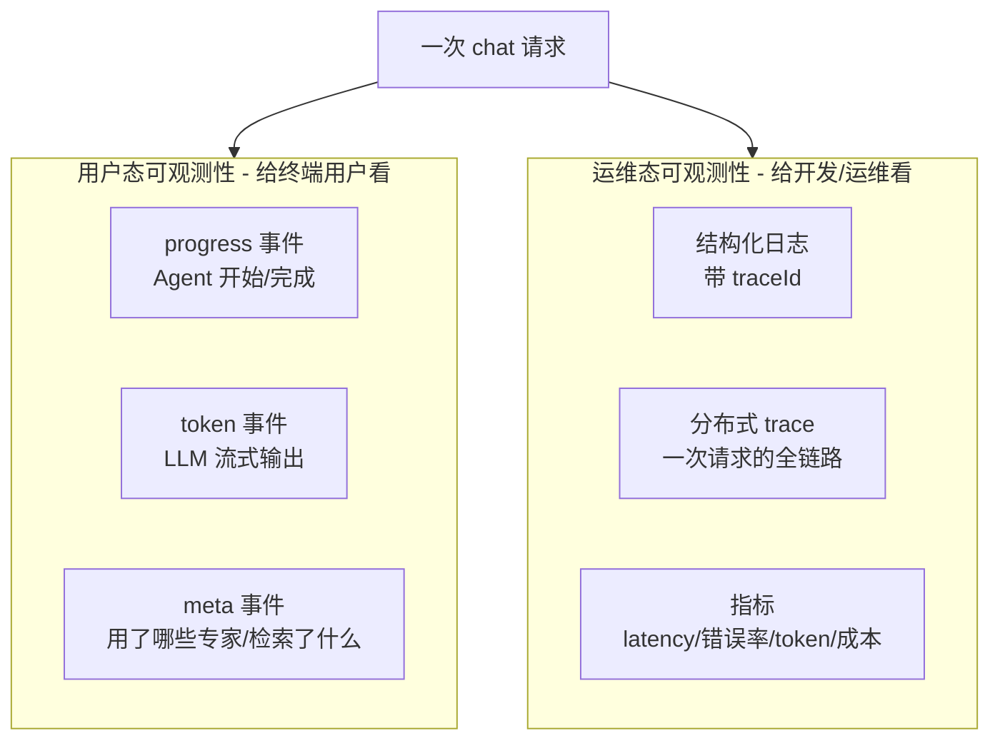


**用户态可观测性**：前面章节已经具备雏形。第八章实现 `streamAnalysisGraph` 时，通过 SSE 把 `progress`、`token`、`meta`、`log` 等事件推送给前端，用户可以看到「正在调用安全专家……」「正在汇总报告……」这类进度信息。这套机制面向**终端用户**，目标是降低等待过程的不确定性，并提升结果可信度。

以现有 SSE 协议为例，`services/chat/src/llm/ui-protocol/ui-types.ts` 中定义了 `StreamMessage`，前端 `ChatView.tsx` 这样消费 `log` 事件：

```tsx
// clients/chat-web/components/chat/ChatView.tsx（简化）
case 'log':
  const logPayload = msg.payload as LogPayload;
  if (logPayload) {
    if (logPayload.level === 'error') {
      console.error(`[Server Log]${logPayload.message}`, logPayload.data);
    } else if (logPayload.level === 'debug') {
      console.debug(`[Server Log]${logPayload.message}`, logPayload.data);
    } else {
      console.log(`[Server Log]${logPayload.message}`, logPayload.data);
    }
  }
  break;
```

这里需要明确边界：服务端的 `log` 事件被推送到**浏览器 console**，它有助于调试某一次具体对话，但并不等价于运维态可观测性。浏览器 console 无法稳定聚合、无法告警，也无法在用户关闭页面后作为长期排障依据。

**运维态可观测性**：这是本章的重点。它面向**开发、运维和平台工程团队**，目标是在生产问题出现时能够定位、优化和预警。它的三大支柱是业界共识的 Logs / Traces / Metrics（常称为可观测性三件套）。当前代码在这三件套上仍然比较薄弱：

| 支柱          | 现状                              | 问题                                       |
| ----------- | ------------------------------- | ---------------------------------------- |
| Logs（日志）    | 散落的 `console.log('前缀: ' + x)`   | 无结构、无法 grep 出「同一次请求的所有日志」、无法入日志系统        |
| Traces（追踪）  | 完全没有                            | 一次请求经过 triage→专家→Critic 各节点，没有任何东西把它们串起来 |
| Metrics（指标） | 只有 `GET /health → { ok: true }` | 无法观测 QPS、P99 延迟，也无法定位 token 消耗位置         |

> 一个常见误区：把「打了很多 log」当成「有可观测性」。日志数量不等于可观测性。可观测性的核心是**关联**（correlation）和**聚合**（aggregation）：既能把一次请求的执行碎片串联起来，也能从大量请求中计算趋势、异常与成本分布。缺少这两点，再多的 `console.log` 也只是噪音。

> 术语补充
>
> *   **Telemetry（遥测）**：系统运行时自动产生并对外输出的数据，通常包括 logs、traces、metrics。
> *   **Instrumentation（埋点 / 插桩）**：在代码关键路径中主动采集遥测数据的过程。
> *   **Correlation ID（关联 ID）**：用于把同一次请求的日志、指标和成本记录串起来的标识，本章采用 `traceId`。
> *   **Trace Context（追踪上下文）**：跨函数、跨异步调用甚至跨服务传播的追踪信息，标准形态是 W3C `traceparent`。
> *   **High Cardinality（高基数）**：取值数量极高的维度，例如 `traceId`、用户输入原文。高基数字段适合进入日志，不适合作为 Prometheus label。
> *   **SLI / SLO（服务水平指标 / 服务水平目标）**：SLI 描述可观测的服务质量指标，如 P95 延迟、错误率；SLO 则定义这些指标需要达到的目标区间。
> *   **RED Method（Rate / Errors / Duration）**：面向请求型服务的核心监控方法，分别关注请求速率、错误数量和请求耗时。
> *   **USE Method（Utilization / Saturation / Errors）**：面向资源层的监控方法，适合分析 CPU、内存、连接池和队列等基础资源。
> *   **Span Attribute（跨度属性）**：附着在 Span 上的键值对元数据，用于描述一次操作的模型、节点、token、状态等上下文。

本章接下来按「日志 → 链路追踪 → 埋点 → LLM 调用观测 → token 成本 → 指标与健康检查」的顺序，逐步把运维态可观测性接入主链路。

***

## 16.2 结构化日志：从 console.log 到 pino


> 将零散的 `console.log` 转换为可检索、可过滤、可关联的结构化日志，是生产排障的第一步。

### 16.2.1 现有日志的局限

先看当前日志形态。`conversation.controller.ts` 里是这种写法：

```tsx
// services/chat/src/conversation/conversation.controller.ts
console.warn(`[chat] 拒绝重复请求，会话${id}，时间间隔${now - existing.timestamp}ms`);
console.log(`[chat] 开始流式 Orchestrator Pipeline，会话${id}，用户${userId}，UI Stage:${uiContext?.uiStage || 'none'}`);
console.log(`[chat] Agent 完成:${event.agent}${event.parallel ? ' [parallel]' : ''}`);
console.error('[chat SSE error]', err);
```

`sse.service.ts`、`experts.ts`、`pipeline.ts`、`mcp-manager.ts` 等文件中也大量存在类似写法。当前工程尚未引入 `pino` / `winston` / `nestjs-pino`，也没有统一使用 NestJS 自带的 `Logger`。

这种日志主要有三个问题：

1.  **无法按请求聚合**：线上同时处理多个会话时，所有 `[chat] Agent 完成` 都混在同一份 stdout 中，难以判断每条日志属于哪一次请求。
2.  **无法被机器解析**：日志系统（Loki / ELK / Datadog）通常依赖结构化字段，`'[chat] Agent 完成: ' + name` 这类字符串拼接不利于提取 `agentName`、`conversationId`、`latencyMs` 等检索维度。
3.  **级别混乱**：大量使用 `console.log` 会让生产环境难以按 `level >= warn` 过滤调试噪音，也不利于告警规则和日志留存策略的统一配置。

现有代码中 `response.interceptor.ts` 和 `all-exceptions.filter.ts` 各自独立调用 `crypto.randomUUID()` 生成 traceId：

```tsx
// services/chat/src/common/response.interceptor.ts（改造前）
const traceId = crypto.randomUUID();
// ...
return {
  success: true,
  code: '200',
  msg: '请求成功',
  traceId,        // ← 返回给前端了
  data,
} as ApiResponse;
```

```tsx
// services/chat/src/common/all-exceptions.filter.ts（改造前）
const traceId = crypto.randomUUID();
const body: ApiResponse<null> = {
  success: false, code, msg: message as string, traceId, data: null,
};
```

这个设计有两个问题：**拦截器和异常 filter 的 traceId 互不关联**（各生成各的），并且 **traceId 只进入 HTTP 响应体，没有进入任何日志**。前端拿到一个 traceId 后，无法用它在服务端日志中检索到对应记录。

本章的第一个升级：**让 traceId 成为贯穿整个请求生命周期的唯一标识，统一生成、统一传播，并让所有日志都自动带上它。**

### 16.2.2 用 AsyncLocalStorage 让 traceId 自动贯穿

挑战在于：traceId 在 HTTP 中间件里生成，但使用它的位置（LangGraph 节点、专家子图、LLM 回调）与中间件之间隔着多个抽象层级。如果把 traceId 作为参数逐层透传，会污染大量函数签名。

Node.js 提供了一个更合适的方案：`AsyncLocalStorage`（ALS）。它可以创建「异步上下文」，在一次请求的整个异步调用链中，任意位置都能读取同一份上下文数据，而不需要显式传参。本质上，它提供的是「请求级隐式上下文」。

新建 `services/chat/src/observability/trace-context.ts`：

```tsx
// services/chat/src/observability/trace-context.ts
import { AsyncLocalStorage } from 'node:async_hooks';
import { randomUUID } from 'node:crypto';

interface TraceStore {
  traceId: string;
  startedAt: number;
}

const storage = new AsyncLocalStorage<TraceStore>();

/** 在给定 traceId 的上下文里执行 fn。HTTP 中间件用它包住整个请求处理。 */
export function runWithTrace<T>(traceId: string, fn: () => T): T {
  return storage.run({ traceId, startedAt: Date.now() }, fn);
}

/** 任意位置读取当前 traceId；不在 trace 上下文里（如启动期）则返回 'no-trace'。 */
export function getTraceId(): string {
  return storage.getStore()?.traceId ?? 'no-trace';
}

/** 读取当前请求已耗时（ms）。 */
export function getElapsedMs(): number {
  const store = storage.getStore();
  return store ? Date.now() - store.startedAt : 0;
}

/** 生成一个新的 traceId（供中间件在请求入口调用）。 */
export function newTraceId(): string {
  return randomUUID();
}
```

`AsyncLocalStorage` 的关键点是：它不是全局变量。`storage.run(store, fn)` 会建立一个上下文，`fn` 内部（包括它 `await` 出去再回来的所有异步操作）都能通过 `getStore()` 读取这个 `store`；而**并发的另一个请求**有自己的 `store`，互不串台。这可以解决 16.2.1 中「多个用户日志混在一起」的问题——每条日志带的 traceId 都来自所属请求的 ALS 上下文。

### 16.2.3 pino logger 单例

新建 `services/chat/src/observability/logger.ts`：

```tsx
// services/chat/src/observability/logger.ts
import pino from 'pino';
import { getTraceId } from './trace-context';

const isDev = process.env.NODE_ENV !== 'production';
const usePretty = process.env.LOG_PRETTY === '1';

/** pino mixin：每次打日志时从 ALS 读当前 traceId 注入。导出以便单测验证机制。 */
export function traceMixin(): { traceId: string } {
  return { traceId: getTraceId() };
}

const base = pino({
  level: process.env.LOG_LEVEL ?? (isDev ? 'debug' : 'info'),
  transport: usePretty
    ? { target: 'pino-pretty', options: { colorize: true, translateTime: 'HH:MM:ss.l' } }
    : undefined,
  mixin: traceMixin,
  redact: {
    paths: ['apiKey', '*.apiKey', 'headers.authorization', 'password', '*.password'],
    censor: '***',
  },
});

/** 给某个模块创建带固定字段的子 logger，例如 log = createLogger('orchestrator')。 */
export function createLogger(module: string) {
  return base.child({ module });
}

export const log = base;
```

这里有三个设计点：

1.  **`mixin` 自动注入 traceId**：不需要在每个 `log.info()` 调用里手动写 `{ traceId }`。pino 的 `mixin` 会在每次记录时调用，并从 ALS 读取当前 traceId 注入日志字段。这样，「所有日志都带 traceId」成为默认行为，开发者只需要写 `log.info('Agent 完成')`。`traceMixin` 单独导出，是为了让单测能脱离整个 pino 管线，直接验证「mixin 能从 ALS 读到当前 traceId」这一机制。
2.  **默认 JSON、按需 pretty**：默认输出紧凑 JSON（生产环境可直接进入日志系统，bun 运行时也更稳定），只有设置 `LOG_PRETTY=1` 时才走 `pino-pretty` 彩色渲染。之所以不默认 pretty，是因为 `pino-pretty` 依赖 worker-thread transport；默认 JSON 在各运行时下更稳妥。这不是「兼容性代码」，而是「同一份日志、两种渲染」的开关。
3.  **`redact` 脱敏**：把 `apiKey`、`authorization` 这类字段自动打码。这是第十八章 18.7.2「敏感数据不进日志」的前置防线，放在 logger 层处理最稳妥——即使开发者误写了 `log.info({ apiKey })`，也会被打码。

### 16.2.4 trace 中间件：在请求入口建立上下文

新建 `services/chat/src/observability/trace.middleware.ts`：

```tsx
// services/chat/src/observability/trace.middleware.ts
import { Injectable, type NestMiddleware } from '@nestjs/common';
import type { Request, Response, NextFunction } from 'express';
import { runWithTrace, newTraceId, getElapsedMs } from './trace-context';
import { createLogger } from './logger';
import { httpDuration } from './metrics';

const accessLog = createLogger('http');

@Injectable()
export class TraceMiddleware implements NestMiddleware {
  use(req: Request, res: Response, next: NextFunction): void {
    const incoming = req.headers['x-trace-id'];
    const traceId = (typeof incoming === 'string' && incoming) || newTraceId();

    runWithTrace(traceId, () => {
      res.setHeader('x-trace-id', traceId);
      res.on('finish', () => {
        const elapsedMs = getElapsedMs();
        const route = (req as any).route?.path ?? req.path;
        accessLog.info(
          { method: req.method, path: req.path, status: res.statusCode, elapsedMs },
          'http_request',
        );
        httpDuration.observe(
          { method: req.method, route, status: String(res.statusCode) },
          elapsedMs / 1000,
        );
      });
      next();
    });
  }
}
```

注册中间件（`app.module.ts` 的 `AppModule` 实现 `NestModule`）：

```tsx
// services/chat/src/app.module.ts
export class AppModule implements NestModule {
  configure(consumer: MiddlewareConsumer) {
    consumer.apply(TraceMiddleware).forRoutes('*');
  }
}
```

最后，把 `response.interceptor.ts` 和 `all-exceptions.filter.ts` 里那两处「各自 randomUUID」的 traceId 改成从 ALS 读：

```tsx
// services/chat/src/common/response.interceptor.ts —— 改后
import { getTraceId } from '../observability/trace-context';
// const traceId = crypto.randomUUID();  ← 删掉
const traceId = getTraceId();            // ← 改成读 ALS
```

```tsx
// services/chat/src/common/all-exceptions.filter.ts —— 改后
import { getTraceId } from '../observability/trace-context';
import { createLogger } from '../observability/logger';
const errorLog = createLogger('exception');
// ...
const traceId = getTraceId();
errorLog.error(
  { code, status, err: String(exception).slice(0, 300) },
  'unhandled_exception',
);
```

> 注意 `all-exceptions.filter.ts` 之前的一个隐患：它捕获异常后虽然有一句 `console.error('[AllExceptionsFilter]', exception)`，但这是**未结构化、未关联 traceId** 的直接输出——既不利于进入日志系统检索，也难以和这次请求的其他日志串联。我们把它换成 `errorLog.error(...)`（结构化 + 自动带 traceId），这属于本章接入的直接相关项，不属于无关重构。

改完之后，前端拿到的 `traceId`、HTTP 响应头的 `x-trace-id`、以及这次请求在服务端产生的**每一条日志**，都会使用同一个 ID。线上排障时，如果拿到某次请求的 traceId，就可以通过 `grep "traceId":"xxx"` 检索出这次请求的完整日志链路。

*   🤖 生成代码 Prompt：结构化日志与 traceId 贯穿

        在 services/chat/src/observability/ 下新建：
        1. trace-context.ts：用 AsyncLocalStorage 维护 { traceId, startedAt }，导出
           runWithTrace/getTraceId/getElapsedMs/newTraceId。
        2. logger.ts：pino 单例，mixin 自动注入 getTraceId()，默认输出 JSON、LOG_PRETTY=1 才用 pino-pretty，
           redact 脱敏 apiKey/authorization/password。导出 createLogger(module) 与 traceMixin。
        3. trace.middleware.ts：NestMiddleware，复用 x-trace-id 或新建，runWithTrace 包住 next()，
           回写响应头，res.on('finish') 打 access 日志 + httpDuration.observe。
        然后：
        - app.module.ts 注册 TraceMiddleware.forRoutes('*')
        - response.interceptor.ts / all-exceptions.filter.ts 的 traceId 改为 getTraceId()
        - all-exceptions.filter.ts 补 errorLog.error 记录异常
        约束：不改业务逻辑；console.log 暂不全量替换，只改本章接线点。

### 16.2.5 日志级别选择策略：什么时候用什么级别

如果日志全部使用 `console.log`，上线后很容易出现两类问题：级别太高时看不到关键上下文，级别太低时又会被大量调试日志淹没。日志级别不应随意选择，它是在噪音和有效信息之间建立的边界。

pino（以及绝大多数日志库）定义了这些级别，从低到高：

| 级别      | 数字 | 语义          | 什么时候用                            | 本项目实例                                                                 |
| ------- | -- | ----------- | -------------------------------- | --------------------------------------------------------------------- |
| `trace` | 10 | 极其详细的执行追踪   | 一般不用；只有在排查极度诡异的问题时临时打开           | 极少使用                                                                  |
| `debug` | 20 | 开发和调试期有用的信息 | 函数的输入输出形状、中间状态、条件分支走了哪条路         | `log.debug({ inputLen: state.input.length }, 'extractNode_start')`    |
| `info`  | 30 | 关键业务事件      | 请求完成、Agent 启动/结束、状态变更——「正常但值得记录」 | `accessLog.info({ method, path, status, elapsedMs }, 'http_request')` |
| `warn`  | 40 | 异常但可恢复      | 降级、重试、超时但最终成功、接近阈值——「尚未失败但需要关注」  | `console.warn('[triage] 结构化输出解析失败，降级为 analyze')`                      |
| `error` | 50 | 本次操作失败      | 未捕获异常、LLM 调用报错、DB 写入失败——「本次请求失败」 | `errorLog.error({ code, status, err }, 'unhandled_exception')`        |
| `fatal` | 60 | 进程即将崩溃      | 出了不可恢复的错误，进程马上要退出                | 一般只在最外层 uncaughtException handler 里用                                  |

**生产环境级别配置策略**：

    # 生产环境：只输出 info 及以上。debug/trace 会被 pino 在序列化前就跳过，零开销。
    LOG_LEVEL=info

    # 排障时：临时调到 debug（不需要重启进程——pino 支持运行时调级别，但需要额外接口）
    LOG_LEVEL=debug

    # 本地开发：默认 debug（我们的 logger.ts 已经这么做了）
    NODE_ENV=development  # → 自动 debug

常见错误是在 `info` 级别输出大量调试信息。`info` 不是「看起来有用」的同义词，而是**默认会在生产环境输出**的日志，每条都应具备清晰的业务意义。一个实用判断标准是：**如果删除这条日志，排障时是否会缺少关键信息？** 如果答案是否定的，它更适合放在 `debug`。

本项目的级别使用约定：

```tsx
// ✅ info：一个请求级事件完成，值得记录
log.info({ runId, latencyMs, inputTokens, outputTokens }, 'llm_end');

// ✅ debug：节点内部的中间状态，排查用
log.debug({ inputLen: state.input.length }, 'extractNode_start');

// ✅ warn：出了问题但自动降级了
log.warn({ err: String(err).slice(0, 120) }, 'triage_parse_failed_fallback_analyze');

// ✅ error：这次操作确实失败了
log.error({ code, status, err: String(exception).slice(0, 300) }, 'unhandled_exception');

// ❌ 错误用法：在 info 级别打 debug 信息
log.info({ rawLength: extractRaw.length }, 'extractNode_ai_done');  // 这应该是 debug
```

### 16.2.6 结构化日志字段设计规范

结构化日志的价值不在「输出 JSON」——JSON 只是格式。真正的价值在于**一致的字段设计**，让下游工具（jq、Loki、Elasticsearch）能按字段做过滤、聚合、可视化。

**必选字段**（pino 自动填充或 mixin 注入）：

| 字段        | 来源           | 说明                                                  |
| --------- | ------------ | --------------------------------------------------- |
| `level`   | pino 自动      | 数字 (30) 或字符串 (info)，取决于 serializer                  |
| `time`    | pino 自动      | Unix epoch 毫秒（pino 默认格式）                            |
| `traceId` | mixin 注入     | 请求级唯一标识，贯穿全链路                                       |
| `module`  | child logger | 标明日志来自哪个模块（http / llm / exception / analysis-graph） |
| `msg`     | 手动传入         | 事件名（不是自然语言描述，而是一个可 grep 的短标识）                       |

**可选字段**（按场景手动传入）：

| 字段                             | 说明              | 示例                             |
| ------------------------------ | --------------- | ------------------------------ |
| `method`                       | HTTP 方法         | `GET` / `POST`                 |
| `path`                         | 请求路径            | `/api/conversations/123/chat`  |
| `status`                       | HTTP 状态码        | `200`                          |
| `elapsedMs`                    | 耗时（毫秒）          | `3421`                         |
| `runId`                        | LangChain 调用 ID | `run-abc123`                   |
| `inputTokens` / `outputTokens` | Token 用量        | `120` / `48`                   |
| `model`                        | 模型名             | `gpt-5.4`                      |
| `err`                          | 错误摘要（截断）        | `Error: Connection timeout...` |

**字段命名约定**：

    1. 使用 camelCase（与 JS 生态一致）
    2. msg 用下划线分隔的事件标识，不用自然语言：
       ✅ 'http_request'  'llm_end'  'unhandled_exception'  'extractNode_start'
       ❌ '请求完成'  'LLM调用结束了'  'HTTP 请求处理完毕'
    3. 数值字段带单位后缀：
       ✅ elapsedMs  latencyMs  inputTokens  estimatedCostUsd
       ❌ elapsed  latency  input  cost
    4. 布尔字段用 is/has 前缀：
       ✅ isEstimated  hasExtracted
       ❌ estimated  extracted

一条真实的 JSON 日志长这样：

```json
{
  "level": 30,
  "time": 1749622800123,
  "traceId": "a1b2c3d4-e5f6-7890-abcd-ef1234567890",
  "module": "http",
  "method": "POST",
  "path": "/api/conversations/conv-001/chat",
  "status": 200,
  "elapsedMs": 8342,
  "msg": "http_request"
}
```

与 `console.log('[chat] 请求完成')` 比，这条日志每个字段都可以独立检索：

```bash
# 按 traceId 查某次请求的所有日志
jq 'select(.traceId == "a1b2c3d4-e5f6-7890-abcd-ef1234567890")'

# 找所有慢请求（>5s）
jq 'select(.msg == "http_request" and .elapsedMs > 5000)'

# 统计各状态码分布
jq 'select(.msg == "http_request") | .status' | sort | uniq -c
```

### 16.2.7 pino 的 Transport 架构深度详解

为什么选 pino 而不是 winston？原因在于 pino 更重视运行时性能。它的核心设计是把「序列化 JSON」和「写入目的地」这两步尽量解耦。

### pino 的性能来源

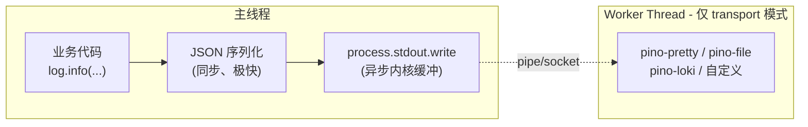


*   **默认模式**（无 transport）：`pino()` 对已知字段（`level`、`time`、`msg` 等）使用字符串拼接直接构造 JSON，减少 `JSON.stringify` 的通用对象遍历开销；用户字段才走 `JSON.stringify`。写入依赖 `sonic-boom`（非阻塞写入 + 内核缓冲）异步完成。这也是 pino 在常见基准测试中通常比 winston 更快的原因。
*   **transport 模式**（如 `pino-pretty`）：日志通过管道发送到一个 **worker thread**，在那里做格式化/发送。主线程只负责序列化，不被 I/O 阻塞。

### transport 配置详解

我们的 `logger.ts` 目前只用了最简单的 transport 切换：

```tsx
transport: usePretty
  ? { target: 'pino-pretty', options: { colorize: true, translateTime: 'HH:MM:ss.l' } }
  : undefined,
```

生产环境可以用更复杂的配置。例如同时输出到 stdout（给容器日志系统）和文件（做本地备份）：

```tsx
import pino from 'pino';

const logger = pino({
  transport: {
    targets: [
      // 1. stdout：默认 JSON，给 Docker 日志驱动
      { target: 'pino/file', options: { destination: 1 } },
      // 2. 文件：本地备份（传统部署场景）
      {
        target: 'pino/file',
        options: {
          destination: '/var/log/chat-service/app.log',
          mkdir: true,
        },
      },
      // 3. 远端推送：直接发给 Loki（跳过中间收集器）
      {
        target: 'pino-loki',
        options: {
          host: 'http://loki:3100',
          batching: true,
          interval: 5,
          labels: { app: 'chat-service', env: 'production' },
        },
      },
    ],
  },
});
```

> `pino-loki`、`pino-elasticsearch`、`pino-datadog` 等都是社区维护的 transport，各自把日志直接推送到对应后端。但生产里更常见的做法是 **stdout + 外部采集器**（见 16.2.10），因为应用不应该知道日志去了哪里——职责分离。

### pino 生态常用 transport

| transport                | 作用                      | 适用场景                   |
| ------------------------ | ----------------------- | ---------------------- |
| `pino-pretty`            | 彩色美化输出                  | 本地开发                   |
| `pino/file`              | 写入文件或 fd                | 传统部署、本地备份              |
| `pino-loki`              | 直推 Grafana Loki         | 没有 Fluent Bit 中间层的轻量部署 |
| `pino-elasticsearch`     | 直推 Elasticsearch        | ELK 栈                  |
| `pino-datadog-transport` | 直推 Datadog              | Datadog 用户             |
| `pino-sentry-transport`  | 把 error/fatal 推到 Sentry | 错误追踪                   |
| `pino-roll`              | 文件 transport + 内置轮转     | 替代 logrotate 的一体化方案    |

### 16.2.8 日志轮转：容器化与传统两种范式

日志轮转（log rotation）解决一个朴素的问题：**日志文件会一直长，磁盘终将写满**。但解法在容器化和传统部署下完全不同。

### 范式一：传统部署（物理机/VM）——应用自己管文件

传统部署里，应用把日志写到文件（如 `/var/log/chat-service/app.log`），你需要主动轮转这个文件。

**方案 A：OS 级 logrotate**

Linux 自带的 `logrotate` 是最经典的方案。创建 `/etc/logrotate.d/chat-service`：

    /var/log/chat-service/*.log {
        daily              # 每天轮转一次
        rotate 14          # 保留 14 个历史文件
        compress           # 历史文件用 gzip 压缩
        delaycompress      # 最近一次轮转的文件不压缩（便于 tail -f）
        missingok          # 文件不存在不报错
        notifempty         # 空文件不轮转
        copytruncate       # 先复制再截断（不需要重启进程）
        size 100M          # 文件超过 100MB 也触发轮转（与 daily 取 OR）
        dateext            # 文件名带日期后缀：app.log-20260611.gz
        dateformat -%Y%m%d
    }

`copytruncate` 是关键：它先把当前日志复制到历史文件，然后把原文件截断为空。这意味着 pino 不需要做任何事——它一直往同一个 fd 写，文件被截断后下一次写入自动从头开始。但 `copytruncate` 有一个窗口期：复制到截断之间可能丢几行日志。在日志量不是极端大的场景下，这通常可接受。

**方案 B：pino-roll（应用级轮转）**

`pino-roll` 是 pino 官方推荐的内置轮转方案，无需 OS 级工具：

```tsx
import pino from 'pino';

const logger = pino({
  transport: {
    target: 'pino-roll',
    options: {
      file: '/var/log/chat-service/app',  // 基础文件名
      frequency: 'daily',                 // daily / hourly / 自定义毫秒数
      size: '100m',                       // 按大小轮转
      limit: { count: 14 },              // 最多保留 14 个文件
      dateFormat: 'yyyy-MM-dd',           // 文件名日期格式
      // 生成的文件：app.2026-06-11.log, app.2026-06-10.log, ...
    },
  },
});
```

**方案 A vs B 的选择**：

| 维度    | logrotate         | pino-roll           |
| ----- | ----------------- | ------------------- |
| 依赖    | OS 级工具，需 root 配置  | npm 包，应用内配置         |
| 丢日志风险 | copytruncate 有窗口期 | 无                   |
| 适用场景  | 多应用统一管理           | 单应用自管               |
| 容器兼容  | 不适合（容器里通常没 cron）  | 可以但不推荐（容器应走 stdout） |

### 范式二：容器化部署（Docker/K8s）——应用不管轮转

容器化的哲学是：**应用把日志输出到 stdout/stderr，轮转由容器运行时管**。这也是我们的 pino 默认输出 JSON 到 stdout 的原因。

**Docker 日志驱动配置**：

Docker 默认使用 `json-file` 日志驱动，它自带轮转。在 `/etc/docker/daemon.json` 全局配置：

```json
{
  "log-driver": "json-file",
  "log-opts": {
    "max-size": "50m",
    "max-file": "5",
    "compress": "true"
  }
}
```

也可以在 `docker-compose.yaml` 里针对单个服务配：

```yaml
services:
chat:
image: autix/chat:latest
logging:
driver: json-file
options:
max-size:"50m"
max-file:"5"
```

这会产生这样的文件结构：

    /var/lib/docker/containers/<container-id>/
      <container-id>-json.log          # 当前日志（最大 50MB）
      <container-id>-json.log.1        # 历史 1
      <container-id>-json.log.2        # 历史 2
      ...

**Kubernetes 的日志架构**：

K8s 里容器的 stdout 被 kubelet 写到节点的 `/var/log/pods/` 下，kubelet 自带轮转（默认单个容器 10MB × 5 个文件）。`kubectl logs` 读的就是这些文件。

但 `kubectl logs` 只能看**当前 Pod** 的日志，Pod 重启后日志丢失。生产环境必须有一个日志采集层把日志从节点上运走：

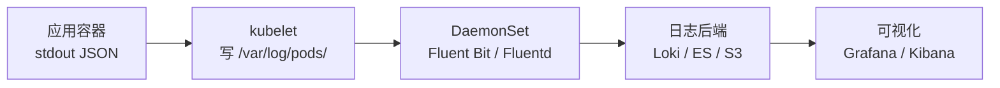


两种日志采集模式：

| 模式 | DaemonSet     | Sidecar          |
| -- | ------------- | ---------------- |
| 部署 | 每个节点一个采集器 Pod | 每个应用 Pod 内一个采集容器 |
| 优点 | 资源共享、集中管理     | 隔离性强、可按应用配策略     |
| 缺点 | 配置统一、不够灵活     | 资源开销大（每 Pod 一个）  |
| 适合 | 大多数场景         | 多租户、日志量差异大的场景    |

> **关键认知**：在容器化环境里，应用代码（pino）只负责「输出结构化 JSON 到 stdout」，轮转由容器运行时负责，采集和存储由基础设施负责。这就是为什么我们的 `logger.ts` 默认不配任何文件 transport——它**刻意不管日志去了哪里**，职责分离。

### 16.2.9 日志查找实战：从 jq 到 Loki

日志产生之后，如果无法检索到目标记录，就无法发挥排障价值。本节按复杂度介绍四层查找手段。

### 第一层：jq——本地 JSON 日志处理工具

`jq` 是处理 JSON 日志的常用命令行工具。它能解析 JSON 流，按字段过滤、变换、聚合。

**先产生日志文件**：pino 默认把 JSON 日志输出到 stdout。要用 jq 分析，需要先把输出重定向到文件：

```bash
# 在 services/chat/ 目录下执行
cd services/chat

# 方式一：开发模式，将日志重定向到文件（后台运行）
bun run dev > app.log 2>&1 &

# 方式二：生产模式
bun run build && bun run start > app.log 2>&1 &

# 方式三：实时查看 + 同时写文件（推荐调试用）
bun run dev 2>&1 | tee app.log

# 发几个请求后（比如 POST /api/conversations/:id/chat），app.log 就有结构化 JSON 日志了
```

> 后续所有 `cat app.log | jq` 示例都假设你已经通过上述方式生成了日志文件。如果只想实时查看，也可以直接管道：`bun run dev 2>&1 | jq '.'`。

**基础用法**：

```bash
# 查看 JSON 日志文件（pino JSON → jq 美化）
cat app.log | jq '.'

# 只看 error 级别
cat app.log | jq 'select(.level >= 50)'

# 按 traceId 过滤（排障最常用！）
cat app.log | jq 'select(.traceId == "a1b2c3d4-...")'

# 只看 LLM 调用日志
cat app.log | jq 'select(.module == "llm")'

# 看所有慢请求（HTTP 耗时 > 5 秒）
cat app.log | jq 'select(.msg == "http_request" and .elapsedMs > 5000)'
```

**进阶用法**：

```bash
# 统计各模块的日志数量
cat app.log | jq -r '.module' | sort | uniq -c | sort -rn

# 提取 LLM 调用的 token 用量，按输入 token 降序
cat app.log | jq 'select(.msg == "llm_end")
  | {runId, inputTokens, outputTokens, latencyMs}' | jq -s 'sort_by(-.inputTokens)'

# 计算某段时间的 LLM 平均延迟
cat app.log | jq 'select(.msg == "llm_end")
  | .latencyMs' | jq -s 'add / length'

# 只看特定时间窗口的日志（pino 的 time 是 epoch ms）
# Linux:
START=$(date -d '2026-06-11 10:00:00' +%s)000
END=$(date -d '2026-06-11 11:00:00' +%s)000
# macOS:
START=$(date -j -f '%Y-%m-%d %H:%M:%S' '2026-06-11 10:00:00' +%s)000
END=$(date -j -f '%Y-%m-%d %H:%M:%S' '2026-06-11 11:00:00' +%s)000

cat app.log | jq "select(.time >=$START and .time <$END)"
```

**jq 配合 pino-pretty 的管道**：

```bash
# 日志太多时先 jq 过滤再 pretty（pino-pretty 安装在 services/chat 的 node_modules 中）
cat app.log | jq 'select(.level >= 40)' | bunx pino-pretty

# 或者反过来：先看全部，再管道给 jq 做统计
cat app.log | jq -s 'group_by(.module) | map({module: .[0].module, count: length})'
```

### 第二层：ripgrep（rg）——比 grep 更快的文本搜索

当你只知道某个关键字（比如一个 traceId 或一个错误消息），用 `rg`（ripgrep）比 `jq` 更快：

```bash
# 按 traceId 全量搜索（在 app.log 或日志目录中）
rg '"traceId":"a1b2c3d4"' app.log

# 搜索所有 error 级别日志
rg '"level":50' app.log

# 搜索包含特定错误信息的日志
rg 'Connection timeout' app.log

# 结合 jq：rg 先过滤行，jq 再解析
rg '"msg":"llm_error"' app.log | jq '.'
```

> `rg` 比 `grep` 快 2\~5 倍（Rust 实现 + SIMD + 多线程），在大日志文件上差距更明显。

### 第三层：Grafana Loki + LogQL——生产级日志检索

Loki 是 Grafana 生态中的日志聚合系统，它的核心设计理念是\*\*「like Prometheus, but for logs」\*\*：不做全文索引，而是主要索引标签（labels），从而降低存储和索引成本。

**Loki 架构**：

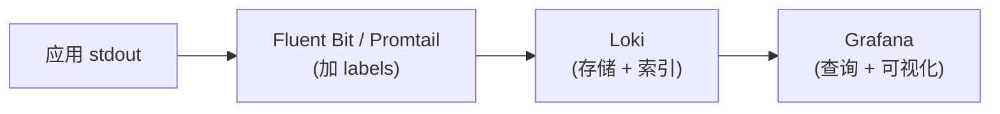

Loki 的查询语言是 **LogQL**，分两部分：标签选择 + 内容过滤。

    # 1. 标签选择：先缩小范围（高效，走索引）
    {app="chat-service", env="production"}

    # 2. 内容过滤：在标签过滤后的结果上做文本匹配（走扫描，但范围已缩小）
    {app="chat-service"} |= "unhandled_exception"

    # 3. JSON 解析 + 字段过滤
    {app="chat-service"} | json | traceId = "a1b2c3d4-..."

    # 4. 查慢请求
    {app="chat-service"} | json | msg = "http_request" | elapsedMs > 5000

    # 5. 统计每分钟 error 数（metrics from logs）
    count_over_time({app="chat-service"} |= "unhandled_exception" [1m])

    # 6. 统计 P99 延迟（从日志里提取数值做聚合）
    {app="chat-service"} | json | msg = "http_request"
      | quantile_over_time(0.99, elapsedMs[5m])

**为什么 Loki 比 ELK 适合我们？**

| 维度    | Loki         | Elasticsearch |
| ----- | ------------ | ------------- |
| 索引策略  | 只索引标签（低成本）   | 全文倒排索引（高成本）   |
| 存储成本  | 低（S3/GCS 即可） | 高（SSD + 大内存）  |
| 查询能力  | 标签 + 管道过滤    | 全文搜索 + 聚合     |
| 适合场景  | 日志量大、预算有限    | 需要复杂全文搜索      |
| 运维复杂度 | 低（单二进制）      | 高（集群管理）       |

我们的日志是**结构化 JSON + 标签过滤**的使用模式，Loki 通常已经足够。只有当系统需要对日志内容做**非结构化全文搜索**（例如搜索某类业务文本；但用户消息原文不应进入日志，见 16.8.2）时，才需要评估 Elasticsearch。

### 第四层：ELK Stack 简介

ELK（Elasticsearch + Logstash + Kibana）是日志领域的成熟方案，很多企业已有相关基础设施。其架构如下：

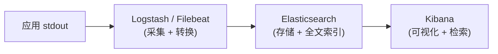

ELK 的优势在于 Elasticsearch 的**全文搜索能力**和 Kibana 的**强大可视化**（Dashboard、Lens、Discover）。但它的运维成本远高于 Loki——Elasticsearch 集群需要专人维护，内存和存储开销也大得多。

### 按团队规模选型

> 日志后端的选型严格来说超出了应用开发的范畴——它是 DevOps / SRE 的决策领域。但作为开发者，理解这些选项的边界和代价，能帮你在与运维团队协作时做出更合理的判断，也能避免”上了 ELK 结果没人维护”这种维护困境。

| 团队规模                | 推荐方案                                                                       | 理由                                                                                          |
| ------------------- | -------------------------------------------------------------------------- | ------------------------------------------------------------------------------------------- |
| **1\~3 人 / 个人项目**   | `docker logs` • `jq`                                                       | 零基建成本。这个阶段应优先投入产品与核心链路，日志量较小时 jq 通常已经足够                                                     |
| **3\~10 人 / 初创团队**  | Grafana Loki + Promtail/Fluent Bit                                         | 单节点 Loki 就能支撑。运维极轻——一个 `docker-compose` 拉起 Loki + Grafana 即可。配合 Prometheus 一起用，可观测性三件套一站式解决 |
| **10\~50 人 / 中型团队** | Grafana 观测栈（Loki + Tempo + Prometheus + Grafana）或 Datadog/New Relic 等 SaaS | 开始需要日志→trace→metrics 三者打通。如果有 SRE，自建 Grafana 栈成本可控；如果没有专职运维，使用 SaaS 可以降低维护成本                |
| **50+ 人 / 多团队协作**   | ELK / OpenSearch（日志做数据资产）+ Grafana 栈（可观测性排障）                               | 日志不再只是排障工具——安全团队要做审计分析、产品团队要做行为分析、合规团队要做留存。Elasticsearch 的全文检索和复杂聚合在这里才有价值                  |

**两者混用是常见模式**：很多中大型公司同时用 Prometheus + Grafana + Loki 做可观测性排障，用 Elasticsearch 做安全审计和复杂日志分析。两套系统分别覆盖不同场景，互不替代。

粗略的判断原则：

*   目标是\*\*「线上出问题时，按 service / pod / traceId 快速定位」\*\*→ Loki 更轻量
*   目标是\*\*「把日志当可搜索数据资产，做复杂查询、报表、安全审计」\*\*→ Elasticsearch 更合适
*   如果暂时无法确定 → 先从 Loki 开始，成本低、接入快，出现明确全文搜索需求后再引入 ES

### 16.2.10 日志聚合架构全景：从 stdout 到 Grafana

把前面的知识串起来，看三种从简到繁的日志架构：

### 架构 1：轻量级（本地开发 / 小团队）

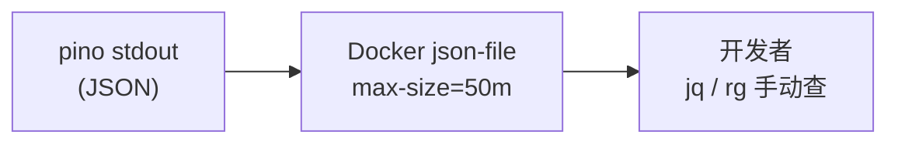


适合：个人项目、原型期、小团队。没有任何外部基建，主要依赖 `docker logs` + `jq` 排障。当前实现可以先按这一阶段落地。

### 架构 2：中量级（中等规模生产）

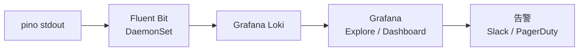

适合：10\~100 个容器的生产环境。Fluent Bit 资源占用极小（\~5MB RAM），Loki 单节点即可支撑中等日志量。

Fluent Bit 的配置示例（DaemonSet 方式采集容器日志）：

    [INPUT]
        Name              tail
        Path              /var/log/containers/*.log
        Parser            docker
        Refresh_Interval  5
        Mem_Buf_Limit     5MB

    [FILTER]
        Name              kubernetes
        Match             *
        Merge_Log         On
        K8S-Logging.Parser On

    [OUTPUT]
        Name              loki
        Match             *
        Host              loki.monitoring.svc.cluster.local
        Port              3100
        Labels            job=fluent-bit, app=$kubernetes['labels']['app']
        Auto_Kubernetes_Labels On

### 架构 3：重量级（大规模 / 多团队）

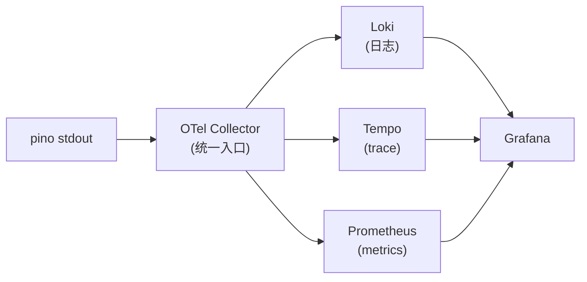


适合：大规模、需要日志/trace/metrics 三者打通的场景。OpenTelemetry Collector 作为统一的数据采集层，一个入口接收所有遥测数据，分发到不同后端。这也是 16.3.8 将要讨论的标准方案。

### 16.2.11 敏感数据处理策略详解

日志里泄露敏感信息是一个严重的安全和合规问题。我们的 `logger.ts` 做了第一道防线，这里展开讲。

**pino redact 的工作原理**：

```tsx
redact: {
  paths: ['apiKey', '*.apiKey', 'headers.authorization', 'password', '*.password'],
  censor: '***',
},
```

`redact` 在 pino 序列化 JSON 时生效：它遍历 `paths` 中的路径表达式，把匹配的字段值替换成 `censor` 值。路径支持：

*   精确路径：`'apiKey'` — 匹配顶层的 `apiKey` 字段
*   通配符：`'*.apiKey'` — 匹配任意一层嵌套下的 `apiKey`
*   深层通配符：`'**.secret'` — 匹配任意深度的 `secret`
*   数组索引：`'users[*].password'` — 匹配数组中每个元素的 `password`

实际效果：

```tsx
log.info({ apiKey: 'sk-abc123', user: { password: 'hunter2' } }, 'test');
// 输出：{"apiKey":"***","user":{"password":"***"},...,"msg":"test"}
```

**需要脱敏的字段分类**：

| 类别        | 字段示例                            | 处理方式                         |
| --------- | ------------------------------- | ---------------------------- |
| 凭证类       | apiKey, password, token, secret | `redact` 直接打码                |
| 认证头       | Authorization, Cookie           | `redact` 直接打码                |
| PII（个人信息） | 用户名, 邮箱, 手机号                    | 记 hash 或脱敏（`user@e****.com`） |
| 业务敏感      | 用户输入原文, 需求描述, 对话内容              | **不记入日志**，只记长度/形状            |
| 内部地址      | 内网 IP, 数据库连接串                   | 按需脱敏                         |

> **pino redact 不能挡业务敏感数据**。`redact` 只能按字段路径匹配——它不知道 `userMessage` 里有公司机密。业务敏感数据的脱敏靠的是**开发者的纪律**。我们的约定是：日志记 ID 和形状，不记内容。

本项目的实际做法：

```tsx
// ✅ 正确：只记长度，不记原文
log.debug({ inputLen: state.input.length }, 'extractNode_start');

// ✅ 正确：记事件标识和形状
log.info({ traceId: getTraceId(), messageLen: body.message.length }, 'chat_received');

// ❌ 错误：把用户输入原文记进日志
log.info({ message: body.message }, 'chat_received');

// ❌ 错误：把 LLM 的完整 prompt 记进日志
log.debug({ prompt: systemPrompt + userMessage }, 'llm_call');
```

***

## 16.3 链路追踪深度解析：从 traceId 到 Span


> Trace 负责串起一次完整请求，Span 负责表达每个节点、模型调用和工具调用之间的层级关系。

16.2 解决了「同一次请求的日志能被串起来」——但这只是链路追踪的起点。本节从概念到工具，全面讲透分布式追踪。

### 16.3.1 为什么需要分布式追踪

一次需求分析请求在我们系统里的真实调用链：

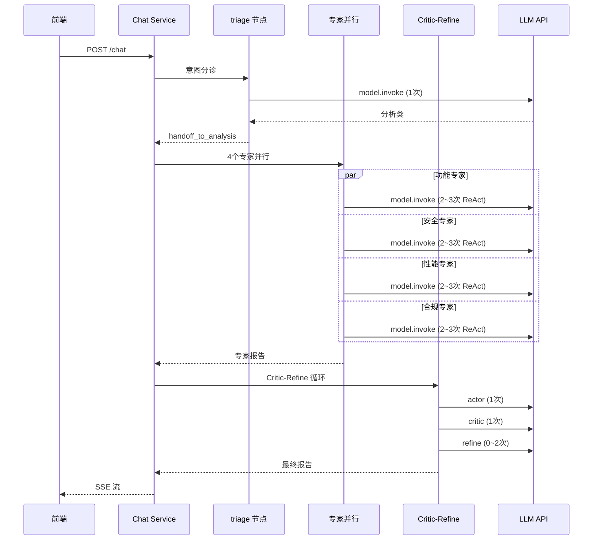


整条链路通常包含**十几到几十次 LLM 调用**，并跨越多个子图、节点和工具。当一次请求变慢时，仅知道「本次请求耗时很长」并不足够，还需要定位具体瓶颈：是 triage 判断慢、专家并行阶段慢，还是某个 Critic-Refine 循环触发了过多模型调用。

单个 traceId 可以把同一次请求的日志关联起来，但它**不能表达调用层级和因果关系**。例如，日志中出现多条 `llm_end` 记录时，仅凭扁平日志无法判断哪一次属于 triage，哪一次属于安全专家，也无法还原安全专家内部多轮 ReAct 调用的顺序。

这正是 **Span 模型**要解决的问题。

### 16.3.2 追踪的核心概念模型：Trace、Span、SpanContext

**Trace（追踪）**：一次完整请求的全部执行路径。它由多个 Span 组成。

**Span（跨度）**：一次操作的执行记录。它有：

| 属性              | 说明            | 示例                                                      |
| --------------- | ------------- | ------------------------------------------------------- |
| `traceId`       | 所属 Trace 的 ID | `a1b2c3d4-e5f6-7890-abcd-ef1234567890`                  |
| `spanId`        | 自己的 ID        | `1a2b3c4d`                                              |
| `parentSpanId`  | 父 Span 的 ID   | `0000000` (根 Span 无父)                                   |
| `operationName` | 操作名称          | `POST /api/chat` / `triage` / `security-expert.llm`     |
| `startTime`     | 开始时间          | `2026-06-11T10:00:00.000Z`                              |
| `duration`      | 持续时间          | `3421ms`                                                |
| `status`        | 状态            | `OK` / `ERROR`                                          |
| `attributes`    | 键值对属性         | `{ model: 'gpt-5.4', inputTokens: 120 }`                |
| `events`        | 时间线事件         | `[{ name: 'retry', time: ..., attrs: { attempt: 2 } }]` |

Span 之间通过 `parentSpanId` 形成**树状结构**：

    Trace: a1b2c3d4-...
    ├─ Span: POST /api/chat (根 Span, 8342ms)
    │  ├─ Span: triage (1200ms)
    │  │  └─ Span: llm.invoke (1100ms) { model: 'gpt-5.4', inputTokens: 500 }
    │  ├─ Span: expert-analysis (4500ms)
    │  │  ├─ Span: functional-expert (3200ms)
    │  │  │  ├─ Span: llm.invoke (1500ms) { inputTokens: 800 }
    │  │  │  └─ Span: llm.invoke (1200ms) { inputTokens: 600 }  ← ReAct 第二轮
    │  │  ├─ Span: security-expert (4500ms)
    │  │  │  ├─ Span: llm.invoke (2000ms) { inputTokens: 900 }
    │  │  │  ├─ Span: tool.searchRequirement (300ms)
    │  │  │  └─ Span: llm.invoke (1800ms) { inputTokens: 700 }
    │  │  ├─ Span: performance-expert (2800ms)
    │  │  └─ Span: compliance-expert (3100ms)
    │  └─ Span: critic-refine (2500ms)
    │     ├─ Span: actor (1200ms)
    │     │  └─ Span: llm.invoke (1100ms)
    │     ├─ Span: critic (800ms)
    │     │  └─ Span: llm.invoke (700ms)
    │     └─ Span: refine (500ms)
    │        └─ Span: llm.invoke (400ms)

有了这棵树，你直接就能看出：安全专家耗时 4500ms 是瓶颈，其中一次 LLM 调用就花了 2000ms。这是扁平日志永远给不了你的上下文。

**SpanContext（跨度上下文）**：Span 的身份证——包含 `traceId` + `spanId` + trace flags（如采样标记）。它是跨进程传播 trace 的核心载体。

### 16.3.3 W3C Trace Context 标准与 traceparent 格式

W3C Trace Context（<https://www.w3.org/TR/trace-context/）是分布式追踪的标准> HTTP 传播协议。它定义了两个 HTTP 头：

**`traceparent` 头格式**：

    traceparent: 00-<trace-id>-<parent-span-id>-<trace-flags>
                 ^^  ^^^^^^^^^^  ^^^^^^^^^^^^^^^  ^^^^^^^^^^^^
                 版本  32 hex     16 hex          01=采样

例：`traceparent: 00-a1b2c3d4e5f67890abcdef1234567890-1a2b3c4d5e6f7890-01`

*   `00`：版本号（目前只有 00）
*   `a1b2c3d4...`：trace-id（16 字节，32 hex）
*   `1a2b3c4d...`：parent-span-id（8 字节，16 hex）
*   `01`：trace-flags（01 表示已采样，00 表示未采样）

**`tracestate` 头**：用于厂商特定的追踪信息（如 `tracestate: congo=t61RCWkgMzE,rojo=00f067aa0ba902b7`）。

**我们的 `x-trace-id` 与 W3C 的关系**：

我们目前用 `x-trace-id` 头传递 traceId，这是一个**简化的自定义方案**。它和 W3C 标准的差异：

| 维度      | 我们的 `x-trace-id` | W3C `traceparent`              |
| ------- | ---------------- | ------------------------------ |
| 传递内容    | 只有 traceId       | traceId + spanId + flags       |
| Span 层级 | 无（扁平）            | 有（通过 parentSpanId）             |
| 采样标记    | 无                | 有（flags 字段）                    |
| 工具兼容    | 只有我们自己认          | Jaeger/Tempo/Zipkin/Datadog 全认 |
| 跨服务     | 能传但没 span 层级     | 完整的跨服务 trace 拼接                |

**迁移路径**：当我们引入 OpenTelemetry SDK 后（见 16.3.9），`x-trace-id` 会被 `traceparent` 替代。OTel SDK 会自动创建 Span、注入 `traceparent` 头、在收到请求时解析它——不需要我们手动处理。

### 16.3.4 进程内追踪：AsyncLocalStorage 的工作原理

我们在 16.2.2 用 `AsyncLocalStorage`（ALS）实现了进程内的 traceId 传播。这里深入讲它的工作原理。

**ALS 的底层机制**：

Node.js 的异步操作（`setTimeout`、`Promise`、`async/await`、`EventEmitter`）都经过 `async_hooks` 模块。`async_hooks` 给每个异步操作一个 `asyncId`，并追踪它的父操作（`triggerAsyncId`）。

`AsyncLocalStorage` 基于 `async_hooks` 实现：当你调用 `storage.run(store, fn)` 时，它把 `store` 绑定到当前的执行上下文。之后，`fn` 内部发起的所有异步操作（包括它们的回调）都会继承这个上下文。`storage.getStore()` 沿着异步调用链回溯，找到最近的绑定上下文。

```tsx
// 伪代码示意 ALS 的工作方式
const als = new AsyncLocalStorage();

als.run({ traceId: 'abc' }, async () => {
  // 这里 getStore() → { traceId: 'abc' }

  await someAsyncOperation();
  // await 回来后 getStore() 仍然是 { traceId: 'abc' }

  setTimeout(() => {
    // setTimeout 的回调也能 getStore() → { traceId: 'abc' }
  }, 100);

  await Promise.all([
    // 并发的 Promise 也各自继承 { traceId: 'abc' }
    fetch('...'),  // → { traceId: 'abc' }
    db.query('...')  // → { traceId: 'abc' }
  ]);
});

// 同一时刻另一个请求：
als.run({ traceId: 'xyz' }, async () => {
  // 这里 getStore() → { traceId: 'xyz' }，与上面互不干扰
});
```

**ALS 的性能开销**：

`async_hooks` 有性能开销，但在 Node.js 16+ 的 `AsyncLocalStorage` 实现中已经被大幅优化。基准测试显示**开销约 2-5%**（主要在 Promise 创建/resolve 时），对于 I/O 密集的 AI 应用（LLM 调用动辄几秒）可以忽略。

**ALS 的已知陷阱**：

1.  **`EventEmitter` 边界**：默认情况下，`EventEmitter.on` 注册的回调不会自动继承 ALS 上下文（Node 18+ 的 `captureRejections` 模式下可以）。我们的 `res.on('finish', ...)` 能正常工作是因为 `finish` 事件在 `runWithTrace` 的闭包内注册——闭包捕获了上下文。
2.  **C++ addon 边界**：一些原生模块（如某些数据库驱动的连接池）可能在 C++ 层发起异步操作，不经过 Node 的 `async_hooks`，导致上下文丢失。Prisma 7 在 Node 20+ 上没有这个问题。
3.  **Worker Threads**：ALS 的上下文不跨 `worker_threads`。pino-pretty 的 worker thread 拿不到 ALS 上下文——但没关系，因为 mixin 在主线程序列化时就注入了 traceId。

**我们的测试已覆盖关键场景**（`chapter16-observability.spec.ts`）：

```tsx
// services/chat/test/chapter16-observability.spec.ts
it('嵌套异步调用链里保持同一 traceId', async () => {
  const id = newTraceId();
  const seen: string[] = [];
  await runWithTrace(id, async () => {
    seen.push(getTraceId());
    await Promise.resolve();
    await new Promise((r) => setTimeout(r, 1));
    seen.push(getTraceId());
    await (async () => {
      seen.push(getTraceId());
    })();
  });
  expect(seen).toEqual([id, id, id]);
});

it('并发的两个请求互不串台', async () => {
  const a = newTraceId();
  const b = newTraceId();
  const [ra, rb] = await Promise.all([
    runWithTrace(a, async () => {
      await new Promise((r) => setTimeout(r, 5));
      return getTraceId();
    }),
    runWithTrace(b, async () => {
      await new Promise((r) => setTimeout(r, 2));
      return getTraceId();
    }),
  ]);
  expect(ra).toBe(a);
  expect(rb).toBe(b);
});
```

### 16.3.5 跨进程追踪：HTTP Header 传播

在微服务架构中，一次请求可能跨多个服务。追踪信息通过 HTTP Header 在服务间传播。

我们的 `TraceMiddleware` 已经做了最基本的跨进程传播：

```tsx
// services/chat/src/observability/trace.middleware.ts
const incoming = req.headers['x-trace-id'];
const traceId = (typeof incoming === 'string' && incoming) || newTraceId();
// ...
res.setHeader('x-trace-id', traceId);
```

这意味着：如果上游服务（比如 API Gateway）在请求头里带了 `x-trace-id`，我们会复用它而不是新建；同时把它写到响应头里。

但我们的 `user-system` 服务**没有接入这套机制**——它的 `response.interceptor.ts` 仍然各自 `randomUUID()`，跨服务追踪在那边断链了。

**完整的跨服务追踪传播模式**：

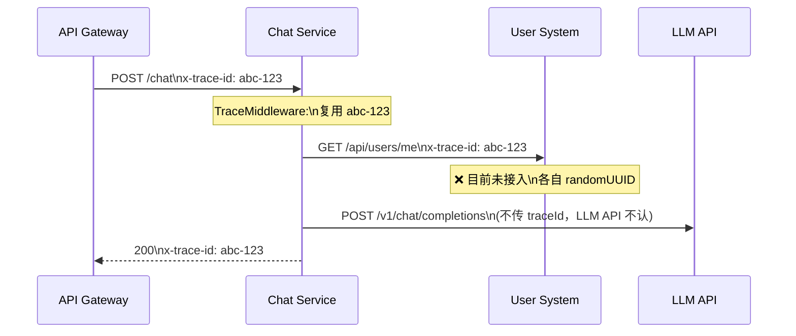


> **当前差距**：user-system 的 `response.interceptor.ts` 和 `all-exceptions.filter.ts` 使用独立的 `crypto.randomUUID()`，与 chat service 的 traceId 无关联。要打通跨服务追踪，需要在 user-system 也引入 `TraceMiddleware`，或者直接迁移到 OpenTelemetry（它会自动处理跨服务传播）。

### 16.3.6 OpenTelemetry：标准化追踪框架全景

OpenTelemetry（OTel）是 CNCF 的可观测性标准。它不是一个产品，而是一套**SDK + 协议 + 生态**。它把日志、追踪、指标三件套统一到一个框架下。

**OTel 的核心组件**：

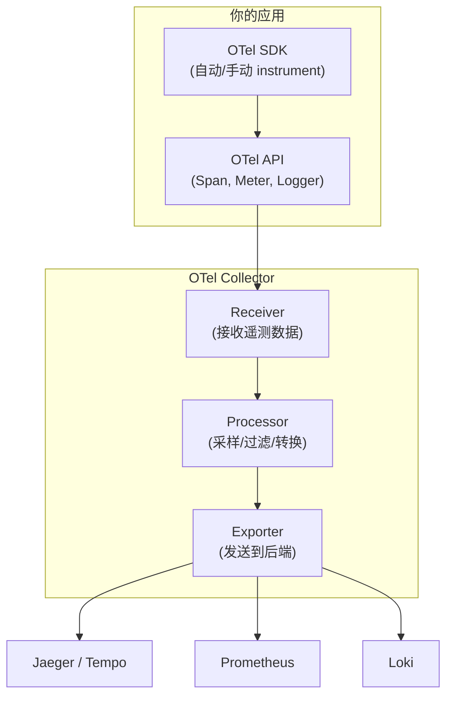


| 组件                   | 作用                               | Node.js 包                                   |
| -------------------- | -------------------------------- | ------------------------------------------- |
| API                  | 定义接口（Tracer、Span、Meter 等）        | `@opentelemetry/api`                        |
| SDK                  | 实现 API，管理生命周期                    | `@opentelemetry/sdk-node`                   |
| Auto-instrumentation | 自动为 HTTP、Express、Prisma 等创建 Span | `@opentelemetry/auto-instrumentations-node` |
| Exporter             | 把遥测数据发送到 Collector 或后端           | `@opentelemetry/exporter-trace-otlp-http` 等 |
| Collector            | 独立进程，接收/处理/转发遥测数据                | Docker 镜像 `otel/opentelemetry-collector`    |

**OTel 自动插桩的覆盖范围**：

安装 `@opentelemetry/auto-instrumentations-node` 后，在不改动业务代码的前提下，OTel SDK 可以自动为以下操作创建 Span：

*   HTTP 请求（进出）
*   Express 路由
*   `pg` / `mysql2` / `prisma` 数据库查询
*   `fetch` / `http.request`
*   DNS 查询
*   gRPC 调用

这意味着在 Jaeger 中可以看到一棵包含 HTTP 入口 → Express 路由 → Prisma 查询的 Span 树，而不需要为这些基础层调用逐一手动插桩。

**手动插桩示例**（LLM 调用，OTel 不会自动覆盖）：

```tsx
import { trace, SpanStatusCode } from '@opentelemetry/api';

const tracer = trace.getTracer('chat-service', '1.0.0');

async function invokeWithSpan(model, messages, attrs) {
  return tracer.startActiveSpan('llm.invoke', { attributes: attrs }, async (span) => {
    try {
      const result = await model.invoke(messages);
      const usage = result.usage_metadata;
      span.setAttribute('llm.input_tokens', usage?.input_tokens ?? 0);
      span.setAttribute('llm.output_tokens', usage?.output_tokens ?? 0);
      span.setStatus({ code: SpanStatusCode.OK });
      return result;
    } catch (err) {
      span.setStatus({ code: SpanStatusCode.ERROR, message: String(err) });
      span.recordException(err);
      throw err;
    } finally {
      span.end();
    }
  });
}
```

> 注意这和我们的 `LlmTracer`（16.4 将讲到）的区别：`LlmTracer` 是 LangChain 的 `BaseCallbackHandler`，在 LangChain 框架层自动触发；OTel 的手动 Span 需要在业务代码中显式包裹。两者可以共存：`LlmTracer` 负责 LangChain 层面的观测（token 用量、链式调用），OTel Span 负责 APM 层面的追踪（层级关系、跨服务关联）。

### 16.3.7 采样策略：Head-based vs Tail-based

线上每秒可能有几百甚至上千个请求。如果每个请求的每个 Span 都记录并上传，存储成本和网络开销会爆炸。采样策略解决的就是「记哪些、丢哪些」。

**Head-based 采样（入口决策）**：

在请求入口（第一个 Span 创建时）就决定这个 Trace 是否采样。后续所有子 Span 遵循同一个决策。

    请求进入 → 按采样率决策（例如 10%） → 命中 → 记录全链路
                                          → 未命中 → 不记录该 Trace

| 优点            | 缺点            |
| ------------- | ------------- |
| 实现简单          | 可能丢掉重要的异常/慢请求 |
| 存储可控（直接控制采样率） | 采样率低时难以排障     |
| 不需要缓冲/回溯      | —             |

配置示例（OTel SDK）：

```tsx
import { TraceIdRatioBasedSampler } from '@opentelemetry/sdk-trace-base';

// 10% 采样率
const sampler = new TraceIdRatioBasedSampler(0.1);
```

**Tail-based 采样（出口决策）**：

先把所有 Span 暂存，等整个 Trace 完成后再决定是否保留。决策依据可以是：

*   请求失败了（status=ERROR）→ 保留
*   请求特别慢（>10s）→ 保留
*   触发了某个特定条件 → 保留
*   其他 → 按比例随机保留

<!---->

    请求进来 → 全部记录到缓冲区
          → Trace 完成 → 决策引擎
              → 是异常/慢请求 → 保留并导出
              → 是正常请求 → 10% 概率保留

| 优点         | 缺点                    |
| ---------- | --------------------- |
| 不会丢掉异常/慢请求 | 需要额外的缓冲和决策组件          |
| 样本有代表性     | OTel Collector 内存开销更大 |
| 对排障友好      | 配置更复杂                 |

OTel Collector 的 `tail_sampling` processor 支持这种模式。对于 AI 应用，**tail-based 采样更有价值**——因为我们最关心的恰恰是那些慢请求和失败请求（LLM 超时、Critic 反复打回），它们的 Trace 信息最有诊断价值。

**实用建议**：

| 场景      | 推荐策略                    | 理由            |
| ------- | ----------------------- | ------------- |
| 开发/测试环境 | 100% 采样                 | 数据量小，可以保留全部样本 |
| 低流量生产   | 100% 或 50% head-based   | 存储可控          |
| 中高流量生产  | Tail-based + 异常全采       | 确保异常不被丢掉      |
| 超高流量    | Head-based 1\~5% + 异常全采 | 成本优先          |

### 16.3.8 追踪可视化后端：Jaeger、Tempo、Zipkin

采集到的 Span 数据需要存储和可视化。三个主流选择：

**Jaeger**（Uber 开源，CNCF 毕业项目）：

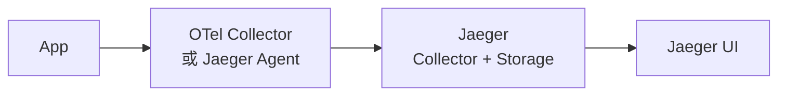


*   自带完整 UI，Trace 瀑布图直观
*   支持多种存储后端（Cassandra, Elasticsearch, Kafka, 内存）
*   社区成熟，文档丰富
*   本地快速体验：`docker run --rm -p 16686:16686 -p 4317:4317 jaegertracing/jaeger:latest`

**Grafana Tempo**：

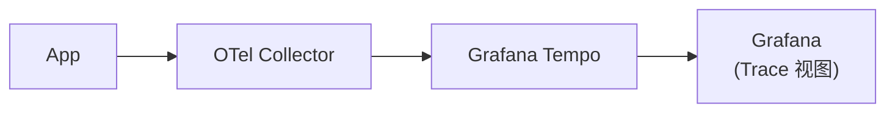


*   极低存储成本（对象存储 S3/GCS，不需要本地 SSD）
*   与 Grafana 生态深度集成（日志→trace→metrics 一键跳转）
*   不需要额外索引，按 traceId 查询
*   如果团队已经使用 Grafana 查看 Prometheus metrics 或 Loki logs，Tempo 通常更容易接入现有工作流

**Zipkin**（Twitter 开源，较早期的分布式追踪系统）：

*   历史最久，轻量简单
*   适合入门学习
*   社区活跃度不如 Jaeger 和 Tempo

**选择建议**：

| 如果你…             | 推荐             | 理由                     |
| ---------------- | -------------- | ---------------------- |
| 已有 Grafana 基建    | Tempo          | 与 Loki/Prometheus 无缝联动 |
| 没有任何基建、想快速体验     | Jaeger         | 单容器启动，自带 UI            |
| 已有 Elasticsearch | Jaeger (ES 后端) | 复用存储                   |
| 追求最低运维成本         | Tempo          | 对象存储，无需管理              |

### 16.3.9 从 ALS 方案迁移到 OTel 的具体路径

我们目前的「ALS + traceId + pino + prom-client」方案和 OTel 标准方案的对应关系：

| 我们的方案                              | OTel 标准                            | 迁移方式                          |
| ---------------------------------- | ---------------------------------- | ----------------------------- |
| `trace-context.ts` (ALS + traceId) | `@opentelemetry/api` context       | 换成 OTel 的 `context.active()`  |
| `x-trace-id` header                | W3C `traceparent` header           | OTel SDK 自动处理                 |
| `TraceMiddleware`                  | OTel HTTP auto-instrumentation     | 替换为自动 instrument              |
| `LlmTracer` (callbacks)            | OTel 手动 Span + LangChain callbacks | 两者可共存                         |
| `pino` logger                      | OTel Logs（或保留 pino + traceId）      | 保留 pino，注入 OTel trace/span ID |
| `prom-client` metrics              | OTel Metrics SDK                   | 替换或共存                         |

**迁移不等于重写**——当前架构已经具备向 OTel 演进的基础。具体步骤：

    Step 1：安装 OTel SDK + 自动插桩依赖（在 services/chat/ 下执行）
      bun add @opentelemetry/sdk-node @opentelemetry/auto-instrumentations-node \
              @opentelemetry/exporter-trace-otlp-http

    Step 2：在应用入口（main.ts 的最顶部）初始化 OTel
      import { NodeSDK } from '@opentelemetry/sdk-node';
      import { getNodeAutoInstrumentations } from '@opentelemetry/auto-instrumentations-node';
      import { OTLPTraceExporter } from '@opentelemetry/exporter-trace-otlp-http';

      const sdk = new NodeSDK({
        traceExporter: new OTLPTraceExporter({ url: 'http://otel-collector:4318/v1/traces' }),
        instrumentations: [getNodeAutoInstrumentations()],
      });
      sdk.start();

    Step 3：pino 日志注入 OTel trace/span ID
      import { trace } from '@opentelemetry/api';
      // mixin 改为：
      function traceMixin() {
        const span = trace.getActiveSpan();
        const ctx = span?.spanContext();
        return {
          traceId: ctx?.traceId ?? 'no-trace',
          spanId: ctx?.spanId ?? 'no-span',
        };
      }

    Step 4：TraceMiddleware 简化为只记录 access log（trace 传播交给 OTel 自动处理）

    Step 5：LLM 调用加手动 Span（OTel 不自动 instrument LLM 调用）

    Step 6：启动 OTel Collector + Jaeger/Tempo

> 关键认知：**迁移是渐进的**。完成 Step 1\~2 后，HTTP/DB 层面的 Span 会自动产生。pino 日志、Prometheus metrics、LangChain callbacks 都可以继续保留，再逐步替换。不需要一次性完成全部切换。

***

## 16.4 LLM 调用观测：基于 callbacks 记录模型调用


> callbacks 像旁路探针一样监听模型调用，把延迟、token、错误和工具调用信息同步写入日志与指标。

日志和链路追踪解决了「请求级关联」和「调用层级」，但 AI 应用还有一个特殊的观测维度：**每一次真实的 LLM 调用**。一次需求分析请求，背后可能是 triage 1 次、4 个专家各自多轮 ReAct、Critic-Refine 反复修订……几十次模型调用。每一次都有 token 消耗、有延迟、可能失败。这一层，普通的 HTTP 日志和 metrics 看不到。

LangChain 提供的标准机制是 **callbacks**（回调）。任何一次 `model.invoke()` 都会触发一组生命周期事件：`handleLLMStart` / `handleLLMEnd` / `handleLLMError` / `handleToolStart` / `handleToolEnd`……实现一个 `BaseCallbackHandler` 并挂载到模型或调用配置上，就能在尽量少侵入业务代码的前提下观测每次调用。

> 这与第十五章 15.3.6 使用的是同一套底层事件机制。15.3.6 使用 `streamEvents(v2)`（拉模式，主动 for-await 事件流）；这里使用 `callbacks`（推模式，注册 handler 被动接收）。两者底层同源，区别在于事件消费方式不同。生产观测场景更适合使用 callbacks，因为它不需要改变 `invoke` 的调用方式，注册后即可在对应模型或调用范围内生效。

新建 `services/chat/src/observability/llm-tracer.ts`：

```tsx
// services/chat/src/observability/llm-tracer.ts
import { BaseCallbackHandler } from '@langchain/core/callbacks/base';
import type { Serialized } from '@langchain/core/load/serializable';
import type { LLMResult } from '@langchain/core/outputs';
import { createLogger } from './logger';
import { recordLlmCall } from './metrics';

const log = createLogger('llm');

export function extractUsageFromLLMResult(output: LLMResult): {
  inputTokens: number;
  outputTokens: number;
} {
  // 来源 1：llmOutput.tokenUsage（OpenAI 经 callbacks 的常见落点）
  const tu =
    (output.llmOutput as Record<string, any> | undefined)?.tokenUsage ??
    (output.llmOutput as Record<string, any> | undefined)?.usage;
  if (tu) {
    const inputTokens = tu.promptTokens ?? tu.prompt_tokens ?? tu.input_tokens ?? 0;
    const outputTokens =
      tu.completionTokens ?? tu.completion_tokens ?? tu.output_tokens ?? 0;
    if (inputTokens || outputTokens) return { inputTokens, outputTokens };
  }
  // 来源 2：generations[].message.usage_metadata（LangChain v2 标准化字段）
  for (const gen of output.generations ?? []) {
    for (const g of gen ?? []) {
      const um = (g as any)?.message?.usage_metadata;
      if (um) {
        return {
          inputTokens: um.input_tokens ?? 0,
          outputTokens: um.output_tokens ?? 0,
        };
      }
    }
  }
  // 没有真实 usage 时不要直接当作 0 处理；
  // 生产实现应在这里接入 tokenizer / fallback estimator，并标记 isEstimated。
  return { inputTokens: 0, outputTokens: 0 };
}

export class LlmTracer extends BaseCallbackHandler {
  name = 'llm-tracer';
  private starts = new Map<string, number>();

  handleLLMStart(llm: Serialized, prompts: string[], runId: string): void {
    this.starts.set(runId, Date.now());
    log.debug(
      { runId, model: (llm as any)?.id?.at?.(-1), promptChars: prompts.join('').length },
      'llm_start',
    );
  }

  handleLLMEnd(output: LLMResult, runId: string): void {
    const latencyMs = Date.now() - (this.starts.get(runId) ?? Date.now());
    this.starts.delete(runId);
    const { inputTokens, outputTokens } = extractUsageFromLLMResult(output);
    log.info({ runId, latencyMs, inputTokens, outputTokens }, 'llm_end');
    recordLlmCall({ latencyMs, inputTokens, outputTokens, ok: true });
  }

  handleLLMError(err: Error, runId: string): void {
    const latencyMs = Date.now() - (this.starts.get(runId) ?? Date.now());
    this.starts.delete(runId);
    log.error({ runId, latencyMs, err: String(err).slice(0, 200) }, 'llm_error');
    recordLlmCall({ latencyMs, inputTokens: 0, outputTokens: 0, ok: false });
  }

  handleToolStart(tool: Serialized, input: string, runId: string): void {
    log.debug({ runId, tool: (tool as any)?.id?.at?.(-1), inputChars: input?.length ?? 0 }, 'tool_start');
  }

  handleToolEnd(output: unknown, runId: string): void {
    const text = typeof output === 'string' ? output : JSON.stringify(output ?? '');
    log.debug({ runId, outputChars: text.length }, 'tool_end');
  }
}
```

> 关于 token 提取的边界：并不是所有 LLM Provider 都会返回 token usage。即使返回，不同 SDK 的字段位置也不一致：有的在 `llmOutput.tokenUsage`，有的在 `generations[].message.usage_metadata`，也有的只返回文本内容。因此 token 计量需要分层处理：优先读取 Provider 返回的真实 usage；读取不到时，使用模型对应 tokenizer 重新计算 prompt / completion token；仍无法精确分词时，再用字符数或字节数做估算，并把记录标记为 `isEstimated: true`。

> Tools 也需要纳入 token 成本视角。工具调用本身通常不直接产生 LLM 账单，但工具参数、工具返回内容和 tool message 会进入后续 LLM 上下文，最终转化为 input tokens。尤其是检索工具、文件解析工具、长 JSON 返回值，如果不控制内容长度，会显著放大后续模型调用成本。因此除了统计 LLM 返回的 `inputTokens` / `outputTokens`，还应记录 `toolInputChars`、`toolOutputChars`、`toolLatencyMs`，并在下一次模型调用前把 tool messages 计入 prompt token 估算。

callbacks 有两种常见挂载粒度：

*   **per-call**：`model.invoke(messages, { callbacks: [new LlmTracer()] })`。
*   **per-model**：创建模型时 `new ChatOpenAI({ callbacks: [new LlmTracer()] })`，之后该模型的所有调用都带。

本章按 opt-in 方式采用 **per-model**：把一个 `LlmTracer` 实例挂载到模型实例上（演示脚本 `run-observability-demo.ts` 采用的就是这种方式；生产里可在 model factory 统一注入）：

```tsx
// services/chat/scripts/run-observability-demo.ts
const tracer = new LlmTracer();
const model = new ChatOpenAI({
  model: process.env.LLM_OBS_TEST_MODEL || 'gpt-5.4',
  temperature: 0,
  configuration: { baseURL: process.env.OPENAI_BASE_URL },
  apiKey: process.env.OPENAI_API_KEY,
  callbacks: [tracer],
});
```

> per-model 粒度的优势在于：callbacks 一旦挂载到模型实例上，**该模型的每一次调用都会携带它**，包括专家子图、Critic-Refine 子图里使用同一个 `model` 发起的嵌套调用，都会触发同一个 tracer。这样不需要把 callbacks 沿着 `config` 逐层透传。demo 中「一次分析能观测到几十次嵌套 LLM 调用」正是基于这一点实现的。（如果改用 per-call 粒度，则需要像 15.3.6 那样保证 `config` 透传不断链。）

关于 LangSmith：它是 LangChain 官方的托管 trace 平台，开 `LANGSMITH_TRACING=true` + `LANGSMITH_API_KEY` 就能把整棵调用树上传，可视化做得很好。但它**需要外部凭证和网络**，不符合本章「本地可实跑」的基线。我们的 `LlmTracer` 是本地零依赖的替代——它拿到的是同样的 callback 事件，只是把数据落到本地日志和 Prometheus 而不是上传到 SaaS。生产里两者可以并存：本地 tracer 提供基础观测，LangSmith 用于更细粒度的调试分析。

***

## 16.5 埋点（Instrumentation）专题


> 埋点不是“多打日志”，而是在 HTTP、Graph、LLM、工具、成本和指标等关键路径上采集可聚合的运行信号。

### 16.5.1 什么是埋点——技术埋点 vs 业务埋点

「埋点」这个词在不同团队中含义并不完全一致。在可观测性语境下，它指的是**在代码的关键位置主动插入数据采集逻辑**，让系统在运行时输出需要分析的遥测数据。

与被动式观测（比如 OTel 自动 instrument HTTP 请求）不同，埋点是主动的、有意识的、针对业务逻辑的。

埋点分两大类：

**技术埋点**：观测系统的技术运行状态。

| 埋点位置     | 采集数据                                        | 用途         |
| -------- | ------------------------------------------- | ---------- |
| HTTP 中间件 | method, path, status, elapsedMs             | 请求级 RED 指标 |
| DB 查询    | query, duration                             | 慢查询告警      |
| LLM 调用   | model, inputTokens, outputTokens, latencyMs | LLM 性能监控   |
| 错误处理     | errorCode, stack (截断)                       | 错误率、错误分布   |
| 连接池      | activeConnections, waitingRequests          | 资源瓶颈预警     |

**业务埋点**：观测业务行为和流程。

| 埋点位置          | 采集数据                                    | 用途       |
| ------------- | --------------------------------------- | -------- |
| 意图分诊          | intent (analyze/query/chat), confidence | 流量分布分析   |
| 专家选择          | selectedExperts\[], expertCount         | 专家使用率    |
| Critic-Refine | reviseCount, finalPass                  | 报告质量间接指标 |
| 报告生成          | summaryLength, hasRiskSection           | 输出结构分析   |
| 用户反馈          | thumbsUp/thumbsDown, feedbackText (脱敏)  | 质量评估基准   |

### 16.5.2 埋点命名规范

清晰的埋点命名是让数据可用的前提。命名不一致，会增加后续聚合、检索和告警配置的复杂度。

**我们的命名约定**：

    格式：{domain}_{entity}_{action}
    域名：http, llm, graph, expert, critic, token, sse, auth
    实体：request, call, node, connection, usage
    动作：start, end, error, timeout, fallback

    示例：
      http_request              ← HTTP 请求完成
      llm_start / llm_end       ← LLM 调用生命周期
      llm_error                 ← LLM 调用失败
      tool_start / tool_end     ← 工具调用
      unhandled_exception       ← 未处理异常
      extractNode_start         ← 图节点启动
      triage_parse_failed       ← 分诊解析失败

**msg 字段的约定**（pino 的第二个参数）：

```tsx
// msg 是一个可 grep 的短标识，不是自然语言描述
log.info({ ... }, 'http_request');        // ✅ 可 grep
log.info({ ... }, 'HTTP请求处理完成');     // ❌ 自然语言，难 grep
log.info({ ... }, 'request_completed_successfully');  // ❌ 太长
```

**Prometheus 指标的命名**（遵循 Prometheus 官方命名规范）：

    格式：{namespace}_{subsystem}_{name}_{unit}
    单位后缀：_total (counter), _seconds (histogram), _bytes, _ratio

    示例：
      http_request_duration_seconds     ← HTTP 请求耗时
      llm_calls_total                   ← LLM 调用总次数
      llm_tokens_total                  ← Token 总量
      llm_call_duration_seconds         ← 单次 LLM 调用耗时
      sse_active_connections            ← SSE 活跃连接数（Gauge，无 _total）

### 16.5.3 LLM 应用特有的埋点维度

传统 Web 应用的埋点（QPS、延迟、错误率）不足以覆盖 AI 应用的运行特征。LLM 应用还需要关注一组特有的观测维度：

| 维度              | 为什么重要                            | 对应的埋点                                              |
| --------------- | -------------------------------- | -------------------------------------------------- |
| **Token 用量**    | 直接关系到成本                          | `llm_tokens_total{direction=input/output}`         |
| **模型选择**        | 不同模型成本差 10\~100 倍                | `llm_calls_total{model=...}`                       |
| **调用链深度**       | ReAct 多轮、Critic-Refine 多轮会放大成本   | `reviseCount`、工具调用次数                               |
| **Prompt 长度**   | 决定 input token（通常是主要成本来源）        | `promptChars`（注意不记录内容）                             |
| **缓存命中**        | prompt caching 可以降低输入成本          | `cachedInputTokens`                                |
| **工具上下文长度**     | 工具参数和返回内容会进入后续 prompt，放大输入 token | `toolInputChars`、`toolOutputChars`、`toolLatencyMs` |
| **降级/fallback** | 主模型不可用时切换备用模型，质量可能下降             | `llm_fallback_total{from, to}`                     |
| **结构化输出解析失败**   | 模型返回内容不符合预期结构是常见问题               | `parse_error_total{node}`                          |

我们项目当前已有的 LLM 特化埋点：

```tsx
// services/chat/src/observability/llm-tracer.ts
// handleLLMStart：记录 model、promptChars
log.debug({ runId, model: ..., promptChars: prompts.join('').length }, 'llm_start');

// handleLLMEnd：记录 token 用量和延迟
log.info({ runId, latencyMs, inputTokens, outputTokens }, 'llm_end');
// 同时喂给 Prometheus
recordLlmCall({ latencyMs, inputTokens, outputTokens, ok: true });

// handleLLMError：记录错误
log.error({ runId, latencyMs, err: String(err).slice(0, 200) }, 'llm_error');
recordLlmCall({ latencyMs, inputTokens: 0, outputTokens: 0, ok: false });
```

```tsx
// services/chat/src/llm/graph/requirement-analysis-graph.ts
// 节点级结构化日志（PII 安全——只记长度/形状）
log.debug({ inputLen: state.input.length }, 'extractNode_start');
log.debug({ rawLength: extractRaw.length }, 'extractNode_ai_done');
log.debug({ hasExtracted: !!extracted }, 'extractNode_done');
log.debug({ inputLen: userInput.length }, 'runAnalysisGraph_start');
log.debug({ intent: result.intent, hasSummary: !!result.summary }, 'graph_result');
```

### 16.5.4 本项目的埋点地图

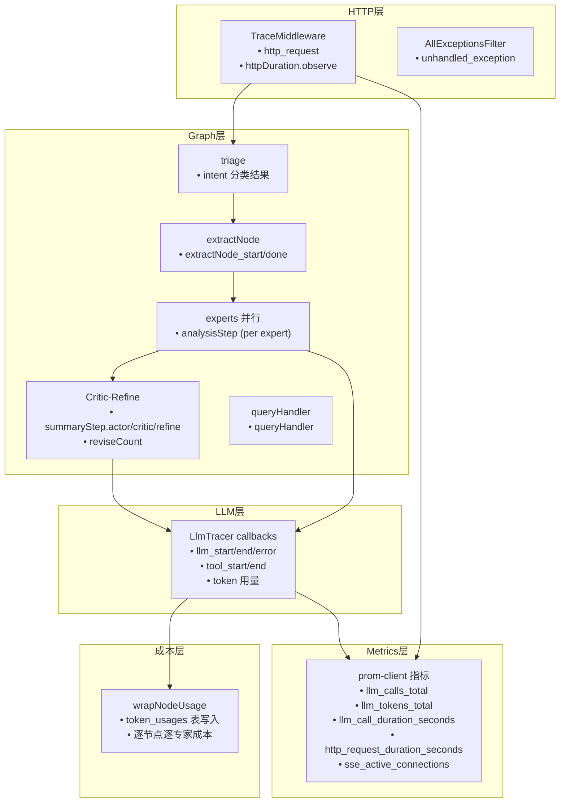


### 16.5.5 埋点的反模式

**反模式 1：高基数 label**

```tsx
// ❌ 绝对不要：traceId 作为 Prometheus label
llmCalls.inc({ traceId: getTraceId(), model: 'gpt-5.4' });
// 每次请求创建一个新的 label 组合 → Prometheus 内存爆炸

// ✅ 正确：只用低基数 label
llmCalls.inc({ ok: 'true' });
```

**反模式 2：记录敏感内容**

```tsx
// ❌ 把完整 prompt 记进日志
log.info({ prompt: systemPrompt + userMessage }, 'llm_call');

// ✅ 只记形状
log.debug({ promptChars: prompt.length, model: 'gpt-5.4' }, 'llm_start');
```

**反模式 3：静默吞掉错误**

```tsx
// ❌ .catch(()=>{}) 静默吞掉错误——后续无法判断这里是否失败
fetch('https://analytics.example.com/events', { method: 'POST', body: data }).catch(()=>{});

// ✅ 至少记一条 warn
try { await someOperation(); } catch (err) {
  log.warn({ err: String(err).slice(0, 100) }, 'operation_failed_noncritical');
}
```

**反模式 4：在热路径上做同步 I/O**

```tsx
// ❌ 每次 LLM 调用都同步写数据库
handleLLMEnd(output, runId) {
  await db.insert(usageRecord);  // 如果 DB 慢，拖慢整个 LLM 调用链
}

// ✅ 异步写入，失败不影响主链路（我们的 withTokenUsage 就是这么做的）
handleLLMEnd(output, runId) {
  usageService.recordUsage(record).catch(err =>
    log.warn({ err: String(err) }, 'usage_record_failed'));
}
```

**反模式 5：过度埋点**

```tsx
// ❌ 每个 if/else 分支都打日志
if (condition) {
  log.info('进入分支 A');  // 噪音
  doA();
  log.info('分支 A 完成');  // 更多噪音
} else {
  log.info('进入分支 B');
  doB();
  log.info('分支 B 完成');
}

// ✅ 只在关键决策点记一条
log.debug({ branch: condition ? 'A' : 'B' }, 'routing_decision');
```

***

## 16.6 Token 成本观测：把第十章的计量模块接进生产


> Token 计量需要落到真实节点调用上，才能按 graph、node、agent 维度解释成本从哪里产生。

### 16.6.1 现状：模块完整但未接线

第十章建了一套完整的 token 计量模块（`services/chat/src/llm/cost/`），包含估算、采集、持久化、预算策略全链路，配了 `token_usages` 表和完整单测。但**这套模块从未被生产链路调用**——graph 节点里所有 `model.invoke()` 都是未包装调用，`LlmModule` 也没注册 `TokenUsageService`。结果就是 `token_usages` 表始终为空，月度成本聚合无数据。

本节的工作就是把这套已有模块接进 `requirement-analysis-graph` 的真实调用链。

### 16.6.2 withTokenUsage 长什么样

先回顾 `with-token-usage.ts` 的核心（第十章已实现）：

```tsx
// services/chat/src/llm/cost/with-token-usage.ts（核心逻辑）
export async function withTokenUsage<T>(
  options: WithTokenUsageOptions,
  usageService: TokenUsageService | null,
  fn: () => Promise<T>,
): Promise<T> {
  const start = Date.now();
  const result = await fn();
  const latencyMs = Date.now() - start;

  if (!usageService) return result;

  try {
    const usage = extractUsageFromResponse(result);
    const pricing = getModelPricing(options.modelName);
    // ... 计算 inputTokens, outputTokens, estimatedCostUsd ...
    await usageService.recordUsage(record);
  } catch (err) {
    console.warn('[withTokenUsage] Failed to record usage, skipping:', err);
  }

  return result;
}
```

它做的事包括：记录调用耗时，执行模型调用，从返回值中读取 token 用量或触发估算逻辑，并写入成本记录。

> 一处必要的修正（本章同步做了）：第十章原版 `extractUsageFromResponse` 只读 `response_metadata`，对真实 ChatOpenAI 的 `AIMessage` 会**短路在旧格式上**而读不到真实用量。本章把它改成**优先读 `usage_metadata.input_tokens/output_tokens`**（LangChain 标准化字段），再回退 `response_metadata.usage / token_usage / tokenUsage`。如果这些字段都不存在，就进入 tokenizer / estimator 分支，按模型分词器重新计算；无法精确计算时才使用近似估算，并将 `isEstimated` 设为 `true`。这样可以同时覆盖「Provider 返回真实 usage」和「Provider 不返回 usage」两类情况。

> 对工具调用也要保持同样的成本意识：工具请求参数和工具返回结果虽然不是 LLM completion，但会作为后续 prompt 的一部分重新进入模型上下文。实现上可以在 `handleToolStart` / `handleToolEnd` 中记录工具输入输出长度，并在下一次 LLM 调用前，把 tool messages 纳入 prompt token 计算或估算。

### 16.6.3 接线：在真实节点包上 withTokenUsage

第一步，`LlmModule` 注册 `TokenUsageService`：

```tsx
// services/chat/src/llm/llm.module.ts —— 改后
import { TokenUsageService } from './cost/token-usage.service';
import { CostController } from './cost/cost.controller';
import { PrismaService } from '../prisma/prisma.service';

const tokenUsageProvider = {
  provide: TokenUsageService,
  useFactory: (prisma: PrismaService) => new TokenUsageService(prisma),
  inject: [PrismaService],
};

@Module({
  imports: [ModelConfigModule],
  controllers: [CostController],
  providers: [LlmService, OrchestratorService, UIResponseService, tokenUsageProvider],
  exports: [LlmService, OrchestratorService, UIResponseService, TokenUsageService],
})
export class LlmModule {}
```

第二步，为 graph 节点里的未包装调用增加计量封装。我们给 `createAnalysisGraph` 的 options 加两个可选项 `usageService` 与 `conversationId`，再抽出一个 `wrapNodeUsage` 工具函数：

```tsx
// services/chat/src/llm/graph/requirement-analysis-graph.ts
export interface GraphObservability {
  usageService?: TokenUsageService | null;
  conversationId?: string;
  modelName: string;
}

export function wrapNodeUsage<T>(
  obs: GraphObservability | undefined,
  nodeName: string,
  agentName: string,
  fn: () => Promise<T>,
): Promise<T> {
  if (!obs?.usageService) return fn();   // 默认不传 = 行为完全不变
  return withTokenUsage(
    { graphName: 'requirement-analysis', nodeName, agentName,
      modelName: obs.modelName, conversationId: obs.conversationId },
    obs.usageService,
    fn,
  );
}

// 节点内实际使用：
const response = await wrapNodeUsage(obs, 'summaryStep.actor', 'summary',
  () => model.invoke(messages));
```

`experts.ts` 的专家子图同理（`obs` 顺着 `createAnalysisSupervisorSubGraph → createXxxExpert → createExpertSubGraph` 透传下去），`nodeName` 用 `analysisStep`、`agentName` 用具体专家名（functional / security / performance / compliance）。这样完成一次分析后，`token_usages` 中会按节点和专家写入多条成本记录。

第三步，暴露一个查询入口，让成本可见：

```tsx
// services/chat/src/llm/cost/cost.controller.ts
@Controller('api/cost')
@UseGuards(JwtAuthGuard)
export class CostController {
  constructor(private readonly usage: TokenUsageService) {}

  @Get('summary')
  async summary() {
    const [monthly, byNode, byAgent] = await Promise.all([
      this.usage.getMonthlyStats(),
      this.usage.getStatsByNode(),
      this.usage.getStatsByAgent(),
    ]);
    return { monthly, byNode, byAgent };
  }
}
```

接入完成后，`GET /api/cost/summary` 可以展示当月每个节点、每个专家消耗了多少 token，以及对应的估算成本。

*   📋 配套用例（`test/chapter16-observability.spec.ts`）

    Layer 1（零 LLM、确定性）直接验证 `wrapNodeUsage` 的 opt-in 契约：

    ```tsx
    // services/chat/test/chapter16-observability.spec.ts
    it('有 usageService 时把真实 token 写进 recordUsage', async () => {
      const { service, records } = makeCapturingUsageService();
      const obs: GraphObservability = {
        usageService: service,
        conversationId: 'conv-123',
        modelName: 'gpt-5.4',
      };
      const fakeResponse = {
        content: '报告正文',
        response_metadata: { usage: { prompt_tokens: 120, completion_tokens: 48 } },
      };
      const result = await wrapNodeUsage(obs, 'summaryStep.actor', 'summary',
        async () => fakeResponse);
      expect(result).toBe(fakeResponse);
      expect(records.length).toBe(1);
      expect(records[0]).toMatchObject({
        graphName: 'requirement-analysis',
        nodeName: 'summaryStep.actor',
        agentName: 'summary',
        modelName: 'gpt-5.4',
        conversationId: 'conv-123',
        inputTokens: 120,
        outputTokens: 48,
        isEstimated: false,
      });
    });
    ```

    Layer 2（需 `OPENAI_API_KEY` + `RUN_LLM_OBS_TESTS=1`）跑真实 `createAnalysisGraph({ usageService })`，断言注入的计量服务收到 ≥1 条记录、且至少有一条是 `inputTokens > 0 && !isEstimated` 的**真实**用量。

***

## 16.7 Metrics 与健康检查


> Metrics 用来观察整体趋势，readiness 用来判断服务是否真正具备接收流量的能力。

### 16.7.1 Prometheus 指标

日志是「点」（每条记录一个事件），metrics 是「线」（随时间变化的聚合数值）。要回答「过去 5 分钟的 P99 延迟」「现在每秒多少次 LLM 调用」「token 消耗速率」，你需要 metrics。

业界事实标准是 Prometheus：服务暴露一个 `/metrics` 端点，吐出文本格式的指标，Prometheus 定时来拉。Node 侧的标准库是 `prom-client`。

新建 `services/chat/src/observability/metrics.ts`：

```tsx
// services/chat/src/observability/metrics.ts
import { Registry, collectDefaultMetrics, Counter, Histogram, Gauge } from 'prom-client';

export const registry = new Registry();
collectDefaultMetrics({ register: registry });

export const httpDuration = new Histogram({
  name: 'http_request_duration_seconds',
  help: 'HTTP 请求耗时',
  labelNames: ['method', 'route', 'status'],
  buckets: [0.05, 0.1, 0.3, 1, 3, 10, 30],
  registers: [registry],
});

const llmCalls = new Counter({
  name: 'llm_calls_total', help: 'LLM 调用次数',
  labelNames: ['ok'], registers: [registry],
});
const llmTokens = new Counter({
  name: 'llm_tokens_total', help: 'LLM token 总量',
  labelNames: ['direction'], registers: [registry],
});
const llmLatency = new Histogram({
  name: 'llm_call_duration_seconds', help: '单次 LLM 调用耗时',
  buckets: [0.3, 1, 3, 10, 30, 60], registers: [registry],
});

export const sseConnections = new Gauge({
  name: 'sse_active_connections', help: '当前活跃 SSE 连接数',
  registers: [registry],
});

export function recordLlmCall(p: {
  latencyMs: number; inputTokens: number; outputTokens: number; ok: boolean;
}): void {
  llmCalls.inc({ ok: String(p.ok) });
  llmTokens.inc({ direction: 'input' }, p.inputTokens);
  llmTokens.inc({ direction: 'output' }, p.outputTokens);
  llmLatency.observe(p.latencyMs / 1000);
}
```

暴露 `/metrics` 端点：

```tsx
// services/chat/src/app.controller.ts
@Get('metrics')
@Header('Content-Type', 'text/plain')
async metrics() {
  return registry.metrics();
}
```

HTTP 耗时直方图我们已经在 16.2.4 的 `TraceMiddleware` 里同步 `httpDuration.observe(...)` 接好了。`sse_active_connections` 这个 Gauge 本章只**声明**了、没接线——它应在 `sse.service.ts` 的 `addConnection` / `removeConnection` 处 `inc()/dec()`（那里现在只 `console.log` 连接数），但本章 opt-in 原则下不动 SSE 服务，把它留作下一步接线点。

> 这里先为第二十章的高可用能力保留扩展点：当模型增加 **fallback**（主模型/网关失败时自动切换备用模型，20.9.2）后，可以再增加 `llm_fallback_total{from,to}` 计数器。降级通常不会直接暴露给用户，但可能带来延迟或质量变化；该计数器持续上升时，应早于用户反馈触发告警。

### 16.7.2 从 liveness 到 readiness

当前健康检查存在「假阳性」问题：

```tsx
// services/chat/src/app.service.ts —— 改造前
getHealth(): { ok: boolean } {
  return { ok: true };  // ← 永远 true，DB 挂了它也说 ok
}
```

这只是 **liveness**（进程是否存活），对判断进程是否崩溃有意义，但不能说明服务是否具备处理请求的能力。

我们需要的是 **readiness**（服务是否准备好接收流量），它需要真实探测依赖：

```tsx
// services/chat/src/app.service.ts —— 改后
async getReadiness(): Promise<{ ready: boolean; checks: Record<string, string> }> {
  const checks: Record<string, string> = {};
  try {
    await this.prisma.$queryRaw`SELECT 1`;
    checks.db = 'ok';
  } catch (e) {
    checks.db = 'fail: ' + String(e).slice(0, 80);
  }
  const ready = Object.values(checks).every((v) => v === 'ok');
  return { ready, checks };
}
```

```tsx
// services/chat/src/app.controller.ts
@Get('health')  getHealth()  { return { ok: true }; }          // liveness 保留
@Get('ready')   async ready(@Res() res: Response) {             // readiness 新增
  const r = await this.appService.getReadiness();
  res.status(r.ready ? 200 : 503).json(r);
}
```

> 区分 liveness 和 readiness 不是形式要求。它们对应 K8s 的两个探针：liveness 失败 → 重启 Pod；readiness 失败 → 从负载均衡摘除但不重启。DB 临时抖动时，更合理的行为是让实例「暂时不接流量」（readiness 失败），而不是直接重启（liveness 失败）。

***

## 16.8 用 traceId 关联三类遥测数据


> traceId 适合留在日志中做下钻入口，metrics 负责聚合趋势，token usage 负责成本归因，三者共同支撑一次完整排障链路。

到这里，可观测性三件套已经完成基础接入。但可观测性的关键不在于「分别有日志、trace、metrics」，而在于**它们能被同一个 traceId 串起来**，让你从「指标异常」逐步下钻到「具体那次请求的那行日志」。

以下是一个典型排障场景：

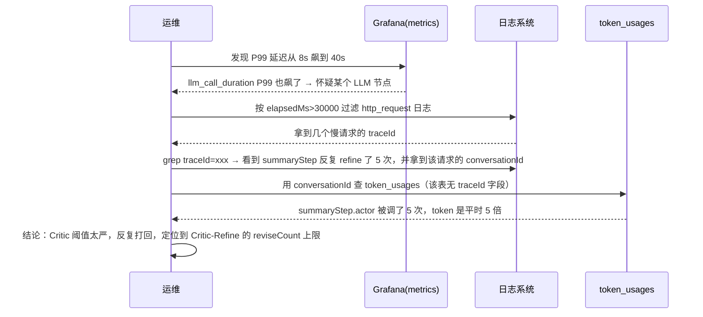


这条排障链路能够成立，依赖的是**同一个 traceId 对日志进行关联**，再借日志里的 `conversationId` 跨到成本表：

*   HTTP access 日志（`http_request`，带 `elapsedMs` + traceId）
*   LLM 调用日志（`llm_end`，带 `latencyMs/tokens` + traceId）
*   token\_usages 记录：**这张表没有 `traceId` 字段**，只有 `conversationId`。所以排障链是「用 traceId 在日志里定位到 conversationId，再用 conversationId 查 token\_usages」
*   metrics 的标签（聚合数值，**不含** traceId——高基数禁入，见下方警告）

如果没有 traceId 贯穿，这些数据会形成孤岛，只能依赖时间戳做粗略比对。有了 traceId，排障可以从经验推断转向基于关联 ID 的检索和验证。

> 高基数警告：**不要**把 traceId 塞进 Prometheus 指标的 label。metrics 的 label 必须是低基数的（method、route、status、专家名），traceId 是高基数（每请求一个），塞进去会让 Prometheus 内存爆炸。traceId 的归属地是**日志**，metrics 只存聚合数值。

**排障中的 jq 查询示例**：

```bash
# Step 1：找到慢请求的 traceId
cat app.log | jq 'select(.msg == "http_request" and .elapsedMs > 30000) | .traceId'

# Step 2：用 traceId 看这次请求的全部日志
cat app.log | jq 'select(.traceId == "xxx-yyy-zzz")'

# Step 3：看这次请求所有的 LLM 调用
cat app.log | jq 'select(.traceId == "xxx-yyy-zzz" and .msg == "llm_end")
  | {runId, latencyMs, inputTokens, outputTokens}'

# Step 4：看 Critic-Refine 循环了几次
cat app.log | jq 'select(.traceId == "xxx-yyy-zzz" and .msg == "llm_end"
  and (.runId | test("summary")))' | jq -s 'length'

# 用 Loki（LogQL）做同样的事：
# {app="chat-service"} | json | traceId = "xxx-yyy-zzz" | msg = "llm_end"
```

***

## 16.9 dev-time 可观测：LangGraph Studio


> LangGraph Studio 适合开发期调试单次执行：查看拓扑、节点状态、prompt/response，并从中间节点改写重跑。

16.1 把可观测性分成「用户态」和「运维态」，但还可以补充第三个轴：**开发态（dev-time）**。运维态可观测（日志/trace/metrics）服务于生产问题定位，开发态可观测则服务于图编排开发阶段的单次执行调试。

LangChain 生态对这件事的原生方案是 **LangGraph Studio**——一个专门可视化、调试 LangGraph 的工具。

### 16.9.1 工程配置

`@langchain/langgraph-cli` 已作为 devDependency 安装在 `services/chat` 中。它需要两个配套文件：

**`services/chat/langgraph.json`** — 声明图的入口：

```json
{
  "$schema": "https://langgra.ph/schema.json",
  "node_version": "20",
  "dependencies": ["."],
  "graphs": {
    "requirement-analysis": "./src/llm/graph/studio.ts:graph"
  },
  "env": ".env"
}
```

*   `graphs` 的格式是 `"<图名>": "<文件路径>:<导出变量名>"`。CLI 会加载这个文件，找到导出的编译后 graph 实例
*   `dependencies` 设为 `["."]`，表示使用当前目录的 `package.json` 管理依赖
*   `env` 指向 `.env`，CLI 启动时自动加载其中的环境变量

**`services/chat/src/llm/graph/studio.ts`** — Studio 专用入口：

```tsx
import { ChatOpenAI } from '@langchain/openai';
import { createAnalysisGraph } from './requirement-analysis-graph';

const model = new ChatOpenAI({
  model: process.env.LLM_MODEL || 'gpt-4o',
  temperature: 0,
  configuration: { baseURL: process.env.OPENAI_BASE_URL },
  apiKey: process.env.OPENAI_API_KEY,
});

export const graph = createAnalysisGraph(model);
```

这个文件的作用是把 `createAnalysisGraph`（需要传入 model 参数）适配成 CLI 要求的「导出一个编译后的 graph 实例」。模型配置从 `.env` 读取，与生产环境解耦。

### 16.9.2 启动与访问

```bash
cd services/chat
bunx langgraphjs dev
```

启动后会看到：


CLI 做了两件事：

1.  **本地 API Server**（端口 2024）：加载你的 graph，暴露标准的 LangGraph API（创建 thread、发消息、查状态）
2.  **Studio UI**：浏览器打开 `https://smith.langchain.com/studio?baseUrl=http://localhost:2024`，这是一个 Web 前端，通过 `baseUrl` 参数连接到你**本地**的 API Server。数据不上传云端——UI 只是渲染层

> 确保 `services/chat/.env` 中已配置 `OPENAI_API_KEY` 和 `OPENAI_BASE_URL`。如果模型调用报错，Studio 会在对应节点上直接显示错误详情。

### 16.9.3 调试能力详解

Studio 在开发期提供了 `console.log` 难以覆盖的几类能力：

**能力一：图结构可视化**

打开 Studio UI 后，左侧直接展示 `requirement-analysis-graph` 的拓扑图。第八/九章那张 triage → extractStep → clarifyStep → analysisStep → summaryStep 的图，不再停留在代码推演，而是一张可交互的拓扑：

                        ┌── extractStep → clarifyStep ──┐
                        │                               ├─→ analysisStep ─┐
    START → triage ─────┤                               ├─→ riskStep ─────┼─→ summaryStep → END
                        ├── queryHandler ────────────────────────────→ END │
                        └── (chat: triage 直接回答) ─────────────────→ END │

每个节点是可点击的。条件边（`routeByIntent`、`routeAfterClarify`）会标注路由条件。

**能力二：逐节点状态快照**

在 Studio 中执行一次请求后，点开任意节点可以看到：

| 信息           | 说明                                | 调试场景                                              |
| ------------ | --------------------------------- | ------------------------------------------------- |
| **输入 state** | 该节点接收到的完整 state 对象                | 确认上游节点是否正确传递了 `input`、`extractedRequirements` 等字段 |
| **输出 state** | 该节点执行后的 state 变更                  | 检查 `intent`、`analysis`、`summary` 是否符合预期           |
| **LLM 调用详情** | 发给模型的完整 prompt + 模型返回的原始 response | 定位 prompt 问题——比如发现安全专家的系统 prompt 缺了关键指令           |
| **工具调用**     | tool name、入参、返回值                  | 检查 ReAct 循环中检索工具是否召回了正确内容                         |
| **耗时**       | 该节点的执行时间                          | 定位性能瓶颈——比如发现 `analysisStep`（4 个专家并行）耗时占 60%       |

这是日志无法提供的上下文密度：一条 `log.info({ latencyMs: 3200 }, 'llm_end')` 告诉你慢了，但看不到那次调用的完整 prompt 和 response。Studio 把这些一次性铺开。

**能力三：时间旅行与改写重跑**

这是调试复杂图最有价值的能力。场景示例：

> Critic-Refine 子图（`summaryStep`）循环了 4 次才通过。你怀疑是 Critic 的评分标准太严。

在 Studio 中：

1.  点开 `summaryStep` 子图，看到 actor → critic → refine 的循环历史
2.  定位到第一次 critic 打回的位置，查看 critic 的评分理由
3.  手动修改 critic 节点的输入 state（比如调整评分阈值或修改 actor 输出）
4.  从修改点重新执行——只跑后续节点，不需要从头跑整个请求


如果没有 Studio，同样的排查过程需要：改代码 → 重新构建 → 重发请求 → 等 triage + extract + clarify + analysis 全部跑完 → 才能看到 summaryStep 的新结果。

**能力四：与 LangSmith trace 联动（可选）**

如果在 `.env` 中开启了 `LANGSMITH_TRACING=true`，Studio 里的每次运行都会自动落成 LangSmith trace。这意味着：

*   Studio 用于**当场调试**（实时看 state、改了重跑）
*   LangSmith 用于**事后分析**（对比多次运行的 token 消耗趋势、查看历史调用）

两者互补，但 LangSmith 不是必需的。Studio 本身不依赖 LangSmith 账号即可使用。

### 16.9.4 典型调试流程

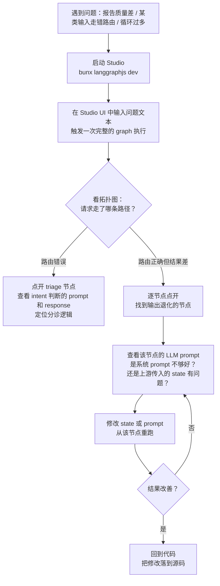


### 16.9.5 开发态 vs 运维态 vs 用户态

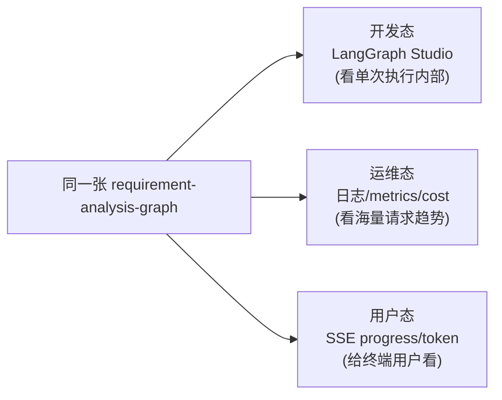


| 维度       | 开发态（Studio）                         | 运维态（日志/metrics）       | 用户态（SSE）  |
| -------- | ----------------------------------- | --------------------- | --------- |
| **受众**   | 开发者调试                               | 运维/SRE 排障             | 终端用户      |
| **粒度**   | 单次执行的每个节点                           | 大量请求的聚合趋势             | 当前对话的进度   |
| **数据**   | 完整 state、prompt、response            | traceId、token、latency | 进度事件、流式输出 |
| **生命周期** | 开发期                                 | 生产期                   | 运行期       |
| **依赖**   | `@langchain/langgraph-cli` + `.env` | pino + prom-client    | SSE 协议    |

> 边界与克制：Studio 是**开发期工具**，不进入生产链路。当图复杂到难以仅通过代码判断一次执行路径时，它可以显著降低调试成本。

***

## 16.10 反模式与治理边界

### 16.10.1 PII 进日志

一个需要警惕的反模式：**把用户输入、检索内容原文打进日志**。

原则（第十八章 18.7.2 会展开）：**日志记 ID 和形状，不记内容**。我们的 logger 已经在 `redact` 里挡了 `apiKey/password`，但 PII 这种「业务语义敏感」的字段挡不住——靠的是开发者写日志时的纪律：

```tsx
log.info({ traceId: getTraceId(), messageLen: body.message.length }, 'chat_received'); // ✅
// 不要：log.info({ message: body.message }, 'chat_received');                          // ❌ PII
```

### 16.10.2 残留的 console.log

本章的接线原则是「只改接线点，不全量替换 console.log」。但现有代码中仍有大量 `console.log`/`console.error` 未迁移到 pino，典型的有：

| 文件                           | 现状                          | 建议                                   |
| ---------------------------- | --------------------------- | ------------------------------------ |
| `conversation.controller.ts` | 大量 `console.log/warn/error` | 按需迁移到 `createLogger('conversation')` |
| `sse.service.ts`             | `console.log` 记连接增删         | 迁移到 pino + 接线 `sseConnections` gauge |
| `main.ts`                    | `console.log` 记启动           | 启动日志保留 console 是常见做法（pino 未初始化时）     |
| MCP servers                  | `console.error` 记错误         | 独立进程，按需各自引入 pino                     |

这些迁移不影响本章的核心接入（traceId + metrics + token 计量），可以作为后续增量优化处理。

***

### 16.10.3 本地可跑 vs 外部基建：边界声明

> 关于「✅ 本地可跑」的口径：日志/traceId/metrics/readiness 是进程级能力，启动即生效；Token 计量是「显式传 `usageService` 才启用」，`LlmTracer` 是「显式挂 callbacks 才观测」。配套测试（Layer 1 通过 + Layer 2 真实图）和 demo 脚本均已验证。**但生产的默认 SSE 路径不会自动开启计量**——要在生产链路启用，需在 orchestrator/model factory 注入 `usageService` 与 `LlmTracer`。

| 能力                                   | 本章状态           | 说明                                                                      |
| ------------------------------------ | -------------- | ----------------------------------------------------------------------- |
| 结构化日志（pino）                          | ✅ 本地可跑         | 进程内，输出 stdout，本地直接看                                                     |
| traceId 贯穿（ALS）                      | ✅ 本地可跑         | 纯进程内机制                                                                  |
| LLM 调用观测（callbacks）                  | ✅ 本地可跑         | 进程内 handler，落日志 + 进程内指标                                                 |
| Token 成本（withTokenUsage）             | ✅ 本地可跑（opt-in） | 传入 `usageService` 时逐节点写 `token_usages`；不传则直接执行                          |
| Prometheus 指标暴露（prom-client）         | ✅ 本地可跑         | 进程内累加 + `/metrics` 端点                                                   |
| readiness 健康检查                       | ✅ 本地可跑         | 真探 DB                                                                   |
| 日志聚合（Loki / ELK）                     | ⚠️ 外部基建        | 需要部署 Loki/ES + 采集器                                                      |
| Prometheus Server + Grafana 大盘       | ⚠️ 架构演示        | 外部基建，第十九章 compose 给示例                                                   |
| OTel Collector + 分布式 trace 后端        | ⚠️ 架构演示        | 跨服务 trace 需要 OTel SDK + Collector                                       |
| LangSmith / Langfuse（LLM trace SaaS） | ⚠️ 可选开关        | 开 `LANGSMITH_TRACING` 即可叠加                                              |
| LangGraph Studio（dev-time 图调试）       | ✅ 本地可跑         | `cd services/chat && bunx langgraphjs dev`，需 `.env` 中有 `OPENAI_API_KEY` |

为什么不直接引入 OpenTelemetry？OTel 是更标准、更跨语言的方案，生产环境建议优先评估。但它的完整形态需要：SDK 自动插桩 + Collector 进程 + 后端存储 + 可视化——这是一套**外部基建**。

我们的取舍：**用 ALS + pino + callbacks + prom-client 这套「本地零外部依赖」的组合，把可观测性的核心思想（关联、聚合、成本可见）落到本地可跑、可测的最小实现**；把 OTel/Grafana/LangSmith 作为明确的演进路径。迁移到 OTel 的路径在 16.3.9 已经给出——结构不变，只换底层载体。

***

## 16.11 小结

本章没有新增业务功能，而是补齐了 AI 需求分析系统进入生产环境前必须具备的工程能力：**让既有功能的运行过程可见、可查、可度量**。

本章完成的主要接线包括：

1.  使用 `AsyncLocalStorage` 建立请求级 traceId，并将原本分散生成的响应 traceId 与异常 traceId 统一到同一上下文中。
2.  引入 pino 结构化日志，通过 `mixin` 自动注入 traceId，并通过 `redact` 对凭证类字段做兜底脱敏。
3.  使用 LangChain `BaseCallbackHandler` 观测真实 LLM 调用的延迟、token 与错误，形成本地可运行的模型调用观测能力。
4.  **将第十章已经实现但尚未接入主链路的 `withTokenUsage` 接入 `requirement-analysis-graph` 的真实节点调用**，让 token 成本能够按 graph、node、agent 维度归因。
5.  使用 `prom-client` 暴露 `/metrics`，并把原本固定返回 `{ ok: true }` 的健康检查扩展为能够探测数据库依赖的 readiness。

本章梳理的知识体系可以归纳为三组：

*   **日志工程化**：日志级别策略、字段命名、pino transport、日志轮转、日志检索、日志聚合与敏感数据处理。
*   **链路追踪**：Trace / Span / SpanContext、W3C Trace Context、AsyncLocalStorage、跨服务传播、OpenTelemetry、采样策略与追踪后端。
*   **AI 应用埋点**：技术埋点与业务埋点、LLM 调用维度、token 成本、工具上下文长度、Agent 循环次数与常见反模式。

贯穿全章的结论是：**可观测性的价值不在于产生更多数据，而在于让数据能够关联、聚合并支持决策**。traceId 负责关联单次请求，metrics 负责描述整体趋势，token usage 负责成本归因，三者共同构成后续稳定性、部署和治理章节的基础。

***

## 16.12 常见问题（FAQ）

**Q1：为什么用 AsyncLocalStorage 而不是把 traceId 当参数传？**

因为透传会污染从 controller 到 graph 节点到 LLM 回调的每一个函数签名，且任何一处漏传就断链。ALS 是「请求级隐式上下文」的标准方案，写一次中间件，全链路自动可读，且并发请求互不串台。代价是它依赖 Node 的 async\_hooks，有极小的性能开销（2-5%），但对 I/O 密集的 AI 应用可以忽略。

**Q2：第十章的 token 模块既然没生效，为什么不早接？**

因为第十章的重点是「讲清 token 经济学的原理和模块设计」，接入属于工程落地，自然放在「可观测性」这一章。这也符合真实项目中的常见演进路径：先完成能力设计，再在需要成本归因和运维分析时接入主链路。

**Q3：callbacks 和 streamEvents 应该如何选择？**

观测用 callbacks（注册一次全局生效，不改 invoke 方式）；要在业务里主动消费事件流（比如把 token 推给前端）用 streamEvents。第八章的 `streamAnalysisGraph` 用 streamEvents 是因为它要把 token 流给 SSE；本章 `LlmTracer` 用 callbacks 是因为它只做旁路观测。两者底层同源，可以同时使用。

**Q4：能否把 traceId 放进 metrics label 以便下钻？**

不建议。traceId 是高基数维度（每请求一个值），Prometheus 的每个 label 组合会创建一条独立时间序列，高基数 label 会导致内存和存储成本快速上升。下钻应采用「metrics 发现异常 → 日志按 traceId 精查」的分层方式。

**Q5：readiness 探测 LLM 网关会不会太慢、拖垮健康检查？**

可能会，所以默认只探 DB。LLM 探测应设置较短超时（如 2s）、低频执行，并避免阻塞主探测。通常的做法是 readiness 只探 DB 这类「本地强依赖」，LLM 这种「外部弱依赖」用单独的「降级开关 + 旁路探测」处理。

**Q6：本章改了 graph 节点，会不会破坏第八/九章的旧测试？**

不会。`withTokenUsage` 的接入是「有 usageService 就包、没有就退回未包装调用」的可选增强（见 16.6.3），旧测试不传 usageService，行为完全不变。

**Q7：pino 和 winston 应该如何选择？**

pino 通常具备更好的运行时性能，默认输出 JSON，transport 架构也更适合容器化日志链路。winston 的优势在于插件生态更大、自定义格式更灵活。对于 AI 应用，JSON 输出、高性能和 transport 能力是核心诉求，pino 更合适。如果团队已经在使用 winston 且有成熟配置，也没有必要仅为了替换而替换。

**Q8：日志文件应该保留多久？**

取决于合规要求和存储成本。常见策略：

*   原始日志：保留 14\~30 天（热存储）
*   压缩归档：保留 90 天（冷存储 / 对象存储）
*   合规要求（如金融行业）：可能需要保留 1\~7 年（冷归档 + 定期清理 PII）
*   Token 成本记录（`token_usages` 表）：至少保留到月度对账完成

**Q9：Loki 和 Elasticsearch 选哪个？**

取决于目标和团队规模。如果核心诉求是「线上排障时按 service / pod / traceId 快速查日志」，选 Loki（成本低、运维轻）；如果需要「把日志当数据资产做复杂查询、安全审计、行为分析」，选 Elasticsearch。很多中大型团队两者混用——Loki 做排障、ES 做分析。小团队（<10 人）建议从 Loki 起步，够用后再按需加 ES。详见 16.2.9「按团队规模选型」一节。

**Q10：OpenTelemetry 是不是一定要上？现在的 ALS 方案够用吗？**

单服务场景下，ALS + pino + prom-client 够用——你已经有了 traceId 关联、结构化日志、Prometheus 指标。当你进入**多服务场景**（chat-service + user-system + 其他微服务），需要跨服务的 Span 层级追踪时，OTel 才变得不可替代。迁移路径见 16.3.9，是渐进式的。

**Q11：sseConnections 这个 Gauge 什么时候接线？**

可以作为后续优化处理。需要在 `sse.service.ts` 的 `addConnection` 和 `removeConnection` 里分别调用 `sseConnections.inc()` 和 `sseConnections.dec()`，同时把那里的 `console.log` 替换为结构化日志。这是一个典型的接入任务，可以和 `conversation.controller.ts` 里的 `console.log` 迁移一起处理。

***

## 16.13 结尾：从功能可用到工程可信

前几章围绕「如何让系统完成需求分析」展开：从 Prompt、结构化输出、RAG、多 Agent、Critic-Refine，到 DeepAgent 长链路编排，重点都在能力建设。本章开始把关注点推进到生产工程层面：当系统已经能够完成任务后，还需要能够解释运行过程、定位异常来源，并持续衡量质量、延迟与成本。

对传统后端服务而言，日志、指标和链路追踪已经是基础设施级能力；对 AI 应用而言，这些能力还必须进一步延伸到推理链路本身，包括模型调用、工具调用、token 成本、结构化输出解析、Agent 循环次数、上下文膨胀和降级路径。只有覆盖这些维度，团队才能判断一次结果异常是由基础设施故障、模型波动、检索失效、Prompt 退化，还是编排策略本身引起。

完成本章后，需求分析系统不再只是一个「可以运行」的 demo，而开始具备生产系统所需的基本可运营性：请求可以关联，异常可以定位，成本可以归因，指标可以聚合，健康状态也能真实反映核心依赖的可用性。后续章节继续讨论部署、稳定性、安全、灰度发布和持续交付时，都将建立在这一层可观测基础之上。

## 写在最后

> 这里是**言萧凡的 AI 编程实验室**。本系列持续记录 AI 工具、编程实践与可复用的工程方法，尽量同时覆盖概念、代码和验证路径，帮助读者在真实项目中完成探索、实践与沉淀。
> 

**欢迎通过微信号【Cookieboty】交流。**
