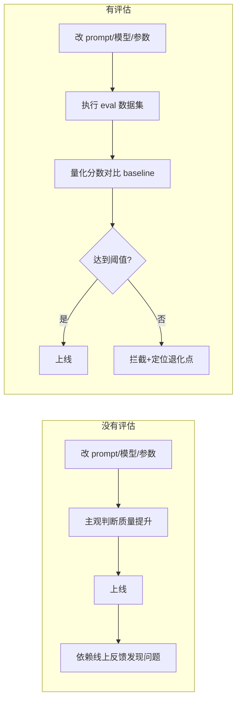
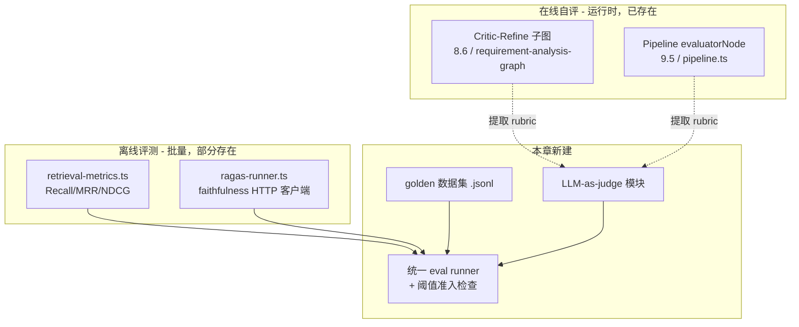
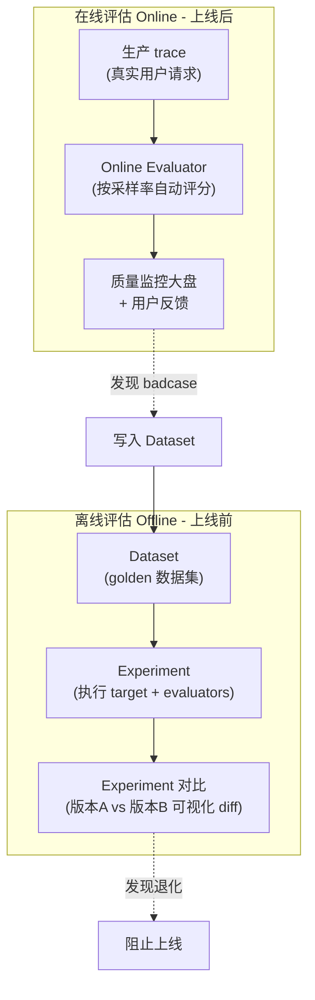
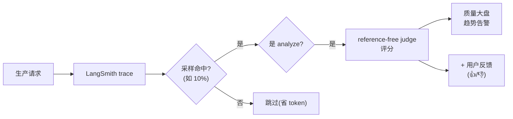
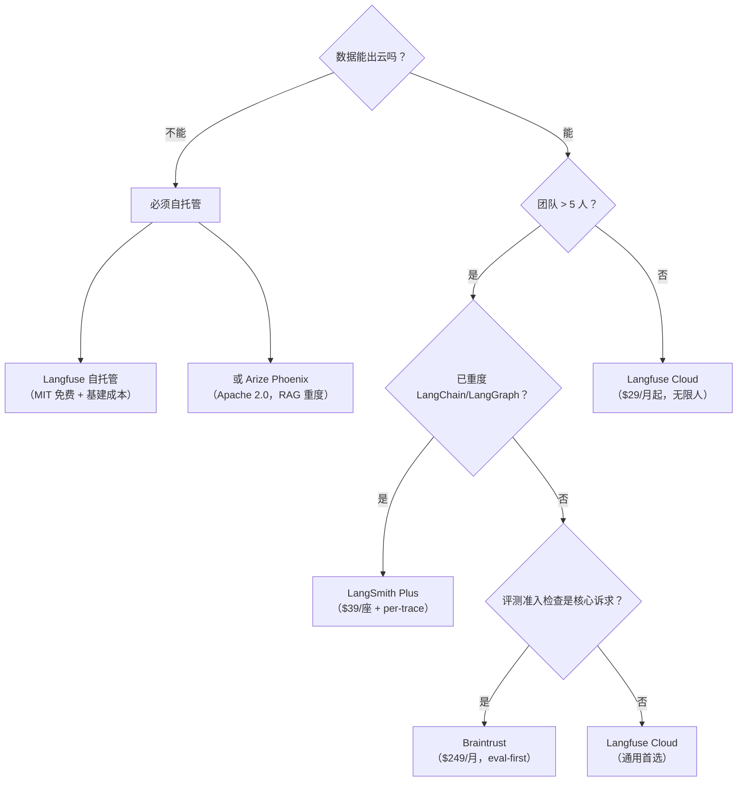

> 本文整理自《2026 前端 AI Agent 工程化实战营》课程资料，作为系列文章第 18 篇。

---
theme: channing-cyan
---


前面章节已经把需求分析系统从「单次模型调用」推进到「可编排、可观测、可归因」的 Agent 工程形态。第十六章补齐了日志、Trace、Metrics 与 token 成本观测，使系统能够回答「发生了什么」「问题出在哪里」「成本由哪些节点产生」。但可观测性并不能直接回答另一个更关键的问题：**Agent 的输出质量是否达标**。

传统软件通常依赖确定性断言。例如排序函数输入 `[3,1,2]`，期望输出 `[1,2,3]`，结果可以用二值判断。但 Agent 系统的输出具有天然的不确定性：

*   同一句「加个登录功能」，模型两次生成的需求分析报告可能措辞完全不同，但都可能满足业务要求。
*   Prompt、模型、检索 topK、重排策略或上下文拼接方式发生细微变化后，输出质量可能提升，也可能退化。
*   本地手工验证少量 case 只能覆盖有限样本，无法提前发现边界需求、合规需求或复杂架构需求上的质量下降。

因此，AI 应用的质量治理不能只依赖主观判断。它需要一套可重复、可量化、可回归的评估机制，把 Prompt 调整、模型切换、RAG 参数变更和上线决策纳入工程流程。

本章围绕这条 **评估流水线（Evaluation Pipeline）** 展开：用检索指标评估 RAG 召回与排序，用 faithfulness 与 LLM-as-judge 评估生成结果的忠实度和可执行性，用回归评估规则判断一次改动是否引入质量退化。最终，评估结果会收敛为一个可被 CI 消费的退出码，成为第十九章持续交付流程中的质量准入条件。

> 学习目标
> *   能区分离线评估（offline evaluation）、在线自评（runtime self-evaluation）和 LLM-as-judge，理解三者在质量治理中的位置与边界
> *   理解第八章 Critic-Refine 与第九章 Evaluator 的本质都是在线 judge，并能将其评分标准抽象为可版本化的 rubric
> *   能为需求分析场景设计 golden dataset：明确标注字段、样本规模、覆盖分布与演进机制
> *   能实现统一的 eval runner：读取数据集 → 运行真实检索与真实图 → 汇总指标 → 输出报告 → 执行阈值判定
> *   能补齐 RAG 检索指标 Precision\@K，并结合 RAGAS 评估 faithfulness
> *   能识别评估体系中的常见风险：judge 偏差、阈值过拟合、数据泄漏、样本分布失衡与评测集污染

> 版本与运行假设
> 
> 沿用前面章节的技术栈。本章在 `services/chat/rag/evaluation/` 既有模块上扩展：第十一章已经建立 `retrieval-metrics.ts` 与 `ragas-runner.ts`，本章补充 `precisionAtK` 与 `aggregate.ts`；同时新增 `services/chat/eval/` 目录，用于存放数据集 `datasets/`、评测语料 `corpus/`、评分标准 `rubrics/`、`judge.ts` 与 loader；新增 `scripts/seed-eval-corpus.ts` 用于写入评测检索语料，新增 `scripts/run-eval.ts` 作为统一执行入口。检索指标基于真实 embedding 与真实 pgvector，需要先完成 seed；评测结果写入新增的 `eval_runs` 表，使用 `prisma db push` 同步。RAGAS 提供本地最小服务，位于 `infra/compose/ragas/`，支持 Docker 与本地 venv 两种启动方式；第十九章会将其纳入 compose。配套测试为 `services/chat/test/chapter17-eval.spec.ts`，分为 Layer 1 零依赖测试与 Layer 2 真实 LLM 测试。

> 术语补充
>
> *   **Evaluation Pipeline（评估流水线）**：围绕固定数据集、评估指标、评分器和质量准入规则形成的自动化质量评估流程。
> *   **Golden Dataset / Golden Set（黄金数据集）**：人工确认过输入、期望意图、相关文档和标签的评测样本集合，是离线评估的信任基础。
> *   **Rubric（评分规约）**：描述评分维度、权重、阈值和判定标准的配置化文档，用于约束 LLM-as-judge 的评分行为。
> *   **Reference-based Evaluation（有参考答案评估）**：依赖 ground truth 或标准答案进行评分，例如 intent accuracy、检索 recall。
> *   **Reference-free Evaluation（无参考答案评估）**：不依赖标准答案，而根据评分规约判断输出质量，例如报告完整性、可执行性和一致性。
> *   **Regression Gate（回归准入规则）**：把评估指标转化为 pass/fail 判定，并通过非 0 退出码阻止质量退化进入后续交付流程。

***

**本章demo地址**：[feat/eval](https://github.com/Cookieboty/autix-demo/tree/feat/ch17-eval)


## 17.1 为什么 Agent 需要质量评估体系

### 17.1.1 三种「质量退化」的真实形态

先明确评估要解决的问题。AI 应用的质量退化通常以三种形态出现，每一种都难以仅靠传统测试覆盖：

**形态一：悄无声息的退化（regression）。** 你为了修一个 bug 改了 `summaryNode` 的 prompt，本地试了一个 case 觉得没问题就合了。但这个改动让模型在「含合规维度的需求」上开始漏掉合规分析——而你的本地 case 恰好不含合规。这种退化没有报错、没有系统异常，它只是让一部分输出悄悄变差，直到用户投诉。

**形态二：分布外失效（out-of-distribution）。** 你测的都是「加个登录」「做个导出」这种典型需求，模型表现很好。但用户拿来一个「把整个订单系统迁移到事件驱动架构」这种超纲需求，模型开始生成缺乏依据的分析结论。你的测试覆盖不到的分布，就是你的盲区。

**形态三：参数调整的不确定收益。** 你把 topK 从 5 调到 8，直觉上「检索更多上下文应该更好」。但实际上更多上下文带来了更多噪音，报告反而变差了。没有评估，你只能凭直觉调参，而直觉在 AI 系统里经常错。




评估流水线的本质，是把上侧路径**自动化、可重复、可量化**。它不能保证模型永远正确，但可以保证：**每一次改动对质量的影响都是可见的、可比较的**。

### 17.1.2 评估不是测试，但它借用测试的形

要注意一个微妙的区别：评估不等于单元测试。

*   单元测试断言「输出 === 期望」，二值、确定。
*   评估断言「输出质量分 >= 阈值」，连续、概率。

但评估**借用**测试的工程形态：它也是一批 case、也执行断言、也能集成进 CI、也有 pass/fail。区别在于断言的内容——评估的断言是「这份报告在忠实度维度得分 >= 0.8」，而不是「这份报告 === 固定文本」。

理解这一点很重要，因为它决定了我们怎么组织数据集和 runner：像测试一样组织（一批 case、可重复执行、具备质量准入规则），但像评估一样断言（量化分数、阈值、允许波动）。

***

## 17.2 三层评估：梳理已有能力，补充评估能力缺口


当前系统中**已经存在分散的评估能力**——第八章的 Critic-Refine、第九章的 Evaluator、第十一章的检索指标和 RAGAS 客户端。本章的核心工作是**将这些能力整合为统一流水线**，补充数据集、统一 runner 和质量准入规则。




### 17.2.1 在线自评：Critic-Refine 和 Evaluator（已存在）

第八章 8.6 我们给 `summaryStep` 装了 **Critic-Refine 子图**：actor 产出报告 → critic 评审 → 不通过则 refine 修订 → 再 critic，最多修订 2 次。看 `requirement-analysis-graph.ts` 里的 `criticNode`：

```tsx
// requirement-analysis-graph.ts （已有）
async function criticNode(state) {
  const response = await model.invoke([{
    role: 'system',
    content: `你是资深需求评审专家。按以下标准检查综合报告：
... 章节完整性、长度、排期依赖、冲突解决方案 ...
输出纯 JSON { pass, critique }`,
  }, ...]);
  // pass=true 则结束，false 则触发 refine
}
```

第九章 9.5 的 `pipeline.ts` 里有 **evaluatorNode**，用结构化输出让 LLM 给出 0-100 分评分：

```tsx
// pipeline.ts （已有）
const evaluationSchema = z.object({
  approved: z.boolean(),
  score: z.number().min(0).max(100),
  issues: z.array(z.string()),
  suggestion: z.string(),
});
// evaluatorNode：score>=80 则 approved，否则 reflectorNode 修订
```

**这两个本质上都是 LLM-as-judge**——让一个 LLM 评判另一个 LLM 的输出。它们是「在线」的，意思是它们在每次真实请求里实时执行，目的是**控制单次输出质量**（不通过则实时修订）。

但它们有两个局限：① 它们是「自评」——同一模型同时承担生成与评估角色，有系统性偏袒；② 它们的 rubric（评判标准）是固化在 prompt 中的内联文本，无法版本化、无法在离线批量评测里复用。

### 17.2.2 离线评测：检索指标和 RAGAS（部分存在）

第十一章 11.7 我们建了 `rag/evaluation/retrieval-metrics.ts`，三个零依赖纯函数：

```tsx
// rag/evaluation/retrieval-metrics.ts （已有）
export function recallAtK(retrievedIds, relevantIds, k): number { /* 召回率 */ }
export function mrr(rankedLists, relevantPerQuery): number { /* 平均倒数排名 */ }
export function ndcgAtK(retrievedIds, relevantIds, k): number { /* 位置加权 */ }
```

还有 `ragas-runner.ts`——一个调用外部 RAGAS Python 服务的 HTTP 客户端，评 faithfulness（忠实度，回答有没有脱离检索到的上下文生成无依据内容）：

```tsx
// rag/evaluation/ragas-runner.ts （已有）
export async function runRagas(samples, metrics): Promise<RagasResult> {
  // POST 到 RAGAS_ENDPOINT (默认 localhost:7860/evaluate)
  // 60s 超时、3 次重试、失败降级返回 null（不影响）
}
```

这些是「离线」的——它们不在每次请求里执行，而是使用一批 case 进行批量评测。但它们现在**只在测试里被调用过**，没有统一的入口把它们组织成一条流水线，也没有 golden 数据集传入它们。

### 17.2.3 待补充的能力：数据集 + 统一 runner + 准入检查

明确现有能力与能力缺口后，本章要补的「另一半」就清晰了：

| 已有                                     | 缺                                     |
| -------------------------------------- | ------------------------------------- |
| Critic/Evaluator（在线 judge，rubric 内联）   | 将 rubric 抽象为版本化配置，并在离线评估中复用           |
| retrieval-metrics（Recall/MRR/NDCG 纯函数） | Precision\@K；批量评分入口                   |
| ragas-runner（faithfulness 客户端）         | RAGAS 服务实现；接入流水线                      |
| 测试里的零散 case                            | golden 数据集（.jsonl，结构化、可演进）            |
| ——                                     | 统一 eval runner：执行数据集→运行图→评分→报告→质量准入判定 |

接下来逐项补充。

***

## 17.3 检索质量：四个指标系统说明


RAG 系统的第一道环节是检索。若检索返回的文档片段本身不相关，后续生成就会缺乏可靠依据。检索质量的评估是**离线、确定、不需要 LLM** 的，所以成本最低，也最适合优先实施。

下面用一个具体例子说明四个核心指标。假设一个 query「企业微信登录怎么做」，知识库里**真正相关**的文档是 `{c1, c3}`（这是人工标注的 ground truth），检索系统**实际返回**的前 5 个是 `[c1, c5, c3, c8, c9]`。

### 17.3.1 Recall\@K（召回率）

「相关文档里，有多少被检索回来了？」

Recall\@5 = 命中的相关文档数 / 相关文档总数 = `{c1,c3}` 都在前 5 里 = 2/2 = **1.0**。

Recall 关注「是否遗漏」。漏掉关键文档是 RAG 的致命伤——模型根本看不到正确信息，也难以生成正确答案。`retrieval-metrics.ts` 已实现：

```tsx
export function recallAtK(retrievedIds, relevantIds, k): number {
  if (k <= 0 || relevantIds.length === 0) return 0;
  const top = retrievedIds.slice(0, k);
  const rel = new Set(relevantIds);
  let hit = 0;
  for (const id of top) if (rel.has(id)) hit += 1;
  return hit / relevantIds.length;
}
```

### 17.3.2 Precision\@K（准确率）

「检索回来的文档里，有多少是真相关的？」

Precision\@5 = 命中的相关文档数 / 检索返回数 = 2 / 5 = **0.4**。

Precision 关注「是否准确」。Precision 低意味着检索回来大量噪音文档，它们会挤占上下文窗口、误导模型。**Recall 和 Precision 是一对权衡**：把 K 调大，Recall 容易上去（返回结果越多就不容易漏），但 Precision 会下降（返回结果越多噪音也多）。这就是为什么我们要同时看两个指标，而现有代码只有 Recall——本章补上 Precision：

```tsx
// rag/evaluation/retrieval-metrics.ts —— 新增
export function precisionAtK(retrievedIds: string[], relevantIds: string[], k: number): number {
  if (k <= 0) return 0;
  const top = retrievedIds.slice(0, k);
  if (top.length === 0) return 0;
  const rel = new Set(relevantIds);
  let hit = 0;
  for (const id of top) if (rel.has(id)) hit += 1;
  return hit / top.length; // 注意分母是「实际返回数」，不是 relevantIds.length
}
```

> 注意 Recall 和 Precision 的分母差异：Recall 的分母是「相关文档总数」（是否遗漏的视角），Precision 的分母是「实际返回数」（是否准确的视角）。同样命中 2 个，Recall\@5 = 2/2 = 1.0，Precision\@5 = 2/5 = 0.4。这个差异是理解两个指标的关键。

### 17.3.3 MRR（平均倒数排名）

「第一个相关文档排在第几位？」

我们的例子里第一个相关文档 `c1` 排在第 1 位，倒数排名 = 1/1 = 1.0。如果它排在第 3 位，倒数排名 = 1/3。MRR 是一批 query 的倒数排名取平均。

MRR 关心「相关文档够不够靠前」。这在「只看前几条」的场景特别重要——如果相关文档排在第 8 位，虽然 Recall\@10 算它命中，但用户/模型可能只看前 3 条，实际价值有限。

### 17.3.4 NDCG\@K（归一化折损累计增益）

更综合的指标是：它同时考虑「是否命中」和「命中的排序位置是否足够靠前」，用对数折损给靠后的位置打折扣，再归一化到 0-1。`retrieval-metrics.ts` 已用二值相关性实现（命中=1，未命中=0）。

NDCG 是检索质量的「综合分」。实务里通常主看 NDCG\@K + Recall\@K：NDCG 看综合排序质量，Recall 看有没有漏掉关键信息。

> 二值 vs 分级相关性：我们的实现用二值相关性（相关/不相关），这覆盖了最常见的标注场景。更精细的场景可以用分级相关性（0=无关，1=有点相关，2=高度相关），NDCG 天然支持，但标注成本陡增。第一性原理：先用二值相关性建立评估基线，等出现「区分『有点相关』和『高度相关』」的明确业务诉求时再升级。这是架构原则 A11「YAGNI——先用最简单的方案运行，需求到了再升级」的体现。

***

## 17.4 生成质量：faithfulness 与本地 RAGAS

检索对了，下一关是生成——模型有没有忠实地基于检索到的内容回答，还是脱离上下文生成无依据内容（幻觉）。这就是 **faithfulness（忠实度）**，RAG 评估里最重要的生成指标。

faithfulness 的判定本身需要 LLM（需要理解语义，才能判断「这句话是否能由上下文推出」），业界成熟方案是 **RAGAS** 框架。我们第十一章已经写好了客户端 `ragas-runner.ts`，但**仓库中尚未提供 RAGAS 服务实现**——客户端默认请求 `localhost:7860`，而仓库中尚未提供对应服务；此前测试主要通过 mock 覆盖。

本章补充服务实现。新建 `infra/compose/ragas/`，一个最小 FastAPI + ragas：

```python
# infra/compose/ragas/app.py（最小本地 RAGAS 服务）
from fastapi import FastAPI
from pydantic import BaseModel
from ragas import evaluate
from ragas.metrics import faithfulness, answer_relevancy
from datasets import Dataset

app = FastAPI()

class Sample(BaseModel):
    question: str
    answer: str
    contexts: list[str]
    ground_truth: str | None = None

class Req(BaseModel):
    samples: list[Sample]
    metrics: list[str]

@app.post("/evaluate")
def run(req: Req):
    ds = Dataset.from_list([s.model_dump() for s in req.samples])
    metric_map = {"faithfulness": faithfulness, "answer_relevancy": answer_relevancy}
    chosen = [metric_map[m] for m in req.metrics if m in metric_map]
    result = evaluate(ds, metrics=chosen)
    return {m: float(result[m]) for m in result}
```

```docker
# infra/compose/ragas/Dockerfile
FROM python:3.12-slim
WORKDIR /app
COPY requirements.txt .
RUN pip install --no-cache-dir -r requirements.txt
COPY app.py .
EXPOSE 7860
CMD ["uvicorn", "app:app", "--host", "0.0.0.0", "--port", "7860"]
```

这个服务的协议和现有 `ragas-runner.ts` 完全对齐（`POST /evaluate`，body 含 `samples` + `metrics`），因此客户端无需修改即可接入。仓库里 `infra/compose/ragas/` 同时提供了 `Dockerfile`（有 Docker 时）和 `run-local.sh`（无 Docker 时直接运行 venv + uvicorn）两种启动方式；`run-eval.ts` 默认不连 RAGAS，仅当 `RUN_RAGAS=1` 且服务可达时才评 faithfulness（不可达由 `runRagas` 返回 `null` 自动跳过）。第十九章会将 `ragas` 服务纳入 `infra/compose/compose.yaml`，`docker compose up ragas` 即可启动服务。

> ⚠️ 本地可执行 vs 成本：RAGAS 评 faithfulness 本身需要调用 LLM（它内部把答案拆成 claims，逐个判断能否从上下文推出），所以它**不是零成本的**——评一批样本要消耗 token。因此 faithfulness 评测放在「离线、按需触发」，不放进每次 PR（成本和稳定性考量，第十九章会讲这个取舍）。本地服务解决的是「是否具备运行条件」，不改变评估本身的 token 成本。

`ragas-runner.ts` 现有的降级设计很关键——服务不可达时返回 `null` 而不是抛出异常：

```tsx
// ragas-runner.ts （已有的降级，呼应架构原则 A6「依赖失败变类型降级」/ A12「外部依赖隔离」）
// 失败时返回 null，调用方据此跳过 faithfulness 维度，不影响整条评测流水线
```

这是「依赖失败变成有类型的降级」的范本：RAGAS 是外部依赖，它不可用不应该让整条 eval 流水线失败，而是让 faithfulness 这一维度缺席、其他维度照常。

***

## 17.5 LLM-as-judge：将 LLM 作为评估器

检索指标和 faithfulness 解决了 RAG 链路的评估。但我们的系统核心产出是**需求分析报告**——一份结构化的 Markdown，要评它的「完整性、专业性、可执行性」，没有 ground truth 可比对（每份好报告都不一样），因此需要使用 LLM-as-judge 进行语义评分。

### 17.5.1 将 rubric 从 prompt 中抽象出来

17.2.1 说过，Critic/Evaluator 已经是 judge，但它们的评判标准（rubric）固化在 prompt 中。本章第一步是将 rubric **外置为可版本化配置**，让在线 Critic 和离线 judge 共享同一份标准。

新建 `services/chat/eval/rubrics/requirement-analysis.yaml`：

```yaml
# 需求分析报告评分 rubric（版本化，在线 Critic 与离线 judge 共享）
version:1
dimensions:
-id: completeness
name: 完整性
weight:0.3
desc: 是否覆盖功能分解、用户故事、验收标准、风险、排期依赖
-id: professionalism
name: 专业性
weight:0.25
desc: 术语准确、分析有深度、无明显事实错误
-id: actionability
name: 可执行性
weight:0.25
desc: 结论是否具体可落地，而非空泛套话
-id: consistency
name: 一致性
weight:0.2
desc: 各章节结论不自相矛盾，冲突有解决方案
gate:
minScore:75        # 总分阈值，低于此判定 fail
minPerDimension:60 # 单维度下限，任一维度低于此也 fail
```

rubric 外置的三个好处：① **可版本化**——rubric 改了能 diff、能追溯；② **在线/离线统一**——`criticNode` 和离线 judge 读同一份 yaml，不会出现「线上评审标准和离线评测标准不一致」；③ **可校准**——发现 judge 评分不准时，调整 yaml 即可，无需修改代码。

### 17.5.2 judge 模块

新建 `services/chat/eval/judge.ts`：

```tsx
/**
 * judge.ts —— LLM-as-judge：按版本化 rubric 给需求分析报告评分。
 * 与在线 criticNode 共享 rubric 来源（rubrics/*.yaml）。
 */
import { z } from 'zod';
import type { BaseChatModel } from '@langchain/core/language_models/chat_models';
import { loadRubric } from './rubric-loader';

const dimScoreSchema = z.object({
  dimensionId: z.string(),
  score: z.number().min(0).max(100),
  reason: z.string(),
});
const judgeSchema = z.object({
  dimensions: z.array(dimScoreSchema),
  overallCritique: z.string(),
});

export interface JudgeResult {
  totalScore: number;                    // 加权总分
  dimensions: Record<string, number>;    // 各维度分
  passed: boolean;                       // 是否过 gate
  critique: string;
}

export async function judgeReport(
  model: BaseChatModel,
  report: string,
  rubricId = 'requirement-analysis',
): Promise<JudgeResult> {
  const rubric = loadRubric(rubricId);
  const structured = model.withStructuredOutput(judgeSchema);
  const result = await structured.invoke([
    { role: 'system', content: buildJudgePrompt(rubric) },
    { role: 'user', content: `待评分报告：\n\n${report}` },
  ]);

  // 加权汇总（权重来自 rubric，不在 LLM 里算，避免它算错）
  const dims: Record<string, number> = {};
  let total = 0;
  for (const d of rubric.dimensions) {
    const got = result.dimensions.find((x) => x.dimensionId === d.id)?.score ?? 0;
    dims[d.id] = got;
    total += got * d.weight;
  }
  const passed =
    total >= rubric.gate.minScore &&
    rubric.dimensions.every((d) => dims[d.id] >= rubric.gate.minPerDimension);

  return { totalScore: Math.round(total), dimensions: dims, passed, critique: result.overallCritique };
}
```

注意：**加权汇总在代码中计算，不交给 LLM 计算**。LLM 更适合完成「按维度给出质量判断」这类语义任务，而权重加总属于确定性计算，应由代码完成。所以 judge 只让 LLM 输出各维度分，总分和通过判定由确定性代码完成。这是「让 LLM 做它擅长的、把确定性逻辑留给代码」的分工原则。

### 17.5.3 judge 的偏差与校准

LLM-as-judge 有几个常见偏差，必须知道：

*   **自我偏袒**：用 `gpt-5.4` 评 `gpt-5.4` 的输出，会系统性偏高。缓解：judge 用不同的模型，或至少不同的 prompt 框架。
*   **长度偏好**：judge 倾向于给长报告高分（「看起来更详细」）。缓解：rubric 里明确「长度不是质量」，并在数据集里放「篇幅较长但信息密度较低」的反例校准。
*   **位置偏好**：做两两对比时，judge 偏好排在前面的。缓解：对比评测时交换位置各执行一次取平均。

校准方法：选取一组**人工标注过分数**的报告，让 judge 同样评分，再计算 judge 分数与人工分数的相关性。相关性高（如 Spearman 秩相关系数 > 0.7，衡量两组排名的一致程度）才说明这个 judge 可信。校准不通过就调 rubric prompt，直到对齐。

> 不要陷入「用 judge 评 judge」的递归。judge 的可信度最终要靠**人工标注的小样本**来锚定。评估流水线可以自动化 99%，但那 1% 的「人工锚点」不能省略——它是整条流水线的信任根。

***

## 17.6 golden 数据集：质量评估体系的「标准件」

有了指标和 judge，还差传入它们的「输入数据」——golden 数据集。这是评估流水线最容易被忽视、却最决定成败的部分。指标和 runner 是流水线的机器，数据集是流水线的「标准件样品」，缺少稳定样本时，评估流程也无法形成可靠判断。

### 17.6.1 数据集结构

`services/chat/eval/datasets/requirement-analysis.jsonl`，每行一个 case（截取部分，完整数据集 14 条）：

```json
{"id":"req-login-001","input":"加个企业微信扫码登录功能","expectedIntent":"analyze","relevantChunkIds":["c-auth-1","c-auth-3"],"tags":["auth","typical"]}
{"id":"req-export-001","input":"订单导出支持百万行异步下载，完成后邮件通知","expectedIntent":"analyze","relevantChunkIds":["c-export-2"],"tags":["performance","typical"]}
{"id":"req-arch-001","input":"把整个订单系统迁移到事件驱动架构","expectedIntent":"analyze","relevantChunkIds":["c-arch-1"],"tags":["architecture","edge"]}
{"id":"req-clarify-001","input":"做个更好用的系统","expectedIntent":"analyze","tags":["needs-clarification","edge"]}
{"id":"query-001","input":"REQ-001 现在什么状态","expectedIntent":"query","tags":["query"]}
{"id":"chat-001","input":"你好","expectedIntent":"chat","tags":["smalltalk"]}
{"id":"req-compliance-001","input":"用户数据要符合GDPR删除权，支持彻底删除个人信息","expectedIntent":"analyze","relevantChunkIds":["c-gdpr-1"],"tags":["compliance","typical"]}
```

字段设计（遵守架构原则 A3「schema 白名单——只暴露需要的字段」，只放评测真正需要的）：

| 字段                  | 用途                                               | 必填          |
| ------------------- | ------------------------------------------------ | ----------- |
| `id`                | case 唯一标识，报告里定位用                                 | 是           |
| `input`             | 用户输入文本，传入真实图                                     | 是           |
| `expectedIntent`    | 期望的 triage 分诊结果（chat/query/analyze），评 triage 准确率 | 是           |
| `relevantChunkIds`  | 该 query 的相关文档（ground truth），评检索指标                | RAG case 必填 |
| `groundTruthAnswer` | 标准答案（评 faithfulness 时作参照）                        | 可选          |
| `tags`              | 分类标签（typical/edge/compliance…），分桶看分数             | 是           |

### 17.6.2 标什么、标多少、怎么演进

**标什么**：数据集的覆盖面决定盲区。要刻意覆盖三类——典型 case（占主要比例，反映主流量）、边界 case（needs-clarification、超纲需求，反映抗压能力）、专项 case（含安全/性能/合规维度，确保关键能力不退化）。

**标多少**：第一性原理——不是越多越好，是「能区分好坏 + 覆盖主要场景」即可。初始阶段通常 15-30 条即可。盲目扩充到几百条，标注成本陡增，且很多是冗余的「同类典型 case」，对发现退化没增益。当某类 case 反复出现问题时，再针对性补充该类别样本。

**怎么演进**：数据集应持续演进。最有价值的演进来源是**线上 badcase**——用户反馈「报告遗漏合规分析」，就将对应需求纳入数据集，使其成为后续版本的回归样本。这是评估数据集的闭环：线上每暴露一个问题，数据集就形成一个新的回归样本，后续同类问题就可以在 CI 阶段被提前发现。

> ⚠️ 数据泄漏：golden 数据集**绝不能**用于训练/微调，也不要将其作为 few-shot 示例写入 prompt。一旦模型「见过」评测集，分数就会虚高，并失去评估意义。评测集要像考试题一样保密——它的价值正在于模型没见过。

***

## 17.7 统一 eval runner 与阈值准入检查


最后，把指标、judge、数据集串成一条流水线。新建 `services/chat/scripts/run-eval.ts`。

但在写之前，有一个**绕不开的数据流问题**必须先说明——它决定了 runner 的形状：

> **检索指标的 chunkId 从哪来？** 直觉会写成 `output.retrievedIds`（从图里取检索结果）。但查看真实代码会发现：分析图（`runAnalysisGraph`）**既不做检索、也不返回 chunkId**——它只接收一个已经拼接完成的 `retrievedContext` 字符串（检索发生在更上游的 `conversation.controller.ts`，调用 `SearchService.similaritySearch`）。所以 `output.retrievedIds` 是不存在的。
>
> 正确的拆分是：**检索指标评的是「检索器」，judge 评的是「报告」**，两者是不同的被测对象。runner 直接调用 `SearchService.similaritySearch` 获取 chunkId，并据此计算检索指标，同时将检索结果拼接为 `retrievedContext`，再传入图中生成报告。

还有一个对齐细节：`document_chunks.id` 默认是自动 cuid，无法天然等于数据集里的 `relevantChunkIds`（`c-auth-1`…）。解决办法是新建一个 seed 脚本 `scripts/seed-eval-corpus.ts`，把 `eval/corpus/requirement-kb.jsonl` 写入进库时**显式指定稳定 chunk id**，并关联到一个专用的 `EVAL_USER_ID`（与真实用户数据隔离）。这样检索走的是**真 embedding（本地 MiniLM）+ 真 pgvector 余弦**，指标是真实的，仅 id 采用可读的稳定值。执行 eval 前先运行 `bun run scripts/seed-eval-corpus.ts` 完成一次写入即可。

```tsx
/**
 * run-eval.ts —— 统一评测 runner
 * 流程：读数据集 → 每个 case 真检索 + 运行真实图 → 算指标/judge → 分桶聚合
 *      → 报告(JSON/CSV) + 落 eval_runs 表 → 阈值准入检查（非 0 退出码供 CI 当准入判断依据）
 *
 * 用法：
 *   bun run scripts/run-eval.ts                 # 全量（检索指标 + 真图 + judge）
 *   bun run scripts/run-eval.ts --no-llm        # 只执行检索指标（本地 embedding，成本较低、确定）
 *   bun run scripts/run-eval.ts --case=req-login-001
 */
import { ChatOpenAI } from '@langchain/openai';
import { SearchService } from '../src/document/search.service';
import { runAnalysisGraph } from '../src/llm/graph/requirement-analysis-graph';
import { judgeReport } from '../eval/judge';
import { loadDataset, EVAL_USER_ID } from '../eval/dataset-loader';
import { precisionAtK, recallAtK, ndcgAtK } from '../rag/evaluation/retrieval-metrics';
import { aggregate, gateDecision, type CaseResult } from '../rag/evaluation/aggregate';

const TOP_K = 5;

async function main() {
  const args = process.argv.slice(2);
  const noLlm = args.includes('--no-llm');
  const onlyCase = args.find((a) => a.startsWith('--case='))?.split('=')[1];

  const cases = loadDataset('requirement-analysis').filter((c) => !onlyCase || c.id === onlyCase);
  const search = new SearchService(prisma, new EmbeddingService()); // 真检索器
  const model = noLlm ? null : new ChatOpenAI({ /* 从 .env 读 key/baseURL/model */ });
  const results: CaseResult[] = [];

  for (const c of cases) {
    const r: CaseResult = { id: c.id, tags: c.tags, metrics: {} };

    // 1. 真检索（本地 embedding + pgvector，确定、成本较低，--no-llm 也执行）
    const retrieved = await search.similaritySearch(c.input, EVAL_USER_ID, TOP_K);
    const retrievedIds = retrieved.map((x) => x.chunkId);

    // 2. 检索指标（存在 ground truth 时才计算）
    if (c.relevantChunkIds?.length) {
      r.metrics.recall = recallAtK(retrievedIds, c.relevantChunkIds, TOP_K);
      r.metrics.precision = precisionAtK(retrievedIds, c.relevantChunkIds, TOP_K);
      r.metrics.ndcg = ndcgAtK(retrievedIds, c.relevantChunkIds, TOP_K);
    }

    if (model) {
      // 3. 运行真实图（传入真检索拼出的 retrievedContext）
      const output = await runAnalysisGraph({
        input: c.input,
        retrievedContext: formatContext(retrieved),
        model,
      });
      // 4. triage 准确率
      r.metrics.intentCorrect = output.intent === c.expectedIntent ? 1 : 0;
      // 5. LLM-as-judge（analyze 类才评报告）
      if (c.expectedIntent === 'analyze' && output.summary) {
        const j = await judgeReport(model, output.summary);
        r.metrics.judgeScore = j.totalScore;
        r.judgePassed = j.passed;
      }
    }
    results.push(r);
  }

  // 6. 聚合 + 报告 + 落库 + 准入检查
  const summary = aggregate(results);
  writeReport(summary, results);                  // 输出 eval/reports/<ts>.json + CSV
  await prisma.eval_runs.create({ data: { /* gitSha, 各 avg 指标, passed, report */ } });
  const passed = gateDecision(summary);            // recall>=0.8 && judge>=75 && intent>=0.9
  console.log(passed ? '✅ EVAL PASSED' : '❌ EVAL FAILED');
  process.exit(passed ? 0 : 1);                    // ← CI 根据该退出码执行准入判断
}

main();
```

> 准入检查需要注意一个边界条件：`--no-llm` 时只有检索指标、没有 judge/intent，准入检查**不能因为这些维度缺席就误判 fail**。所以 `gateDecision` 的实现是「仅对存在结果的维度应用阈值判定，缺失维度不参与判定」——分层触发（PR 执行 `--no-llm`、nightly 执行全量）才不会自相矛盾。

运行输出示例（某次本地运行节选）：

    ┌────────────────────┬────────┬───────────┬──────┬────────────┐
    │ 维度                │ Recall │ Precision │ NDCG │ JudgeScore │
    ├────────────────────┼────────┼───────────┼──────┼────────────┤
    │ typical (n=10)      │  0.92  │   0.58    │ 0.88 │     81     │
    │ edge (n=4)          │  0.75  │   0.40    │ 0.70 │     68     │
    │ compliance (n=3)    │  0.83  │   0.50    │ 0.81 │     77     │
    │ 全量平均             │  0.86  │   0.52    │ 0.83 │     78     │
    └────────────────────┴────────┴───────────┴──────┴────────────┘
    ✅ EVAL PASSED (recall 0.86>=0.8, judge 78>=75, intent 0.93>=0.9)

**按标签分桶查看分数**是关键——全量平均 78 表面上达标，但 edge 桶只有 68，暴露了「模型在边界 case 上质量明显更差」。如果只看全量平均，这个问题就被掩盖了。这就是为什么数据集需要添加 `tags`。

*   🤖 生成代码 Prompt：统一 eval runner
```
请在 `services/chat` 中实现第十七章的统一评测 runner，要求与现有需求分析图、RAG 检索服务和评测指标复用，不要写成脱离真实链路的 mock demo。

目标：
1. 新增 `services/chat/scripts/run-eval.ts`，作为统一执行入口。
2. 读取 `services/chat/eval/datasets/requirement-analysis.jsonl` 中的 golden dataset。
3. 对每个 case 执行真实检索：调用 `SearchService.similaritySearch(input, EVAL_USER_ID, TOP_K)`，拿到 retrieved chunk ids。
4. 对带 `relevantChunkIds` 的 case 计算检索指标：
   - `recallAtK`
   - `precisionAtK`
   - `ndcgAtK`
   - 如已有 MRR 聚合逻辑，也纳入 summary。
5. 当未传入 `--no-llm` 时，继续运行真实需求分析图：
   - 将检索结果格式化为 `retrievedContext`
   - 调用 `runAnalysisGraph({ input, retrievedContext, model })`
   - 计算 `intentCorrect`
   - 对 `expectedIntent === "analyze"` 且存在 `summary` 的结果调用 `judgeReport`
6. 新增或复用聚合模块 `rag/evaluation/aggregate.ts`：
   - 按全量和 tags 分桶聚合指标
   - 输出每个 case 的明细、分桶均值、overall 均值
   - 实现 `gateDecision(summary)`，只对存在结果的维度应用阈值，缺失维度不参与判定
7. 输出报告：
   - JSON：`eval/reports/<timestamp>.json`
   - CSV：`eval/reports/<timestamp>.csv`
   - 控制台打印全量与分桶指标
8. 将评测结果写入 `eval_runs` 表：
   - gitSha
   - model
   - startedAt / finishedAt
   - overall metrics
   - passed
   - report path 或 report JSON
9. runner 的退出码必须可供 CI 使用：
   - passed 为 true：`process.exit(0)`
   - passed 为 false：`process.exit(1)`

命令行参数：
- `bun run scripts/run-eval.ts`：全量评测
- `bun run scripts/run-eval.ts --no-llm`：只执行检索指标，不调用 LLM judge
- `bun run scripts/run-eval.ts --case=req-login-001`：只执行指定 case
- `RUN_RAGAS=1 bun run scripts/run-eval.ts`：在 RAGAS 服务可达时补充 faithfulness

重要约束：
- 不要从 `runAnalysisGraph` 中读取 `output.retrievedIds`，真实图不负责检索，也不返回 chunkId。
- 检索指标评估对象是检索器；judge 评估对象是生成报告；两者不要混在一起。
- `--no-llm` 模式下缺失 judge/intent 指标是正常情况，不能因此判定失败。
- 所有阈值集中在 aggregate/gate 配置中，不要散落在 runner 各处。
- 复用现有 `retrieval-metrics.ts`、`ragas-runner.ts`、`judge.ts`、`dataset-loader.ts`，不要重复实现。
- 代码需要有清晰错误处理：单个 case 失败应记录错误并进入报告，是否影响最终 passed 由 gate 规则决定。
```

*   📋 配套用例（`test/chapter17-eval.spec.ts`）
    分为两层：
    **Layer 1**（零 LLM）验证纯函数和准入检查逻辑：

```tsx
describe('17.3 检索指标', () => {
  it('precisionAtK：返回5个命中2个 = 0.4', () => {
    expect(precisionAtK(['c1','c5','c3','c8','c9'], ['c1','c3'], 5)).toBeCloseTo(0.4);
  });
  it('recallAtK：相关2个全命中 = 1.0', () => {
    expect(recallAtK(['c1','c5','c3','c8','c9'], ['c1','c3'], 5)).toBe(1);
  });
});

describe('17.7 准入检查判定', () => {
  it('低于阈值则 fail', () => {
    const summary = { overall: { recall: 0.7, judgeScore: 80, intentCorrect: 0.95 } };
    expect(gateDecision(summary)).toBe(false); // recall 0.7 < 0.8
  });
});
```

    **Layer 2**（需 `OPENAI_API_KEY` + `RUN_LLM_EVAL_TESTS=1`）：judge 对一份明显好的报告和一份明显低质量的报告给出有区分度的分数；runner 端到端执行 1 个 case。

### 17.7.1 一个真实决策：用 eval 判断「topK 该不该调大」

抽象的流水线讲完，下面通过一个具体场景，说明评估如何把「主观判断」转化为「依据数据决策」。

假设你怀疑「检索的 topK 从 5 调到 8 会让报告更好」，因为模型能看到更多上下文。没有评估时，你只能改了之后执行两个 case，主观认为结果更详细后就合并。有了评估，你这么做：

1.  在当前分支（topK=5）执行一次 `run-eval.ts`，存为 baseline 报告。
2.  改成 topK=8，再执行一次。
3.  对比两份报告的分桶分数。

某次真实对比的结果：

    维度对比 (topK=5 → topK=8)
      Recall (typical):     0.92 → 0.95   ↑ 检索召回略升（预期内）
      Precision (typical):  0.58 → 0.41   ↓ 准确率明显降（噪音变多）
      JudgeScore (typical): 81   → 79     ↓ 报告质量反而略降
      JudgeScore (edge):    68   → 62     ↓ 边界 case 退化更明显

数据呈现了一个反直觉结论：**topK 调大确实提高了召回，但引入的噪音文档拉低了 Precision，模型被无关上下文干扰，报告质量不升反降，边界 case 退化尤其严重**。如果没有评估，你会带着「更多上下文更好」的错误直觉将这个改动合并到主分支，悄悄让质量退化（17.1.1 的形态三）。

这就是评估流水线的核心价值——它不告诉你「该怎么改」，但它能够量化呈现一次改动后的质量变化方向。AI 系统里太多「基于直觉判断更好」的改动，实际是退化。评估是在上线前识别这类退化的重要手段。

> 这也呼应了第十六章：可观测性告诉你「线上 token/延迟变了」，评估告诉你「质量变了」。两者合起来，才构成对一次改动的完整判断——既知道代价（成本/延迟），又知道收益（质量）。只观察其中一类信号，都可能导致错误决策。

***

## 17.8 实战：用 LangSmith 做托管评测与生产监控


前面 17.7 的本地 `run-eval.ts` 已经能够执行「数据集 → 运行图 → 评分 → 准入检查」整条流水线。它的优点是零外部依赖、执行的是真实图、CI 友好。但它有两个限制：

1.  **结果是「一次性」的**——每次执行完输出一份 JSON/CSV，多次执行之间的对比需要手动整理。当你做第 5 次 prompt 调优时，需要回溯「第 2 次 vs 第 5 次哪个版本更好、退化出现在哪个 case」，本地报告很难支撑。
2.  **只有离线**——它评的是你手头的数据集，无法评估「线上真实流量的质量」。线上一个你数据集里没有的 badcase，本地 runner 永远不知道。

LangSmith 可以补足这两项能力：**Experiment 的可视化对比**（解决限制 1）和**生产流量的在线评估**（解决限制 2）。本节系统说明 LangSmith 的落地方式——它不是替代本地 runner，而是在本地 runner 之上叠一层「团队级可视化 + 生产监控」。

### 17.8.1 LangSmith 在评估体系里的位置

先把 LangSmith 的两种评估说明，它们对应两个完全不同的时机：




*   **离线评估（Offline）**：上线前，拿固定数据集执行 experiment，对比不同版本。这是 17.7 本地 runner 做的事，LangSmith 为其提供了「可视化 + 历史对比 + 团队协作」。
*   **在线评估（Online）**：上线后，对生产 trace 按采样率自动评分，监控质量趋势、收集用户反馈。这是本地 runner **难以覆盖**的，也是 LangSmith 真正不可替代的部分——它把第十六章的「可观测」和本章的「评估」在生产环境里合二为一。

注意下方的回路：**线上发现的 badcase → 写入 Dataset → 下次离线评估就覆盖该回归场景**。这正是 17.6.2 说的「线上 badcase 反哺数据集」的闭环，LangSmith 把它产品化支持。

### 17.8.2 准备：开启 tracing（和第十六章打通）

LangSmith 的一切都建立在 trace 之上。开启只需环境变量（第十六章 16.3 / 16.9 预留的就是这个开关）：

```bash
# .env —— 开启后，所有 LangChain/LangGraph 调用自动上传 trace
export LANGSMITH_TRACING=true
export LANGSMITH_API_KEY=lsv2_...           # 从 langsmith UI 获取
export LANGSMITH_PROJECT=autix-requirement  # trace 归到这个项目下
```

关键认知：**你不需要改任何业务代码**。只要装了 `langsmith` 包、设了这几个环境变量，第八/九章那张图、第十五章的 DeepAgent、本章的 judge——所有 LangChain 生态的调用都会自动上传 trace。这和第十六章的本地 `LlmTracer` 是「同一套 callback 事件的两个去向」：本地 tracer 落 pino 日志 + Prometheus，LangSmith 落云端可视化。两者可以同时启用——本地保留基础观测，云端提供深入分析。

> 边界声明：`LANGSMITH_TRACING=true` 会把**调用内容**（prompt、输出、token）上传到 LangSmith 云。这意味着用户输入会出云——和第十八章 18.7 的「敏感数据纪律」直接冲突。生产里要么用 LangSmith 自托管版（数据不出私网），要么对上传内容做脱敏（LangSmith 支持 `hide_inputs`/`hide_outputs` 钩子）。**带敏感数据的生产环境，开启 LangSmith 前必须先解决数据驻留问题**，这是一个需要明确评估的数据合规决策，不能默认开启。

### 17.8.3 离线评估实战：上传数据集 + 执行 Experiment

第一步，把本地的 golden 数据集（17.6 的 `.jsonl`）上传成 LangSmith Dataset。这是一次性的同步脚本：

```tsx
// services/chat/scripts/sync-langsmith-dataset.ts
import { Client } from 'langsmith';
import { loadDataset } from '../eval/dataset-loader';

const client = new Client(); // 自动读取 LANGSMITH_API_KEY

async function main() {
  const datasetName = 'autix-requirement-analysis';
  // 幂等：存在则复用
  let dataset;
  try {
    dataset = await client.readDataset({ datasetName });
  } catch {
    dataset = await client.createDataset(datasetName, { description: '需求分析 golden 数据集' });
  }

  const cases = loadDataset('requirement-analysis');
  await client.createExamples({
    inputs: cases.map((c) => ({ input: c.input })),
    outputs: cases.map((c) => ({
      expectedIntent: c.expectedIntent,
      relevantChunkIds: c.relevantChunkIds ?? [],
      groundTruthAnswer: c.groundTruthAnswer ?? null,
    })),
    metadata: cases.map((c) => ({ tags: c.tags })), // 分桶用
    datasetId: dataset.id,
  });
  console.log(`已上传${cases.length} 条到 LangSmith Dataset:${datasetName}`);
}
main();
```

第二步，定义 **target 函数**（被评估的系统）和 **evaluators**（评分器）。target 直接复用真实图，evaluator 复用 17.5 的 judge：

```tsx
// services/chat/scripts/run-langsmith-eval.ts
import { evaluate } from 'langsmith/evaluation';
import { ChatOpenAI } from '@langchain/openai';
import { SearchService, type SearchResult } from '../src/document/search.service';
import { runAnalysisGraph } from '../src/llm/graph/requirement-analysis-graph';
import { judgeReport } from '../eval/judge';
import { recallAtK, precisionAtK } from '../rag/evaluation/retrieval-metrics';
import { EVAL_USER_ID } from '../eval/dataset-loader';

const model = new ChatOpenAI({ /* 从 .env 读 */ });
const search = new SearchService(prisma, new EmbeddingService());

// target：真检索 + 运行真实图，返回 evaluator 能消费的输出
async function target(inputs: { input: string }) {
  const retrieved = await search.similaritySearch(inputs.input, EVAL_USER_ID, 5);
  const retrievedIds = retrieved.map((r) => r.chunkId);
  const ctx = retrieved.map((r) => r.content).join('\n\n');
  const out = await runAnalysisGraph({ input: inputs.input, retrievedContext: ctx, model });
  return { intent: out.intent, summary: out.summary, retrievedIds };
}

// evaluator 1：复用本章 judge（LLM-as-judge），JS 签名是单对象参数
async function reportQuality({ outputs }: { outputs: any }) {
  if (!outputs.summary) return { key: 'report_quality', score: 0 };
  const j = await judgeReport(model, outputs.summary);
  return { key: 'report_quality', score: j.totalScore / 100, comment: j.critique };
}

// evaluator 2：检索召回（确定性，复用 17.3 纯函数）
function retrievalRecall({ outputs, referenceOutputs }: { outputs: any; referenceOutputs: any }) {
  const relevant = referenceOutputs?.relevantChunkIds ?? [];
  if (relevant.length === 0) return { key: 'recall@5', score: null };
  return { key: 'recall@5', score: recallAtK(outputs.retrievedIds ?? [], relevant, 5) };
}

// evaluator 3：triage 准确率（确定性）
function intentMatch({ outputs, referenceOutputs }: { outputs: any; referenceOutputs: any }) {
  return { key: 'intent_correct', score: outputs.intent === referenceOutputs?.expectedIntent ? 1 : 0 };
}

async function main() {
  await evaluate((inputs) => target(inputs as any), {
    data: 'autix-requirement-analysis',
    evaluators: [reportQuality, retrievalRecall, intentMatch],
    experimentPrefix: 'hybrid-rag-topK5',
    maxConcurrency: 4,
    metadata: { gitSha: process.env.GIT_SHA, model: process.env.LLM_MODEL || 'gpt-4o' },
  });
}
main();
```

注意：`target` 的核心是**先真检索再运行真实图**，和 17.7 本地 runner 走完全相同的链路——检索指标评「检索器」、judge 评「报告」，分层不混淆。三个 evaluator 正好覆盖本章三层评估：`reportQuality` 是 LLM-as-judge（17.5）、`retrievalRecall` 是检索指标（17.3）、`intentMatch` 是分诊准确率。**它们和本地 runner 用的是同一批函数**——这是关键的复用：judge 和指标在 `eval/` 里写一次，本地 runner 和 LangSmith 都能调，标准不分叉。

### 17.8.4 Experiment 对比：把 17.7.1 的 A/B 决策可视化

还记得 17.7.1 那个「topK 该不该调大」的决策吗？本地 runner 让你执行两次、手动比两份报告。LangSmith 让这件事变成「执行两个 experiment、UI 自动 diff」：

```bash
# 前置：安装 langsmith SDK（如尚未安装）
cd services/chat && bun add langsmith

# 版本 A：topK=5
GIT_SHA=$(git rev-parse HEAD) bun run scripts/run-langsmith-eval.ts   # experimentPrefix: hybrid-rag-topK5
# 改 topK=8 后，版本 B（修改 experimentPrefix 为 hybrid-rag-topK8）
bun run scripts/run-langsmith-eval.ts
```

执行完在 LangSmith UI 的 Dataset 页面，勾选两个 experiment，它会逐 case 并排显示分数差异：

    Example                  topK5  →  topK8    report_quality  recall@5
    req-login-001            0.81   →  0.79      ↓ -0.02         1.0 → 1.0
    req-export-001 (edge)    0.68   →  0.62      ↓ -0.06         0.75 → 0.80
    req-compliance-001       0.77   →  0.71      ↓ -0.06         0.83 → 0.83
    ─────────────────────────────────────────────────────────────────
    平均 report_quality      0.78   →  0.74      ↓ 整体退化

UI 会高亮哪些 case 退化最多（edge 和 compliance），进入任意一个 case 能直接看到**两个版本的完整 trace**——报告正文怎么变的、judge 给出了什么 critique、检索回了哪些不同的文档。这是本地 CSV 难以提供的下钻能力：**从「平均分退化」一路点到「具体哪句话变差了、为什么」**。

这正好把 17.7.1 那个反直觉结论（topK 调大反而退化）变成可视化、可追溯、可向团队展示的证据。在 pull request 中附上 experiment 对比链接，比单纯描述「结果变好了」更具可验证性。

### 17.8.5 在线评估：监控生产流量的质量

这是 LangSmith 最不可替代的能力，也是本地 runner 的盲区。离线评估只能评你数据集里的 case，但**线上真实流量里 80% 是你数据集没覆盖的**。在线评估让你对生产 trace 自动评分：

在 LangSmith UI 的 **Online Evaluators** 配置（也可通过 SDK 配置），核心是三个配置项：

*   **采样率**：不是每条 trace 都评（评一条要消耗 token），按 5%\~10% 采样，控制成本。
*   **过滤器**：只评 `analyze` 类请求（chat/query 不需要质量评分），或只评特定用户群。
*   **evaluator**：用 reference-free 的 LLM-as-judge（线上没有 ground truth，所以只能用「不需要标准答案」的评分器，比如「报告完整性」「是否答非所问」）。




配上**用户反馈**（前端为报告提供 👍/👎 反馈入口，经 LangSmith SDK `client.createFeedback()` 上报），即可形成一个闭环：模型自评分数 + 用户真实反馈 双轨监控线上质量。当某天上游模型悄悄更新导致质量下滑（19.1 说的「代码没改但行为变了」），在线评估的质量曲线会先于用户投诉就会提前下降——这是离线评估永远难以覆盖的早期预警。

```tsx
// 前端提交负反馈/正反馈时上报反馈（呼应 17.5.3「人工锚点」）
import { Client } from 'langsmith';
const client = new Client();
await client.createFeedback(runId, 'user_thumbs', { score: thumbsUp ? 1 : 0 });
```

这些**真实用户反馈**还能反哺 judge 校准（17.5.3）——筛选用户负反馈对应的报告，看 judge 当时给了高分还是低分，校准 judge 的可信度。线上反馈是比人工标注成本更低，也更贴近真实使用场景的「信任锚点」。

### 17.8.6 本地 runner vs LangSmith：怎么配合

两者不需要二选一，而是承担不同职责：

| 维度   | 本地 `run-eval.ts`  | LangSmith            |
| ---- | ----------------- | -------------------- |
| 适合   | CI 准入检查、快速本地验证    | 团队协作、版本对比、生产监控       |
| 依赖   | 零外部依赖             | 需 API key + 网络（或自托管） |
| 离线评估 | ✅ 退出码准入检查         | ✅ Experiment 可视化对比   |
| 在线评估 | ❌ 难以覆盖            | ✅ 生产流量采样评分           |
| 历史对比 | ⚠️ 手动拼 JSON       | ✅ UI 自动 diff         |
| 数据驻留 | ✅ 全本地             | ⚠️ 内容出云（除非自托管）       |
| 复用   | judge/指标在 `eval/` | **同一套** judge/指标     |

落地建议（也是本书的取舍）：

*   **CI 准入检查**用本地 `run-eval.ts`——零依赖、确定退出码、不把 secrets/数据推到外部（呼应第十九章 19.7 把它接进 CI）。
*   **调优期的版本对比**用 LangSmith Experiment——可视化 diff 比 CSV 更适合分析版本差异。
*   **上线后的质量监控**用 LangSmith Online Evaluation——本地难以覆盖的能力。
*   **judge 和指标只写一次**，放 `services/chat/eval/`，两边共享，标准不分叉。

> 一句话总结这套配合：**本地 runner 是「上线准入检查」（阻止不符合要求的版本上线），LangSmith 是「质量监控层」（看趋势、查现场、收反馈）**。上线准入检查零依赖、判定明确；质量监控层功能强、但要联网、要考虑数据合规。生产系统两者都要，分别覆盖不同阶段。

*   🤖 生成代码 Prompt：LangSmith 评测接入

```
请为 `services/chat` 接入 LangSmith 评测能力，但必须复用第十七章本地评测体系中的数据集、检索指标和 judge，不要另起一套评测标准。

需要实现两个脚本：

一、`services/chat/scripts/sync-langsmith-dataset.ts`
目标：将本地 golden dataset 同步为 LangSmith Dataset。

要求：
1. 使用 `langsmith` SDK 的 `Client`。
2. 自动读取 `LANGSMITH_API_KEY`。
3. Dataset 名称使用 `autix-requirement-analysis`。
4. 如果 Dataset 已存在，则复用；不存在则创建。
5. 从 `eval/dataset-loader` 读取 `requirement-analysis` 数据集。
6. 将每个 case 写入 LangSmith Example：
   - inputs：`{ input: case.input }`
   - outputs：
     - `expectedIntent`
     - `relevantChunkIds`
     - `groundTruthAnswer`
   - metadata：
     - `tags`
     - `caseId`
7. 脚本需要具备幂等性，避免重复创建完全相同的 examples；如 SDK 无法直接 upsert，需要在代码注释中说明处理策略。
8. 控制台输出同步数量、Dataset 名称和失败明细。

二、`services/chat/scripts/run-langsmith-eval.ts`
目标：在 LangSmith 上执行离线 Experiment，并复用真实图与本地评测函数。

要求：
1. 使用 `langsmith/evaluation` 的 `evaluate`。
2. 定义 target 函数：
   - 输入：`{ input: string }`
   - 调用 `SearchService.similaritySearch(input, EVAL_USER_ID, 5)` 执行真实检索
   - 将检索结果拼接为 `retrievedContext`
   - 调用 `runAnalysisGraph({ input, retrievedContext, model })`
   - 返回 `{ intent, summary, retrievedIds }`
3. 定义 evaluators：
   - `reportQuality`：复用 `judgeReport(model, outputs.summary)`，返回 `report_quality` 分数，范围 0-1
   - `retrievalRecall`：复用 `recallAtK(outputs.retrievedIds, referenceOutputs.relevantChunkIds, 5)`，返回 `recall@5`
   - `retrievalPrecision`：复用 `precisionAtK(outputs.retrievedIds, referenceOutputs.relevantChunkIds, 5)`，返回 `precision@5`
   - `intentMatch`：比较 `outputs.intent` 和 `referenceOutputs.expectedIntent`，返回 `intent_correct`
4. 调用 `evaluate` 时：
   - data 使用 `autix-requirement-analysis`
   - evaluators 使用上述 evaluator
   - experimentPrefix 使用可配置值，默认 `hybrid-rag-topK5`
   - maxConcurrency 默认 4，可通过环境变量覆盖
   - metadata 写入：
     - `gitSha`
     - `model`
     - `topK`
     - `promptVersion`（如果当前项目暂未接入 LangSmith Prompts，可写为 `inline`）
5. 需要支持通过环境变量配置：
   - `LANGSMITH_TRACING`
   - `LANGSMITH_API_KEY`
   - `LANGSMITH_PROJECT`
   - `LLM_MODEL`
   - `GIT_SHA`
   - `EVAL_TOP_K`
   - `LANGSMITH_EXPERIMENT_PREFIX`
6. 输出运行结果链接或 experiment 基本信息，便于在 PR 中引用。

重要约束：
- target 必须走真实检索 + 真实需求分析图，不能用 mock summary 代替。
- 检索指标评估检索器，LLM-as-judge 评估报告，不要混淆被评估对象。
- 本地 runner 与 LangSmith evaluator 必须复用同一批函数，避免标准分叉。
- 不要把 LangSmith 当成本地 runner 的替代品；本地 runner 仍负责 CI 退出码，LangSmith 负责可视化对比与生产监控。
- 需要在 README 或脚本注释中提醒：开启 LangSmith tracing 会上传 prompt、输入、输出与 token 信息；生产环境必须先处理数据驻留与脱敏策略。
```

### 17.8.7 补充：prompt 也需要版本化

LangSmith 还有一块和评估强相关、但常被忽略的能力：**prompt 版本化管理**。这正好补上本章 17.5.1 留的一个尾巴——我们把 **rubric**（评分标准）从代码里抽成了版本化的 yaml，但**被评估的业务 prompt 本身仍内联在代码里**。

这是个不对称：你把「评分标准」版本化了，却没把「被评估输出由哪个 prompt 版本生成」——也就是 actor/critic 的 prompt——版本化。结果是：

*   改一句 prompt 必须改代码、过 CI、重新部署，prompt 迭代被绑定在发布节奏上。
*   线上出问题时，trace 里只看得到「用了某段 prompt」，但说不清「是哪个版本的 prompt」——因为 prompt 没有版本号。
*   想做 prompt 的 A/B（17.7.1 的思路从「topK」换成「prompt 措辞」），缺少可追踪的版本载体。

LangChain 生态对这件事的原生方案是 **LangSmith Prompts**（早期叫 LangChain Hub）：把 prompt 当成有 commit hash 的资产存起来，代码里按名字 + 版本拉取。

```tsx
import * as hub from 'langchain/hub';

// 拉取指定版本的 actor prompt（:hash 锁版本，不写则取 latest）
const actorPrompt = await hub.pull('autix/requirement-actor:a1b2c3d');
// 在图节点里用它格式化，而不是内联模板字符串
const messages = await actorPrompt.formatMessages({ input, retrievedContext });
```

这样 prompt 就和 rubric 一样，成了「在代码外、可版本化、可回滚、可灰度」的标准件。它与本章其他能力形成明确对应关系：

*   **和 17.8.4 的 Experiment 对应**：experiment 的 `metadata` 里记上 `promptVersion`，UI 的对比列就能直接告诉你「v3 比 v2 的 report\_quality 高 4 分」——把 prompt 调优变成有数据支撑的决策，而不是凭感觉改措辞。
*   **和第十六章的 trace 对应**：trace 里带上 prompt 的版本号，线上 badcase 就能精确归因到「是哪一版 prompt 写出来的」。
*   **和 rubric 版本化对称**：rubric（评分标准）和 prompt（生成标准）都外置、都版本化，AI 应用的两类「软代码」就都被纳入了管理。

> prompt 版本化是有成本的——多一个外部依赖、多一层「拉取 prompt」的运行时调用。**对小型项目而言，prompt 内联通常已经足够**，没必要为了「版本化」而版本化。它更适合在以下场景中引入：① prompt 迭代频繁、想和发布解耦；② 多人协作、需要 prompt 评审；③ 想对 prompt 做严肃的 A/B。三者都不满足，可以先保持内联，待需求明确后再抽象。

### 17.8.8 评测平台全景：不只有 LangSmith

17.8 以 LangSmith 为例系统说明了「托管评测 + 生产监控」的能力模型。但 LLM 评测/可观测平台不止这一家——选型取决于**数据合规要求、预算、团队规模和技术栈偏好**。本节做一个横向扫描，帮助团队在真实落地时做出判断。

### 五个主流平台对比

| 维度        | **LangSmith**               | **Langfuse**           | **Braintrust**     | **Arize Phoenix**        | **Helicone** |
| --------- | --------------------------- | ---------------------- | ------------------ | ------------------------ | ------------ |
| 定位        | LangChain 生态一站式             | 开源通用可观测                | 评测优先               | RAG 评测 + 漂移检测            | 轻量代理层        |
| 开源        | 否（SaaS 为主）                  | **MIT 开源**             | 否                  | **Apache 2.0 / Elastic** | **开源**       |
| 自托管       | 仅 Enterprise 付费版            | **完全自托管，零许可费**         | 否                  | **完全自托管**                | 自托管          |
| 框架绑定      | LangChain / LangGraph       | 框架无关                   | 框架无关               | OpenTelemetry 原生         | 代理模式，框架无关    |
| Trace 质量  | 优秀（Agent 可视化最佳）             | 很好                     | 好                  | 好                        | 好（代理模式）      |
| 评测深度      | 强（Experiment + Online Eval） | 强（Dataset + Evaluator） | **能力较强**（回归准入检查原生） | 强（RAG 评测模板）              | 弱（无内置 eval）  |
| 在线评估      | ✅ 采样评分 + 用户反馈               | ✅ Score + 用户反馈         | ✅                  | ✅ 漂移检测                   | ❌            |
| Prompt 管理 | ✅ 版本化                       | ✅ 版本化                  | ❌                  | ❌                        | ❌            |
| OTel 支持   | 有（后加的）                      | **原生**                 | 有                  | **原生**                   | 无            |
| 适合        | LangGraph 重度用户              | **通用首选，尤其需自托管**        | CI/CD 评测准入检查       | RAG 质量是核心 SLO            | 只需请求级日志      |

> 来源：[TURION.AI 2026 对比](https://turion.ai/blog/langsmith-vs-langfuse-vs-arize-phoenix/)、[tinyctl LLM 可观测评测](https://tinyctl.dev/roundups/llm-observability-tools/)、[Braintrust 竞品分析](https://www.braintrust.dev/articles/langfuse-alternatives-2026)

### 费用对比（2026 年 6 月验证）

| 平台                | 免费额度               | 付费初始阶段                                              | 中等流量月费估算（50 万 trace）      | 自托管基建成本                                           |
| ----------------- | ------------------ | --------------------------------------------------- | ------------------------- | ------------------------------------------------- |
| **LangSmith**     | 5K trace/月（1 人）    | Plus $39/座/月 + $2.50/千 trace（14 天）或 \$5.00/千（400 天） | \~\$1,200-2,500+/月（不含座位费） | 仅 Enterprise 可谈（\$2,000+/月起）                      |
| **Langfuse**      | 云版 50K unit/月（2 人） | Core $29/月（无限人）；超出 $8/10 万 unit                     | \~\$400-680/月（云版）         | 自托管软件免费；基建 \$150-1,000/月（PG + ClickHouse + Redis） |
| **Braintrust**    | 1GB + 1 万 score    | Pro \$249/月（无限人）                                    | \~\$300-1,500/月           | 不支持自托管                                            |
| **Arize Phoenix** | 完全免费（自托管）          | AX SaaS: \$50/月（50K span）                           | SaaS \~\$200-500/月        | 自托管完全免费（需 PG + 部署资源）                              |
| **Helicone**      | 10K 请求/月           | Pro \$79/月                                          | \~\$50-200/月              | 自托管免费                                             |

> 来源：[LangSmith 官方定价](https://docs.langchain.com/langsmith/enterprise)、[Langfuse 自托管定价](https://langfuse.com/pricing-self-host)、[Inference.net LangSmith 定价分析](https://inference.net/content/langsmith-pricing/)

**关键洞察**：LangSmith 的 per-trace 定价在高流量下增长陡峭——50 万 trace/月（含 400 天留存）的 trace 费用约 $2,450，加上 8 人团队座位费 $312，月费接近 $3,000。Langfuse 同流量云版约 $680，自托管软件免费只付基建。这是选型时必须提前评估的成本问题。

### 自建方案：Langfuse 自托管实战

对于**数据不能出云、预算敏感、或需要完全控制**的团队，Langfuse 自托管是当前最成熟的方案。它是 MIT 协议、核心功能无付费门槛、社区活跃度最高的开源 LLM 可观测平台（2026 年 1 月被 ClickHouse 收购后仍保持 MIT 协议）。

**基建需求**（Langfuse v3）：

    PostgreSQL ──── 元数据/配置          ~$20-50/月
    ClickHouse ──── Trace 存储与分析      ~$200-800/月（主要成本）
    Redis ──────── 缓存/队列             ~$20-50/月
    S3/MinIO ───── 大体积 trace 存储      ~$10-30/月
    Langfuse 容器 ── 应用服务器            ~$50-150/月

**最小部署**（Docker Compose，适合开发/小团队）：

```bash
# 克隆 Langfuse 官方仓库
git clone https://github.com/langfuse/langfuse.git
cd langfuse

# 用 Docker Compose 一键启动（PG + ClickHouse + Redis + Langfuse）
docker compose up -d

# 默认访问 http://localhost:3000
```

**和现有代码的集成**：Langfuse 与 LangChain 生态兼容——安装 `langfuse` SDK，设环境变量即可替代 LangSmith 的 trace 上报：

```tsx
// .env —— 切换到 Langfuse（替代 LANGSMITH_TRACING）
LANGFUSE_PUBLIC_KEY=pk-lf-...
LANGFUSE_SECRET_KEY=sk-lf-...
LANGFUSE_HOST=http://localhost:3000   // 自托管地址

// 代码层：用 Langfuse 的 CallbackHandler 替代 LangSmith 的自动 tracing
import { CallbackHandler } from 'langfuse-langchain';
const handler = new CallbackHandler();
const result = await graph.invoke(input, { callbacks: [handler] });
```

**评测能力对齐**：Langfuse 同样支持 Dataset + Evaluator 的离线评测模式，以及 Score + 用户反馈的在线评测。本章 17.5 的 `judgeReport` 产出的分数可以通过 Langfuse SDK 的 `trace.score()` 方法回写到 trace 上，实现与 LangSmith 功能等价的质量大盘。

### 决策框架

选平台不是选功能列表，是选**你的核心约束**：




**一句话总结**：如果你用 LangGraph 且预算宽裕，LangSmith 初始接入体验最完整；如果你需要自托管或控制成本，Langfuse 是开源首选；如果评测回归准入检查是核心痛点，可以优先评估 Braintrust；如果你的 SLO 核心是 RAG 检索质量，Arize Phoenix 的嵌入可视化和漂移检测优势明显。

> 边界声明：以上费用数据验证于 2026 年 6 月，各平台定价可能调整。本书代码以 LangSmith 为演示目标（因为项目用了 LangGraph），但 `eval/` 目录下的 judge、指标、数据集是**平台无关的**——切换到 Langfuse 或其他平台，只是换 trace 上报和评分回写的 SDK，评测内核不变。

***

## 17.9 本地可执行 vs 外部基建

| 能力                                   | 本章状态          | 说明                                                                  |
| ------------------------------------ | ------------- | ------------------------------------------------------------------- |
| 检索指标（Recall/Precision/MRR/NDCG）      | ✅ 本地可执行       | 纯函数，零依赖、确定                                                          |
| LLM-as-judge                         | ✅ 本地可执行       | 调配置的模型，本地即可                                                         |
| 统一 eval runner + 准入检查                | ✅ 本地可执行       | `bun run scripts/run-eval.ts`                                       |
| 本地 RAGAS 服务（faithfulness）            | ✅ 本地可执行       | 有 Docker 用 `Dockerfile`，无 Docker 用 `run-local.sh`；`RUN_RAGAS=1` 才接入 |
| rubric 版本化                           | ✅ 本地可执行       | yaml 文件（js-yaml 解析）                                                 |
| 检索指标真实数据源（seed 语料 + pgvector）        | ✅ 本地可执行       | `seed-eval-corpus.ts` 写入稳定 chunkId 语料，真 embedding + 真检索             |
| 评测结果持久化（eval\_runs 表）                | ✅ 本地可执行       | `prisma db push` 同步表，每次 run 落一行快照 + JSON/CSV 文件                     |
| LangSmith 托管评测/Experiment 对比（17.8）   | ⚠️ 需 key + 网络 | 外部 SaaS，复用本地 judge/指标叠加可视化；带敏感数据需先解决驻留                              |
| LangSmith 在线评估/生产监控（17.8.5）          | ⚠️ 需 key + 网络 | 本地 runner 的盲区，可被 Langfuse/Phoenix 替代                                |
| Langfuse 自托管（17.8.8 替代方案）            | ✅ 可自托管        | MIT 开源，数据不出云，需 PG+ClickHouse 基建                                     |
| Arize Phoenix（17.8.8 替代方案）           | ✅ 可自托管        | Apache 2.0，RAG 评测 + 漂移检测，OTel 原生                                    |
| prompt 版本化（LangSmith Prompts，17.8.7） | ⚠️ 架构演示       | 把业务 prompt 从代码外置，按需启用                                               |

为什么不直接上评测 SaaS？因为本章的目的是说明「评估流水线的内在结构」——数据集、指标、judge、准入检查这四件套是任何评测方案的内核，无论你用本地 runner 还是 LangSmith Datasets。明确这些内核能力后，切换平台本质上只是更换承载方式。本地 runner 还有一个不可替代的优势：它直接执行你的**真实图**（`runAnalysisGraph`），评的是真实生产链路，而不是一个简化的复现。

***

## 17.10 常见问题（FAQ）

**Q1：在线 Critic-Refine 已经评了，为什么还要离线评测？**

在线 Critic 控制的是「单次输出当场达标」，它无法回答「这次改动让整体质量涨了还是跌了」——因为它没有 baseline、没有数据集、不跨请求聚合。离线评测才能做趋势对比和回归准入检查。两者互补：在线评估保障单次输出，离线评估保障整体质量趋势。

**Q2：judge 用同一个模型评自己，结果可信吗？**

有自我偏袒偏差（17.5.3）。缓解办法是 judge 尽量用不同模型或不同 prompt 框架，并用人工标注的小样本校准 judge 的可信度。本章默认使用同模型起步，以降低初始接入成本，但明确把「换 judge 模型」列为提高可信度的下一步。

**Q3：每次 PR 都执行全量 LLM 评测，成本扛得住吗？**

成本较高，也没必要。检索指标（`--no-llm`）成本较低且确定，可以每次 PR 执行；LLM-as-judge 和 faithfulness 消耗 token，放 nightly 或手动触发。第十九章会讲这个分层准入检查的取舍。

**Q4：golden 数据集要多大？**

初始阶段 15-30 条，覆盖典型/边界/专项即可。不是越大越好——盲目堆同类典型 case 对发现退化没增益，只增加成本。让数据集从线上 badcase 有针对性地演进，通常比一次性标注几百条样本更有效。

**Q5：检索指标的 Recall 和 Precision 该看哪个？**

都要看，它们是权衡。Recall 关注是否遗漏关键文档，Precision 关注返回结果中是否包含过多噪音内容。实务里主看 NDCG\@K（综合排序质量）+ Recall\@K（有没有漏），Precision 辅助判断是否返回了过多噪音内容。

**Q6：RAGAS 服务不可用会让评测失败吗？**

不会。`ragas-runner.ts` 的设计是「服务不可达时返回 null」，调用方据此跳过 faithfulness 维度、其他维度照常。这是「外部依赖失败变成有类型降级」的范本——一个维度缺席，不影响整条流水线。

**Q7：不想用 LangSmith，有什么替代方案？**

有三个主流替代：① **Langfuse**（MIT 开源，自托管首选，框架无关，费用最低）；② **Braintrust**（评测回归准入检查能力较强，原生 CI/CD 集成）；③ **Arize Phoenix**（Apache 2.0 开源，RAG 漂移检测和嵌入可视化是独有能力）。详见 17.8.8 的全景对比。核心原则：`eval/` 目录下的 judge、指标、数据集是平台无关的——换平台只换 trace 上报和评分回写的 SDK，评测内核不变。

**Q8：数据不能出云，怎么做在线评估和生产监控？**

自托管 Langfuse 或 Arize Phoenix。Langfuse 自托管需要 PostgreSQL + ClickHouse + Redis，Docker Compose 即可一键启动，软件本身零许可费。中等团队基建成本约 \$400-1,000/月。Phoenix 更轻量，只需 PostgreSQL 即可运行。两者都支持在线评分、用户反馈、质量大盘等 LangSmith 的核心能力，且数据完全在你的私网内。

***

## 17.11 小结

本章把第八章、第九章和第十一章中已经分散存在的评估能力，整理成了一条完整的评估流水线。它的核心价值不是让模型输出变得确定，而是让质量变化变得可观察、可比较、可进行质量准入判定。

本章的关键结论可以归纳为七点：

1.  **评估不是测试，但借用测试的形**：它断言的是「质量分 >= 阈值」，而不是「输出 === 期望」。
2.  **在线自评与离线评估互补**：Critic-Refine 和 Evaluator 控制单次输出质量，离线 eval runner 负责跨版本回归对比。
3.  **RAG 先评检索，再评生成**：Recall、Precision、MRR、NDCG 评估检索质量，faithfulness 评估生成是否忠实于上下文。
4.  **LLM-as-judge 需要 rubric 约束**：评分维度、权重和阈值应外置为可版本化配置，避免在线与离线评审标准分叉。
5.  **golden dataset 是评估体系的信任根**：它需要覆盖典型、边界与专项场景，并从线上 badcase 持续演进，同时避免数据泄漏与评测集污染。
6.  **runner 的退出码提供质量准入判定依据**：评估结果最终要能进入 CI/CD，以自动阻止质量退化进入生产链路。
7.  **评测平台是载体，不是内核**：无论使用本地 runner、LangSmith、Langfuse、Braintrust 还是 Phoenix，真正稳定复用的是数据集、指标、judge 和质量准入规则。

完成本章后，需求分析系统已经从「运行过程可观测」进一步推进到「输出质量可验证」。下一章将进入安全、沙箱与权限隔离：当 Agent 具备工具调用、文件读写、外部 API 访问和长期任务规划能力后，工程重点将从「质量是否达标」继续延伸到「能力是否受控、数据是否安全、边界是否清晰」。

## 写在最后

> 这里是**言萧凡的 AI 编程实验室**。本系列持续记录 AI 工具、编程实践与可复用的工程方法，尽量同时覆盖概念、代码和验证路径，帮助读者在真实项目中完成探索、实践与沉淀。
> 

**欢迎通过微信号【Cookieboty】交流。**
